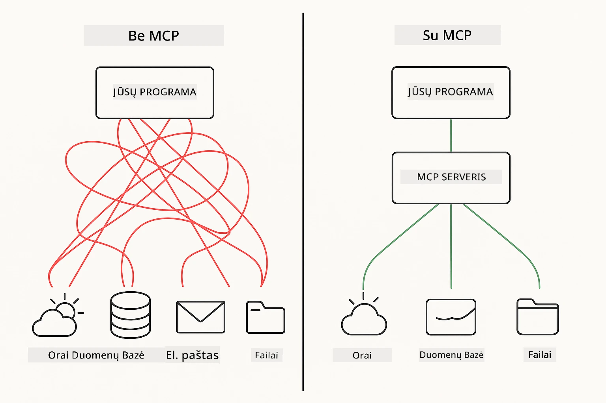
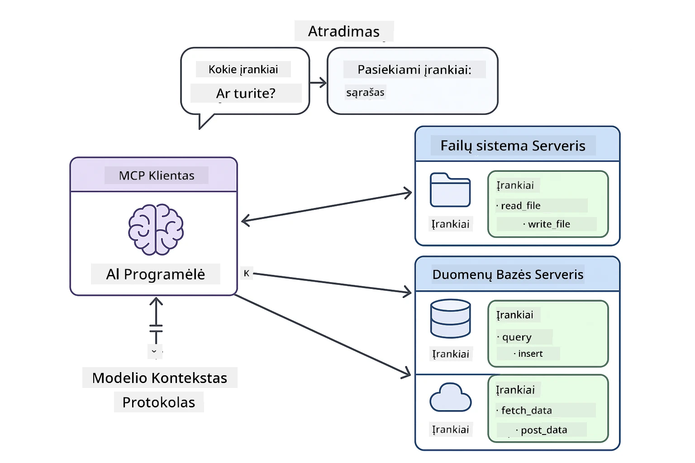
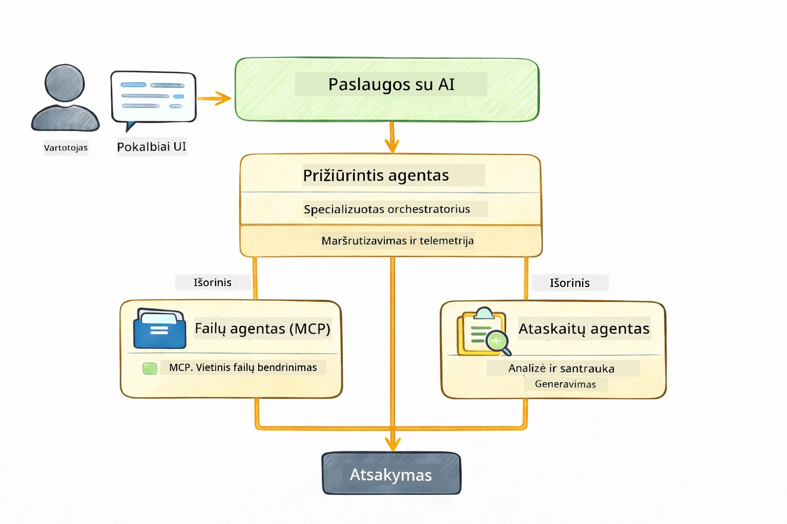

<!--
CO_OP_TRANSLATOR_METADATA:
{
  "original_hash": "6c816d130a1fa47570c11907e72d84ae",
  "translation_date": "2026-01-06T01:48:41+00:00",
  "source_file": "05-mcp/README.md",
  "language_code": "lt"
}
-->
# Modulis 05: Modelio konteksto protokolas (MCP)

## Turinys

- [Ką išmoksite](../../../05-mcp)
- [Kas yra MCP?](../../../05-mcp)
- [Kaip veikia MCP](../../../05-mcp)
- [Agentinis modulis](../../../05-mcp)
- [Pavyzdžių paleidimas](../../../05-mcp)
  - [Reikalavimai](../../../05-mcp)
- [Greitas pradžia](../../../05-mcp)
  - [Failų operacijos (Stdio)](../../../05-mcp)
  - [Vyriausybinis agentas](../../../05-mcp)
    - [Išvesties supratimas](../../../05-mcp)
    - [Atsakymo strategijos](../../../05-mcp)
    - [Agentinio modulio funkcijų paaiškinimas](../../../05-mcp)
- [Pagrindinės sąvokos](../../../05-mcp)
- [Sveikiname!](../../../05-mcp)
  - [Kas toliau?](../../../05-mcp)

## Ką išmoksite

Jūs jau sukūrėte pokalbių AI, įvaldėte užklausas, pagrindėte atsakymus dokumentais ir sukūrėte agentus su įrankiais. Tačiau visi šie įrankiai buvo specialiai sukurti jūsų programai. O jeigu galėtumėte suteikti savo AI prieigą prie standartizuotos įrankių ekosistemos, kurią gali kurti ir dalintis bet kas? Šiame modulyje sužinosite, kaip tai padaryti su Modelio konteksto protokolu (MCP) ir LangChain4j agentiniu moduliu. Pirmiausia pristatysime paprastą MCP failų skaitytuvą, o paskui parodysime, kaip jis lengvai integruojamas į pažangius agentinius darbo srautus, naudojant Vyriausybinio agente modelį.

## Kas yra MCP?

Modelio konteksto protokolas (MCP) suteikia būtent tai – standartinį būdą AI programoms atrasti ir naudoti išorinius įrankius. Vietoje to, kad rašytumėte specialias integracijas kiekvienam duomenų šaltiniui ar paslaugai, jūs jungiatės prie MCP serverių, kurie pateikia savo galimybes vientisu formatu. Jūsų AI agentas tada automatiškai atranda ir naudoja šiuos įrankius.



*Prieš MCP: sudėtingos taško su tašku integracijos. Po MCP: vienas protokolas, begalinės galimybės.*

MCP sprendžia fundamentalią problemą AI kūrime: kiekviena integracija yra speciali. Norite prieiti prie GitHub? Specialus kodas. Norite skaityti failus? Specialus kodas. Norite užklausinėti duomenų bazę? Specialus kodas. Ir nė viena iš šių integracijų neveikia su kitomis AI programomis.

MCP tai standartizuoja. MCP serveris pateikia įrankius su aiškiomis aprašomis ir schemomis. Bet kuris MCP klientas gali prisijungti, atrasti prieinamus įrankius ir juos naudoti. Sukurkite vieną kartą, naudokite visur.



*Modelio konteksto protokolo architektūra – standartizuotas įrankių atradimas ir vykdymas*

## Kaip veikia MCP

**Serverio-kliento architektūra**

MCP naudoja klientų-serverių modelį. Serveriai suteikia įrankius – failų skaitymui, duomenų bazių užklausoms, API kvietimams. Klientai (jūsų AI programa) jungiasi prie serverių ir naudoja jų įrankius.

Norint naudoti MCP su LangChain4j, pridėkite šį Maven priklausomybės elementą:

```xml
<dependency>
    <groupId>dev.langchain4j</groupId>
    <artifactId>langchain4j-mcp</artifactId>
    <version>${langchain4j.version}</version>
</dependency>
```

**Įrankių atradimas**

Kai jūsų klientas jungiasi prie MCP serverio, jis klausia: „Kokius įrankius turite?“ Serveris atsako įrankių sąrašu su aprašymais ir parametrų schemomis. Jūsų AI agentas tada gali nuspręsti, kuriuos įrankius naudoti pagal vartotojo užklausas.

**Perdavimo mechanizmai**

MCP palaiko įvairius perdavimo mechanizmus. Šiame modulyje demonstruojamas Stdio perdavimas vietiniams procesams:


*MCP perdavimo mechanizmai: HTTP nuotoliniams serveriams, Stdio vietiniams procesams*

**Stdio** - [StdioTransportDemo.java](../../../05-mcp/src/main/java/com/example/langchain4j/mcp/StdioTransportDemo.java)

Skirta vietiniams procesams. Jūsų programa paleidžia serverį kaip paklentinį procesą ir bendrauja per standartinį įvestį/išvestį. Naudinga prieigai prie failų sistemos arba komandų eilutės įrankiams.

```java
McpTransport stdioTransport = new StdioMcpTransport.Builder()
    .command(List.of(
        npmCmd, "exec",
        "@modelcontextprotocol/server-filesystem@2025.12.18",
        resourcesDir
    ))
    .logEvents(false)
    .build();
```

> **🤖 Išbandykite su [GitHub Copilot](https://github.com/features/copilot) pokalbių moduliu:** Atidarykite [`StdioTransportDemo.java`](../../../05-mcp/src/main/java/com/example/langchain4j/mcp/StdioTransportDemo.java) ir klauskite:
> - „Kaip veikia Stdio perdavimas ir kada jį naudoti vietoje HTTP?“
> - „Kaip LangChain4j valdo sukurtų MCP serverių procesų gyvenimo ciklą?“
> - „Kokios yra saugumo pasekmės suteikiant AI prieigą prie failų sistemos?“

## Agentinis modulis

Nors MCP suteikia standartizuotus įrankius, LangChain4j **agentinis modulis** suteikia deklaratyvų būdą kurti agentus, kurie koordinuoja tuos įrankius. `@Agent` anotacija ir `AgenticServices` leidžia apibrėžti agentų elgseną per sąsajas, o ne imperatyvų kodą.

Šiame modulyje susipažinsite su **Vyriausybinio agento** modeliu — pažangiu agentiniu AI požiūriu, kai „vyriausiasis“ agentas dinamiškai nusprendžia, kuriuos subagentus iškviesti, remdamasis vartotojo užklausomis. Abi sąvokas sujungsime suteikdami vienam subagentui MCP pagrindu veikiančias failų prieigos galimybes.

Norėdami naudoti agentinį modulį, pridėkite šį Maven priklausomybės elementą:

```xml
<dependency>
    <groupId>dev.langchain4j</groupId>
    <artifactId>langchain4j-agentic</artifactId>
    <version>${langchain4j.mcp.version}</version>
</dependency>
```

> **⚠️ Eksperimentinis:** `langchain4j-agentic` modulis yra **eksperimentinis** ir gali keistis. Stabilus būdas kurti AI padėjėjus liko `langchain4j-core` su individualiais įrankiais (Modulis 04).

## Pavyzdžių paleidimas

### Reikalavimai

- Java 21+, Maven 3.9+
- Node.js 16+ ir npm (MCP serveriams)
- Aplinkos kintamieji sukonfigūruoti `.env` faile (pagrindiniame kataloge):
  - `AZURE_OPENAI_ENDPOINT`, `AZURE_OPENAI_API_KEY`, `AZURE_OPENAI_DEPLOYMENT` (kaip Moduliuose 01–04)

> **Pastaba:** Jei dar nesukonfigūravote aplinkos kintamųjų, žr. [Modulis 00 – Greitas pradžia](../00-quick-start/README.md) instrukcijas arba nukopijuokite `.env.example` į `.env` pagrindiniame kataloge ir užpildykite savo reikšmes.

## Greitas pradžia

**Naudojant VS Code:** Tiesiog dešiniuoju pelės klavišu spustelėkite bet kurį demonstracinį failą Explorer'e ir pasirinkite **„Run Java“**, arba naudokite paleidimo konfigūracijas Run and Debug skiltyje (įsitikinkite, kad prieš tai pridėjote savo tokeną į `.env` failą).

**Naudojant Maven:** Alternatyviai, galite paleisti pavyzdžius iš komandų eilutės pagal žemiau pateiktus pavyzdžius.

### Failų operacijos (Stdio)

Tai demonstruoja vietinius paklotinius procesų pagrindu veikiančius įrankius.

**✅ Nereikia jokių papildomų reikalavimų** – MCP serveris paleidžiamas automatiškai.

**Naudojant paleidimo skriptus (rekomenduojama):**

Paleidimo skriptai automatiškai įkrauna aplinkos kintamuosius iš pagrindinio `.env` failo:

**Bash:**
```bash
cd 05-mcp
chmod +x start-stdio.sh
./start-stdio.sh
```

**PowerShell:**
```powershell
cd 05-mcp
.\start-stdio.ps1
```

**Naudojant VS Code:** Dešiniuoju pelės klavišu spustelėkite `StdioTransportDemo.java` ir pasirinkite **„Run Java“** (įsitikinkite, kad jūsų `.env` failas sukonfigūruotas).

Programa automatiškai paleidžia MCP failų sistemos serverį ir skaito vietinį failą. Atkreipkite dėmesį, kaip valdomas paklotinio proceso valdymas.

**Tikėtina išvestis:**
```
Assistant response: The file provides an overview of LangChain4j, an open-source Java library
for integrating Large Language Models (LLMs) into Java applications...
```

### Vyriausybinis agentas

**Vyriausybinio agento modelis** yra **lanksti** agentinio AI forma. Vyriausiasis agentas naudoja LLM, kad autonomiškai nuspręstų, kuriuos agentus iškviesti pagal vartotojo užklausą. Kitame pavyzdyje sujungiame MCP pagrindu veikiančią failų prieigą su LLM agentu, kad sukurtume prižiūrimo failų skaitymo → ataskaitos darbo srautą.

Demo programoje `FileAgent` skaito failą naudodamas MCP failų sistemos įrankius, o `ReportAgent` generuoja struktūruotą ataskaitą su vykdomuoju santrauka (1 sakinis), 3 pagrindiniais punktais ir rekomendacijomis. Vyriausiasis agentas automatiškai koordinuoja šį procesą:



```
┌─────────────┐      ┌──────────────┐
│  FileAgent  │ ───▶ │ ReportAgent  │
│ (MCP tools) │      │  (pure LLM)  │
└─────────────┘      └──────────────┘
   outputKey:           outputKey:
  'fileContent'         'report'
```

Kiekvienas agentas saugo savo išvestį **Agentiniame kontekste** (bendroje atmintyje), leidžiančiame žemyn srautui esančioms agentams pasiekti ankstesnius rezultatus. Tai parodo, kaip MCP įrankiai sklandžiai integruojami į agentinius darbo srautus – Vyriausiasis agentas neturi žinoti *kaip* skaitomi failai, tik kad `FileAgent` tai gali padaryti.

#### Demo paleidimas

Paleidimo skriptai automatiškai įkrauna aplinkos kintamuosius iš pagrindinio `.env` failo:

**Bash:**
```bash
cd 05-mcp
chmod +x start-supervisor.sh
./start-supervisor.sh
```

**PowerShell:**
```powershell
cd 05-mcp
.\start-supervisor.ps1
```

**Naudojant VS Code:** Dešiniuoju pelės klavišu spustelėkite `SupervisorAgentDemo.java` ir pasirinkite **„Run Java“** (įsitikinkite, kad jūsų `.env` failas sukonfigūruotas).

#### Kaip veikia Vyriausiasis

```java
// 1 žingsnis: FileAgent skaito failus naudodamas MCP įrankius
FileAgent fileAgent = AgenticServices.agentBuilder(FileAgent.class)
        .chatModel(model)
        .toolProvider(mcpToolProvider)  // Turi MCP įrankius failų operacijoms
        .build();

// 2 žingsnis: ReportAgent generuoja struktūrizuotas ataskaitas
ReportAgent reportAgent = AgenticServices.agentBuilder(ReportAgent.class)
        .chatModel(model)
        .build();

// Prižiūrėtojas koordinuoja failų → ataskaitos srautą
SupervisorAgent supervisor = AgenticServices.supervisorBuilder()
        .chatModel(model)
        .subAgents(fileAgent, reportAgent)
        .responseStrategy(SupervisorResponseStrategy.LAST)  // Grąžina galutinę ataskaitą
        .build();

// Prižiūrėtojas nusprendžia, kuriuos agentus iškviesti pagal užklausą
String response = supervisor.invoke("Read the file at /path/file.txt and generate a report");
```

#### Atsakymo strategijos

Konfigūruodami `SupervisorAgent`, nurodote, kaip jis turėtų formuluoti galutinį atsakymą vartotojui, kai subagentai baigia užduotis. Galimos strategijos:

| Strategija | Aprašymas |
|------------|-----------|
| **LAST** | Vyriausiasis grąžina paskutinio subagento ar įrankio išvestį. Tai naudinga, kai paskutinis darbo srauto agentas yra specialiai sukurtas pateikti galutinį atsakymą (pvz., „Santraukos agentas“ tyrimų grandinėje). |
| **SUMMARY** | Vyriausiasis naudoja savo vidinį kalbos modelį (LLM), kad sintetintų visos sąveikos ir visų subagentų išvesties santrauką ir pateikia ją kaip galutinį atsakymą. Tai suteikia aiškų, suvestinį atsakymą vartotojui. |
| **SCORED** | Sistema naudoja vidinį LLM, kad įvertintų tiek PASKUTINĮ atsakymą, tiek SANTRAUKĄ pagal pradinę vartotojo užklausą ir grąžina aukštesnį balą gavusią išvestį. |

Pilną įgyvendinimą rasite [SupervisorAgentDemo.java](../../../05-mcp/src/main/java/com/example/langchain4j/mcp/SupervisorAgentDemo.java).

> **🤖 Išbandykite su [GitHub Copilot](https://github.com/features/copilot) pokalbių moduliu:** Atidarykite [`SupervisorAgentDemo.java`](../../../05-mcp/src/main/java/com/example/langchain4j/mcp/SupervisorAgentDemo.java) ir klauskite:
> - „Kaip Vyriausiasis nusprendžia, kuriuos agentus iškviesti?“
> - „Kuo skiriasi Vyriausiojo ir Sekvencinio darbo srautų modeliai?“
> - „Kaip galiu suasmeninti Vyriausiojo planavimo elgesį?“

#### Išvesties supratimas

Paleidę demo pamatysite struktūruotą paaiškinimą, kaip Vyriausiasis koordinuoja kelis agentus. Štai ką reiškia kiekviena dalis:

```
======================================================================
  FILE → REPORT WORKFLOW DEMO
======================================================================

This demo shows a clear 2-step workflow: read a file, then generate a report.
The Supervisor orchestrates the agents automatically based on the request.
```

**Antraštė** pristato darbo srauto koncepciją: fokusuotas procesas nuo failo skaitymo iki ataskaitos generavimo.

```
--- WORKFLOW ---------------------------------------------------------
  ┌─────────────┐      ┌──────────────┐
  │  FileAgent  │ ───▶ │ ReportAgent  │
  │ (MCP tools) │      │  (pure LLM)  │
  └─────────────┘      └──────────────┘
   outputKey:           outputKey:
   'fileContent'        'report'

--- AVAILABLE AGENTS -------------------------------------------------
  [FILE]   FileAgent   - Reads files via MCP → stores in 'fileContent'
  [REPORT] ReportAgent - Generates structured report → stores in 'report'
```

**Darbo srauto diagrama** rodo duomenų srautą tarp agentų. Kiekvienas agentas turi specifinę rolę:
- **FileAgent** skaito failus su MCP įrankiais ir saugo žalią turinį `fileContent`
- **ReportAgent** naudoja tą turinį ir generuoja struktūruotą ataskaitą `report`

```
--- USER REQUEST -----------------------------------------------------
  "Read the file at .../file.txt and generate a report on its contents"
```

**Vartotojo užklausa** rodo užduotį. Vyriausiasis ją analizuoja ir nusprendžia iškviesti FileAgent → ReportAgent.

```
--- SUPERVISOR ORCHESTRATION -----------------------------------------
  The Supervisor decides which agents to invoke and passes data between them...

  +-- STEP 1: Supervisor chose -> FileAgent (reading file via MCP)
  |
  |   Input: .../file.txt
  |
  |   Result: LangChain4j is an open-source, provider-agnostic Java framework for building LLM...
  +-- [OK] FileAgent (reading file via MCP) completed

  +-- STEP 2: Supervisor chose -> ReportAgent (generating structured report)
  |
  |   Input: LangChain4j is an open-source, provider-agnostic Java framew...
  |
  |   Result: Executive Summary...
  +-- [OK] ReportAgent (generating structured report) completed
```

**Vyriausiojo koordinavimas** demonstruoja 2 žingsnių srautą:
1. **FileAgent** skaito failą per MCP ir saugo turinį
2. **ReportAgent** gauna turinį ir generuoja struktūruotą ataskaitą

Vyriausiasis priėmė šiuos sprendimus **autonomiškai** pagal vartotojo užklausą.

```
--- FINAL RESPONSE ---------------------------------------------------
Executive Summary
...

Key Points
...

Recommendations
...

--- AGENTIC SCOPE (Data Flow) ----------------------------------------
  Each agent stores its output for downstream agents to consume:
  * fileContent: LangChain4j is an open-source, provider-agnostic Java framework...
  * report: Executive Summary...
```

#### Agentinio modulio funkcijų paaiškinimas

Pavyzdyje demonstruojamos kelios pažangios agentinio modulio funkcijos. Pažvelkime atidžiau į Agentinį kontekstą ir Agentų klausytojus.

**Agentinis kontekstas** rodo bendrą atmintį, kur agentai saugojo rezultatus naudodami `@Agent(outputKey="...")`. Tai leidžia:
- Vėlesniems agentams pasiekti ankstesnių agentų išvestis
- Vyriausiajam sintetinti galutinį atsakymą
- Jums peržiūrėti, ką kiekvienas agentas sukūrė

```java
ResultWithAgenticScope<String> result = supervisor.invokeWithAgenticScope(request);
AgenticScope scope = result.agenticScope();
String fileContent = scope.readState("fileContent");  // Neapdoroti failo duomenys iš FileAgent
String report = scope.readState("report");            // Struktūruota ataskaita iš ReportAgent
```

**Agentų klausytojai** leidžia stebėti ir derinti agentų vykdymą. Žingsnis po žingsnio išvestis demo gaunama iš AgentListener, kuris prijungtas prie kiekvieno agentų kvietimo:
- **beforeAgentInvocation** – iškviečiamas, kai Vyriausiasis pasirenka agentą, leidžiantis matyti pasirinktą agentą ir priežastį
- **afterAgentInvocation** – iškviečiamas po agento užbaigimo, rodantis jo rezultatą
- **inheritedBySubagents** – jei true, klausytojas stebi visus agentus hierarchijoje

```java
AgentListener monitor = new AgentListener() {
    private int step = 0;
    
    @Override
    public void beforeAgentInvocation(AgentRequest request) {
        step++;
        System.out.println("  +-- STEP " + step + ": " + request.agentName());
    }
    
    @Override
    public void afterAgentInvocation(AgentResponse response) {
        System.out.println("  +-- [OK] " + response.agentName() + " completed");
    }
    
    @Override
    public boolean inheritedBySubagents() {
        return true; // Plėtoti visiems subagentams
    }
};
```

Be Vyriausiojo modelio, `langchain4j-agentic` modulis suteikia keletą galingų darbo srautų modelių ir funkcijų:

| Modelis | Aprašymas | Panaudojimo atvejis |
|---------|-----------|---------------------|
| **Sekvencinis** | Vykdo agentus iš eilės, išvestis perduodama kitam | Pogrindžiai: tyrimai → analizė → ataskaita |
| **Paralelinis** | Vykdo agentus vienu metu | Nepriklausomos užduotys: oras + naujienos + akcijos |
| **Ciklas** | Kartojama, kol įvykdoma sąlyga | Kokybės vertinimas: tobulinti, kol balas ≥ 0,8 |
| **Sąlyginis** | Maršrutizuoja pagal sąlygas | Klasifikavimas → maršrutavimas specialistui |
| **Žmogus procese** | Prideda žmogaus patvirtinimus | Patvirtinimo darbo srautai, turinio peržiūra |

## Pagrindinės sąvokos

Dabar, kai susipažinote su MCP ir agentiniu moduliu praktikoje, apibendrinkime, kada naudoti kiekvieną požiūrį.

**MCP** yra idealus, kai norite panaudoti esamas įrankių ekosistemas, kurti įrankius, kuriais gali naudotis keli aplikacijos, integruoti trečiųjų šalių paslaugas naudojant standartinius protokolus arba keičiant įrankių implementacijas nekeisti kodo.

**Agentinis modulis** tinka, kai norite deklaratyviai apibrėžti agentus su `@Agent` anotacijomis, jums reikalinga darbo srautų koordinacija (sekinis, ciklas, paralelinis), pageidaujate agentų projektavimo pagal sąsajas vietoje imperatyvaus kodo arba kuriate kelis agentus, kurie dalijasi rezultatais per `outputKey`.

**Vyriausiojo agento modelis** išsiskiria, kai darbo srautas iš anksto nenuspėjamas ir norite, kad LLM spręstų, kai turite daugybę specializuotų agentų, kuriuos reikia dinamiškai koordinuoti, kai kuriate pokalbių sistemas, maršrutizuojančias į skirtingas funkcijas, arba kai norite lanksčiausio, adaptatyviausio agentinio elgesio.
## Sveikiname!

Jūs baigėte LangChain4j pradedantiesiems kursą. Jūs sužinojote:

- Kaip kurti pokalbių dirbtinį intelektą su atmintimi (01 modulis)
- Užklausų kūrimo šablonus skirtingoms užduotims (02 modulis)
- Atsakymų pagrindimą jūsų dokumentuose naudojant RAG (03 modulis)
- Pagrindinių DI agentų (asistentų) kūrimą su pasirinktiniais įrankiais (04 modulis)
- Standartizuotų įrankių integravimą su LangChain4j MCP ir Agentic moduliais (05 modulis)

### Kas toliau?

Baigę modulius, patikrinkite [Testavimo vadovą](../docs/TESTING.md), kad pamatytumėte LangChain4j testavimo koncepcijas veiksme.

**Oficialūs ištekliai:**
- [LangChain4j dokumentacija](https://docs.langchain4j.dev/) – Išsamūs vadovai ir API nuorodos
- [LangChain4j GitHub](https://github.com/langchain4j/langchain4j) – Šaltinio kodas ir pavyzdžiai
- [LangChain4j pamokos](https://docs.langchain4j.dev/tutorials/) – Žingsnis po žingsnio pamokos įvairiems naudojimo atvejams

Dėkojame, kad baigėte šį kursą!

---

**Navigacija:** [← Ankstesnis: 04 modulis - Įrankiai](../04-tools/README.md) | [Atgal į pradžią](../README.md)

---

<!-- CO-OP TRANSLATOR DISCLAIMER START -->
**Atsakomybės apribojimas**:  
Šis dokumentas buvo išverstas naudojant dirbtinio intelekto vertimo paslaugą [Co-op Translator](https://github.com/Azure/co-op-translator). Nors stengiamės užtikrinti tikslumą, atkreipkite dėmesį, kad automatiniai vertimai gali turėti klaidų ar netikslumų. Originalus dokumentas jo gimtąja kalba turėtų būti laikomas pagrindiniu ir autoritetingu šaltiniu. Svarbiai informacijai rekomenduojama naudoti profesionalaus žmogaus vertimą. Mes neatsakome už jokius nesusipratimus ar neteisingus aiškinimus, kilusius dėl šio vertimo naudojimo.
<!-- CO-OP TRANSLATOR DISCLAIMER END -->