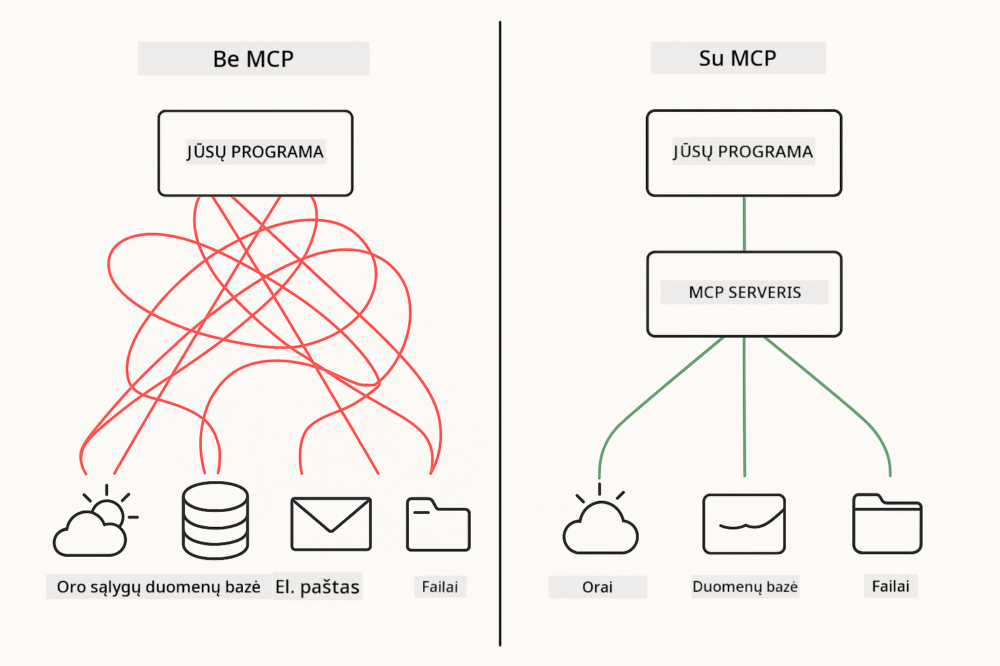
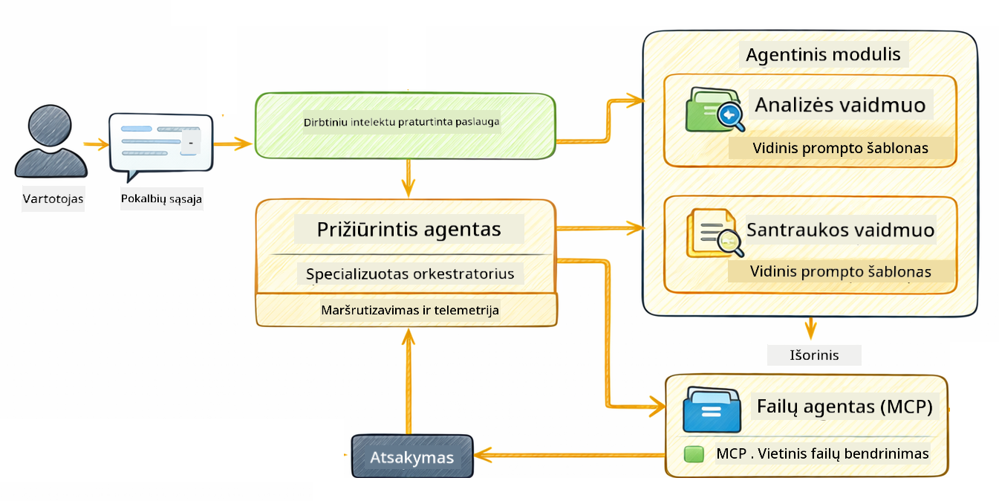

<!--
CO_OP_TRANSLATOR_METADATA:
{
  "original_hash": "f89f4c106d110e4943c055dd1a2f1dff",
  "translation_date": "2025-12-31T06:36:32+00:00",
  "source_file": "05-mcp/README.md",
  "language_code": "lt"
}
-->
# Modulis 05: Model Context Protocol (MCP)

## Turinys

- [Ką sužinosite](../../../05-mcp)
- [Kas yra MCP?](../../../05-mcp)
- [Kaip veikia MCP](../../../05-mcp)
- [Agentinis modulis](../../../05-mcp)
- [Pavyzdžių vykdymas](../../../05-mcp)
  - [Prieš sąlygos](../../../05-mcp)
- [Greitas startas](../../../05-mcp)
  - [Failų operacijos (Stdio)](../../../05-mcp)
  - [Supervisor agentas](../../../05-mcp)
    - [Išvesties supratimas](../../../05-mcp)
    - [Agentinio modulio funkcijų paaiškinimas](../../../05-mcp)
- [Pagrindinės sąvokos](../../../05-mcp)
- [Sveikiname!](../../../05-mcp)
  - [Kas toliau?](../../../05-mcp)

## Ką sužinosite

Jūs sukūrėte pokalbinę dirbtinį intelektą, įvaldėte užklausų (prompt) kūrimą, susiejote atsakymus su dokumentais ir sukūrėte agentus su įrankiais. Tačiau visi tie įrankiai buvo kuriami individualiai jūsų konkrečiai programai. O jeigu galėtumėte suteikti savo DI prieigą prie standartizuotos įrankių ekosistemos, kurią bet kas gali sukurti ir bendrinti? Šiame modulyje sužinosite, kaip tai padaryti su Model Context Protocol (MCP) ir LangChain4j agentiniu moduliu. Pirmiausia parodysime paprastą MCP failų skaitytuvą, o tada parodysime, kaip jis lengvai integruojamas į pažangias agentines darbo eigas naudojant Supervisor Agent šabloną.

## Kas yra MCP?

Model Context Protocol (MCP) suteikia būtent tai – standartizuotą būdą DI programėlėms atrasti ir naudoti išorinius įrankius. Vietoj to, kad rašytumėte pasirinktines integracijas kiekvienam duomenų šaltiniui ar paslaugai, jungiatės prie MCP serverių, kurie nuosekliai atskleidžia savo galimybes. Jūsų DI agentas tada gali automatiškai atrasti ir naudoti šiuos įrankius.



*Prieš MCP: sudėtingos taškų tarpusavio integracijos. Po MCP: vienas protokolas, begalė galimybių.*

MCP sprendžia esminę problemą DI kūrime: kiekviena integracija yra unikali. Norite pasiekti GitHub? Reikia pasirinktinio kodo. Norite skaityti failus? Pasirinktinis kodas. Norite užklausinėti duomenų bazę? Pasirinktinis kodas. Ir nė viena iš šių integracijų neveikia su kitomis DI programėlėmis.

MCP standartizuoja šį procesą. MCP serveris pateikia įrankius su aiškiais aprašymais ir schemomis. Bet kuris MCP klientas gali prisijungti, atrasti turimus įrankius ir juos naudoti. Sukurkite vieną kartą, naudokite visur.


*Model Context Protocol architektūra – standartizuotas įrankių atradimas ir vykdymas*

## Kaip veikia MCP

**Serverio-kliento architektūra**

MCP naudoja kliento ir serverio modelį. Serveriai teikia įrankius – failų skaitymą, duomenų bazių užklausas, API kvietimus. Klientai (jūsų DI programėlė) prisijungia prie serverių ir naudoja jų įrankius.

Norėdami naudoti MCP su LangChain4j, pridėkite šį Maven priklausomybės aprašą:

```xml
<dependency>
    <groupId>dev.langchain4j</groupId>
    <artifactId>langchain4j-mcp</artifactId>
    <version>${langchain4j.version}</version>
</dependency>
```

**Įrankių atradimas**

Kai jūsų klientas prisijungia prie MCP serverio, jis klausia "Kokius įrankius turite?" Serveris atsako su turimų įrankių sąrašu, kiekvienam pateikdamas aprašymus ir parametrų schemas. Jūsų DI agentas tada gali nuspręsti, kuriuos įrankius naudoti pagal vartotojo užklausas.

**Transporto mechanizmai**

MCP palaiko skirtingus transporto mechanizmus. Šis modulis demonstruoja Stdio transportą vietiniams procesams:


*MCP transporto mechanizmai: HTTP nuotoliniams serveriams, Stdio vietiniams procesams*

**Stdio** - [StdioTransportDemo.java](../../../05-mcp/src/main/java/com/example/langchain4j/mcp/StdioTransportDemo.java)

Skirta vietiniams procesams. Jūsų programėlė sukuria serverį kaip subprocess'ą ir bendrauja per standartinį įvestį/išvestį. Naudinga failų sistemos prieigai arba komandinei eilutei skirtoms priemonėms.

```java
McpTransport stdioTransport = new StdioMcpTransport.Builder()
    .command(List.of(
        npmCmd, "exec",
        "@modelcontextprotocol/server-filesystem@2025.12.18",
        resourcesDir
    ))
    .logEvents(false)
    .build();
```

> **🤖 Išbandykite su [GitHub Copilot](https://github.com/features/copilot) Pokalbis:** Atverkite [`StdioTransportDemo.java`](../../../05-mcp/src/main/java/com/example/langchain4j/mcp/StdioTransportDemo.java) ir užduokite:
> - "Kaip veikia Stdio transportas ir kada turėčiau jį naudoti vietoje HTTP?"
> - "Kaip LangChain4j valdo gimusių MCP serverio procesų ciklą?"
> - "Kokios yra saugumo pasekmės suteikiant DI prieigą prie failų sistemos?"

## Agentinis modulis

Nors MCP teikia standartizuotus įrankius, LangChain4j **agentinis modulis** suteikia deklaratyvų būdą kurti agentus, kurie koordinuoja tuos įrankius. Anotacija `@Agent` ir `AgenticServices` leidžia apibrėžti agento elgseną per sąsajas, o ne imperatyvų kodą.

Šiame modulyje ištirsite **Supervisor Agent** šabloną — pažangų agentinį DI požiūrį, kuriame „supervizorius“ agentas dinamiškai nusprendžia, kuriuos subagentus iškviesti pagal vartotojo užklausas. Mes suderinsime abu koncepcijas, suteikdami vienam iš mūsų subagentų MCP pagrįstą failų prieigą.

Norėdami naudoti agentinį modulį, pridėkite šį Maven priklausomybės aprašą:

```xml
<dependency>
    <groupId>dev.langchain4j</groupId>
    <artifactId>langchain4j-agentic</artifactId>
    <version>${langchain4j.mcp.version}</version>
</dependency>
```

> **⚠️ Eksperimentinis:** modulis `langchain4j-agentic` yra **eksperimentinis** ir gali keistis. Stabilus būdas kurti DI asistentus išlieka `langchain4j-core` su pasirinktinais įrankiais (Modulis 04).

## Pavyzdžių vykdymas

### Prieš sąlygos

- Java 21+, Maven 3.9+
- Node.js 16+ ir npm (MCP serveriams)
- Aplinkos kintamieji sukonfigūruoti `.env` faile (iš projekto šaknies):
  - **StdioTransportDemo atveju:** `GITHUB_TOKEN` (GitHub personalus prieigos raktas)
  - **SupervisorAgentDemo atveju:** `AZURE_OPENAI_ENDPOINT`, `AZURE_OPENAI_API_KEY`, `AZURE_OPENAI_DEPLOYMENT` (tas pats kaip Moduliuose 01–04)

> **Pastaba:** Jei dar nesukonfigūravote aplinkos kintamųjų, žr. [Module 00 - Quick Start](../00-quick-start/README.md) instrukcijas arba nukopijuokite `.env.example` į `.env` projekto šaknyje ir užpildykite reikšmes.

## Greitas startas

**Naudojant VS Code:** Tiesiog dešiniuoju pelės mygtuku spustelėkite bet kurį demonstracinį failą Explorer lange ir pasirinkite **"Run Java"**, arba naudokite paleidimo konfigūracijas Run and Debug panelėje (įsitikinkite, kad pridėjote savo raktą į `.env` failą pirmiausia).

**Naudojant Maven:** Alternatyviai, galite paleisti iš komandų eilutės su žemiau pateiktais pavyzdžiais.

### Failų operacijos (Stdio)

Tai demonstruoja vietinius, per subprocess veikiančius įrankius.

**✅ Nereikia papildomų sąlygų** - MCP serveris paleidžiamas automatiškai.

**Naudojant VS Code:** Dešiniuoju pelės mygtuku spustelėkite `StdioTransportDemo.java` ir pasirinkite **"Run Java"**.

**Naudojant Maven:**

**Bash:**
```bash
export GITHUB_TOKEN=your_token_here
cd 05-mcp
mvn compile exec:java -Dexec.mainClass=com.example.langchain4j.mcp.StdioTransportDemo
```

**PowerShell:**
```powershell
$env:GITHUB_TOKEN=your_token_here
cd 05-mcp
mvn --% compile exec:java -Dexec.mainClass=com.example.langchain4j.mcp.StdioTransportDemo
```

Programėlė automatiškai paleidžia failų sistemos MCP serverį ir skaito vietinį failą. Atkreipkite dėmesį, kaip subprocess valdymas atliekamas už jus.

**Tikėtina išvestis:**
```
Assistant response: The file provides an overview of LangChain4j, an open-source Java library
for integrating Large Language Models (LLMs) into Java applications...
```

### Supervisor agentas




**Supervisor Agent** šablonas yra **lanksti** agentinio DI forma. Skirtingai nei deterministinės darbo eigos (sekvenčinės, ciklinės, lygiagretės), Supervisor naudoja LLM autonomiškai nuspręsti, kuriuos agentus iškviesti pagal vartotojo užklausą.

**Supervisor ir MCP derinimas:** šiame pavyzdyje mes suteikiame `FileAgent` prieigą prie MCP failų sistemos įrankių per `toolProvider(mcpToolProvider)`. Kai vartotojas prašo „perskaityti ir analizuoti failą“, Supervisor analizuoja užklausą ir sukuria vykdymo planą. Tada jis nukreipia užklausą `FileAgent`, kuris naudoja MCP `read_file` įrankį failo turiniui gauti. Supervisor perduoda tą turinį `AnalysisAgent` interpretacijai ir, pasirinktinai, kviečia `SummaryAgent`, kad sutrumpintų rezultatus.

Tai demonstruoja, kaip MCP įrankiai sklandžiai integruojami į agentines darbo eigas — Supervisor neturi žinoti, *kaip* failai yra skaitomi, tik tai, kad `FileAgent` gali tai atlikti. Supervisor dinamiškai prisitaiko prie skirtingų užklausų tipų ir gražina arba paskutinio agente gautą atsakymą, arba visų operacijų santrauką.

**Naudojant paleidimo skriptus (rekomenduojama):**

Paleidimo skriptai automatiškai įkelia aplinkos kintamuosius iš `.env` failo projekto šaknyje:

**Bash:**
```bash
cd 05-mcp
chmod +x start.sh
./start.sh
```

**PowerShell:**
```powershell
cd 05-mcp
.\start.ps1
```

**Naudojant VS Code:** Dešiniuoju pelės mygtuku spustelėkite `SupervisorAgentDemo.java` ir pasirinkite **"Run Java"** (įsitikinkite, kad jūsų `.env` failas sukonfigūruotas).

**Kaip veikia Supervisor:**

```java
// Apibrėžkite kelis agentus su konkrečiomis galimybėmis
FileAgent fileAgent = AgenticServices.agentBuilder(FileAgent.class)
        .chatModel(model)
        .toolProvider(mcpToolProvider)  // Turi MCP įrankius failų operacijoms
        .build();

AnalysisAgent analysisAgent = AgenticServices.agentBuilder(AnalysisAgent.class)
        .chatModel(model)
        .build();

SummaryAgent summaryAgent = AgenticServices.agentBuilder(SummaryAgent.class)
        .chatModel(model)
        .build();

// Sukurkite prižiūrėtoją, kuris koordinuoja šiuos agentus
SupervisorAgent supervisor = AgenticServices.supervisorBuilder()
        .chatModel(model)  // "planner" modelis
        .subAgents(fileAgent, analysisAgent, summaryAgent)
        .responseStrategy(SupervisorResponseStrategy.SUMMARY)
        .build();

// Prižiūrėtojas autonomiškai nusprendžia, kuriuos agentus iškviesti
// Tiesiog pateikite natūralios kalbos užklausą - LLM suplanuos vykdymą
String response = supervisor.invoke("Read the file at /path/file.txt and analyze it");
```

Peržiūrėkite [SupervisorAgentDemo.java](../../../05-mcp/src/main/java/com/example/langchain4j/mcp/SupervisorAgentDemo.java) pilnai implementacijai.

> **🤖 Išbandykite su [GitHub Copilot](https://github.com/features/copilot) Pokalbis:** Atverkite [`SupervisorAgentDemo.java`](../../../05-mcp/src/main/java/com/example/langchain4j/mcp/SupervisorAgentDemo.java) ir užduokite:
> - "Kaip Supervisor nusprendžia, kuriuos agentus iškviesti?"
> - "Kuo Supervisor skiriasi nuo sekvencinio darbo eigos šablonų?"
> - "Kaip galiu pritaikyti Supervisor planavimo elgseną?"

#### Išvesties supratymas

Kai paleidžiate demonstracinę versiją, pamatysite struktūruotą žingsnių aprašymą, kaip Supervisor koordinuoja kelis agentus. Štai ką reiškia kiekviena dalis:

```
======================================================================
  SUPERVISOR AGENT DEMO
======================================================================

This demo shows how a Supervisor Agent orchestrates multiple specialized agents.
The Supervisor uses an LLM to decide which agent to call based on the task.
```

**Antraštė** pristato demonstraciją ir paaiškina pagrindinę idėją: Supervisor naudoja LLM (ne iš anksto užkoduotas taisykles) nuspręsti, kuriuos agentus iškviesti.

```
--- AVAILABLE AGENTS -------------------------------------------------
  [FILE]     FileAgent     - Reads files using MCP filesystem tools
  [ANALYZE]  AnalysisAgent - Analyzes content for structure, tone, and themes
  [SUMMARY]  SummaryAgent  - Creates concise summaries of content
```

**Turimi agentai** rodo tris specializuotus agentus, kuriuos Supervisor gali pasirinkti. Kiekvienas agentas turi specifinę galimybę:
- **FileAgent** gali skaityti failus naudodamas MCP įrankius (išorinė galimybė)
- **AnalysisAgent** analizuoja turinį (grynai LLM galimybė)
- **SummaryAgent** kuria santraukas (grynai LLM galimybė)

```
--- USER REQUEST -----------------------------------------------------
  "Read the file at .../file.txt and analyze what it's about"
```

**Vartotojo užklausa** rodo, kas buvo paprašyta. Supervisor turi išanalizuoti tai ir nuspręsti, kuriuos agentus iškviesti.

```
--- SUPERVISOR ORCHESTRATION -----------------------------------------
  The Supervisor will now decide which agents to invoke and in what order...

  +-- STEP 1: Supervisor chose -> FileAgent (reading file via MCP)
  |
  |   Input: .../file.txt
  |
  |   Result: LangChain4j is an open-source Java library designed to simplify...
  +-- [OK] FileAgent (reading file via MCP) completed

  +-- STEP 2: Supervisor chose -> AnalysisAgent (analyzing content)
  |
  |   Input: LangChain4j is an open-source Java library...
  |
  |   Result: Structure: The content is organized into clear paragraphs that int...
  +-- [OK] AnalysisAgent (analyzing content) completed
```

**Supervisor orkestracija** yra vieta, kur vyksta magija. Stebėkite, kaip:
1. Supervisor **pirmiausia pasirinko FileAgent**, nes užklausoje buvo paminėta „perskaityti failą“
2. FileAgent panaudojo MCP `read_file` įrankį failo turiniui gauti
3. Tada Supervisor **pasirinko AnalysisAgent** ir perdavė jam failo turinį
4. AnalysisAgent analizavo struktūrą, toną ir temas

Atkreipkite dėmesį, kad Supervisor **autonomiškai** priėmė šiuos sprendimus pagal vartotojo užklausą — be iš anksto užkoduotos darbo eigos!

**Galutinis atsakymas** yra Supervisor sukirstas atsakymas, derinantis visų iškviestų agentų išvestis. Pavyzdyje atspausdinama agentinė sritis, rodanti santrauką ir analizės rezultatus, kuriuos įrašė kiekvienas agentas.

```
--- FINAL RESPONSE ---------------------------------------------------
I read the contents of the file and analyzed its structure, tone, and key themes.
The file introduces LangChain4j as an open-source Java library for integrating
large language models...

--- AGENTIC SCOPE (Shared Memory) ------------------------------------
  Agents store their results in a shared scope for other agents to use:
  * summary: LangChain4j is an open-source Java library...
  * analysis: Structure: The content is organized into clear paragraphs that in...
```

### Agentinio modulio funkcijų paaiškinimas

Pavyzdyje demonstruojamos kelios pažangios agentinio modulio funkcijos. Pažiūrėkime atidžiau Agentic Scope ir Agent Listeners.

**Agentinė sritis (Agentic Scope)** parodo bendrą atmintį, kur agentai saugojo savo rezultatus naudodami `@Agent(outputKey="...")`. Tai leidžia:
- Vėlesniems agentams pasiekti ankstesnių agentų išvestis
- Supervisor sintetizuoti galutinį atsakymą
- Jums patikrinti, ką pagamino kiekvienas agentas

```java
ResultWithAgenticScope<String> result = supervisor.invokeWithAgenticScope(request);
AgenticScope scope = result.agenticScope();
String story = scope.readState("story");
List<AgentInvocation> history = scope.agentInvocations("analysisAgent");
```

**Agentų klausytojai (Agent Listeners)** įgalina agentų vykdymo stebėjimą ir derinimą. Žingsnis po žingsnio išvestis, kurią matote demonstracijoje, gaunama iš AgentListener, kuris prisijungia prie kiekvieno agentų kvietimo:
- **beforeAgentInvocation** - Iškviečiama, kai Supervisor pasirenka agentą, leidžiant pamatyti, kuris agentas buvo pasirinktas ir kodėl
- **afterAgentInvocation** - Iškviečiama, kai agentas baigia darbą, rodant jo rezultatą
- **inheritedBySubagents** - Kai true, klausytojas stebi visus agentus hierarchijoje

```java
AgentListener monitor = new AgentListener() {
    private int step = 0;
    
    @Override
    public void beforeAgentInvocation(AgentRequest request) {
        step++;
        System.out.println("  +-- STEP " + step + ": " + request.agentName());
    }
    
    @Override
    public void afterAgentInvocation(AgentResponse response) {
        System.out.println("  +-- [OK] " + response.agentName() + " completed");
    }
    
    @Override
    public boolean inheritedBySubagents() {
        return true; // Paskleisti visiems subagentams
    }
};
```

Be Supervisor šablono, `langchain4j-agentic` modulis teikia keletą galingų darbo eigos šablonų ir funkcijų:

| Pattern | Description | Use Case |
|---------|-------------|----------|
| **Sequential** | Execute agents in order, output flows to next | Pipelines: research → analyze → report |
| **Parallel** | Run agents simultaneously | Independent tasks: weather + news + stocks |
| **Loop** | Iterate until condition met | Quality scoring: refine until score ≥ 0.8 |
| **Conditional** | Route based on conditions | Classify → route to specialist agent |
| **Human-in-the-Loop** | Add human checkpoints | Approval workflows, content review |

## Pagrindinės sąvokos

**MCP** yra idealus, kai norite pasinaudoti esamomis įrankių ekosistemomis, kurti įrankius, kuriais gali dalytis kelios programos, integruoti trečiųjų šalių paslaugas su standartiniais protokolais arba pakeisti įrankių implementacijas nekeisdami kodo.

**Agentinis modulis** geriausiai tinka, kai norite deklaratyvių agentų apibrėžimų su `@Agent` anotacijomis, reikia darbo eigos orkestracijos (sekvencinės, ciklinės, lygiagrės), teikiate pirmenybę sąsajomis pagrįstam agentų dizainui vietoje imperatyvaus kodo arba derinate kelis agentus, kurie dalijasi išvestimis per `outputKey`.

**Supervisor Agent** šablonas išsiskiria, kai darbo eiga nėra nuspėjama iš anksto ir norite, kad LLM nuspręstų, kai turite kelis specializuotus agentus, kuriems reikia dinamiškos orkestracijos, kai kuriate pokalbines sistemas, nukreipiančias į skirtingas galimybes, arba kai norite lanksčiausio, adaptuojamo agento elgesio.

## Sveikiname!

Jūs baigėte LangChain4j pradedantiesiems kursą. Jūs sužinojote:

- Kaip kurti pokalbinį DI su atmintimi (Modulis 01)
- Užklausų kūrimo (prompt engineering) šablonus skirtingiems uždaviniams (Modulis 02)
- Atsakymų susiejimą su dokumentais naudojant RAG (Modulis 03)
- Pagrindinių DI agentų (asistentų) kūrimą su pasirinktinais įrankiais (Modulis 04)
- Integracija standartizuotų įrankių su LangChain4j MCP ir Agentic moduliais (Modulis 05)

### Kas toliau?

Baigę modulius, peržvelkite [Testavimo vadovą](../docs/TESTING.md), kad pamatytumėte LangChain4j testavimo koncepcijas veiksme.

**Oficialūs ištekliai:**
- [LangChain4j Dokumentacija](https://docs.langchain4j.dev/) - Išsamūs vadovai ir API referencija
- [LangChain4j GitHub](https://github.com/langchain4j/langchain4j) - Šaltinio kodas ir pavyzdžiai
- [LangChain4j Pamokos](https://docs.langchain4j.dev/tutorials/) - Žingsnis po žingsnio pamokos įvairiems naudojimo atvejams

Ačiū, kad baigėte šį kursą!

---

**Navigacija:** [← Ankstesnis: Modulis 04 - Įrankiai](../04-tools/README.md) | [Atgal į pagrindinį](../README.md)

---

<!-- CO-OP TRANSLATOR DISCLAIMER START -->
**Atsakomybės pareiškimas**:
Šis dokumentas buvo išverstas naudojant dirbtinio intelekto vertimo paslaugą [Co-op Translator](https://github.com/Azure/co-op-translator). Nors siekiame užtikrinti tikslumą, atkreipkite dėmesį, kad automatizuoti vertimai gali turėti klaidų ar netikslumų. Originalus dokumentas jo gimtąja kalba turėtų būti laikomas autoritetingu šaltiniu. Esant kritinei informacijai, rekomenduojamas profesionalus žmogaus vertimas. Mes neatsakome už bet kokius nesusipratimus ar neteisingas interpretacijas, kilusias dėl šio vertimo naudojimo.
<!-- CO-OP TRANSLATOR DISCLAIMER END -->