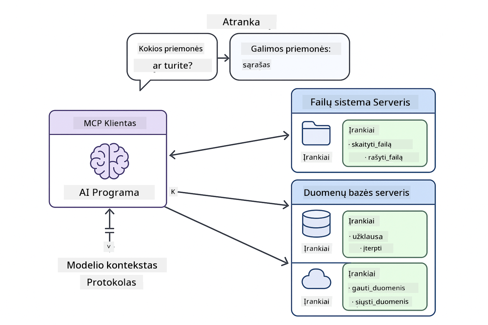

<!--
CO_OP_TRANSLATOR_METADATA:
{
  "original_hash": "c25ec1f10ef156c53e190cdf8b0711ab",
  "translation_date": "2025-12-13T18:11:07+00:00",
  "source_file": "05-mcp/README.md",
  "language_code": "lt"
}
-->
# 05 modulis: Modelio konteksto protokolas (MCP)

## Turinys

- [Ko išmoksite](../../../05-mcp)
- [MCP supratimas](../../../05-mcp)
- [Kaip veikia MCP](../../../05-mcp)
  - [Serverio-kliento architektūra](../../../05-mcp)
  - [Įrankių atranka](../../../05-mcp)
  - [Perdavimo mechanizmai](../../../05-mcp)
- [Reikalavimai](../../../05-mcp)
- [Ką apima šis modulis](../../../05-mcp)
- [Greitas pradėjimas](../../../05-mcp)
  - [Pavyzdys 1: Nuotolinis skaičiuotuvas (Streamable HTTP)](../../../05-mcp)
  - [Pavyzdys 2: Failų operacijos (Stdio)](../../../05-mcp)
  - [Pavyzdys 3: Git analizė (Docker)](../../../05-mcp)
- [Pagrindinės sąvokos](../../../05-mcp)
  - [Perdavimo pasirinkimas](../../../05-mcp)
  - [Įrankių atranka](../../../05-mcp)
  - [Sesijos valdymas](../../../05-mcp)
  - [Kryžminio platformų suderinamumas](../../../05-mcp)
- [Kada naudoti MCP](../../../05-mcp)
- [MCP ekosistema](../../../05-mcp)
- [Sveikiname!](../../../05-mcp)
  - [Kas toliau?](../../../05-mcp)
- [Trikčių šalinimas](../../../05-mcp)

## Ko išmoksite

Jūs sukūrėte pokalbių AI, įvaldėte užklausas, pagrindėte atsakymus dokumentuose ir sukūrėte agentus su įrankiais. Tačiau visi tie įrankiai buvo specialiai sukurti jūsų konkrečiai programai. O jei galėtumėte suteikti savo AI prieigą prie standartizuotos įrankių ekosistemos, kurią gali kurti ir dalintis bet kas?

Modelio konteksto protokolas (MCP) suteikia būtent tai – standartinį būdą AI programoms atrasti ir naudoti išorinius įrankius. Vietoj to, kad rašytumėte specialias integracijas kiekvienam duomenų šaltiniui ar paslaugai, jūs jungiatės prie MCP serverių, kurie savo galimybes pateikia nuoseklia forma. Jūsų AI agentas tada gali automatiškai atrasti ir naudoti šiuos įrankius.


*Prieš MCP: sudėtingos taškas į tašką integracijos. Po MCP: vienas protokolas, begalinės galimybės.*

## MCP supratimas

MCP sprendžia pagrindinę AI kūrimo problemą: kiekviena integracija yra individuali. Norite pasiekti GitHub? Reikia specialaus kodo. Norite skaityti failus? Specialus kodas. Norite užklausti duomenų bazę? Specialus kodas. Ir nė viena iš šių integracijų neveikia su kitomis AI programomis.

MCP tai standartizuoja. MCP serveris pateikia įrankius su aiškiais aprašymais ir schemomis. Bet kuris MCP klientas gali prisijungti, atrasti prieinamus įrankius ir juos naudoti. Sukurkite vieną kartą, naudokite visur.



*Modelio konteksto protokolo architektūra – standartizuota įrankių atranka ir vykdymas*

## Kaip veikia MCP

**Serverio-kliento architektūra**

MCP naudoja kliento-serverio modelį. Serveriai teikia įrankius – failų skaitymą, duomenų bazių užklausas, API kvietimus. Klientai (jūsų AI programa) jungiasi prie serverių ir naudoja jų įrankius.

**Įrankių atranka**

Kai jūsų klientas jungiasi prie MCP serverio, jis klausia „Kokius įrankius turite?“ Serveris atsako su prieinamų įrankių sąrašu, kiekvienas su aprašymais ir parametrų schemomis. Jūsų AI agentas tada gali nuspręsti, kuriuos įrankius naudoti pagal vartotojo užklausas.

**Perdavimo mechanizmai**

MCP apibrėžia du perdavimo mechanizmus: HTTP nuotoliniams serveriams, Stdio vietiniams procesams (įskaitant Docker konteinerius):


*MCP perdavimo mechanizmai: HTTP nuotoliniams serveriams, Stdio vietiniams procesams (įskaitant Docker konteinerius)*

**Streamable HTTP** – [StreamableHttpDemo.java](../../../05-mcp/src/main/java/com/example/langchain4j/mcp/StreamableHttpDemo.java)

Skirta nuotoliniams serveriams. Jūsų programa siunčia HTTP užklausas serveriui, kuris veikia kažkur tinkle. Naudoja Server-Sent Events realaus laiko komunikacijai.

```java
McpTransport httpTransport = new StreamableHttpMcpTransport.Builder()
    .url("http://localhost:3001/mcp")
    .timeout(Duration.ofSeconds(60))
    .logRequests(true)
    .logResponses(true)
    .build();
```

> **🤖 Išbandykite su [GitHub Copilot](https://github.com/features/copilot) pokalbiu:** Atidarykite [`StreamableHttpDemo.java`](../../../05-mcp/src/main/java/com/example/langchain4j/mcp/StreamableHttpDemo.java) ir paklauskite:
> - „Kaip MCP skiriasi nuo tiesioginės įrankių integracijos, kaip 04 modulyje?“
> - „Kokie yra MCP naudojimo privalumai dalijantis įrankiais tarp programų?“
> - „Kaip tvarkyti ryšio gedimus ar laiko limitus su MCP serveriais?“

**Stdio** – [StdioTransportDemo.java](../../../05-mcp/src/main/java/com/example/langchain4j/mcp/StdioTransportDemo.java)

Skirta vietiniams procesams. Jūsų programa paleidžia serverį kaip subprocess ir bendrauja per standartinį įvestį/išvestį. Naudinga failų sistemai ar komandų eilutės įrankiams.

```java
McpTransport stdioTransport = new StdioMcpTransport.Builder()
    .command(List.of(
        npmCmd, "exec",
        "@modelcontextprotocol/server-filesystem@0.6.2",
        resourcesDir
    ))
    .logEvents(false)
    .build();
```

> **🤖 Išbandykite su [GitHub Copilot](https://github.com/features/copilot) pokalbiu:** Atidarykite [`StdioTransportDemo.java`](../../../05-mcp/src/main/java/com/example/langchain4j/mcp/StdioTransportDemo.java) ir paklauskite:
> - „Kaip veikia Stdio perdavimas ir kada jį naudoti vietoje HTTP?“
> - „Kaip LangChain4j valdo MCP serverių procesų gyvavimo ciklą?“
> - „Kokios yra saugumo pasekmės suteikiant AI prieigą prie failų sistemos?“

**Docker (naudoja Stdio)** – [GitRepositoryAnalyzer.java](../../../05-mcp/src/main/java/com/example/langchain4j/mcp/GitRepositoryAnalyzer.java)

Skirta konteinerizuotoms paslaugoms. Naudoja stdio perdavimą bendrauti su Docker konteineriu per `docker run`. Tinka sudėtingoms priklausomybėms ar izoliuotoms aplinkoms.

```java
McpTransport dockerTransport = new StdioMcpTransport.Builder()
    .command(List.of(
        "docker", "run",
        "-e", "GITHUB_PERSONAL_ACCESS_TOKEN=" + System.getenv("GITHUB_TOKEN"),
        "-v", volumeMapping,
        "-i", "mcp/git"
    ))
    .logEvents(true)
    .build();
```

> **🤖 Išbandykite su [GitHub Copilot](https://github.com/features/copilot) pokalbiu:** Atidarykite [`GitRepositoryAnalyzer.java`](../../../05-mcp/src/main/java/com/example/langchain4j/mcp/GitRepositoryAnalyzer.java) ir paklauskite:
> - „Kaip Docker perdavimas izoliuoja MCP serverius ir kokie yra privalumai?“
> - „Kaip konfigūruoti tūrio prijungimus duomenų dalijimuisi tarp hosto ir MCP konteinerių?“
> - „Kokios yra geriausios praktikos valdant Docker pagrįstų MCP serverių gyvavimo ciklus gamyboje?“

## Pavyzdžių paleidimas

### Reikalavimai

- Java 21+, Maven 3.9+
- Node.js 16+ ir npm (MCP serveriams)
- **Docker Desktop** – turi būti **PALEISTAS** 3 pavyzdžiui (ne tik įdiegtas)
- GitHub asmeninis prieigos raktas sukonfigūruotas `.env` faile (iš 00 modulio)

> **Pastaba:** Jei dar nesukonfigūravote GitHub rakto, žr. [00 modulis – Greitas pradėjimas](../00-quick-start/README.md) instrukcijas.

> **⚠️ Docker vartotojams:** Prieš paleisdami 3 pavyzdį, patikrinkite, ar Docker Desktop veikia su `docker ps`. Jei matote ryšio klaidas, paleiskite Docker Desktop ir palaukite ~30 sekundžių, kol jis užsikraus.

## Greitas pradėjimas

**Naudojant VS Code:** Tiesiog dešiniuoju pelės mygtuku spustelėkite bet kurį demonstracinį failą Explorer lange ir pasirinkite **„Run Java“**, arba naudokite paleidimo konfigūracijas Run and Debug skydelyje (įsitikinkite, kad pirmiausia pridėjote savo raktą į `.env` failą).

**Naudojant Maven:** Taip pat galite paleisti iš komandinės eilutės su žemiau pateiktais pavyzdžiais.

**⚠️ Svarbu:** Kai kurie pavyzdžiai turi reikalavimus (pvz., paleisti MCP serverį ar sukurti Docker atvaizdus). Prieš paleisdami patikrinkite kiekvieno pavyzdžio reikalavimus.

### Pavyzdys 1: Nuotolinis skaičiuotuvas (Streamable HTTP)

Tai demonstruoja tinklo pagrindu veikiančią įrankių integraciją.

**⚠️ Reikalavimas:** Pirmiausia turite paleisti MCP serverį (žr. 1 terminalą žemiau).

**1 terminalas – paleiskite MCP serverį:**

**Bash:**
```bash
git clone https://github.com/modelcontextprotocol/servers.git
cd servers/src/everything
npm install
node dist/streamableHttp.js
```

**PowerShell:**
```powershell
git clone https://github.com/modelcontextprotocol/servers.git
cd servers/src/everything
npm install
node dist/streamableHttp.js
```

**2 terminalas – paleiskite pavyzdį:**

**Naudojant VS Code:** Dešiniuoju pelės mygtuku spustelėkite `StreamableHttpDemo.java` ir pasirinkite **„Run Java“**.

**Naudojant Maven:**

**Bash:**
```bash
export GITHUB_TOKEN=your_token_here
cd 05-mcp
mvn compile exec:java -Dexec.mainClass=com.example.langchain4j.mcp.StreamableHttpDemo
```

**PowerShell:**
```powershell
$env:GITHUB_TOKEN=your_token_here
cd 05-mcp
mvn --% compile exec:java -Dexec.mainClass=com.example.langchain4j.mcp.StreamableHttpDemo
```

Stebėkite, kaip agentas atranda prieinamus įrankius, tada naudoja skaičiuotuvą sudėčiai atlikti.

### Pavyzdys 2: Failų operacijos (Stdio)

Tai demonstruoja vietinius subprocess pagrindu veikiančius įrankius.

**✅ Nereikia jokių reikalavimų** – MCP serveris paleidžiamas automatiškai.

**Naudojant VS Code:** Dešiniuoju pelės mygtuku spustelėkite `StdioTransportDemo.java` ir pasirinkite **„Run Java“**.

**Naudojant Maven:**

**Bash:**
```bash
export GITHUB_TOKEN=your_token_here
cd 05-mcp
mvn compile exec:java -Dexec.mainClass=com.example.langchain4j.mcp.StdioTransportDemo
```

**PowerShell:**
```powershell
$env:GITHUB_TOKEN=your_token_here
cd 05-mcp
mvn --% compile exec:java -Dexec.mainClass=com.example.langchain4j.mcp.StdioTransportDemo
```

Programa automatiškai paleidžia failų sistemos MCP serverį ir skaito vietinį failą. Atkreipkite dėmesį, kaip valdomas subprocess procesas.

**Tikėtinas išvestis:**
```
Assistant response: The content of the file is "Kaboom!".
```

### Pavyzdys 3: Git analizė (Docker)

Tai demonstruoja konteinerizuotus įrankių serverius.

**⚠️ Reikalavimai:** 
1. **Docker Desktop turi būti PALEISTAS** (ne tik įdiegtas)
2. **Windows vartotojams:** rekomenduojama WSL 2 režimas (Docker Desktop Settings → General → „Use the WSL 2 based engine“). Hyper-V režimas reikalauja rankinio failų dalijimosi konfigūracijos.
3. Pirmiausia turite sukurti Docker atvaizdą (žr. 1 terminalą žemiau)

**Patikrinkite, ar Docker veikia:**

**Bash:**
```bash
docker ps  # Turėtų rodyti konteinerių sąrašą, o ne klaidą
```

**PowerShell:**
```powershell
docker ps  # Turėtų rodyti konteinerių sąrašą, o ne klaidą
```

Jei matote klaidą „Cannot connect to Docker daemon“ arba „The system cannot find the file specified“, paleiskite Docker Desktop ir palaukite, kol jis užsikraus (~30 sekundžių).

**Trikčių šalinimas:**
- Jei AI praneša apie tuščią saugyklą arba nėra failų, tūrio prijungimas (`-v`) neveikia.
- **Windows Hyper-V vartotojams:** pridėkite projekto katalogą į Docker Desktop Settings → Resources → File sharing, tada paleiskite Docker Desktop iš naujo.
- **Rekomenduojamas sprendimas:** pereikite į WSL 2 režimą automatiškam failų dalijimuisi (Settings → General → įjunkite „Use the WSL 2 based engine“).

**1 terminalas – sukurkite Docker atvaizdą:**

**Bash:**
```bash
cd servers/src/git
docker build -t mcp/git .
```

**PowerShell:**
```powershell
cd servers/src/git
docker build -t mcp/git .
```

**2 terminalas – paleiskite analizatorių:**

**Naudojant VS Code:** Dešiniuoju pelės mygtuku spustelėkite `GitRepositoryAnalyzer.java` ir pasirinkite **„Run Java“**.

**Naudojant Maven:**

**Bash:**
```bash
export GITHUB_TOKEN=your_token_here
cd 05-mcp
mvn compile exec:java -Dexec.mainClass=com.example.langchain4j.mcp.GitRepositoryAnalyzer
```

**PowerShell:**
```powershell
$env:GITHUB_TOKEN=your_token_here
cd 05-mcp
mvn --% compile exec:java -Dexec.mainClass=com.example.langchain4j.mcp.GitRepositoryAnalyzer
```

Programa paleidžia Docker konteinerį, prijungia jūsų saugyklą ir per AI agentą analizuoja saugyklos struktūrą bei turinį.

## Pagrindinės sąvokos

**Perdavimo pasirinkimas**

Pasirinkite pagal tai, kur gyvena jūsų įrankiai:
- Nuotolinės paslaugos → Streamable HTTP
- Vietinė failų sistema → Stdio
- Sudėtingos priklausomybės → Docker

**Įrankių atranka**

MCP klientai automatiškai atranda prieinamus įrankius prisijungdami. Jūsų AI agentas mato įrankių aprašymus ir nusprendžia, kuriuos naudoti pagal vartotojo užklausą.

**Sesijos valdymas**

Streamable HTTP perdavimas palaiko sesijas, leidžiančias valdyti būseną su nuotoliniais serveriais. Stdio ir Docker perdavimai paprastai yra bevalstės.

**Kryžminio platformų suderinamumas**

Pavyzdžiai automatiškai tvarko platformų skirtumus (Windows vs Unix komandų skirtumai, kelių konvertavimas Docker). Tai svarbu gamybos diegimams skirtingose aplinkose.

## Kada naudoti MCP

**Naudokite MCP, kai:**
- Norite pasinaudoti esamomis įrankių ekosistemomis
- Kuriate įrankius, kuriuos naudos kelios programos
- Integruojate trečiųjų šalių paslaugas su standartiniais protokolais
- Reikia keisti įrankių įgyvendinimus be kodo pakeitimų

**Naudokite specialius įrankius (04 modulis), kai:**
- Kuriate programai specifines funkcijas
- Svarbus našumas (MCP prideda papildomą sluoksnį)
- Jūsų įrankiai yra paprasti ir nebus pakartotinai naudojami
- Reikia visiškos kontrolės vykdymo procese

## MCP ekosistema

Modelio konteksto protokolas yra atviras standartas su augančia ekosistema:

- Oficialūs MCP serveriai dažnoms užduotims (failų sistema, Git, duomenų bazės)
- Bendruomenės prisidėti serveriai įvairioms paslaugoms
- Standartizuoti įrankių aprašymai ir schemos
- Kryžminis suderinamumas su bet kuriuo MCP klientu

Ši standartizacija reiškia, kad įrankiai, sukurti vienai AI programai, veikia ir su kitomis, sukuriant bendrą galimybių ekosistemą.

## Sveikiname!

Jūs baigėte LangChain4j pradedančiųjų kursą. Išmokote:

- Kaip kurti pokalbių AI su atmintimi (01 modulis)
- Užklausų inžinerijos šablonus skirtingoms užduotims (02 modulis)
- Atsakymų pagrindimą dokumentuose su RAG (03 modulis)
- AI agentų kūrimą su specialiais įrankiais (04 modulis)
- Standartizuotų įrankių integravimą per MCP (05 modulis)

Dabar turite pagrindą kurti gamybos AI programas. Išmoktos sąvokos taikomos nepriklausomai nuo konkrečių karkasų ar modelių – tai pagrindiniai AI inžinerijos šablonai.

### Kas toliau?

Baigę modulius, peržiūrėkite [Testavimo vadovą](../docs/TESTING.md), kad pamatytumėte LangChain4j testavimo koncepcijas veikiant.

**Oficialūs ištekliai:**
- [LangChain4j dokumentacija](https://docs.langchain4j.dev/) – Išsamūs vadovai ir API nuorodos
- [LangChain4j GitHub](https://github.com/langchain4j/langchain4j) – Šaltinio kodas ir pavyzdžiai
- [LangChain4j pamokos](https://docs.langchain4j.dev/tutorials/) – Žingsnis po žingsnio pamokos įvairiems naudojimo atvejams

Dėkojame, kad baigėte šį kursą!

---

**Navigacija:** [← Ankstesnis: 04 modulis – Įrankiai](../04-tools/README.md) | [Atgal į pradžią](../README.md)

---

## Trikčių šalinimas

### PowerShell Maven komandos sintaksė
**Problema**: Maven komandos nepavyksta su klaida `Unknown lifecycle phase ".mainClass=..."`

**Priežastis**: PowerShell interpretuoja `=` kaip kintamojo priskyrimo operatorių, todėl Maven savybių sintaksė sugadinama

**Sprendimas**: Naudokite stop-parsing operatorių `--%` prieš Maven komandą:

**PowerShell:**
```powershell
mvn --% compile exec:java -Dexec.mainClass=com.example.langchain4j.mcp.StreamableHttpDemo
```

**Bash:**
```bash
mvn compile exec:java -Dexec.mainClass=com.example.langchain4j.mcp.StreamableHttpDemo
```

Operatorius `--%` nurodo PowerShell perduoti visus likusius argumentus pažodžiui Maven be interpretacijos.

### Docker ryšio problemos

**Problema**: Docker komandos nepavyksta su klaida "Cannot connect to Docker daemon" arba "The system cannot find the file specified"

**Priežastis**: Docker Desktop neveikia arba nėra pilnai inicijuotas

**Sprendimas**: 
1. Paleiskite Docker Desktop
2. Palaukite apie 30 sekundžių pilnai inicijacijai
3. Patikrinkite su `docker ps` (turėtų parodyti konteinerių sąrašą, o ne klaidą)
4. Tada paleiskite savo pavyzdį

### Windows Docker tūrio prijungimas

**Problema**: Git saugyklos analizatorius rodo tuščią saugyklą arba nėra failų

**Priežastis**: Tūrio prijungimas (`-v`) neveikia dėl failų dalijimosi konfigūracijos

**Sprendimas**:
- **Rekomenduojama:** Perjunkite į WSL 2 režimą (Docker Desktop Settings → General → "Use the WSL 2 based engine")
- **Alternatyva (Hyper-V):** Pridėkite projekto katalogą į Docker Desktop Settings → Resources → File sharing, tada perkraukite Docker Desktop

---

<!-- CO-OP TRANSLATOR DISCLAIMER START -->
**Atsakomybės apribojimas**:  
Šis dokumentas buvo išverstas naudojant dirbtinio intelekto vertimo paslaugą [Co-op Translator](https://github.com/Azure/co-op-translator). Nors stengiamės užtikrinti tikslumą, prašome atkreipti dėmesį, kad automatiniai vertimai gali turėti klaidų ar netikslumų. Originalus dokumentas jo gimtąja kalba turėtų būti laikomas autoritetingu šaltiniu. Svarbiai informacijai rekomenduojamas profesionalus žmogaus vertimas. Mes neatsakome už bet kokius nesusipratimus ar neteisingus aiškinimus, kylančius dėl šio vertimo naudojimo.
<!-- CO-OP TRANSLATOR DISCLAIMER END -->