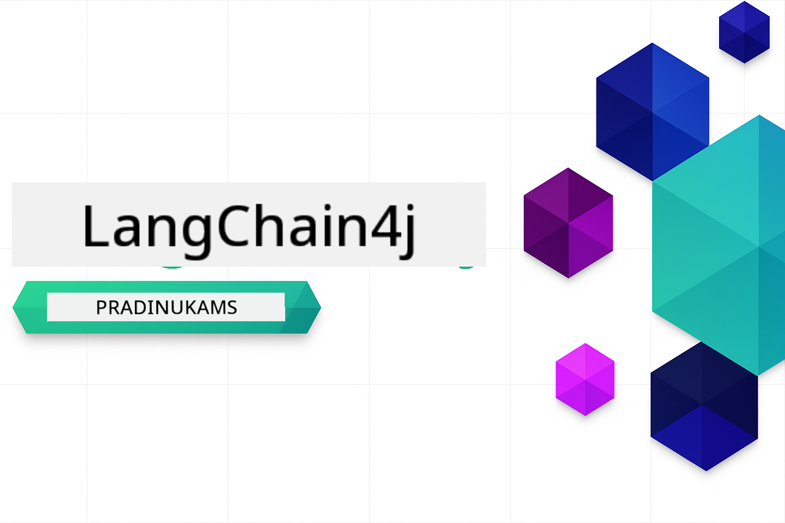

<!--
CO_OP_TRANSLATOR_METADATA:
{
  "original_hash": "d1499d1abf7e653e94fde35644629500",
  "translation_date": "2025-12-18T10:28:00+00:00",
  "source_file": "README.md",
  "language_code": "lt"
}
-->


### 🌐 Daugiakalbė palaikymas

#### Palaikoma per GitHub Action (automatizuota ir visada atnaujinta)

<!-- CO-OP TRANSLATOR LANGUAGES TABLE START -->
[Arabic](../ar/README.md) | [Bengali](../bn/README.md) | [Bulgarian](../bg/README.md) | [Burmese (Myanmar)](../my/README.md) | [Chinese (Simplified)](../zh/README.md) | [Chinese (Traditional, Hong Kong)](../hk/README.md) | [Chinese (Traditional, Macau)](../mo/README.md) | [Chinese (Traditional, Taiwan)](../tw/README.md) | [Croatian](../hr/README.md) | [Czech](../cs/README.md) | [Danish](../da/README.md) | [Dutch](../nl/README.md) | [Estonian](../et/README.md) | [Finnish](../fi/README.md) | [French](../fr/README.md) | [German](../de/README.md) | [Greek](../el/README.md) | [Hebrew](../he/README.md) | [Hindi](../hi/README.md) | [Hungarian](../hu/README.md) | [Indonesian](../id/README.md) | [Italian](../it/README.md) | [Japanese](../ja/README.md) | [Kannada](../kn/README.md) | [Korean](../ko/README.md) | [Lithuanian](./README.md) | [Malay](../ms/README.md) | [Malayalam](../ml/README.md) | [Marathi](../mr/README.md) | [Nepali](../ne/README.md) | [Nigerian Pidgin](../pcm/README.md) | [Norwegian](../no/README.md) | [Persian (Farsi)](../fa/README.md) | [Polish](../pl/README.md) | [Portuguese (Brazil)](../br/README.md) | [Portuguese (Portugal)](../pt/README.md) | [Punjabi (Gurmukhi)](../pa/README.md) | [Romanian](../ro/README.md) | [Russian](../ru/README.md) | [Serbian (Cyrillic)](../sr/README.md) | [Slovak](../sk/README.md) | [Slovenian](../sl/README.md) | [Spanish](../es/README.md) | [Swahili](../sw/README.md) | [Swedish](../sv/README.md) | [Tagalog (Filipino)](../tl/README.md) | [Tamil](../ta/README.md) | [Telugu](../te/README.md) | [Thai](../th/README.md) | [Turkish](../tr/README.md) | [Ukrainian](../uk/README.md) | [Urdu](../ur/README.md) | [Vietnamese](../vi/README.md)
<!-- CO-OP TRANSLATOR LANGUAGES TABLE END -->

# LangChain4j pradedantiesiems

Kursas, skirtas kurti DI programas naudojant LangChain4j ir Azure OpenAI GPT-5, nuo pagrindinio pokalbio iki DI agentų.

**Naujas LangChain4j?** Peržiūrėkite [Žodyną](docs/GLOSSARY.md), kuriame pateikiamos pagrindinių terminų ir sąvokų apibrėžtys.

## Turinys

1. [Greitas pradžia](00-quick-start/README.md) – pradėkite naudotis LangChain4j
2. [Įvadas](01-introduction/README.md) – sužinokite LangChain4j pagrindus
3. [Užklausų kūrimas](02-prompt-engineering/README.md) – įvaldykite efektyvų užklausų dizainą
4. [RAG (Retrieval-Augmented Generation)](03-rag/README.md) – kurkite išmanias žinių sistemas
5. [Įrankiai](04-tools/README.md) – integruokite išorinius įrankius ir API su DI agentais
6. [MCP (Model Context Protocol)](05-mcp/README.md) – dirbkite su Model Context Protocol
---

## Mokymosi kelias

> **Greitas pradžia**

1. Padarykite šio saugyklos šaką (fork) savo GitHub paskyroje
2. Spustelėkite **Code** → skirtuką **Codespaces** → **...** → **New with options...**
3. Naudokite numatytuosius nustatymus – tai pasirinkti šiam kursui sukurtą kūrimo konteinerį
4. Spustelėkite **Create codespace**
5. Palaukite 5-10 minučių, kol aplinka bus paruošta
6. Tiesiogiai pereikite prie [Greitos pradžios](./00-quick-start/README.md) ir pradėkite!

> **Norite klonuoti vietoje?**
>
> Ši saugykla apima daugiau nei 50 kalbų vertimų, kurie žymiai padidina atsisiuntimo dydį. Norėdami klonuoti be vertimų, naudokite sparse checkout:
> ```bash
> git clone --filter=blob:none --sparse https://github.com/microsoft/LangChain4j-for-Beginners.git
> cd LangChain4j-for-Beginners
> git sparse-checkout set --no-cone '/*' '!translations' '!translated_images'
> ```
> Tai suteiks jums viską, ko reikia kursui baigti, su daug greitesniu atsisiuntimu.

Pradėkite nuo [Greitos pradžios](00-quick-start/README.md) modulio ir žingsnis po žingsnio tobulinkite savo įgūdžius. Išbandysite pagrindinius pavyzdžius, kad suprastumėte pagrindus, prieš pereidami prie [Įvado](01-introduction/README.md) modulio, kuriame gilinsitės į GPT-5.


Baigę modulius, peržiūrėkite [Testavimo vadovą](docs/TESTING.md), kad pamatytumėte LangChain4j testavimo koncepcijas veikiant.

> **Pastaba:** Šis mokymas naudoja tiek GitHub modelius, tiek Azure OpenAI. [Greitos pradžios](00-quick-start/README.md) ir [MCP](05-mcp/README.md) moduliai naudoja GitHub modelius (nereikia Azure prenumeratos), o moduliai 1-4 naudoja Azure OpenAI GPT-5.


## Mokymasis su GitHub Copilot

Norėdami greitai pradėti programuoti, atidarykite šį projektą GitHub Codespace arba savo vietinėje IDE su pateiktu devcontainer. Šiame kurse naudojamas devcontainer yra iš anksto sukonfigūruotas su GitHub Copilot DI poriniam programavimui.

Kiekviename kodo pavyzdyje yra siūlomų klausimų, kuriuos galite užduoti GitHub Copilot, kad gilintumėte supratimą. Ieškokite 💡/🤖 užuominų:

- **Java failų antraštėse** – klausimai, skirti kiekvienam pavyzdžiui
- **Modulių README** – tyrinėjimo užuominos po kodo pavyzdžių

**Kaip naudoti:** Atidarykite bet kurį kodo failą ir užduokite Copilot siūlomus klausimus. Jis turi visą kodo bazės kontekstą ir gali paaiškinti, išplėsti bei pasiūlyti alternatyvas.

Norite sužinoti daugiau? Peržiūrėkite [Copilot DI poriniam programavimui](https://aka.ms/GitHubCopilotAI).


## Papildomi ištekliai

<!-- CO-OP TRANSLATOR OTHER COURSES START -->
### LangChain
[](https://aka.ms/langchain4j-for-beginners)
[](https://aka.ms/langchainjs-for-beginners?WT.mc_id=m365-94501-dwahlin)

---

### Azure / Edge / MCP / Agentai
[](https://github.com/microsoft/AZD-for-beginners?WT.mc_id=academic-105485-koreyst)
[](https://github.com/microsoft/edgeai-for-beginners?WT.mc_id=academic-105485-koreyst)
[](https://github.com/microsoft/mcp-for-beginners?WT.mc_id=academic-105485-koreyst)
[](https://github.com/microsoft/ai-agents-for-beginners?WT.mc_id=academic-105485-koreyst)

---
 
### Generatyvinis DI serija
[](https://github.com/microsoft/generative-ai-for-beginners?WT.mc_id=academic-105485-koreyst)
[-9333EA?style=for-the-badge&labelColor=E5E7EB&color=9333EA)](https://github.com/microsoft/Generative-AI-for-beginners-dotnet?WT.mc_id=academic-105485-koreyst)
[-C084FC?style=for-the-badge&labelColor=E5E7EB&color=C084FC)](https://github.com/microsoft/generative-ai-for-beginners-java?WT.mc_id=academic-105485-koreyst)
[-E879F9?style=for-the-badge&labelColor=E5E7EB&color=E879F9)](https://github.com/microsoft/generative-ai-with-javascript?WT.mc_id=academic-105485-koreyst)

---
 
### Pagrindinis mokymasis
[](https://aka.ms/ml-beginners?WT.mc_id=academic-105485-koreyst)
[](https://aka.ms/datascience-beginners?WT.mc_id=academic-105485-koreyst)
[](https://aka.ms/ai-beginners?WT.mc_id=academic-105485-koreyst)
[](https://github.com/microsoft/Security-101?WT.mc_id=academic-96948-sayoung)
[](https://aka.ms/webdev-beginners?WT.mc_id=academic-105485-koreyst)
[](https://aka.ms/iot-beginners?WT.mc_id=academic-105485-koreyst)
[](https://github.com/microsoft/xr-development-for-beginners?WT.mc_id=academic-105485-koreyst)

---
 
### Copilot serija
[](https://aka.ms/GitHubCopilotAI?WT.mc_id=academic-105485-koreyst)
[](https://github.com/microsoft/mastering-github-copilot-for-dotnet-csharp-developers?WT.mc_id=academic-105485-koreyst)
[](https://github.com/microsoft/CopilotAdventures?WT.mc_id=academic-105485-koreyst)
<!-- CO-OP TRANSLATOR OTHER COURSES END -->

## Pagalbos gavimas

Jei įstringate arba turite klausimų apie AI programėlių kūrimą, prisijunkite prie:

[](https://aka.ms/foundry/discord)

Jei turite atsiliepimų apie produktą arba randate klaidų kūrimo metu, apsilankykite:

[](https://aka.ms/foundry/forum)

## Licencija

MIT licencija - detales žr. faile [LICENSE](../../LICENSE).

---

<!-- CO-OP TRANSLATOR DISCLAIMER START -->
**Atsakomybės apribojimas**:
Šis dokumentas buvo išverstas naudojant dirbtinio intelekto vertimo paslaugą [Co-op Translator](https://github.com/Azure/co-op-translator). Nors stengiamės užtikrinti tikslumą, prašome atkreipti dėmesį, kad automatiniai vertimai gali turėti klaidų ar netikslumų. Originalus dokumentas jo gimtąja kalba turėtų būti laikomas autoritetingu šaltiniu. Svarbiai informacijai rekomenduojamas profesionalus žmogaus vertimas. Mes neatsakome už bet kokius nesusipratimus ar neteisingus aiškinimus, kilusius dėl šio vertimo naudojimo.
<!-- CO-OP TRANSLATOR DISCLAIMER END -->