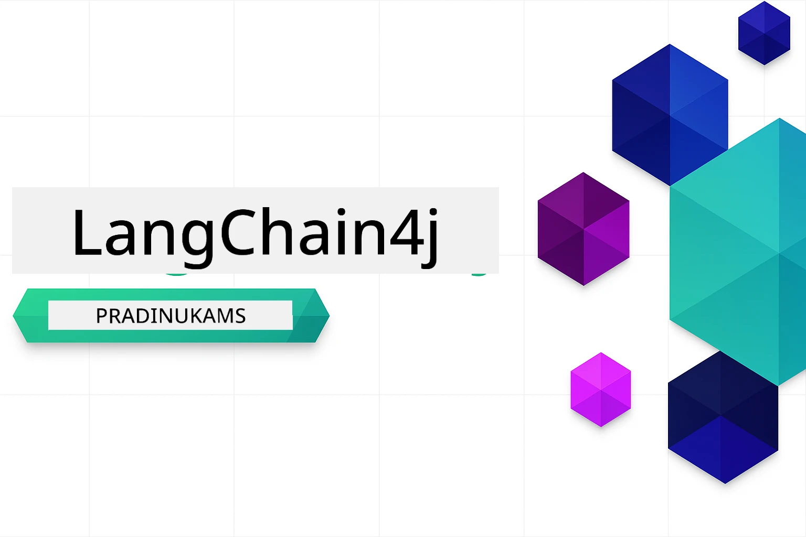

# LangChain4j pradedantiesiems

Kursas dirbant su AI programomis naudojant LangChain4j ir Azure OpenAI GPT-5.2 – nuo pagrindinio pokalbio iki AI agentų.

### 🌐 Daugiakalbė palaikymas

#### Palaikoma per GitHub Action (automatiškai ir visada atnaujinta)

<!-- CO-OP TRANSLATOR LANGUAGES TABLE START -->
[Arabic](../ar/README.md) | [Bengali](../bn/README.md) | [Bulgarian](../bg/README.md) | [Burmese (Myanmar)](../my/README.md) | [Chinese (Simplified)](../zh-CN/README.md) | [Chinese (Traditional, Hong Kong)](../zh-HK/README.md) | [Chinese (Traditional, Macau)](../zh-MO/README.md) | [Chinese (Traditional, Taiwan)](../zh-TW/README.md) | [Croatian](../hr/README.md) | [Czech](../cs/README.md) | [Danish](../da/README.md) | [Dutch](../nl/README.md) | [Estonian](../et/README.md) | [Finnish](../fi/README.md) | [French](../fr/README.md) | [German](../de/README.md) | [Greek](../el/README.md) | [Hebrew](../he/README.md) | [Hindi](../hi/README.md) | [Hungarian](../hu/README.md) | [Indonesian](../id/README.md) | [Italian](../it/README.md) | [Japanese](../ja/README.md) | [Kannada](../kn/README.md) | [Khmer](../km/README.md) | [Korean](../ko/README.md) | [Lithuanian](./README.md) | [Malay](../ms/README.md) | [Malayalam](../ml/README.md) | [Marathi](../mr/README.md) | [Nepali](../ne/README.md) | [Nigerian Pidgin](../pcm/README.md) | [Norwegian](../no/README.md) | [Persian (Farsi)](../fa/README.md) | [Polish](../pl/README.md) | [Portuguese (Brazil)](../pt-BR/README.md) | [Portuguese (Portugal)](../pt-PT/README.md) | [Punjabi (Gurmukhi)](../pa/README.md) | [Romanian](../ro/README.md) | [Russian](../ru/README.md) | [Serbian (Cyrillic)](../sr/README.md) | [Slovak](../sk/README.md) | [Slovenian](../sl/README.md) | [Spanish](../es/README.md) | [Swahili](../sw/README.md) | [Swedish](../sv/README.md) | [Tagalog (Filipino)](../tl/README.md) | [Tamil](../ta/README.md) | [Telugu](../te/README.md) | [Thai](../th/README.md) | [Turkish](../tr/README.md) | [Ukrainian](../uk/README.md) | [Urdu](../ur/README.md) | [Vietnamese](../vi/README.md)

> **Norite kopijuoti vietoje?**
>
> Šiame saugykloje yra daugiau nei 50 kalbų vertimų, dėl ko reikšmingai padidėja atsisiuntimo dydis. Norėdami kopijuoti be vertimų, naudokite laipsniuotą atsisiuntimą:
>
> **Bash / macOS / Linux:**
> ```bash
> git clone --filter=blob:none --sparse https://github.com/microsoft/LangChain4j-for-Beginners.git
> cd LangChain4j-for-Beginners
> git sparse-checkout set --no-cone '/*' '!translations' '!translated_images'
> ```
>
> **CMD (Windows):**
> ```cmd
> git clone --filter=blob:none --sparse https://github.com/microsoft/LangChain4j-for-Beginners.git
> cd LangChain4j-for-Beginners
> git sparse-checkout set --no-cone "/*" "!translations" "!translated_images"
> ```
>
> Tai suteiks viską, ko reikia kursui baigti, ir žymiai pagreitins atsisiuntimą.
<!-- CO-OP TRANSLATOR LANGUAGES TABLE END -->

## Turinys

1. [Įvadas](01-introduction/README.md) - Sužinokite LangChain4j pagrindus
2. [Užklausų kūrimas](02-prompt-engineering/README.md) - Įsisavinkite efektyvaus užklausų dizaino meną
3. [RAG (Retrieval-Augmented Generation)](03-rag/README.md) - Kurkite išmanias žinių sistemas
4. [Įrankiai](04-tools/README.md) - Integruokite išorinius įrankius ir paprastus asistentus
5. [MCP (Model Context Protocol)](05-mcp/README.md) - Dirbkite su Modelio konteksto protokolu (MCP) ir agentiniais moduliais

### Vaizdo įrašų vedliai

Kiekvienas modulis turi tiesioginę sesiją, kurioje žingsnis po žingsnio nagrinėjame sąvokas ir kodą.

| Modulis | Vaizdo įrašas |
|--------|-------|
| 01 - Įvadas | [Pradžia su LangChain4j](https://www.youtube.com/live/nl_troDm8rQ) |
| 02 - Užklausų kūrimas | [Užklausų kūrimas su LangChain4j](https://www.youtube.com/live/PJ6aBaE6bog) |
| 03 - RAG | [RAG su LangChain4j](https://www.youtube.com/watch?v=_olq75ZH_eY) |
| 04 - Įrankiai & 05 - MCP | [AI agentai su įrankiais ir MCP](https://www.youtube.com/watch?v=O_J30kZc0rw) |

---

## Mokymosi kelias

**Naujokas LangChain4j?** Pažiūrėkite [Žodynėlį](docs/GLOSSARY.md) su pagrindinių terminų ir sąvokų apibrėžimais.

> **Greitas pradžia**

1. Padarykite forką šiam saugyklai savo GitHub paskyroje
2. Spustelėkite **Code** → skirtuką **Codespaces** → **...** → **New with options...**
3. Naudokite numatytuosius nustatymus – bus pasirinktas šiam kursui sukurtas kūrimo konteineris
4. Spustelėkite **Create codespace**
5. Palaukite 5-10 minučių, kol aplinka bus paruošta
6. Tiesiai pereikite į [Įvadą](./01-introduction/README.md) ir pradėkite!

Baigę modulius, išbandykite [Testavimo vadovą](docs/TESTING.md), kad pamatytumėte LangChain4j testavimo koncepcijas veiksmuose.

> **Pastaba:** Šis mokymas naudoja Azure OpenAI. Pradėkite su [NEMOKAMA Azure paskyra](https://aka.ms/azure-free-account), jei jos dar neturite.


## Mokymasis su GitHub Copilot

Norėdami greitai pradėti programuoti, atidarykite šį projektą GitHub Codespace arba savo vietiniame IDE su pateiktu devcontainer. Šiame kurse naudojamas devcontainer jau iš anksto sukonfigūruotas su GitHub Copilot AI kartu programavimui.

Kiekviename kodo pavyzdyje yra pateikti klausimai, kuriuos galite užduoti GitHub Copilot, kad gilintumėte supratimą. Ieškokite 💡/🤖 raginimų:

- **Java failų antraštėse** – klausimai, skirti kiekvienam pavyzdžiui
- **Modulių README** – tyrimo raginimai po kodo pavyzdžių

**Kaip naudoti:** Atidarykite bet kurį kodo failą ir užduokite Copilot pateiktus klausimus. Jis pilnai supranta kodo bazę, gali paaiškinti, pratęsti ir pasiūlyti alternatyvas.

Norite sužinoti daugiau? Pažiūrėkite [Copilot AI kartu programavimui](https://aka.ms/GitHubCopilotAI).


## Papildomi ištekliai

<!-- CO-OP TRANSLATOR OTHER COURSES START -->
### LangChain
[](https://aka.ms/langchain4j-for-beginners)
[](https://aka.ms/langchainjs-for-beginners?WT.mc_id=m365-94501-dwahlin)
[](https://github.com/microsoft/langchain-for-beginners?WT.mc_id=m365-94501-dwahlin)
---

### Azure / Edge / MCP / Agentai
[](https://github.com/microsoft/AZD-for-beginners?WT.mc_id=academic-105485-koreyst)
[](https://github.com/microsoft/edgeai-for-beginners?WT.mc_id=academic-105485-koreyst)
[](https://github.com/microsoft/mcp-for-beginners?WT.mc_id=academic-105485-koreyst)
[](https://github.com/microsoft/ai-agents-for-beginners?WT.mc_id=academic-105485-koreyst)

---
 
### Generatyvioji AI serija
[](https://github.com/microsoft/generative-ai-for-beginners?WT.mc_id=academic-105485-koreyst)
[-9333EA?style=for-the-badge&labelColor=E5E7EB&color=9333EA)](https://github.com/microsoft/Generative-AI-for-beginners-dotnet?WT.mc_id=academic-105485-koreyst)
[-C084FC?style=for-the-badge&labelColor=E5E7EB&color=C084FC)](https://github.com/microsoft/generative-ai-for-beginners-java?WT.mc_id=academic-105485-koreyst)
[-E879F9?style=for-the-badge&labelColor=E5E7EB&color=E879F9)](https://github.com/microsoft/generative-ai-with-javascript?WT.mc_id=academic-105485-koreyst)

---
 
### Pagrindinis mokymasis
[](https://aka.ms/ml-beginners?WT.mc_id=academic-105485-koreyst)
[](https://aka.ms/datascience-beginners?WT.mc_id=academic-105485-koreyst)
[](https://aka.ms/ai-beginners?WT.mc_id=academic-105485-koreyst)
[](https://github.com/microsoft/Security-101?WT.mc_id=academic-96948-sayoung)

[](https://aka.ms/webdev-beginners?WT.mc_id=academic-105485-koreyst)
[](https://aka.ms/iot-beginners?WT.mc_id=academic-105485-koreyst)
[](https://github.com/microsoft/xr-development-for-beginners?WT.mc_id=academic-105485-koreyst)

---
 
### Copilot serija
[](https://aka.ms/GitHubCopilotAI?WT.mc_id=academic-105485-koreyst)
[](https://github.com/microsoft/mastering-github-copilot-for-dotnet-csharp-developers?WT.mc_id=academic-105485-koreyst)
[](https://github.com/microsoft/CopilotAdventures?WT.mc_id=academic-105485-koreyst)
<!-- CO-OP TRANSLATOR OTHER COURSES END -->

## Pagalbos gavimas

Jei užstrigsite arba turėsite klausimų apie AI programėlių kūrimą, prisijunkite prie:

[](https://aka.ms/foundry/discord)

Jei turite produktų atsiliepimų arba gaunate klaidų kūrimo metu, apsilankykite:

[](https://aka.ms/foundry/forum)

## Licencija

MIT Licencija - žiūrėkite [LICENSE](../../LICENSE) failą detaliau.

---

<!-- CO-OP TRANSLATOR DISCLAIMER START -->
**Atsakomybės apribojimas**:
Šis dokumentas buvo išverstas naudojant dirbtinio intelekto vertimo paslaugą [Co-op Translator](https://github.com/Azure/co-op-translator). Nors siekiame tikslumo, prašome atkreipti dėmesį, kad automatiniai vertimai gali turėti klaidų ar netikslumų. Originalus dokumentas jo gimtąja kalba laikomas autoritetingu šaltiniu. Svarbiai informacijai rekomenduojama naudoti profesionalų žmogiškąjį vertimą. Mes neatsakome už jokius nesusipratimus ar neteisingą interpretaciją, kilusią naudojantis šiuo vertimu.
<!-- CO-OP TRANSLATOR DISCLAIMER END -->