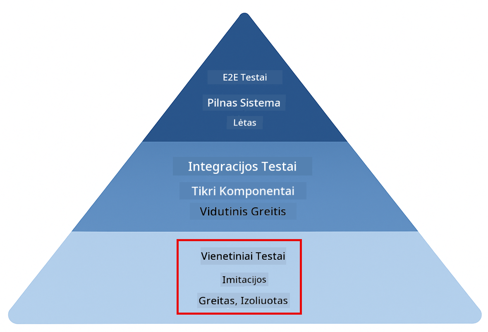
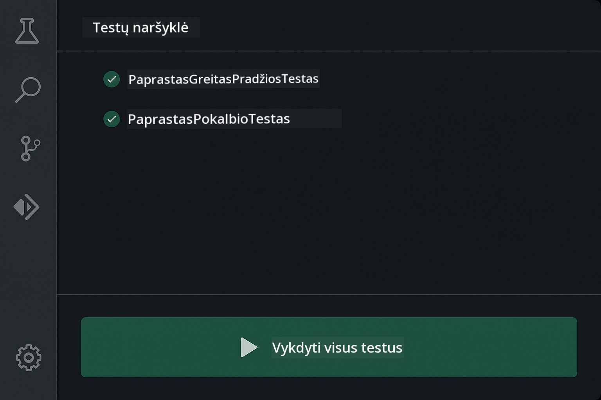
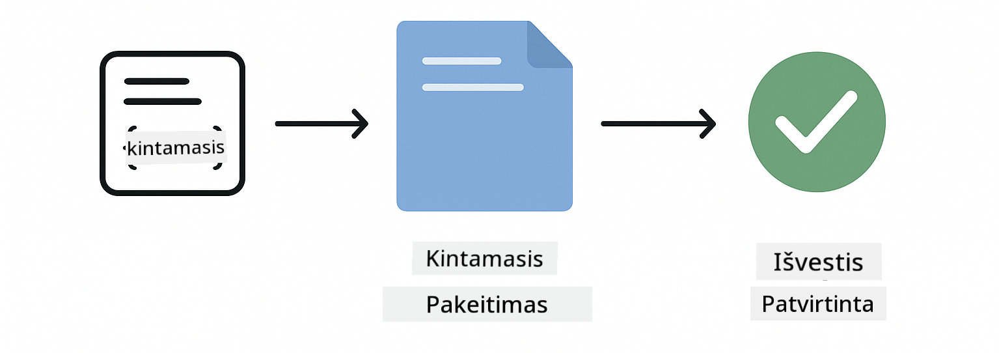
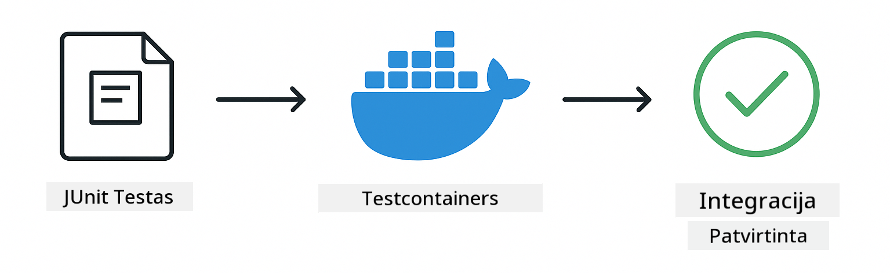

<!--
CO_OP_TRANSLATOR_METADATA:
{
  "original_hash": "b975537560c404d5f254331832811e78",
  "translation_date": "2025-12-13T21:32:15+00:00",
  "source_file": "docs/TESTING.md",
  "language_code": "lt"
}
-->
# LangChain4j programų testavimas

## Turinys

- [Greitas pradėjimas](../../../docs)
- [Ką apima testai](../../../docs)
- [Testų vykdymas](../../../docs)
- [Testų vykdymas VS Code](../../../docs)
- [Testavimo modeliai](../../../docs)
- [Testavimo filosofija](../../../docs)
- [Kiti žingsniai](../../../docs)

Šiame vadove pateikiama, kaip testuoti AI programas be API raktų ar išorinių paslaugų.

## Greitas pradėjimas

Paleiskite visus testus vienu komandos įvedimu:

**Bash:**
```bash
mvn test
```

**PowerShell:**
```powershell
mvn --% test
```


*Sėkmingas testų vykdymas, rodantis, kad visi testai praėjo be klaidų*

## Ką apima testai

Šis kursas orientuotas į **vienetinius testus**, kurie vykdomi lokaliai. Kiekvienas testas demonstruoja konkretų LangChain4j konceptą izoliuotai.



*Testavimo piramidė, rodanti pusiausvyrą tarp vienetinių testų (greiti, izoliuoti), integracinių testų (tikri komponentai) ir end-to-end testų (pilnas sistema su Docker). Šis mokymas apima vienetinius testus.*

| Modulis | Testai | Dėmesys | Pagrindiniai failai |
|--------|-------|-------|-----------|
| **00 - Greitas pradėjimas** | 6 | Užklausų šablonai ir kintamųjų pakeitimas | `SimpleQuickStartTest.java` |
| **01 - Įvadas** | 8 | Pokalbių atmintis ir būsenos palaikymas | `SimpleConversationTest.java` |
| **02 - Užklausų inžinerija** | 12 | GPT-5 modeliai, entuziazmo lygiai, struktūruotas išvestis | `SimpleGpt5PromptTest.java` |
| **03 - RAG** | 10 | Dokumentų įkėlimas, įterpimai, panašumo paieška | `DocumentServiceTest.java` |
| **04 - Įrankiai** | 12 | Funkcijų kvietimas ir įrankių grandinavimas | `SimpleToolsTest.java` |
| **05 - MCP** | 15 | Modelio konteksto protokolas su Docker | `SimpleMcpTest.java`, `McpDockerTransportTest.java` |

## Testų vykdymas

**Paleiskite visus testus iš šaknies:**

**Bash:**
```bash
mvn test
```

**PowerShell:**
```powershell
mvn --% test
```

**Paleiskite testus konkrečiam moduliui:**

**Bash:**
```bash
cd 01-introduction && mvn test
# Arba iš šaknies
mvn test -pl 01-introduction
```

**PowerShell:**
```powershell
cd 01-introduction; mvn --% test
# Arba iš šaknies
mvn --% test -pl 01-introduction
```

**Paleiskite vieną testų klasę:**

**Bash:**
```bash
mvn test -Dtest=SimpleConversationTest
```

**PowerShell:**
```powershell
mvn --% test -Dtest=SimpleConversationTest
```

**Paleiskite konkretų testų metodą:**

**Bash:**
```bash
mvn test -Dtest=SimpleConversationTest#turėtųIšlaikytiPokalbįIstoriją
```

**PowerShell:**
```powershell
mvn --% test -Dtest=SimpleConversationTest#turėtųIšlaikytiPokalbįIstoriją
```

## Testų vykdymas VS Code

Jei naudojate Visual Studio Code, Test Explorer suteikia grafinę sąsają testų vykdymui ir derinimui.



*VS Code Test Explorer rodantis testų medį su visomis Java testų klasėmis ir atskirais testų metodais*

**Norėdami paleisti testus VS Code:**

1. Atidarykite Test Explorer spustelėdami mėgintuvėlio piktogramą veiklos juostoje
2. Išplėskite testų medį, kad matytumėte visus modulius ir testų klases
3. Spustelėkite paleidimo mygtuką šalia bet kurio testo, kad paleistumėte jį atskirai
4. Spustelėkite „Run All Tests“, kad paleistumėte visą testų rinkinį
5. Dešiniuoju pelės mygtuku spustelėkite bet kurį testą ir pasirinkite „Debug Test“, kad nustatytumėte pertraukos taškus ir žingsniuotumėte per kodą

Test Explorer rodo žalius varnelės ženklus sėkmingiems testams ir pateikia išsamius klaidų pranešimus, kai testai nepavyksta.

## Testavimo modeliai


*Šeši LangChain4j programų testavimo modeliai: užklausų šablonai, kalbos modelių imitavimas, pokalbių izoliacija, įrankių testavimas, atminties RAG ir Docker integracija*

### Modelis 1: Užklausų šablonų testavimas

Paprastas modelis testuoja užklausų šablonus be AI modelio kvietimo. Patikrinama, ar kintamųjų pakeitimas veikia teisingai ir ar užklausos formatuojamos kaip tikėtasi.



*Užklausų šablonų testavimas, rodantis kintamųjų pakeitimo eigą: šablonas su vietos žymekliais → pritaikytos reikšmės → patvirtintas suformatuotas išvestis*

```java
@Test
@DisplayName("Should format prompt template with variables")
void testPromptTemplateFormatting() {
    PromptTemplate template = PromptTemplate.from(
        "Best time to visit {{destination}} for {{activity}}?"
    );
    
    Prompt prompt = template.apply(Map.of(
        "destination", "Paris",
        "activity", "sightseeing"
    ));
    
    assertThat(prompt.text()).isEqualTo("Best time to visit Paris for sightseeing?");
}
```

Šis testas yra `00-quick-start/src/test/java/com/example/langchain4j/quickstart/SimpleQuickStartTest.java`.

**Paleiskite jį:**

**Bash:**
```bash
cd 00-quick-start && mvn test -Dtest=SimpleQuickStartTest#testuotiUžklausosŠablonoFormatavimą
```

**PowerShell:**
```powershell
cd 00-quick-start; mvn --% test -Dtest=SimpleQuickStartTest#testuotiUžklausosŠablonoFormatavimą
```

### Modelis 2: Kalbos modelių imitavimas

Testuojant pokalbių logiką, naudokite Mockito, kad sukurtumėte netikrus modelius, grąžinančius iš anksto nustatytus atsakymus. Tai daro testus greitus, nemokamus ir deterministinius.


*Palyginimas, kodėl testavimui geriau naudoti imitacijas: jos greitos, nemokamos, deterministinės ir nereikalauja API raktų*

```java
@ExtendWith(MockitoExtension.class)
class SimpleConversationTest {
    
    private ConversationService conversationService;
    
    @Mock
    private OpenAiOfficialChatModel mockChatModel;
    
    @BeforeEach
    void setUp() {
        ChatResponse mockResponse = ChatResponse.builder()
            .aiMessage(AiMessage.from("This is a test response"))
            .build();
        when(mockChatModel.chat(anyList())).thenReturn(mockResponse);
        
        conversationService = new ConversationService(mockChatModel);
    }
    
    @Test
    void shouldMaintainConversationHistory() {
        String conversationId = conversationService.startConversation();
        
        ChatResponse mockResponse1 = ChatResponse.builder()
            .aiMessage(AiMessage.from("Response 1"))
            .build();
        ChatResponse mockResponse2 = ChatResponse.builder()
            .aiMessage(AiMessage.from("Response 2"))
            .build();
        ChatResponse mockResponse3 = ChatResponse.builder()
            .aiMessage(AiMessage.from("Response 3"))
            .build();
        
        when(mockChatModel.chat(anyList()))
            .thenReturn(mockResponse1)
            .thenReturn(mockResponse2)
            .thenReturn(mockResponse3);

        conversationService.chat(conversationId, "First message");
        conversationService.chat(conversationId, "Second message");
        conversationService.chat(conversationId, "Third message");

        List<ChatMessage> history = conversationService.getHistory(conversationId);
        assertThat(history).hasSize(6); // 3 vartotojo + 3 DI žinutės
    }
}
```

Šis modelis yra `01-introduction/src/test/java/com/example/langchain4j/service/SimpleConversationTest.java`. Imitacija užtikrina nuoseklų elgesį, kad būtų galima patikrinti atminties valdymą.

### Modelis 3: Pokalbių izoliacijos testavimas

Pokalbių atmintis turi atskirti kelis vartotojus. Šis testas patikrina, kad pokalbiai nesimaišo kontekstu.


*Pokalbių izoliacijos testavimas, rodantis atskiras atminties saugyklas skirtingiems vartotojams, kad būtų išvengta konteksto maišymo*

```java
@Test
void shouldIsolateConversationsByid() {
    String conv1 = conversationService.startConversation();
    String conv2 = conversationService.startConversation();
    
    ChatResponse mockResponse = ChatResponse.builder()
        .aiMessage(AiMessage.from("Response"))
        .build();
    when(mockChatModel.chat(anyList())).thenReturn(mockResponse);

    conversationService.chat(conv1, "Message for conversation 1");
    conversationService.chat(conv2, "Message for conversation 2");

    List<ChatMessage> history1 = conversationService.getHistory(conv1);
    List<ChatMessage> history2 = conversationService.getHistory(conv2);
    
    assertThat(history1).hasSize(2);
    assertThat(history2).hasSize(2);
}
```

Kiekvienas pokalbis palaiko savo nepriklausomą istoriją. Produkcijos sistemose ši izoliacija yra kritiškai svarbi daugiafunkcėms programoms.

### Modelis 4: Įrankių testavimas atskirai

Įrankiai yra funkcijos, kurias AI gali kviesti. Testuokite juos tiesiogiai, kad įsitikintumėte, jog jie veikia teisingai nepriklausomai nuo AI sprendimų.


*Įrankių testavimas atskirai, rodantis imitacinį įrankio vykdymą be AI kvietimų, kad būtų patikrinta verslo logika*

```java
@Test
void shouldConvertCelsiusToFahrenheit() {
    TemperatureTool tempTool = new TemperatureTool();
    String result = tempTool.celsiusToFahrenheit(25.0);
    assertThat(result).containsPattern("77[.,]0°F");
}

@Test
void shouldDemonstrateToolChaining() {
    WeatherTool weatherTool = new WeatherTool();
    TemperatureTool tempTool = new TemperatureTool();

    String weatherResult = weatherTool.getCurrentWeather("Seattle");
    assertThat(weatherResult).containsPattern("\\d+°C");

    String conversionResult = tempTool.celsiusToFahrenheit(22.0);
    assertThat(conversionResult).containsPattern("71[.,]6°F");
}
```

Šie testai iš `04-tools/src/test/java/com/example/langchain4j/agents/tools/SimpleToolsTest.java` patikrina įrankių logiką be AI įsikišimo. Grandinavimo pavyzdys rodo, kaip vieno įrankio išvestis patenka į kito įvestį.

### Modelis 5: Atminties RAG testavimas

RAG sistemos tradiciškai reikalauja vektorių duomenų bazių ir įterpimo paslaugų. Atminties modelis leidžia testuoti visą procesą be išorinių priklausomybių.


*Atminties RAG testavimo eiga, rodanti dokumentų analizę, įterpimų saugojimą ir panašumo paiešką be duomenų bazės*

```java
@Test
void testProcessTextDocument() {
    String content = "This is a test document.\nIt has multiple lines.";
    InputStream inputStream = new ByteArrayInputStream(content.getBytes(StandardCharsets.UTF_8));
    
    DocumentService.ProcessedDocument result = 
        documentService.processDocument(inputStream, "test.txt");

    assertNotNull(result);
    assertTrue(result.segments().size() > 0);
    assertEquals("test.txt", result.segments().get(0).metadata().getString("filename"));
}
```

Šis testas iš `03-rag/src/test/java/com/example/langchain4j/rag/service/DocumentServiceTest.java` sukuria dokumentą atmintyje ir patikrina dalijimą į dalis bei metaduomenų tvarkymą.

### Modelis 6: Integracinis testavimas su Docker

Kai kurios funkcijos reikalauja tikros infrastruktūros. MCP modulis naudoja Testcontainers, kad paleistų Docker konteinerius integraciniams testams. Tai patikrina, ar jūsų kodas veikia su tikromis paslaugomis, išlaikant testų izoliaciją.



*MCP integracinis testavimas su Testcontainers, rodantis automatizuotą konteinerių gyvavimo ciklą: paleidimas, testų vykdymas, sustabdymas ir valymas*

Testai `05-mcp/src/test/java/com/example/langchain4j/mcp/McpDockerTransportTest.java` reikalauja, kad Docker būtų paleistas.

**Paleiskite juos:**

**Bash:**
```bash
cd 05-mcp && mvn test
```

**PowerShell:**
```powershell
cd 05-mcp; mvn --% test
```

## Testavimo filosofija

Testuokite savo kodą, o ne AI. Jūsų testai turėtų patikrinti parašytą kodą, kaip kuriami užklausų šablonai, kaip valdomas atmintis ir kaip vykdomi įrankiai. AI atsakymai kinta ir neturėtų būti testų patvirtinimų dalis. Klauskite savęs, ar jūsų užklausų šablonas teisingai pakeičia kintamuosius, o ne ar AI duoda teisingą atsakymą.

Naudokite imitacijas kalbos modeliams. Tai išorinės priklausomybės, kurios yra lėtos, brangios ir nedeterministinės. Imitavimas daro testus greitus (milisekundėmis vietoje sekundžių), nemokamus (be API mokesčių) ir deterministinius (tas pats rezultatas kiekvieną kartą).

Laikykite testus nepriklausomais. Kiekvienas testas turėtų sukurti savo duomenis, nesiremiant kitais testais, ir išvalyti po savęs. Testai turėtų praeiti nepriklausomai nuo vykdymo tvarkos.

Testuokite kraštutinius atvejus, ne tik sėkmingus scenarijus. Išbandykite tuščius įvestis, labai dideles įvestis, specialius simbolius, neteisingus parametrus ir ribines sąlygas. Tai dažnai atskleidžia klaidas, kurių įprastas naudojimas nerodo.

Naudokite aprašomuosius pavadinimus. Palyginkite `shouldMaintainConversationHistoryAcrossMultipleMessages()` su `test1()`. Pirmasis tiksliai nurodo, kas testuojama, todėl gedimų derinimas yra daug lengvesnis.

## Kiti žingsniai

Dabar, kai suprantate testavimo modelius, gilinkitės į kiekvieną modulį:

- **[00 - Greitas pradėjimas](../00-quick-start/README.md)** - Pradėkite nuo užklausų šablonų pagrindų
- **[01 - Įvadas](../01-introduction/README.md)** - Sužinokite apie pokalbių atminties valdymą
- **[02 - Užklausų inžinerija](../02-prompt-engineering/README.md)** - Išmokite GPT-5 užklausų modelius
- **[03 - RAG](../03-rag/README.md)** - Kurkite paieškos papildytos generacijos sistemas
- **[04 - Įrankiai](../04-tools/README.md)** - Įgyvendinkite funkcijų kvietimą ir įrankių grandinavimą
- **[05 - MCP](../05-mcp/README.md)** - Integruokite Modelio konteksto protokolą su Docker

Kiekvieno modulio README pateikia išsamius čia testuojamų koncepcijų paaiškinimus.

---

**Navigacija:** [← Atgal į pagrindinį](../README.md)

---

<!-- CO-OP TRANSLATOR DISCLAIMER START -->
**Atsakomybės apribojimas**:  
Šis dokumentas buvo išverstas naudojant dirbtinio intelekto vertimo paslaugą [Co-op Translator](https://github.com/Azure/co-op-translator). Nors siekiame tikslumo, prašome atkreipti dėmesį, kad automatiniai vertimai gali turėti klaidų ar netikslumų. Originalus dokumentas gimtąja kalba turėtų būti laikomas autoritetingu šaltiniu. Svarbiai informacijai rekomenduojamas profesionalus žmogaus vertimas. Mes neatsakome už bet kokius nesusipratimus ar neteisingus aiškinimus, kilusius dėl šio vertimo naudojimo.
<!-- CO-OP TRANSLATOR DISCLAIMER END -->