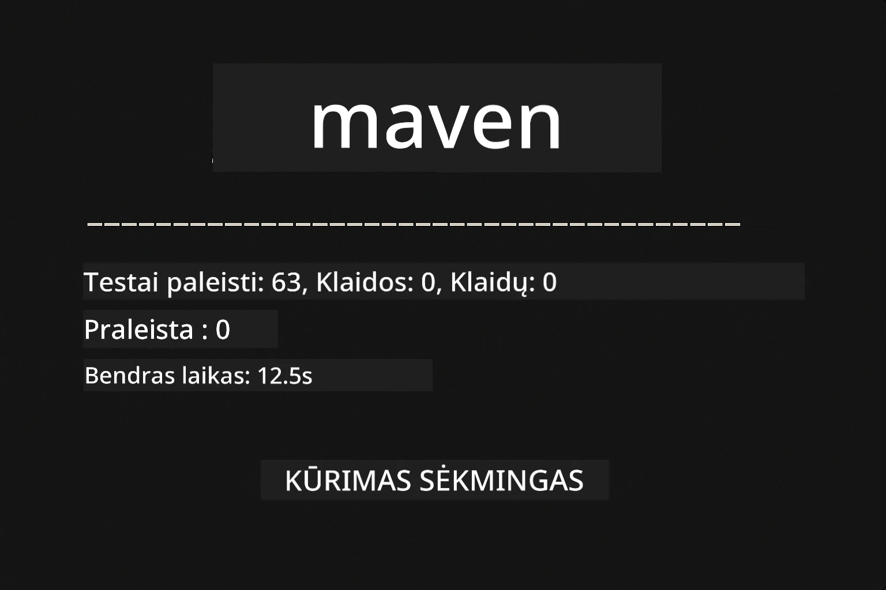
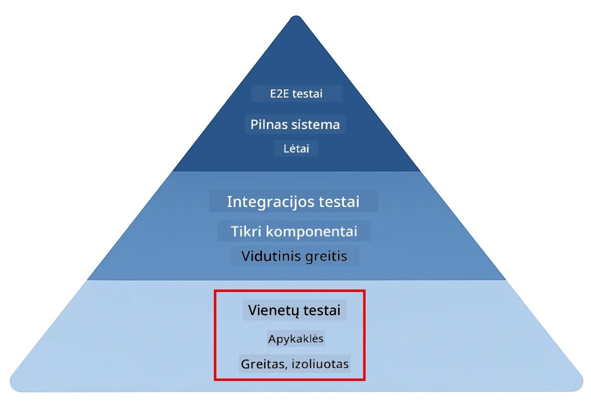
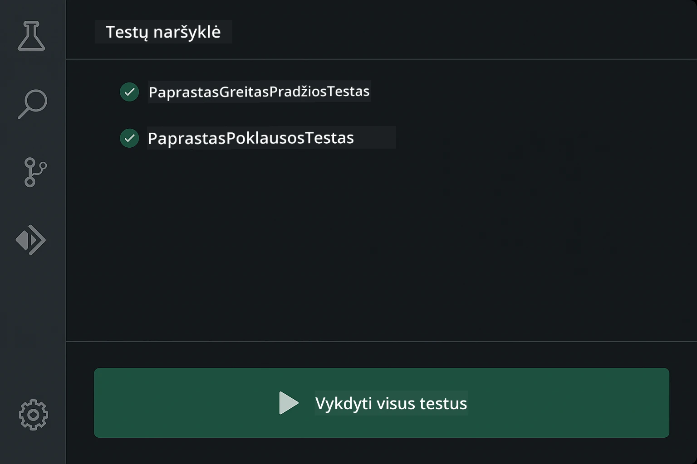
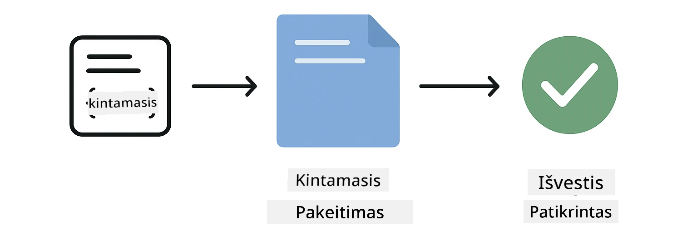
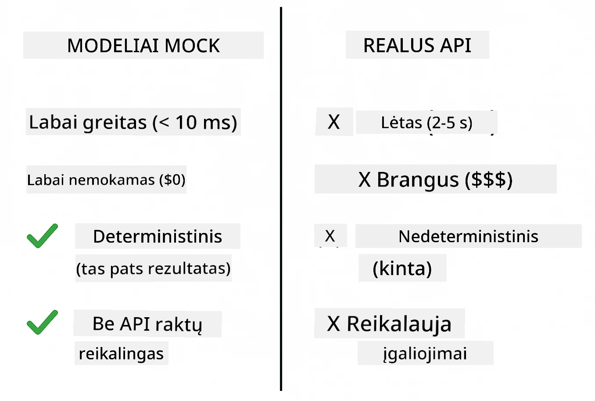
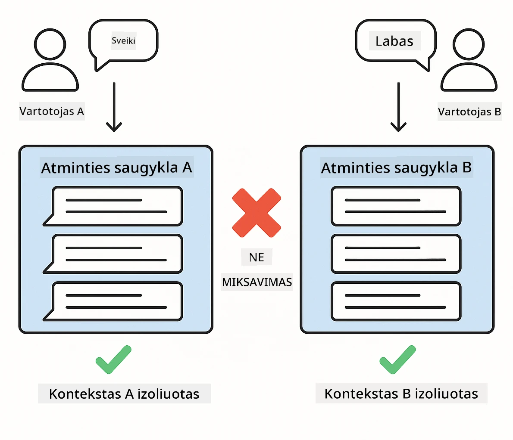
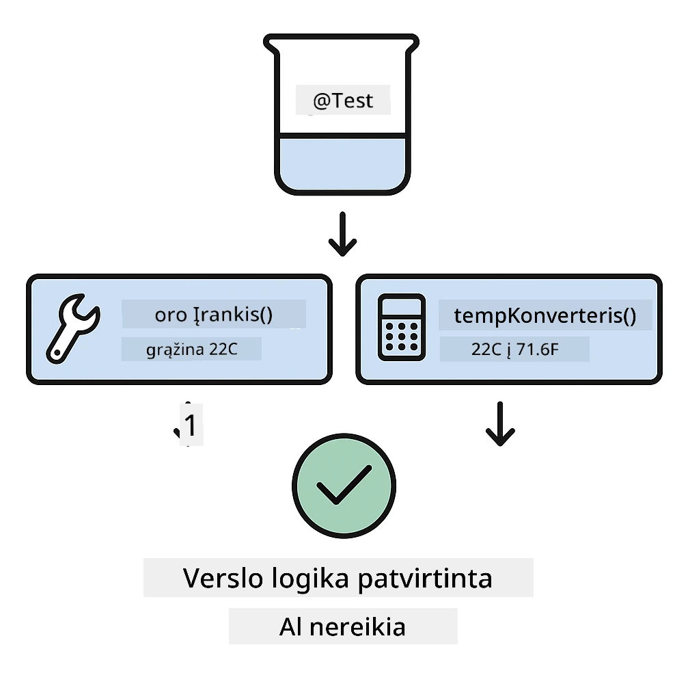
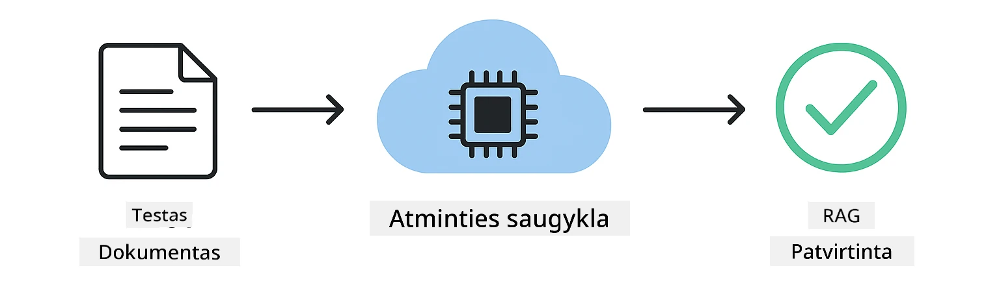

# LangChain4j programų testavimas

## Turinys

- [Greitas pradžia](#greitas-pradžia)
- [Ką apima testai](#ką-apima-testai)
- [Testų vykdymas](#testų-vykdymas)
- [Testų vykdymas VS Code](#testų-vykdymas-vs-code)
- [Testavimo šablonai](#testavimo-šablonai)
- [Testavimo filosofija](#testavimo-filosofija)
- [Tolimesni žingsniai](#tolimesni-žingsniai)

Šis vadovas paaiškina, kaip atlikti testus, parodančius, kaip testuoti DI programas be API raktų ar išorinių paslaugų.

## Greitas pradžia

Paleiskite visus testus vienu komandos įrašu:

**Bash:**
```bash
mvn test
```

**PowerShell:**
```powershell
mvn --% test
```

Kai visi testai praeina, turėtumėte matyti rezultatą, kaip žemiau esančioje ekrano nuotraukoje — testai veikia be klaidų.



*Sėkmingo testo vykdymo rezultatai, rodantys, kad visi testai praeina be klaidų*

## Ką apima testai

Šis kursas orientuotas į **vienetinius testus**, vykdomus lokaliai. Kiekvienas testas demonstruoja konkretų LangChain4j konceptą izoliuotai. žemiau pateikta testavimo piramidė rodo, kur tilpa vienetiniai testai — jie yra greitas ir patikimas pagrindas, ant kurio statoma visa jūsų testavimo strategija.



*Testavimo piramidė rodanti balansą tarp vienetinių testų (greiti, izoliuoti), integracinių testų (tikros sudedamosios dalys) ir galutinio patikrinimo testų. Ši mokymo programa apima vienetinius testus.*

| Modulis | Testai | Fokusas | Pagrindiniai failai |
|--------|-------|-------|-----------|
| **01 - Įvadas** | 8 | Pokalbio atmintis ir būseninis pokalbis | `SimpleConversationTest.java` |
| **02 - Užklausų inžinerija** | 12 | GPT-5.2 šablonai, norų lygiai, struktūruotas išvestis | `SimpleGpt5PromptTest.java` |
| **03 - RAG** | 10 | Dokumentų gavimas, įterpimo vektoriai, panašumo paieška | `DocumentServiceTest.java` |
| **04 - Įrankiai** | 12 | Funkcijų kvietimas ir įrankių grandinavimas | `SimpleToolsTest.java` |
| **05 - MCP** | 8 | Modelio konteksto protokolas su stdio transportu | `SimpleMcpTest.java` |

## Testų vykdymas

**Paleiskite visus testus iš root:**

**Bash:**
```bash
mvn test
```

**PowerShell:**
```powershell
mvn --% test
```

**Paleiskite testus konkrečiam moduliui:**

**Bash:**
```bash
cd 01-introduction && mvn test
# Arba iš šaknies
mvn test -pl 01-introduction
```

**PowerShell:**
```powershell
cd 01-introduction; mvn --% test
# Arba iš root
mvn --% test -pl 01-introduction
```

**Paleiskite vieną testų klasę:**

**Bash:**
```bash
mvn test -Dtest=SimpleConversationTest
```

**PowerShell:**
```powershell
mvn --% test -Dtest=SimpleConversationTest
```

**Paleiskite konkretų testų metodą:**

**Bash:**
```bash
mvn test -Dtest=SimpleConversationTest#ar reikia išlaikyti pokalbio istoriją
```

**PowerShell:**
```powershell
mvn --% test -Dtest=SimpleConversationTest#turėtųIšlaikytiPokalbiaiIstoriją
```

## Testų vykdymas VS Code

Jei naudojate Visual Studio Code, Testų naršyklė suteikia grafinę sąsają testams vykdyti ir derinti.



*VS Code Testų naršyklė rodanti testų medį su visomis Java testų klasėmis ir atskirais testų metodais*

**Kaip vykdyti testus VS Code:**

1. Atidarykite Testų naršyklę spustelėdami mėgintuvėlio piktogramą veiksmų juostoje
2. Išplėskite testų medį, kad matytumėte visus modulius ir testų klases
3. Spustelėkite paleidimo mygtuką šalia bet kurio testo, kad paleistumėte jį atskirai
4. Spustelėkite "Run All Tests", kad įvykdytumėte visą testų rinkinį
5. Dešiniuoju pelės mygtuku spustelėkite bet kurį testą ir pasirinkite "Debug Test", kad nustatytumėte pertraukos taškus ir žingsniuotumėte po kodą

Testų naršyklė rodo žalius varnelės ženklus sėkmingiems testams ir pateikia išsamius klaidų pranešimus, kai testai nepavyksta.

## Testavimo šablonai

### Šablonas 1: Užklausų šablonų testavimas

Paprastas šis šablonas testuoja užklausų šablonus be jokių DI modelio kvietimų. Patikrinama, ar kintamųjų pakeitimas veikia teisingai ir užklausos yra suformatuotos taip, kaip tikėtasi.



*Užklausų šablonų testavimas rodant kintamųjų pakeitimo eigą: šablonas su vietomis → taikomos reikšmės → patvirtintas suformatuotas rezultatas*

```java
@Test
@DisplayName("Should format prompt template with variables")
void testPromptTemplateFormatting() {
    PromptTemplate template = PromptTemplate.from(
        "Best time to visit {{destination}} for {{activity}}?"
    );
    
    Prompt prompt = template.apply(Map.of(
        "destination", "Paris",
        "activity", "sightseeing"
    ));
    
    assertThat(prompt.text()).isEqualTo("Best time to visit Paris for sightseeing?");
}
```

Šis šablonas patvirtina, kad kintamųjų pakeitimas veikia teisingai ir užklausos formatavimas yra tinkamas — nereikia API rakto ar modelio kvietimo.

### Šablonas 2: Kalbos modelių maketavimas

Testuojant pokalbio logiką, naudokite Mockito, kad sukurtumėte fiktyvius modelius, grąžinančius iš anksto nustatytus atsakymus. Tai daro testus greitus, nemokamus ir determinuotus.



*Palyginimas, kodėl maketavimai yra pageidaujami testuose: jie greiti, nemokami, determinuoti ir nereikalauja API raktų*

```java
@ExtendWith(MockitoExtension.class)
class SimpleConversationTest {
    
    private ConversationService conversationService;
    
    @Mock
    private OpenAiOfficialChatModel mockChatModel;
    
    @BeforeEach
    void setUp() {
        ChatResponse mockResponse = ChatResponse.builder()
            .aiMessage(AiMessage.from("This is a test response"))
            .build();
        when(mockChatModel.chat(anyList())).thenReturn(mockResponse);
        
        conversationService = new ConversationService(mockChatModel);
    }
    
    @Test
    void shouldMaintainConversationHistory() {
        String conversationId = conversationService.startConversation();
        
        ChatResponse mockResponse1 = ChatResponse.builder()
            .aiMessage(AiMessage.from("Response 1"))
            .build();
        ChatResponse mockResponse2 = ChatResponse.builder()
            .aiMessage(AiMessage.from("Response 2"))
            .build();
        ChatResponse mockResponse3 = ChatResponse.builder()
            .aiMessage(AiMessage.from("Response 3"))
            .build();
        
        when(mockChatModel.chat(anyList()))
            .thenReturn(mockResponse1)
            .thenReturn(mockResponse2)
            .thenReturn(mockResponse3);

        conversationService.chat(conversationId, "First message");
        conversationService.chat(conversationId, "Second message");
        conversationService.chat(conversationId, "Third message");

        List<ChatMessage> history = conversationService.getHistory(conversationId);
        assertThat(history).hasSize(6); // 3 naudotojo + 3 DI žinutės
    }
}
```

Šis šablonas yra faile `01-introduction/src/test/java/com/example/langchain4j/service/SimpleConversationTest.java`. Maketas užtikrina nuoseklų elgesį, todėl galite patikrinti, ar atminties valdymas veikia tinkamai.

### Šablonas 3: Pokalbio izoliacijos testavimas

Pokalbio atmintis turi atskirti kelis vartotojus. Šis testas patikrina, kad pokalbiai nesimaišo kontekstu.



*Pokalbio izoliacijos testavimas, rodantis atskirus atminties saugyklas skirtingiems vartotojams, kad būtų išvengta konteksto maišymo*

```java
@Test
void shouldIsolateConversationsByid() {
    String conv1 = conversationService.startConversation();
    String conv2 = conversationService.startConversation();
    
    ChatResponse mockResponse = ChatResponse.builder()
        .aiMessage(AiMessage.from("Response"))
        .build();
    when(mockChatModel.chat(anyList())).thenReturn(mockResponse);

    conversationService.chat(conv1, "Message for conversation 1");
    conversationService.chat(conv2, "Message for conversation 2");

    List<ChatMessage> history1 = conversationService.getHistory(conv1);
    List<ChatMessage> history2 = conversationService.getHistory(conv2);
    
    assertThat(history1).hasSize(2);
    assertThat(history2).hasSize(2);
}
```

Kiekvienas pokalbis palaiko savarankišką istoriją. Gamybos sistemose ši izoliacija yra būtina daugiafunkcėms programoms.

### Šablonas 4: Įrankių testavimas atskirai

Įrankiai yra funkcijos, kurias DI gali kviesti. Testuokite jas tiesiogiai, kad įsitikintumėte, jog jos veikia teisingai nepriklausomai nuo DI sprendimų.



*Įrankių testavimas atskirai, rodantis maketuojamo įrankio vykdymą be DI kvietimų, kad patvirtintų verslo logiką*

```java
@Test
void shouldConvertCelsiusToFahrenheit() {
    TemperatureTool tempTool = new TemperatureTool();
    String result = tempTool.celsiusToFahrenheit(25.0);
    assertThat(result).containsPattern("77[.,]0°F");
}

@Test
void shouldDemonstrateToolChaining() {
    WeatherTool weatherTool = new WeatherTool();
    TemperatureTool tempTool = new TemperatureTool();

    String weatherResult = weatherTool.getCurrentWeather("Seattle");
    assertThat(weatherResult).containsPattern("\\d+°C");

    String conversionResult = tempTool.celsiusToFahrenheit(22.0);
    assertThat(conversionResult).containsPattern("71[.,]6°F");
}
```

Šie testai iš `04-tools/src/test/java/com/example/langchain4j/agents/tools/SimpleToolsTest.java` patikrina įrankių logiką be DI dalyvavimo. Grandinavimo pavyzdys rodo, kaip vieno įrankio išvestis patenka kaip įvestis kitam.

### Šablonas 5: Atminties viduje RAG testavimas

RAG sistemos tradiciškai reikalauja vektorių duomenų bazių ir įterpimo paslaugų. Šis atminties viduje šablonas leidžia testuoti visą procesą be išorinių priklausomybių.



*Atminties viduje vykdomas RAG testavimas, rodantis dokumentų analizę, įterpimo saugojimą ir panašumo paiešką be duomenų bazės*

```java
@Test
void testProcessTextDocument() {
    String content = "This is a test document.\nIt has multiple lines.";
    InputStream inputStream = new ByteArrayInputStream(content.getBytes(StandardCharsets.UTF_8));
    
    DocumentService.ProcessedDocument result = 
        documentService.processDocument(inputStream, "test.txt");

    assertNotNull(result);
    assertTrue(result.segments().size() > 0);
    assertEquals("test.txt", result.segments().get(0).metadata().getString("filename"));
}
```

Šis testas iš `03-rag/src/test/java/com/example/langchain4j/rag/service/DocumentServiceTest.java` sukuria dokumentą atmintyje ir patikrina segmentavimą bei metaduomenų tvarkymą.

### Šablonas 6: MCP integracijos testavimas

MCP modulis testuoja Modelio konteksto protokolo integraciją naudojant stdio transportą. Šie testai patikrina, ar jūsų programa gali kurti ir bendrauti su MCP serveriais kaip posistemiais.

Testai faile `05-mcp/src/test/java/com/example/langchain4j/mcp/SimpleMcpTest.java` tikrina MCP kliento elgesį.

**Paleiskite juos:**

**Bash:**
```bash
cd 05-mcp && mvn test
```

**PowerShell:**
```powershell
cd 05-mcp; mvn --% test
```

## Testavimo filosofija

Testuokite savo kodą, o ne DI. Jūsų testai turėtų patikrinti jūsų parašytą kodą, kaip užklausos kuriamos, kaip valdoma atmintis ir kaip vykdomi įrankiai. DI atsakymai kinta, tad jų nereikėtų tikrinti testų teigimuose. Užduokite sau klausimą, ar jūsų užklausų šablonas teisingai pritaiko kintamuosius, o ne ar DI pateikia teisingą atsakymą.

Naudokite maketus kalbos modeliams. Jie yra išoriniai priklausomybės, lėti, brangūs ir nenuoseklūs. Maketavimas daro testus greitus su milisekundžių trukme vietoje sekundžių, nemokamus be API išlaidų ir determinuotus su tuo pačiu rezultatu kiekvieną kartą.

Išlaikykite testus nepriklausomais. Kiekvienas testas turi paruošti savus duomenis, nenaudoti kitų testų ir tvarkyti savo aplinką. Testai turėtų veikti nepriklausomai nuo vykdymo tvarkos.

Testuokite ribinius atvejus, ne tik sklandų scenarijų. Išbandykite tuščias įvestis, labai dideles įvestis, specialius simbolius, netinkamus parametrus ir ribines sąlygas. Dažnai būtent šie atvejai atskleidžia klaidas, kurias įprasta naudojimo eiga nepastebi.

Naudokite aprašomuosius pavadinimus. Palyginkite `shouldMaintainConversationHistoryAcrossMultipleMessages()` su `test1()`. Pirmasis tiksliai nurodo, kas testuojama, todėl gedimų atpažinimas yra daug paprastesnis.

## Tolimesni žingsniai

Dabar, kai suprantate testavimo šablonus, gilinkitės į kiekvieną modulį:

- **[01 - Įvadas](../01-introduction/README.md)** - Sužinokite apie pokalbio atminties valdymą
- **[02 - Užklausų inžinerija](../02/prompt-engineering/README.md)** - Išmokite GPT-5.2 užklausų šablonus
- **[03 - RAG](../03-rag/README.md)** - Kurkite paieškos palaikomų generavimo sistemų
- **[04 - Įrankiai](../04-tools/README.md)** - Įgyvendinkite funkcijų kvietimus ir įrankių grandines
- **[05 - MCP](../05-mcp/README.md)** - Integruokite Modelio konteksto protokolą

Kiekvieno modulio README detalizuotai paaiškina čia testuotus konceptus.

---

**Navigacija:** [← Atgal į pagrindinį](../README.md)

---

<!-- CO-OP TRANSLATOR DISCLAIMER START -->
**Atsakomybės apribojimas**:
Šis dokumentas buvo išverstas naudojant dirbtinio intelekto vertimo paslaugą [Co-op Translator](https://github.com/Azure/co-op-translator). Nors siekiame tikslumo, prašome atkreipti dėmesį, kad automatiniai vertimai gali turėti klaidų ar netikslumų. Originalus dokumentas jo gimtąja kalba laikomas autoritetingu šaltiniu. Svarbiai informacijai rekomenduojama naudoti profesionalų žmogiškąjį vertimą. Mes neatsakome už jokius nesusipratimus ar neteisingą interpretaciją, kilusią naudojantis šiuo vertimu.
<!-- CO-OP TRANSLATOR DISCLAIMER END -->