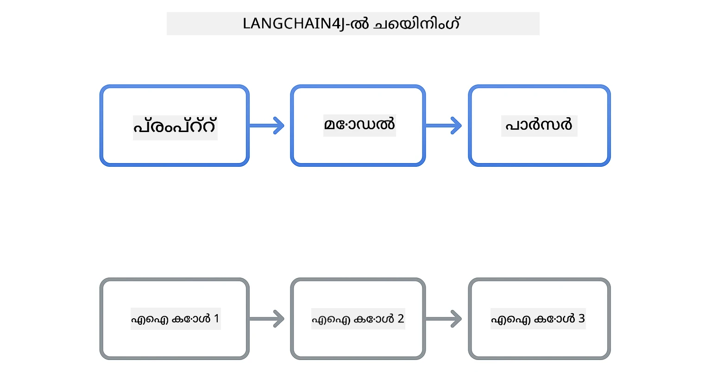
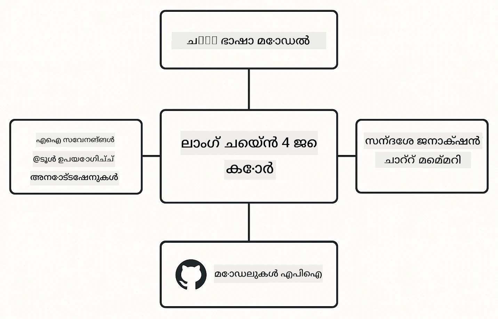

<!--
CO_OP_TRANSLATOR_METADATA:
{
  "original_hash": "22b5d7c8d7585325e38b37fd29eafe25",
  "translation_date": "2026-01-06T02:19:52+00:00",
  "source_file": "00-quick-start/README.md",
  "language_code": "ml"
}
-->
# മോഡ്യൂള്‍ 00: ക്വിക് സ്റ്റാർട്ട്

## ഉള്ളടക്ക പട്ടിക

- [പരിചയം](../../../00-quick-start)
- [LangChain4j എന്താണ്?](../../../00-quick-start)
- [LangChain4j ആശ്രിതങ്ങൾ](../../../00-quick-start)
- [ആവശ്യമായ മുൻകൂർതയാകങ്ങൾ](../../../00-quick-start)
- [സജ്ജീകരണം](../../../00-quick-start)
  - [1. നിങ്ങളുടെ GitHub ടോക്കൺ എടുക്കുക](../../../00-quick-start)
  - [2. നിങ്ങളുടെ ടോക്കൺ സജ്ജമാക്കുക](../../../00-quick-start)
- [ഉദാഹരണങ്ങൾ പ്രവർത്തിപ്പിക്കുക](../../../00-quick-start)
  - [1. അടിസ്ഥാന ചാറ്റ്](../../../00-quick-start)
  - [2. പ്രോംപ്റ്റ് പാറ്റേണുകൾ](../../../00-quick-start)
  - [3. ഫംഗ്ഷൻ കോളിംഗ്](../../../00-quick-start)
  - [4. ഡോക്യുമെന്റ് Q&A (RAG)](../../../00-quick-start)
  - [5. ഉത്തരവാദിത്വമുള്ള AI](../../../00-quick-start)
- [എന്താണ് ഓരോ ഉദാഹരണവും കാണിക്കുന്നത്](../../../00-quick-start)
- [അടുത്ത ഘട്ടങ്ങൾ](../../../00-quick-start)
- [പ്രശ്നപരിഹാരം](../../../00-quick-start)

## പരിചയം

ഈ ക്വിക്‌സ്റ്റാർട്ട് LangChain4j ഉപയോഗിച്ച് നിങ്ങളെ όσο സാധ്യമുള്ള വേഗത്തിൽ പ്രവർത്തനക്ഷമനാക്കുന്നതിന് ആണ്. LangChain4j ഒപ്പം GitHub മോഡലുകൾ ഉപയോഗിച്ചുള്ള AI ആപ്ലിക്കേഷനുകൾ നിർമ്മിക്കാനുള്ള അടിസ്ഥാന കാര്യങ്ങൾ ഇതിൽ ഉൾക്കൊള്ളുന്നു. അടുത്ത മോഡ്യൂളുകളിലെ നിങ്ങൾ LangChain4j -ഇനും Azure OpenAI -നും ചേർത്ത് കൂടുതൽ പരിച്ഛേദങ്ങളുള്ള ആപ്ലിക്കേഷനുകൾ നിർമ്മിക്കും.

## LangChain4j എന്താണ്?

LangChain4j ഒരു ജാവ ലെബ്രറിയാണ്, AI ശക്തിയുള്ള ആപ്ലിക്കേഷനുകൾ നിർമ്മിക്കലിനെ ലളിതമാക്കുന്നത്. HTTP ക്ലയന്റുമാരുടെയും JSON പാഴ്സറുമാരെയും കൈകാര്യം ചെയ്യാനുള്ള പകരം, നിങ്ങൾക്ക് ശുദ്ധമായ ജാവ API-കൾ ഉപയോഗിക്കാം.

LangChain എന്നത് പലയിടങ്ങളിൽ പല ഘടകങ്ങളെ കൂർത്തിണക്കുന്നതിന് ഉദ്ദേശിച്ചിരിക്കുന്നു - ഒരു പ്രോംപ്റ്റ് ഒരു മോഡൽ, ഒരു പാര്‍സര്‍ എന്നിവയെ ബന്ധിപ്പിച്ചേക്കാം അല്ലെങ്കിൽ പല AI കോളുകൾ തുടർച്ചയായി ബന്ധിപ്പിച്ചേക്കാം, ഒരു ഔട്ട്‌പുട്ട് അടുത്ത ഇൻപുട്ടിലേക്ക്aliment ചെയ്യുന്നു. ഈ ക്വിക് സ്റ്റാർട്ട് അടിസ്ഥാന കാര്യങ്ങൾക്ക് ഫോകസ് ചെയ്യുന്നു, പിന്നീട് കൂടുതൽ സങ്കീർണ്ണമായ ഘടനകൾ പരിചയപ്പെടും.



*LangChain4j-യിലെ ഘടകങ്ങൾ ഒരു കണക്റ്റ് ആയി ചുരുങ്ങി ശക്തമായ AI പ്രവൃത്തി പ്രക്രിയകൾ സൃഷ്ടിക്കുന്നു*

നാം മൂന്ന് പ്രധാന ഘടകങ്ങൾ ഉപയോഗിക്കും:

**ChatLanguageModel** - AI മോഡൽ ഇന്ററാക്ഷൻസിനുള്ള ഇന്റർഫേസ്. `model.chat("prompt")` വിളിച്ച് ഒരു പ്രതികരണ സ്ട്രിംഗ് ലഭിക്കും. GitHub മോഡലുകൾ പോലുള്ള OpenAI-സാദൃശ്യ എന്റ്പോയിന്റുകളുമായി പ്രവർത്തിക്കുന്ന `OpenAiOfficialChatModel` ആണ് നമ്മൾ ഉപയോഗിക്കുന്നത്.

**AiServices** - ടൈപ്പ്-സേഫ് AI സർവീസ് ഇന്ററ്ഫേസുകൾ സൃഷ്ടിക്കുന്നു. മാർഗങ്ങൾ നിർവചിച്ച്, അവ `@Tool` ആനോട്ടേഷൻ ചെയ്യുക, LangChain4j ഓർക്ക്സ്ട്രേഷൻ കൈകാര്യം ചെയ്യുന്നു. ആവശ്യമുള്ളപ്പോൾ AI നിങ്ങളുടെ ജാവ മെത്തഡുകൾ കണക്കാക്കി സ്വയം വിളിക്കുന്നു.

**MessageWindowChatMemory** - സംഭാഷണ ചരിത്രം സൂക്ഷിക്കുന്നു. ഇതു ഇല്ലാതെങ്കിൽ ഓരോ അഭ്യർത്ഥനയും സ്വതന്ത്രമാണ്. ഇതിനൊപ്പം AI മുമ്പത്തെ സന്ദേശങ്ങൾ ഓർത്ത്, പല രൂപങ്ങളിൽ സാരാംശം നിലനിർത്തുന്നു.



*LangChain4j ആർക്കിടെക്ചർ - നിങ്ങളുടെ AI ആപ്ലിക്കേഷനുകൾക്ക് ശക്തിപ്പെടുത്തുന്ന കോർ ഘടകങ്ങൾ ചേർന്ന് പ്രവർത്തിക്കുന്നു*

## LangChain4j ആശ്രിതങ്ങൾ

ഈ ക്വിക് സ്റ്റാർട്ട് [`pom.xml`](../../../00-quick-start/pom.xml) ഫയലിൽ രണ്ട് Maven ആശ്രിതങ്ങൾ ഉപയോഗിക്കുന്നു:

```xml
<!-- Core LangChain4j library -->
<dependency>
    <groupId>dev.langchain4j</groupId>
    <artifactId>langchain4j</artifactId> <!-- Inherited from BOM in root pom.xml -->
</dependency>

<!-- OpenAI integration (works with GitHub Models) -->
<dependency>
    <groupId>dev.langchain4j</groupId>
    <artifactId>langchain4j-open-ai-official</artifactId> <!-- Inherited from BOM in root pom.xml -->
</dependency>
```

`langchain4j-open-ai-official` മോട്യൂൾ `OpenAiOfficialChatModel` ക്ലാസ് നൽകുന്നു, ഇത് OpenAI-സാദൃശ്യ APIs-നോടൊപ്പം കണക്ട് ചെയ്യുന്നു. GitHub മോഡലുകൾക്കും ഒരേ API ഫോർമാറ്റ് ഉപയോഗിക്കപ്പെടുന്നു, അതിനാൽ പ്രത്യേക അഡാപ്റ്റർ ആവശ്യമില്ല — ബേസ് URL ആയി `https://models.github.ai/inference` മാത്രമെ കാണിക്കേണ്ടത്.

## ആവശ്യമായ മുൻകൂർതയാകങ്ങൾ

**ഡെവ് കണ്ടെയ്നർ ഉപയോഗിക്കുകയാണോ?** ജാവയും മെവനും ഇതിനകം ഇൻസ്റ്റാൾ ചെയ്തിട്ടുണ്ട്. നിങ്ങൾക്ക് GitHub വ്യക്തിഗത ആക്‌സസ് ടോക്കൺ മാത്രം ആവശ്യമുണ്ട്.

**പ്രാദേശിക ഡെവലപ്മെന്റ്:**
- ജാവ 21+, മെവൻ 3.9+
- GitHub വ്യക്തിഗത ആക്‌സസ് ടോക്കൺ (താഴെ കൊടുത്തിരിക്കുന്ന സമഗ്ര നിർദ്ദേശങ്ങൾ)

> **കുറിപ്പ്:** ഈ മോഡ്യൂൾ GitHub മോഡലുകളിൽ നിന്നുള്ള `gpt-4.1-nano` ഉപയോഗിക്കുന്നു. കോഡിൽ മോഡൽ നാമം മാറില്ല, അത് GitHub-ൽ ലഭ്യമായ മോഡലുകളുമായി പ്രവർത്തിക്കാൻ ക്രമീകരിച്ചിരിക്കുന്നു.

## സജ്ജീകരണം

### 1. നിങ്ങളുടെ GitHub ടോക്കൺ എടുക്കുക

1. [GitHub Settings → Personal Access Tokens](https://github.com/settings/personal-access-tokens) സന്ദർശിക്കുക
2. "Generate new token" ക്ലിക്കുചെയ്യുക
3. വിവരണാത്മകമായ ഒരു പേര് നൽകിയിട്ടുണ്ട് (ഉദാ: "LangChain4j ഡെമോ")
4. കാലഹരണ സമയം സജ്ജമാക്കുക (7 ദിവസം നിർദ്ദേശം)
5. "Account permissions" ഇൽ "Models" കണ്ടെത്തി "Read-only" ആക്കുക
6. "Generate token" ക്ലിക്കുചെയ്യുക
7. നിങ്ങളുടെ ടോക്കൺ പകർത്തി സൂക്ഷിക്കുക - വീണ്ടും കാണാനാകില്ല

### 2. നിങ്ങളുടെ ടോക്കൺ സജ്ജമാക്കുക

**ഓപ്ഷൻ 1: VS Code ഉപയോഗിച്ച് (നിർദ്ദേശിച്ചിരിക്കുന്നവ)**

VS Code ഉപയോഗിച്ചാൽ, പ്രോജക്റ്റ് റൂട്ട് ലെ `.env` ഫയലിൽ നിങ്ങളുടെ ടോക്കൺ ചേർക്കുക:

`.env` ഫയൽ ഇല്ലെങ്കിൽ, `.env.example` ന്റെ ഒരു പകർപ്പ് `.env` എന്ന പേരിൽ പ്രോജക്റ്റ് റൂട്ടിൽ സൃഷ്ടിക്കുക അല്ലെങ്കിൽ പുതിയ `.env` ഫയൽ ഉണ്ടാക്കുക.

**ഉദാഹരണ `.env` ഫയൽ:**
```bash
# /workspaces/LangChain4j-for-Beginners/.env ൽ
GITHUB_TOKEN=your_token_here
```

ഇപ്പോള്‍ സാധാരണയായി ഏത് ഡെമോ ഫയലിലും (ഉദാ: `BasicChatDemo.java`) എക്സ്പ്ലോററിൽ റൈറ്റ് ക്ലിക്ക് ചെയ്ത് **"Run Java"** തിരഞ്ഞെടുക്കാം അല്ലെങ്കിൽ റൺ ആൻഡ് ഡെബഗ് പാനലിൽ നിന്നുള്ള ലേഖനം കോന്ഫിഗറേഷനുകൾ ഉപയോഗിക്കാം.

**ഓപ്ഷൻ 2: ടർമിനൽ ഉപയോഗിച്ച്**

ടോക്കൺ എൻവയറോൺമെന്റ് വേരിയബിൾ ആയിട്ട് സജ്ജമാക്കുക:

**Bash:**
```bash
export GITHUB_TOKEN=your_token_here
```

**PowerShell:**
```powershell
$env:GITHUB_TOKEN=your_token_here
```

## ഉദാഹരണങ്ങൾ പ്രവർത്തിപ്പിക്കുക

**VS Code ഉപയോഗിച്ച്:** എളുപ്പത്തിൽ എക്സ്പ്ലോററിൽ ഏതെങ്കിലും ഡെമോ ഫയലിൽ റൈറ്റ് ക്ലിക്ക് ചെയ്ത് **"Run Java"** തിരഞ്ഞെടുക്കുക അല്ലെങ്കിൽ റൺ ആൻഡ് ഡെബഗ് പാനലിൽ നിന്നുള്ള ലോഞ്ച് കോൺഫിഗറേഷനുകൾ ഉപയോഗിക്കുക (ആദ്യം ടോക്കൺ `.env` ഫയലിൽ ചേർത്തിട്ടുണ്ടെന്ന് ഉറപ്പാക്കുക).

**Maven ഉപയോഗിച്ച്:** അല്ലെങ്കിൽ, കമാൻഡ് ലൈൻ വഴി പ്രവർത്തിപ്പിക്കാം:

### 1. അടിസ്ഥാന ചാറ്റ്

**Bash:**
```bash
mvn compile exec:java -Dexec.mainClass=com.example.langchain4j.quickstart.BasicChatDemo
```

**PowerShell:**
```powershell
mvn --% compile exec:java -Dexec.mainClass=com.example.langchain4j.quickstart.BasicChatDemo
```

### 2. പ്രോംപ്റ്റ് പാറ്റേണുകൾ

**Bash:**
```bash
mvn compile exec:java -Dexec.mainClass=com.example.langchain4j.quickstart.PromptEngineeringDemo
```

**PowerShell:**
```powershell
mvn --% compile exec:java -Dexec.mainClass=com.example.langchain4j.quickstart.PromptEngineeringDemo
```

സീറോ-ഷോട്ട്, Few-shot, ചൈൻ-ഓഫ്-തോട്ട്, റോൾ-അടിസ്ഥാന പ്രോംപ്റ്റിങ് കാണിക്കുന്നു.

### 3. ഫംഗ്ഷൻ കോളിംഗ്

**Bash:**
```bash
mvn compile exec:java -Dexec.mainClass=com.example.langchain4j.quickstart.ToolIntegrationDemo
```

**PowerShell:**
```powershell
mvn --% compile exec:java -Dexec.mainClass=com.example.langchain4j.quickstart.ToolIntegrationDemo
```

ആവശ്യമുള്ളപ്പോൾ AI സ്വയം നിങ്ങളുടെ ജാവ മെത്തഡുകൾ വിളിക്കുന്നു.

### 4. ഡോക്യുമെന്റ് Q&A (RAG)

**Bash:**
```bash
mvn compile exec:java -Dexec.mainClass=com.example.langchain4j.quickstart.SimpleReaderDemo
```

**PowerShell:**
```powershell
mvn --% compile exec:java -Dexec.mainClass=com.example.langchain4j.quickstart.SimpleReaderDemo
```

`document.txt` ഉള്ള ഉള്ളടക്കത്തെക്കുറിച്ച് ചോദിക്കുക.

### 5. ഉത്തരവാദിത്വമുള്ള AI

**Bash:**
```bash
mvn compile exec:java -Dexec.mainClass=com.example.langchain4j.quickstart.ResponsibleAIDemo
```

**PowerShell:**
```powershell
mvn --% compile exec:java -Dexec.mainClass=com.example.langchain4j.quickstart.ResponsibleAIDemo
```

AI സുരക്ഷാ ഫിൽട്ടറുകൾ ഹാനികരമായ ഉള്ളടക്കം തടയുന്നതിനെ കാണുക.

## എന്താണ് ഓരോ ഉദാഹരണവും കാണിക്കുന്നത്

**അടിസ്ഥാന ചാറ്റ്** - [BasicChatDemo.java](../../../00-quick-start/src/main/java/com/example/langchain4j/quickstart/BasicChatDemo.java)

LangChain4j-ന്റെ അടിസ്ഥാന ഘടകങ്ങൾ കാണാൻ ഇവിടെ തുടങ്ങൂ. `OpenAiOfficialChatModel` സൃഷ്ടിച്ച്, `.chat()` വഴികൂടി പ്രോംപ്റ്റ് അയച്ച് പ്രതികരണം ലഭിക്കും. മോഡലുകൾ ഇനീഷ്യലൈസ് ചെയ്യുന്നതും കസ്റ്റം എന്റ്പോയിന്റുകൾ, API കികൾ ഉപയോഗിക്കുന്നതും ഇതിൽ കാണിക്കുന്നു. ഇതു മനസ്സിലാക്കിയാൽ അവശിഷ്ട മനസ്സിലാക്കൽ എളുപ്പമാകും.

```java
ChatLanguageModel model = OpenAiOfficialChatModel.builder()
    .baseUrl("https://models.github.ai/inference")
    .apiKey(System.getenv("GITHUB_TOKEN"))
    .modelName("gpt-4.1-nano")
    .build();

String response = model.chat("What is LangChain4j?");
System.out.println(response);
```

> **🤖 [GitHub Copilot](https://github.com/features/copilot) ചാറ്റ് ഉപയോഗിച്ച് ശ്രമിക്കുക:** [`BasicChatDemo.java`](../../../00-quick-start/src/main/java/com/example/langchain4j/quickstart/BasicChatDemo.java) തുറന്ന് ചോദിക്കുക:
> - "GitHub മോഡലുകളിൽ നിന്നു Azure OpenAI-യിലേക്ക് ഈ കോഡ് മാറ്റേണ്ടത് എങ്ങനെ?"
> - "OpenAiOfficialChatModel.builder() എന്നതിൽ മറ്റേതു പാരാമീറ്ററുകൾ ക്രമീകരിക്കാം?"
> - "പൂർണ്ണ പ്രതികരണം ലഭിക്കാതെ സ്ട്രീമിംഗ് പ്രതികരണങ്ങൾ എങ്ങനെ ചേർക്കാം?"

**പ്രോംപ്റ്റ് എൻജിനീയറിങ്** - [PromptEngineeringDemo.java](../../../00-quick-start/src/main/java/com/example/langchain4j/quickstart/PromptEngineeringDemo.java)

ഇപ്പോള്‍, ഒരു മോഡലുമായി സംസാരിക്കുന്നത് മനസിലാക്കിയതോടെ, നിങ്ങള്‍ മോഡലിന് എന്ത് പറയുമെന്ന് പരിശോധിക്കാം. ഈ ഡെമോ സമാന മോഡൽ ക്രമീകരണങ്ങൾ ഉപയോഗിക്കുന്നു, പക്ഷേ നാല് വ്യത്യസ്ത പ്രോംപ്റ്റിംഗ് പാറ്റേണുകൾ കാണിക്കുന്നു. നേരിട്ടുള്ള നിര്‍ദ്ദേശങ്ങള്‍ക്കുള്ള സീറോ-ഷോട്ട് പ്രോംപ്റ്റുകൾ, ഉദാഹരണങ്ങള്‍ പഠിക്കുന്ന Few-shot, സിദ്ധാന്ത കാര്യങ്ങൾ വിശദമാക്കുന്ന ചൈൻ-ഓഫ്-തോട്ട്, സാഹചര്യങ്ങൾ സ്ഥാപിക്കുന്ന റോൾ അടിസ്ഥാന പ്രോംപ്റ്റുകൾ പരീക്ഷിക്കുക. നിങ്ങൾക്ക് മോഡലിന്റെ മറുപടി വിശദമായി വ്യത്യസ്തമാകുന്നത് കാണാം.

```java
PromptTemplate template = PromptTemplate.from(
    "What's the best time to visit {{destination}} for {{activity}}?"
);

Prompt prompt = template.apply(Map.of(
    "destination", "Paris",
    "activity", "sightseeing"
));

String response = model.chat(prompt.text());
```

> **🤖 [GitHub Copilot](https://github.com/features/copilot) ചാറ്റ് ഉപയോഗിച്ച് ശ്രമിക്കുക:** [`PromptEngineeringDemo.java`](../../../00-quick-start/src/main/java/com/example/langchain4j/quickstart/PromptEngineeringDemo.java) തുറന്ന് ചോദിക്കുക:
> - "സീറോ-ഷോട്ട്, Few-shot പ്രോംപ്റ്റിംഗ് തമ്മിലുള്ള വ്യത്യാസം എന്ത്? എപ്പോൾ ഉപയോഗിക്കണം?"
> - "മൊഡലിന്റെ മറുപടികൾക്ക് താപനില പാരാമീറ്റർ എങ്ങനെ ബാധിക്കുന്നു?"
> - "പ്രോംപ്റ്റ് ഇൻജക്ഷൻ ആക്രമണങ്ങൾ തടയാന്‍ ഉചിതമായ സാങ്കേതിക വിദ്യകൾ എന്തെല്ലാം?"
> - "പുതിയ പ്രോംപ്റ്റ് ടെംപ്ലേറ്റുകൾ എങ്ങനെ സൃഷ്ടിക്കാം?"

**ടൂൾ ഇന്റഗ്രേഷൻ** - [ToolIntegrationDemo.java](../../../00-quick-start/src/main/java/com/example/langchain4j/quickstart/ToolIntegrationDemo.java)

ഇവിടെ LangChain4j ശക്തിയാർജിക്കുന്നു. `AiServices` ഉപയോഗിച്ച് ജാവ മെത്തഡുകൾ വിളിക്കുന്ന ഒരു AI അസിസ്റ്റന്റ് സൃഷ്ടിക്കും. മെത്തഡുകൾ `@Tool("വിവരണം")` എന്ന ആനോട്ടേഷൻ കൊണ്ടു അടയാളപ്പെടുത്തി LangChain4j ബാക്കി നിയന്ത്രണം കൈകാര്യം ചെയ്യും - ഉപയോക്താവ് ചോദിക്കുന്നത് പ്രകാരം AI എപ്പോഴെന്ത് ടൂൾ ഉപയോഗിക്കണമെന്ന് സ്വയം തീരുമാനിക്കും. ഫംഗ്ഷൻ കോളിംഗ് എന്ന അത്യന്തം പ്രധാന സാങ്കേതിക വിദ്യ കാണിക്കുന്നു.

```java
@Tool("Performs addition of two numeric values")
public double add(double a, double b) {
    return a + b;
}

MathAssistant assistant = AiServices.create(MathAssistant.class, model);
String response = assistant.chat("What is 25 plus 17?");
```

> **🤖 [GitHub Copilot](https://github.com/features/copilot) ചാറ്റ് ഉപയോഗിച്ച് ശ്രമിക്കുക:** [`ToolIntegrationDemo.java`](../../../00-quick-start/src/main/java/com/example/langchain4j/quickstart/ToolIntegrationDemo.java) തുറന്ന് ചോദിക്കുക:
> - "@Tool ആനോട്ടേഷൻ എങ്ങനെ പ്രവർത്തിക്കുന്നു? LangChain4j ഇതിന് പിന്നിൽ എന്ത് ചെയ്യുന്നു?"
> - "ആയി പരമ്പരയായി അതേ സമയം പല ടൂളുകളും വിളിക്കാമോ?"
> - "ടൂൾ എക്സ്പെപ്ഷൻ ഉണ്ടാക്കുമ്പോൾ എങ്ങനെ കൈകാര്യം ചെയ്യണം?"
> - "ഇത് കളкуляറ്റർ ഉദാഹരണത്തിന് പകരം യഥാർത്ഥ API എങ്ങനെ സംയോജിപ്പിക്കും?"

**ഡോക്യുമെന്റ് Q&A (RAG)** - [SimpleReaderDemo.java](../../../00-quick-start/src/main/java/com/example/langchain4j/quickstart/SimpleReaderDemo.java)

ഇവിടെ RAG (റിട്രീവൽ-ഓഗ്മെന്റഡ് ജനറേഷൻ) അടിസ്ഥാനങ്ങൾ കാണാം. മോഡലിന്റെ പരിശീലന ഡാറ്റയ്ക്ക് പകരം, [`document.txt`](../../../00-quick-start/document.txt) ഉള്ളടക്കം ലോഡ് ചെയ്ത് പ്രോംപ്റ്റിൽ ഉൾപ്പെടുത്തുന്നു. AI നിങ്ങളുടെ ഡോക്യുമെന്റിന് അടിസ്ഥാനമാക്കിയുള്ള ഉത്തരങ്ങൾ നൽകുന്നു, പൊതുവായ പരിജ്ഞാനത്തിനല്ല. നിങ്ങളുടെ സ്വന്തം ഡാറ്റ ഉപയോഗിച്ച് ജോലി ചെയ്യുന്ന സിസ്റ്റം നിർമ്മിക്കാനുള്ള ആദ്യഘട്ടം.

```java
Document document = FileSystemDocumentLoader.loadDocument("document.txt");
String content = document.text();

String prompt = "Based on this document: " + content + 
                "\nQuestion: What is the main topic?";
String response = model.chat(prompt);
```

> **കുറിപ്പ്:** ഇത് സിംപിൾ സമീപനം ആണ്, എല്ലാം പ്രോംപ്റ്റിലേക്ക് ലോഡ് ചെയ്യുന്നു. വലിയ ഫയലുകൾ (>10KB) സാധ്യതയുള്ള കോൺടെക്‌സ്‌റ്റ് പരിധി മികവുകിലാകും. മോഡ്യൂൾ 03 ലെ ചങ്കിംഗ്, വെക്റ്റർ തിരയൽ പഠിപ്പിക്കും.

> **🤖 [GitHub Copilot](https://github.com/features/copilot) ചാറ്റ് ഉപയോഗിച്ച് ശ്രമിക്കുക:** [`SimpleReaderDemo.java`](../../../00-quick-start/src/main/java/com/example/langchain4j/quickstart/SimpleReaderDemo.java) തുറന്ന് ചോദിക്കുക:
> - "RAG മോഡലിന്റെ പരിശീലന ഡാറ്റയെ അപേക്ഷിച്ച് AI ഹല്യൂസിനേഷൻ എങ്ങനെ തടയുന്നു?"
> - "ഈ ലളിതം സമീപനവും വെക്റ്റർ എംബഡ്ഡിങ് ഉപയോഗിച്ചുള്ള റിട്രീവൽ വ്യത്യാസം?"
> - "പല ഡോക്യുമെന്റുകളോ വലിയ നോളജ് ബേസുകളോ കൈകാര്യം ചെയ്യാനായി എങ്ങനെ സ്കെയിൽ ചെയ്യാം?"
> - "AI നൽകിയ കോൺടെക്‌സ്‌റ്റ് മാത്രം ഉപയോഗിക്കുന്നുവെന്ന് ഉറപ്പാക്കാൻ പ്രോംപ്റ്റ് എങ്ങനെ ഘടിപ്പിക്കണം?"

**ഉത്തരവാദിത്വമുള്ള AI** - [ResponsibleAIDemo.java](../../../00-quick-start/src/main/java/com/example/langchain4j/quickstart/ResponsibleAIDemo.java)

ഉയർന്ന സുരക്ഷ പാലിച്ച് AI രൂപപ്പെടുത്തുക. ഈ ഡെമോ രണ്ട് ലെയറുകളുടെ സംരക്ഷണം കാണിക്കുന്നു:

**ഭാഗം 1: LangChain4j ഇൻപുട്ട് ഗാർഡ്‌రെയ്ലുകൾ** - LLM-ഉടമാകുന്നതിന് മുൻപ് അപകടകരമായ പ്രോംപ്റ്റുകൾ തടയുക. വിലക്കപ്പെട്ട കീവേഡുകൾ അല്ലെങ്കിൽ പാറ്റേണുകൾ പരിശോധിക്കുന്ന കസ്റ്റം ഗാർഡ്‌రെയ്ലുകൾ സൃഷ്ടിക്കാം. കോഡിൽ തന്നെ പ്രവർത്തിക്കുമ്പോൾ വേഗവും സൗജന്യവുമാണ്.

```java
class DangerousContentGuardrail implements InputGuardrail {
    @Override
    public InputGuardrailResult validate(UserMessage userMessage) {
        String text = userMessage.singleText().toLowerCase();
        if (text.contains("explosives")) {
            return fatal("Blocked: contains prohibited keyword");
        }
        return success();
    }
}
```

**ഭാഗം 2: പ്രൊവൈഡർ സുരക്ഷാ ഫിൽട്ടറുകൾ** - GitHub മോഡലുകൾ നിർമ്മിച്ചിരിക്കുന്ന ഫിൽട്ടറുകൾ ഉണ്ടാക്കുന്നു. നിങ്ങളുടെ ഗാർഡ്‌റെയ്ലുകൾ കാത്തിട്ടില്ലാത്ത കാര്യങ്ങൾ കണ്ടെത്തും. കഠിന തടസ്സങ്ങൾ (HTTP 400 പിഴവുകൾ) കാണിക്കും, ഗൃഹീതമായ നിരാകരണങ്ങൾ AI വിനീതമായി നിരാകരിക്കാം.

> **🤖 [GitHub Copilot](https://github.com/features/copilot) ചാറ്റ് ഉപയോഗിച്ച് ശ്രമിക്കുക:** [`ResponsibleAIDemo.java`](../../../00-quick-start/src/main/java/com/example/langchain4j/quickstart/ResponsibleAIDemo.java) തുറന്ന് ചോദിക്കുക:
> - "InputGuardrail എന്താണ്? എങ്ങനെ എന്റെ സ്വന്തം രൂപപ്പെടുത്താം?"
> - "കഠിന തടസ്സത്തിനും മൃദുവായ നിരാകരണത്തിനുമുള്ള വ്യത്യാസം എന്ത്?"
> - "ഗാർഡ്‌റെയ്ലുകളും പ്രൊവൈഡർ ഫിൽട്ടറുകളുമായി ഒരുമിച്ച് പ്രവർത്തിക്കേണ്ടതെന്തുകൊണ്ടാണ്?"

## അടുത്ത ഘട്ടങ്ങൾ

**അടുത്ത മോഡ്യൂൾ:** [01-പരിചയം - LangChain4j-ഉം Azure-ൽ gpt-5-ഉം ഉപയോഗിച്ച് ആരംഭിക്കൽ](../01-introduction/README.md)

---

**നാവിഗേഷൻ:** [← പ്രധാനത്തിലേക്ക് മടങ്ങുക](../README.md) | [അടുത്തത്: മോഡ്യൂൾ 01 - പരിചയം →](../01-introduction/README.md)

---

## പ്രശ്നപരിഹാരം

### ആദ്യമായിട്ടുള്ള Maven കെട്ടിടം

**പ്രശ്നം**: ആദ്യം `mvn clean compile` അല്ലെങ്കിൽ `mvn package` നടത്തുമ്പോൾ (10-15 മിനിറ്റ് സമയമെടുക്കുന്നു)

**കാരണങ്ങൾ**: Maven ആദ്യ കെട്ടിടത്തിൽ (സ്പ്രിംഗ് ബൂട്ട്, LangChain4j ലൈബ്രറികൾ, Azure SDKs തുടങ്ങിയവ) എല്ലാ ആശ്രിതങ്ങളും ഡൗൺലോഡ് ചെയ്യേണ്ടതിനാലാണ്.

**പരിഹാരം**: ഇത് സാധാരണമാണ്. പിന്നീട് കെട്ടിടങ്ങൾ പ്രവർത്തിക്കാൻ ആ നിമിഷം കേന്ദ്രീകരിച്ച എല്ലാ ആശ്രിതങ്ങളും പ്രാദേശികമായി സംരക്ഷിക്കപ്പെടും. ഡൗൺലോഡ് സമയം നിങ്ങളുടെ നെറ്റ്വർക്കിന്റെ വേഗതയെ ആശ്രയിച്ചിരിക്കും.

### PowerShell Maven കമാൻഡ് ഉപയോഗം

**പ്രശ്നം**: Maven കമാൻഡുകൾ `Unknown lifecycle phase ".mainClass=..."` പിഴവ് നൽകുന്നു

**കാരണങ്ങൾ**: PowerShell `=` എന്നത് വേരിയബിൾ നിഷ്‌പ്രഭത്തിന്‍.Operator ആയി പരിശോധിക്കുന്നു, Maven പ്രോപ്പർട്ടി സിന്ടാക്‌സ് നശീകരിക്കുന്നു
**പരിഹാരം**: Maven കമാൻഡ് മുൻപ് സ്റ്റോപ്പ്-പാർസിംഗ് ഓപ്പറേറ്റർ `--%` ഉപയോഗിക്കുക:

**PowerShell:**
```powershell
mvn --% compile exec:java -Dexec.mainClass=com.example.langchain4j.quickstart.BasicChatDemo
```

**Bash:**
```bash
mvn compile exec:java -Dexec.mainClass=com.example.langchain4j.quickstart.BasicChatDemo
```

`--%` ഓപ്പറേറ്റർ PowerShell-ine ശേഷിച്ച എല്ലാ_ARGUMENTS_ മാർ Maven-ine വ്യാഖ്യാനിക്കാതെ നിഷ്പക്ഷമായി കൈമാറാൻ പറയുന്നു.

### Windows PowerShell ഇമോജി പ്രദർശനം

**പ്രശ്നം**: PowerShell ൽ ഇമോജികളുടെ പകരം (ഉദാ: `????` അല്ലെങ്കിൽ `â??`) ദുർഘടാക്ഷരങ്ങൾ കാണിക്കുന്നു

**കാരണം**: PowerShellന്റെ ഡിഫോൾട്ട് എൻകോഡിംഗ് UTF-8 ഇമോജികളെ പിന്തുണയ്ക്കുന്നില്ല

**പരിഹാരം**: ജാവ ആപ്ലിക്കേഷനുകൾ പ്രവർത്തിപ്പിക്കുന്നതിന് മുമ്പ് ഈ കമാൻഡ് ഓടിക്കുക:
```cmd
chcp 65001
```

ഇത് ടെർമിനലിൽ UTF-8 എൻകോഡിംഗ് നിർബന്ധമാക്കുന്നു. അല്ലെങ്കിൽ, മികച്ച യൂണיקോഡ് പിന്തുണയുള്ള Windows Terminal ഉപയോഗിക്കുക.

### API കോളുകൾ ഡീബഗ്ഗിംഗ്

**പ്രശ്നം**: ഒത്തിരി പിഴവുകൾ, നിരക്ക് പരിമിതികൾ, അല്ലെങ്കിൽ AI മോഡലിൽ നിന്ന് പ്രതീക്ഷിക്കാത്ത പ്രതികരണങ്ങൾ

**പരിഹാരം**: ഉദാഹരണങ്ങൾ `.logRequests(true)`യും `.logResponses(true)`യും ഉൾപ്പെടുത്തിയിട്ടുണ്ട്, API കോളുകൾ കൺസോളിൽ കാണിക്കാൻ. ഇത് ഒത്തിരി പിഴവുകൾ, നിരക്ക് പരിമിതികൾ, അല്ലെങ്കിൽ പ്രതീക്ഷിക്കാത്ത പ്രതികരണങ്ങൾ കണ്ടെത്താൻ സഹായിക്കുന്നു. നിർമാണത്തിൽ ഈ ഫ്ലാഗുകൾ നീക്കം ചെയ്തു ലോഗ് ശബ്ദം കുറയ്ക്കുക.

---

<!-- CO-OP TRANSLATOR DISCLAIMER START -->
**അപ്പോളജി**:  
ഈ ദസ്താവേज़ം AI തര്‍ജ്ജമ സേവനം [Co-op Translator](https://github.com/Azure/co-op-translator) ഉപയോഗിച്ച് തര്‍ജ്ജമ ചെയ്തതാണ്. ശരിയായ തര്‍ജ്ജമ ഉറപ്പാക്കാന്‍ ശ്രമിച്ചെങ്കിലും, യന്ത്ര തര്‍ജ്ജമകള്‍ ചിലപ്പോള്‍ പിശകുകളും അസത്യതകളും അടങ്ങിയിരിക്കാം എന്നു ദയവായി ശ്രദ്ധിക്കുക. മാതൃഭാഷയില്‍ ഉള്ള മുലരൂപം ആണ് authoritative നെറ്റിവ് സ്രോതസ്സ് എന്ന് പരിഗണിക്കേണ്ടത്. പ്രത്യേകിച്ച് നിര്‍ണായക വിവരം സംബന്ധിച്ച്, പ്രൊഫഷണല്‍ മനുഷ്യ തര്‍ജ്ജമ ശിപാര്‍ശ ചെയ്യപ്പെടുന്നു. ഈ തര്‍ജ്ജമ ഉപയോഗിച്ചതില്‍ നിന്നുണ്ടാകാവുന്ന തെറ്റിദ്ധാരണകള്‍ക്കും വ്യൂഹപിഴവുകള്‍ക്കും ഞങ്ങള്‍ ഉത്തരവാദിത്തം വഹിക്കുന്നതാണ്.
<!-- CO-OP TRANSLATOR DISCLAIMER END -->