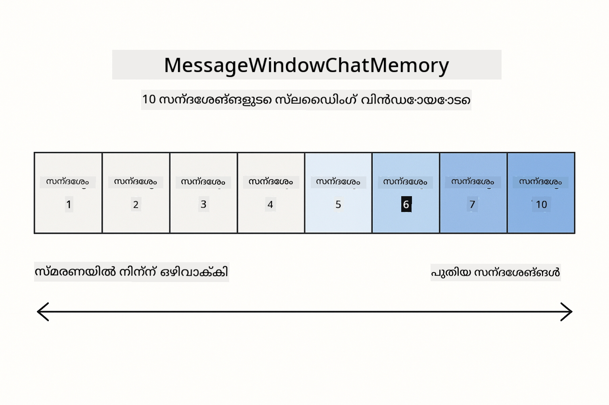
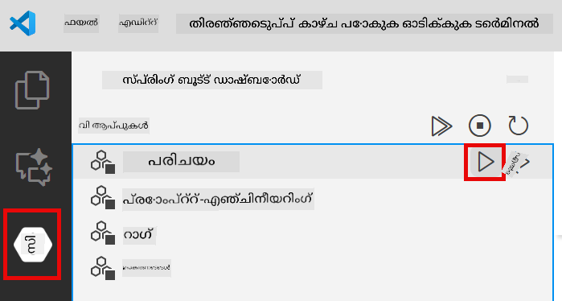

<!--
CO_OP_TRANSLATOR_METADATA:
{
  "original_hash": "c3e07ca58d0b8a3f47d3bf5728541e0a",
  "translation_date": "2025-12-13T14:22:31+00:00",
  "source_file": "01-introduction/README.md",
  "language_code": "ml"
}
-->
# Module 01: LangChain4j ഉപയോഗിച്ച് ആരംഭിക്കുന്നത്

## ഉള്ളടക്ക പട്ടിക

- [നിങ്ങൾ പഠിക്കാനിരിക്കുന്നതെന്ത്](../../../01-introduction)
- [ആവശ്യമായ മുൻകൂട്ടി അറിവുകൾ](../../../01-introduction)
- [പ്രധാന പ്രശ്നം മനസ്സിലാക്കൽ](../../../01-introduction)
- [ടോക്കണുകൾ മനസ്സിലാക്കൽ](../../../01-introduction)
- [മെമ്മറി എങ്ങനെ പ്രവർത്തിക്കുന്നു](../../../01-introduction)
- [ഇത് LangChain4j എങ്ങനെ ഉപയോഗിക്കുന്നു](../../../01-introduction)
- [Azure OpenAI ഇൻഫ്രാസ്ട്രക്ചർ വിന്യസിക്കുക](../../../01-introduction)
- [അപ്ലിക്കേഷൻ ലോക്കലായി പ്രവർത്തിപ്പിക്കുക](../../../01-introduction)
- [അപ്ലിക്കേഷൻ ഉപയോഗിക്കൽ](../../../01-introduction)
  - [സ്റ്റേറ്റ്ലെസ് ചാറ്റ് (ഇടത് പാനൽ)](../../../01-introduction)
  - [സ്റ്റേറ്റ്ഫുൾ ചാറ്റ് (വലത് പാനൽ)](../../../01-introduction)
- [അടുത്ത ഘട്ടങ്ങൾ](../../../01-introduction)

## നിങ്ങൾ പഠിക്കാനിരിക്കുന്നതെന്ത്

നിങ്ങൾ ക്വിക്ക് സ്റ്റാർട്ട് പൂർത്തിയാക്കിയെങ്കിൽ, പ്രോംപ്റ്റുകൾ അയച്ച് പ്രതികരണങ്ങൾ എങ്ങനെ ലഭ്യമാക്കാമെന്ന് കണ്ടിരിക്കും. അതാണ് അടിസ്ഥാനമെങ്കിലും, യഥാർത്ഥ അപ്ലിക്കേഷനുകൾക്ക് കൂടുതൽ ആവശ്യമാണ്. ഈ മോഡ്യൂൾ സംഭാഷണ AI നിർമ്മിക്കാൻ പഠിപ്പിക്കുന്നു, അത് കോൺടെക്സ്റ്റ് ഓർമ്മിക്കുകയും സ്റ്റേറ്റ് നിലനിർത്തുകയും ചെയ്യുന്നു - ഒറ്റ പ്രദർശനവും പ്രൊഡക്ഷൻ-സജ്ജമായ അപ്ലിക്കേഷനും തമ്മിലുള്ള വ്യത്യാസം.

ഈ ഗൈഡിൽ മുഴുവൻ Azure OpenAIയുടെ GPT-5 ഉപയോഗിക്കും, കാരണം അതിന്റെ പുരോഗമിച്ച തർക്കശേഷികൾ വ്യത്യസ്ത പാറ്റേണുകളുടെ പെരുമാറ്റം കൂടുതൽ വ്യക്തമായി കാണിക്കുന്നു. നിങ്ങൾ മെമ്മറി ചേർക്കുമ്പോൾ, വ്യത്യാസം വ്യക്തമായി കാണാം. ഇത് ഓരോ ഘടകവും നിങ്ങളുടെ അപ്ലിക്കേഷനിലേക്ക് എന്ത് കൊണ്ടുവരുന്നു എന്ന് മനസ്സിലാക്കാൻ എളുപ്പമാക്കുന്നു.

നിങ്ങൾ രണ്ട് പാറ്റേണുകളും പ്രദർശിപ്പിക്കുന്ന ഒരു അപ്ലിക്കേഷൻ നിർമ്മിക്കും:

**സ്റ്റേറ്റ്ലെസ് ചാറ്റ്** - ഓരോ അഭ്യർത്ഥനയും സ്വതന്ത്രമാണ്. മോഡലിന് മുൻപ് അയച്ച സന്ദേശങ്ങളുടെ ഓർമ്മയില്ല. ഇത് ക്വിക്ക് സ്റ്റാർട്ടിൽ നിങ്ങൾ ഉപയോഗിച്ച പാറ്റേണാണ്.

**സ്റ്റേറ്റ്ഫുൾ സംഭാഷണം** - ഓരോ അഭ്യർത്ഥനയിലും സംഭാഷണ ചരിത്രം ഉൾപ്പെടുന്നു. മോഡൽ പല തവണകളിലും കോൺടെക്സ്റ്റ് നിലനിർത്തുന്നു. പ്രൊഡക്ഷൻ അപ്ലിക്കേഷനുകൾക്ക് ഇത് ആവശ്യമാണ്.

## ആവശ്യമായ മുൻകൂട്ടി അറിവുകൾ

- Azure OpenAI ആക്‌സസ് ഉള്ള Azure സബ്സ്ക്രിപ്ഷൻ
- Java 21, Maven 3.9+
- Azure CLI (https://learn.microsoft.com/en-us/cli/azure/install-azure-cli)
- Azure Developer CLI (azd) (https://learn.microsoft.com/en-us/azure/developer/azure-developer-cli/install-azd)

> **കുറിപ്പ്:** Java, Maven, Azure CLI, Azure Developer CLI (azd) നൽകിയ devcontainer-ൽ മുൻകൂട്ടി ഇൻസ്റ്റാൾ ചെയ്തിട്ടുണ്ട്.

> **കുറിപ്പ്:** ഈ മോഡ്യൂൾ Azure OpenAI-യിൽ GPT-5 ഉപയോഗിക്കുന്നു. വിന്യാസം `azd up` വഴി സ്വയം ക്രമീകരിക്കപ്പെടുന്നു - കോഡിൽ മോഡൽ നാമം മാറ്റരുത്.

## പ്രധാന പ്രശ്നം മനസ്സിലാക്കൽ

ഭാഷാ മോഡലുകൾ സ്റ്റേറ്റ്ലെസ് ആണ്. ഓരോ API കോൾ സ്വതന്ത്രമാണ്. നിങ്ങൾ "എന്റെ പേര് ജോൺ ആണ്" എന്ന് അയച്ച ശേഷം "എന്റെ പേര് എന്താണ്?" എന്ന് ചോദിച്ചാൽ, മോഡലിന് നിങ്ങൾ ഇപ്പോൾ തന്നെ പരിചയപ്പെടുത്തിയതായി അറിയില്ല. ഇത് ഓരോ അഭ്യർത്ഥനയും ആദ്യ സംഭാഷണമായാണ് കാണുന്നത്.

സാധാരണ Q&A-യ്ക്ക് ഇത് ശരിയാണെങ്കിലും യഥാർത്ഥ അപ്ലിക്കേഷനുകൾക്ക് ഇത് ഉപയോഗപ്രദമല്ല. കസ്റ്റമർ സർവീസ് ബോട്ടുകൾ നിങ്ങൾ പറഞ്ഞത് ഓർമ്മിക്കണം. വ്യക്തിഗത അസിസ്റ്റന്റുകൾക്ക് കോൺടെക്സ്റ്റ് ആവശ്യമുണ്ട്. ഏത് മൾട്ടി-ടേൺ സംഭാഷണത്തിനും മെമ്മറി ആവശ്യമാണ്.


*സ്റ്റേറ്റ്ലെസ് (സ്വതന്ത്ര കോൾസ്) ഉം സ്റ്റേറ്റ്ഫുൾ (കോൺടെക്സ്റ്റ്-അവെയർ) സംഭാഷണങ്ങൾ തമ്മിലുള്ള വ്യത്യാസം*

## ടോക്കണുകൾ മനസ്സിലാക്കൽ

സംഭാഷണങ്ങളിൽ പ്രവേശിക്കുന്നതിന് മുമ്പ്, ടോക്കണുകൾ മനസ്സിലാക്കുന്നത് പ്രധാനമാണ് - ഭാഷാ മോഡലുകൾ പ്രോസസ്സ് ചെയ്യുന്ന അടിസ്ഥാന ടെക്സ്റ്റ് യൂണിറ്റുകൾ:


*ടെക്സ്റ്റ് എങ്ങനെ ടോക്കണുകളായി വിഭജിക്കപ്പെടുന്നു എന്ന ഉദാഹരണം - "I love AI!" 4 വ്യത്യസ്ത പ്രോസസ്സിംഗ് യൂണിറ്റുകളായി മാറുന്നു*

ടോക്കണുകൾ AI മോഡലുകൾ ടെക്സ്റ്റ് അളക്കാനും പ്രോസസ്സ് ചെയ്യാനും ഉപയോഗിക്കുന്നു. വാക്കുകൾ, പുണ്ക്തി ചിഹ്നങ്ങൾ, ഇടവേളകൾ പോലും ടോക്കണുകൾ ആകാം. നിങ്ങളുടെ മോഡലിന് ഒരേസമയം എത്ര ടോക്കണുകൾ പ്രോസസ്സ് ചെയ്യാമെന്ന് ഒരു പരിധി ഉണ്ട് (GPT-5-ന് 400,000, അതിൽ 272,000 ഇൻപുട്ട് ടോക്കണുകളും 128,000 ഔട്ട്പുട്ട് ടോക്കണുകളും). ടോക്കണുകൾ മനസ്സിലാക്കുന്നത് സംഭാഷണ ദൈർഘ്യവും ചെലവും നിയന്ത്രിക്കാൻ സഹായിക്കുന്നു.

## മെമ്മറി എങ്ങനെ പ്രവർത്തിക്കുന്നു

ചാറ്റ് മെമ്മറി സ്റ്റേറ്റ്ലെസ് പ്രശ്നം പരിഹരിക്കുന്നു, സംഭാഷണ ചരിത്രം നിലനിർത്തി. മോഡലിലേക്ക് അഭ്യർത്ഥന അയയ്ക്കുന്നതിന് മുമ്പ്, ഫ്രെയിംവർക്ക് ബന്ധപ്പെട്ട മുൻ സന്ദേശങ്ങൾ ചേർക്കുന്നു. നിങ്ങൾ "എന്റെ പേര് എന്താണ്?" എന്ന് ചോദിക്കുമ്പോൾ, സിസ്റ്റം മുഴുവൻ സംഭാഷണ ചരിത്രം അയയ്ക്കുന്നു, അതിലൂടെ മോഡലിന് നിങ്ങൾ മുമ്പ് "എന്റെ പേര് ജോൺ ആണ്" എന്ന് പറഞ്ഞത് കാണാം.

LangChain4j ഓട്ടോമാറ്റിക്കായി ഇത് കൈകാര്യം ചെയ്യുന്ന മെമ്മറി ഇംപ്ലിമെന്റേഷനുകൾ നൽകുന്നു. നിങ്ങൾ എത്ര സന്ദേശങ്ങൾ സൂക്ഷിക്കണമെന്ന് തിരഞ്ഞെടുക്കും, ഫ്രെയിംവർക്ക് കോൺടെക്സ്റ്റ് വിൻഡോ മാനേജ് ചെയ്യും.



*MessageWindowChatMemory അടുത്തിടെ വന്ന സന്ദേശങ്ങളുടെ സ്ലൈഡിംഗ് വിൻഡോ നിലനിർത്തുന്നു, പഴയവ സ്വയം ഒഴിവാക്കുന്നു*

## ഇത് LangChain4j എങ്ങനെ ഉപയോഗിക്കുന്നു

ഈ മോഡ്യൂൾ ക്വിക്ക് സ്റ്റാർട്ട് വിപുലീകരിച്ച് Spring Boot സംയോജിപ്പിക്കുകയും സംഭാഷണ മെമ്മറി ചേർക്കുകയും ചെയ്യുന്നു. ഘടകങ്ങൾ ഇങ്ങനെ ചേർക്കുന്നു:

**ഡിപ്പൻഡൻസികൾ** - രണ്ട് LangChain4j ലൈബ്രറികൾ ചേർക്കുക:

```xml
<dependency>
    <groupId>dev.langchain4j</groupId>
    <artifactId>langchain4j</artifactId> <!-- Inherited from BOM in root pom.xml -->
</dependency>
<dependency>
    <groupId>dev.langchain4j</groupId>
    <artifactId>langchain4j-open-ai-official</artifactId> <!-- Inherited from BOM in root pom.xml -->
</dependency>
```

**ചാറ്റ് മോഡൽ** - Azure OpenAI Spring ബീൻ ആയി കോൺഫിഗർ ചെയ്യുക ([LangChainConfig.java](../../../01-introduction/src/main/java/com/example/langchain4j/config/LangChainConfig.java)):

```java
@Bean
public OpenAiOfficialChatModel openAiOfficialChatModel() {
    return OpenAiOfficialChatModel.builder()
            .baseUrl(azureEndpoint)
            .apiKey(azureApiKey)
            .modelName(deploymentName)
            .timeout(Duration.ofMinutes(5))
            .maxRetries(3)
            .build();
}
```

ബിൽഡർ `azd up` വഴി സജ്ജമാക്കിയ എൻവയോൺമെന്റ് വേരിയബിളുകളിൽ നിന്ന് ക്രെഡൻഷ്യലുകൾ വായിക്കുന്നു. `baseUrl` നിങ്ങളുടെ Azure എൻഡ്പോയിന്റ് ആയി സജ്ജമാക്കുന്നത് OpenAI ക്ലയന്റ് Azure OpenAI-യുമായി പ്രവർത്തിക്കാൻ സഹായിക്കുന്നു.

**സംഭാഷണ മെമ്മറി** - MessageWindowChatMemory ഉപയോഗിച്ച് ചാറ്റ് ചരിത്രം ട്രാക്ക് ചെയ്യുക ([ConversationService.java](../../../01-introduction/src/main/java/com/example/langchain4j/service/ConversationService.java)):

```java
ChatMemory memory = MessageWindowChatMemory.withMaxMessages(10);

memory.add(UserMessage.from("My name is John"));
memory.add(AiMessage.from("Nice to meet you, John!"));

memory.add(UserMessage.from("What's my name?"));
AiMessage aiMessage = chatModel.chat(memory.messages()).aiMessage();
memory.add(aiMessage);
```

`withMaxMessages(10)` ഉപയോഗിച്ച് അവസാന 10 സന്ദേശങ്ങൾ സൂക്ഷിക്കാൻ മെമ്മറി സൃഷ്ടിക്കുക. Typed wrappers ഉപയോഗിച്ച് ഉപയോക്തൃ, AI സന്ദേശങ്ങൾ ചേർക്കുക: `UserMessage.from(text)` , `AiMessage.from(text)`. `memory.messages()` ഉപയോഗിച്ച് ചരിത്രം ലഭിച്ച് മോഡലിലേക്ക് അയയ്ക്കുക. സർവീസ് ഓരോ സംഭാഷണ ID-ക്കും വേർതിരിച്ച മെമ്മറി ഇൻസ്റ്റൻസുകൾ സൂക്ഷിക്കുന്നു, ഇതിലൂടെ ഒരേ സമയം പല ഉപയോക്താക്കളും ചാറ്റ് ചെയ്യാം.

> **🤖 GitHub Copilot Chat ഉപയോഗിച്ച് പരീക്ഷിക്കുക:** [`ConversationService.java`](../../../01-introduction/src/main/java/com/example/langchain4j/service/ConversationService.java) തുറന്ന് ചോദിക്കാം:
> - "MessageWindowChatMemory വിൻഡോ പൂർണ്ണമായപ്പോൾ ഏത് സന്ദേശങ്ങൾ ഒഴിവാക്കണമെന്ന് എങ്ങനെ തീരുമാനിക്കുന്നു?"
> - "ഇൻ-മെമ്മറി പകരം ഡാറ്റാബേസ് ഉപയോഗിച്ച് കസ്റ്റം മെമ്മറി സ്റ്റോറേജ് എങ്ങനെ നടപ്പിലാക്കാം?"
> - "പഴയ സംഭാഷണ ചരിത്രം സംക്ഷിപ്തമാക്കാൻ സംഗ്രഹം ചേർക്കുന്നത് എങ്ങനെ ചെയ്യാം?"

സ്റ്റേറ്റ്ലെസ് ചാറ്റ് എൻഡ്‌പോയിന്റ് മെമ്മറി പൂർണ്ണമായും ഒഴിവാക്കുന്നു - ക്വിക്ക് സ്റ്റാർട്ടിലെ പോലെ `chatModel.chat(prompt)` മാത്രം. സ്റ്റേറ്റ്ഫുൾ എൻഡ്‌പോയിന്റ് സന്ദേശങ്ങൾ മെമ്മറിയിൽ ചേർക്കുന്നു, ചരിത്രം തിരികെ വാങ്ങുന്നു, ഓരോ അഭ്യർത്ഥനയോടും കോൺടെക്സ്റ്റ് ഉൾപ്പെടുത്തുന്നു. മോഡൽ കോൺഫിഗറേഷൻ ഒരുപോലെയാണ്, പാറ്റേണുകൾ വ്യത്യസ്തമാണ്.

## Azure OpenAI ഇൻഫ്രാസ്ട്രക്ചർ വിന്യസിക്കുക

**Bash:**
```bash
cd 01-introduction
azd up  # സബ്സ്ക്രിപ്ഷനും സ്ഥലം (eastus2 ശുപാർശ ചെയ്യുന്നു) തിരഞ്ഞെടുക്കുക
```

**PowerShell:**
```powershell
cd 01-introduction
azd up  # സബ്സ്ക്രിപ്ഷനും സ്ഥലം (eastus2 ശുപാർശ ചെയ്യുന്നു) തിരഞ്ഞെടുക്കുക
```

> **കുറിപ്പ്:** ടൈംഔട്ട് പിശക് (`RequestConflict: Cannot modify resource ... provisioning state is not terminal`) ഉണ്ടെങ്കിൽ, `azd up` വീണ്ടും പ്രവർത്തിപ്പിക്കുക. Azure റിസോഴ്‌സുകൾ പിന്നിൽ ഇപ്പോഴും വിന്യസിക്കപ്പെടുന്നിരിക്കാം, റിട്രൈ ചെയ്യുന്നത് റിസോഴ്‌സുകൾ ടെർമിനൽ സ്റ്റേറ്റിൽ എത്തുമ്പോൾ വിന്യാസം പൂർത്തിയാക്കാൻ സഹായിക്കും.

ഇത് ചെയ്യും:
1. GPT-5, text-embedding-3-small മോഡലുകളുമായി Azure OpenAI റിസോഴ്‌സ് വിന്യസിക്കുക
2. ക്രെഡൻഷ്യലുകളോടെ `.env` ഫയൽ പ്രോജക്ട് റൂട്ടിൽ സ്വയം സൃഷ്ടിക്കുക
3. ആവശ്യമായ എല്ലാ എൻവയോൺമെന്റ് വേരിയബിളുകളും സജ്ജമാക്കുക

**വിന്യാസ പ്രശ്നങ്ങളുണ്ടോ?** സബ്‌ഡൊമെയ്ൻ നാമം സംഘർഷങ്ങൾ, മാനുവൽ Azure പോർട്ടൽ വിന്യാസം, മോഡൽ കോൺഫിഗറേഷൻ മാർഗ്ഗനിർദ്ദേശങ്ങൾ എന്നിവ ഉൾപ്പെടെ വിശദമായ ട്രബിള്ഷൂട്ടിംഗിനായി [Infrastructure README](infra/README.md) കാണുക.

**വിന്യാസം വിജയിച്ചുവെന്ന് സ്ഥിരീകരിക്കുക:**

**Bash:**
```bash
cat ../.env  # AZURE_OPENAI_ENDPOINT, API_KEY, തുടങ്ങിയവ കാണിക്കണം.
```

**PowerShell:**
```powershell
Get-Content ..\.env  # AZURE_OPENAI_ENDPOINT, API_KEY, തുടങ്ങിയവ കാണിക്കണം.
```

> **കുറിപ്പ്:** `azd up` കമാൻഡ് `.env` ഫയൽ സ്വയം സൃഷ്ടിക്കുന്നു. പിന്നീട് അപ്ഡേറ്റ് ചെയ്യേണ്ടതുണ്ടെങ്കിൽ, `.env` ഫയൽ മാനുവലായി എഡിറ്റ് ചെയ്യാം അല്ലെങ്കിൽ താഴെ കാണുന്ന കമാൻഡ് ഉപയോഗിച്ച് വീണ്ടും സൃഷ്ടിക്കാം:
>
> **Bash:**
> ```bash
> cd ..
> bash .azd-env.sh
> ```
>
> **PowerShell:**
> ```powershell
> cd ..
> .\.azd-env.ps1
> ```

## അപ്ലിക്കേഷൻ ലോക്കലായി പ്രവർത്തിപ്പിക്കുക

**വിന്യാസം സ്ഥിരീകരിക്കുക:**

Azure ക്രെഡൻഷ്യലുകളുള്ള `.env` ഫയൽ റൂട്ടിൽ ഉണ്ടെന്ന് ഉറപ്പാക്കുക:

**Bash:**
```bash
cat ../.env  # AZURE_OPENAI_ENDPOINT, API_KEY, DEPLOYMENT കാണിക്കണം
```

**PowerShell:**
```powershell
Get-Content ..\.env  # AZURE_OPENAI_ENDPOINT, API_KEY, DEPLOYMENT കാണിക്കണം
```

**അപ്ലിക്കേഷനുകൾ ആരംഭിക്കുക:**

**ഓപ്ഷൻ 1: Spring Boot ഡാഷ്ബോർഡ് ഉപയോഗിച്ച് (VS Code ഉപയോക്താക്കൾക്ക് ശുപാർശ ചെയ്യുന്നു)**

Devcontainer-ൽ Spring Boot ഡാഷ്ബോർഡ് എക്സ്റ്റൻഷൻ ഉൾപ്പെടുത്തിയിട്ടുണ്ട്, ഇത് എല്ലാ Spring Boot അപ്ലിക്കേഷനുകളും ദൃശ്യമായി നിയന്ത്രിക്കാൻ സഹായിക്കുന്നു. VS Code-യുടെ ഇടത് Activity Bar-ൽ Spring Boot ഐക്കൺ കാണുക.

Spring Boot ഡാഷ്ബോർഡിൽ നിന്ന് നിങ്ങൾക്ക്:
- വർക്ക്‌സ്പേസിലെ എല്ലാ Spring Boot അപ്ലിക്കേഷനുകളും കാണാം
- ഒറ്റ ക്ലിക്കിൽ അപ്ലിക്കേഷനുകൾ ആരംഭിക്കാനും നിർത്താനും കഴിയും
- അപ്ലിക്കേഷൻ ലോഗുകൾ റിയൽ-ടൈമിൽ കാണാം
- അപ്ലിക്കേഷൻ നില നിരീക്ഷിക്കാം

"introduction" പക്കൽ പ്ലേ ബട്ടൺ ക്ലിക്ക് ചെയ്ത് ഈ മോഡ്യൂൾ ആരംഭിക്കാം, അല്ലെങ്കിൽ എല്ലാ മോഡ്യൂളുകളും ഒരുമിച്ച് ആരംഭിക്കാം.



**ഓപ്ഷൻ 2: ഷെൽ സ്ക്രിപ്റ്റുകൾ ഉപയോഗിച്ച്**

എല്ലാ വെബ് അപ്ലിക്കേഷനുകളും (മോഡ്യൂളുകൾ 01-04) ആരംഭിക്കുക:

**Bash:**
```bash
cd ..  # റൂട്ട് ഡയറക്ടറിയിൽ നിന്ന്
./start-all.sh
```

**PowerShell:**
```powershell
cd ..  # റൂട്ട് ഡയറക്ടറിയിൽ നിന്ന്
.\start-all.ps1
```

അല്ലെങ്കിൽ ഈ മോഡ്യൂൾ മാത്രം ആരംഭിക്കുക:

**Bash:**
```bash
cd 01-introduction
./start.sh
```

**PowerShell:**
```powershell
cd 01-introduction
.\start.ps1
```

രണ്ടു സ്ക്രിപ്റ്റുകളും സ്വയം റൂട്ടിലെ `.env` ഫയലിൽ നിന്നുള്ള എൻവയോൺമെന്റ് വേരിയബിളുകൾ ലോഡ് ചെയ്യും, JAR ഫയലുകൾ ഇല്ലെങ്കിൽ നിർമ്മിക്കും.

> **കുറിപ്പ്:** തുടങ്ങുന്നതിന് മുമ്പ് എല്ലാ മോഡ്യൂളുകളും മാനുവലായി നിർമ്മിക്കാൻ ആഗ്രഹിക്കുന്നുവെങ്കിൽ:
>
> **Bash:**
> ```bash
> cd ..  # Go to root directory
> mvn clean package -DskipTests
> ```
>
> **PowerShell:**
> ```powershell
> cd ..  # Go to root directory
> mvn clean package -DskipTests
> ```

http://localhost:8080 നിങ്ങളുടെ ബ്രൗസറിൽ തുറക്കുക.

**നിർത്താൻ:**

**Bash:**
```bash
./stop.sh  # ഈ മോഡ്യൂൾ മാത്രം
# അല്ലെങ്കിൽ
cd .. && ./stop-all.sh  # എല്ലാ മോഡ്യൂളുകളും
```

**PowerShell:**
```powershell
.\stop.ps1  # ഈ മോഡ്യൂൾ മാത്രം
# അല്ലെങ്കിൽ
cd ..; .\stop-all.ps1  # എല്ലാ മോഡ്യൂളുകളും
```

## അപ്ലിക്കേഷൻ ഉപയോഗിക്കൽ

അപ്ലിക്കേഷൻ രണ്ട് ചാറ്റ് ഇംപ്ലിമെന്റേഷനുകളുമായി വെബ് ഇന്റർഫേസ് നൽകുന്നു, പക്കൽ-പക്കൽ.


*സിംപിൾ ചാറ്റ് (സ്റ്റേറ്റ്ലെസ്) ഉം കോൺവേഴ്സേഷണൽ ചാറ്റ് (സ്റ്റേറ്റ്ഫുൾ) ഉം ഉള്ള ഡാഷ്ബോർഡ്*

### സ്റ്റേറ്റ്ലെസ് ചാറ്റ് (ഇടത് പാനൽ)

ഇത് ആദ്യം പരീക്ഷിക്കുക. "എന്റെ പേര് ജോൺ ആണ്" എന്ന് ചോദിച്ച് ഉടൻ "എന്റെ പേര് എന്താണ്?" എന്ന് ചോദിക്കുക. മോഡൽ ഓർമ്മിക്കില്ല, കാരണം ഓരോ സന്ദേശവും സ്വതന്ത്രമാണ്. ഇത് അടിസ്ഥാന ഭാഷാ മോഡൽ സംയോജനം ഉള്ള പ്രധാന പ്രശ്നം കാണിക്കുന്നു - സംഭാഷണ കോൺടെക്സ്റ്റ് ഇല്ല.


*AI മുൻ സന്ദേശത്തിൽ നിന്നുള്ള നിങ്ങളുടെ പേര് ഓർമ്മിക്കുന്നില്ല*

### സ്റ്റേറ്റ്ഫുൾ ചാറ്റ് (വലത് പാനൽ)

ഇപ്പോൾ ഇതേ ക്രമം ഇവിടെ പരീക്ഷിക്കുക. "എന്റെ പേര് ജോൺ ആണ്" എന്ന് ചോദിച്ച് "എന്റെ പേര് എന്താണ്?" എന്ന് ചോദിക്കുമ്പോൾ ഇത് ഓർമ്മിക്കുന്നു. വ്യത്യാസം MessageWindowChatMemory ആണ് - ഇത് സംഭാഷണ ചരിത്രം നിലനിർത്തുകയും ഓരോ അഭ്യർത്ഥനയോടും അത് ഉൾപ്പെടുത്തുകയും ചെയ്യുന്നു. പ്രൊഡക്ഷൻ സംഭാഷണ AI ഇങ്ങനെ പ്രവർത്തിക്കുന്നു.


*AI മുമ്പത്തെ സംഭാഷണത്തിൽ നിന്നുള്ള നിങ്ങളുടെ പേര് ഓർമ്മിക്കുന്നു*

രണ്ടു പാനലുകളും ഒരേ GPT-5 മോഡൽ ഉപയോഗിക്കുന്നു. വ്യത്യാസം മെമ്മറിയിലാണ്. ഇത് മെമ്മറി നിങ്ങളുടെ അപ്ലിക്കേഷനിലേക്ക് എന്ത് കൊണ്ടുവരുന്നു എന്നും യഥാർത്ഥ ഉപയോഗത്തിനായി അതിന്റെ ആവശ്യകതയും വ്യക്തമാക്കുന്നു.

## അടുത്ത ഘട്ടങ്ങൾ

**അടുത്ത മോഡ്യൂൾ:** [02-prompt-engineering - GPT-5 ഉപയോഗിച്ച് പ്രോംപ്റ്റ് എഞ്ചിനീയറിംഗ്](../02-prompt-engineering/README.md)

---

**നാവിഗേഷൻ:** [← മുൻപ്: Module 00 - Quick Start](../00-quick-start/README.md) | [പ്രധാനത്തിലേക്ക് മടങ്ങുക](../README.md) | [അടുത്തത്: Module 02 - Prompt Engineering →](../02-prompt-engineering/README.md)

---

<!-- CO-OP TRANSLATOR DISCLAIMER START -->
**അസൂയാപത്രം**:  
ഈ രേഖ AI വിവർത്തന സേവനം [Co-op Translator](https://github.com/Azure/co-op-translator) ഉപയോഗിച്ച് വിവർത്തനം ചെയ്തതാണ്. നാം കൃത്യതയ്ക്ക് ശ്രമിച്ചിട്ടുണ്ടെങ്കിലും, യന്ത്രം ചെയ്ത വിവർത്തനങ്ങളിൽ പിശകുകൾ അല്ലെങ്കിൽ തെറ്റുകൾ ഉണ്ടാകാമെന്ന് ദയവായി ശ്രദ്ധിക്കുക. അതിന്റെ മാതൃഭാഷയിലുള്ള യഥാർത്ഥ രേഖ അധികാരപരമായ ഉറവിടമായി കണക്കാക്കപ്പെടണം. നിർണായക വിവരങ്ങൾക്ക്, പ്രൊഫഷണൽ മനുഷ്യ വിവർത്തനം ശുപാർശ ചെയ്യപ്പെടുന്നു. ഈ വിവർത്തനം ഉപയോഗിക്കുന്നതിൽ നിന്നുണ്ടാകുന്ന ഏതെങ്കിലും തെറ്റിദ്ധാരണകൾക്കോ തെറ്റായ വ്യാഖ്യാനങ്ങൾക്കോ ഞങ്ങൾ ഉത്തരവാദികളല്ല.
<!-- CO-OP TRANSLATOR DISCLAIMER END -->