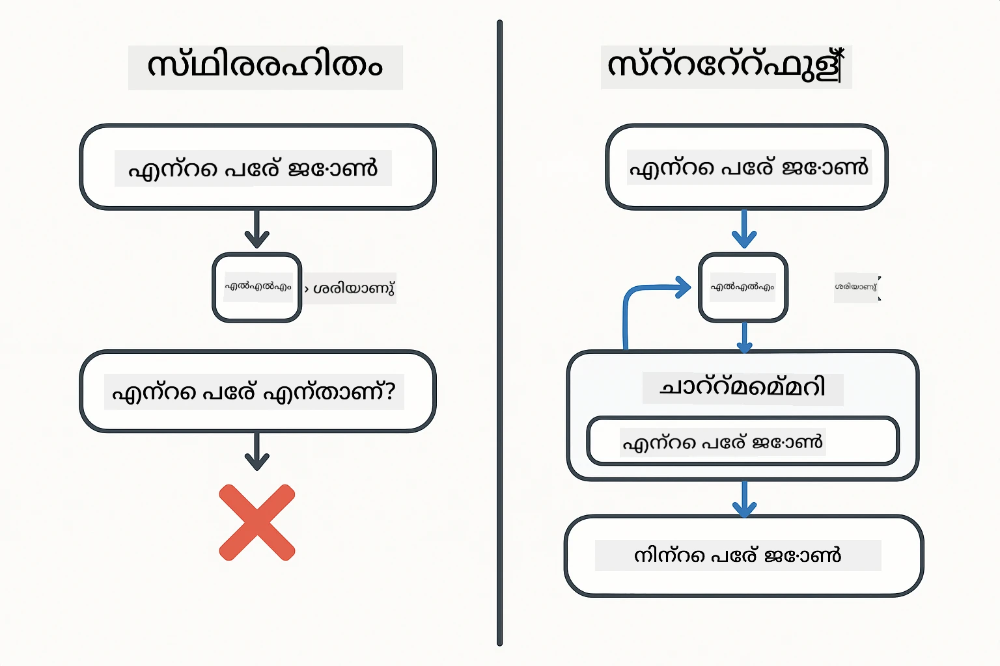
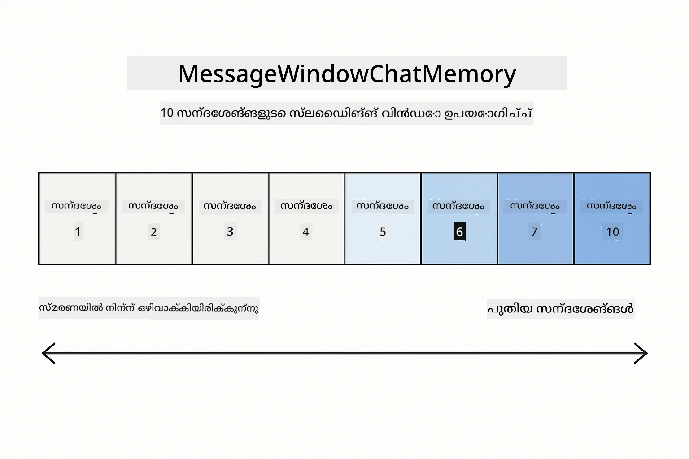
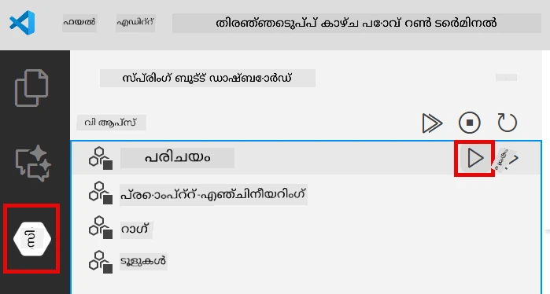
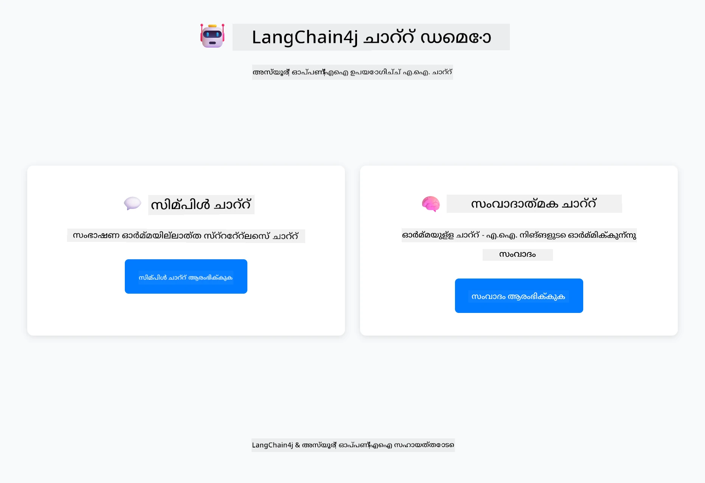
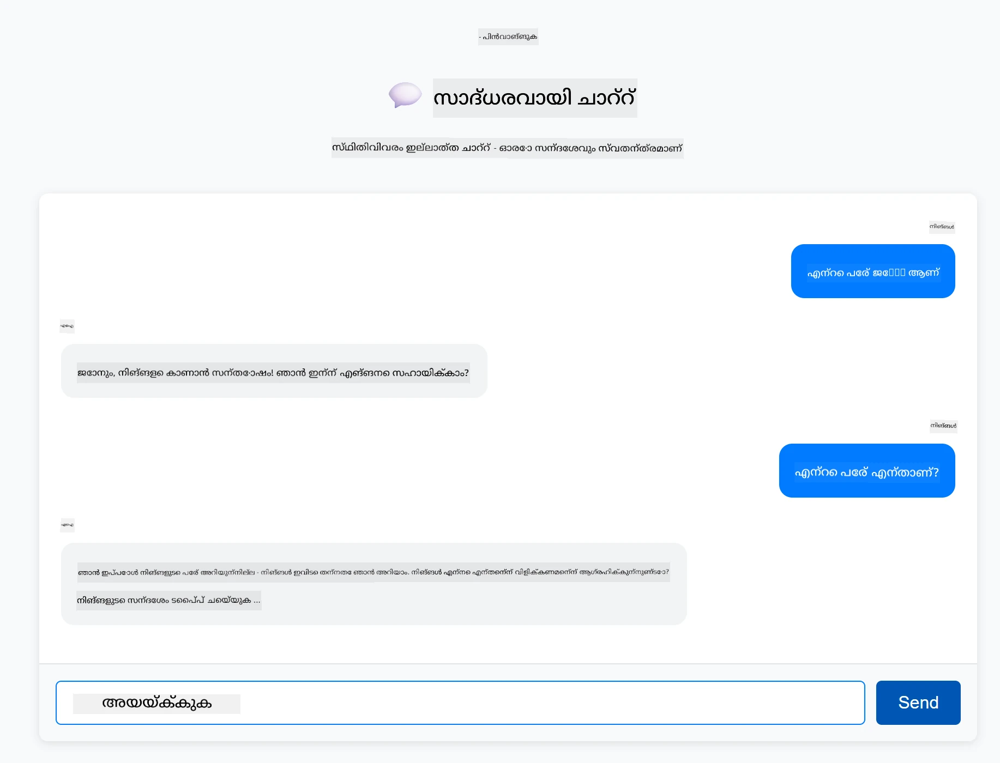
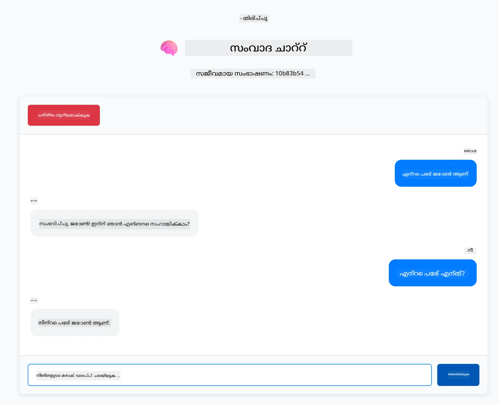

# Module 01: LangChain4j ഉപയോഗിച്ച് ആരംഭിക്കൽ

## ഉള്ളടക്ക പട്ടിക

- [വീഡിയോ നടത്തിപ്പ്](#വീഡിയോ-നടത്തിപ്പ്)
- [നിങ്ങൾ പഠിക്കു‍ന്നു്](#നിങ്ങൾ-പഠിക്കു‍ന്നു്)
- [അവസാന്റെ സാഹചര്യങ്ങൾ](#അവസാന്റെ-സാഹചര്യങ്ങൾ)
- [പ്രധാന പ്രശ്നം മനസിലാക്കല്‍](#പ്രധാന-പ്രശ്നം-മനസിലാക്കല്‍)
- [ടോക്കണുകൾ മനസിലാക്കുക](#ടോക്കണുകൾ-മനസിലാക്കുക)
- [മെമ്മറി എങ്ങനെ പ്രവർത്തിക്കുന്നു](#മെമ്മറി-എങ്ങനെ-പ്രവർത്തിക്കുന്നു)
- [ഇത് LangChain4j എങ്ങനെ ഉപയോഗിക്കുന്നു](#ഇത്-langchain4j-എങ്ങനെ-ഉപയോഗിക്കുന്നു)
- [Azure OpenAI ഇൻഫ്രാസ്ട്രക്ചർ വിന്യസിക്കുക](#azure-openai-ഇൻഫ്രാസ്ട്രക്ചർ-വിന്യാസം)
- [ആപ്ലിക്കേഷൻ ലോക്കലായി പ്രവർത്തിക്കുക](#ആപ്ലിക്കേഷൻ-ലോക്കലായി-പ്രവർത്തിക്കുക)
- [ആപ്ലിക്കേഷൻ ഉപയോഗിക്കൽ](#ആപ്ലിക്കേഷൻ-ഉപയോഗിക്കൽ)
  - [സ്റ്റേറ്റ്‌ലെസ് ചാറ്റ് (ഇടത് പാനൽ)](#സ്റ്റേറ്റ്‌ലെസ്-چാറ്റ്-ഇടത്-പാനൽ)
  - [സ്റ്റേറ്റ്‌ഫുൾ ചാറ്റ് (വലതു പാനൽ)](#സ്റ്റേറ്റ്‌ഫുൾ-ചാറ്റ്-വലതു-പാനൽ)
- [അടുത്ത ഘട്ടങ്ങൾ](#അടുത്ത-ഘട്ടങ്ങൾ)

## വീഡിയോ നടത്തിപ്പ്

ഈ മോട്യൂളുമായി ആരംഭിക്കുന്നത് എങ്ങനെ എന്ന് വിശദീകരിക്കുന്ന ഈ ലൈവ് സെഷൻ കാണുക:

<a href="https://www.youtube.com/live/nl_troDm8rQ?si=6b85S8xGjWnT2fX9"></a>

## നിങ്ങൾ പഠിക്കു‍ന്നു്

LangChain4j, Azure OpenAI എന്നിവെയുമായി ആരംഭിക്കുന്നതിന് ഇത് നിങ്ങളുടെ തുടക്കബിന്ദുവാണ്. നാം അടിസ്ഥാനങ്ങൾ പ്രാരംഭിച്, ഉൽപ്പാദനമാർഗ്ഗത്തിൽ പ്രയോഗങ്ങൾ നിർമ്മിക്കാൻ തുടങ്ങുന്നു. ഈ മോട്യൂൾ സംവാദ സൗഹൃദ AI-നെ കേന്ദ്രീകരിക്കുന്നു, അത് സന്ദർഭം ഓർമ്മിക്കുന്നു, സ്റ്റേറ്റ് നിലനിര്‍ത്തുന്നു - എല്ലാ പിന്നീട് വരുന്ന മോട്യൂളുകൾക്കും അടിസ്ഥാന ആശയങ്ങൾ.

ഇവിടെ നാം Azure OpenAI-യുടെ GPT-5.2 ഉപയോഗിക്കും, അതിന്റെ ഉയർന്ന നിര്ണയപ്രവർത്തിത്വങ്ങൾ വിവിധ മാതൃകകളുടെ പെരുമാറ്റം വ്യക്തമായി കാണാൻ സഹായിക്കുന്നു. മെമ്മറി ചേർക്കുമ്പോൾ, വ്യത്യാസം വളരെ স্পഷ്ടമായിരിക്കും. ഇത് ഓരോ ഘടകവും നിങ്ങളുടെ ആപ്ലിക്കേഷനിൽ എന്ത് കൊണ്ടുവരിക എന്നതു എളുപ്പത്തിൽ മനസിലാക്കാൻ സഹായിക്കും.

നിങ്ങൾ രണ്ടെണ്ണം പ്രയോഗങ്ങൾ നിർമ്മിക്കും, ഓരോ മാതൃകയും പ്രതിപാദിക്കുന്ന:

**സ്റ്റേറ്റ്‌ലെസ് ചാറ്റ്** - ഓരോ അഭ്യർത്ഥനയും സ്വതന്ത്രമാണ്. മോഡൽ മുമ്പത്തെ സന്ദേശങ്ങൾ ഓർമ്മിക്കുന്നില്ല. ഇത് ഏറ്റവും ലളിതമായ തുടക്കം.

**സ്റ്റേറ്റ്‌ഫുൾ സംവാദം** - ഓരോ അഭ്യർത്ഥനയും സംവാദ ചരിത്രം ഉൾക്കൊള്ളുന്നു. മോഡൽ പല തിരിവുകളിലും സന്ദർഭം നിലനിർത്തുന്നു. ഉൽപ്പാദന പ്രയോഗങ്ങൾക്ക് ഇത് ആവശ്യമാണ്.

## അവസാന്റെ സാഹചര്യങ്ങൾ

- Azure സബ്സ്ക്രിപ്ഷൻ Azure OpenAI ആക്സസ് സഹിതം
- Java 21, Maven 3.9+
- Azure CLI (https://learn.microsoft.com/en-us/cli/azure/install-azure-cli)
- Azure Developer CLI (azd) (https://learn.microsoft.com/en-us/azure/developer/azure-developer-cli/install-azd)

> **ശ്രദ്ധിക്കുക:** Java, Maven, Azure CLI, Azure Developer CLI (azd) ലഭ്യമായ devcontainer-ൽ മുൻകൂട്ടியே സ്ഥാപിച്ചിരിക്കുന്നു.

> **ശ്രദ്ധിക്കുക:** ഈ മോട്യൂൾ Azure OpenAI യിലെ GPT-5.2 ഉപയോഗിക്കുന്നു. വിന്യാസം സ്വയം `azd up` വഴിയാണ് നടത്തുന്നത് - കോഡിൽ മോഡൽ നാമം മാറ്റാൻ പാടില്ല.

## പ്രധാന പ്രശ്നം മനസിലാക്കല്‍

ഭാഷാ മാതൃകകൾ സ്റ്റേറ്റ്‌ലെസ്സാണ്. ഓരോ API കോളും സ്വതന്ത്രമാണു്. "എന്റെ പേര് ജോൺ ആണ്" എന്ന് അയച്ച ശേഷം "എന്റെ പേര് എന്താണ്?" എന്ന് ചോദിക്കുമ്പോൾ, മോഡലിന് നിങ്ങൾ അറിയിച്ചുവെന്ന് അറിയില്ല. അത് ഓരോ അഭ്യർത്ഥനയെ ആദ്യ സംവാദമെന്നു കരുതുന്നു.

പൊതു ചോദ്യോത്തരങ്ങളിൽ ഇതു പൊരുത്തപ്പെടുമ്പോൾ, യഥാർഥ ആപ്പ്ലിക്കേഷനുകളിൽ ഇത് ഉപകാരപ്പെട്ടില്ല. കസ്റ്റമർ സർവീസ് ബോട്ടുകൾ നിങ്ങൾ പറഞ്ഞത് ഓർമ്മിക്കണം. പേഴ്സണൽ അസിസ്റ്റന്റുകൾക്ക് സന്ദർഭം ആവശ്യമാണ്. പല വട്ട സംവാദങ്ങൾ മെമ്മറി ആവശ്യപ്പെടുന്നു.

താഴെയുള്ള ചിത്രത്തിലെ ഇടത് ഭാഗത്ത്, നിങ്ങളുടെ പേരു് മറക്കുന്ന സ്റ്റേറ്റ്‌ലെസ് കോളും, വലത് ഭാഗത്ത് ChatMemory ഉപയോഗിച്ച് മറപ്പിക്കാതെ നിലനിർത്തുന്ന സ്റ്റേറ്റ്‌ഫുൾ കോളും കാണിക്കുന്നു.



*സ്റ്റേറ്റ്‌ലെസ് (സ്വതന്ത്ര കോളുകൾ) ഒപ്പം സ്റ്റേറ്റ്‌ഫുൾ (സന്ദർഭമറിയുന്ന) സംവാദങ്ങളുടെ വ്യത്യാസം*

## ടോക്കണുകൾ മനസിലാക്കുക

സംവാദങ്ങളിലേക്ക് പ്രവേശിക്കുന്ന മുൻപ്, ടോക്കണുകൾ മനസിലാക്കുന്നു - ഭാഷാമാതൃകകൾ ഇന്ത്യെക്‌സ് ചെയ്യുന്ന അടിസ്ഥാന യൂണിറ്റുകൾ:


*വാചകം എങ്ങനെ ടോക്കണുകളായി വിഭജിക്കപ്പെടുന്നു - "I love AI!" എങ്കിൽ 4 സ്വതന്ത്ര പ്രോസസ്സ് യൂണിറ്റുകളായി*

ടോക്കണുകൾ എങ്ങനെ AI മാതൃകകൾ വാചകം അളക്കും, പ്രോസസ് ചെയ്യുമെന്നും എന്നതു Tomato. പദങ്ങൾ, വ്യാകരണരൂപങ്ങൾ, സ്ഥലങ്ങൾ പോലും ടോക്കണുകൾ ആകാം. മോഡലിന് ഒരാഴ്ചയിൽ എത്ര ടോക്കണുകൾ കൈകാര്യം ചെയ്യാമെന്ന് പരിധി ഉണ്ട് (GPT-5.2-നായി 400,000, എന്നാൽ ഇൻപുട്ട് ടോക്കണുകൾ 272,000 വരെ, ഔട്ട്പുട്ട് ടോക്കണുകൾ 128,000 വരെ). ടോക്കണുകൾ മനസിലാക്കുന്നത് സംവാദം നീളം‌, ചെലവ് എന്നിവ നിയന്ത്രിക്കാൻ സഹായിക്കും.

## മെമ്മറി എങ്ങനെ പ്രവർത്തിക്കുന്നു

ചാറ്റ് മെമ്മറി സ്റ്റേറ്റ്‌ലെസ് പ്രശ്നം പരിഹരിക്കുന്നു, ചാറ്റ് ചരിത്രം നിലനിർത്തുന്നു. മോഡലിന് അഭ്യർത്ഥനയ भेजുന്നതിന് മുൻപ്, ഫ്‌രെയിംവർക്ക് ആവശ്യമായ പഴയ സന്ദേശങ്ങൾ ചേർക്കുന്നു. നിങ്ങൾ "എന്റെ പേര് ജോൺ ആണ്" എന്നു പറഞ്ഞത് മോഡൽ കണ്ടിരിക്കുന്നത് ഉറപ്പാക്കുന്നു, "എന്റെ പേര് എന്താണ്?" എന്ന് ചോദിക്കുമ്പോൾ.

LangChain4j ഓട്ടോമാറ്റിക്കായി ഇതു കൈകാര്യം ചെയ്യുന്ന മെമ്മറി ഇംപ്ലിമെന്റേഷനുകൾ നൽകുന്നു. നിങ്ങൾ എത്ര സന്ദേശങ്ങൾ നിലനിര്‍ത്തണമെന്ന് തിരഞ്ഞെടുക്കാം, ഫ്രെയിംവർക്ക് കോൺടെക്സ്‌റ്റ് വിൻഡോ നിയന്ത്രിക്കുന്നു. താഴെയുള്ള ചിത്രം MessageWindowChatMemory എങ്ങനെ അടുത്ത സന്ദേശങ്ങൾ ഒരുങ്ങിയ വിൻഡോയിൽ നിലനിർത്തുന്നു എന്നത് കാണിക്കുന്നു.



*MessageWindowChatMemory അടുത്ത സന്ദേശങ്ങളുടെ സ്ലൈഡിംഗ് വിൻഡോ സംരക്ഷിക്കുന്നു, പഴയ സന്ദേശങ്ങൾ സ്വയം ഒഴിവാക്കുന്നു*

## ഇത് LangChain4j എങ്ങനെ ഉപയോഗിക്കുന്നു

ഈ മോട്യൂൾ സ്പ്രിങ് ബൂട്ട് സംയുക്തമാക്കി, സംവാദ മെമ്മറി ചേർത്തിരിക്കുന്നു. ചാരിതാർത്ഥ്യത ഇപ്രകാരമാണ്:

**ആവശ്യങ്ങൾ** - രണ്ട് LangChain4j ലൈബ്രറികൾ ചേർക്കുക:

```xml
<dependency>
    <groupId>dev.langchain4j</groupId>
    <artifactId>langchain4j</artifactId> <!-- Inherited from BOM in root pom.xml -->
</dependency>
<dependency>
    <groupId>dev.langchain4j</groupId>
    <artifactId>langchain4j-open-ai-official</artifactId> <!-- Inherited from BOM in root pom.xml -->
</dependency>
```

**ചാറ്റ് മോഡൽ** - Azure OpenAI സ്പ്രിങ് ബീൻ ആയി ക്രമീകരിക്കുക ([LangChainConfig.java](../../../01-introduction/src/main/java/com/example/langchain4j/config/LangChainConfig.java)):

```java
@Bean
public OpenAiOfficialChatModel openAiOfficialChatModel() {
    return OpenAiOfficialChatModel.builder()
            .baseUrl(azureEndpoint)
            .apiKey(azureApiKey)
            .modelName(deploymentName)
            .timeout(Duration.ofMinutes(5))
            .maxRetries(3)
            .build();
}
```

ബിൽഡർ `azd up` വഴി സജ്ജീകരിച്ച അന്തരീക്ഷ വ്യത്യാസങ്ങളിൽ നിന്നും ക്രെഡൻഷ്യലുകൾ വായിക്കുന്നു. `baseUrl` നിങ്ങളുടെ Azure എന്റ്പോയിന്റിലേക്ക് സജ്ജീകരിക്കുന്നത് OpenAI ക്ലയന്റ് Azure OpenAI-വുമായും പ്രവർത്തനക്ഷമമാക്കുന്നു.

**സംവാദ മെമ്മറി** - MessageWindowChatMemory നിലവാരം ഉപയോഗിച്ച് ചാറ്റ് ചരിത്രം പിന്തുടരണു് ([ConversationService.java](../../../01-introduction/src/main/java/com/example/langchain4j/service/ConversationService.java)):

```java
ChatMemory memory = MessageWindowChatMemory.withMaxMessages(10);

memory.add(UserMessage.from("My name is John"));
memory.add(AiMessage.from("Nice to meet you, John!"));

memory.add(UserMessage.from("What's my name?"));
AiMessage aiMessage = chatModel.chat(memory.messages()).aiMessage();
memory.add(aiMessage);
```

`withMaxMessages(10)` ഉപയോഗിച്ച് അവസാന 10 സന്ദേശങ്ങൾ സൂക്ഷിക്കാൻ മെമ്മറി സൃഷ്‌ടിക്കുക. Typed വ്രാപ്പറുകൾ ഉപയോഗിച്ച് യൂസർ, AI സന്ദേശങ്ങൾ ചേർക്കുക: `UserMessage.from(text)`, `AiMessage.from(text)`. `memory.messages()` വഴി ചരിത്രം എടുക്കുകയും മോഡലിലേക്ക് അയയ്ക്കുകയും ചെയ്യുക. സർവീസ് സംവാദം ID-പ്രകാരം പ്ര്യംക്രമം മെമ്മറി സൂക്ഷിക്കുന്നു, ഒരേ സമയം ബഹുഉപയോക്താക്കൾ ചാറ്റ് ചെയ്യാൻ അനുവദിക്കുന്നു.

> **🤖 [GitHub Copilot](https://github.com/features/copilot) ചാറ്റിനൊപ്പം പരീക്ഷിക്കൂ:** [`ConversationService.java`](../../../01-introduction/src/main/java/com/example/langchain4j/service/ConversationService.java) തുറന്ന് ചോദിക്കാം:
> - "MessageWindowChatMemory വിൻഡോ പൂർണ്ണമായാൽ ഏതാണ് സന്ദേശങ്ങൾ ഒഴിവാക്കുന്നത്?"
> - "സാവധി മെമ്മറി സ്റ്റോറേജ് ഡാറ്റാബേസിൽ നിന്നും നിർമ്മിക്കാമോ?"
> - "പഴയ സംവാദ ചരിത്രം സംഗ്രഹിക്കാൻ എങ്ങനെ ചേർക്കാം?"

സ്റ്റേറ്റ്‌ലെസ് ചാറ്റ് എൻഡ്‌പോയിന്റ് മെമ്മറി മുഴുവനും ഒഴിവാക്കുന്നു - `chatModel.chat(prompt)` വേഗം ആരംഭിക്കാൻ ഉള്ള രീതിയാണ്. സ്റ്റേറ്റ്‌ഫുൾ എൻഡ്‌പോയിന്റ് സന്ദേശങ്ങൾ മെമ്മറിയിൽ ചേർക്കുന്നു, ചരിത്രം തിരിച്ച് കൊണ്ടു വരുന്നു, ഓരോ അഭ്യർത്ഥനയ്ക്കും അത് ഉൾക്കൊള്ളുന്നു. ഒരു മോഡൽ ക്രമീകരണം, വ്യത്യസ്ത മാതൃകകൾ.

## Azure OpenAI ഇൻഫ്രാസ്ട്രക്ചർ വിന്യാസം

**Bash:**
```bash
cd 01-introduction
azd up  # സബ്സ്ക്രിപ്ഷനും സ്ഥലം (ഇസ്റ്റ്യൂഎസ്2 ശുപാർശ ചെയ്യുന്നു) തിരഞ്ഞെടുക്കുക
```

**PowerShell:**
```powershell
cd 01-introduction
azd up  # സബ്സ്ക്രിപ്ഷനും സ്ഥലവും തെരഞ്ഞെടുക്കുക (eastus2 ശുപാർശ ചെയ്യുന്നു)
```


> **ശ്രദ്ധിക്കുക:** റിസോഴ്സ് ടൈമൗട്ട് തെറ്റ് (RequestConflict: Cannot modify resource ... provisioning state is not terminal) അനുഭവപ്പെടുകയാണെങ്കിൽ, `azd up` വീണ്ടും പ്രവർത്തിപ്പിക്കുക. Azure റിസോഴ്സുകൾ പിന്നണിയിൽ തയാറാകുകയാണ് ആയതിനാൽ, രീ-ട്രൈ ചെയ്യുന്നത് വിന്യാസം പൂർത്തിയാക്കാൻ സഹായിക്കും.

ഇത് ചെയ്യുന്നത്:
1. GPT-5.2, text-embedding-3-small മോഡലുകളോടെയുള്ള Azure OpenAI റിസോഴ്സ് വിന്യസിക്കുന്നു
2. അക്ഷരാര്‍ത്ഥത്തിൽ `.env` ഫയൽ സൃഷ്‌ടിക്കുന്നു, ക്രെഡൻഷ്യലോടെ
3. ആവശ്യമായ എല്ലാ എൻവയോൺമെന്റ് വ്യത്യാസങ്ങൾ ക്രമീകരിക്കുന്നു

**വിന്യാസ പ്രശ്നങ്ങൾ ഉണ്ടെങ്കിൽ?** [ഇൻഫ്രാസ്ട്രക്ചർ README](infra/README.md)ൽ വിശദീകരണം, സബ്ഡൊമൈൻ നാമം സംഘർഷങ്ങൾ, മാനുവൽ Azure പോർട്ടൽ വിന്യാസം, മോഡൽ ക്രമീകരണ മാർഗ്ഗനിർദ്ദേശങ്ങൾ കാണുക.

**വിന്യാസം വിജയമാണെന്ന് പരിശോധിക്കുക:**

**Bash:**
```bash
cat ../.env  # AZURE_OPENAI_ENDPOINT, API_KEY എന്നിവ കണ്ടിരിക്കണം.
```

**PowerShell:**
```powershell
Get-Content ..\.env  # AZURE_OPENAI_ENDPOINT, API_KEY, എന്നിവ കാണിക്കേണ്ടത്.
```


> **ശ്രദ്ധിക്കുക:** `azd up` കമാൻഡ് സ്വയം `.env` ഫയൽ സൃഷ്‌ടിക്കുന്നു. പിന്നീട് അപ്ഡേറ്റ് വേണമെങ്കിൽ, `.env` ഫയൽ കൈകാര്യം ചെയ്യാം അല്ലെങ്കിൽ വീണ്ടും:
>
> **Bash:**
> ```bash
> cd ..
> bash .azd-env.sh
> ```
>
> **PowerShell:**
> ```powershell
> cd ..
> .\.azd-env.ps1
> ```


## ആപ്ലിക്കേഷൻ ലോക്കലായി പ്രവർത്തിക്കുക

**വിന്യാസം പരിശോധിക്കുക:**

Azure ക്രെഡൻഷ്യലുകൾ അടങ്ങിയ `.env` ഫയൽ ഈ റൂട്ടിൽ ഉണ്ടെന്ന് ഉറപ്പാക്കുക. ഈ മോട്യൂള ഡയറക്ടറിയിൽ നിന്ന് (`01-introduction/`) ഇത് പ്രവർത്തിപ്പിക്കുക:

**Bash:**
```bash
cat ../.env  # AZURE_OPENAI_ENDPOINT, API_KEY, DEPLOYMENT കാണിക്കണം
```

**PowerShell:**
```powershell
Get-Content ..\.env  # AZURE_OPENAI_ENDPOINT, API_KEY, DEPLOYMENT കാണിക്കണം
```


**ആപ്ലിക്കേഷനുകൾ തുടങ്ങുക:**

**വികല്പം 1: Spring Boot ഡാഷ്ബോർഡ് ഉപയോഗിക്കുക (VS Code ഉപയോക്താക്കൾക്ക് ശുപാർശ)**

ഡെവ് കണ്ടെയ്‌നറിൽ Spring Boot ഡാഷ്ബോർഡ് പകുതി ഉൾപ്പെടുത്തിയിട്ടുണ്ട്, ഇത് എല്ലാ Spring Boot ആപ്പ്ലിക്കേഷനുകളും ദൃശ്യമായി നിയന്ത്രിക്കാൻ സഹായിക്കുന്നു. ഇത് VS Code ൽ ഇടതുവശത്ത് പ്രവർത്തന ബാറിൽ (Spring Boot ചിഹ്നം നോക്കുക) കാണാം.

ഡാഷ്ബോർഡിൽ നിന്ന്:
- പ്രവർത്തന സ്ഥലത്തു ലഭ്യമായ എല്ലാ Spring Boot ആപ്പ്ലിക്കേഷനുകൾ കാണാം
- ഒറ്റ ക്ലിക്കിൽ ആപ്പുകൾ സ്റ്റാർട്ട്/സ്റ്റോപ്പ് ചെയ്യാം
- ആപ്പ്ലിക്കേഷൻ ലോഗുകൾ സത്യകാലം കാണാം
- ആപ്പ്ലിക്കേഷൻ നില നിരീക്ഷിക്കാം

"introduction" മുൻപിൽ പ്ലേ ബട്ടൺ അമർത്തി ഈ മോട്യൂൾ ആരംഭിക്കാം, അല്ലെങ്കിൽ എല്ലാ മോട്യൂളുകളും ഒരുമിച്ച് തുടങ്ങുക.



*VS Code ലെ Spring Boot ഡാഷ്ബോർഡ് — എല്ലാ മോട്യൂളുകളും ഒരേസമയം ആരംഭിക്കുക, നിർത്തുക, നിരീക്ഷിക്കുക*

**വികല്പം 2: ഷെൽ സ്ക്രിപ്റ്റുകൾ ഉപയോഗിക്കുക**

എല്ലാ വെബ് ആപ്പ്ലിക്കേഷനുകളും (മോട്യൂളുകൾ 01-04) ആരംഭിക്കുക:

**Bash:**
```bash
cd ..  # റൂട്ട് ഡിറക്ടറിയിൽ നിന്ന്
./start-all.sh
```

**PowerShell:**
```powershell
cd ..  # റൂട്ട് ഡയറക്ടറിയിൽ നിന്നാണ്
.\start-all.ps1
```


അല്ലെങ്കിൽ ഈ മോട്യൂളിൽ മാത്രം ആരംഭിക്കുക:

**Bash:**
```bash
cd 01-introduction
./start.sh
```

**PowerShell:**
```powershell
cd 01-introduction
.\start.ps1
```


രണ്ടും റൂട്ടിലെ `.env` ഫയൽ നിന്ന് എൻവയോൺമെന്റ് വ്യത്യാസങ്ങൾ സ്വയം ലോഡ് ചെയ്യും, JAR ഫയലുകൾ ഇല്ലെങ്കിൽ ബിൽഡ് ചെയ്യും.

> **ശ്രദ്ധിക്കുക:** തുടങ്ങുന്നതിന് മുന്നേല്ലാം മോട്യൂളുകളും കൈകാര്യം ചെയ്യാൻ ആഗ്രഹിക്കുന്നവർക്ക്:
>
> **Bash:**
> ```bash
> cd ..  # Go to root directory
> mvn clean package -DskipTests
> ```
>
> **PowerShell:**
> ```powershell
> cd ..  # Go to root directory
> mvn clean package -DskipTests
> ```


http://localhost:8080 ബ്രൗസറിൽ തുറക്കുക.

**നിർത്താൻ:**

**Bash:**
```bash
./stop.sh  # ഈ മൊഡ്യൂളിനുള്ളില്‍ മാത്രം
# അല്ലെങ്കില്‍
cd .. && ./stop-all.sh  # എല്ലാ മൊഡ്യൂളുകളും
```

**PowerShell:**
```powershell
.\stop.ps1  # ഈ മോഡ്യൂൾ മാത്രം
# അല്ലെങ്കിൽ
cd ..; .\stop-all.ps1  # എല്ലാ മോഡ്യൂളുകളും
```


## ആപ്ലിക്കേഷൻ ഉപയോഗിക്കൽ

ഇത് രണ്ട് ചാറ്റ് നിർവഹണങ്ങൾന്തിരുവതാരം വെബ് ഇന്റർഫേസ് നിങ്ങൾക്കു് നൽകുന്നു.



*ഡാഷ്ബോർഡ് - ലളിതമായ ചാറ്റ് (സ്റ്റേറ്റ്‌ലെസ്), സംവാദ ചാറ്റ് (സ്റ്റേറ്റ്‌ഫുൾ) തിരഞ്ഞെടുപ്പുകൾ*

### സ്റ്റേറ്റ്‌ലെസ് چാറ്റ് (ഇടത് പാനൽ)

ആദ്യം ഇതു് പരീക്ഷിക്കുക. "എന്റെ പേര് ജോൺ ആണ്" എന്നു പറയുക, ഉടനടി "എന്റെ പേര് എന്താണ്?" എന്നു ചോദിക്കുക. മോഡൽ ഓർമ്മിക്കില്ല, കാരണം ഓരോ സന്ദേശവും സ്വതന്ത്രമാണ്. അടിസ്ഥാന ഭാഷാ മാതൃക സംയോജനത്തിന് ഈ കാര്യം പ്രധാന പ്രശ്നമാണ് - സംവാദ ദുര്‍ഗമ്യം.



*AI കഴിഞ്ഞ സന്ദേശത്തിൽ നിന്ന് നിങ്ങളുടെ പേര് ഓർമ്മിക്കുന്നില്ല*

### സ്റ്റേറ്റ്‌ഫുൾ ചാറ്റ് (വലതു പാനൽ)

ഇപ്പോഴിതേ പാറ്റേൺ ഇവിടെ പരീക്ഷിക്കുക. "എന്റെ പേര് ജോൺ ആണ്" എന്നു പറയുക, പിന്നെ "എന്റെ പേര് എന്താണ്?" ഇപ്പൊഴിതു ഓർമ്മിക്കുന്നു. വ്യത്യാസം MessageWindowChatMemory യാണ് - ഇത് സംവാദ ചരിത്രം നിലനിർത്തുന്നു, ഓരോ അഭ്യർത്ഥനയോടും അതു സമീപിക്കുന്നു. ഉൽപ്പാദന സംവാദ AI ഇതുപോലെയാണ് പ്രവർത്തിക്കുന്നത്.



*AI സംഭാഷണത്തിൽ മുമ്പത്തെ സന്ദർഭത്തിൽ നിന്നു നിങ്ങളുടെ പേര് ഓർമ്മിക്കുന്നു*

രണ്ടു പാനലുകളും ഒരേ GPT-5.2 മോഡൽ ഉപയോഗിക്കുന്നു. ഒരു വ്യത്യാസം മെമ്മറിയാണ്. ഇത് മെമ്മറി നിങ്ങളുടെ ആപ്പിലേക്ക് എന്തു കൊണ്ടുവരിക, യഥാർത്ഥ ഉപയോഗത്തിന് അതെന്തിനെന്ന് വ്യക്തമാക്കുന്നു.

## അടുത്ത ഘട്ടങ്ങൾ

**അടുത്ത മോട്യൂൾ:** [02-prompt-engineering - GPT-5.2-യോടെ പ്രോംപ്റ്റ് എൻജിനീയറിംഗ്](../02-prompt-engineering/README.md)

---

**നാവിഗേഷൻ:** [← മുഖ്യത്തിലേക്ക് തിരിച്ചുവരിക](../README.md) | [അടുത്തത്: Module 02 - Prompt Engineering →](../02-prompt-engineering/README.md)

---

<!-- CO-OP TRANSLATOR DISCLAIMER START -->
**അറിയിപ്പ്**:
ഈ രേഖ AI പരിഭാഷാ സേവനം [Co-op Translator](https://github.com/Azure/co-op-translator) ഉപയോഗിച്ച് പരിഭാഷപ്പെടുത്തിയതാണ്. ഞങ്ങൾ കൃത്യതയ്ക്കായി ശ്രമിക്കുന്നുവെങ്കിലും, ഓട്ടോമേറ്റഡ് പരിഭാഷകളിൽ പിഴവുകൾ അല്ലെങ്കിൽ തെറ്റായ വിവരങ്ങൾ ഉണ്ടാകാൻ സാധ്യതയുണ്ട്. അതിന്റെ സ്വാഭാവിക ഭാഷയിലുള്ള അസൽ രേഖയാണ് പ്രാമാണികമായ ഉറവിടമായി പരിഗണിക്കേണ്ടത്. നിർണായകമായ വിവരങ്ങൾക്ക്, പ്രൊഫഷണൽ മനുഷ്യ പരിഭാഷ ശുപാർശ ചെയ്യുന്നു. ഈ പരിഭാഷ ഉപയോഗിച്ച് ഉണ്ടാകുന്ന തെറ്റിദ്ധാരണകൾ അല്ലെങ്കിൽ തെറ്റായ വ്യാഖ്യാനങ്ങൾക്കായി ഞങ്ങൾ ഉത്തരവാദികളല്ല.
<!-- CO-OP TRANSLATOR DISCLAIMER END -->