# Module 02: GPT-5 ഉപയോഗിച്ച് പ്രോംപ്റ്റ് എഞ്ചിനീയറിംഗ്

## ഉള്ളടക്ക പട്ടിക

- [നിങ്ങൾ പഠിക്കാനിരിക്കുന്നതെന്ത്](../../../02-prompt-engineering)
- [ആവശ്യമായ മുൻകൂട്ടി അറിവുകൾ](../../../02-prompt-engineering)
- [പ്രോംപ്റ്റ് എഞ്ചിനീയറിംഗ് മനസ്സിലാക്കുക](../../../02-prompt-engineering)
- [ഇത് LangChain4j എങ്ങനെ ഉപയോഗിക്കുന്നു](../../../02-prompt-engineering)
- [പ്രധാന പാറ്റേണുകൾ](../../../02-prompt-engineering)
- [ഇതിനകം ഉള്ള Azure വിഭവങ്ങൾ ഉപയോഗിക്കൽ](../../../02-prompt-engineering)
- [അപ്ലിക്കേഷൻ സ്ക്രീൻഷോട്ടുകൾ](../../../02-prompt-engineering)
- [പാറ്റേണുകൾ പരിശോധിക്കൽ](../../../02-prompt-engineering)
  - [കുറഞ്ഞ ഉത്സാഹവും ഉയർന്ന ഉത്സാഹവും](../../../02-prompt-engineering)
  - [ടാസ്‌ക് എക്സിക്യൂഷൻ (ടൂൾ പ്രീഅംബിൾസ്)](../../../02-prompt-engineering)
  - [സ്വയം-പരിശോധന കോഡ്](../../../02-prompt-engineering)
  - [സംഘടിത വിശകലനം](../../../02-prompt-engineering)
  - [മൾട്ടി-ടേൺ ചാറ്റ്](../../../02-prompt-engineering)
  - [പടി-പടി വിവരണം](../../../02-prompt-engineering)
  - [നിയന്ത്രിത ഔട്ട്പുട്ട്](../../../02-prompt-engineering)
- [നിങ്ങൾ യഥാർത്ഥത്തിൽ പഠിക്കുന്നത്](../../../02-prompt-engineering)
- [അടുത്ത ഘട്ടങ്ങൾ](../../../02-prompt-engineering)

## നിങ്ങൾ പഠിക്കാനിരിക്കുന്നതെന്ത്

മുൻ മോഡ്യൂളിൽ, മെമ്മറി സംഭാഷണ AI-നെ എങ്ങനെ സഹായിക്കുന്നുവെന്ന് നിങ്ങൾ കണ്ടു, കൂടാതെ അടിസ്ഥാന ഇടപെടലുകൾക്കായി GitHub മോഡലുകൾ ഉപയോഗിച്ചു. ഇപ്പോൾ നാം ശ്രദ്ധ കേന്ദ്രീകരിക്കുന്നത് നിങ്ങൾ ചോദിക്കുന്ന ചോദ്യങ്ങളായ പ്രോംപ്റ്റുകളാണ് - Azure OpenAI-യുടെ GPT-5 ഉപയോഗിച്ച്. നിങ്ങൾ പ്രോംപ്റ്റുകൾ എങ്ങനെ ഘടിപ്പിക്കുന്നുവെന്ന് മറുപടികളുടെ ഗുണമേന്മയെ വലിയ തോതിൽ ബാധിക്കുന്നു.

നാം GPT-5 ഉപയോഗിക്കുന്നത് കാരണം ഇത് വിവേക നിയന്ത്രണം പരിചയപ്പെടുത്തുന്നു - നിങ്ങൾ മോഡലിന് മറുപടി നൽകുന്നതിന് മുമ്പ് എത്ര ചിന്തിക്കണമെന്ന് പറയാം. ഇത് വ്യത്യസ്ത പ്രോംപ്റ്റിംഗ് തന്ത്രങ്ങൾ കൂടുതൽ വ്യക്തമായി കാണാൻ സഹായിക്കുന്നു, കൂടാതെ ഓരോ സമീപനം എപ്പോൾ ഉപയോഗിക്കണമെന്ന് മനസ്സിലാക്കാൻ സഹായിക്കുന്നു. GitHub മോഡലുകളെ അപേക്ഷിച്ച് Azure-യുടെ GPT-5-ന് കുറവ് നിരക്ക് പരിധികൾ ഉള്ളതിനാൽ നമുക്ക് ലാഭം ലഭിക്കും.

## ആവശ്യമായ മുൻകൂട്ടി അറിവുകൾ

- Module 01 പൂർത്തിയാക്കിയിട്ടുണ്ട് (Azure OpenAI വിഭവങ്ങൾ വിന്യസിച്ചിരിക്കുന്നു)
- റൂട്ട് ഡയറക്ടറിയിൽ `.env` ഫയൽ Azure ക്രെഡൻഷ്യലുകളുമായി (Module 01-ൽ `azd up` ഉപയോഗിച്ച് സൃഷ്ടിച്ചത്)

> **കുറിപ്പ്:** Module 01 പൂർത്തിയാക്കിയിട്ടില്ലെങ്കിൽ, ആദ്യം അവിടെ നൽകിയ വിന്യാസ നിർദ്ദേശങ്ങൾ പിന്തുടരുക.

## പ്രോംപ്റ്റ് എഞ്ചിനീയറിംഗ് മനസ്സിലാക്കുക

പ്രോംപ്റ്റ് എഞ്ചിനീയറിംഗ് എന്നത് നിങ്ങൾക്ക് ആവശ്യമുള്ള ഫലങ്ങൾ സ്ഥിരമായി ലഭിക്കുന്ന വിധം ഇൻപുട്ട് ടെക്സ്റ്റ് രൂപകൽപ്പന ചെയ്യുന്നതാണ്. ഇത് വെറും ചോദ്യങ്ങൾ ചോദിക്കുന്നതല്ല - മോഡൽ നിങ്ങൾ എന്ത് ആഗ്രഹിക്കുന്നു, അത് എങ്ങനെ നൽകണം എന്ന് കൃത്യമായി മനസ്സിലാക്കാൻ അപേക്ഷകൾ ഘടിപ്പിക്കുന്നതും ആണ്.

ഇത് ഒരു സഹപ്രവർത്തകനെ നിർദ്ദേശങ്ങൾ നൽകുന്നതുപോലെയാണ്. "ബഗ് പരിഹരിക്കുക" എന്നത് അനിശ്ചിതമാണ്. "UserService.java ലെ 45-ാം വരിയിൽ നൾ പോയിന്റർ എക്സെപ്ഷൻ പരിഹരിക്കാൻ നൾ ചെക്ക് ചേർക്കുക" എന്നത് വ്യക്തമാണ്. ഭാഷാ മോഡലുകളും അതുപോലെ പ്രവർത്തിക്കുന്നു - വ്യക്തതയും ഘടനയും പ്രധാനമാണ്.

## ഇത് LangChain4j എങ്ങനെ ഉപയോഗിക്കുന്നു

ഈ മോഡ്യൂൾ മുൻ മോഡ്യൂളുകളിൽ നിന്നുള്ള അതേ LangChain4j അടിസ്ഥാനത്തിൽ പ്രോംപ്റ്റ് ഘടനയും വിവേക നിയന്ത്രണവും കേന്ദ്രീകരിച്ച് ഉയർന്ന തലത്തിലുള്ള പ്രോംപ്റ്റിംഗ് പാറ്റേണുകൾ കാണിക്കുന്നു.


*LangChain4j നിങ്ങളുടെ പ്രോംപ്റ്റുകളെ Azure OpenAI GPT-5-നോട് ബന്ധിപ്പിക്കുന്നു*

**അനുബന്ധങ്ങൾ** - Module 02-ൽ `pom.xml`-ൽ നിർവചിച്ചിരിക്കുന്ന താഴെപ്പറയുന്ന langchain4j അനുബന്ധങ്ങൾ ഉപയോഗിക്കുന്നു:
```xml
<dependency>
    <groupId>dev.langchain4j</groupId>
    <artifactId>langchain4j</artifactId> <!-- Inherited from BOM in root pom.xml -->
</dependency>
<dependency>
    <groupId>dev.langchain4j</groupId>
    <artifactId>langchain4j-open-ai-official</artifactId> <!-- Inherited from BOM in root pom.xml -->
</dependency>
```

**OpenAiOfficialChatModel കോൺഫിഗറേഷൻ** - [LangChainConfig.java](../../../02-prompt-engineering/src/main/java/com/example/langchain4j/prompts/config/LangChainConfig.java)

ചാറ്റ് മോഡൽ OpenAI ഔദ്യോഗിക ക്ലയന്റ് ഉപയോഗിച്ച് സ്പ്രിംഗ് ബീൻ ആയി മാനുവലായി കോൺഫിഗർ ചെയ്തിരിക്കുന്നു, ഇത് Azure OpenAI എന്റ്പോയിന്റുകൾ പിന്തുണയ്ക്കുന്നു. Module 01-ൽ നിന്നുള്ള പ്രധാന വ്യത്യാസം മോഡൽ സെറ്റപ്പിൽ അല്ല, `chatModel.chat()`-ന് അയക്കുന്ന പ്രോംപ്റ്റുകളുടെ ഘടനയിൽ ആണ്.

**സിസ്റ്റം, യൂസർ സന്ദേശങ്ങൾ** - [Gpt5PromptService.java](../../../02-prompt-engineering/src/main/java/com/example/langchain4j/prompts/service/Gpt5PromptService.java)

LangChain4j സന്ദേശ തരം വ്യത്യസ്തമാക്കുന്നു. `SystemMessage` AI-യുടെ പെരുമാറ്റവും പശ്ചാത്തലവും സജ്ജമാക്കുന്നു ("നിങ്ങൾ ഒരു കോഡ് റിവ്യൂവറാണ്" പോലുള്ള), `UserMessage` യഥാർത്ഥ അഭ്യർത്ഥന ഉൾക്കൊള്ളുന്നു. ഇത് വ്യത്യസ്ത ഉപയോക്തൃ ചോദ്യങ്ങളിൽ സ്ഥിരതയുള്ള AI പെരുമാറ്റം നിലനിർത്താൻ സഹായിക്കുന്നു.

```java
SystemMessage systemMsg = SystemMessage.from(
    "You are a helpful Java programming expert."
);

UserMessage userMsg = UserMessage.from(
    "Explain what a List is in Java"
);

String response = chatModel.chat(systemMsg, userMsg);
```

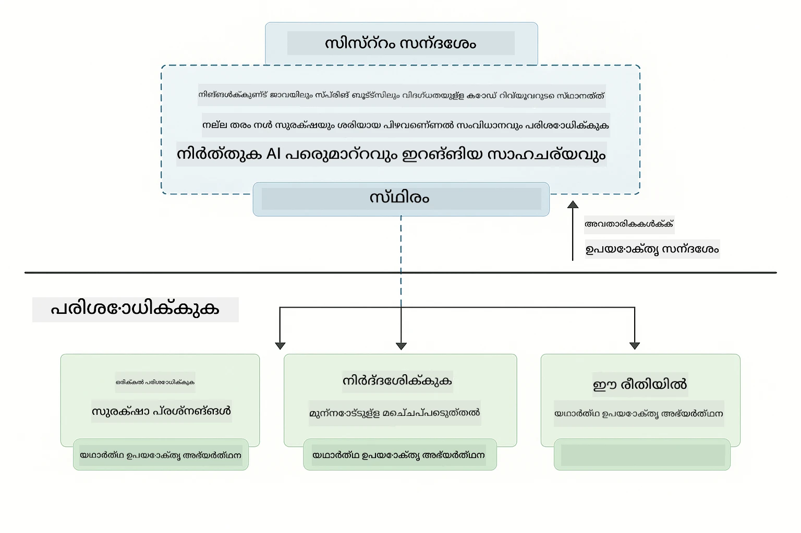

*SystemMessage സ്ഥിരമായ പശ്ചാത്തലം നൽകുന്നു, UserMessages വ്യക്തിഗത അഭ്യർത്ഥനകൾ ഉൾക്കൊള്ളുന്നു*

**MessageWindowChatMemory മൾട്ടി-ടേൺക്കായി** - മൾട്ടി-ടേൺ സംഭാഷണ പാറ്റേണിനായി, Module 01-ൽ നിന്നുള്ള `MessageWindowChatMemory` വീണ്ടും ഉപയോഗിക്കുന്നു. ഓരോ സെഷനും സ്വന്തം മെമ്മറി ഇൻസ്റ്റൻസ് `Map<String, ChatMemory>`-ൽ സൂക്ഷിക്കുന്നു, ഇതിലൂടെ ഒരേ സമയം പല സംഭാഷണങ്ങളും പശ്ചാത്തലം കലർന്നുപോകാതെ നടത്താം.

**പ്രോംപ്റ്റ് ടെംപ്ലേറ്റുകൾ** - ഇവിടെ യഥാർത്ഥ ശ്രദ്ധ പ്രോംപ്റ്റ് എഞ്ചിനീയറിംഗിലാണ്, പുതിയ LangChain4j API-കൾ അല്ല. ഓരോ പാറ്റേണും (കുറഞ്ഞ ഉത്സാഹം, ഉയർന്ന ഉത്സാഹം, ടാസ്‌ക് എക്സിക്യൂഷൻ തുടങ്ങിയവ) ഒരേ `chatModel.chat(prompt)` രീതിയാണ് ഉപയോഗിക്കുന്നത്, എന്നാൽ സൂക്ഷ്മമായി ഘടിപ്പിച്ച പ്രോംപ്റ്റ് സ്ട്രിംഗുകളാണ്. XML ടാഗുകൾ, നിർദ്ദേശങ്ങൾ, ഫോർമാറ്റിംഗ് എന്നിവ പ്രോംപ്റ്റ് ടെക്സ്റ്റിന്റെ ഭാഗമാണ്, LangChain4j ഫീച്ചറുകൾ അല്ല.

**വിവേക നിയന്ത്രണം** - GPT-5-ന്റെ വിവേക ശ്രമം "പരമാവധി 2 വിവേക ഘട്ടങ്ങൾ" അല്ലെങ്കിൽ "സമഗ്രമായി പരിശോധിക്കുക" പോലുള്ള പ്രോംപ്റ്റ് നിർദ്ദേശങ്ങളിലൂടെ നിയന്ത്രിക്കുന്നു. ഇവ പ്രോംപ്റ്റ് എഞ്ചിനീയറിംഗ് സാങ്കേതിക വിദ്യകളാണ്, LangChain4j കോൺഫിഗറേഷനുകൾ അല്ല. ലൈബ്രറി നിങ്ങളുടെ പ്രോംപ്റ്റുകൾ മോഡലിലേക്ക് എത്തിക്കുന്നു.

പ്രധാന സന്ദേശം: LangChain4j അടിസ്ഥാന സൗകര്യം (മോഡൽ കണക്ഷൻ [LangChainConfig.java](../../../02-prompt-engineering/src/main/java/com/example/langchain4j/prompts/config/LangChainConfig.java), മെമ്മറി, സന്ദേശ കൈകാര്യം [Gpt5PromptService.java](../../../02-prompt-engineering/src/main/java/com/example/langchain4j/prompts/service/Gpt5PromptService.java)) നൽകുന്നു, ഈ മോഡ്യൂൾ ആ അടിസ്ഥാനത്തിൽ ഫലപ്രദമായ പ്രോംപ്റ്റുകൾ എങ്ങനെ രൂപകൽപ്പന ചെയ്യാമെന്ന് പഠിപ്പിക്കുന്നു.

## പ്രധാന പാറ്റേണുകൾ

എല്ലാ പ്രശ്നങ്ങൾക്കും ഒരേ സമീപനം വേണ്ടതല്ല. ചില ചോദ്യങ്ങൾക്ക് വേഗത്തിലുള്ള മറുപടികൾ വേണം, ചിലത് ആഴത്തിലുള്ള ചിന്ത ആവശ്യമാണ്. ചിലത് ദൃശ്യമായ വിവേകം ആവശ്യമാണ്, ചിലത് ഫലങ്ങൾ മാത്രം. ഈ മോഡ്യൂൾ എട്ട് പ്രോംപ്റ്റിംഗ് പാറ്റേണുകൾ ഉൾക്കൊള്ളുന്നു - ഓരോന്നും വ്യത്യസ്ത സാഹചര്യങ്ങൾക്ക് അനുയോജ്യമാണ്. നിങ്ങൾ അവയെല്ലാം പരീക്ഷിച്ച് ഓരോ സമീപനം എപ്പോൾ മികച്ചതാണെന്ന് പഠിക്കും.

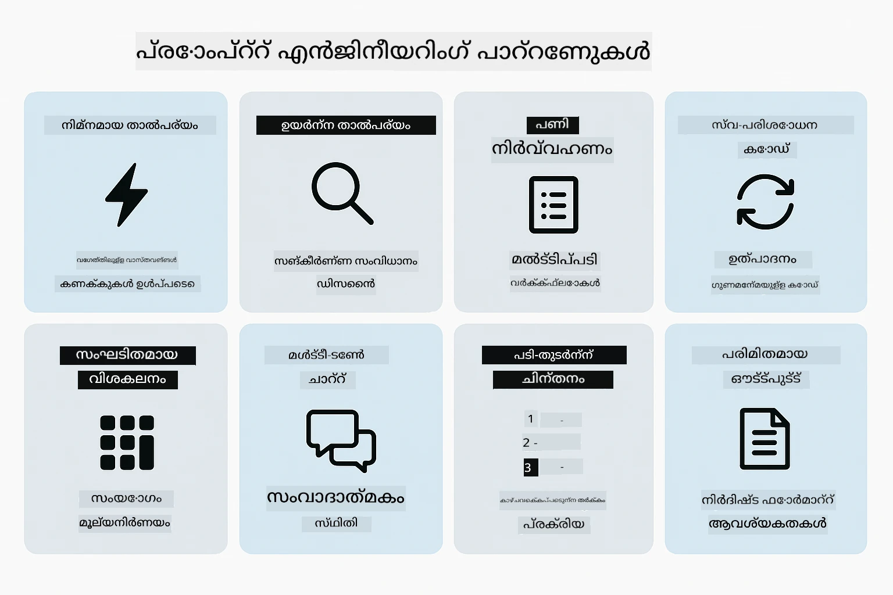

*എട്ട് പ്രോംപ്റ്റ് എഞ്ചിനീയറിംഗ് പാറ്റേണുകളുടെ അവലോകനം, അവയുടെ ഉപയോഗ കേസുകൾ*

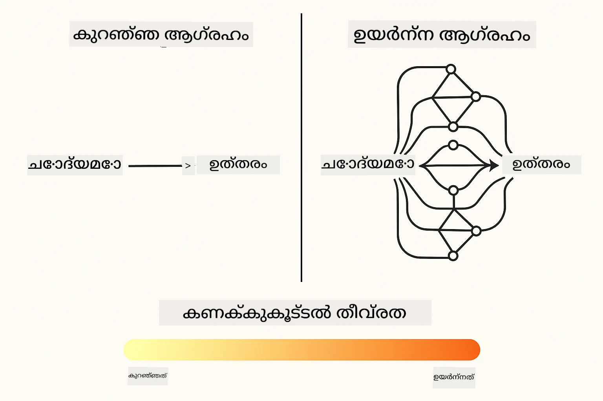

*കുറഞ്ഞ ഉത്സാഹം (വേഗം, നേരിട്ട്) vs ഉയർന്ന ഉത്സാഹം (സമഗ്രം, അന്വേഷണപരമായ) വിവേക സമീപനങ്ങൾ*

**കുറഞ്ഞ ഉത്സാഹം (വേഗവും കേന്ദ്രീകൃതവുമുള്ളത്)** - ലളിതമായ ചോദ്യങ്ങൾക്ക് വേഗം, നേരിട്ട് മറുപടി വേണമെങ്കിൽ. മോഡൽ കുറഞ്ഞ വിവേകം നടത്തുന്നു - പരമാവധി 2 ഘട്ടങ്ങൾ. കണക്കുകൂട്ടലുകൾ, തിരയലുകൾ, നേരിട്ടുള്ള ചോദ്യങ്ങൾക്കായി ഇത് ഉപയോഗിക്കുക.

```java
String prompt = """
    <reasoning_effort>low</reasoning_effort>
    <instruction>maximum 2 reasoning steps</instruction>
    
    What is 15% of 200?
    """;

String response = chatModel.chat(prompt);
```

> 💡 **GitHub Copilot ഉപയോഗിച്ച് പരീക്ഷിക്കുക:** [`Gpt5PromptService.java`](../../../02-prompt-engineering/src/main/java/com/example/langchain4j/prompts/service/Gpt5PromptService.java) തുറന്ന് ചോദിക്കുക:
> - "കുറഞ്ഞ ഉത്സാഹവും ഉയർന്ന ഉത്സാഹവും പ്രോംപ്റ്റിംഗ് പാറ്റേണുകൾ തമ്മിലുള്ള വ്യത്യാസം എന്താണ്?"
> - "പ്രോംപ്റ്റുകളിൽ XML ടാഗുകൾ എങ്ങനെ AI-യുടെ മറുപടി ഘടിപ്പിക്കാൻ സഹായിക്കുന്നു?"
> - "സ്വയം-പരിശോധന പാറ്റേണുകൾ എപ്പോൾ നേരിട്ടുള്ള നിർദ്ദേശങ്ങളേക്കാൾ ഉപയോഗിക്കണം?"

**ഉയർന്ന ഉത്സാഹം (ആഴത്തിലുള്ള, സമഗ്രമായ)** - സങ്കീർണ്ണ പ്രശ്നങ്ങൾക്ക് സമഗ്ര വിശകലനം വേണമെങ്കിൽ. മോഡൽ സമഗ്രമായി പരിശോധിച്ച് വിശദമായ വിവേകം കാണിക്കുന്നു. സിസ്റ്റം ഡിസൈൻ, ആർക്കിടെക്ചർ തീരുമാനങ്ങൾ, സങ്കീർണ്ണ ഗവേഷണങ്ങൾക്കായി ഇത് ഉപയോഗിക്കുക.

```java
String prompt = """
    <reasoning_effort>high</reasoning_effort>
    <instruction>explore thoroughly, show detailed reasoning</instruction>
    
    Design a caching strategy for a high-traffic REST API.
    """;

String response = chatModel.chat(prompt);
```

**ടാസ്‌ക് എക്സിക്യൂഷൻ (പടി-പടി പുരോഗതി)** - ബഹു-ഘട്ട പ്രവൃത്തികൾക്കായി. മോഡൽ മുൻകൂട്ടി പദ്ധതി നൽകുന്നു, ഓരോ ഘട്ടവും വിശദീകരിക്കുന്നു, ശേഷം സംഗ്രഹം നൽകുന്നു. മൈഗ്രേഷനുകൾ, നടപ്പാക്കലുകൾ, ബഹു-ഘട്ട പ്രക്രിയകൾക്കായി ഇത് ഉപയോഗിക്കുക.

```java
String prompt = """
    <task>Create a REST endpoint for user registration</task>
    <preamble>Provide an upfront plan</preamble>
    <narration>Narrate each step as you work</narration>
    <summary>Summarize what was accomplished</summary>
    """;

String response = chatModel.chat(prompt);
```

ചെയിൻ-ഓഫ്-തോട്ട് പ്രോംപ്റ്റിംഗ് മോഡലിന് അതിന്റെ വിവേക പ്രക്രിയ കാണിക്കാൻ ആവശ്യപ്പെടുന്നു, സങ്കീർണ്ണ ടാസ്കുകൾക്കുള്ള കൃത്യത മെച്ചപ്പെടുത്തുന്നു. പടി-പടി വിഭജനം മനുഷ്യർക്കും AI-ക്കും ലജിക് മനസ്സിലാക്കാൻ സഹായിക്കുന്നു.

> **🤖 [GitHub Copilot](https://github.com/features/copilot) ചാറ്റിൽ പരീക്ഷിക്കുക:** ഈ പാറ്റേണിനെക്കുറിച്ച് ചോദിക്കുക:
> - "ദീർഘകാല പ്രവർത്തനങ്ങൾക്ക് ടാസ്‌ക് എക്സിക്യൂഷൻ പാറ്റേൺ എങ്ങനെ അനുയോജ്യമായി മാറ്റാം?"
> - "പ്രൊഡക്ഷൻ അപ്ലിക്കേഷനുകളിൽ ടൂൾ പ്രീഅംബിൾസ് ഘടിപ്പിക്കുന്ന മികച്ച രീതികൾ എന്തെല്ലാം?"
> - "UI-യിൽ ഇടക്കാല പുരോഗതി അപ്ഡേറ്റുകൾ എങ്ങനെ പിടിച്ച് പ്രദർശിപ്പിക്കാം?"


*പദ്ധതി → നടപ്പാക്കൽ → സംഗ്രഹം workflow ബഹു-ഘട്ട ടാസ്കുകൾക്കായി*

**സ്വയം-പരിശോധന കോഡ്** - പ്രൊഡക്ഷൻ നിലവാരമുള്ള കോഡ് സൃഷ്ടിക്കാൻ. മോഡൽ കോഡ് സൃഷ്ടിക്കുന്നു, ഗുണനിലവാര മാനദണ്ഡങ്ങൾക്കു വിരുദ്ധമോ എന്ന് പരിശോധിക്കുന്നു, തുടർച്ചയായി മെച്ചപ്പെടുത്തുന്നു. പുതിയ ഫീച്ചറുകൾ അല്ലെങ്കിൽ സർവീസുകൾ നിർമ്മിക്കുമ്പോൾ ഇത് ഉപയോഗിക്കുക.

```java
String prompt = """
    <task>Create an email validation service</task>
    <quality_criteria>
    - Correct logic and error handling
    - Best practices (clean code, proper naming)
    - Performance optimization
    - Security considerations
    </quality_criteria>
    <instruction>Generate code, evaluate against criteria, improve iteratively</instruction>
    """;

String response = chatModel.chat(prompt);
```

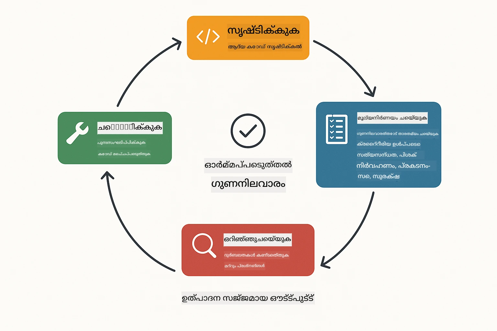

*പര്യവേക്ഷണ ചക്രം - സൃഷ്ടിക്കുക, വിലയിരുത്തുക, പ്രശ്നങ്ങൾ തിരിച്ചറിയുക, മെച്ചപ്പെടുത്തുക, ആവർത്തിക്കുക*

**സംഘടിത വിശകലനം** - സ്ഥിരതയുള്ള വിലയിരുത്തലിനായി. മോഡൽ ഒരു നിശ്ചിത ഫ്രെയിംവർക്ക് (ശുദ്ധത, പ്രാക്ടീസുകൾ, പ്രകടനം, സുരക്ഷ) ഉപയോഗിച്ച് കോഡ് പരിശോധിക്കുന്നു. കോഡ് റിവ്യൂകൾക്കോ ഗുണനിലവാര വിലയിരുത്തലിനോ ഇത് ഉപയോഗിക്കുക.

```java
String prompt = """
    <code>
    public List getUsers() {
        return database.query("SELECT * FROM users");
    }
    </code>
    
    <framework>
    Evaluate using these categories:
    1. Correctness - Logic and functionality
    2. Best Practices - Code quality
    3. Performance - Efficiency concerns
    4. Security - Vulnerabilities
    </framework>
    """;

String response = chatModel.chat(prompt);
```

> **🤖 [GitHub Copilot](https://github.com/features/copilot) ചാറ്റിൽ പരീക്ഷിക്കുക:** സംഘടിത വിശകലനം സംബന്ധിച്ച് ചോദിക്കുക:
> - "വിവിധ തരം കോഡ് റിവ്യൂകൾക്കായി വിശകലന ഫ്രെയിംവർക്ക് എങ്ങനെ ഇഷ്ടാനുസൃതമാക്കാം?"
> - "സംഘടിത ഔട്ട്പുട്ട് പ്രോഗ്രാമാറ്റിക്കായി പാഴ്‌സ് ചെയ്ത് പ്രവർത്തിപ്പിക്കുന്ന മികച്ച മാർഗങ്ങൾ എന്തെല്ലാം?"
> - "വിവിധ റിവ്യൂ സെഷനുകളിൽ സ്ഥിരതയുള്ള ഗുരുതരത്വ നിലകൾ എങ്ങനെ ഉറപ്പാക്കാം?"

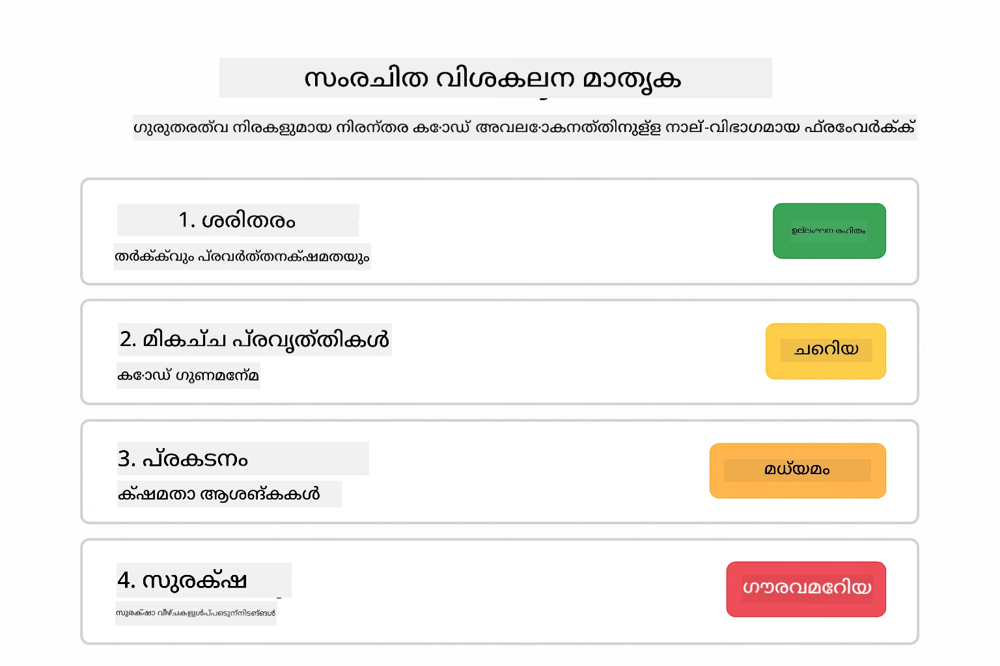

*ഗുരുതരത്വ നിലകളോടെ സ്ഥിരതയുള്ള കോഡ് റിവ്യൂകൾക്കുള്ള നാല്-വിഭാഗ ഫ്രെയിംവർക്ക്*

**മൾട്ടി-ടേൺ ചാറ്റ്** - പശ്ചാത്തലം ആവശ്യമായ സംഭാഷണങ്ങൾക്ക്. മോഡൽ മുൻ സന്ദേശങ്ങൾ ഓർക്കുന്നു, അവയുടെ അടിസ്ഥാനത്തിൽ മുന്നോട്ട് പോകുന്നു. ഇന്ററാക്ടീവ് സഹായ സെഷനുകൾക്കോ സങ്കീർണ്ണ Q&A-ക്കോ ഇത് ഉപയോഗിക്കുക.

```java
ChatMemory memory = MessageWindowChatMemory.withMaxMessages(10);

memory.add(UserMessage.from("What is Spring Boot?"));
AiMessage aiMessage1 = chatModel.chat(memory.messages()).aiMessage();
memory.add(aiMessage1);

memory.add(UserMessage.from("Show me an example"));
AiMessage aiMessage2 = chatModel.chat(memory.messages()).aiMessage();
memory.add(aiMessage2);
```

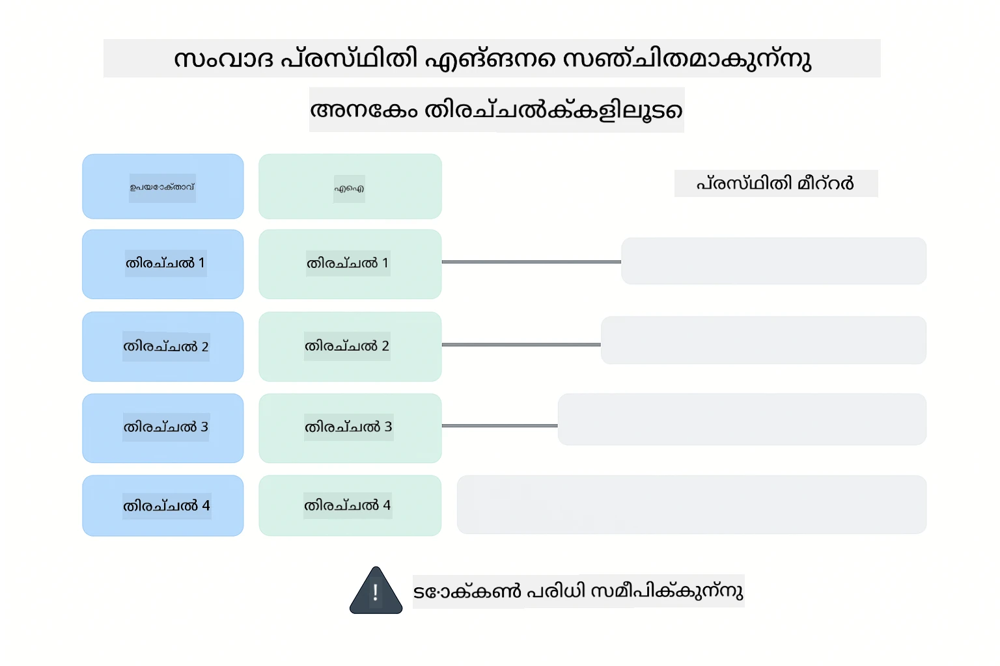

*സംഭാഷണ പശ്ചാത്തലം പല തവണകളിലായി കൂട്ടിച്ചേർക്കുന്നു, ടോക്കൺ പരിധി എത്തുന്നതുവരെ*

**പടി-പടി വിവരണം** - ദൃശ്യമായ ലജിക് ആവശ്യമായ പ്രശ്നങ്ങൾക്ക്. മോഡൽ ഓരോ ഘട്ടത്തിനും വ്യക്തമായ വിവേകം കാണിക്കുന്നു. ഗണിത പ്രശ്നങ്ങൾ, ലജിക് പസിലുകൾ, ചിന്തന പ്രക്രിയ മനസ്സിലാക്കേണ്ടപ്പോൾ ഇത് ഉപയോഗിക്കുക.

```java
String prompt = """
    <instruction>Show your reasoning step-by-step</instruction>
    
    If a train travels 120 km in 2 hours, then stops for 30 minutes,
    then travels another 90 km in 1.5 hours, what is the average speed
    for the entire journey including the stop?
    """;

String response = chatModel.chat(prompt);
```

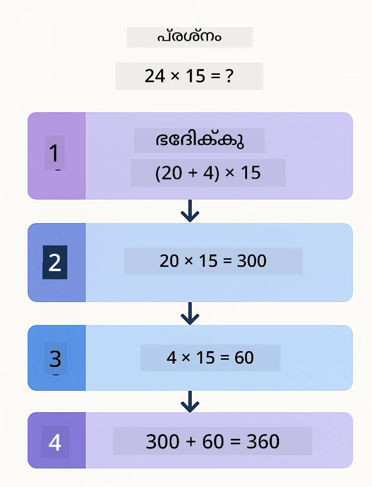

*പ്രശ്നങ്ങളെ വ്യക്തമായ ലജിക് ഘട്ടങ്ങളായി വിഭജിക്കൽ*

**നിയന്ത്രിത ഔട്ട്പുട്ട്** - പ്രത്യേക ഫോർമാറ്റ് ആവശ്യമായ മറുപടികൾക്കായി. മോഡൽ കർശനമായി ഫോർമാറ്റ്, നീളം എന്നിവ പാലിക്കുന്നു. സംഗ്രഹങ്ങൾക്കോ കൃത്യമായ ഔട്ട്പുട്ട് ഘടന ആവശ്യമായപ്പോൾ ഇത് ഉപയോഗിക്കുക.

```java
String prompt = """
    <constraints>
    - Exactly 100 words
    - Bullet point format
    - Technical terms only
    </constraints>
    
    Summarize the key concepts of machine learning.
    """;

String response = chatModel.chat(prompt);
```

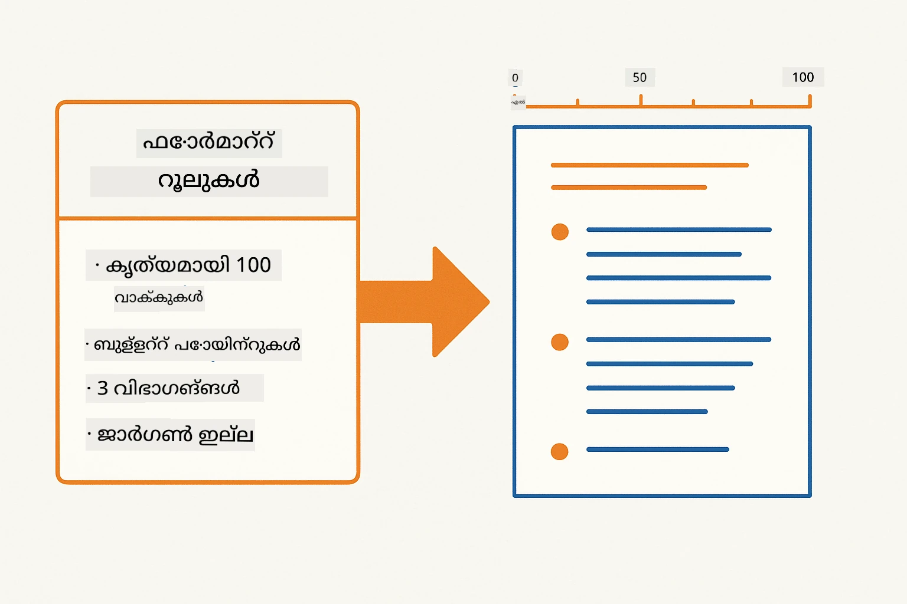

*നിശ്ചിത ഫോർമാറ്റ്, നീളം, ഘടന ആവശ്യകതകൾ പാലിക്കൽ*

## ഇതിനകം ഉള്ള Azure വിഭവങ്ങൾ ഉപയോഗിക്കൽ

**വിന്യാസം പരിശോധിക്കുക:**

റൂട്ട് ഡയറക്ടറിയിൽ `.env` ഫയൽ Azure ക്രെഡൻഷ്യലുകളുമായി ഉണ്ടെന്ന് ഉറപ്പാക്കുക (Module 01-ൽ സൃഷ്ടിച്ചത്):
```bash
cat ../.env  # AZURE_OPENAI_ENDPOINT, API_KEY, DEPLOYMENT കാണിക്കണം
```

**അപ്ലിക്കേഷൻ ആരംഭിക്കുക:**

> **കുറിപ്പ്:** Module 01-ൽ നിന്നുള്ള `./start-all.sh` ഉപയോഗിച്ച് നിങ്ങൾ ഇതിനകം എല്ലാ അപ്ലിക്കേഷനുകളും ആരംഭിച്ചിട്ടുണ്ടെങ്കിൽ, ഈ മോഡ്യൂൾ 8083 പോർട്ടിൽ പ്രവർത്തിക്കുകയാണ്. താഴെ കൊടുത്ത സ്റ്റാർട്ട് കമാൻഡുകൾ ഒഴിവാക്കി നേരിട്ട് http://localhost:8083 സന്ദർശിക്കാം.

**ഓപ്ഷൻ 1: Spring Boot ഡാഷ്ബോർഡ് ഉപയോഗിക്കൽ (VS Code ഉപയോക്താക്കൾക്ക് ശുപാർശ)**

ഡെവ് കണ്ടെയ്‌നറിൽ Spring Boot ഡാഷ്ബോർഡ് എക്സ്റ്റൻഷൻ ഉൾപ്പെടുത്തിയിട്ടുണ്ട്, ഇത് എല്ലാ Spring Boot അപ്ലിക്കേഷനുകളും ദൃശ്യമായി നിയന്ത്രിക്കാൻ സഹായിക്കുന്നു. VS Code-യുടെ ഇടത് Activity Bar-ൽ Spring Boot ഐക്കൺ കാണുക.

Spring Boot ഡാഷ്ബോർഡിൽ നിന്ന് നിങ്ങൾക്ക്:
- വർക്ക്‌സ്പേസിലെ എല്ലാ Spring Boot അപ്ലിക്കേഷനുകളും കാണാം
- ഒറ്റ ക്ലിക്കിൽ അപ്ലിക്കേഷനുകൾ ആരംഭിക്കാനും നിർത്താനും കഴിയും
- അപ്ലിക്കേഷൻ ലോഗുകൾ റിയൽ-ടൈമിൽ കാണാം
- അപ്ലിക്കേഷൻ നില നിരീക്ഷിക്കാം

"prompt-engineering" പക്കൽ പ്ലേ ബട്ടൺ ക്ലിക്കുചെയ്ത് ഈ മോഡ്യൂൾ ആരംഭിക്കാം, അല്ലെങ്കിൽ എല്ലാ മോഡ്യൂളുകളും ഒരുമിച്ച് ആരംഭിക്കാം.

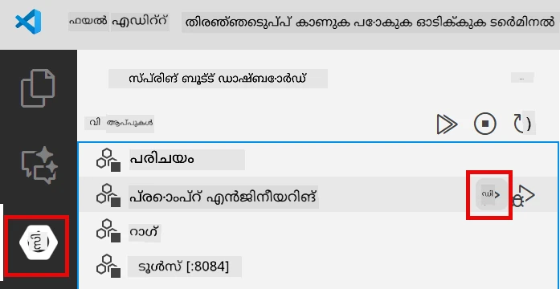

**ഓപ്ഷൻ 2: ഷെൽ സ്ക്രിപ്റ്റുകൾ ഉപയോഗിക്കൽ**

എല്ലാ വെബ് അപ്ലിക്കേഷനുകളും (മോഡ്യൂളുകൾ 01-04) ആരംഭിക്കുക:

**Bash:**
```bash
cd ..  # റൂട്ട് ഡയറക്ടറിയിൽ നിന്ന്
./start-all.sh
```

**PowerShell:**
```powershell
cd ..  # റൂട്ട് ഡയറക്ടറിയിൽ നിന്ന്
.\start-all.ps1
```

അല്ലെങ്കിൽ ഈ മോഡ്യൂളും മാത്രം ആരംഭിക്കുക:

**Bash:**
```bash
cd 02-prompt-engineering
./start.sh
```

**PowerShell:**
```powershell
cd 02-prompt-engineering
.\start.ps1
```

രണ്ടു സ്ക്രിപ്റ്റുകളും റൂട്ട് `.env` ഫയലിൽ നിന്നുള്ള പരിസ്ഥിതി വ്യത്യാസങ്ങൾ സ്വയം ലോഡ് ചെയ്യുകയും, JAR ഫയലുകൾ ഇല്ലെങ്കിൽ നിർമ്മിക്കുകയും ചെയ്യും.

> **കുറിപ്പ്:** എല്ലാ മോഡ്യൂളുകളും കൈമാറി നിർമ്മിച്ച് ശേഷം ആരംഭിക്കാൻ ആഗ്രഹിക്കുന്നുവെങ്കിൽ:
>
> **Bash:**
> ```bash
> cd ..  # Go to root directory
> mvn clean package -DskipTests
> ```
>
> **PowerShell:**
> ```powershell
> cd ..  # Go to root directory
> mvn clean package -DskipTests
> ```

http://localhost:8083 നിങ്ങളുടെ ബ്രൗസറിൽ തുറക്കുക.

**നിർത്താൻ:**

**Bash:**
```bash
./stop.sh  # ഈ മോഡ്യൂൾ മാത്രം
# അല്ലെങ്കിൽ
cd .. && ./stop-all.sh  # എല്ലാ മോഡ്യൂളുകളും
```

**PowerShell:**
```powershell
.\stop.ps1  # ഈ മോഡ്യൂൾ മാത്രം
# അല്ലെങ്കിൽ
cd ..; .\stop-all.ps1  # എല്ലാ മോഡ്യൂളുകളും
```

## അപ്ലിക്കേഷൻ സ്ക്രീൻഷോട്ടുകൾ

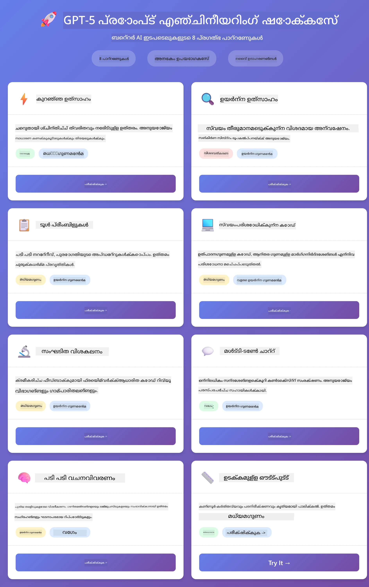

*എട്ട് പ്രോംപ്റ്റ് എഞ്ചിനീയറിംഗ് പാറ്റേണുകളും അവയുടെ സവിശേഷതകളും ഉപയോഗ കേസുകളും കാണിക്കുന്ന പ്രധാന ഡാഷ്ബോർഡ്*

## പാറ്റേണുകൾ പരിശോധിക്കൽ

വെബ് ഇന്റർഫേസ് വ്യത്യസ്ത പ്രോംപ്റ്റിംഗ് തന്ത്രങ്ങൾ പരീക്ഷിക്കാൻ അനുവദിക്കുന്നു. ഓരോ പാറ്റേണും വ്യത്യസ്ത പ്രശ്നങ്ങൾ പരിഹരിക്കുന്നു - ഏത് സമീപനം എപ്പോൾ മികച്ചതാണെന്ന് കാണാൻ അവ പരീക്ഷിക്കുക.

### കുറഞ്ഞ ഉത്സാഹവും ഉയർന്ന ഉത്സാഹവും

"200-ന്റെ 15% എന്താണ്?" എന്ന ലളിതമായ ചോദ്യമെടുത്ത് കുറഞ്ഞ ഉത്സാഹം ഉപയോഗിച്ച് ചോദിക്കുക. നിങ്ങൾക്ക് ഉടൻ, നേരിട്ടുള്ള മറുപടി ലഭിക്കും. ഇപ്പോൾ "ഉയർന്ന ട്രാഫിക് API-ക്കായി കാഷിംഗ് തന്ത്രം രൂപകൽപ്പന ചെയ്യുക" എന്ന സങ്കീർണ്ണ ചോദ്യമെടുത്ത് ഉയർന്ന ഉത്സാഹം ഉപയോഗിച്ച് ചോദിക്കുക. മോഡൽ എങ്ങനെ മന്ദഗതിയോടെ വിശദമായ വിവേകം നൽകുന്നു എന്ന് ശ്രദ്ധിക്കുക. ഒരേ മോഡൽ, ഒരേ ചോദ്യ ഘടന - പക്ഷേ പ്രോംപ്റ്റ് എത്ര ചിന്തിക്കണമെന്ന് പറയുന്നു.

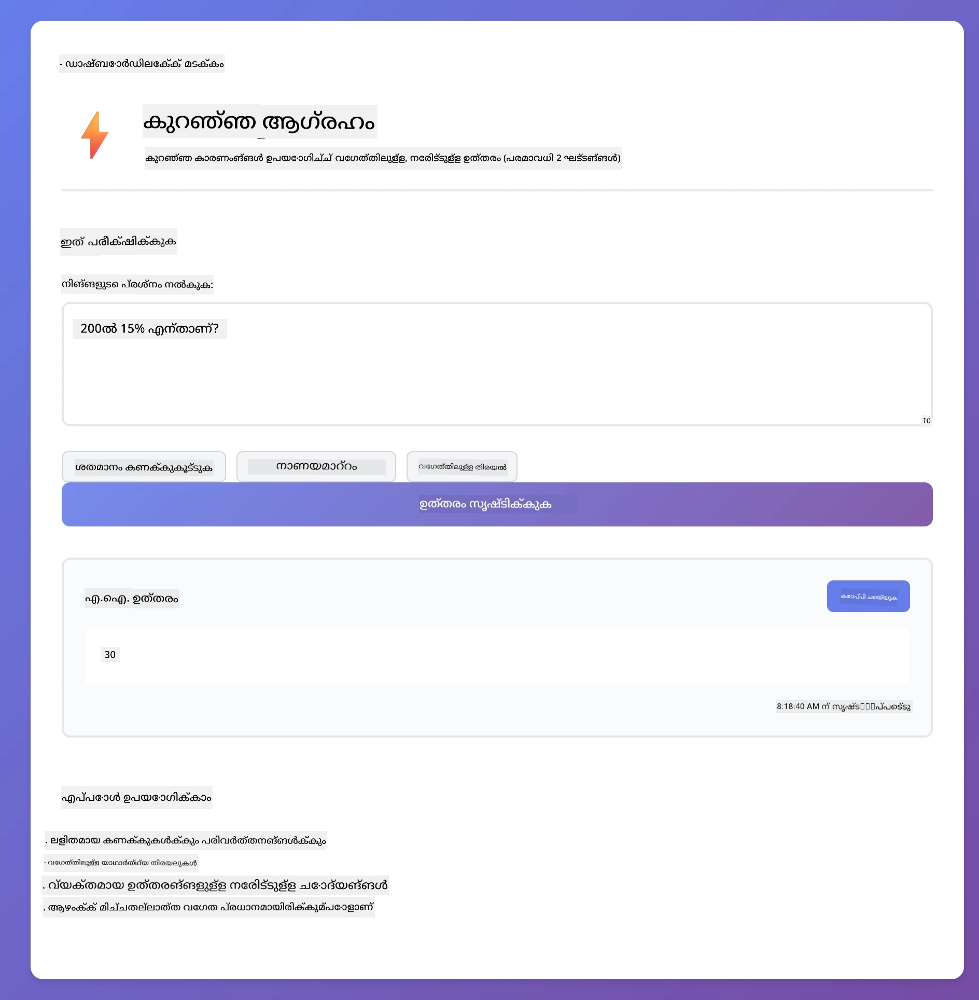
*കുറഞ്ഞ കാരണവുമുള്ള വേഗത്തിലുള്ള കണക്കുകൂട്ടൽ*

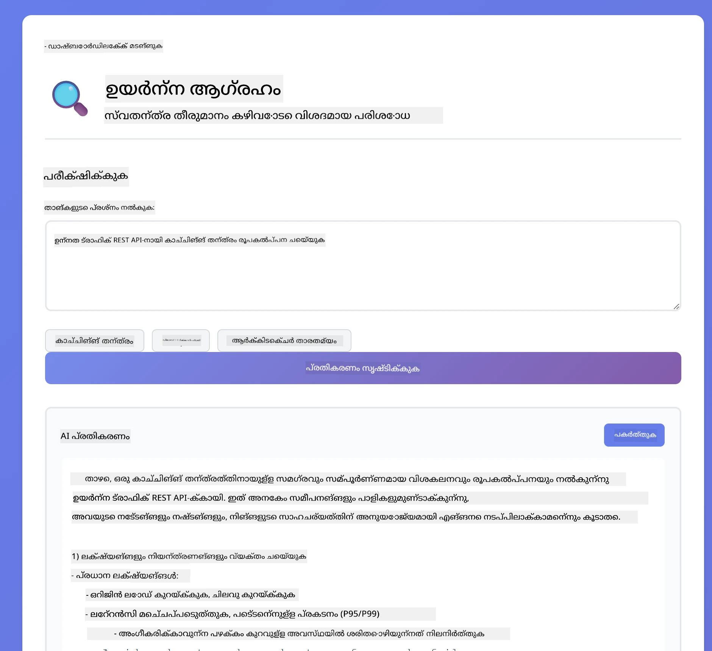

*സമഗ്ര കാഷിംഗ് തന്ത്രം (2.8MB)*

### ടാസ്‌ക് എക്സിക്യൂഷൻ (ടൂൾ പ്രീഅംബിൾസ്)

മൾട്ടി-സ്റ്റെപ്പ് വർക്ക്‌ഫ്ലോകൾക്ക് മുൻകൂർ പദ്ധതിയിടലും പുരോഗതി വിവരണവും സഹായകമാണ്. മോഡൽ എന്ത് ചെയ്യുമെന്ന് വിശദീകരിക്കുകയും, ഓരോ ഘട്ടവും വിവരണം നൽകുകയും, പിന്നീട് ഫലങ്ങൾ സംഗ്രഹിക്കുകയും ചെയ്യുന്നു.

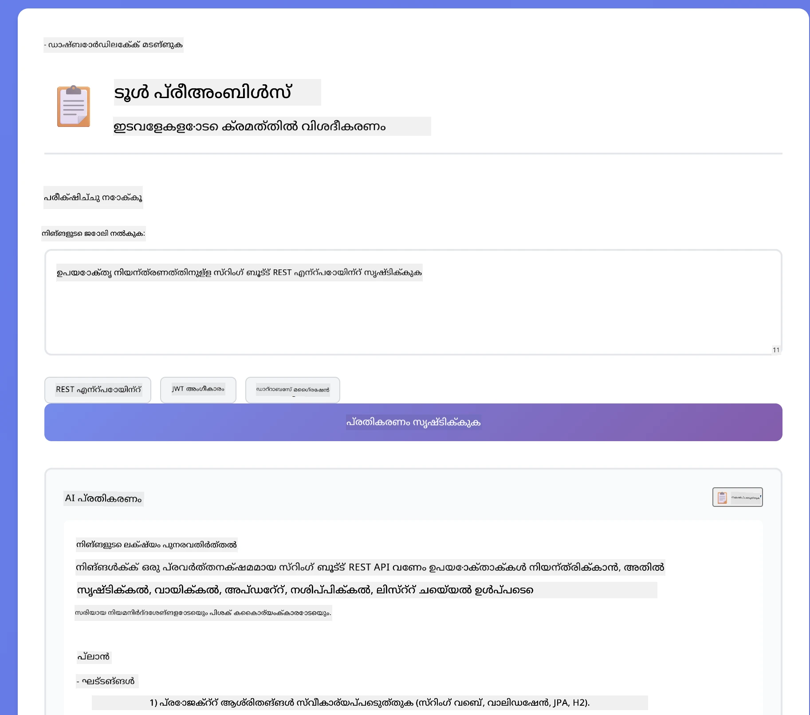

*ഘട്ടം-ഘട്ടമായി വിവരണം നൽകുന്ന REST എന്റ്പോയിന്റ് സൃഷ്ടിക്കൽ (3.9MB)*

### സ്വയം-പരിശോധന ചെയ്യുന്ന കോഡ്

"ഒരു ഇമെയിൽ സാധുത പരിശോധന സേവനം സൃഷ്ടിക്കുക" എന്ന് ശ്രമിക്കുക. കോഡ് സൃഷ്ടിച്ച് നിർത്താതെ, മോഡൽ അത് സൃഷ്ടിക്കുകയും, ഗുണനിലവാര മാനദണ്ഡങ്ങളോട് താരതമ്യം ചെയ്ത് വിലയിരുത്തുകയും, ദുർബലതകൾ കണ്ടെത്തുകയും, മെച്ചപ്പെടുത്തുകയും ചെയ്യുന്നു. കോഡ് ഉത്പാദന നിലവാരങ്ങൾ പാലിക്കുന്നതുവരെ ഇത് ആവർത്തിക്കുന്നു.

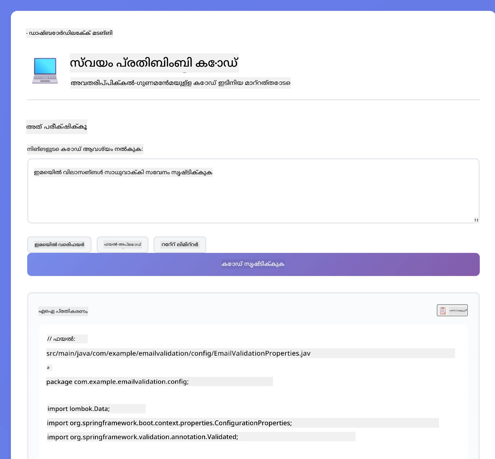

*സമ്പൂർണ്ണ ഇമെയിൽ സാധുത പരിശോധന സേവനം (5.2MB)*

### ഘടനാപരമായ വിശകലനം

കോഡ് റിവ്യൂകൾക്ക് സ്ഥിരമായ വിലയിരുത്തൽ ഫ്രെയിംവർക്കുകൾ ആവശ്യമാണ്. മോഡൽ കോഡ് വിശകലനം ചെയ്യുന്നു സ്ഥിരമായ വിഭാഗങ്ങൾ (ശുദ്ധത, പ്രാക്ടീസുകൾ, പ്രകടനം, സുരക്ഷ) ഉപയോഗിച്ച് ഗുരുത്വതലങ്ങൾ ഉൾപ്പെടുത്തി.

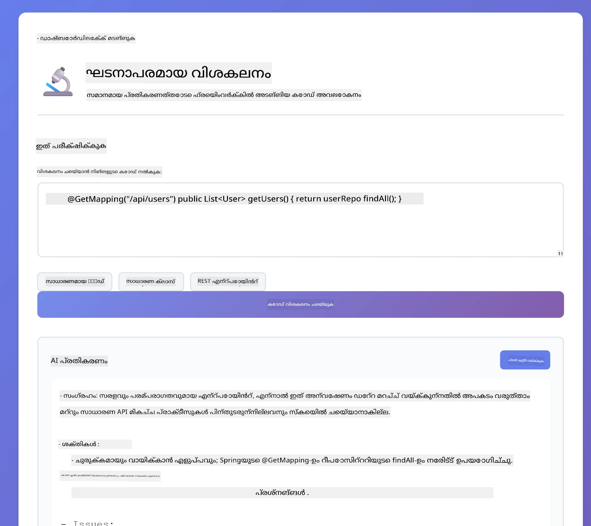

*ഫ്രെയിംവർക്കിൽ അടിസ്ഥാനമാക്കിയുള്ള കോഡ് റിവ്യൂ*

### മൾട്ടി-ടേൺ ചാറ്റ്

"Spring Boot എന്താണ്?" എന്ന് ചോദിച്ച് ഉടൻ "ഒരു ഉദാഹരണം കാണിക്കൂ" എന്ന് ചോദിക്കുക. മോഡൽ നിങ്ങളുടെ ആദ്യ ചോദ്യം ഓർക്കുകയും, പ്രത്യേകിച്ച് Spring Boot ഉദാഹരണം നൽകുകയും ചെയ്യുന്നു. ഓർമ്മ ഇല്ലാതെ, രണ്ടാം ചോദ്യം വളരെ അസ്പഷ്ടമായിരിക്കും.

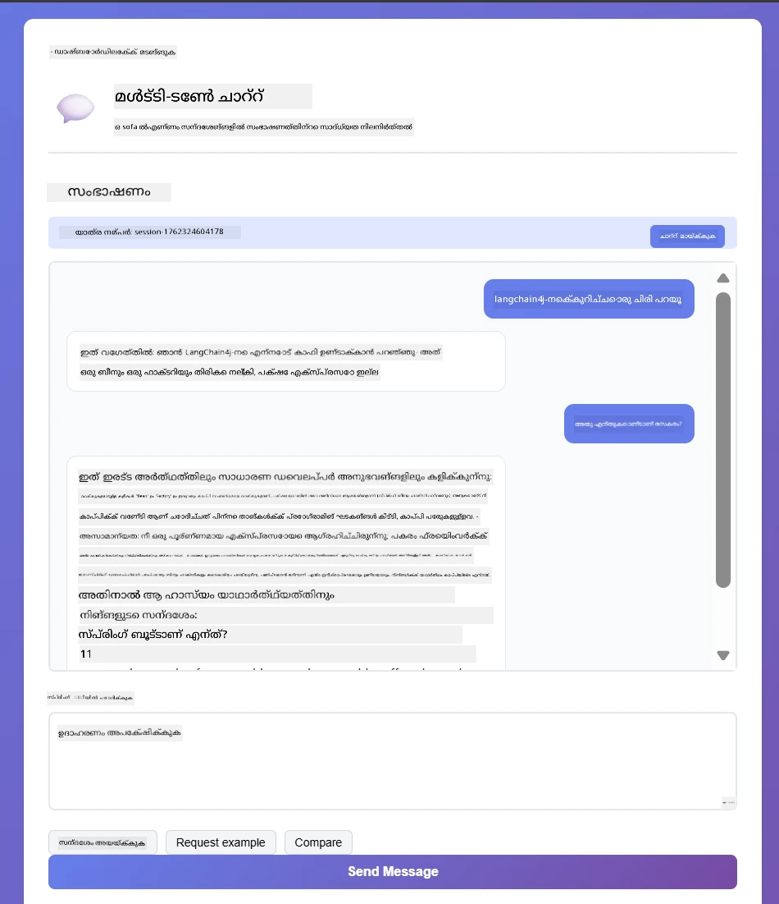

*ചോദ്യങ്ങൾക്കിടയിലെ സാന്ദർഭം സംരക്ഷണം*

### ഘട്ടം-ഘട്ടമായി കാരണവുമുള്ള വിശദീകരണം

ഒരു ഗണിത പ്രശ്നം തിരഞ്ഞെടുക്കുക, അത് Step-by-Step Reasoning ഉം Low Eagerness ഉം ഉപയോഗിച്ച് പരീക്ഷിക്കുക. Low eagerness നിങ്ങൾക്ക് ഫലം മാത്രം നൽകുന്നു - വേഗത്തിൽ എന്നാൽ അപ്രത്യക്ഷമായി. ഘട്ടം-ഘട്ടം നിങ്ങൾക്ക് ഓരോ കണക്കുകൂട്ടലും തീരുമാനവും കാണിക്കുന്നു.

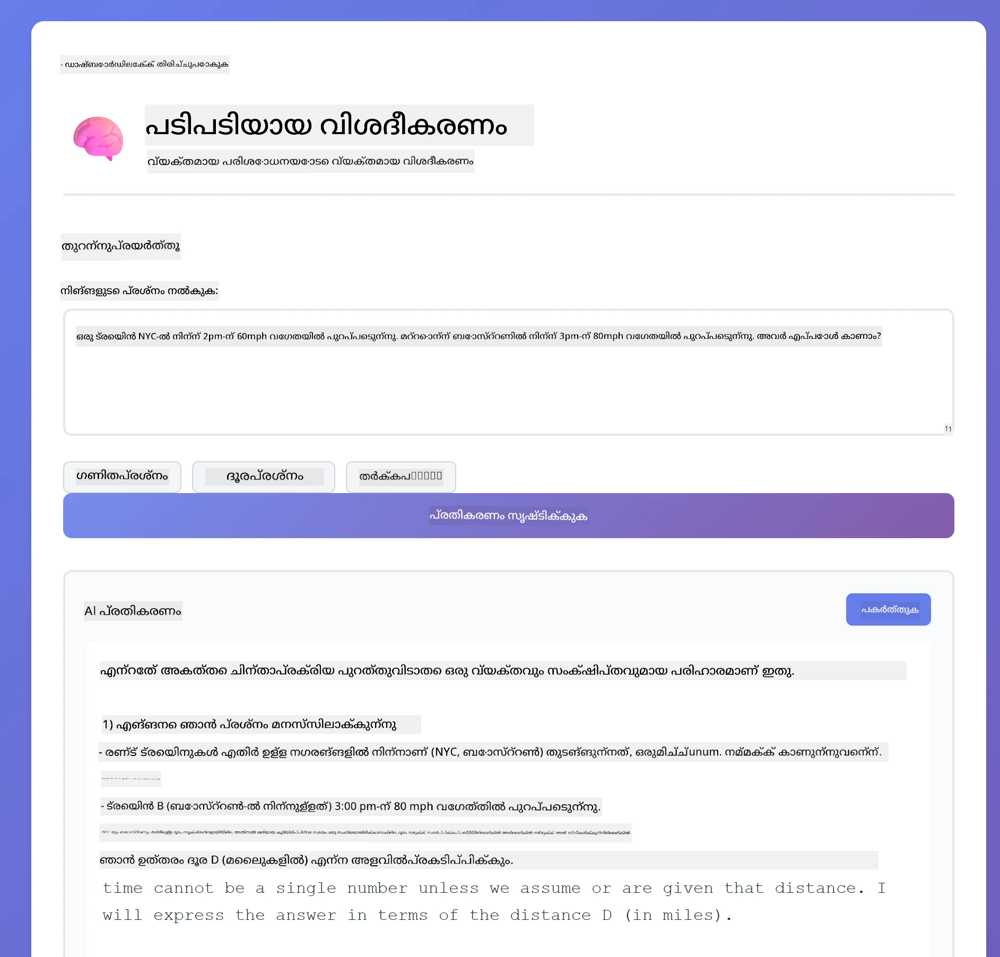

*വ്യക്തമായ ഘട്ടങ്ങളുള്ള ഗണിത പ്രശ്നം*

### നിയന്ത്രിത ഔട്ട്പുട്ട്

നിങ്ങൾക്ക് പ്രത്യേക ഫോർമാറ്റുകൾ അല്ലെങ്കിൽ വാക്കുകളുടെ എണ്ണം ആവശ്യമായപ്പോൾ, ഈ മാതൃക കർശനമായ പാലനത്തിന് സഹായിക്കുന്നു. കൃത്യമായി 100 വാക്കുകൾ ഉള്ള ബുള്ളറ്റ് പോയിന്റ് ഫോർമാറ്റിൽ ഒരു സംഗ്രഹം സൃഷ്ടിക്കാൻ ശ്രമിക്കുക.

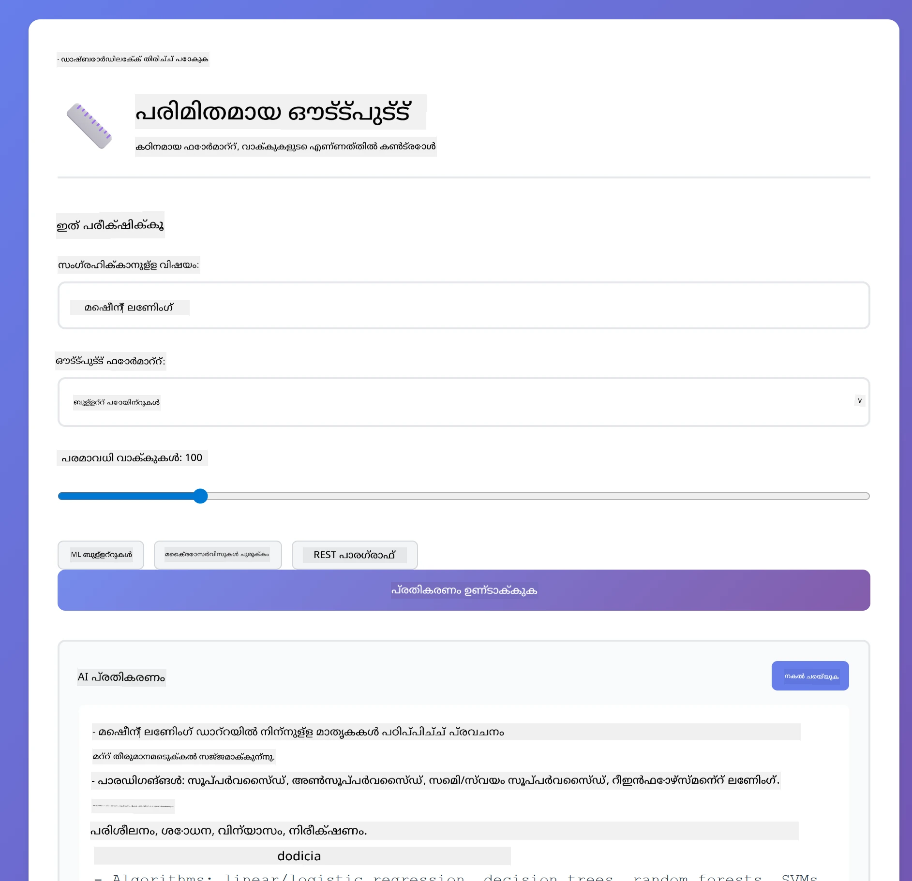

*ഫോർമാറ്റ് നിയന്ത്രണത്തോടെ മെഷീൻ ലേണിംഗ് സംഗ്രഹം*

## നിങ്ങൾ യഥാർത്ഥത്തിൽ പഠിക്കുന്നത്

**കാരണവുമുള്ള ശ്രമം എല്ലാം മാറ്റുന്നു**

GPT-5 നിങ്ങളുടെ പ്രോംപ്റ്റുകൾ വഴി കണക്കുകൂട്ടൽ ശ്രമം നിയന്ത്രിക്കാൻ അനുവദിക്കുന്നു. കുറഞ്ഞ ശ്രമം വേഗത്തിലുള്ള പ്രതികരണങ്ങൾ നൽകുന്നു കുറഞ്ഞ അന്വേഷണത്തോടെ. ഉയർന്ന ശ്രമം മോഡലിന് ആഴത്തിൽ ചിന്തിക്കാൻ സമയം നൽകുന്നു. നിങ്ങൾ പഠിക്കുന്നത് ശ്രമം ടാസ്‌കിന്റെ സങ്കീർണ്ണതയ്ക്ക് അനുയോജ്യമായി ക്രമീകരിക്കുകയാണ് - ലളിതമായ ചോദ്യങ്ങളിൽ സമയം കളയരുത്, എന്നാൽ സങ്കീർണ്ണ തീരുമാനങ്ങളിൽ വേഗം ചെയ്യരുത്.

**ഘടന പെരുമാറ്റം നയിക്കുന്നു**

പ്രോംപ്റ്റുകളിൽ XML ടാഗുകൾ ശ്രദ്ധിച്ചിട്ടുണ്ടോ? അവ അലങ്കാരമല്ല. മോഡലുകൾ ഘടനാപരമായ നിർദ്ദേശങ്ങൾ സ്വതന്ത്ര വാചകത്തേക്കാൾ വിശ്വസനീയമായി പിന്തുടരുന്നു. നിങ്ങൾക്ക് മൾട്ടി-സ്റ്റെപ്പ് പ്രക്രിയകൾ അല്ലെങ്കിൽ സങ്കീർണ്ണ ലജിക് ആവശ്യമുള്ളപ്പോൾ, ഘടന മോഡലിന് എവിടെ ആണ് എന്നതും അടുത്തത് എന്താണെന്നും ട്രാക്ക് ചെയ്യാൻ സഹായിക്കുന്നു.

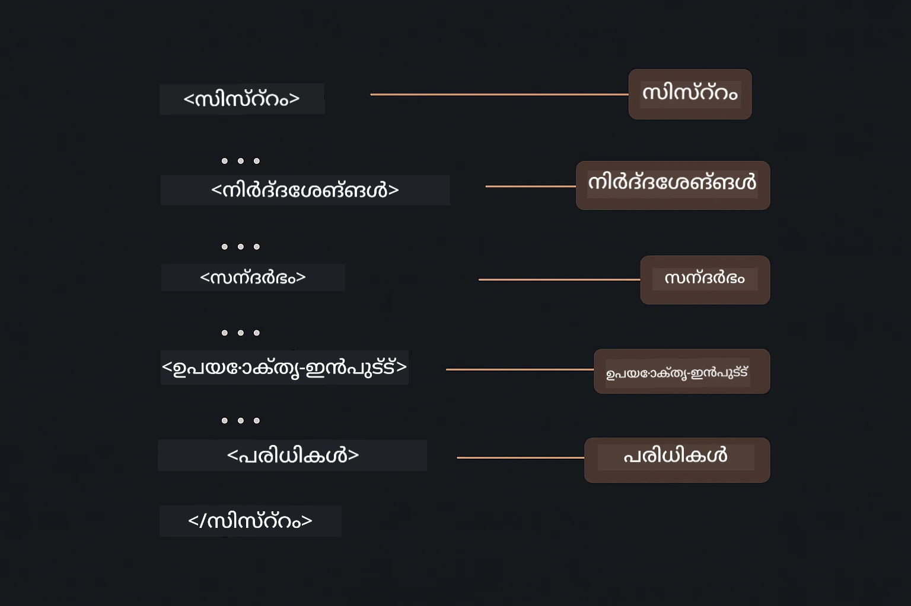

*വ്യക്തമായ വിഭാഗങ്ങളും XML-ശൈലിയിൽ ക്രമീകരണവും ഉള്ള നല്ല ഘടനയുള്ള പ്രോംപ്റ്റിന്റെ ഘടന*

**സ്വയം-വിലയിരുത്തലിലൂടെ ഗുണനിലവാരം**

സ്വയം-പരിശോധന മാതൃകകൾ ഗുണനിലവാര മാനദണ്ഡങ്ങൾ വ്യക്തമായി നിർവചിക്കുന്നതിലൂടെ പ്രവർത്തിക്കുന്നു. മോഡൽ "ശരിയായി ചെയ്യുമെന്ന്" പ്രതീക്ഷിക്കുന്നതിന് പകരം, നിങ്ങൾക്ക് "ശരി" എന്നത് എന്താണെന്ന് വ്യക്തമാക്കാം: ശരിയായ ലജിക്, പിശക് കൈകാര്യം, പ്രകടനം, സുരക്ഷ. മോഡൽ പിന്നീട് സ്വന്തം ഔട്ട്പുട്ട് വിലയിരുത്തുകയും മെച്ചപ്പെടുത്തുകയും ചെയ്യുന്നു. ഇത് കോഡ് സൃഷ്ടിയെ ലോട്ടറിയിൽ നിന്ന് പ്രക്രിയയാക്കി മാറ്റുന്നു.

**സാന്ദർഭം പരിമിതമാണ്**

മൾട്ടി-ടേൺ സംഭാഷണങ്ങൾ ഓരോ അഭ്യർത്ഥനയോടും സന്ദേശ ചരിത്രം ഉൾപ്പെടുത്തുന്നതിലൂടെ പ്രവർത്തിക്കുന്നു. എന്നാൽ പരിമിതിയുണ്ട് - ഓരോ മോഡലിനും പരമാവധി ടോക്കൺ എണ്ണം ഉണ്ട്. സംഭാഷണങ്ങൾ വളരുമ്പോൾ, ആ പരിധി തൊട്ടുപോകാതെ പ്രസക്തമായ സാന്ദർഭം നിലനിർത്താനുള്ള തന്ത്രങ്ങൾ നിങ്ങൾക്ക് ആവശ്യമാകും. ഈ മോഡ്യൂൾ ഓർമ്മ എങ്ങനെ പ്രവർത്തിക്കുന്നു എന്ന് കാണിക്കുന്നു; പിന്നീട് നിങ്ങൾക്ക് എപ്പോൾ സംഗ്രഹിക്കണം, എപ്പോൾ മറക്കണം, എപ്പോൾ തിരികെ കൊണ്ടുവരണം എന്നത് പഠിക്കാം.

## അടുത്ത ഘട്ടങ്ങൾ

**അടുത്ത മോഡ്യൂൾ:** [03-rag - RAG (Retrieval-Augmented Generation)](../03-rag/README.md)

---

**നാവിഗേഷൻ:** [← മുൻപ്: മോഡ്യൂൾ 01 - പരിചയം](../01-introduction/README.md) | [പ്രധാനത്തിലേക്ക് മടങ്ങുക](../README.md) | [അടുത്തത്: മോഡ്യൂൾ 03 - RAG →](../03-rag/README.md)

---

<!-- CO-OP TRANSLATOR DISCLAIMER START -->
**അസൂയാപത്രം**:  
ഈ രേഖ AI വിവർത്തന സേവനം [Co-op Translator](https://github.com/Azure/co-op-translator) ഉപയോഗിച്ച് വിവർത്തനം ചെയ്തതാണ്. നാം കൃത്യതയ്ക്ക് ശ്രമിച്ചിട്ടുണ്ടെങ്കിലും, സ്വയം പ്രവർത്തിക്കുന്ന വിവർത്തനങ്ങളിൽ പിശകുകൾ അല്ലെങ്കിൽ തെറ്റുകൾ ഉണ്ടാകാമെന്ന് ദയവായി ശ്രദ്ധിക്കുക. അതിന്റെ മാതൃഭാഷയിലുള്ള യഥാർത്ഥ രേഖയാണ് പ്രാമാണികമായ ഉറവിടം എന്ന് പരിഗണിക്കേണ്ടതാണ്. നിർണായകമായ വിവരങ്ങൾക്ക്, പ്രൊഫഷണൽ മനുഷ്യ വിവർത്തനം ശുപാർശ ചെയ്യപ്പെടുന്നു. ഈ വിവർത്തനം ഉപയോഗിക്കുന്നതിൽ നിന്നുണ്ടാകുന്ന ഏതെങ്കിലും തെറ്റിദ്ധാരണകൾക്കോ തെറ്റായ വ്യാഖ്യാനങ്ങൾക്കോ ഞങ്ങൾ ഉത്തരവാദികളല്ല.
<!-- CO-OP TRANSLATOR DISCLAIMER END -->