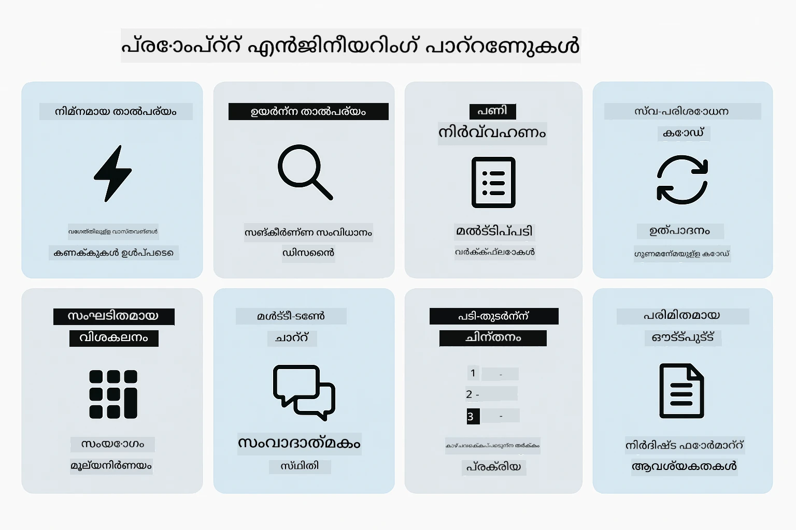
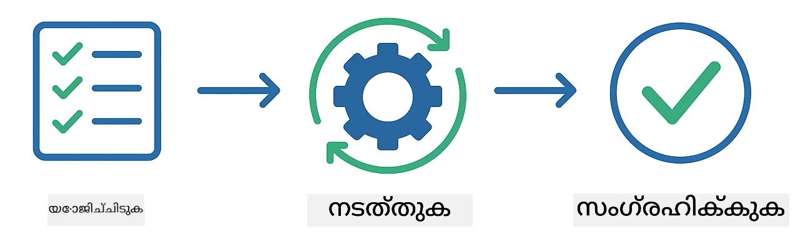
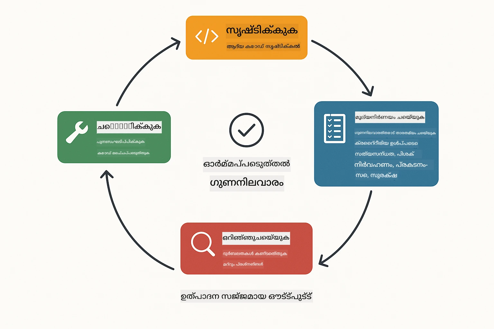
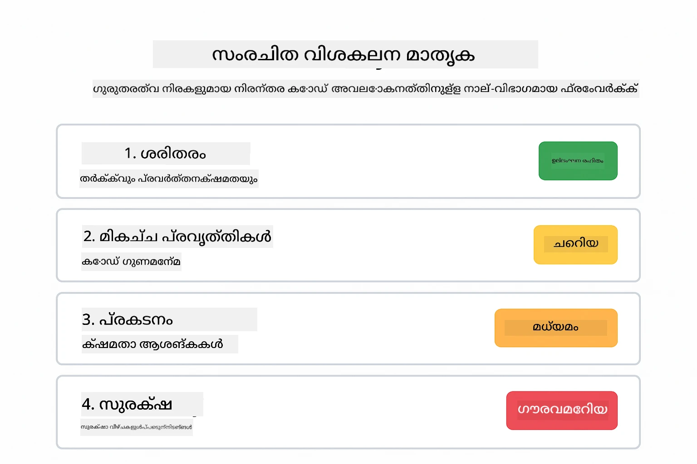
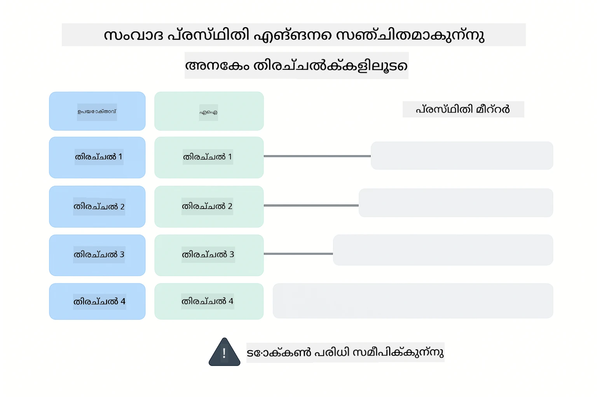
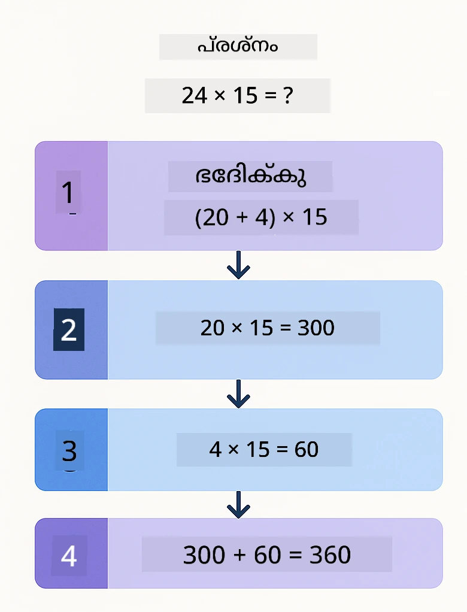
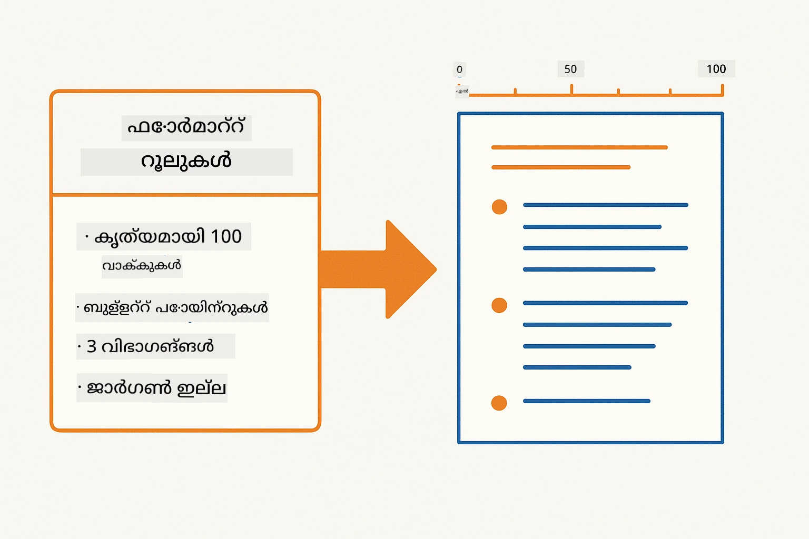
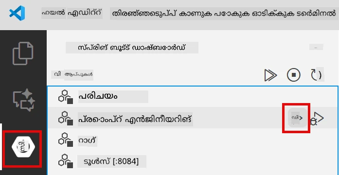
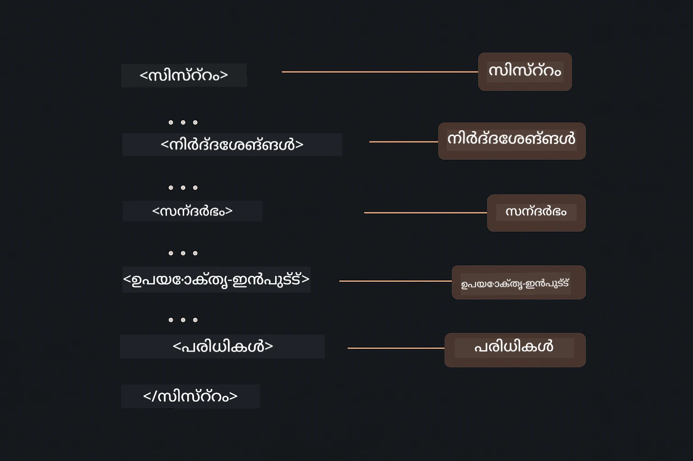

# മോഡ്യൂൾ 02: GPT-5.2 ഉപയോഗിച്ച് പ്രോമ്പ്റ്റ് എഞ്ചിനീയറിംഗ്

## വിഭവ സൂചിക

- [വീഡിയോ വാക്ക്‌ത്രൂ](#വീഡിയോ-വാക്ക്‌ത്രൂ)  
- [നീങ്ങൾ പഠിക്കുoennuൽത്](#നീങ്ങൾ-പഠിക്കുmennuൽത്)  
- [അവശ്യ പ്രിവൃത്തി കാര്യങ്ങൾ](#അവശ്യ-പ്രിവൃത്തി-കാര്യങ്ങൾ)  
- [പ്രോമ്പ്റ്റ് എഞ്ചിനീയറിംഗ് മനസ്സിലാക്കൽ](#പ്രോമ്പ്റ്റ്-എഞ്ചിനീയറിംഗ്-മനസ്സിലാക്കൽ)  
- [പ്രോമ്പ്റ്റ് എഞ്ചിനീയറിംഗ് അടിസ്ഥാനങ്ങൾ](#പ്രോമ്പ്റ്റ്-എഞ്ചിനീയറിംഗ്-അടിസ്ഥാനങ്ങൾ)  
  - [സീറോ-ഷോട്ട് പ്രോമ്പ്റ്റിംഗ്](#സീറോ-ഷോട്ട്-പ്രോമ്പ്റ്റിംഗ്)  
  - [ഫ്യൂ-ഷോട്ട് പ്രോമ്പ്റ്റിംഗ്](#ഫ്യൂ-ഷോട്ട്-പ്രോമ്പ്റ്റിംഗ്)  
  - [ചെയിൻ ഓഫ് തോട്ട്](#ചെയിൻ-ഓഫ്-തോട്ട്)  
  - [റോൾ-ബേസ് പ്രോമ്പ്റ്റിംഗ്](#റോൾ-ബേസ്-പ്രോമ്പ്റ്റിംഗ്)  
  - [പ്രോമ്പ്റ്റ് ടെംപ്ലേറ്റുകൾ](#പ്രോമ്പ്റ്റ്-ടെംപ്ലേറ്റുകൾ)  
- [അഗ്രഗതമായ രീതികൾ](#അഗ്രഗതമായ-രീതികൾ)  
- [ആപ്ലിക്കേഷൻ ഓടിക്കുക](#അപ്ലിക്കേഷൻ-പ്രവർത്തിപ്പിക്കുക)  
- [ആപ്ലിക്കേഷൻ സ്ക്രീൻഷോട്ടുകൾ](#അപ്ലിക്കേഷൻ-സ്ക്രീൻഷോട്ടുകൾ)  
- [രീതികൾ അന്വേഷിക്കൽ](#പാറ്റേണുകൾ-പരിശോധിക്കൽ)  
  - [കുറഞ്ഞും ഉയർന്നും ഉത്സാഹം](#ലോ-vs-ഹൈ-ഈജർനെസ്)  
  - [ടാസ്ക് എക്സിക്യൂഷൻ (ടൂൾ പ്രീഅംബ്ലുകൾ)](#ടാസ്‌ക്-എക്സിക്യൂഷൻ-ടൂൾ-പ്രീാംബിളുകൾ)  
  - [സ്വയം-പരിശോധന കോഡ്](#സ്വയം-പരാമർശിക്കുന്ന-കോഡ്)  
  - [ഘടനാപരമായ വിശകലനം](#ഘടനാഭാഗങ്ങൾ-വീക്ഷണം)  
  - [മൾട്ടി-ടേൺ ചാറ്റ്](#മൾട്ടി-ടേൺ-ചാറ്റ്)  
  - [പടി-പടി ചിന്തനം](#ഘട്ടം-ഘട്ടം-ചിന്തിച്ചുള്ള-പരിഹാരം)  
  - [നിയന്ത്രിത ഔട്ട്പുട്ട്](#നിയന്ത്രിത-ഔട്ട്പുട്ട്)  
- [നീങ്ങൾ വാസ്തവത്തിൽ എന്ത് പഠിക്കുന്നു](#നിങ്ങൾ-യാഥാർത്ഥ്യത്തിൽ-പഠിക്കുന്നത്)  
- [അടുത്ത ഘട്ടങ്ങൾ](#വരും-ഘട്ടങ്ങൾ)  

## വീഡിയോ വാക്ക്‌ത്രൂ

ഈ മോഡ്യൂളുമായി ആരംഭിക്കുന്നതിന് എങ്ങനെ എന്നതു വിശദീകരിക്കുന്ന ഈ ലൈവ് സെഷൻ കാണുക:

<a href="https://www.youtube.com/live/PJ6aBaE6bog?si=LDshyBrTRodP-wke"></a>

## നീങ്ങൾ പഠിക്കുmennuൽത്

താഴെ കൊടുത്തിരിക്കുന്ന ചിത്ര പരാമർശം ഈ മോഡ്യൂളിൽ നിങ്ങൾ വികസിപ്പിക്കുക സാധ്യമായ പ്രധാന വിഷയങ്ങളും കഴിവുകളും - പ്രോമ്പ്റ്റ് മെച്ചപ്പെടുത്തലിനുള്ള സാങ്കേതികവിദ്യകളിൽ നിന്നുകൂടെ, നീങ്ങുന്ന പ്രവൃത്തി രീതി വരെ — ഒരു അവലോകനം നൽകുന്നു.


മുൻ മോഡ്യൂളിൽ, നിങ്ങൾ ഓർമ്മ ഉപയോഗിച്ച് Azure OpenAI യുമായി സംഭാഷണ AI എങ്ങനെ പ്രവർത്തിക്കുന്നത് കണ്ടു. ഇപ്പോൾ നാം ശ്രദ്ധ കേന്ദ്രീകരിക്കുന്നു നിങ്ങൾ ചോദ്യങ്ങൾ എങ്ങനെ ചോദിക്കുകയെന്നതിൽ — പ്രോമ്പ്റ്റുകൾ സ്വയം — Azure OpenAI യുടെ GPT-5.2 ഉപയോഗിച്ച്. നിങ്ങൾ നിർമ്മിക്കുന്ന പ്രോമ്പ്റ്റുകളെ ഘടിപ്പിക്കുന്ന രീതി ലഭിക്കുന്ന പത്രങ്ങളുടെ ഗുണമേന്മയിൽ ശക്തമായ വ്യത്യാസം ഉണ്ടാക്കുന്നു. നാം അടിസ്ഥാന പ്രോമ്പ്റ്റിംഗ് സാങ്കേതികവിദ്യകളുടെ അവലോകനത്തോടെ ആരംഭിക്കും, പിന്നെ GPT-5.2 യുടെ കഴിവുകൾ പൂർണ്ണമായി പ്രയോജനപ്പെടുത്തുന്ന എട്ട് അഗ്രഗതമായ രീതികളിലേക്ക് നീങ്ങും.

Reasoning control എന്ന പുതിയ സവിശേഷത GPT-5.2 ൽ ഉൾപ്പെടുത്തിയതിനാൽ നാം ഈ മോഡ്യൂൾ അതുപയോഗിച്ച് പ്രവർത്തിക്കും - നിങ്ങൾ മോഡലിന് ഉത്തരമടയ്ക്കുന്നതിനു മുൻപ് എത്ര ചിന്തിക്കണമെന്ന് പറയാം. ഇതു വ്യത്യസ്ത പ്രോമ്പ്റ്റിംഗ് തന്ത്രങ്ങൾ കൂടുതൽ വ്യക്തമാണ് ആകുന്നു, പൂർത്തിയായി ഓരോ സമീപനവും എപ്പോൾ ഉപയോഗിക്കേണ്ടതാണെന്നും മനസ്സിലാക്കാൻ സഹായിക്കുന്നു.

## അവശ്യ പ്രിവൃത്തി കാര്യങ്ങൾ

- Module 01 പൂര്‍ത്തിയാക്കിയിട്ടുണ്ട് (Azure OpenAI റെസോഴ്‌സസ് വിന്യസിച്ചിരിക്കുന്നു)  
- റൂട്ട് ഡയറക്ടറിയിൽ `.env` ഫയൽ ഉണ്ടാകണം Azure പ്രശസ്തീകരണ വിവരങ്ങളോടുകൂടെ (`azd up` ഉപയോഗിച്ച് Module 01 ൽ സൃഷ്‌ടിച്ചത്)  

> **കുറിപ്പ്:** Module 01 പൂർത്തിയാക്കിയിട്ടില്ല എങ്കിൽ, ആദ്യം അവിടെ കൊടുത്ത വിന്യാസ നിർദ്ദേശങ്ങൾ പാലിക്കുക.

## പ്രോമ്പ്റ്റ് എഞ്ചിനീയറിംഗ് മനസ്സിലാക്കൽ

അത്യാവശ്യമായി, പ്രോമ്പ്റ്റ് എഞ്ചിനീയറിംഗ് എന്നത് എങ്ങനെ വ്യക്തമായ, മിതമായ നിർദ്ദേശങ്ങളും കൃത്യമായ നിർദ്ദേശങ്ങളും തമ്മിലുള്ള വ്യത്യാസമാണ് എന്ന് താഴെ പരാമർശിക്കുന്നു.


പ്രോമ്പ്റ്റ് എഞ്ചിനീയറിംഗ് എന്നത് നിങ്ങൾക്കു വേണ്ട ফলങ്ങൾ സ്ഥിരമായി നൽകുന്ന ഇൻപുട്ട് ടെക്‌സ്‌റ്റ് രൂപകല്പന ചെയ്യുന്നതാണ്. ഇത് ചോദ്യങ്ങൾ ചോദിക്കുന്നതിൽ മാത്രമല്ല - മോഡൽ നന്നായി മനസ്സിലാക്കാൻ കൂടത്തോളം നൽകുന്നതും എങ്ങനെ നൽകണമെന്ന് ഘടിപ്പിക്കുന്നതും ആണ്.

ഇതിനെ ഒരു സഹപ്രവർത്തകനെ നിർദ്ദേശങ്ങൾ നൽകുന്നതായി കരുതുക. "ബഗ് പരിഹരിക്കുക" എന്നത് മിതമായതാണ്. "UserService.java ലെ 45-ത്തെ ചൂണ്ടുന്ന നൾ പാസ്സ് നിർത്തൽ ചേർത്ത് നൾ പോയിന്റർ എക്സ്ട്രക്‌ഷൻ പരിഹരിക്കുക" എന്നത് കൃത്യമാണ്. ഭാഷാ മോഡലുകളും ഇതുപോലെ പ്രവർത്തിക്കുന്നു - കൃത്യതയും ഘടനയും ചെറുതായി പ്രാധാന്യമുള്ളവയാണ്.

താഴെ നൽകിയിരിക്കുന്ന ചിത്രത്തില് LangChain4j ഇങ്ങനെ ഈ ചിത്രംക്കുള്ളിൽ എങ്ങനെയാണ് ഉൾപ്പെടുന്നത് — SystemMessage, UserMessage എന്ന ഘടകങ്ങളിലൂടെ നിങ്ങളുടെ പ്രോമ്പ്റ്റ് മാതൃകകൾ മോഡലുമായി ബന്ധിപ്പിക്കുന്നു.


LangChain4j മോഡൽ ബന്ധങ്ങൾ, ഓർമ്മ, സന്ദേശ തരം എന്നിവയ്ക്ക് അടിസ്ഥാന സൗകര്യങ്ങൾ നിർമിക്കുന്നു — അതേസമയം, പ്രോമ്പ്റ്റ് മാതൃകകൾ എന്നാൽ ഈ അടിസ്ഥാന സൗകര്യത്തിലൂടെ നിങ്ങൾ അയക്കുന്ന കൃത്യമായി ഘടിപ്പിച്ച ടെക്സ്റ്റുകൾ മാത്രമാണ്. മുഖ്യ ഘടകങ്ങൾ SystemMessage (AI ന്റെ സ്വഭാവവും പാത്രവും സജ്ജമാക്കുന്നു) , UserMessage (നിങ്ങളുടെ യഥാർത്ഥ അഭ്യർത്ഥനയും) എന്നിവയാണ്.

## പ്രോമ്പ്റ്റ് എഞ്ചിനീയറിംഗ് അടിസ്ഥാനങ്ങൾ

താഴെ കാണുന്ന അഞ്ച് പ്രധാന സാങ്കേതിക വിദ്യകൾ ഫലപ്രദമായ പ്രോമ്പ്റ്റ് എഞ്ചിനീയറിംഗിന് അടിസ്ഥാനം ആണ്. ഓരോന്നും ഭാഷാ മോഡലുകളുമായുള്ള ആശയവിനിമയത്തിന്റെ വ്യത്യസ്ത അസ്പക്റ്റിനെ നേരിടുന്നു.


ഈ മോഡ്യൂളിലെ അഗ്രഗതമായ മാതൃകകളിലേക്ക് കടക്കുന്നതിനു മുമ്പ്, ഒന്നിച്ച് അഞ്ച് അടിസ്ഥാന പ്രോമ്പ്റ്റിംഗ് സാങ്കേതിക വിദ്യകൾ അവലോകനം ചെയ്യാം. ഇവയാണ് ഓരോ പ്രോമ്പ്റ്റ് എഞ്ചിനീയർക്കും അറിവുള്ളതാകേണ്ട പടിപടിയുള്ള ഘടകങ്ങൾ.

### സീറോ-ഷോട്ട് പ്രോമ്പ്റ്റിംഗ്

 ഏറ്റവും ലളിതമായ സമീപനം: ഉദാഹരണങ്ങളില്ലാതെ മോഡലിന് നേരിട്ടു നിർദ്ദേശങ്ങൾ നൽകുക. മോഡൽ തന്റെ പരിശീലനം മൂലം മാത്രം ടാസ്ക് മനസ്സിലാക്കി നിർവഹിക്കുന്നു. പ്രതീക്ഷിച്ച പ്രവൃത്തി വ്യക്തമായ അവസ്ഥകൾക്കു ഇത് നല്ല പ്രവർത്തനം നൽകുന്നു.


*ഉദാഹരണമില്ലാതെ നേരിട്ടു നിർദ്ദേശം നൽകൽ — മോഡൽ നിർദ്ദേശം മാത്രം ആശ്രയിച്ച് ടാസ്ക് മനസ്സിലാക്കുന്നു*

```java
String prompt = "Classify this sentiment: 'I absolutely loved the movie!'";
String response = model.chat(prompt);
// പ്രതികരണം: "സAKERം"
```
  
**എപ്പോൾ ഉപയോഗിക്കണം:** ലളിതമായ വർഗ്ഗീകരണങ്ങൾ, നേരിട്ടുള്ള ചോദ്യങ്ങൾ, അനുവാദങ്ങൾ, അല്ലെങ്കിൽ കൂടുതൽ മാർഗ്ഗനിർദ്ദേശങ്ങൾ ആവശ്യപ്പെടാത്ത മറ്റ് എല്ലാ ടാസ്കുകൾക്കും.

### ഫ്യൂ-ഷോട്ട് പ്രോമ്പ്റ്റിംഗ്

നീങ്ങൾ മോഡൽ അനുശ്രീതിപ്രകാരം പാലിക്കേണ്ട മാതൃക കാണിക്കുന്ന ഉദാഹരണങ്ങൾ നൽകുക. മോഡൽ നിങ്ങളുടെ ഉദാഹരണങ്ങളിൽ നിന്നു ഊഹാവകാശ ഫോർമാറ്റും സമീപനവും പഠിച്ച് പുതിയ ഇൻപുട്ടുകളിൽ പ്രയോഗിക്കുന്നു. ഇത് സംഭാവന ഫോർമാറ്റ് അല്ലെങ്കിൽ പെരുമാറ്റം വ്യക്തമല്ലാത്ത ടാസ്കുകൾക്കു സ്ഥിരത പെരുക്കുന്നു.


*ഉദാഹരണങ്ങളിൽ നിന്നു പഠിക്കൽ — മോഡൽ മാതൃക തിരിച്ചറിഞ്ഞ് പുതിയ ഇൻപുട്ടുകളിൽ പ്രയോഗിക്കുന്നു*

```java
String prompt = """
    Classify the sentiment as positive, negative, or neutral.
    
    Examples:
    Text: "This product exceeded my expectations!" → Positive
    Text: "It's okay, nothing special." → Neutral
    Text: "Waste of money, very disappointed." → Negative
    
    Now classify this:
    Text: "Best purchase I've made all year!"
    """;
String response = model.chat(prompt);
```
  
**എപ്പോൾ ഉപയോഗിക്കണം:** ഇഷ്ടാനുസൃത വർഗ്ഗീകരണങ്ങൾ, സ്ഥിരമായ ഫോർമാറ്റിംഗ്, ഡൊമെയിൻ-സ്പെസിഫിക് ടാസ്കുകൾ, അല്ലെങ്കിൽ സീറോ-ഷോട്ട് ഫലങ്ങൾ മിതവുമായായിരിക്കുമ്പോൾ.

### ചെയിൻ ഓഫ് തോട്ട്

മോഡലിനെ  അതിന്റെ ചിന്തനശേഷി പടി-പടി കാണിക്കാൻ അഭ്യർന്നിരിക്കുക. നേരിട്ട് ഉത്തരത്തിലേക്ക് ചാടാതെ മോഡൽ പ്രശ്നത്തെ പടിപടിയായി തകർത്തു തർക്ക നിയമപദ്ധതിയിൽ നിർവ്വഹിക്കുന്നു. ഇത് ഗണിതം, തർക്കം, ബഹുവിധ ചിന്തന ടാസ്കുകളിൽ മാങ്കഷ്ടി വർദ്ധിപ്പിക്കുന്നു.


*പടി-പടി ചിന്തനം — സങ്കീർണ്ണ പ്രശ്നങ്ങളെ ഗണിതപദവികൾ ആയി വിഭജിക്കൽ*

```java
String prompt = """
    Problem: A store has 15 apples. They sell 8 apples and then 
    receive a shipment of 12 more apples. How many apples do they have now?
    
    Let's solve this step-by-step:
    """;
String response = model.chat(prompt);
// മോഡൽ കാണിക്കുന്നു: 15 - 8 = 7, പിന്നെ 7 + 12 = 19 ആപ്പിളുകൾ
```
  
**എപ്പോൾ ഉപയോഗിക്കണം:** ഗണിത പ്രശ്നങ്ങൾ, ലാജിക് പസിലുകൾ, ഡീബഗിംഗ്, അല്ലെങ്കിൽ ചിന്തന പ്രക്രിയ കാണിക്കുന്നതുകൊണ്ട് മാങ്കഷ്ടിയും വിശ്വാസ്യതയും വർദ്ധിക്കുന്ന എല്ലാ ടാസ്കുകൾക്കും.

### റോൾ-ബേസ് പ്രോമ്പ്റ്റിംഗ്

ചോദ്യമോ ബോധിപ്പിക്കുന്നതിന് മുൻപ് AI നൊരു വ്യക്തിത്വം അല്ലെങ്കിൽ റോൾ സജ്ജീകരിക്കുക. ഇത് പ്രതികരണത്തിന്റെ ടോൺ, ആഴം, ധ്രുവീകരണം എന്നിവ ആകൃതീകരിക്കാൻ സായൂകരിക്കുന്നു. "സോഫ്റ്റ്വെയർ ആർകിടെക്റ്റ്" "ജൂനിയർ ഡവലപ്പർ" അല്ലെങ്കിൽ "സുരക്ഷാ ഓഡിറ്റർ" നു നൽകുന്ന ഉപദേശം വ്യത്യസ്തമാണ്.


*സന്ദർഭവും വ്യക്തിത്വവും നൽകൽ — ഒരേ ചോദ്യത്തിന് ബAssigned role പോലുള്ള വ്യത്യസ്ത പ്രതികരണങ്ങൾ കിട്ടുന്നു*

```java
String prompt = """
    You are an experienced software architect reviewing code.
    Provide a brief code review for this function:
    
    def calculate_total(items):
        total = 0
        for item in items:
            total = total + item['price']
        return total
    """;
String response = model.chat(prompt);
```
  
**എപ്പോൾ ഉപയോഗിക്കണം:** കോഡ് റിവ്യൂ, പഠന സഹായം, ഡൊമെയിൻ-സ്പെസിഫിക് വിശകലനം, അല്ലെങ്കിൽ പ്രത്യേക വിദഗ്ധ തലത്തിൽ അല്ലെങ്കിൽ ദൃഷ്ടികോണത്തിൽCustomized response വേണ്ടവ.

### പ്രോമ്പ്റ്റ് ടെംപ്ലേറ്റുകൾ

പരിവർത്തനശീല ഫിൽഹോബുത്തക്രകളുമായി പുനരുപയോഗ പ്രോമ്പ്റ്റുകൾ രൂപം നൽകുക. ഓരോ പ്രാവശ്യം പുതിയ പ്രോമ്പ്റ്റ് എഴുതാതെ ഒരു സദാ നിർവചിച്ച രീതി പ്രയോഗിക്കുക. LangChain4j യുടെ `PromptTemplate` ക്ലാസ് ഇത് `{{variable}}` സിന്തക്സിൽ എളുപ്പമാക്കുന്നു.


*പരിവർത്തനശീല ഫിൽഹോബുത്തക്രകളുള്ള പുനരുപയോഗ പ്രോമ്പ്റ്റ് — ഒരിക്കൽ രൂപം, അനേകം പ്രയോഗങ്ങൾ*

```java
PromptTemplate template = PromptTemplate.from(
    "What's the best time to visit {{destination}} for {{activity}}?"
);

Prompt prompt = template.apply(Map.of(
    "destination", "Paris",
    "activity", "sightseeing"
));

String response = model.chat(prompt.text());
```
  
**എപ്പോൾ ഉപയോഗിക്കണം:** വ്യത്യസ്ത ഇൻപുട്ടുകളോടുള്ള നിത്യ ചോദ്യം, ബാച്ച് പ്രോസസ്സിംഗ്, പുനരുപയോഗ യോഗ്യമായ AI പ്രവൃത്തി തന്ത്രങ്ങൾ നിർമ്മിക്കുക, അല്ലെങ്കിൽ പ്രോമ്പ്റ്റ് ഘടന തുടർച്ചയായും ഡാറ്റ മാറി വരുമ്പോഴും ഉപയോക്തൃ സാഹചര്യങ്ങളിൽ.

---

ഈ അഞ്ച് അടിസ്ഥാനങ്ങൾ നിങ്ങള്‍ക്കു വളരെ വ്യാപകമായ പ്രോമ്പ്റ്റിംഗ് ടാസ്കുകൾക്കുള്ള അടിസ്ഥാനം നൽകുന്നു. ബാക്കിയുള്ള ഭാഗം GPT-5.2 യുടെ reasoning control, സ്വയം-വിമർശനം, ഘടനാപരമായ ഔട്ട്പുട്ട് കഴിവുകൾ ഉപയോഗിച്ച് **എട്ട് അഗ്രഗതമായ രീതികളാൽ** വികസിപ്പിച്ചിരിക്കുന്നു.

## അഗ്രഗതമായ രീതികൾ

അടിസ്ഥാനങ്ങൾ കഴിഞ്ഞു, ഈ മോഡ്യൂലിന്റെ പ്രത്യേകതയുള്ള എട്ട് പ്രഗത്ഭമായ രീതികളിലേക്ക് നാം നീങ്ങാം. എല്ലാ പ്രശ്നങ്ങൾക്കും ഒരേ സമീപനം വേണ്ടതല്ല. ചില ചോദ്യങ്ങൾക്ക് വേഗം ഉത്തരം, മറ്റുള്ളവയ്ക്കു ആഴമുള്ള ചിന്തനം. ചിലയ്ക്കു ദൃശ്യമായ ചിന്തനം വേണം, മറ്റു കുറച്ചു മാത്രം. താഴെ കൊടുത്തിരിക്കുന്ന ഓരോ മാതൃകയും വ്യത്യസ്ത സാഹചര്യങ്ങൾക്ക് അനുയോജ്യമാണ് — GPT-5.2 യുടെ reasoning control ഈ വ്യത്യാസങ്ങൾ കൂടുതൽ വ്യക്തമാക്കുന്നു.



*എട്ട് പ്രോമ്പ്റ്റ് എഞ്ചിനീയറിംഗ് മാതൃകകളുടെയും അവയുടെ ഉപയോഗ സാഹചര്യങ്ങളുടെ അവലോകനം*

GPT-5.2 ഈ മാതൃകകളെ മറ്റൊരു അളവിലേക്ക് ഉയര്‍ത്തെറി: *reasoning control*. താഴെ സ്ക്രീന്ഷോട്ടിൽ കാണുന്ന സ്ലൈഡർ മോഡലിന്റെ ചിന്തനശേഷി ക്രമീകരിക്കാൻ സഹായിക്കുന്നു — വേഗത്തിൽ നേരിട്ടുള്ള ഉത്തരത്തിൽ നിന്നും ആഴത്തിൽ പൂർണ്ണമായ വിശകലനത്തിലേക്കും.


*GPT-5.2 യുടെ reasoning control മോഡലിന് എത്ര ചിന്തനം നടത്തണമെന്ന് നിങ്ങൾ വ്യക്തമാക്കാം — വേഗം നേരിട്ടുള്ള മുതൽ ആഴത്തിൽ വിശദമായ വിശദീകരണം വരെ*

**കുറഞ്ഞ ഉത്സാഹം (വേഗവും കേന്ദ്രീകൃതവുമുള്ളത്)** - ലളിതമായ ചോദ്യങ്ങൾക്ക് വേഗത്തിലുള്ള ഏകദേശം സൂക്ഷ്മമായ ഉത്തരങ്ങൾ വേുമ്പോൾ. മോഡൽ നിസ్సഹായമായ reasoning - പരമാവധി 2 ചുവട്ടുകൾ മാത്രം നടത്തുന്നു. കണക്കുകൂട്ടൽ, തിരയൽ അല്ലെങ്കിൽ നേരിട്ട് ഉത്തരം ആവശ്യമായ ചോദ്യങ്ങൾക്ക് ഇത് ഉപയോഗിക്കുക.

```java
String prompt = """
    <context_gathering>
    - Search depth: very low
    - Bias strongly towards providing a correct answer as quickly as possible
    - Usually, this means an absolute maximum of 2 reasoning steps
    - If you think you need more time, state what you know and what's uncertain
    </context_gathering>
    
    Problem: What is 15% of 200?
    
    Provide your answer:
    """;

String response = chatModel.chat(prompt);
```
  
> 💡 **GitHub Copilot ഉപയോഗിച്ച് പരീക്ഷിക്കൂ:** [`Gpt5PromptService.java`](../../../02-prompt-engineering/src/main/java/com/example/langchain4j/prompts/service/Gpt5PromptService.java) തുറന്ന് ചോദിക്കുക:  
> - "കുറഞ്ഞ ഉത്സാഹവും ഉയർന്ന ഉത്സാഹവും ഉള്ള പ്രോമ്പ്റ്റിംഗ് മാതൃകകളിൽ有什么 വ്യത്യാസമാണ്?"  
> - "പ്രോമ്പ്റ്റുകളിൽ ഉള്ള XML ടാഗുകൾ എങ്ങനെ AI യുടെ പ്രതികരണം ഘടിപ്പിക്കാൻ സഹായിക്കുന്നു?"  
> - "സ്വയം-പരിശോധന മാതൃകകൾ VS നേരിട്ടുള്ള നിർദ്ദേശം എപ്പോൾ ഉപയോഗിക്കണം?"  

**ഉയർന്ന ഉത്സാഹം (ആഴവും സമഗ്രവുമായത്)** - സമ്പൂർണ വിശകലനത്തിനായി. മോഡൽ വിശദമായി പരിശ്രമിക്കുകയും വിശദമായ ചിന്തനം കാണിക്കുകയും ചെയ്യുന്നു. സിസ്റ്റം ഡിസൈൻ, ആർകിടെക്ചർ തീരുമാനങ്ങൾ, സങ്കീർണ്ണ ഗവേഷണം എന്നിവയ്ക്ക് ഇത് ഉപയോഗിക്കുക.

```java
String prompt = """
    Analyze this problem thoroughly and provide a comprehensive solution.
    Consider multiple approaches, trade-offs, and important details.
    Show your analysis and reasoning in your response.
    
    Problem: Design a caching strategy for a high-traffic REST API.
    """;

String response = chatModel.chat(prompt);
```
  
**ടാസ്ക് എക്സിക്യൂഷൻ (പടി-പടി പുരോഗതി)** - നിരവധി ഘട്ടങ്ങളുള്ള പ്രവൃത്തി രീതി. മോഡൽ ആദ്യം ഒരു പദ്ധതി നൽകുകയും, ഓരോ ഘട്ടവും പ്രവൃത്തി ചെയ്യുന്നപ്പോൾ വിവരിക്കുകയും, തുടർന്ന് സാമറി നൽകുകയും ചെയ്യുന്നു. മൈഗ്രേഷൻ, നടപ്പാക്കലുകൾ, അല്ലെങ്കിൽ ഏതെങ്കിലും ബഹു-ഘട്ട പ്രക്രിയയ്ക്ക് ഈ രീതി ഉപയോഗിക്കുക.

```java
String prompt = """
    <task_execution>
    1. First, briefly restate the user's goal in a friendly way
    
    2. Create a step-by-step plan:
       - List all steps needed
       - Identify potential challenges
       - Outline success criteria
    
    3. Execute each step:
       - Narrate what you're doing
       - Show progress clearly
       - Handle any issues that arise
    
    4. Summarize:
       - What was completed
       - Any important notes
       - Next steps if applicable
    </task_execution>
    
    <tool_preambles>
    - Always begin by rephrasing the user's goal clearly
    - Outline your plan before executing
    - Narrate each step as you go
    - Finish with a distinct summary
    </tool_preambles>
    
    Task: Create a REST endpoint for user registration
    
    Begin execution:
    """;

String response = chatModel.chat(prompt);
```
  
ചെയിൻ-ഓഫ്-തോട്ട് പ്രോമ്പ്റ്റിംഗ് മോഡലിൽ ചിന്തന പ്രക്രിയ വെളിപ്പെടുത്താൻ ആവശ്യപ്പെടുന്നു, സങ്കീർണ്ണ ടാസ്കുകളിൽ മാങ്കഷ്ടി വർദ്ധിപ്പിക്കുന്നു. പടി-പടി വിഭജനം മനുഷ്യരും AI യും ലൊജിക് മനസ്സിലാക്കാൻ സഹായിക്കുന്നു.

> **🤖 GitHub Copilot Chat ഉപയോഗിച്ച് ശ്രമിക്കൂ:** ഈ മാതൃകയെ കുറിച്ച് ചോദിക്കുക:  
> - "നീണ്ടകാലത്തേക്ക് നടത്തുന്ന ഒപ്പറേഷനുകൾക്കായി ടാസ്ക് എക്സിക്യൂഷൻ മാതൃക എങ്ങനെ ക്രമീകരിക്കാം?"  
> - "പ്രൊഡക്ഷൻ ആപ്ലിക്കേഷനുകളിൽ ടൂൾ പ്രീഅംബ്ലുകൾ ഘടിപ്പിക്കാനുള്ള മികച്ച പ്രവൃത്തികൾ എന്തൊക്കെ?"  
> - "UI യിൽ ഇട ഇട അതിവേഗ പുരോഗതി അപ്ഡേറ്റുകൾ എങ്ങനെ പിടിച്ചു കാട്ടണമെന്ന്?"  

താഴെ കാണുന്ന ചിത്രത്തിൽ ഈ പദ്ധതി → നടപ്പാക്കൽ → സാമറി പ്രവൃത്തി രീതി കാണിക്കുന്നു.



*പദ്ധതി → നടപ്പാക്കൽ → സാമറി - നിരവധി ഘട്ടങ്ങളുള്ള ടാസ്ക്കുകളിലേക്കുള്ള പ്രവൃത്തി രീതി*

**സ്വയം-പരിശോധന കോഡ്** - പ്രൊഡക്ഷൻ നിലവാരമുള്ള കോഡ് സൃഷ്ടിക്കാൻ. മോഡൽ പ്രൊഡക്ഷൻ മാനദണ്ഡങ്ങൾ പാലിച്ചുകൊണ്ട്, ശരിയായ പിശക് കൈകാര്യംത്തോടു കൂടി കോഡ് ജനനമാക്കുന്നു. പുതിയ ഫീച്ചറുകൾ അല്ലെങ്കിൽ സർവീസുകൾ നിർമ്മിക്കുമ്പോൾ ഇത് ഉപയോഗിക്കുക.

```java
String prompt = """
    Generate Java code with production-quality standards: Create an email validation service
    Keep it simple and include basic error handling.
    """;

String response = chatModel.chat(prompt);
```
  
താഴിലെ ചിത്രത്തിൽ ഈ ആവർത്തന മെച്ചപ്പെടുത്തൽ ചക്രം കാണുന്നു - ജനനിക്കുക, വിലയിരുത്തുക, ദുർബലതകൾ തിരിച്ചറിഞ്ഞ് മെച്ചപ്പെടുത്തുക, പ്രൊഡക്ഷൻ നിലവാരമെത്തിയുവരെയും ആവർത്തിക്കുക.



*ആവർത്തന മെച്ചപ്പെടുത്തൽ ചക്രം - സൃഷ്ടിക്കുക, വിലയിരുത്തുക, പ്രശ്നങ്ങൾ തിരിച്ചറിഞ്ഞ് മെച്ചപ്പെടുത്തുക, ആവർത്തിക്കുക*

**ഘടനാപരമായ വിശകലനം** - സ്ഥിരമായ അവലോകനത്തിനായി. മോഡൽ കോഡ് പരിശോധിച്ചു നിർധാരിത ഘടനാപരമായ ഫ്രെയിമ്വർക്കിലൂടെ (ശുദ്ധത, പ്രാക്ടീസുകൾ, പ്രകടനം, സുരക്ഷ, പരിപാലനക്ഷമത) വിലയിരുത്തുന്നു. കോഡ് അവലോകനം അല്ലെങ്കിൽ ഗുണനിലവാര മാപ്പിംഗിനായി ഇത് ഉപയോഗിക്കുക.

```java
String prompt = """
    <analysis_framework>
    You are an expert code reviewer. Analyze the code for:
    
    1. Correctness
       - Does it work as intended?
       - Are there logical errors?
    
    2. Best Practices
       - Follows language conventions?
       - Appropriate design patterns?
    
    3. Performance
       - Any inefficiencies?
       - Scalability concerns?
    
    4. Security
       - Potential vulnerabilities?
       - Input validation?
    
    5. Maintainability
       - Code clarity?
       - Documentation?
    
    <output_format>
    Provide your analysis in this structure:
    - Summary: One-sentence overall assessment
    - Strengths: 2-3 positive points
    - Issues: List any problems found with severity (High/Medium/Low)
    - Recommendations: Specific improvements
    </output_format>
    </analysis_framework>
    
    Code to analyze:
    ```
    public List getUsers() {
        return database.query("SELECT * FROM users");
    }
    ```
    Provide your structured analysis:
    """;

String response = chatModel.chat(prompt);
```
  
> **🤖 GitHub Copilot Chat ഉപയോഗിച്ച് പരീക്ഷിക്കൂ:** ഘടനാപരമായ വിശകലനം കുറിച്ച് ചോദിക്കുക:  
> - "വ്യത്യസ്ത കോഡ് റിവ്യൂ തരം കാണുന്ന ഫ്രെയിമ്വർക്കുകൾ എങ്ങനെ ഇഷ്‌ടാനുസൃതമാക്കണം?"  
> - "ഘടനാപരമായ ഔട്ട്പുട്ട് പ്രോഗ്രാമാറ്റിക്കായി പാഴ്‌സും ഉപയോഗവും എങ്ങനെ കാര്യക്ഷമമാക്കാം?"  
> - "വിടവിട്ട അവലോകനങ്ങളിൽ സ്ഥിരമായ ഗുരുതരത തലങ്ങൾ എങ്ങനെ ഉറപ്പാക്കാം?"  

താഴെ നൽകിയിരിക്കുന്ന ചിത്രം ഈ ഘടനാപരമായ ഫ്രെയിംവർക്ക് കോഡ് റിവ്യൂ സ്ഥിരമായ വിഭാഗങ്ങളായി ഭേദിച്ച് ഗുരുതരത നിലയോടു കൂടെ എങ്ങനെ ക്രമീകരിക്കുന്നു എന്ന് കാണിക്കുന്നു.



*ഗുരുതരത നിലയോടെയുള്ള സ്ഥിരമായ കോഡ് റിവ്യൂകൾക്ക് ഫ്രെയിമ്വർക്ക്*

**മൾട്ടി-ടേൺ ചാറ്റ്** - സാഹചര്യമെന്നാൽ ആവശ്യമുള്ള സംഭാഷണങ്ങൾക്ക്. മോഡൽ മുൻകാല സന്ദേശങ്ങൾ ഓർത്തു അവയിൽ അധിഷ്ഠിതംയായി തുടരുന്നു. ഇന്ററാക്ടീവ് സഹായ സെഷനുകളോ സങ്കീര്‍ണ ചോദ്യോത്തരങ്ങളോ ആവശ്യമായപ്പോൾ ഇത് ഉപയോഗിക്കുക.

```java
ChatMemory memory = MessageWindowChatMemory.withMaxMessages(10);

memory.add(UserMessage.from("What is Spring Boot?"));
AiMessage aiMessage1 = chatModel.chat(memory.messages()).aiMessage();
memory.add(aiMessage1);

memory.add(UserMessage.from("Show me an example"));
AiMessage aiMessage2 = chatModel.chat(memory.messages()).aiMessage();
memory.add(aiMessage2);
```
  
താഴെയുള്ള ചിത്രം ഒരിക്കൽ കൂടുതൽ ഘട്ടങ്ങളിൽ സംഭാഷണത്തിന്റെ സാഹചര്യ എങ്ങനെ കൂട്ട് കൂട്ടുന്നു, മോഡലിന്റെ ടോക്കൺ പരിധിയുമായി ബന്ധിപ്പിക്കുന്ന വിധം കാണിക്കുന്നു.



*ചർച്ചയുടെ സാഹചര്യ മൾട്ടി-ടേൺ കൈമാറ്റങ്ങൾ വഴി ടോക്കൺ പരിധി വരെ എങ്ങനെ കൂട്ടാളിക്കുന്നു*

**പടി-പടി ചിന്തനം** - ദൃശ്യമായ ലജിക് ആവശ്യമായ പ്രശ്നങ്ങൾക്കു. മോഡൽ ഓരോ ഘട്ടത്തിന്റെയും സൂക്ഷ്മമായ ചിന്തനം കാണിക്കുന്നു. ഗണിത പ്രശ്നങ്ങൾ, തർക്കം പസിലുകൾ, അല്ലെങ്കിൽ ചിന്തന പ്രക്രിയ മനസ്സിലാക്കേണ്ടപ്പോൾ ഇത് ഉപയോഗിക്കുക.

```java
String prompt = """
    <instruction>Show your reasoning step-by-step</instruction>
    
    If a train travels 120 km in 2 hours, then stops for 30 minutes,
    then travels another 90 km in 1.5 hours, what is the average speed
    for the entire journey including the stop?
    """;

String response = chatModel.chat(prompt);
```
  
താഴെ ചേർന്നിരിക്കുന്ന ചിത്രത്തിൽ മോഡൽ പ്രശ്നങ്ങളെ സൂക്ഷ്മ, നൂമ്പർ ചെയ്ത ലജിക്കൽ ഘട്ടങ്ങളായി വിഭജിക്കുന്നതുണ്ടെന്ന് കാണിക്കുന്നു.


*പ്രശ്‌നങ്ങളെ വ്യക്തമായ തത്വചിന്താ ഘട്ടങ്ങളായി വിഭജിക്കൽ*

**നിയന്ത്രിത ഔട്ട്പുട്ട്** - പ്രത്യേക ഫോർമാറ്റ് ആവശ്യകതകളുള്ള പ്രതികരണങ്ങൾക്ക്. മോഡൽ കർശനമായി ഫോർമാറ്റും നീളവും പാലിക്കുന്നു. സംഗ്രഹങ്ങൾക്കോ നിർദ്ദിഷ്ട ഔട്ട്പുട്ട് ഘടന ആവശ്യമുള്ളപ്പോഴോ ഇത് ഉപയോഗിക്കുക.

```java
String prompt = """
    <constraints>
    - Exactly 100 words
    - Bullet point format
    - Technical terms only
    </constraints>
    
    Summarize the key concepts of machine learning.
    """;

String response = chatModel.chat(prompt);
```

താഴെ കൊടുത്തിരിക്കുന്ന രേഖാചിത്രം മോഡലിനെ നിങ്ങളുടെ ഫോർമാറ്റ്, നീളം എന്നിവ കർശനമായി പാലിക്കുന്ന ഔട്ട്പുട്ട് സൃഷ്ടിക്കാൻ എങ്ങനെ നിയന്ത്രണങ്ങൾ മാർഗ്ഗനിർദ്ദേശം നൽകുന്നു എന്ന് കാണിക്കുന്നു.



*നിർദ്ദിഷ്ട ഫോർമാറ്റ്, നീളം, ഘടന ആവശ്യകതകൾ നടപ്പിലാക്കൽ*

## അപ്ലിക്കേഷൻ പ്രവർത്തിപ്പിക്കുക

**നിയമാനുസൃത ഡിപ്ലോയ്മെന്റ് പരിശോധിക്കുക:**

അഴുറ്റ് ക്രെഡൻഷ്യലുകളോടെ `.env` ഫയൽ റൂട്ടിലെ ഉള്ളതായി ഉറപ്പാക്കുക (Module 01-ൽ സൃഷ്ടിച്ചത്). ഇത് മോഡ്യൂൾ ഡയറക്ടറിയിൽ നിന്ന് പ്രവർത്തിപ്പിക്കുക (`02-prompt-engineering/`):

**ബാഷ്:**
```bash
cat ../.env  # AZURE_OPENAI_ENDPOINT, API_KEY, DEPLOYMENT കാണിക്കണം
```

**പവർ ഷെൽ:**
```powershell
Get-Content ..\.env  # AZURE_OPENAI_ENDPOINT, API_KEY, DEPLOYMENT കാണിക്കേണ്ടതാണ്
```

**അപ്ലിക്കേഷൻ ആരംഭിക്കുക:**

> **ഗൗരവമുള്ള കുറിപ്പ്:** റൂട്ട് ഡയറക്ടറിയിൽ നിന്ന് `./start-all.sh` എല്ലാ ആപ്ലിക്കേഷനുകളും നിങ്ങൾ മുമ്പ് ആരംഭിച്ചിട്ടുണ്ടെങ്കിൽ (Module 01-ൽ വിശദീകരിച്ചത് പോലെ), ഈ മോഡ്യൂൾ 8083 പോർട്ടിൽ ഇതിനകം പ്രവർത്തനസജ്ജമാണ്. താഴെ കൊടുത്തിരിക്കുന്ന ആരംഭിക്കാൻ വേണ്ട കമാൻഡുകൾ ഒഴിവാക്കി നേരിട്ട് http://localhost:8083 സന്ദർശിക്കാം.

**ഓപ്ഷൻ 1: സ്‌പ്രിംഗ് ബൂട്ട് ഡാഷ്ബോർഡ് ഉപയോഗിക്കൽ (VS Code ഉപയോക്താക്കൾക്ക് ശിപാർശ ചെയ്‌തത്)**

ഡെവ് കണ്ടെയ്‌നറിൽ സ്‌പ്രിംഗ് ബൂട്ട് ഡാഷ്ബോർഡ് എക്സ്റ്റൻഷൻ ഉൾപ്പെടുത്തപ്പെട്ടിരിക്കുന്നു, ഇത് എല്ലാ സ്‌പ്രിംഗ് ബൂട്ട് ആപ്ലിക്കേഷനുകളും ദൃശ്യപരമായി കൈകാര്യം ചെയ്യാൻ സഹായിക്കുന്നു. VS Code-യുടെ ഇടത്ത(js) Activity Bar-ൽ സ്പ്രിംഗ് ബൂട്ട് ഐക്കൺ കണ്ടെത്തുക.

സ്പ്രിംഗ് ബൂട്ട് ഡാഷ്ബോർഡിൽ നിന്നു് നിങ്ങള്‍ക്കു ലഭ്യമായതു:
- വർക്ക്സ്പേസിലെ എല്ലാ സ്‌പ്രിംഗ് ബൂട്ട് ആപ്ലിക്കേഷനുകളും കാണുക
- സിംപിള്‍ ക്ലിക്കോടെ ആപ്ലിക്കേഷനുകൾ സ്റ്റാർട്ട്/സ്റ്റോപ്പ് ചെയ്യുക
- ആപ്ലിക്കേഷൻ ലോഗുകൾ സത്യസന്ധമായി കാണുക
- ആപ്ലിക്കേഷന്റെ നില നിരീക്ഷിക്കുക

"prompt-engineering" ന്റെ അടുത്തുള്ള പ്ലേ ബട്ടൺ ക്ലിക്കുചെയ്ത് ഈ മോഡ്യൾ ആരംഭിക്കുക, അല്ലെങ്കിൽ എല്ലാ മോഡ്യൂളുകളും ഒരുമിച്ച് തുടങ്ങുക.



*VS Codeയിലെ സ്പ്രിംഗ് ബൂട്ട് ഡാഷ്ബോർഡ് — ഒരു സ്ഥലം നിന്നും എല്ലാ മോഡ്യൂളുകളും ആരംഭിച്ച്‌ നിർത്തി, നിരീക്ഷിക്കുക*

**ഓപ്ഷൻ 2: ഷെൽ സ്ക്രിപ്റ്റുകൾ ഉപയോഗിക്കല്‍**

എല്ലാ വെബ് ആപ്ലിക്കേഷനുകളും (മോഡ്യൂളുകൾ 01-04) ആരംഭിക്കുക:

**ബാഷ്:**
```bash
cd ..  # റൂട്ട് ഡയറക്ടറിയിൽ നിന്ന്
./start-all.sh
```

**പവർ ഷെൽ:**
```powershell
cd ..  # റൂട്ട് ഡയറക്ടറിയിൽ നിന്ന്
.\start-all.ps1
```

അല്ലെങ്കിൽ ഈ മോഡ്യൂളിനുതന്നെ ആരംഭിക്കുക:

**ബാഷ്:**
```bash
cd 02-prompt-engineering
./start.sh
```

**പവർ ഷെൽ:**
```powershell
cd 02-prompt-engineering
.\start.ps1
```

രണ്ടും സ്ക്രിപ്റ്റുകൾ സ്വയം റൂട്ടിലെ `.env` ഫയലിൽ നിന്ന് പരിസ്ഥിതി വെറിയബിളുകൾ ലോഡ് ചെയ്യും, JAR ഫയലുകൾ ഇല്ലാത്ത പക്ഷം നിർമിക്കും.

> **കുറിപ്പ്:** തുടങ്ങുന്നതിന് മുമ്പ് എല്ലാ മോഡ്യൂളുകളും കൈമാന്വായി നിർമ്മിക്കാൻ നിങ്ങൾ ഇഷ്ടപ്പെടുന്നെങ്കിൽ:
>
> **ബാഷ്:**
> ```bash
> cd ..  # Go to root directory
> mvn clean package -DskipTests
> ```
>
> **പവർ ഷെൽ:**
> ```powershell
> cd ..  # Go to root directory
> mvn clean package -DskipTests
> ```

http://localhost:8083 നിങ്ങളുടെ ബ്രൗസറിൽ തുറക്കുക.

**അപ്ലിക്കേഷൻ നിർത്താൻ:**

**ബാഷ്:**
```bash
./stop.sh  # ഈ മൂട്യൂൾ മാത്രം
# അല്ലെങ്കിൽ
cd .. && ./stop-all.sh  # എല്ലാ മൂട്യൂളുകളും
```

**പവർ ഷെൽ:**
```powershell
.\stop.ps1  # ഈ മൊഡ്യൂള്‍ മാത്രം
# അല്ലെങ്കില്‍
cd ..; .\stop-all.ps1  # എല്ലാ മൊഡ്യൂളുകളും
```

## അപ്ലിക്കേഷൻ സ്ക്രീൻഷോട്ടുകൾ

ഇവിടെ പ്രോമ്പ്റ്റ് എഞ്ചിനീയറിംഗ് മോഡ്യൂളിന്റെ പ്രധാന ഇന്റർഫേസ് കാണാം, എല്ലാവരും പത്തിരുപത് പാറ്റേണുകൾക്കൊപ്പം പരസ്പരം പരീക്ഷിക്കാവുന്നതാണ്.


*ഡാഷ്ബോർഡ് മുഖ്യപ്രവേശനം, എല്ലാ 8 പ്രോംപ്റ്റ് എഞ്ചിനീയറിംഗ് പാറ്റേണുകളും അവരുടെ സവിശേഷതകളും ഉപയോഗകേസുകളും കാണിക്കുന്നു*

## പാറ്റേണുകൾ പരിശോധിക്കൽ

വെബ് ഇന്റർഫേസ് വ്യത്യസ്ത പ്രോമ്പ്റ്റിംഗ് തന്ത്രങ്ങൾ പരീക്ഷിക്കാൻ സഹായിക്കുന്നു. ഓരോ പാറ്റേണും വ്യത്യസ്ത പ്രശ്നങ്ങൾ പരിഹരിക്കുന്നു - ഏതു സമീപനം എപ്പോൾ ഉത്തമമാണെന്ന് നോക്കൂ.

> **കുറിപ്പ്: സ്ട്രീമിംഗ് vs നോണ്സ്ട്രീമിംഗ്** — ഓരോ പാറ്റേണിന്റെ പേജിലും രണ്ട് ബട്ടണുകൾ ഉണ്ട്: **🔴 Stream Response (Live)**, ഒപ്പം **നോൺ-സ്ട്രീമിംഗ്** ഓപ്‌ഷൻ. സ്ട്രീമിംഗ് Server-Sent Events (SSE) ഉപയോഗിച്ച് മോഡൽ ടോക്കൺ തിളക്കവഴി സൃഷ്ടിക്കുന്നതിനെ നേരിട്ട് വീക്ഷിക്കുന്നു, അതിൽ നിങ്ങൾക്ക് പുരോഗതി ഉടനെ കാണാം. നോൺ-സ്ട്രീമിംഗ് മുഴുവൻ പ്രതികരണം പ്രതീക്ഷിച്ചാണ് പ്രദർശിപ്പിക്കുന്നത്. ഗൗരവമുള്ള ചിന്ത ആവശ്യപ്പെടുന്ന പ്രോമ്പ്റ്റുകൾ (ഉദാ: High Eagerness, Self-Reflecting Code) നോൺ-സ്ട്രീമിംഗ് കാലാവധി വളരെ നീളാമാകാം - ചിലപ്പോൾ മിനിറ്റുകൾക്ക് വരെ - പ്രതികരണമില്ലാതെ. **സങ്കീർണ്ണ പ്രോമ്പ്റ്റുകൾ പരീക്ഷിക്കുമ്പോൾ സ്ട്രീമിംഗ് പ്രയോഗിക്കുക**; മോഡൽ പ്രവർത്തിക്കുന്നത് കാണുകയും അഭ്യർത്ഥന ടൈംസൗട്ടാകാത്തതിനുള്ള തെറ്റിദ്ധാരണ ഒഴിവാക്കുകയും ചെയ്യും.
>
> **കുറിപ്പ്: ബ്രൗസർ ആവശ്യകത** — സ്ട്രീമിംഗ് ഫീച്ചർ Fetch Streams API (`response.body.getReader()`) ഉപയോഗിക്കുന്നു, ഇത് പൂർണ്ണ ബ്രൗസറുകളിലാണ് പ്രവർത്തിക്കുന്നത് (ക്രോം, എഡ്ജ്, ഫയർഫോക്സ്, സഫാരി). VS Code-യിലെ ഇണങ്ങിയിട്ടുള്ള സിമ്പിൾ ബ്രൗസറിൽ ഇത് പ്രവർത്തിക്കില്ല, കാരണം അതിന്റെ വെബ്‌വ്യൂ ReadableStream API പിന്തുണക്കുന്നില്ല. സിമ്പിൾ ബ്രൗസർ ഉപയോഗിച്ചാലും നോൺ-സ്ട്രീമിംഗ് ബട്ടണുകൾ ശരിയായി പ്രവർത്തിക്കും - സ്ട്രീമിംഗ് ബട്ടണുകൾ മാത്രമാണ് ബാധിക്കപ്പെടുന്നത്. പൂർണ്ണ അനുഭവത്തിനായി http://localhost:8083 പുറത്തുള്ള ബ്രൗസറിൽ തുറക്കുക.

### ലോ vs ഹൈ ഈജർനെസ്

"200-ന്റെ 15% എന്താണ്?" എന്ന ലളിതമായ ചോദ്യം ലോ ഈജർനെസ് ഉപയോഗിച്ച് ചോദിക്കുക. ഉടൻ, നേരിട്ട് ഉത്തരം ലഭിക്കും. ഇപ്പോൾ "ഹൈ-ട്രാഫിക് API-യ്ക്കായി കാഷിംഗ് തന്ത്രം രൂപകൽപ്പന ചെയ്യുക" എന്നാണ് വലിയ കുറിപ്പുള്ള ചോദ്യമെങ്കിൽ, ഹൈ എജർനെസ് ഉപയോഗിക്കുക. **🔴 Stream Response (Live)** ക്ലിക്കുചെയ്യുക, മോഡലിന്റെ വിശദമായ ചിന്തകൾ ടോക്കൺവൈസ്കം പാളിച്ചുവെക്കുന്നതായി കാണുക. ഏകദേശം ഒരേ മോഡൽ, ഒരേ ചോദ്യ ഘടന - എന്നാൽ പ്രോമ്പ്റ്റ് എത്രയധികം ആഴത്തിലുള്ള ചിന്ത ആവശ്യമാണ് എന്ന് മോഡലിന് പറയുന്നു.

### ടാസ്‌ക് എക്സിക്യൂഷൻ (ടൂൾ പ്രീാംബിളുകൾ)

മൾട്ടി-സ്റ്റെപ്പ് പ്രവൃത്തികൾ മുൻകൂട്ടി പദ്ധതി തയ്യാറാക്കലും പുരോഗതി വിശദീകരണവുമാണ് പ്രയോജനം. മോഡൽ ചെയ്യേണ്ട കാര്യങ്ങൾ രേഖപ്പെടുത്തിയതും ഓരോ ഘട്ടവും വിശദീകരിച്ചതും, തുടർന്ന് ഫലങ്ങൾ സംഗ്രഹിച്ചതും കാണിക്കുന്നു.

### സ്വയം-പരാമർശിക്കുന്ന കോഡ്

"ഇമെയിൽ സാധുത പരീക്ഷണ സേവനം സൃഷ്ടിക്കുക" എന്ന് ശ്രമിക്കുക. കോഡ് നിർമ്മിച്ച് നിർത്തുന്നതിന് പകരം, മോഡൽ കോഡ് സൃഷ്ടിക്കുകയും ഗുണനിലവാര മാനദണ്ഡങ്ങളിൽ വിലയിരുത്തുകയും ദുർബലതകൾ കണ്ടുപിടിച്ച് മെച്ചപ്പെടുത്തുകയും ചെയ്യും. കോഡ് ഉത്പാദന നിലവാരത്തിൽ എത്തിയപ്പോൾ വരെ അത് ആവർത്തിക്കുന്നു.

### ഘടനാഭാഗങ്ങൾ വീക്ഷണം

കോഡ് റിവ്യൂകൾ സ്ഥിരം മൂല്യനിർണ്ണയ പാരിസ്ഥിതിക സംവിധാനങ്ങൾ ആവശ്യപ്പെടുന്നു. മോഡൽ നിർദ്ദിഷ്ട വിഭാഗങ്ങൾ (ശ്രദ്ധാപൂർവമായ പിഴവുകൾ, രീതികൾ, പ്രകടനം, സുരക്ഷ) ഉപയോഗിച്ച് കോഡ് വിശകലനം ചെയ്യുന്നു.

### മൾട്ടി-ടേൺ ചാറ്റ്

"സ്പ്രിംഗ് ബൂട്ട് എന്താണ്?" എന്ന് ചോദിച്ച് ഉടൻ തുടർന്നും "ഒരു ഉദാഹരണം കാണിക്കുക" എന്ന് ചോദിക്കുക. മോഡൽ നിങ്ങളുടെ ആദ്യ ചോദ്യം ഓർക്കുകയും പ്രത്യേകമായ സ്പ്രിംഗ് ബൂട്ട് ഉദാഹരണം നൽകുകയും ചെയ്യും. ഓർമയില്ലാതെ രണ്ടാം ചോദ്യവും അധികം വീക്ഷണരഹിതമായിരിക്കും.

### ഘട്ടം-ഘട്ടം ചിന്തിച്ചുള്ള പരിഹാരം

ഒരു ഗണിത പ്രശ്നം തെരഞ്ഞെടുത്ത് സ്റ്റെപ്പ്-ബൈ-സ്റ്റെപ്പ് റീസണിംഗ് ഉപയോഗിച്ച് ശ്രമിക്കുക, പിന്നെ ലോ ഈജർനെസ് ഉപയോഗി൯. ലോ ഈജർനെസ് അത്രയും വിസ്തൃതമായി ആശയവിനിമയം നൽകിയില്ല പരിശോധിക്കുന്നില്ല — വേഗത്തിൽ ഉത്തരം നൽകുന്നു. ഘട്ടം-ഘട്ടം കാണിച്ച് നൽകുന്നത് എല്ലാ കണക്കുകളും തീരുമാനങ്ങളും കാണിക്കുന്നു.

### നിയന്ത്രിത ഔട്ട്പുട്ട്

നിർദ്ദിഷ്ട ഫോർമാറ്റ് അല്ലെങ്കിൽ വാക്കുകളുടെ എണ്ണം ആവശ്യമുണ്ടെങ്കിൽ, ഈ പാറ്റേൺ കർശനമായ പാലനം നിർബന്ധിക്കുന്നു. ബുള്ളറ്റ് പോയിന്റിൽ സമഗ്രം പൂർത്തിയായ 100 വാക്കുകളുള്ള ഒരു സംഗ്രഹം സൃഷ്ടിക്കാൻ ശ്രമിക്കുക.

## നിങ്ങൾ യാഥാർത്ഥ്യത്തിൽ പഠിക്കുന്നത്

**ചിന്താപ്രവൃത്തിയുടെ പരിശ്രമം എല്ലാം മാറ്റും**

GPT-5.2 നിങ്ങളുടെ പ്രോമ്പ്റ്റുകൾ വഴി കണക്കാക്കലിന്റെ ശ്രമം നിയന്ത്രിക്കാൻ സഹായിക്കു്. കുറഞ്ഞ പരിശ്രമം വേഗത്തിലുള്ള, കുറഞ്ഞ അന്വേഷണം ഉള്ള പ്രതികരണങ്ങൾ നൽകുന്നു. ഉയർന്ന പരിശ്രമം മോഡലിന് കൂടുതൽ ആഴത്തിലുള്ള ചിന്തയ്ക്ക് സമയമെടുക്കാൻ ഉളവാക്കുന്നു. നിങ്ങൾ പഠിക്കുന്നത് പ്രവർത്തിയുടെ സങ്കീർണ്ണതയ്ക്ക് അനുയോജ്യമായ പരിശ്രമം തിരഞ്ഞെടുക്കുക എന്നതാണ് - ലളിതമായ ചോദ്യങ്ങളിൽ സമയവും ഊർജ്ജവും നഷ്ടപ്പെടുത്തരുത്, കടുത്ത തീരുമാനങ്ങളിൽ പെട്ടെന്ന് ഉപയോഗപ്പെടുത്തരുത്.

**ഘടന പെരുമാറ്റത്തെ മാർഗ്ഗനിർദ്ദേശം ചെയ്യുന്നു**

പ്രോമ്പ്റ്റുകളിലെ XML ടാഗുകൾ ശ്രദ്ധിച്ചിട്ടുണ്ടോ? അവ അലങ്കാരമല്ല. മോഡലുകൾ ഘടനാപരമായ നിർദ്ദേശങ്ങൾ സൗകര്യപ്രദമായി പിന്തുടരുന്നു. മൾട്ടി-സ്റ്റെപ്പ് പ്രക്രിയകൾ അല്ലെങ്കിൽ സങ്കീർണ്ണ തർത്തമതങ്ങള്‍ ആവശ്യമായപ്പോൾ, ഘടന മോഡൽ എവിടെ എത്തി, എന്ത് വരാനിരിക്കുന്നുവെന്ന് ട്രാക്ക് ചെയ്യാൻ സഹായിക്കുന്നു. താഴെയുള്ള രേഖാചിത്രം ഘടനാപരമായ പ്രോമ്പ്റ്റിന്റെ ഭാഗങ്ങൾ `<system>`, `<instructions>`, `<context>`, `<user-input>`, `<constraints>` എന്നിവ വിശദീകരിക്കുന്നു.



*വ്യക്തമായ ഭാഗങ്ങളും XML ശൈലിയിലുള്ള ക്രമീകരണവുമുള്ള നല്ല ഘടനയുള്ള പ്രോംബ്‌റ്റ് അനാഡമിക്ക്*

**സ്വയം-പരീക്ഷണത്തിലൂടെ ഗുണമേൻമ**

സ്വയം-പരാമർശിക്കുന്ന പാറ്റേണുകൾ ഗുണനിലവാര മാനദണ്ഡങ്ങൾ വ്യക്തമാക്കുന്നതിലൂടെ പ്രവർത്തിക്കുന്നു. മോഡൽ "ഇത്രെന്നും ശരിയായി ചെയ്യും" എന്ന് പ്രതീക്ഷിക്കാനാകാതെ, നിങ്ങൾക്ക് ശരിയായതു എന്താണെന്ന്: ശരിയായ തത്വം, പിഴവ് കൈകാര്യം, പ്രകടനം, സുരക്ഷ എന്നീ ക്രൈറ്റീരിയകൾ വ്യക്തമാക്കാം. മോഡൽ സ്വയം തന്നെ ആ ഉൽപ്പന്നം മൂല്യനിർണ്ണയം ചെയ്തു മെച്ചപ്പെടുത്താൻ കഴിയും. ഇത് കോഡ് നിർമ്മാണത്തെ ലോട്ടറിയിൽ നിന്ന് പ്രക്രിയയാക്കുന്നു.

**സന്ദർഭം പരിമിതമാണ്**

മൾട്ടി-ടേൺ സംഭാഷണങ്ങൾ ഓരോ അഭ്യർത്ഥനയോടും സന്ദേശ ചരിത്രം ഉൾപ്പെടുത്തിയതിലൂടെ പ്രവർത്തിക്കുന്നു. പക്ഷെ അതിനൊരു പരിധിയുണ്ട് - എല്ലാ മോഡലുകൾക്കും ടോക്കൺ പരമാവധി എണ്ണം ഉണ്ട്. സംഭാഷണങ്ങൾ ഉയർന്നുപോകുമ്പോൾ, പ്രാസംഗിക സന്ദർഭം സൂക്ഷിക്കാൻ നിങ്ങൾ വഴികൾ കണ്ടെത്തണം, പരമാവധി പരിധി മറികടക്കാതെ. ഈ മോഡ്യൾ ഓർമ്മ എന്താണെന്നു നിങ്ങൾക്ക് കാണിക്കും; പിന്നീട് ഏതൊക്കെ സമയങ്ങളിൽ സംഗ്രഹിക്കണം, മറക്കണം, തിരികെ കണ്ടെത്തണം എന്നും പഠിപ്പിക്കും.

## വരും ഘട്ടങ്ങൾ

**അടുത്ത മോഡ്യൂൾ:** [03-rag - RAG (Retrieval-Augmented Generation)](../03-rag/README.md)

---

**നാവിഗേഷൻ:** [← മുമ്പ്: മോഡ്യൂൾ 01 - പരിചയം](../01-introduction/README.md) | [പ്രധാനത്തിലേക്ക് തിരികെ](../README.md) | [അടുത്തത്: മോഡ്യൂൾ 03 - RAG →](../03-rag/README.md)

---

<!-- CO-OP TRANSLATOR DISCLAIMER START -->
**അറിയിപ്പ്**:
ഈ രേഖ AI പരിഭാഷാ സേവനം [Co-op Translator](https://github.com/Azure/co-op-translator) ഉപയോഗിച്ച് പരിഭാഷപ്പെടുത്തിയതാണ്. ഞങ്ങൾ കൃത്യതയ്ക്കായി ശ്രമിക്കുന്നുവെങ്കിലും, ഓട്ടോമേറ്റഡ് പരിഭാഷകളിൽ പിഴവുകൾ അല്ലെങ്കിൽ തെറ്റായ വിവരങ്ങൾ ഉണ്ടാകാൻ സാധ്യതയുണ്ട്. അതിന്റെ സ്വാഭാവിക ഭാഷയിലുള്ള അസൽ രേഖയാണ് പ്രാമാണികമായ ഉറവിടമായി പരിഗണിക്കേണ്ടത്. നിർണായകമായ വിവരങ്ങൾക്ക്, പ്രൊഫഷണൽ മനുഷ്യ പരിഭാഷ ശുപാർശ ചെയ്യുന്നു. ഈ പരിഭാഷ ഉപയോഗിച്ച് ഉണ്ടാകുന്ന തെറ്റിദ്ധാരണകൾ അല്ലെങ്കിൽ തെറ്റായ വ്യാഖ്യാനങ്ങൾക്കായി ഞങ്ങൾ ഉത്തരവാദികളല്ല.
<!-- CO-OP TRANSLATOR DISCLAIMER END -->