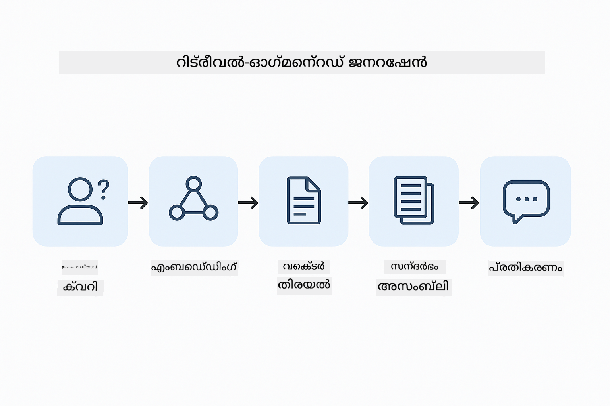
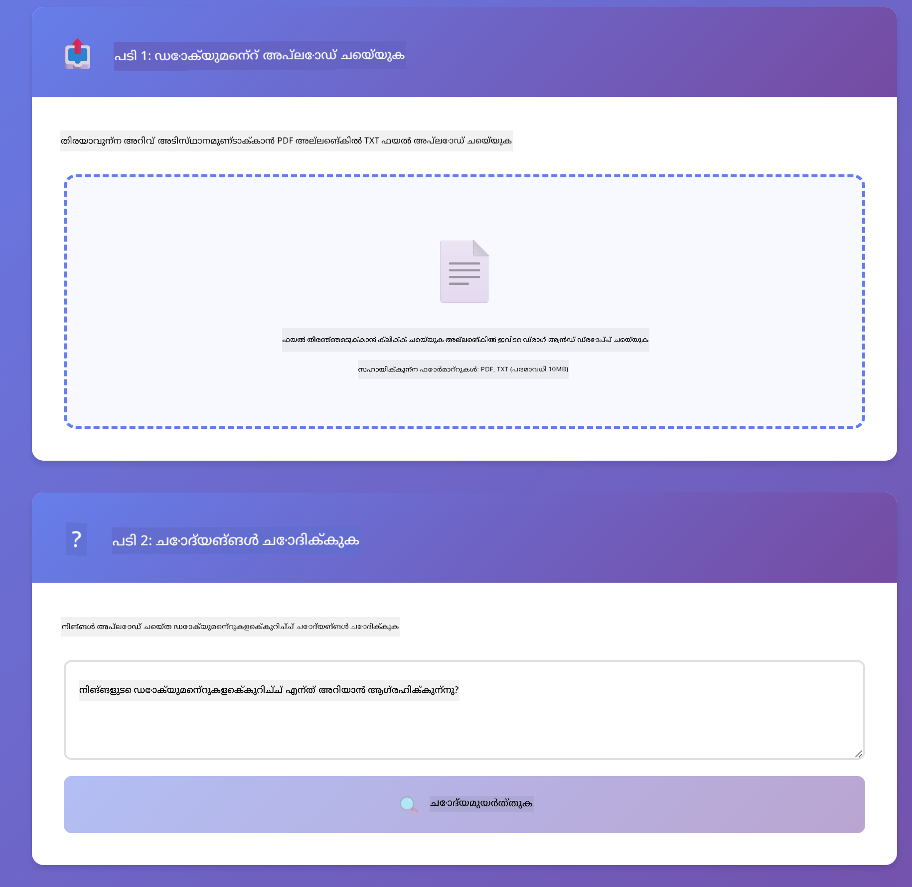

<!--
CO_OP_TRANSLATOR_METADATA:
{
  "original_hash": "f538a51cfd13147d40d84e936a0f485c",
  "translation_date": "2025-12-13T17:32:18+00:00",
  "source_file": "03-rag/README.md",
  "language_code": "ml"
}
-->
# Module 03: RAG (Retrieval-Augmented Generation)

## Table of Contents

- [നിങ്ങൾ പഠിക്കാനിരിക്കുന്നതെന്ത്](../../../03-rag)
- [ആവശ്യമായ മുൻപരിചയം](../../../03-rag)
- [RAG മനസ്സിലാക്കുക](../../../03-rag)
- [എങ്ങനെ പ്രവർത്തിക്കുന്നു](../../../03-rag)
  - [ഡോക്യുമെന്റ് പ്രോസസ്സിംഗ്](../../../03-rag)
  - [എംബെഡ്ഡിംഗുകൾ സൃഷ്ടിക്കൽ](../../../03-rag)
  - [സെമാന്റിക് സെർച്ച്](../../../03-rag)
  - [ഉത്തരം സൃഷ്ടിക്കൽ](../../../03-rag)
- [അപ്ലിക്കേഷൻ പ്രവർത്തിപ്പിക്കുക](../../../03-rag)
- [അപ്ലിക്കേഷൻ ഉപയോഗിക്കൽ](../../../03-rag)
  - [ഡോക്യുമെന്റ് അപ്‌ലോഡ് ചെയ്യുക](../../../03-rag)
  - [ചോദ്യങ്ങൾ ചോദിക്കുക](../../../03-rag)
  - [സ്രോതസ്സ് റഫറൻസുകൾ പരിശോധിക്കുക](../../../03-rag)
  - [ചോദ്യങ്ങളുമായി പരീക്ഷണം നടത്തുക](../../../03-rag)
- [പ്രധാന ആശയങ്ങൾ](../../../03-rag)
  - [ചങ്കിംഗ് തന്ത്രം](../../../03-rag)
  - [സാദൃശ്യ സ്കോറുകൾ](../../../03-rag)
  - [ഇൻ-മെമ്മറി സ്റ്റോറേജ്](../../../03-rag)
  - [കോൺടെക്സ്റ്റ് വിൻഡോ മാനേജ്മെന്റ്](../../../03-rag)
- [എപ്പോൾ RAG പ്രാധാന്യമുള്ളത്](../../../03-rag)
- [അടുത്ത ഘട്ടങ്ങൾ](../../../03-rag)

## What You'll Learn

മുൻ മോഡ്യൂളുകളിൽ, നിങ്ങൾ എഐയുമായി സംഭാഷണം നടത്താനും നിങ്ങളുടെ പ്രോംപ്റ്റുകൾ ഫലപ്രദമായി ഘടിപ്പിക്കാനും പഠിച്ചു. എന്നാൽ ഒരു അടിസ്ഥാനപരമായ പരിമിതിയുണ്ട്: ഭാഷാ മോഡലുകൾ പരിശീലന സമയത്ത് പഠിച്ചതേ മാത്രം അറിയുന്നു. നിങ്ങളുടെ കമ്പനിയുടെ നയങ്ങൾ, നിങ്ങളുടെ പ്രോജക്ട് ഡോക്യുമെന്റേഷൻ, അല്ലെങ്കിൽ അവർ പരിശീലനം ലഭിക്കാത്ത ഏതെങ്കിലും വിവരങ്ങൾക്കുറിച്ച് അവർക്ക് ചോദ്യങ്ങൾക്ക് ഉത്തരം നൽകാൻ കഴിയില്ല.

RAG (Retrieval-Augmented Generation) ഈ പ്രശ്നം പരിഹരിക്കുന്നു. മോഡലിന് നിങ്ങളുടെ വിവരങ്ങൾ പഠിപ്പിക്കാൻ ശ്രമിക്കുന്നതിനുപകരം (അത് ചെലവേറിയതും പ്രായോഗികമല്ലാത്തതും ആണ്), നിങ്ങൾക്ക് അത് നിങ്ങളുടെ ഡോക്യുമെന്റുകൾ വഴി തിരയാനുള്ള കഴിവ് നൽകുന്നു. ആരെങ്കിലും ഒരു ചോദ്യമുയർത്തുമ്പോൾ, സിസ്റ്റം ബന്ധപ്പെട്ട വിവരങ്ങൾ കണ്ടെത്തി പ്രോംപ്റ്റിൽ ഉൾപ്പെടുത്തുന്നു. മോഡൽ പിന്നീട് ആ തിരഞ്ഞെടുത്ത കോൺടെക്സ്റ്റിന്റെ അടിസ്ഥാനത്തിൽ ഉത്തരം നൽകുന്നു.

RAG-നെ മോഡലിന് ഒരു റഫറൻസ് ലൈബ്രറി നൽകുന്നതായി കരുതുക. നിങ്ങൾ ഒരു ചോദ്യമുയർത്തുമ്പോൾ, സിസ്റ്റം:

1. **ഉപയോക്തൃ ചോദ്യം** - നിങ്ങൾ ഒരു ചോദ്യമുയർത്തുന്നു  
2. **എംബെഡ്ഡിംഗ്** - നിങ്ങളുടെ ചോദ്യത്തെ ഒരു വെക്ടറിലേക്ക് മാറ്റുന്നു  
3. **വെക്ടർ സെർച്ച്** - സമാനമായ ഡോക്യുമെന്റ് ചങ്കുകൾ കണ്ടെത്തുന്നു  
4. **കോൺടെക്സ്റ്റ് അസംബ്ലി** - ബന്ധപ്പെട്ട ചങ്കുകൾ പ്രോംപ്റ്റിൽ ചേർക്കുന്നു  
5. **പ്രതികരണം** - LLM ആ കോൺടെക്സ്റ്റിന്റെ അടിസ്ഥാനത്തിൽ ഉത്തരം സൃഷ്ടിക്കുന്നു  

ഇത് മോഡലിന്റെ പ്രതികരണങ്ങളെ അതിന്റെ പരിശീലന അറിവിൽ അല്ല, നിങ്ങളുടെ യഥാർത്ഥ ഡാറ്റയിൽ ആധാരമാക്കുന്നു.



*RAG പ്രവൃത്തി പ്രക്രിയ - ഉപയോക്തൃ ചോദ്യം മുതൽ സെമാന്റിക് സെർച്ച് വഴി കോൺടെക്സ്ച്വൽ ഉത്തരം സൃഷ്ടിക്കൽ വരെ*

## Prerequisites

- Module 01 പൂർത്തിയാക്കിയിട്ടുണ്ട് (Azure OpenAI റിസോഴ്‌സുകൾ വിന്യസിച്ചിരിക്കുന്നു)  
- റൂട്ട് ഡയറക്ടറിയിൽ `.env` ഫയൽ Azure ക്രെഡൻഷ്യലുകളോടെ (Module 01-ൽ `azd up` ഉപയോഗിച്ച് സൃഷ്ടിച്ചത്)  

> **കുറിപ്പ്:** Module 01 പൂർത്തിയാക്കിയിട്ടില്ലെങ്കിൽ, ആദ്യം അവിടെ നൽകിയ വിന്യാസ നിർദ്ദേശങ്ങൾ പിന്തുടരുക.

## How It Works

**ഡോക്യുമെന്റ് പ്രോസസ്സിംഗ്** - [DocumentService.java](../../../03-rag/src/main/java/com/example/langchain4j/rag/service/DocumentService.java)

നിങ്ങൾ ഒരു ഡോക്യുമെന്റ് അപ്‌ലോഡ് ചെയ്യുമ്പോൾ, സിസ്റ്റം അത് ചങ്കുകളായി വിഭജിക്കുന്നു - മോഡലിന്റെ കോൺടെക്സ്റ്റ് വിൻഡോയിൽ സൗകര്യപ്രദമായി ഫിറ്റ് ആകുന്ന ചെറിയ ഭാഗങ്ങൾ. ഈ ചങ്കുകൾ ചെറിയ തോതിൽ ഒതുക്കിയിരിക്കുന്നു, അതിലൂടെ അതിർത്തികളിൽ കോൺടെക്സ്റ്റ് നഷ്ടപ്പെടുന്നത് ഒഴിവാക്കുന്നു.

```java
Document document = FileSystemDocumentLoader.loadDocument("sample-document.txt");

DocumentSplitter splitter = DocumentSplitters
    .recursive(300, 30, new OpenAiTokenizer());

List<TextSegment> segments = splitter.split(document);
```

> **🤖 [GitHub Copilot](https://github.com/features/copilot) ചാറ്റ് ഉപയോഗിച്ച് ശ്രമിക്കുക:** [`DocumentService.java`](../../../03-rag/src/main/java/com/example/langchain4j/rag/service/DocumentService.java) തുറന്ന് ചോദിക്കുക:  
> - "LangChain4j ഡോക്യുമെന്റുകൾ എങ്ങനെ ചങ്കുകളായി വിഭജിക്കുന്നു, ഒതുക്കം എന്തുകൊണ്ട് പ്രധാനമാണ്?"  
> - "വിവിധ ഡോക്യുമെന്റ് തരംകൾക്കുള്ള ഏറ്റവും അനുയോജ്യമായ ചങ്ക് വലുപ്പം എന്താണ്, എന്തുകൊണ്ട്?"  
> - "പല ഭാഷകളിലുള്ള ഡോക്യുമെന്റുകൾ അല്ലെങ്കിൽ പ്രത്യേക ഫോർമാറ്റിംഗ് ഉള്ളവ എങ്ങനെ കൈകാര്യം ചെയ്യാം?"

**എംബെഡ്ഡിംഗുകൾ സൃഷ്ടിക്കൽ** - [LangChainRagConfig.java](../../../03-rag/src/main/java/com/example/langchain4j/rag/config/LangChainRagConfig.java)

ഓരോ ചങ്കും ഒരു സംഖ്യാത്മക പ്രതിനിധാനമായ എംബെഡ്ഡിങ്ങായി മാറ്റപ്പെടുന്നു - ഇത് വാചകത്തിന്റെ അർത്ഥം പിടിച്ചുപറ്റുന്ന ഗണിതീയ ഫിംഗർപ്രിന്റ് പോലെയാണ്. സമാനമായ വാചകങ്ങൾ സമാനമായ എംബെഡ്ഡിങ്ങുകൾ സൃഷ്ടിക്കുന്നു.

```java
@Bean
public EmbeddingModel embeddingModel() {
    return OpenAiOfficialEmbeddingModel.builder()
        .baseUrl(azureOpenAiEndpoint)
        .apiKey(azureOpenAiKey)
        .modelName(azureEmbeddingDeploymentName)
        .build();
}

EmbeddingStore<TextSegment> embeddingStore = 
    new InMemoryEmbeddingStore<>();
```


*എംബെഡ്ഡിംഗ് സ്‌പേസിൽ വെക്ടറുകളായി പ്രതിനിധീകരിച്ച ഡോക്യുമെന്റുകൾ - സമാന ഉള്ളടക്കം കൂട്ടമായി കാണപ്പെടുന്നു*

**സെമാന്റിക് സെർച്ച്** - [RagService.java](../../../03-rag/src/main/java/com/example/langchain4j/rag/service/RagService.java)

നിങ്ങൾ ഒരു ചോദ്യമുയർത്തുമ്പോൾ, നിങ്ങളുടെ ചോദ്യവും ഒരു എംബെഡ്ഡിങ്ങായി മാറുന്നു. സിസ്റ്റം നിങ്ങളുടെ ചോദ്യത്തിന്റെ എംബെഡ്ഡിങ്ങിനെ എല്ലാ ഡോക്യുമെന്റ് ചങ്കുകളുടെ എംബെഡ്ഡിങ്ങുകളുമായി താരതമ്യം ചെയ്യുന്നു. ഏറ്റവും സമാനമായ അർത്ഥമുള്ള ചങ്കുകൾ കണ്ടെത്തുന്നു - വെറും കീവേഡുകൾ പൊരുത്തപ്പെടുന്നത് മാത്രമല്ല, യഥാർത്ഥ സെമാന്റിക് സാദൃശ്യമാണ്.

```java
Embedding queryEmbedding = embeddingModel.embed(question).content();

List<EmbeddingMatch<TextSegment>> matches = 
    embeddingStore.findRelevant(queryEmbedding, 5, 0.7);

for (EmbeddingMatch<TextSegment> match : matches) {
    String relevantText = match.embedded().text();
    double score = match.score();
}
```

> **🤖 [GitHub Copilot](https://github.com/features/copilot) ചാറ്റ് ഉപയോഗിച്ച് ശ്രമിക്കുക:** [`RagService.java`](../../../03-rag/src/main/java/com/example/langchain4j/rag/service/RagService.java) തുറന്ന് ചോദിക്കുക:  
> - "എംബെഡ്ഡിങ്ങുകളുമായി സാദൃശ്യ സെർച്ച് എങ്ങനെ പ്രവർത്തിക്കുന്നു, സ്കോർ എന്തുകൊണ്ട് നിർണ്ണയിക്കുന്നു?"  
> - "എന്ത് സാദൃശ്യ പരിധി ഉപയോഗിക്കണം, അത് ഫലങ്ങളെ എങ്ങനെ ബാധിക്കുന്നു?"  
> - "സംബന്ധപ്പെട്ട ഡോക്യുമെന്റുകൾ കണ്ടെത്താനാകാത്ത സാഹചര്യങ്ങൾ എങ്ങനെ കൈകാര്യം ചെയ്യാം?"

**ഉത്തരം സൃഷ്ടിക്കൽ** - [RagService.java](../../../03-rag/src/main/java/com/example/langchain4j/rag/service/RagService.java)

ഏറ്റവും ബന്ധപ്പെട്ട ചങ്കുകൾ മോഡലിന് പ്രോംപ്റ്റിൽ ഉൾപ്പെടുത്തുന്നു. മോഡൽ ആ പ്രത്യേക ചങ്കുകൾ വായിച്ച് ആ വിവരത്തിന്റെ അടിസ്ഥാനത്തിൽ നിങ്ങളുടെ ചോദ്യത്തിന് ഉത്തരം നൽകുന്നു. ഇത് ഹല്യൂസിനേഷൻ തടയുന്നു - മോഡൽ മുന്നിൽ ഉള്ളതിൽ നിന്നേ മാത്രം ഉത്തരം നൽകാൻ കഴിയും.

## Run the Application

**വിന്യാസം സ്ഥിരീകരിക്കുക:**

റൂട്ട് ഡയറക്ടറിയിൽ `.env` ഫയൽ Azure ക്രെഡൻഷ്യലുകളോടെ ഉണ്ടെന്ന് ഉറപ്പാക്കുക (Module 01-ൽ സൃഷ്ടിച്ചത്):  
```bash
cat ../.env  # AZURE_OPENAI_ENDPOINT, API_KEY, DEPLOYMENT കാണിക്കണം
```
  
**അപ്ലിക്കേഷൻ ആരംഭിക്കുക:**

> **കുറിപ്പ്:** Module 01-ൽ നിന്നുള്ള `./start-all.sh` ഉപയോഗിച്ച് നിങ്ങൾ ഇതിനകം എല്ലാ അപ്ലിക്കേഷനുകളും ആരംഭിച്ചിട്ടുണ്ടെങ്കിൽ, ഈ മോഡ്യൂൾ 8081 പോർട്ടിൽ പ്രവർത്തിക്കുകയാണ്. താഴെ കൊടുത്തിരിക്കുന്ന സ്റ്റാർട്ട് കമാൻഡുകൾ ഒഴിവാക്കി നേരിട്ട് http://localhost:8081 സന്ദർശിക്കാം.

**ഓപ്ഷൻ 1: Spring Boot ഡാഷ്ബോർഡ് ഉപയോഗിച്ച് (VS Code ഉപയോക്താക്കൾക്ക് ശുപാർശ)**

ഡെവ് കണ്ടെയ്‌നറിൽ Spring Boot ഡാഷ്ബോർഡ് എക്സ്റ്റൻഷൻ ഉൾപ്പെടുത്തിയിട്ടുണ്ട്, ഇത് എല്ലാ Spring Boot അപ്ലിക്കേഷനുകളും ദൃശ്യമായി നിയന്ത്രിക്കാൻ സഹായിക്കുന്നു. ഇത് VS Code-യുടെ ഇടത് ഭാഗത്തുള്ള ആക്ടിവിറ്റി ബാറിൽ (Spring Boot ഐക്കൺ കാണുക) ലഭ്യമാണ്.

Spring Boot ഡാഷ്ബോർഡിൽ നിന്ന് നിങ്ങൾക്ക്:  
- വർക്ക്‌സ്പേസിലെ എല്ലാ Spring Boot അപ്ലിക്കേഷനുകളും കാണാം  
- ഒറ്റ ക്ലിക്കിൽ അപ്ലിക്കേഷനുകൾ ആരംഭിക്കാനും നിർത്താനും കഴിയും  
- അപ്ലിക്കേഷൻ ലോഗുകൾ റിയൽ-ടൈമിൽ കാണാം  
- അപ്ലിക്കേഷൻ നില നിരീക്ഷിക്കാം  

"rag" എന്നതിന് അടുത്തുള്ള പ്ലേ ബട്ടൺ ക്ലിക്കുചെയ്ത് ഈ മോഡ്യൂൾ ആരംഭിക്കാം, അല്ലെങ്കിൽ എല്ലാ മോഡ്യൂളുകളും ഒരുമിച്ച് ആരംഭിക്കാം.


**ഓപ്ഷൻ 2: ഷെൽ സ്ക്രിപ്റ്റുകൾ ഉപയോഗിച്ച്**

എല്ലാ വെബ് അപ്ലിക്കേഷനുകളും (മോഡ്യൂളുകൾ 01-04) ആരംഭിക്കുക:

**Bash:**  
```bash
cd ..  # റൂട്ട് ഡയറക്ടറിയിൽ നിന്ന്
./start-all.sh
```
  
**PowerShell:**  
```powershell
cd ..  # റൂട്ട് ഡയറക്ടറിയിൽ നിന്ന്
.\start-all.ps1
```
  
അല്ലെങ്കിൽ ഈ മോഡ്യൂളും മാത്രം ആരംഭിക്കുക:

**Bash:**  
```bash
cd 03-rag
./start.sh
```
  
**PowerShell:**  
```powershell
cd 03-rag
.\start.ps1
```
  
രണ്ടു സ്ക്രിപ്റ്റുകളും സ്വയം റൂട്ട് `.env` ഫയലിൽ നിന്നുള്ള പരിസ്ഥിതി വ്യത്യാസങ്ങൾ ലോഡ് ചെയ്യുകയും, JAR ഫയലുകൾ ഇല്ലെങ്കിൽ നിർമ്മിക്കുകയും ചെയ്യും.

> **കുറിപ്പ്:** നിങ്ങൾക്ക് എല്ലാ മോഡ്യൂളുകളും കൈമാറി നിർമ്മിച്ച് ശേഷം ആരംഭിക്കാനാഗ്രഹമുണ്ടെങ്കിൽ:  
>  
> **Bash:**  
> ```bash
> cd ..  # Go to root directory
> mvn clean package -DskipTests
> ```
  
> **PowerShell:**  
> ```powershell
> cd ..  # Go to root directory
> mvn clean package -DskipTests
> ```
  
ബ്രൗസറിൽ http://localhost:8081 തുറക്കുക.

**നിർത്താൻ:**

**Bash:**  
```bash
./stop.sh  # ഈ മോഡ്യൂൾ മാത്രം
# അല്ലെങ്കിൽ
cd .. && ./stop-all.sh  # എല്ലാ മോഡ്യൂളുകളും
```
  
**PowerShell:**  
```powershell
.\stop.ps1  # ഈ മോഡ്യൂൾ മാത്രം
# അല്ലെങ്കിൽ
cd ..; .\stop-all.ps1  # എല്ലാ മോഡ്യൂളുകളും
```


## Using the Application

അപ്ലിക്കേഷൻ ഡോക്യുമെന്റ് അപ്‌ലോഡ് ചെയ്യാനും ചോദ്യങ്ങൾ ചോദിക്കാനും വെബ് ഇന്റർഫേസ് നൽകുന്നു.

<a href="images/rag-homepage.png"></a>

*RAG അപ്ലിക്കേഷൻ ഇന്റർഫേസ് - ഡോക്യുമെന്റുകൾ അപ്‌ലോഡ് ചെയ്ത് ചോദ്യങ്ങൾ ചോദിക്കുക*

**ഡോക്യുമെന്റ് അപ്‌ലോഡ് ചെയ്യുക**

ടെസ്റ്റ് ചെയ്യാൻ TXT ഫയലുകൾ ഏറ്റവും അനുയോജ്യമാണ്. ഈ ഡയറക്ടറിയിൽ `sample-document.txt` ഫയൽ നൽകിയിട്ടുണ്ട്, ഇതിൽ LangChain4j ഫീച്ചറുകൾ, RAG നടപ്പാക്കൽ, മികച്ച പ്രാക്ടീസുകൾ എന്നിവയെക്കുറിച്ചുള്ള വിവരങ്ങൾ അടങ്ങിയിരിക്കുന്നു - സിസ്റ്റം പരീക്ഷിക്കാൻ പറ്റിയതാണ്.

സിസ്റ്റം നിങ്ങളുടെ ഡോക്യുമെന്റ് പ്രോസസ്സ് ചെയ്ത്, ചങ്കുകളായി വിഭജിച്ച്, ഓരോ ചങ്കിനും എംബെഡ്ഡിങ്ങുകൾ സൃഷ്ടിക്കുന്നു. ഇത് നിങ്ങൾ അപ്‌ലോഡ് ചെയ്തപ്പോൾ തന്നെ സ്വയം നടക്കുന്നു.

**ചോദ്യങ്ങൾ ചോദിക്കുക**

ഇപ്പോൾ ഡോക്യുമെന്റ് ഉള്ളടക്കത്തെക്കുറിച്ച് പ്രത്യേക ചോദ്യങ്ങൾ ചോദിക്കുക. ഡോക്യുമെന്റിൽ വ്യക്തമായി പറയപ്പെട്ട യാഥാർത്ഥ്യങ്ങൾ പരീക്ഷിക്കുക. സിസ്റ്റം ബന്ധപ്പെട്ട ചങ്കുകൾ തിരഞ്ഞ് പ്രോംപ്റ്റിൽ ഉൾപ്പെടുത്തി ഉത്തരം സൃഷ്ടിക്കും.

**സ്രോതസ്സ് റഫറൻസുകൾ പരിശോധിക്കുക**

ഓരോ ഉത്തരം സ്രോതസ്സ് റഫറൻസുകളോടുകൂടി കാണിക്കുന്നു, അവയിൽ സാദൃശ്യ സ്കോറുകളും ഉൾപ്പെടുന്നു. ഈ സ്കോറുകൾ (0 മുതൽ 1 വരെ) ചോദ്യത്തിന് ഓരോ ചങ്കും എത്രത്തോളം ബന്ധപ്പെട്ടതാണെന്ന് കാണിക്കുന്നു. ഉയർന്ന സ്കോർ നല്ല പൊരുത്തം സൂചിപ്പിക്കുന്നു. ഇത് ഉത്തരം സ്രോതസ്സ് മെറ്റീരിയലുമായി താരതമ്യം ചെയ്യാൻ സഹായിക്കുന്നു.

<a href="images/rag-query-results.png"></a>

*ചോദ്യ ഫലങ്ങൾ - ഉത്തരം, സ്രോതസ്സ് റഫറൻസുകൾ, പ്രസക്തി സ്കോറുകൾ*

**ചോദ്യങ്ങളുമായി പരീക്ഷണം നടത്തുക**

വിവിധ തരം ചോദ്യങ്ങൾ പരീക്ഷിക്കുക:  
- പ്രത്യേക യാഥാർത്ഥ്യങ്ങൾ: "പ്രധാന വിഷയം എന്താണ്?"  
- താരതമ്യങ്ങൾ: "X-നും Y-നും ഇടയിലുള്ള വ്യത്യാസം എന്താണ്?"  
- സംഗ്രഹങ്ങൾ: "Z-യെക്കുറിച്ചുള്ള പ്രധാന പോയിന്റുകൾ സംഗ്രഹിക്കുക"  

നിങ്ങളുടെ ചോദ്യവും ഡോക്യുമെന്റ് ഉള്ളടക്കവും എത്രത്തോളം പൊരുത്തപ്പെടുന്നുവെന്ന് അടിസ്ഥാനമാക്കി പ്രസക്തി സ്കോറുകൾ എങ്ങനെ മാറുന്നു എന്ന് ശ്രദ്ധിക്കുക.

## Key Concepts

**ചങ്കിംഗ് തന്ത്രം**

ഡോക്യുമെന്റുകൾ 300-ടോക്കൺ ചങ്കുകളായി വിഭജിക്കുന്നു, 30 ടോക്കൺ ഒതുക്കത്തോടെ. ഈ സമതുലനം ഓരോ ചങ്കിനും അർത്ഥവത്തായ കോൺടെക്സ്റ്റ് നൽകുകയും, പ്രോംപ്റ്റിൽ പല ചങ്കുകളും ഉൾപ്പെടുത്താൻ ചെറിയ വലുപ്പം ഉറപ്പാക്കുകയും ചെയ്യുന്നു.

**സാദൃശ്യ സ്കോറുകൾ**

സ്കോറുകൾ 0 മുതൽ 1 വരെ:  
- 0.7-1.0: വളരെ പ്രസക്തം, കൃത്യമായ പൊരുത്തം  
- 0.5-0.7: പ്രസക്തം, നല്ല കോൺടെക്സ്റ്റ്  
- 0.5-ൽ താഴെ: ഫിൽട്ടർ ചെയ്തിരിക്കുന്നു, വളരെ വ്യത്യസ്തം  

ഗുണമേന്മ ഉറപ്പാക്കാൻ സിസ്റ്റം കുറഞ്ഞ പരിധിക്കു മുകളിൽ ഉള്ള ചങ്കുകൾ മാത്രമേ തിരഞ്ഞെടുത്തുള്ളൂ.

**ഇൻ-മെമ്മറി സ്റ്റോറേജ്**

ഈ മോഡ്യൂൾ ലളിതത്വത്തിനായി ഇൻ-മെമ്മറി സ്റ്റോറേജ് ഉപയോഗിക്കുന്നു. അപ്ലിക്കേഷൻ റീസ്റ്റാർട്ട് ചെയ്താൽ അപ്‌ലോഡ് ചെയ്ത ഡോക്യുമെന്റുകൾ നഷ്ടപ്പെടും. പ്രൊഡക്ഷൻ സിസ്റ്റങ്ങൾ Qdrant അല്ലെങ്കിൽ Azure AI Search പോലുള്ള സ്ഥിരതയുള്ള വെക്ടർ ഡാറ്റാബേസുകൾ ഉപയോഗിക്കുന്നു.

**കോൺടെക്സ്റ്റ് വിൻഡോ മാനേജ്മെന്റ്**

ഓരോ മോഡലിനും പരമാവധി കോൺടെക്സ്റ്റ് വിൻഡോ ഉണ്ട്. വലിയ ഡോക്യുമെന്റിലെ എല്ലാ ചങ്കുകളും ഉൾപ്പെടുത്താൻ കഴിയില്ല. സിസ്റ്റം പരമാവധി N (ഡീഫോൾട്ട് 5) ഏറ്റവും പ്രസക്തമായ ചങ്കുകൾ തിരഞ്ഞെടുത്ത് പരിധിക്കുള്ളിൽ നിർത്തുന്നു, അതേസമയം കൃത്യമായ ഉത്തരം നൽകാൻ മതിയായ കോൺടെക്സ്റ്റ് നൽകുന്നു.

## When RAG Matters

**RAG ഉപയോഗിക്കുക:**
- സ്വകാര്യ ഡോക്യുമെന്റുകളെക്കുറിച്ചുള്ള ചോദ്യങ്ങൾക്ക് ഉത്തരം നൽകുമ്പോൾ  
- വിവരങ്ങൾ സ്ഥിരമായി മാറുമ്പോൾ (നയങ്ങൾ, വിലകൾ, സവിശേഷതകൾ)  
- കൃത്യതയ്ക്ക് സ്രോതസ്സ് സൂചിപ്പിക്കൽ ആവശ്യമായപ്പോൾ  
- ഉള്ളടക്കം ഒരു പ്രോംപ്റ്റിൽ ഉൾപ്പെടുത്താൻ വളരെ വലുതായിരിക്കുമ്പോൾ  
- പരിശോധിക്കാവുന്ന, യഥാർത്ഥ അടിസ്ഥാനമുള്ള പ്രതികരണങ്ങൾ ആവശ്യമുള്ളപ്പോൾ  

**RAG ഉപയോഗിക്കേണ്ടത് അല്ല:**
- മോഡലിന് മുമ്പേ അറിയാമായ പൊതുവായ അറിവ് ആവശ്യമായ ചോദ്യങ്ങൾ  
- റിയൽ-ടൈം ഡാറ്റ ആവശ്യമായപ്പോൾ (RAG അപ്‌ലോഡ് ചെയ്ത ഡോക്യുമെന്റുകളിൽ പ്രവർത്തിക്കുന്നു)  
- ഉള്ളടക്കം പ്രോംപ്റ്റിൽ നേരിട്ട് ഉൾപ്പെടുത്താൻ സാധിക്കുന്നത്ര ചെറുതായിരിക്കുമ്പോൾ  

## Next Steps

**അടുത്ത മോഡ്യൂൾ:** [04-tools - AI ഏജന്റുകൾ ടൂളുകളോടൊപ്പം](../04-tools/README.md)

---

**നാവിഗേഷൻ:** [← മുൻപ്: Module 02 - പ്രോംപ്റ്റ് എഞ്ചിനീയറിംഗ്](../02-prompt-engineering/README.md) | [പ്രധാനത്തിലേക്ക് മടങ്ങുക](../README.md) | [അടുത്തത്: Module 04 - ടൂളുകൾ →](../04-tools/README.md)

---

<!-- CO-OP TRANSLATOR DISCLAIMER START -->
**അസൂയാ**:  
ഈ രേഖ AI വിവർത്തന സേവനം [Co-op Translator](https://github.com/Azure/co-op-translator) ഉപയോഗിച്ച് വിവർത്തനം ചെയ്തതാണ്. നാം കൃത്യതയ്ക്ക് ശ്രമിച്ചിട്ടുണ്ടെങ്കിലും, സ്വയം പ്രവർത്തിക്കുന്ന വിവർത്തനങ്ങളിൽ പിശകുകൾ അല്ലെങ്കിൽ തെറ്റുകൾ ഉണ്ടാകാമെന്ന് ദയവായി ശ്രദ്ധിക്കുക. അതിന്റെ മാതൃഭാഷയിലുള്ള യഥാർത്ഥ രേഖയാണ് പ്രാമാണികമായ ഉറവിടം എന്ന് പരിഗണിക്കേണ്ടതാണ്. നിർണായകമായ വിവരങ്ങൾക്ക്, പ്രൊഫഷണൽ മനുഷ്യ വിവർത്തനം ശുപാർശ ചെയ്യപ്പെടുന്നു. ഈ വിവർത്തനം ഉപയോഗിക്കുന്നതിൽ നിന്നുണ്ടാകുന്ന ഏതെങ്കിലും തെറ്റിദ്ധാരണകൾക്കോ തെറ്റായ വ്യാഖ്യാനങ്ങൾക്കോ ഞങ്ങൾ ഉത്തരവാദികളല്ല.
<!-- CO-OP TRANSLATOR DISCLAIMER END -->