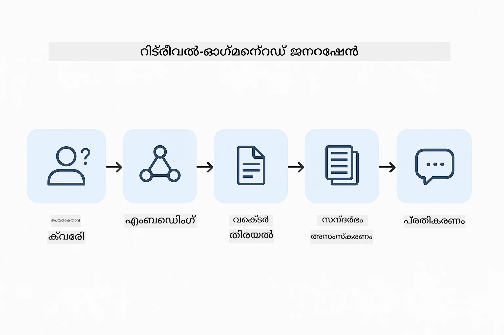
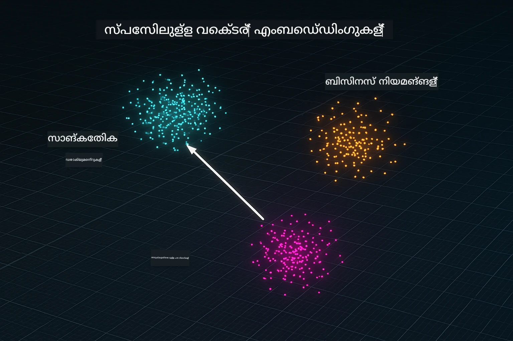
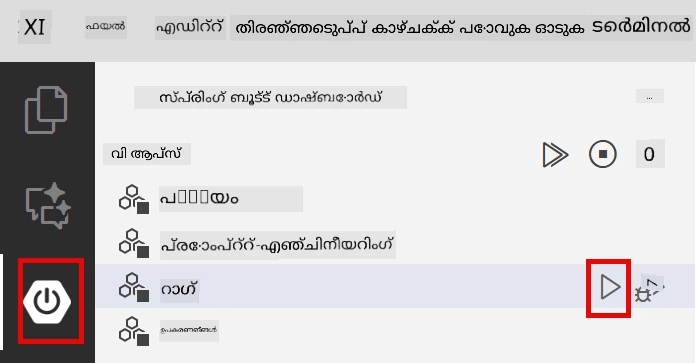
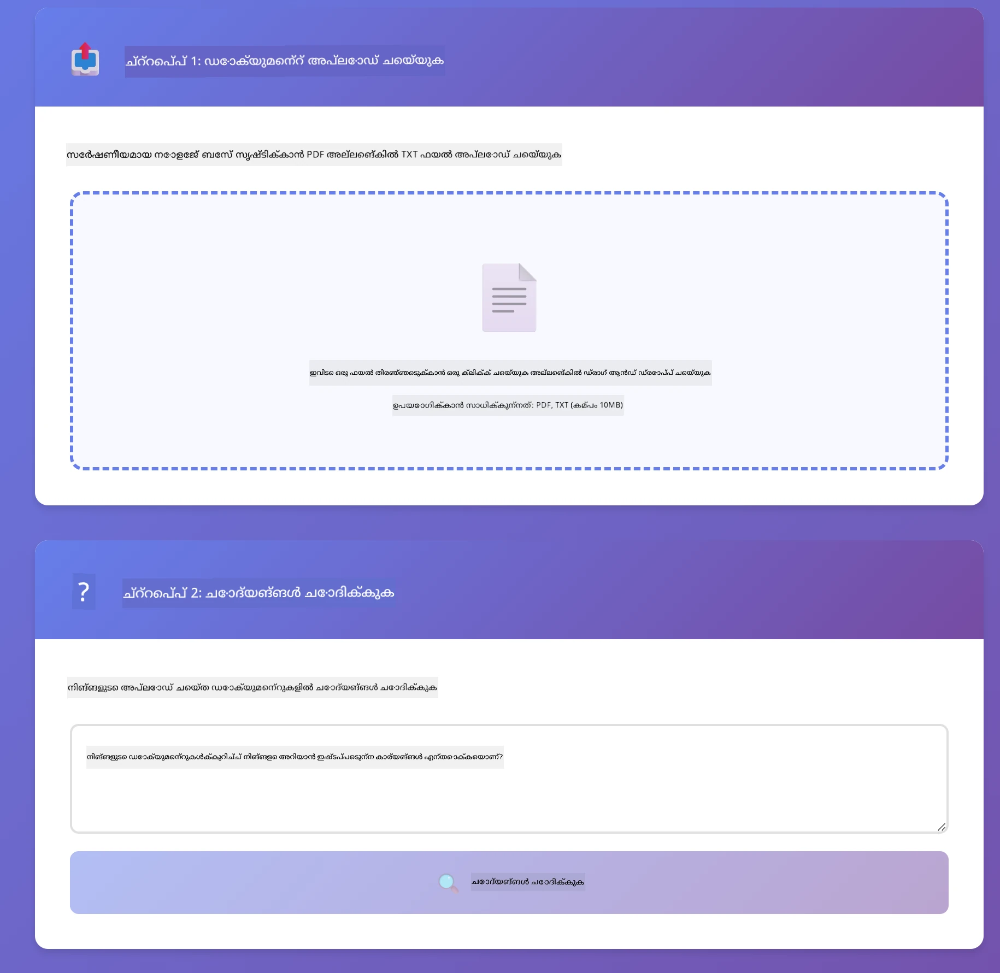
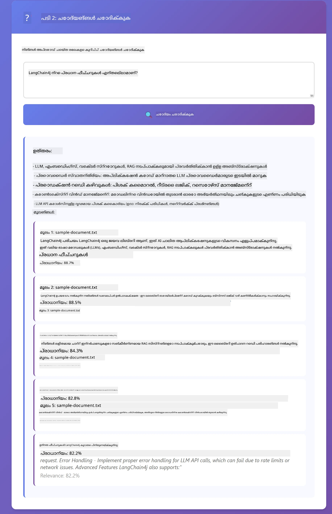

# Module 03: RAG (റിട്രീവൽ-ഓഗ്മെന്റഡ് ജനറേഷൻ)

## സൂചിക

- [വിഡിയോ വോക്‌ത്രൂ](#വിഡിയോ-വോക്‌ത്രൂ)
- [നീ എന്തൊക്ക പഠിക്കുമെന്ന്](#നീ-എന്തൊക്ക-പഠിക്കുമെന്ന്)
- [പൂർവാവശ്യങ്ങൾ](#മുൻ‌ആവശ്യകതകൾ)
- [RAG മനസ്സിലാക്കൽ](#rag-മനസ്സിലാക്കൽ)
  - [ഈ ടൂട്ടോറിയൽ ഉപയോഗിക്കുന്നത് ഏത് RAG സമീപനമാണ്?](#ഈ-ടൂട്ടോറിയൽ-ഉപയോഗിക്കുന്നത്-ഏത്-rag-സമീപനമാണ്)
- [ഇത് എങ്ങനെ പ്രവർത്തിക്കുന്നു](#ഇത്-എങ്ങനെ-പ്രവർത്തിക്കുന്നു)
  - [ഡോക്യുമെന്റ് പ്രോസസ്സ് ചെയ്യൽ](#ഡോക്യുമെന്റ്-പ്രോസസ്സ്-ചെയ്യൽ)
  - [എംബെഡ്ഡിംഗുകൾ സൃഷ്ടിക്കൽ](#എംബെഡ്ഡിംഗുകൾ-സൃഷ്ടിക്കൽ)
  - [സെമാന്റിക് തിരയൽ](#സെമാന്റിക്-തിരയൽ)
  - [ഉത്തരം സൃഷ്ടിക്കൽ](#ഉത്തര-വികസനം)
- [ആപ്ലിക്കേഷൻ പ്രവർത്തിപ്പിക്കുക](#ആപ്ലിക്കേഷൻ-പ്രവർത്തിപ്പിക്കുക)
- [ആപ്ലിക്കേഷൻ ഉപയോഗിക്കൽ](#ആപ്ലിക്കേഷൻ-ഉപയോഗിക്കൽ)
  - [ഒരു ഡോക്യുമെന്റ് അപ്‌ലോഡ് ചെയ്യുക](#ഒരു-ഡോക്യുമെന്റ്-അപ്‌ലോഡ്-ചെയ്യുക)
  - [ചോദ്യങ്ങൾ ചോദിക്കുക](#ചോദ്യങ്ങൾ-ചോദിക്കുക)
  - [മൂല സ്രോത് റഫറൻസുകൾ പരിശോധിക്കുക](#ഉറവിട-സൂചനകൾ-പരിശോധിക്കുക)
  - [ചോദ്യങ്ങളുമായി പരീക്ഷണം നടത്തുക](#ചോദ്യങ്ങളോടു-പരീക്ഷണം-നടത്തുക)
- [പ്രധാന ആശയങ്ങൾ](#പ്രധാന-ആശയങ്ങൾ)
  - [ചങ്കിംഗ് സ്ട്രാറ്റജ PrizeX](#ഫക്സ്-ചെയ്യൽ-രീതി)
  - [സാദൃശ്യ സ്കോറുകൾ](#സാദൃശ്യമാനങ്ങൾ)
  - [ഇൻ-മെമ്മറി സ്റ്റോറേജ്](#ഇൻ-മെമ്മറി-സംഭരണം)
  - [കോൺടെക്സ്‌ട് വിൻഡോ മാനേജ്‌മെന്റ്](#പരിസര-വിൻഡോ-മാനേജ്‌മെന്റ്)
- [എപ്പോൾ RAG പ്രധാനമാണ്](#rag-നല്ലപ്പോൾ)
- [മുന്നോട്ടുള്ള ചുവടുകൾ](#അടുത്തപടി)

## വിഡിയോ വോക്‌ത്രൂ

ഈ മോഡ്യൂളുമായി എങ്ങനെ ആരംഭിക്കാമെന്നു വിശദീകരിക്കുന്ന ലൈവ് സെഷൻ കാണുക:

<a href="https://www.youtube.com/watch?v=_olq75ZH_eY"></a>

## നീ എന്തൊക്ക പഠിക്കുമെന്ന്

മുൻവിട്ട മോഡ്യൂളുകളിൽ, നീ എഐയുമായി സംവദിക്കുന്നത് എങ്ങനെ പ്രാഖ്യാതമാക്കുകയും പ്രോമ്പ്റ്റുകൾ ഫലപ്രദമായി ഘടിപ്പിക്കയും ചെയ്യുവാൻ പഠിച്ചു. പക്ഷെ ഒരു മൗലികമായ പരിമിതമാണ്: ഭാഷ മോഡലുകൾ തങ്ങളിലേക്ക് പരിശീലന സമയത്ത് നേടിയ അറിവുകൾ മാത്രമേ അറിയൂ. നിങ്ങളുടെ കമ്പനി നയങ്ങൾ, പ്രോജക്റ്റ് ഡോക്യുമെന്റേഷൻ, അല്ലെങ്കിൽ പരിശീലനത്തിൽ ഉൾപ്പെടുത്തിയിട്ടില്ലാത്ത വിവരങ്ങളെക്കുറിച്ച് അവർക്ക് ചോദ്യങ്ങൾക്ക് ഉത്തരം നൽകാൻ സാധിക്കില്ല.

RAG (റിട്രീവൽ-ഓഗ്മെന്റഡ് ജനറേഷൻ) ഈ പ്രശ്നം പരിഹരിക്കുന്നു. മോഡലിനോട് നിങ്ങളുടെ വിവരങ്ങൾ പഠിപ്പിക്കാൻ ശ്രമിക്കുന്നതിന് പകരം (അതുകൂടാതെ അതിവ്യയംമാകുകയും പ്രായോഗികമല്ലാതാകുകയും ചെയ്യും), നിങ്ങൾ മോഡലിന് നിങ്ങളുടെ ഡോക്യുമെന്റുകൾ തിരയാനുള്ള കഴിവ് നൽകുന്നു. ആരെങ്കിലും ചോദ്യം ചേർത്താൽ, സിസ്റ്റം ബന്ധപ്പെട്ട വിവരങ്ങൾ കണ്ടെത്തി പ്രോമ്പ്റ്റിൽ ഉൾപ്പെടുത്തുന്നു. പിന്നീട് മോഡൽ ആ റിട്ട്രീവുചെയ്‌ത കോൺടെക്റ്റ് അടിസ്ഥാനമാക്കി ഉത്തരം നൽകുന്നു.

RAG നെ മോഡലിന് ഒരു റഫറൻസ് ലൈബ്രറിയായി ധരിപ്പിക്കുക. നിങ്ങൾ ചോദ്യം ചേർക്കുമ്പോൾ സിസ്റ്റം:

1. **ഉപയോക്തൃ ചോദ്യങ്ങൾ** - നിങ്ങൾ ചോദ്യം ചേർക്കുന്നു  
2. **എംബെഡ്ഡിംഗ്** - നിങ്ങളുടെ ചോദ്യത്തെ വെക്ടറിലാക്കി മാറ്റുന്നു  
3. **വെക്ടർ തിരയൽ** - സമാന ഡോക്യുമെന്റ് ചങ്കുകൾ കണ്ടെത്തുന്നു  
4. **കോൺടെക്സ്‌ട് അസംബ്ലി** - ബന്ധപ്പെട്ട ചങ്കുകൾ പ്രോമ്പ്റ്റിൽ ചേർക്കുന്നു  
5. **പ്രതികരണം** - മോഡൽ കോൺടെക്റ്റ് അടിസ്ഥാനമാക്കി ഉത്തരം സൃഷ്ടിക്കുന്നു  

ഇത് മോഡലിന്റെ മറുപടികൾ പാരമ്പര്യ പരിശീലന അറിവിൽ ആശ്രയിക്കാതെ നിന്റെ യഥാർത്ഥ ഡാറ്റയിൽ ആസ്പദമാക്കുന്നു.

## മുൻ‌ആവശ്യകതകൾ

- പൂർത്തിയാക്കിയ [Module 01 - നിർദ്ദേശം](../01-introduction/README.md) (Azure OpenAI റിസോഴ്‌സുകൾ വിന്യസിച്ചിട്ടുണ്ട്, `text-embedding-3-small` എമ്പെഡ്ഡിംഗ് മോഡൽ ഉൾപ്പെടെ)  
- ആഴൂർ ക്രെഡൻഷ്യലുകൾ അടങ്ങിയ `.env` ഫയൽ റൂട്ടു ഡയറക്ടറിയിൽ (Module 01ൽ `azd up` കമാൻഡ് ഉപയോഗിച്ച് ഉണ്ടാക്കിയിരിക്കുന്നു)

> **കുറിപ്പ്:** Module 01 പൂർത്തിയാക്കിയിട്ടില്ലെങ്കിൽ əvvəl deployment നിർദ്ദേശങ്ങൾ അവിടെ തന്നെ പാലിക്കുക. `azd up` കമാൻഡ് GPT ചാറ്റ് മോഡലും ഈ മോഡ്യൂളിൽ ഉപയോഗിക്കുന്ന എമ്പെഡ്ഡിംഗ് മോഡലും വിതരണം ചെയ്യുന്നു.

## RAG മനസ്സിലാക്കൽ

താഴെ കാണുന്ന ഡിസൈഗ്രാം പ്രധാന ആശയം വ്യക്തമാക്കുന്നു: മോഡലിന്റെ പരിശീലന ഡാറ്റയിലേക്കു മാത്രമേ ആശ്രയിക്കുന്നുള്ളൂ എന്ന് പകരം, RAG നിങ്ങളുടെ ഡോക്യുമെന്റുകളുടെ റഫറൻസ് ലൈബ്രറി നൽകുന്നു അതിലൂടെ ഓരോ ഉത്തരം സൃഷ്ടിക്കുന്നതിന് മുമ്പായി പരിശോധിക്കാൻ.


*ഈ ഡിസൈഗ്രാം സ്റ്റാൻഡേർഡ് LLM (പഠന ഡാറ്റയിൽ നിന്ന് അനുമാനിക്കുന്നത്) യും RAG-ഉം പിന്തുണയുള്ള LLM (നിങ്ങളുടെ ഡോക്യുമെന്റുകൾ ആദ്യം പരിശോധിക്കുന്നത്) തമ്മിലുള്ള വ്യത്യാസം കാണിക്കുന്നു.*

ഇതാ മുഴുവൻ ഘടകങ്ങളുടെ എങ്ങനെ ബന്ധപ്പെട്ടിരിക്കുന്നു എന്നത്. ഒരു ഉപയോക്താവിന്റെ ചോദ്യത്തെ നാല് ഘട്ടങ്ങളിലൂടെ കടന്നുപോകുന്നു — എംബെഡ്ഡിംഗ്, വെക്ടർ തിരയൽ, കോൺടെക്സ്‌ട് അസംബ്ലി, ഉത്തരം സൃഷ്ടിക്കൽ — ഓരോന്നും മുന്‍ഗാമി ഘട്ടത്തെ അടിസ്ഥാനമാക്കിയുള്ളതാണ്:



*ഈ ഡിസൈഗ്രാം മുഴുവൻ RAG പൈപ്പ്ലൈൻ കാണിക്കുന്നു — ഉപയോക്തൃ ചോദ്യത്തെ എംബെഡ്ഡിംഗ്, വെക്ടർ തിരയൽ, കോൺടെക്സ്‌ട് അസംബ്ലി, ഉത്തരം സൃഷ്ടിക്കൽ വഴിയും കടന്നുപോകുന്നു.*

ഈ മോഡ്യൂളിൽ ശേഷിക്കുന്ന ഭാഗം ഓരോ ഘട്ടവും വിശദമായി പദതന്ത്രം കൊണ്ട് ഉളവാക്കുകയും നിങ്ങൾ പ്രവർത്തിപ്പിക്കാനും മാറ്റിസ്ഥാപിക്കാനും കഴിയുന്ന കോഡും ഉൾപ്പെടുന്നു.

### ഈ ടൂട്ടോറിയൽ ഉപയോഗിക്കുന്നത് ഏത് RAG സമീപനമാണ്?

LangChain4j RAG നടപ്പാക്കുന്നതിന് മൂന്ന് വഴികൾ വാഗ്ദാനം ചെയ്യുന്നു, ഓരോന്നും വ്യത്യസ്ത പരസ്യ നിലവാരങ്ങളുമായി. താഴെയുള്ള ഡിസൈഗ്രാം അവ താരതമ്യം ചെയ്യുന്നു:


*ഈ ഡിസൈഗ്രാം LangChain4j-യിലെ മൂന്ന് RAG സമീപനങ്ങളും — എസി, നേറ്റീവ്, അഡ്വാൻസ്ഡ് — അവയുടെ പ്രധാന ഘടകങ്ങളോടൊപ്പം ഏത് സാഹചര്യത്തിൽ ഉപയോഗിക്കണമെന്നും കാണിക്കുന്നു.*

| സമീപനം | Դաമയം | വ്യാപാരം |
|---|---|---|
| **എസി RAG** | എല്ലാം ഓട്ടോമാറ്റിക്കായി `AiServices` ഉം `ContentRetriever` ഉം വഴി കണക്ട് ചെയ്യുന്നു. ഒരു ഇന്റർഫേസ് അനോട്ടേറ്റ് ചെയ്യുന്നു, ഒരു റിട്ട്രീവർ ചേർക്കുന്നു, LangChain4j എംബെഡ്ഡിംഗ്, തിരയൽ, പ്രോമ്പ്റ്റ് അസംബ്ലി എന്നിവ പിന്നിൽ കൈകാര്യം ചെയ്യുന്നു. | കുറഞ്ഞ കോഡ്, പക്ഷെ ഓരോ ഘട്ടവും നിങ്ങൾക്ക് കാണാനില്ല. |
| **നേറ്റീവ് RAG** | നിങ്ങൾ സ്വയം എംബെഡ്ഡിംഗ് മോഡൽ വിളിച്ച്, സ്റ്റോർ തിരഞ്ഞ്, പ്രോമ്പ്റ്റ് നിർമ്മിച്ച്, ഉത്തരം സൃഷ്ടിക്കുന്നു — ഓരോ ഘട്ടവും വ്യക്തമായതും തത്സമയം. | കൂടുതൽ കോഡ്, പക്ഷെ ഓരോ ഘട്ടവും കാണാനും എഡിറ്റും ചെയ്യാനുമാകും. |
| **അഡ്വാൻസ്ഡ് RAG** | `RetrievalAugmentor` ഫ്രെയിംവർക്ക് ഉപയോഗിച്ച് പ്ലഗ്ഗബിൽ ക്വറി ട്രാൻസ്ഫോർമറുകൾ, റൂട്ടറുകൾ, റീ-റാങ്കറുകൾ, ഉള്ളടക്ക ഇൻജക്ടർമാർ എന്നിവ ഉപയോഗിച്ച് ഉത്പാദന നിലവാര പൈപ്പ്ലൈനുകൾ. | അതിവിശാലമായ സൗകര്യം, എന്നാൽ കൂടുതൽ സങ്കീർണ്ണത. |

**ഈ ടൂട്ടോറിയൽ നേറ്റീവ് സമീപനം മാത്രം ഉപയോഗിക്കുന്നു.** RAG പൈപ്പ്ലൈന്റെ ഓരോ ഘട്ടവും — ക്വറി എംബെഡ്ഡ് ചെയ്യൽ, വെക്ടർ സ്റ്റോർ തിരയൽ, കോൺടെക്സ്‌ട് അസംബ്ലി, ഉത്തരം സൃഷ്ടിക്കൽ — എല്ലാം [`RagService.java`](../../../03-rag/src/main/java/com/example/langchain4j/rag/service/RagService.java)ൽ വ്യക്തമായും വ്യക്തമായും എഴുതിയിട്ടുള്ളതാണ്. പഠന സഹായമായി ഇത് ഉദ്ദേശിച്ചിരിക്കുന്നു: കോഡ് കുറയ്ക്കുന്നതിനേക്കാൾ എല്ലാ ഘട്ടവും കാണാനും മനസ്സിലാക്കാനും ഇത് കൂടുതൽ സഹായകരമാണ്. ഘടകങ്ങൾ എങ്ങനെ ചേർന്നിരിക്കുന്നുവെന്ന് ഞുറുക്കം പറ്റിയാൽ, എസി RAG-ലോ അഡ്വാൻസ്ഡ് RAG-ലോ തിരിച്ച് പ്രവർത്തിക്കാം.

> **💡 എസി RAG-െ കുറിച്ച് അറിയാമോ?** LangChain4j-ൽ *Easy RAG* സമീപനവും ഉണ്ട്, ഇവിടെ `AiServices` ഉം `ContentRetriever` ഉം എംബെഡ്ഡിംഗും തിരയലും പ്രോമ്പ്റ്റ് നിർമാണവും സ്വയം കൈകാര്യം ചെയ്യുന്നു. ഈ മോഡ്യൂളിൽ നിങ്ങൾ ഓരോ ഘട്ടവും വ്യക്തമായി കാണാനും നിയന്ത്രിക്കാനും സാധിക്കുന്നതുകൊണ്ട് കൂടുതൽ വ്യക്തമായ മാർഗമാണ് സ്വീകരിച്ചിരിക്കുന്നത്.

താഴെയുള്ള ഡിസൈഗ്രാം എസി RAG പൈപ്പ്ലൈൻ കാണിക്കുന്നു. `AiServices` ഉം `EmbeddingStoreContentRetriever` ഉം സങ്കീർണ്ണത മുഴുവൻ മറച്ചുവെക്കുന്നു — നിങ്ങൾ ഒരു ഡോക്യുമെന്റ് ലോഡ് ചെയ്ത്, റിട്ട്രീവർ ചേർത്ത്, മറുപടികൾ നേടുന്നു. ഈ മോഡ്യൂളിലെ നേറ്റീവ് സമീപനം ആ മറച്ചിട്ട ഘട്ടങ്ങൾ പ്രത്യക്ഷപ്പെടുത്തുന്നു:


*ഈ ഡിസൈഗ്രാം എസി RAG പൈപ്പ്ലൈൻ കാണിക്കുന്നു. ഈ മോഡ്യൂളിൽ ഉപയോഗിക്കുന്ന നേറ്റീവ് സമീപനത്തോട് താരതമ്യം ചെയ്യുക: എസി RAG എമ്പെഡ്ഡിംഗ്, റിട്ട്രീവൽ, പ്രോമ്പ്റ്റ് അസംബ്ലി എന്നിവ `AiServices` ഉം `ContentRetriever` ഉം പിന്നിൽ മറകോണ്ട് നടത്തുന്നു — നിങ്ങൾ ഡോക്യുമെന്റ് ലോഡ് ചെയ്ത്, റിട്ട്രീവർ ചേർക്കുന്നു, മറുപടി നേടുന്നു. നേറ്റീവ് സമീപനം ആ പൈപ്പ്ലൈൻ തുറന്ന് എങ്കിൽ എഞ്ചീൻറെ ഓരോ ഘട്ടവും (എംബെഡ് ചെയ്‌തൽ, തിരയൽ, കോൺടെക്സ്‌ട് അസംബ്ലി, ജനറേറ്റ്) നിങ്ങൾ തന്നെ വിളിച്ചു നിയന്ത്രിക്കാനാകും.*

## ഇത് എങ്ങനെ പ്രവർത്തിക്കുന്നു

ഈ മോഡ്യൂളിലെ RAG പൈപ്പ്ലൈൻ ഓരോ തവണ ഉപയോക്താവ് ചോദ്യം ചേർത്താൽ തുടർന്നുള്ള നാല് ഘട്ടങ്ങളായി പ്രവർത്തിക്കുന്നു. ആദ്യം അപ്‌ലോഡ് ചെയ്ത ഡോക്യുമെന്റ് **പാർസ് ചെയ്ത് ചങ്കുകളായി വിഭജിക്കുന്നു** — മോഡലിന്റെ കോൺടെക്സ്‌ട് വിൻഡോയിൽ അധികം ചുരുങ്ങാതെ ഫിറ്റ് ആകുന്ന ചെറിയ തലകൾ. ആ ചങ്കുകൾ സമാനമായ ഭാഗങ്ങൾ പങ്കിടുന്നു അതിനാൽ കോൺടെക്സ്‌ട് അതിരുകളുടെ മുമ്പിലും പിന്നിലുമുള്ള പ്രശ്നങ്ങൾ ഒഴിവാക്കാൻ.

ശേഷം ആ ചങ്കുകൾ **വെക്ടർ എംബെഡ്ഡിംഗുകളായി** മാറ്റിവെച്ച് സൂക്ഷിക്കുന്നു, അതിനാൽ അവയെ ഗണിത രീതിയിൽ താരതമ്യം ചെയ്യാം. ചോദ്യം വന്നപ്പോൾ, സിസ്റ്റം **സെമാന്റിക് തിരയൽ** നടത്തി ഏറ്റവും അനുയോജ്യമായ ചങ്കുകൾ കണ്ടെത്തുകയും അവ LLM-ന് **ഉത്തരം സൃഷ്ടിക്കാൻ** കോൺടെക്സ്‌ട് ആയി നൽകുകയും ചെയ്യുന്നു. താഴെ ഓരോ ഘട്ടവും അവയുടെ കോഡും ഡിസൈഗ്രാമുകളുമായി വിശദീകരിക്കുന്നു. ആദ്യം ഡോക്യുമെന്റ് പ്രോസസിംഗ് നോട്ടമിടാം.

### ഡോക്യുമെന്റ് പ്രോസസ്സ് ചെയ്യൽ

[DocumentService.java](../../../03-rag/src/main/java/com/example/langchain4j/rag/service/DocumentService.java)

നീ ഒരു ഡോക്യുമെന്റ് അപ്‌ലോഡ് ചെയ്തപ്പോൾ, സിസ്റ്റം അതിനെ (PDF അല്ലെങ്കിൽ പ്ലെയിൻ ടെക്സ്റ്റ്) പാർസ് ചെയ്യുന്നു, ഫയൽനാമം പോലുള്ള മെറ്റാഡേറ്റാ ചേർക്കുന്നു, പിന്നെ ചങ്കുകളായി വിഭജിക്കുന്നു — മോഡലിന്റെ കോൺടെക്സ്‌ട് വിൻഡോയിലേക്ക് സുഖമായി പൊരുത്തപ്പെടുന്ന ചെറിയ കഷണങ്ങൾ. ഈ ചങ്കുകൾ തമ്മിൽ ചെറുതായി ഒവർലാപ്പ് ഉള്ളതാണ്, അതിനാൽ അതിരുകളിലെ കോൺടെക്സ്‌ട് നഷ്ടപ്പെടുന്നില്ല.

```java
// അപ്ലോഡ് ചെയ്ത ഫയൽ പാഴ്‌സ്ചെയ്യുകയും LangChain4j ഡോക്യുമെന്റായി മൂടുകയും ചെയ്യുക
Document document = Document.from(content, metadata);

// 30-ടോക്കൺ ഓവർലാപ്പോടെ 300-ടോക്കൺ കഷണങ്ങളായി വിഭജിക്കുക
DocumentSplitter splitter = DocumentSplitters
    .recursive(300, 30);

List<TextSegment> segments = splitter.split(document);
```

താഴെയുള്ള ഡിസൈഗ്രാം ഇത് ദൃശ്യമായി കാണിക്കുന്നു. ഓരോ ചങ്കും അവരുടെ അയൽവാസികളുമായി കുറച്ച് ടോക്കൺ പങ്കുവെക്കുന്നു — 30-ടോക്കൺ ഒവർലാപ്പ് മുഖേന കോണ്സെപ്റ്റ് അതിരുകളില്ലാതെ നിലനടക്കുന്നു:


*ഈ ഡിസൈഗ്രാം ഒരു ഡോക്യുമെന്റ് 300-ടോക്കൺ ചങ്കുകളായി 30-ടോക്കൺ ഒവർലാപ്പുമായി വിഭജിക്കുന്ന രീതിയും അത് കോണ്സെപ്റ്റ് അതിരുകൾ എങ്ങനെ സംരക്ഷിക്കുന്നു എന്നും കാണിക്കുന്നു.*

> **🤖 [GitHub Copilot](https://github.com/features/copilot) ചേര്‍ന്ന് പരീക്ഷിക്കാം:** [`DocumentService.java`](../../../03-rag/src/main/java/com/example/langchain4j/rag/service/DocumentService.java) തുറന്ന് ചോദിക്കുക:  
> - "LangChain4j ഡോക്യുമെന്റുകൾ ചങ്കുകളായി എങ്ങനെ വിഭജിക്കുന്നു, ഒവർലാപ്പ് എന്തുകൊണ്ട് പ്രധാനമാണ്?"  
> - "വിവിധ ഡോക്യുമെന്റ് തരംപ്രകാരം ഏറ്റവും അനുയോജ്യമായ ചങ്ക് വലുപ്പം എന്ത്, എന്തുകൊണ്ട്?"  
> - "പലഭാഷകളും പ്രത്യേക ഫോർമാറ്റിംഗും ഉള്ള ഡോക്യുമെന്റുകൾ എങ്ങനെ കൈകാര്യം ചെയ്യാം?"

### എംബെഡ്ഡിംഗുകൾ സൃഷ്ടിക്കൽ

[LangChainRagConfig.java](../../../03-rag/src/main/java/com/example/langchain4j/rag/config/LangChainRagConfig.java)

ഓരോ ചങ്കും എണ്ണം രൂപത്തിലുള്ള പ്രതിനിധാനത്തിലേക്ക് മാറ്റപ്പെടുന്നു, ഇത് "എംബെഡ്ഡിംഗ്" എന്ന് പറയും — അർത്ഥം നംબરുകളായി മാറ്റുന്ന ഒരു രൂപാന്തര രീതിയാണ്. ഈ എംബെഡ്ഡിംഗ് മോഡൽ ചാറ്റ് മോഡലിനെപ്പോലെ "ബുദ്ധിമടങ്ങിയ"തല്ല; ഇത് നിർദ്ദേശങ്ങൾ പാലിക്കുകയോ, കാരണം കാണിക്കുകയോ, ചോദ്യങ്ങൾക്ക് മറുപടി നൽകുകയോ ചെയ്യാൻ കഴിയില്ല. പകരം, ഈ ടൂൾ ടെക്സ്റ്റിനെ ഗണിത വാതിലിൽ മാറ്റുന്നു ഇങ്ങനെ സമാന അർത്ഥമുള്ള വാക്കുകൾ കണക്ക് കൂട്ടിക്കടുത്തുകൂടുന്നു — "കാർ" എന്ന വാക്കിനു "ഓട്ടോമൊബൈൽ" സമീപത്തായുള്ള സ്ഥാനം, "രീഫണ്ട് നയം" എന്ന പദം "പണം തിരിച്ചുകൊടുത്തിടലിന്റെ" അടുത്തിടം ഇങ്ങനെ. ചാറ്റ് മോഡൽ ഒരു സംവാദിയാണ്, എംബെഡ്ഡിംഗ് മോഡൽ അത്ഭുതകരമായ ഫയലിംഗ് സിസ്റ്റമാണ്.

താഴെയുള്ള ഡിസൈഗ്രാം ഈ ആശയം ദൃശ്യവൽക്കരിക്കുന്നു — ടെക്സ്റ്റ് പ്രവേശിക്കുന്നു, നമ്പർ ശ്രേണികൾ പുറത്തിറക്കുന്നു, സമാന അർത്ഥമുള്ള വാക്കുകൾ അടുത്തിലേയ്ക്ക് വെക്ടറുകൾ‌കെ സമീപിക്കുന്നു:


*ഈ ഡിസൈഗ്രാം ടെക്സ്റ്റ് എങ്ങനെ സംഖ്യാത്മക വെക്ടറുകളായി മാറ്റുന്നു എന്ന് കാണിക്കുന്നു — "കാർ" എന്നതും "ഓട്ടോമൊബൈൽ" എന്നും സമാന അർത്ഥങ്ങൾ അടുത്തു വെക്ടർ സ്പേസിൽ വരുന്നു.*

```java
@Bean
public EmbeddingModel embeddingModel() {
    return OpenAiOfficialEmbeddingModel.builder()
        .baseUrl(azureOpenAiEndpoint)
        .apiKey(azureOpenAiKey)
        .modelName(azureEmbeddingDeploymentName)
        .build();
}

EmbeddingStore<TextSegment> embeddingStore = 
    new InMemoryEmbeddingStore<>();
```

താഴെയുള്ള ക്ലാസ് ഡിസൈഗ്രാം RAG പൈപ്പ്ലൈനിലെ രണ്ട് വ്യത്യസ്ത പ്രവാഹങ്ങളും അവ റിപ്പോുള്ള LangChain4j ക്ലാസ്സുകളും കാണിക്കുന്നു.  
**ഇൻജെഷൻ പ്രവാഹം** (അപ്‌ലോഡ് സമയത്ത് ഒരു തവണ പ്രവർത്തിക്കുന്നു) ഡോക്യുമെന്റ് വിഭജിച്ച് ചങ്കിനെ എംബെഡ് ചെയ്ത് `.addAll()` വഴി സ്റ്റോർ ചെയ്യുന്നു.  
**ക്വറി പ്രവാഹം** (ഓരോ ചോദ്യത്തിനും) ചോദ്യത്തെ എംബെഡ് ചെയ്ത് `.search()` വഴി സ്റ്റോർ തിരയുന്നു, കിട്ടിയ കോൺടെക്റ്റ് ചാറ്റ് മോഡലിന് നൽകുന്നു.  
രണ്ടും പങ്കിട്ട `EmbeddingStore<TextSegment>` ഇന്റർഫേസിൽ നിന്ന് ജടിൽമായി കണക്റ്റുചെയ്യുന്നു:


*ഈ ഡിസൈഗ്രാം RAG പൈപ്പ്ലൈനിലെ രണ്ട് പ്രവാഹങ്ങൾ — ഇൻജെക്ഷനും ക്വറിയും — പരിചയപ്പെടുന്നു, ഇവ ധാരാളമുള്ള EmbeddingStore വഴിയും ബന്ധപ്പെടുന്നു.*

എംബെഡ്ഡിംഗ് സാധിച്ചാൽ, സമാന ഉള്ളടക്കം സ്വാഭാവികമായി വെക്ടർ സ്പേസിൽ ഒരുമിച്ചു കുഴഞ്ഞു നിൽക്കും. താഴെയുള്ള വിസ്വലൈസേഷൻ സമാന വിഷയങ്ങളുള്ള ഡോക്യുമെന്റുകൾ സമീപം പോയിന്റുകളായി ഗ്രൂപ്പ് ചെയ്യുന്നുവെന്ന് കാണിക്കുന്നു, ഇത് സെമാന്റിക് തിരയലിനെ സാധ്യമാക്കുന്നു:



*ഈ ദൃശ്യവൽക്കരണം ഉള്ളടക്ക വ്യാപകമായി ഡോക്യുമെന്റുകൾ 3D വെക്ടർ സ്പേസിൽ സോണ്ടിച്ച് ഗ്രൂപ്പായതായും, ടെക്‌നിക്കൽ ഡോക്സ്, ബിസിനസ് റൂൾസ്, FAQ എന്നിവ വ്യത്യസ്ത ഗ്രൂപ്പുകളായി രൂപം കൊണ്ടുവെന്ന് കാണിക്കുന്നു.*

ഉപയോക്താവ് തിരയുമ്പോൾ സിസ്റ്റം നാല് ഘട്ടങ്ങൾ പാലിക്കുന്നു: ഡോക്യുമെന്റുകൾ ഒരു തവണ എംബെഡുചെയ്യുക, ഓരോ തിരച്ചിലിലും ക്വറിയും എംബെഡുചെയ്യുക, കോസൈൻ സമാനത ഉപയോഗിച്ച് എല്ലാ വെക്ടറുകളെ താരതമ്യം ചെയ്യുക, ഏറ്റവും നല്ല K ചങ്കുകൾ തിരികെ നൽകുക. താഴെയുള്ള ഡിസൈഗ്രാം ഓരോ ഘട്ടവും LangChain4j ക്ലാസ്സുകളുമായി വിശദീകരിക്കുന്നു:


*ഈ ഡിസൈഗ്രാം നാല് ഘട്ടങ്ങളുള്ള എംബെഡ്ഡിംഗ് തിരയൽ പ്രക്രിയ കാണിക്കുന്നു: ഡോക്യുമെന്റുകൾ എംബെഡ് ചെയ്യൽ, ക്വറി എംബെഡ് ചെയ്യൽ, കോസൈൻ സമാനത അടിസ്ഥാനമാക്കി താരതമ്യം, ഏറ്റവും മികച്ച ഫലം തിരികെ നൽകൽ.*

### സെമാന്റിക് തിരയൽ

[RagService.java](../../../03-rag/src/main/java/com/example/langchain4j/rag/service/RagService.java)

നീ ചോദ്യം ചേർത്തപ്പോൾ, ആ ചോദ്യം ഒരു എംബെഡ്ഡിങും ആകുന്നു. സിസ്റ്റം നിന്റെ ചോദ്യം എംബെഡ്ഡിംഗ് എല്ലാ ഡോക്യുമെന്റ് ചങ്കുകളുടെ എംബെഡ്ഡിംഗുകളുമായി താരതമ്യം ചെയ്യുന്നു. ഏറ്റവും സമാനമായ അർത്ഥങ്ങൾ ഉള്ള ചങ്കുകൾ കണ്ടെത്തുന്നു - വെറും കീ-വേർഡ് പൊരുത്തം അല്ല, വാസ്തവ معنത്തത്തിൽ സമാനത.

```java
Embedding queryEmbedding = embeddingModel.embed(question).content();

EmbeddingSearchRequest searchRequest = EmbeddingSearchRequest.builder()
    .queryEmbedding(queryEmbedding)
    .maxResults(5)
    .minScore(0.5)
    .build();

EmbeddingSearchResult<TextSegment> searchResult = embeddingStore.search(searchRequest);
List<EmbeddingMatch<TextSegment>> matches = searchResult.matches();

for (EmbeddingMatch<TextSegment> match : matches) {
    String relevantText = match.embedded().text();
    double score = match.score();
}
```

താഴെയുള്ള ഡിസൈഗ്രാം സെമാന്റിക് തിരയലും പരമ്പരാഗത കീ-വേർഡ് തിരയലും തമ്മിലുള്ള വ്യത്യാസം കാണിക്കുന്നു. "വാഹനം" എന്ന കീ-വേർഡ് തിരയലിൽ "കാർസ് ആൻഡ് ട്രക്സ്സ്" എന്ന ഒരു ചങ്ക് മിസ്സാകാം, പക്ഷെ സെമാന്റിക് തിരയൽ അവ രണ്ടും സമാനമെന്നു മനസ്സിലാക്കി അത് ഉയർന്ന സ്കോറോടെ തിരികെ നൽകുന്നു:


*ഈ ഡിസൈഗ്രാം കീ-വേർഡ് അടിസ്ഥാനമാക്കിയുള്ള തിരയലും സെമാന്റിക് തിരയലും തമ്മിലുള്ള വ്യത്യാസം കാണിക്കുന്നു, സെമാന്റിക് തിരയൽ സിദ്ധാന്തപരമായ ബന്ധപ്പെട്ട ഉള്ളടക്കം കണ്ടെത്തുന്നു, കീവേഡ് വ്യത്യാസം ഉണ്ടായാലും.*

വിവരിസ്ഥിതിയിൽ, സമാനത കോസൈൻ സമാനതയുടെ മാനത്തിൽ അളക്കുന്നു — "ഈ രണ്ട് സൂചികകൾ ഏകദിശയിലാണോ?" എന്ന് ചോദിക്കുന്നതുപോലെ. രണ്ട് ചങ്കുകൾ പൂർണമായും വ്യത്യസ്ത വാക്കുകൾ ഉപയോഗിച്ചാലും, അവയുടെ അർത്ഥം ഒരുപോലാകെയുള്ളപോലെ വെക്ടറുകൾ സമാനമായി ദിശാബോധം നടത്തുകയും സ്കോർ 1.0ലടക്കമാകുകയും ചെയ്യുന്നു:


*ഈ ഡിസൈൻ കോസൈൻ സാദൃശ്യത്തെ എംബെഡിങ് വെക്ടറുകൾക്കിടയിലെ കോണായി ചിത്രീകരിക്കുന്നു — കൂടുതൽ നേരിയ വെക്ടറുകൾ 1.0 ലേക്കു സമീപം സ്കോർ ചെയ്യുന്നു, ഉദാരമാക്കുമ്പോൾ ഉയർന്ന അർത്ഥപരമായ സാദൃശ്യം സൂചിപ്പിക്കുന്നു.*

> **🤖 [GitHub Copilot](https://github.com/features/copilot) ചാറ്റിനോടൊപ്പം പരീക്ഷിക്കാം:** [`RagService.java`](../../../03-rag/src/main/java/com/example/langchain4j/rag/service/RagService.java) തുറന്ന് ചോദിക്കൂ:
> - "എംബെഡിങ്സുമായി സാദൃശ്യ അന്വേഷണം എങ്ങനെ പ്രവർത്തിക്കുന്നു, സ്കോർ എന്താണ് നിർണയിക്കുന്നത്?"
> - "എന്ത് സാദൃശ്യമാനം ഞാൻ ഉപയോഗിക്കണം, അത് ഫലങ്ങളിൽ എങ്ങനെ ബാധിക്കുന്നു?"
> - "സംബന്ധപ്പെട്ട ഡോക്യുമെന്റുകൾ കണ്ടെത്താൻ കഴിയാത്ത സാഹചര്യങ്ങൾ എങ്ങനെ കൈകാര്യം ചെയ്യണം?"

### ഉത്തര വികസനം

[RagService.java](../../../03-rag/src/main/java/com/example/langchain4j/rag/service/RagService.java)

അതിൽ ഏറ്റവും ബന്ധപ്പെട്ട ഭാഗങ്ങൾ ദൃഢമായ പ്രോംപ്റ്റായി സമാഹരിക്കപ്പെടുന്നു, അതിൽ വ്യക്തമായ നിർദ്ദേശങ്ങളും, തിരികെ കിട്ടിയ പരിസരവും, ഉപയോക്താവിന്റെ ചോദ്യം ഉൾപ്പെടുന്നു. മോഡൽ ആ പ്രത്യേക ഭാഗങ്ങൾ വായിക്കുകയും അവ അടിസ്ഥാനമാക്കി മറുപടി നൽകുകയും ചെയ്യുന്നു — മുന്നിലിരിക്കുന്നതുപോലും മാത്രം ഉപയോഗിക്കുകയാണ്, ഇത് ഹാലൂചിനേഷൻ ഒഴിവാക്കുന്നു.

```java
String context = matches.stream()
    .map(match -> match.embedded().text())
    .collect(Collectors.joining("\n\n"));

String prompt = String.format("""
    Answer the question based on the following context.
    If the answer cannot be found in the context, say so.

    Context:
    %s

    Question: %s

    Answer:""", context, request.question());

String answer = chatModel.chat(prompt);
```

താഴെയുള്ള ചിത്രം ഈ സംയോജനം എങ്ങനെ നടക്കുന്നത് വ്യക്തമാക്കുന്നു — തിരച്ചിൽ ഘട്ടത്തിൽ ഏറ്റവും കൂടുതൽ സ്കോർ നേടിയ ഭാഗങ്ങൾ പ്രോംപ്റ്റ് ടെംപ്ലേറ്റിൽ ചേർക്കപ്പെടുന്നു, `OpenAiOfficialChatModel` ഒരു ഉറപ്പുള്ള മറുപടി സൃഷ്ടിക്കുന്നു:


*ഈ ചിത്രം കാണിക്കുന്നു എങ്ങനെ ടോപ്പ്-സ്കോറുള്ള ഭാഗങ്ങൾ ദൃഢമായ പ്രോംപ്റ്റായി ചേർക്കപ്പെടുന്നു, മോഡലിന് നിങ്ങളുടെ ഡാറ്റയിൽ നിന്ന് ഉറപ്പുള്ള മറുപടി സൃഷ്ടിക്കാൻ കഴിയുകയും ചെയ്യുന്നു.*

## ആപ്ലിക്കേഷൻ പ്രവർത്തിപ്പിക്കുക

**ഡിപ്ലോയ്മെന്റ് സ്ഥിരീകരിക്കുക:**

മൂല ഡയറക്ടറിയിൽ `.env` ഫയൽ ഉണ്ടായിരിക്കണം Azure സാക്ഷ്യപത്രങ്ങളുമായി (മോഡ്യൂൾ 01-ൽ സൃഷ്ടിച്ചത്). ഈ മോഡ്യൂൾ ഡയറക്ടറിയിൽ നിന്നും (`03-rag/`) ഇത് പ്രവർത്തിപ്പിക്കുക:

**Bash:**
```bash
cat ../.env  # AZURE_OPENAI_ENDPOINT, API_KEY, DEPLOYMENT കാണിക്കണം
```

**PowerShell:**
```powershell
Get-Content ..\.env  # AZURE_OPENAI_ENDPOINT, API_KEY, DEPLOYMENT കാണിക്കേണ്ടതാണ്
```

**ആപ്ലിക്കേഷൻ ആരംഭിക്കുക:**

> **ശ്രദ്ധിക്കുക:** നിങ്ങളുടെ എല്ലാ ആപ്ലിക്കേഷനുകളും താഴെയുള്ള കമാൻഡുകൾ ഒഴിവാക്കി, മൂല ഡയറക്ടറിയിൽ നിന്ന് `./start-all.sh` ഉപയോഗിച്ച് (മോഡ്യൂൾ 01-ൽ විവരിച്ചു) നിങ്ങൾ ഇതിനകം തന്നെ തുടങ്ങിയിട്ടുണ്ടെങ്കിൽ, ഈ മോഡ്യൂൾ 8081 പോർട്ടിൽ പ്രവർത്തിക്കുന്നു. താഴെയുള്ള പ്രാരംഭ കമാൻഡുകൾ ഒഴിവാക്കി നേരിട്ട് http://localhost:8081-ൽ പോക്കാം.

**ഓപ്‌ഷൻ 1: Spring Boot ഡാഷ്ബോർഡ് ഉപയോഗിക്കുക (VS Code ഉപയോക്താക്കൾക്കു ശുപാർശ)**

ഡെവ് കണ്ടെയ്‌നറിൽ Spring Boot ഡാഷ്ബോർഡ് എക്സ്റ്റൻഷൻ ഉൾപ്പെടുത്തിയിട്ടുണ്ട്, ഇത് Spring Boot ആപ്ലിക്കേഷനുകൾക്കുള്ള ദൃശ്യ ഇന്റർഫേസ് നൽകുന്നു. ഇത് VS Code-ൽ ഇടതുവശത്തെ ആക്ടിവിറ്റി ബാറിൽ (Spring Boot ഐക്കൺ) കാണാം.

Spring Boot ഡാഷ്ബോർഡിൽ നിന്ന് നിങ്ങൾക്ക്:
- available Spring Boot ആപ്ലിക്കേഷനുകൾ കാഴ്ചവെക്കാം
- ഒറ്റ ക്ലിക്കിൽ ആരംഭിപ്പിക്കുകയും നിർത്തുകയും ചെയ്യാം
- ആപ്ലിക്കേഷൻ ലോഗുകൾ യഥാർത്ഥ സമയത്തിൽ കാണാം
- ആപ്ലിക്കേഷൻ സ്റ്റാറ്റസ് നിരീക്ഷിക്കാം

"rag" ഓപ്ഷന്റൊപ്പം പ്ലേ ബട്ടൺ അമർത്തി ഈ മോഡ്യൂൾ ആരംഭിക്കാം, അല്ലെങ്കിൽ എല്ലാം ഒരുമിച്ച് ആരംഭിക്കാം.



*ഈ സ്‌ക്രീൻഷോട്ട് VS Code-യിലെ Spring Boot ഡാഷ്ബോർഡ് കാണിക്കുന്നു, അറസ്റ്റ്, നിർത്തൽ, നിരീക്ഷണം എന്നിവ ദൃശ്യമായി ചെയ്യാൻ കഴിയുന്നു.*

**ഓപ്‌ഷൻ 2: ഷെൽ സ്ക്രിപ്റ്റുകൾ ഉപയോഗിക്കുക**

എല്ലാ വെബ് ആപ്ലിക്കേഷനുകളും (മോഡ്യൂളുകൾ 01-04):

**Bash:**
```bash
cd ..  # റൂട്ട് ഡയറക്ടറിയിൽ നിന്നുള്ളത്
./start-all.sh
```

**PowerShell:**
```powershell
cd ..  # റൂട്ട് ഡയറക്ടറിയിൽ നിന്ന്
.\start-all.ps1
```

അല്ലെങ്കിൽ സോലമെന്ത് ഈ മോഡ്യൂളിന് മാത്രമായി തുടങ്ങുക:

**Bash:**
```bash
cd 03-rag
./start.sh
```

**PowerShell:**
```powershell
cd 03-rag
.\start.ps1
```

രണ്ടു സ്ക്രിപ്റ്റുകളും സ്വയം `.env` ഫയലിൽ നിന്ന് എൻവയോൺമെന്റ് വ്യത്യാസങ്ങൾ ലോഡ് ചെയ്യുകയും, JARകൾ നിലവിലില്ലെങ്കിൽ നിർമ്മിക്കുകയും ചെയ്യുന്നു.

> **ശ്രദ്ധിക്കുക:** സ്പോർട്ടായി എല്ലാ മോഡ്യൂളുകളും നിർമ്മിച്ച്‌ അതിനു ശേഷം തുടങ്ങാൻ ആഗ്രഹിക്കുന്നുവെങ്കിൽ:
>
> **Bash:**
> ```bash
> cd ..  # Go to root directory
> mvn clean package -DskipTests
> ```

> **PowerShell:**
> ```powershell
> cd ..  # Go to root directory
> mvn clean package -DskipTests
> ```

നിങ്ങളുടെ ബ്രൗസറിൽ http://localhost:8081 തുറക്കുക.

**സ്റ്റോപ്പ് ചെയ്യാൻ:**

**Bash:**
```bash
./stop.sh  # ഈ മോഡ്യൂള് മാത്രം
# അല്ലെങ്കില്
cd .. && ./stop-all.sh  # എല്ലാ മോഡ്യൂളുകളും
```

**PowerShell:**
```powershell
.\stop.ps1  # ഈ മോഡ്യൂൾ മാത്രം
# അല്ലെങ്കിൽ
cd ..; .\stop-all.ps1  # എല്ലാ മോഡ്യൂളുകളും
```

## ആപ്ലിക്കേഷൻ ഉപയോഗിക്കൽ

ഡോക്യുമെന്റ് അപ്‌ലൊഡ് ചെയ്യാനും ചോദ്യങ്ങൾ ചോദിക്കാനും വെബ് ഇന്റർഫേസ് ആപ്ലിക്കേഷൻ നൽകുന്നു.

<a href="images/rag-homepage.png"></a>

*രോഗ്ഗ് ആപ്ലിക്കേഷൻ ഇന്റർഫേസ്, ഇവിടെ നിങ്ങൾ ഡോക്യുമെന്റുകൾ അപ്‌ലോഡ് ചെയ്യുകയും ചോദ്യങ്ങൾ ചോദിക്കുകയും ചെയ്യുന്നു.*

### ഒരു ഡോക്യുമെന്റ് അപ്‌ലോഡ് ചെയ്യുക

ഡോക്യുമെന്റ് അപ്‌ലോഡ് ചെയ്യുന്നതോടെ ആരംഭിക്കുക - ടെക്സ്റ്റ് (.txt) ഫയലുകൾ ടെസ്റ്റ് ചെയ്യാൻ മികച്ചതാണ്. ഈ ഡയറക്ടറിയിൽ LangChain4j സവിശേഷതകൾ, RAG നടപ്പാക്കൽ, മികച്ച രീതികൾ തുടങ്ങി വിവരമുള്ള `sample-document.txt` ഫയൽ ലഭ്യമാണ്, അത് സിസ്റ്റം പരീക്ഷിക്കാൻ അനുയോജ്യമാണ്.

സിസ്റ്റം നിങ്ങളുടെ ഡോക്യുമെന്റ് പ്രോസസ് ചെയ്യുകയും അത് ഭാഗങ്ങളായി വിഭജിക്കുകയും ഓരോ ഭാഗത്തിനും എംബെഡിങ് സൃഷ്ടിക്കുകയും ചെയ്യുന്നു. ഇത് സ്വയം നടക്കുന്നു നിങ്ങളുടെ അപ്‌ലോഡ് സമയത്ത്.

### ചോദ്യങ്ങൾ ചോദിക്കുക

ഡോക്യുമെന്റ് ഉള്ളടക്കത്തെക്കുറിച്ച് പ്രത്യേകമായ ചോദ്യങ്ങൾ ചോദിക്കൂ. വ്യക്തമായ, ഡോക്യുമെന്റിൽ നേരിട്ട് പറഞ്ഞിട്ടുള്ള ഫാക്റ്റ് ചോദ്യങ്ങൾ പരീക്ഷിക്കുക. സിസ്റ്റം ബന്ധപ്പെട്ട ഭാഗങ്ങൾ തിരയുകയും അവ പ്രോംപ്റ്റിൽ ഉൾപ്പെടുത്തുകയും മറുപടി സൃഷ്ടിക്കുകയും ചെയ്യും.

### ഉറവിട സൂചനകൾ പരിശോധിക്കുക

ഓരോ മറുപടിയും സാദൃശ്യമാനങ്ങൾ ഉൾക്കൊള്ളുന്ന ഉദ്ഗ്രന്ഥം സൂചനകൾ ഉണ്ട്. ഈ സ്കോറുകൾ (0 മുതൽ 1 വരെ) നിങ്ങളുടെ ചോദ്യവുമായി ഏത് ഭാഗം എത്രത്തോളം ബന്ധപ്പെട്ടു എന്ന് കാണിക്കുന്നു. ഉയർന്ന സ്കോർ ഉള്ളത് മികച്ച പൊരുത്തമാണെന്നു സൂചിപ്പിക്കുന്നു. ഇതിലൂടെ മറുപടി ഉറവിടാനുസൃതമാണെന്ന് പരിശോധന നടത്താം.

<a href="images/rag-query-results.png"></a>

*ഈ സ്ക്രീൻഷോട്ട് ചോദ്യഫലം, സ്രോതസ്സ് സൂചനകൾ, തിരികെ കിട്ടിയ ഓരോ ഭാഗത്തിന്റെയും പ്രസക്തി സ്കോറുകൾ കാണിക്കുന്നു.*

### ചോദ്യങ്ങളോടു പരീക്ഷണം നടത്തുക

വിവിധ തരത്തിലുള്ള ചോദ്യങ്ങൾ പരീക്ഷിക്കുക:
- പ്രത്യേകമായ വസ്തുതകൾ: "പ്രധാന വിഷയമേന്താണ്?"
- താരതമ്യങ്ങൾ: "X-നും Y-ക്കും തമ്മിലുള്ള വ്യത്യാസം എന്താണ്?"
- സംഗ്രഹങ്ങൾ: "Z-യേക്കുറിച്ചുള്ള പ്രധാനപ്പെട്ട കാര്യങ്ങൾ സംഗ്രഹിക്കുക"

നിങ്ങളുടെ ചോദ്യത്തിന്റെ ഡോക്യുമെന്റ് ഉള്ളടക്കവുമായി പൊരുത്തം പരിഗണിച്ച് പ്രസക്തി സ്കോറുകൾ എങ്ങനെ മാറുന്നു ശ്രദ്ധിക്കുക.

## പ്രധാന ആശയങ്ങൾ

### ഫക്സ് ചെയ്യൽ രീതി

ഡോക്യുമെന്റുകൾ 300-ടോക്കൺ ചങ്കുകളായി വിഭജിക്കുന്നു, 30 ടോക്കൺ ഓവർലാപ്പുപരിധിയോടെ. ഇത് ഒരു ചങ്കിന്റെയൊരു സാര്വത്രിക സമ്പ്രദായമുള്ള സാന്ദർശ്യം നൽകുകയും ഒരു പ്രോംപ്റ്റിൽ ഒന്നിലധികം ചങ്കുകൾ ഉൾക്കൊള്ളുന്നതിനായി ചെറിയ വലുപ്പത്തിൽ നിലനിർത്തുകയും ചെയ്യുന്നു.

### സാദൃശ്യമാനങ്ങൾ

ഓരോ തിരികെ കിട്ടിയ ചങ്കിനും 0 മുതൽ 1 വരെ സാദൃശ്യമാന മാർക്ക് നൽകുന്നു, ഉപയോക്താക്കളുടെ ചോദ്യവുമായി അവ എത്രത്തോളം മിണ്ടുന്നു എന്ന് കാണിക്കുന്ന. താഴെയുള്ള ചിത്രം സ്കോർ പരിധികളെ ദൃശ്യമായി പ്രതിപാദിക്കുന്നു, ഫലങ്ങൾ ഫിൽട്ടർ ചെയ്യാനുള്ള പ്രയോഗത്തിൽ:


*0 മുതൽ 1 വരെയുള്ള സ്കോർ പരിധികളും, 0.5 എന്ന കേട് പരിധിയും കാണിക്കുന്നു, അതിനു താഴെയുള്ള ഭാഗങ്ങൾ ഫിൽട്ടർ ചെയ്യപ്പെടുന്നു.*

സ്‌കോർ പരിധി:
- 0.7-1.0: വളരെ പ്രസക്തം, കൃത്യമായ പൊരുത്തം
- 0.5-0.7: പ്രസക്തം, നല്ല പരിസരം
- 0.5 താഴെ: ഫിൽട്ടർ ചെയ്ത, അശുദ്ധമായ

പ്രസക്തത ഉറപ്പാക്കാൻ സിസ്റ്റം കുറഞ്ഞത് ഒരു പ്രമാണത്തിനും 0.5 നും മുകളിൽ ഉള്ള ഭാഗങ്ങൾ മാത്രം തിരികെ ലഭിക്കുന്നു.

एम्बെडिंगുകൾ മനസ്സിലാക്കലിന്റെ ക്ലസ്റ്ററിംഗിൽ നല്ലാൽ പ്രവർത്തിക്കുന്നു, എന്നാൽ അവയ്ക്ക് ചില അശ്രദ്ധാക്കാനിടയുണ്ട്. താഴെയുള്ള ചിത്രം സാധാരണ പരാജയ മോഡുകൾ ദൃശ്യപ്പെടുത്തി – വലിപ്പം വലിയ ചങ്കുകൾ മുരളി അനുഭവം തരും, ചിന്താഗതി കുറഞ്ഞ ചെറു ചങ്കുകൾ നിലവിലെ പരിസരക്കുറവ് ഉണ്ടാക്കും, അർത്ഥം വ്യക്തമല്ലാത്ത പദങ്ങൾ ഒരു പലയിടത്തേക്ക് സൂചിപ്പിക്കും, കൃത്യമായ പൊരുത്ത_LOOKUPS (IDകൾ, ഭാഗ നമ്പറുകൾ) എംബെഡിങ്സിൽ പ്രവർത്തിക്കുന്നില്ല:


*ഇത് സാധാരണ എംബെഡിംഗ് പരാജയ മോഡുകൾ: വളരെ വലിയ ചങ്കുകൾ, ചെറുതായ ചങ്കുകൾ, അനിശ്ചിത പദങ്ങൾ ഒന്നിലധികം ക്ലസ്റ്ററുകൾക്ക് സൂചന നൽകുന്നു, കൃത്യമായ പൊരുത്ത_LOOKUPS.*

### ഇൻ-മെമ്മറി സംഭരണം

ഈ മോഡ്യൂൾ ലളിതമായതിനായുള്ള ഇൻ-മെമ്മറി സ്റ്റോറേജ് ഉപയോഗിക്കുന്നു. ആപ്ലിക്കേഷൻ പുനരാരംഭിക്കുമ്പോൾ അപ്‌ലോഡ് ചെയ്ത ഡോക്യുമെന്റുകൾ നഷ്ടപ്പെടും. പ്രൊഡക്ഷൻ സിസ്റ്റങ്ങൾ Qdrant, Azure AI Search പോലുള്ള സ്ഥിരമായ വെക്ടർ ഡാറ്റാബേസുകൾ ഉപയോഗിക്കുന്നു.

### പരിസര വിൻഡോ മാനേജ്‌മെന്റ്

ഓരോ മോഡലിനും പരമാവധി പരിസര വിൻഡോയുണ്ട്. വലിയ ഡോക്യുമെന്റിലെ എല്ലാ ചങ്കുകളും ഉൾപ്പെടുത്താൻ കഴിയില്ല. സിസ്റ്റം ഏറ്റവും പ്രസക്തമായ ടോപ്പ് N (ഡിഫോൾട്ട് 5) ചങ്കുകൾ തിരികെ കിട്ടുന്നു, പരിധിയിലുണ്ടാക്കുകയും കൃത്യമായ മറുപടിക്ക് മതിയായ പരിസരം നൽകുകയും ചെയ്യുന്നു.

## RAG നല്ലപ്പോൾ

RAG എല്ലായ്പ്പോഴും ശരിയായ മാർഗം അല്ല. താഴെയുള്ള തീരുമാന മാർഗ്ഗനിർദ്ദേശം RAG മൂല്യം കൂട്ടുമ്പോൾ എപ്പോൾ എളുപ്പത്തിലുള്ള മാർഗങ്ങൾ - കരുതലിൽ ഉള്ളടക്കം നേരിട്ട് ഉൾപ്പെടുത്തൽ അല്ലെങ്കിൽ മോഡലിന്റെ നിർമിത അറിവിനാൽ അതുപോലെ - മതിയാകുമ്പോൾ കാണിച്ചുതരുന്നു:


*RAG പ്രയോഗിക്കേണ്ട അവസ്ഥകളും എളുപ്പമുള്ള മാർഗങ്ങൾ മതിയാകുന്ന സമയങ്ങളും തീരുമാനിക്കാനായി തയ്യാറാക്കിയ മാർഗ്ഗരേഖ.*

## അടുത്തപടി

**അടുത്ത മോഡ്യൂൾ:** [04-tools - AI Agents with Tools](../04-tools/README.md)

---

**നാവിഗേഷൻ:** [← മുമ്പത്തെ: മോഡ്യൂൾ 02 - പ്രോംപ്റ്റ് എൻജിനിയറിങ്ങ്](../02-prompt-engineering/README.md) | [പ്രധാനത്തിലേക്ക് മടങ്ങുക](../README.md) | [അടുത്തത്: മോഡ്യൂൾ 04 - ടൂൾസ് →](../04-tools/README.md)

---

<!-- CO-OP TRANSLATOR DISCLAIMER START -->
**അറിയിപ്പ്**:
ഈ രേഖ AI പരിഭാഷാ സേവനം [Co-op Translator](https://github.com/Azure/co-op-translator) ഉപയോഗിച്ച് പരിഭാഷപ്പെടുത്തിയതാണ്. ഞങ്ങൾ കൃത്യതയ്ക്കായി ശ്രമിക്കുന്നുവെങ്കിലും, ഓട്ടോമേറ്റഡ് പരിഭാഷകളിൽ പിഴവുകൾ അല്ലെങ്കിൽ തെറ്റായ വിവരങ്ങൾ ഉണ്ടാകാൻ സാധ്യതയുണ്ട്. അതിന്റെ സ്വാഭാവിക ഭാഷയിലുള്ള അസൽ രേഖയാണ് പ്രാമാണികമായ ഉറവിടമായി പരിഗണിക്കേണ്ടത്. നിർണായകമായ വിവരങ്ങൾക്ക്, പ്രൊഫഷണൽ മനുഷ്യ പരിഭാഷ ശുപാർശ ചെയ്യുന്നു. ഈ പരിഭാഷ ഉപയോഗിച്ച് ഉണ്ടാകുന്ന തെറ്റിദ്ധാരണകൾ അല്ലെങ്കിൽ തെറ്റായ വ്യാഖ്യാനങ്ങൾക്കായി ഞങ്ങൾ ഉത്തരവാദികളല്ല.
<!-- CO-OP TRANSLATOR DISCLAIMER END -->