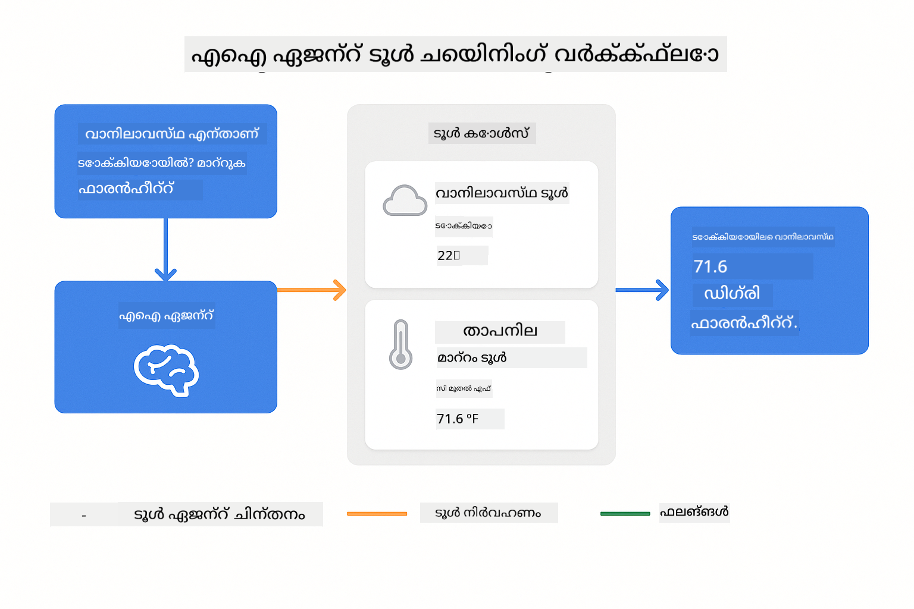
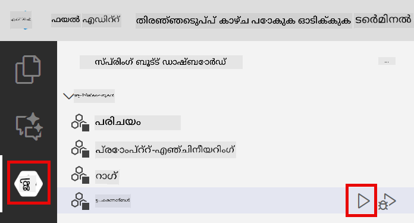
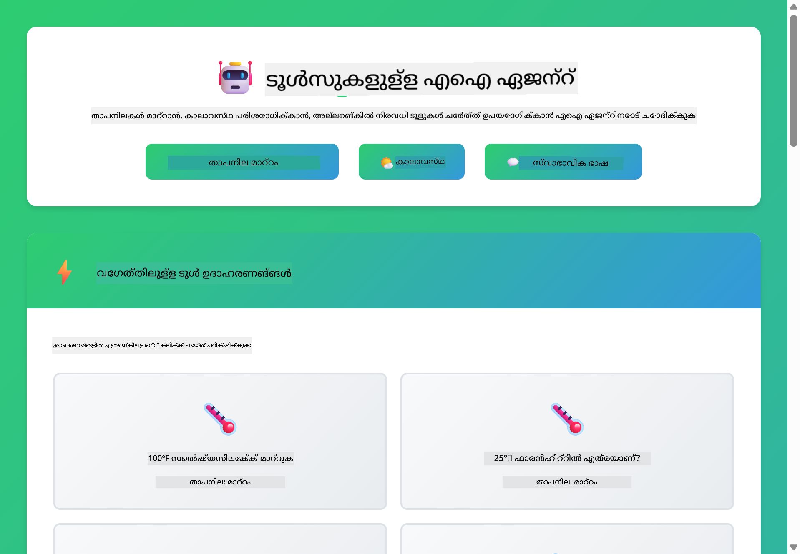
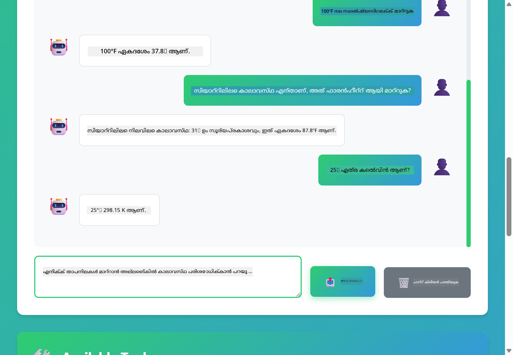

<!--
CO_OP_TRANSLATOR_METADATA:
{
  "original_hash": "aa23f106e7f53270924c9dd39c629004",
  "translation_date": "2025-12-13T19:45:37+00:00",
  "source_file": "04-tools/README.md",
  "language_code": "ml"
}
-->
# Module 04: ഉപകരണങ്ങളോടുകൂടിയ AI ഏജന്റുകൾ

## ഉള്ളടക്ക പട്ടിക

- [നിങ്ങൾ പഠിക്കേണ്ടത്](../../../04-tools)
- [ആവശ്യമായ മുൻപരിചയം](../../../04-tools)
- [ഉപകരണങ്ങളോടുകൂടിയ AI ഏജന്റുകൾ മനസ്സിലാക്കുക](../../../04-tools)
- [ഉപകരണ വിളിക്കൽ എങ്ങനെ പ്രവർത്തിക്കുന്നു](../../../04-tools)
  - [ഉപകരണ നിർവചനങ്ങൾ](../../../04-tools)
  - [നിർണ്ണയമെടുക്കൽ](../../../04-tools)
  - [നിർവഹണം](../../../04-tools)
  - [പ്രതികരണം സൃഷ്ടിക്കൽ](../../../04-tools)
- [ഉപകരണ ചൈനിംഗ്](../../../04-tools)
- [അപ്ലിക്കേഷൻ പ്രവർത്തിപ്പിക്കുക](../../../04-tools)
- [അപ്ലിക്കേഷൻ ഉപയോഗിക്കൽ](../../../04-tools)
  - [സാധാരണ ഉപകരണ ഉപയോഗം പരീക്ഷിക്കുക](../../../04-tools)
  - [ഉപകരണ ചൈനിംഗ് പരീക്ഷിക്കുക](../../../04-tools)
  - [സംവാദ പ്രവാഹം കാണുക](../../../04-tools)
  - [കാരണം നിരീക്ഷിക്കുക](../../../04-tools)
  - [വിവിധ അഭ്യർത്ഥനകൾ പരീക്ഷിക്കുക](../../../04-tools)
- [പ്രധാന ആശയങ്ങൾ](../../../04-tools)
  - [ReAct പാറ്റേൺ (കാരണം നിർവഹണവും)](../../../04-tools)
  - [ഉപകരണ വിവരണങ്ങൾ പ്രധാനമാണ്](../../../04-tools)
  - [സെഷൻ മാനേജ്മെന്റ്](../../../04-tools)
  - [പിശക് കൈകാര്യം ചെയ്യൽ](../../../04-tools)
- [ലഭ്യമായ ഉപകരണങ്ങൾ](../../../04-tools)
- [ഉപകരണ അടിസ്ഥാന ഏജന്റുകൾ എപ്പോൾ ഉപയോഗിക്കണം](../../../04-tools)
- [അടുത്ത ഘട്ടങ്ങൾ](../../../04-tools)

## നിങ്ങൾ പഠിക്കേണ്ടത്

ഇതുവരെ, നിങ്ങൾ AI-യുമായി സംവദിക്കുന്നത്, പ്രോംപ്റ്റുകൾ ഫലപ്രദമായി ഘടിപ്പിക്കുന്നത്, നിങ്ങളുടെ ഡോക്യുമെന്റുകളിൽ നിന്ന് പ്രതികരണങ്ങൾ അടിസ്ഥാനമാക്കുന്നത് എന്നിവ പഠിച്ചു. എന്നാൽ ഒരു അടിസ്ഥാനപരമായ പരിമിതിയുണ്ട്: ഭാഷാ മോഡലുകൾക്ക് ടെക്സ്റ്റ് മാത്രമേ സൃഷ്ടിക്കാൻ കഴിയൂ. അവ കാലാവസ്ഥ പരിശോധിക്കാൻ, കണക്കുകൾ നടത്താൻ, ഡാറ്റാബേസുകൾ ചോദിക്കാൻ, അല്ലെങ്കിൽ ബാഹ്യ സംവിധാനങ്ങളുമായി ഇടപഴകാൻ കഴിയില്ല.

ഉപകരണങ്ങൾ ഇത് മാറ്റുന്നു. മോഡലിന് വിളിക്കാവുന്ന ഫംഗ്ഷനുകൾ നൽകുന്നതിലൂടെ, നിങ്ങൾ അതിനെ ഒരു ടെക്സ്റ്റ് ജനറേറ്ററിൽ നിന്ന് പ്രവർത്തനങ്ങൾ കൈകാര്യം ചെയ്യുന്ന ഏജന്റായി മാറ്റുന്നു. മോഡൽ എപ്പോൾ ഉപകരണം ആവശ്യമാണ്, ഏത് ഉപകരണം ഉപയോഗിക്കണം, എന്ത് പാരാമീറ്ററുകൾ നൽകണം എന്നിവ തീരുമാനിക്കുന്നു. നിങ്ങളുടെ കോഡ് ഫംഗ്ഷൻ നിർവഹിച്ച് ഫലം തിരികെ നൽകുന്നു. മോഡൽ ആ ഫലം തന്റെ പ്രതികരണത്തിൽ ഉൾപ്പെടുത്തുന്നു.

## ആവശ്യമായ മുൻപരിചയം

- Module 01 പൂർത്തിയാക്കിയിട്ടുണ്ട് (Azure OpenAI വിഭവങ്ങൾ വിന്യസിച്ചിരിക്കുന്നു)
- റൂട്ട് ഡയറക്ടറിയിൽ `.env` ഫയൽ Azure ക്രെഡൻഷ്യലുകളുമായി (Module 01-ൽ `azd up` ഉപയോഗിച്ച് സൃഷ്ടിച്ചത്)

> **കുറിപ്പ്:** Module 01 പൂർത്തിയാക്കിയിട്ടില്ലെങ്കിൽ, ആദ്യം അവിടെ നൽകിയ വിന്യാസ നിർദ്ദേശങ്ങൾ പിന്തുടരുക.

## ഉപകരണങ്ങളോടുകൂടിയ AI ഏജന്റുകൾ മനസ്സിലാക്കുക

ഉപകരണങ്ങളോടുകൂടിയ AI ഏജന്റ് ഒരു കാരണവും പ്രവർത്തനവും (ReAct) പാറ്റേൺ പിന്തുടരുന്നു:

1. ഉപയോക്താവ് ഒരു ചോദ്യം ചോദിക്കുന്നു
2. ഏജന്റ് എന്ത് അറിയേണ്ടതുണ്ടെന്ന് കാരണമാക്കുന്നു
3. ഏജന്റ് ഉത്തരം നൽകാൻ ഉപകരണം ആവശ്യമാണോ എന്ന് തീരുമാനിക്കുന്നു
4. ആവശ്യമെങ്കിൽ, ഏജന്റ് ശരിയായ പാരാമീറ്ററുകളോടെ അനുയോജ്യമായ ഉപകരണം വിളിക്കുന്നു
5. ഉപകരണം പ്രവർത്തിച്ച് ഡാറ്റ തിരികെ നൽകുന്നു
6. ഏജന്റ് ഫലം ഉൾപ്പെടുത്തി അന്തിമ ഉത്തരം നൽകുന്നു


*ReAct പാറ്റേൺ - AI ഏജന്റുകൾ പ്രശ്നങ്ങൾ പരിഹരിക്കാൻ കാരണവും പ്രവർത്തനവും എങ്ങനെ മാറി മാറി ചെയ്യുന്നു*

ഇത് സ്വയം നടക്കുന്നു. നിങ്ങൾ ഉപകരണങ്ങളും അവയുടെ വിവരണങ്ങളും നിർവചിക്കുന്നു. മോഡൽ അവ എപ്പോൾ എങ്ങനെ ഉപയോഗിക്കണമെന്ന് തീരുമാനിക്കുന്നത് കൈകാര്യം ചെയ്യുന്നു.

## ഉപകരണ വിളിക്കൽ എങ്ങനെ പ്രവർത്തിക്കുന്നു

**ഉപകരണ നിർവചനങ്ങൾ** - [WeatherTool.java](../../../04-tools/src/main/java/com/example/langchain4j/agents/tools/WeatherTool.java) | [TemperatureTool.java](../../../04-tools/src/main/java/com/example/langchain4j/agents/tools/TemperatureTool.java)

നിങ്ങൾ വ്യക്തമായ വിവരണങ്ങളോടും പാരാമീറ്റർ നിർവചനങ്ങളോടും കൂടിയ ഫംഗ്ഷനുകൾ നിർവചിക്കുന്നു. മോഡൽ ഈ വിവരണങ്ങൾ സിസ്റ്റം പ്രോംപ്റ്റിൽ കാണുകയും ഓരോ ഉപകരണം എന്ത് ചെയ്യുന്നു എന്ന് മനസ്സിലാക്കുകയും ചെയ്യുന്നു.

```java
@Component
public class WeatherTool {
    
    @Tool("Get the current weather for a location")
    public String getCurrentWeather(@P("Location name") String location) {
        // നിങ്ങളുടെ കാലാവസ്ഥാ തിരയൽ ലജിക്
        return "Weather in " + location + ": 22°C, cloudy";
    }
}

@AiService
public interface Assistant {
    String chat(@MemoryId String sessionId, @UserMessage String message);
}

// അസിസ്റ്റന്റ് സ്വയം സ്പ്രിംഗ് ബൂട്ട് ഉപയോഗിച്ച് വയർ ചെയ്തിരിക്കുന്നു:
// - ChatModel ബീൻ
// - @Component ക്ലാസ്സുകളിൽ നിന്നുള്ള എല്ലാ @Tool മെത്തഡുകളും
// - സെഷൻ മാനേജ്മെന്റിനായി ChatMemoryProvider
```

> **🤖 [GitHub Copilot](https://github.com/features/copilot) ചാറ്റ് ഉപയോഗിച്ച് പരീക്ഷിക്കുക:** [`WeatherTool.java`](../../../04-tools/src/main/java/com/example/langchain4j/agents/tools/WeatherTool.java) തുറന്ന് ചോദിക്കുക:
> - "മോക്ക് ഡാറ്റയുടെ പകരം OpenWeatherMap പോലുള്ള യഥാർത്ഥ കാലാവസ്ഥ API എങ്ങനെ സംയോജിപ്പിക്കാം?"
> - "AI-യ്ക്ക് ശരിയായി ഉപയോഗിക്കാൻ സഹായിക്കുന്ന നല്ല ഉപകരണ വിവരണം എന്താണ്?"
> - "ഉപകരണ നടപ്പാക്കലിൽ API പിശകുകളും നിരക്ക് പരിധികളും എങ്ങനെ കൈകാര്യം ചെയ്യാം?"

**നിർണ്ണയമെടുക്കൽ**

ഉപയോക്താവ് "സിയാറ്റിലിലെ കാലാവസ്ഥ എന്താണ്?" എന്ന് ചോദിക്കുമ്പോൾ, മോഡൽ കാലാവസ്ഥ ഉപകരണം ആവശ്യമാണ് എന്ന് തിരിച്ചറിയുന്നു. അത് "സിയാറ്റിൽ" എന്ന ലൊക്കേഷൻ പാരാമീറ്ററോടെ ഫംഗ്ഷൻ വിളിപ്പ് സൃഷ്ടിക്കുന്നു.

**നിർവഹണം** - [AgentService.java](../../../04-tools/src/main/java/com/example/langchain4j/agents/service/AgentService.java)

Spring Boot എല്ലാ രജിസ്റ്റർ ചെയ്ത ഉപകരണങ്ങളോടും `@AiService` ഇന്റർഫേസ് സ്വയം വയർ ചെയ്യുന്നു, LangChain4j ഉപകരണ വിളിപ്പുകൾ സ്വയം നിർവഹിക്കുന്നു.

> **🤖 [GitHub Copilot](https://github.com/features/copilot) ചാറ്റ് ഉപയോഗിച്ച് പരീക്ഷിക്കുക:** [`AgentService.java`](../../../04-tools/src/main/java/com/example/langchain4j/agents/service/AgentService.java) തുറന്ന് ചോദിക്കുക:
> - "ReAct പാറ്റേൺ എങ്ങനെ പ്രവർത്തിക്കുന്നു, AI ഏജന്റുകൾക്ക് ഇത് എങ്ങനെ ഫലപ്രദമാണ്?"
> - "ഏജന്റ് ഏത് ഉപകരണം ഉപയോഗിക്കണമെന്ന് എങ്ങനെ തീരുമാനിക്കുന്നു, ഏത് ക്രമത്തിൽ?"
> - "ഉപകരണ നിർവഹണം പരാജയപ്പെട്ടാൽ എന്ത് സംഭവിക്കും - പിശകുകൾ എങ്ങനെ ശക്തമായി കൈകാര്യം ചെയ്യണം?"

**പ്രതികരണം സൃഷ്ടിക്കൽ**

മോഡൽ കാലാവസ്ഥ ഡാറ്റ സ്വീകരിച്ച് അത് ഉപയോക്താവിനായി സ്വാഭാവിക ഭാഷാ പ്രതികരണമായി രൂപപ്പെടുത്തുന്നു.

### ഡിക്ലറേറ്റീവ് AI സർവീസുകൾ എന്തുകൊണ്ട് ഉപയോഗിക്കണം?

ഈ മോഡ്യൂൾ LangChain4j-ന്റെ Spring Boot സംയോജനത്തിൽ ഡിക്ലറേറ്റീവ് `@AiService` ഇന്റർഫേസുകൾ ഉപയോഗിക്കുന്നു:

- **Spring Boot ഓട്ടോ-വയറിംഗ്** - ChatModel, ഉപകരണങ്ങൾ സ്വയം ഇൻജെക്ട് ചെയ്യുന്നു
- **@MemoryId പാറ്റേൺ** - ഓട്ടോമാറ്റിക് സെഷൻ അടിസ്ഥാനമാക്കിയുള്ള മെമ്മറി മാനേജ്മെന്റ്
- **ഒറ്റ ഇൻസ്റ്റൻസ്** - അസിസ്റ്റന്റ് ഒരിക്കൽ സൃഷ്ടിച്ച് മികച്ച പ്രകടനത്തിനായി പുനരുപയോഗിക്കുന്നു
- **ടൈപ്പ്-സേഫ് നിർവഹണം** - ജാവ മെത്തഡുകൾ നേരിട്ട് ടൈപ്പ് പരിവർത്തനത്തോടെ വിളിക്കുന്നു
- **മൾട്ടി-ടേൺ ഓർക്കസ്ട്രേഷൻ** - ഉപകരണ ചൈനിംഗ് സ്വയം കൈകാര്യം ചെയ്യുന്നു
- **സീറോ ബോയിലർപ്ലേറ്റ്** - കൈമാറേണ്ട AiServices.builder() കോൾസ് ഇല്ല, മെമ്മറി ഹാഷ്‌മാപ്പ് ഇല്ല

മാനുവൽ `AiServices.builder()` പോലുള്ള മറ്റ് സമീപനങ്ങൾ കൂടുതൽ കോഡ് ആവശ്യപ്പെടുകയും Spring Boot സംയോജനത്തിന്റെ ഗുണങ്ങൾ നഷ്ടപ്പെടുകയും ചെയ്യുന്നു.

## ഉപകരണ ചൈനിംഗ്

**ഉപകരണ ചൈനിംഗ്** - AI ഒരേ സമയം പല ഉപകരണങ്ങളും വിളിക്കാം. "സിയാറ്റിലിലെ കാലാവസ്ഥ എന്താണ്, ഞാൻ കുടമൂടി കൊണ്ടുപോകണോ?" എന്ന് ചോദിച്ച് `getCurrentWeather` വിളിച്ച് മഴക്കാല വസ്ത്രത്തെക്കുറിച്ച് കാരണമാക്കുന്നത് കാണുക.

<a href="images/tool-chaining.png"></a>

*ക്രമാനുസൃത ഉപകരണ വിളിപ്പുകൾ - ഒരു ഉപകരണത്തിന്റെ ഔട്ട്പുട്ട് അടുത്ത തീരുമാനത്തിലേക്ക്*

**സൗമ്യമായ പരാജയങ്ങൾ** - മോക്ക് ഡാറ്റയിൽ ഇല്ലാത്ത നഗരത്തിലെ കാലാവസ്ഥ ചോദിക്കുക. ഉപകരണം പിശക് സന്ദേശം നൽകും, AI സഹായം നൽകാൻ കഴിയില്ലെന്ന് വിശദീകരിക്കും. ഉപകരണങ്ങൾ സുരക്ഷിതമായി പരാജയപ്പെടുന്നു.

ഇത് ഒരു സംവാദ ടേണിൽ നടക്കുന്നു. ഏജന്റ് സ്വയം പല ഉപകരണ വിളിപ്പുകളും ഏകോപിപ്പിക്കുന്നു.

## അപ്ലിക്കേഷൻ പ്രവർത്തിപ്പിക്കുക

**വിന്യാസം പരിശോധിക്കുക:**

റൂട്ട് ഡയറക്ടറിയിൽ `.env` ഫയൽ Azure ക്രെഡൻഷ്യലുകളുമായി ഉണ്ടെന്ന് ഉറപ്പാക്കുക (Module 01-ൽ സൃഷ്ടിച്ചത്):
```bash
cat ../.env  # AZURE_OPENAI_ENDPOINT, API_KEY, DEPLOYMENT കാണിക്കണം
```

**അപ്ലിക്കേഷൻ ആരംഭിക്കുക:**

> **കുറിപ്പ്:** Module 01-ൽ `./start-all.sh` ഉപയോഗിച്ച് എല്ലാ അപ്ലിക്കേഷനുകളും ഇതിനകം ആരംഭിച്ചിട്ടുണ്ടെങ്കിൽ, ഈ മോഡ്യൂൾ 8084 പോർട്ടിൽ പ്രവർത്തിക്കുന്നു. താഴെയുള്ള സ്റ്റാർട്ട് കമാൻഡുകൾ ഒഴിവാക്കി നേരിട്ട് http://localhost:8084 സന്ദർശിക്കാം.

**ഓപ്ഷൻ 1: Spring Boot ഡാഷ്ബോർഡ് ഉപയോഗിക്കൽ (VS Code ഉപയോക്താക്കൾക്ക് ശുപാർശ)**

ഡെവ് കണ്ടെയ്‌നറിൽ Spring Boot ഡാഷ്ബോർഡ് എക്സ്റ്റൻഷൻ ഉൾപ്പെടുത്തിയിട്ടുണ്ട്, ഇത് എല്ലാ Spring Boot അപ്ലിക്കേഷനുകളും ദൃശ്യമായി നിയന്ത്രിക്കാൻ സഹായിക്കുന്നു. VS Code-യുടെ ഇടത് Activity Bar-ൽ Spring Boot ഐക്കൺ കാണാം.

Spring Boot ഡാഷ്ബോർഡിൽ നിന്ന് നിങ്ങൾക്ക്:
- വർക്ക്സ്പേസിലെ എല്ലാ Spring Boot അപ്ലിക്കേഷനുകളും കാണാം
- ഒറ്റ ക്ലിക്കിൽ അപ്ലിക്കേഷനുകൾ ആരംഭിക്കാനും നിർത്താനും കഴിയും
- അപ്ലിക്കേഷൻ ലോഗുകൾ റിയൽ-ടൈമിൽ കാണാം
- അപ്ലിക്കേഷൻ നില നിരീക്ഷിക്കാം

"tools" എന്ന മോഡ്യൂളിന്റെ അടുത്തുള്ള പ്ലേ ബട്ടൺ ക്ലിക്ക് ചെയ്ത് ഈ മോഡ്യൂൾ ആരംഭിക്കാം, അല്ലെങ്കിൽ എല്ലാ മോഡ്യൂളുകളും ഒരുമിച്ച് ആരംഭിക്കാം.



**ഓപ്ഷൻ 2: ഷെൽ സ്ക്രിപ്റ്റുകൾ ഉപയോഗിക്കൽ**

എല്ലാ വെബ് അപ്ലിക്കേഷനുകളും (മോഡ്യൂളുകൾ 01-04) ആരംഭിക്കുക:

**Bash:**
```bash
cd ..  # റൂട്ട് ഡയറക്ടറിയിൽ നിന്ന്
./start-all.sh
```

**PowerShell:**
```powershell
cd ..  # റൂട്ട് ഡയറക്ടറിയിൽ നിന്ന്
.\start-all.ps1
```

അല്ലെങ്കിൽ ഈ മോഡ്യൂളും മാത്രം ആരംഭിക്കുക:

**Bash:**
```bash
cd 04-tools
./start.sh
```

**PowerShell:**
```powershell
cd 04-tools
.\start.ps1
```

രണ്ടു സ്ക്രിപ്റ്റുകളും റൂട്ട് `.env` ഫയലിൽ നിന്നുള്ള പരിസ്ഥിതി വ്യത്യാസങ്ങൾ സ്വയം ലോഡ് ചെയ്യുകയും JAR ഫയലുകൾ ഇല്ലെങ്കിൽ നിർമ്മിക്കുകയും ചെയ്യും.

> **കുറിപ്പ്:** എല്ലാ മോഡ്യൂളുകളും മാനുവലായി നിർമ്മിച്ച് ശേഷം ആരംഭിക്കാൻ ആഗ്രഹിക്കുന്നുവെങ്കിൽ:
>
> **Bash:**
> ```bash
> cd ..  # Go to root directory
> mvn clean package -DskipTests
> ```
>
> **PowerShell:**
> ```powershell
> cd ..  # Go to root directory
> mvn clean package -DskipTests
> ```

ബ്രൗസറിൽ http://localhost:8084 തുറക്കുക.

**നിർത്താൻ:**

**Bash:**
```bash
./stop.sh  # ഈ മോഡ്യൂൾ മാത്രം
# അല്ലെങ്കിൽ
cd .. && ./stop-all.sh  # എല്ലാ മോഡ്യൂളുകളും
```

**PowerShell:**
```powershell
.\stop.ps1  # ഈ മോഡ്യൂൾ മാത്രം
# അല്ലെങ്കിൽ
cd ..; .\stop-all.ps1  # എല്ലാ മോഡ്യൂളുകളും
```

## അപ്ലിക്കേഷൻ ഉപയോഗിക്കൽ

അപ്ലിക്കേഷൻ ഒരു വെബ് ഇന്റർഫേസ് നൽകുന്നു, ഇവിടെ നിങ്ങൾക്ക് കാലാവസ്ഥയും താപനില പരിവർത്തന ഉപകരണങ്ങളും ഉപയോഗിക്കുന്ന AI ഏജന്റുമായി ഇടപഴകാം.

<a href="images/tools-homepage.png"></a>

*AI ഏജന്റ് ഉപകരണങ്ങൾ ഇന്റർഫേസ് - ഉപകരണങ്ങളുമായി ഇടപഴകാനുള്ള ചാറ്റ് ഇന്റർഫേസ് കൂടാതെ വേഗത്തിലുള്ള ഉദാഹരണങ്ങൾ*

**സാധാരണ ഉപകരണ ഉപയോഗം പരീക്ഷിക്കുക**

സരളമായ അഭ്യർത്ഥനയിൽ തുടങ്ങുക: "100 ഡിഗ്രി ഫാരൻഹീറ്റ് സെൽഷ്യസിലേക്ക് മാറ്റുക". ഏജന്റ് താപനില പരിവർത്തന ഉപകരണം ആവശ്യമാണ് എന്ന് തിരിച്ചറിയുന്നു, ശരിയായ പാരാമീറ്ററുകളോടെ വിളിക്കുന്നു, ഫലം തിരികെ നൽകുന്നു. ഇത് എത്ര സ്വാഭാവികമാണെന്ന് ശ്രദ്ധിക്കുക - നിങ്ങൾ ഏത് ഉപകരണം ഉപയോഗിക്കണമെന്ന് അല്ലെങ്കിൽ എങ്ങനെ വിളിക്കണമെന്ന് വ്യക്തമാക്കിയില്ല.

**ഉപകരണ ചൈനിംഗ് പരീക്ഷിക്കുക**

ഇപ്പോൾ കൂടുതൽ സങ്കീർണ്ണമായ ഒന്നു പരീക്ഷിക്കുക: "സിയാറ്റിലിലെ കാലാവസ്ഥ എന്താണ്, അത് ഫാരൻഹീറ്റിലേക്ക് മാറ്റുക?" ഏജന്റ് ഇത് ഘട്ടങ്ങളായി പ്രവർത്തിക്കുന്നത് കാണുക. ആദ്യം കാലാവസ്ഥ (സെൽഷ്യസ് നൽകുന്നു) ലഭിക്കുന്നു, പിന്നീട് ഫാരൻഹീറ്റിലേക്ക് മാറ്റേണ്ടതുണ്ടെന്ന് തിരിച്ചറിയുന്നു, പരിവർത്തന ഉപകരണം വിളിക്കുന്നു, രണ്ട് ഫലങ്ങളും ഒന്നിച്ച് ചേർത്ത് പ്രതികരണം നൽകുന്നു.

**സംവാദ പ്രവാഹം കാണുക**

ചാറ്റ് ഇന്റർഫേസ് സംവാദ ചരിത്രം സൂക്ഷിക്കുന്നു, നിങ്ങൾക്ക് മൾട്ടി-ടേൺ ഇടപെടലുകൾ നടത്താൻ കഴിയും. മുൻപ് നടത്തിയ എല്ലാ ചോദ്യം-പ്രതികരണങ്ങളും കാണാം, ഇത് സംവാദം എങ്ങനെ വികസിക്കുന്നു എന്ന് മനസ്സിലാക്കാൻ സഹായിക്കുന്നു.

<a href="images/tools-conversation-demo.png"></a>

*സാധാരണ പരിവർത്തനങ്ങൾ, കാലാവസ്ഥ പരിശോധിക്കൽ, ഉപകരണ ചൈനിംഗ് എന്നിവ കാണിക്കുന്ന മൾട്ടി-ടേൺ സംവാദം*

**വിവിധ അഭ്യർത്ഥനകൾ പരീക്ഷിക്കുക**

വിവിധ സംയോജനങ്ങൾ പരീക്ഷിക്കുക:
- കാലാവസ്ഥ പരിശോധിക്കൽ: "ടോക്കിയോയിലെ കാലാവസ്ഥ എന്താണ്?"
- താപനില പരിവർത്തനങ്ങൾ: "25°C എത്ര കെൽവിൻ ആണ്?"
- സംയുക്ത ചോദ്യം: "പാരിസിലെ കാലാവസ്ഥ പരിശോധിച്ച് 20°C-ൽ മുകളിൽ ആണോ എന്ന് പറയൂ"

എങ്ങനെ ഏജന്റ് സ്വാഭാവിക ഭാഷ വ്യാഖ്യാനിച്ച് അനുയോജ്യമായ ഉപകരണ വിളിപ്പുകളിലേക്ക് മാപ്പ് ചെയ്യുന്നു എന്ന് ശ്രദ്ധിക്കുക.

## പ്രധാന ആശയങ്ങൾ

**ReAct പാറ്റേൺ (കാരണം നിർവഹണവും)**

ഏജന്റ് കാരണവും പ്രവർത്തനവും മാറി മാറി ചെയ്യുന്നു (എന്ത് ചെയ്യണമെന്ന് തീരുമാനിക്കുകയും ഉപകരണങ്ങൾ ഉപയോഗിക്കുകയും). ഇത് സ്വയം പ്രശ്ന പരിഹാരത്തിന് സഹായിക്കുന്നു, വെറും നിർദ്ദേശങ്ങൾക്ക് മറുപടി നൽകുന്നതിൽ നിന്ന് വ്യത്യസ്തമാണ്.

**ഉപകരണ വിവരണങ്ങൾ പ്രധാനമാണ്**

നിങ്ങളുടെ ഉപകരണ വിവരണങ്ങളുടെ ഗുണമേന്മ ഏജന്റ് അവ എങ്ങനെ ഉപയോഗിക്കുന്നു എന്നതിനെ നേരിട്ട് ബാധിക്കുന്നു. വ്യക്തവും പ്രത്യേകവുമായ വിവരണങ്ങൾ മോഡലിന് എപ്പോൾ എങ്ങനെ ഉപകരണം വിളിക്കണമെന്ന് മനസ്സിലാക്കാൻ സഹായിക്കുന്നു.

**സെഷൻ മാനേജ്മെന്റ്**

`@MemoryId` അനോട്ടേഷൻ ഓട്ടോമാറ്റിക് സെഷൻ അടിസ്ഥാനമാക്കിയുള്ള മെമ്മറി മാനേജ്മെന്റ് സജ്ജമാക്കുന്നു. ഓരോ സെഷൻ ഐഡിക്കും `ChatMemory` ഇൻസ്റ്റൻസ് `ChatMemoryProvider` ബീൻ വഴി കൈകാര്യം ചെയ്യപ്പെടുന്നു, മാനുവൽ മെമ്മറി ട്രാക്കിംഗ് ആവശ്യമില്ല.

**പിശക് കൈകാര്യം ചെയ്യൽ**

ഉപകരണങ്ങൾ പരാജയപ്പെടാം - API ടൈംഔട്ട്, തെറ്റായ പാരാമീറ്ററുകൾ, ബാഹ്യ സേവനങ്ങൾ പ്രവർത്തനരഹിതം. പ്രൊഡക്ഷൻ ഏജന്റുകൾക്ക് പിശക് കൈകാര്യം ചെയ്യൽ ആവശ്യമാണ്, മോഡൽ പ്രശ്നങ്ങൾ വിശദീകരിക്കാനും ബദൽ ശ്രമിക്കാനും കഴിയും.

## ലഭ്യമായ ഉപകരണങ്ങൾ

**കാലാവസ്ഥ ഉപകരണങ്ങൾ** (പ്രദർശനത്തിനുള്ള മോക്ക് ഡാറ്റ):
- ഒരു ലൊക്കേഷനിലെ നിലവിലെ കാലാവസ്ഥ നേടുക
- ബഹുദിന പ്രവചനങ്ങൾ നേടുക

**താപനില പരിവർത്തന ഉപകരണങ്ങൾ**:
- സെൽഷ്യസ് മുതൽ ഫാരൻഹീറ്റ് വരെ
- ഫാരൻഹീറ്റ് മുതൽ സെൽഷ്യസ് വരെ
- സെൽഷ്യസ് മുതൽ കെൽവിൻ വരെ
- കെൽവിൻ മുതൽ സെൽഷ്യസ് വരെ
- ഫാരൻഹീറ്റ് മുതൽ കെൽവിൻ വരെ
- കെൽവിൻ മുതൽ ഫാരൻഹീറ്റ് വരെ

ഇവ ലളിതമായ ഉദാഹരണങ്ങളാണ്, പക്ഷേ ഈ പാറ്റേൺ ഏതൊരു ഫംഗ്ഷനിലും വ്യാപിപ്പിക്കാം: ഡാറ്റാബേസ് ക്വറികൾ, API വിളിപ്പുകൾ, കണക്കുകൾ, ഫയൽ ഓപ്പറേഷനുകൾ, സിസ്റ്റം കമാൻഡുകൾ എന്നിവ.

## ഉപകരണ അടിസ്ഥാന ഏജന്റുകൾ എപ്പോൾ ഉപയോഗിക്കണം

**ഉപകരണങ്ങൾ ഉപയോഗിക്കുക:**
- യഥാർത്ഥ സമയ ഡാറ്റ ആവശ്യമായപ്പോൾ (കാലാവസ്ഥ, സ്റ്റോക്ക് വിലകൾ, ഇൻവെന്ററി)
- ലളിതമായ ഗണിതത്തിന് മീതെ കണക്കുകൾ നടത്തേണ്ടപ്പോൾ
- ഡാറ്റാബേസുകൾ അല്ലെങ്കിൽ API-കൾ ആക്‌സസ് ചെയ്യുമ്പോൾ
- പ്രവർത്തനങ്ങൾ നടത്തുമ്പോൾ (ഇമെയിൽ അയയ്ക്കൽ, ടിക്കറ്റ് സൃഷ്ടിക്കൽ, റെക്കോർഡുകൾ അപ്ഡേറ്റ് ചെയ്യൽ)
- പല ഡാറ്റാ ഉറവിടങ്ങൾ സംയോജിപ്പിക്കുമ്പോൾ

**ഉപകരണങ്ങൾ ഉപയോഗിക്കരുത്:**
- പൊതുവായ അറിവിൽ നിന്നുള്ള ചോദ്യങ്ങൾക്ക്
- പ്രതികരണം വെറും സംവാദപരമായിരിക്കുമ്പോൾ
- ഉപകരണ ലേറ്റൻസി അനുഭവം വളരെ മന്ദഗതിയാക്കുമ്പോൾ

## അടുത്ത ഘട്ടങ്ങൾ

**അടുത്ത മോഡ്യൂൾ:** [05-mcp - Model Context Protocol (MCP)](../05-mcp/README.md)

---

**നാവിഗേഷൻ:** [← മുൻപ്: Module 03 - RAG](../03-rag/README.md) | [പ്രധാനത്തിലേക്ക് മടങ്ങുക](../README.md) | [അടുത്തത്: Module 05 - MCP →](../05-mcp/README.md)

---

<!-- CO-OP TRANSLATOR DISCLAIMER START -->
**അസൂയാപത്രം**:  
ഈ രേഖ AI വിവർത്തന സേവനം [Co-op Translator](https://github.com/Azure/co-op-translator) ഉപയോഗിച്ച് വിവർത്തനം ചെയ്തതാണ്. നാം കൃത്യതയ്ക്ക് ശ്രമിച്ചിട്ടുണ്ടെങ്കിലും, യന്ത്രം ചെയ്ത വിവർത്തനങ്ങളിൽ പിശകുകൾ അല്ലെങ്കിൽ തെറ്റുകൾ ഉണ്ടാകാമെന്ന് ദയവായി ശ്രദ്ധിക്കുക. അതിന്റെ മാതൃഭാഷയിലുള്ള യഥാർത്ഥ രേഖ അധികാരപരമായ ഉറവിടമായി കണക്കാക്കപ്പെടണം. നിർണായക വിവരങ്ങൾക്ക്, പ്രൊഫഷണൽ മനുഷ്യ വിവർത്തനം ശുപാർശ ചെയ്യപ്പെടുന്നു. ഈ വിവർത്തനം ഉപയോഗിക്കുന്നതിൽ നിന്നുണ്ടാകുന്ന ഏതെങ്കിലും തെറ്റിദ്ധാരണകൾക്കോ തെറ്റായ വ്യാഖ്യാനങ്ങൾക്കോ ഞങ്ങൾ ഉത്തരവാദികളല്ല.
<!-- CO-OP TRANSLATOR DISCLAIMER END -->