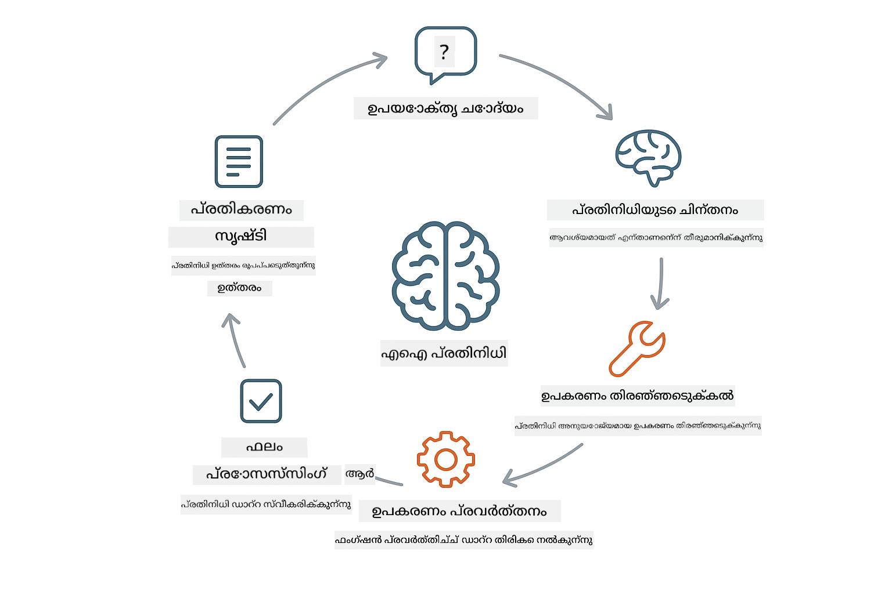

<!--
CO_OP_TRANSLATOR_METADATA:
{
  "original_hash": "13ec450c12cdd1a863baa2b778f27cd7",
  "translation_date": "2025-12-31T08:06:32+00:00",
  "source_file": "04-tools/README.md",
  "language_code": "ml"
}
-->
# Module 04: ഉപകരണങ്ങളുള്ള AI ഏജൻറുകൾ

## Table of Contents

- [താങ്കൾ പഠിക്കേണ്ടത്](../../../04-tools)
- [ആവശ്യമായ മുൻകരുതലുകൾ](../../../04-tools)
- [ഉപകരണങ്ങളുമായി AI ഏജൻറുകളെ അന്വേഷിക്കുന്നത്](../../../04-tools)
- [ടൂൾ കോളിങ് എങ്ങനെ പ്രവർത്തിക്കുന്നു](../../../04-tools)
  - [ടൂൾ നിർവചനങ്ങൾ](../../../04-tools)
  - [നിർണ്ണയമെടുക്കൽ](../../../04-tools)
  - [എക്സിക്യൂഷൻ](../../../04-tools)
  - [പ്രതികരണ നിർമ്മാണം](../../../04-tools)
- [ടൂൾ ചെയിനിംഗ്](../../../04-tools)
- [ആപ്ലിക്കേഷൻ চালിക്കുക](../../../04-tools)
- [ആപ്ലിക്കേഷൻ ഉപയോഗിക്കുന്നത്](../../../04-tools)
  - [ലളിതമായ ടൂൾ ഉപയോഗം പരീക്ഷിക്കുക](../../../04-tools)
  - [ടൂൾ ചെയിനിംഗ് പരീക്ഷിക്കുക](../../../04-tools)
  - [സംവാദ പ്രവാഹം കാണുക](../../../04-tools)
  - [കാരണം മനസിലാക്കൽ ശ്രദ്ധിക്കുക](../../../04-tools)
  - [വിവിധ അഭ്യർത്ഥനകൾ നിങ്ങളാക്രമിക്കുക](../../../04-tools)
- [പ്രധാന ആശയങ്ങൾ](../../../04-tools)
  - [ReAct പാറ്റേൺ (ഓർമ്മിക്കലും ക്രിയാനിർവഹണവും)](../../../04-tools)
  - [ടൂൾ വിവരണങ്ങൾ പ്രധാനമാണ്](../../../04-tools)
  - [സെഷൻ മാനേജ്മെന്റ്](../../../04-tools)
  - [പിശക് കൈകാര്യം ചെയ്യൽ](../../../04-tools)
- [ലഭ്യമായ ടൂളുകൾ](../../../04-tools)
- [ടൂൾ-അധിഷ്ഠിത ഏജൻറുകൾ ഉപയോഗിക്കേണ്ട സമയങ്ങൾ](../../../04-tools)
- [അടുത്ത പടി](../../../04-tools)

## What You'll Learn

ഇപ്പോഴുവരെ, നിങ്ങൾ AI-യുമായി സംഭാഷണം നടത്താൻ, പ്രോംപ്റ്റുകൾ ഫലപ്രദമായി ഘടിപ്പിക്കാൻ, നിങ്ങളുടെ രേഖകളിൽ നിലയുറപ്പിക്കപ്പെട്ട ഔത്തരങ്ങൾ ലഭിക്കാൻ പഠിച്ചു. പക്ഷേ ഒരു അടിസ്ഥാന പരിമിതിയാണ്: ഭാഷ മോഡലുകൾ ടക്സ്റ്റ് മാത്രമേ ഉണ്ടാക്കാവൂ. അവ വേതറിന്റെ സ്ഥിതിക്ക് നോക്കാൻ, കണക്കുകൾ ചെയ്യാൻ, ഡാറ്റാബേസുകൾ ചോദിക്കാൻ അല്ലെങ്കിൽ ബാഹ്യ സിസ്റ്റങ്ങളുമായി ഇടപഴകാൻ സാധിക്കല്ലേ.

ടൂളുകൾ ഇതിനെ മാറ്റുന്നു. മോഡലിന് വിളിക്കാൻ കഴിയുന്ന ഫങ്ഷനുകൾ നൽകുമ്പോൾ, നിങ്ങൾ അതിനെ ടക്സ്റ്റ് ജനറേറ്റർ നിന്ന് ഒരു പ്രവര്‍ത്തനങ്ങൾ കൈക്കൊള്ളുന്ന ഏജന്റാക്കി മാറ്റുന്നു. മോഡൽ ഏതപ്പോൾ ടൂൾ വേണമെന്നു, ഏത് ടൂൾ ഉപയോഗിക്കണമെന്ന്, എത്രയും സജ്ജമായ ഉപരിതലപരാമീറ്ററുകൾ എന്റെയെന്ന് തീരുമാനിക്കുന്നു. നിങ്ങളുടെ കോഡ് ഫങ്ഷൻ എക്സിക്യൂട്ട് ചെയ്ത് ഫലം തിരികെയയക്കും. മോഡൽ ആ ഫലം својപ്രതികരണത്തിൽ ചേര്‍ക്കുന്നു.

## Prerequisites

- Module 01 പൂർത്തിയായി (Azure OpenAI സ്രോതസ്സുകൾ ഡിപ്ലോയുചെയ്തിട്ടുണ്ട്)
- റട്ട് ഡയറക്ടറിയിൽ `.env` ഫയൽ Azure ക്രെഡൻഷ്യലുകളുമായി (Module 01-ൽ `azd up` ഉപയോഗിച്ച് സൃഷ്ടിച്ചത്)

> **കുറിപ്പ്:** നിങ്ങൾ Module 01 പൂർത്തിയാക്കിയില്ലെങ്കിൽ, ആദ്യം അവിടെ നൽകിയ ഡിപ്ലോയ്മെന്റ് നിർദ്ദേശങ്ങൾ പിന്തുടരുക.

## Understanding AI Agents with Tools

> **📝 കുറിപ്പ്:** ഈ മോഡ്യൂളിലെ "ഏജൻറുകൾ" എന്ന പദം ടൂൾ-കോള്‍ ചെയ്യുന്നതിനുള്ള കഴിവുകളോടെ മെച്ചപ്പെടുത്തപ്പെട്ട AI അസിസ്റ്റന്റുകൾക്ക് ആണ്. ഇത് നാം [Module 05: MCP](../05-mcp/README.md) ൽ ചർച്ച ചെയ്യാൻ പോകുന്ന **Agentic AI** പാറ്റേണുകളിൽ (പരിപാടീകരണം, മെമ്മറി,.multi-step reasoning ഉള്ള സ്വയംകാരിയായ ഏജന്റുകൾ) നിന്ന് വ്യത്യസ്തമാണ്.

ഉപകരണങ്ങളുള്ള ഒരു AI ഏജന്റ് ReAct എന്ന കാരണമെടുക്കലും പ്രവർത്തനവും ചെയ്യുന്ന ഒരു മാതൃക പിന്തുടരുന്നു:

1. ഉപയോക്താവ് ഒരു ചോദ്യം ചോദിക്കുന്നു
2. ഏജന്റ് എന്ത് അറിയേണ്ടതാണെന്ന് നിരൂപിക്കുന്നു
3. ഉത്തരത്തിന് ടൂൾ ആവശ്യമാണോ എന്ന് ഏജന്റ് തീരുമാനം നേർക്കുന്നു
4. ആവശ്യമാണെങ്കിൽ, ശരിയായ പാരാമീറ്ററുകളോടെ അനുയോജ്യമായ ടൂൾ വിളിക്കുന്നു
5. ടൂൾ എക്സിക്യുട്ട് ചെയ്ത് ഡാറ്റ തിരിച്ചുകൊടുക്കുന്നു
6. ഏജന്റ് ഫലം ഉൾപ്പെടുത്തി അന്തിമ ഉത്തരമൊരുക്കുന്നു



*ReAct പാറ്റേൺ - പ്രശ്നങ്ങൾ പരിഹരിക്കാൻ AI ഏജൻറുകൾ കാരണം മനസിലാക്കലും പ്രവർത്തനവും എങ്ങനെ交互 ചെയ്യുന്നു*

ഇത് സ്വയം നടക്കുന്നു. നിങ്ങൾ ടൂളുകളും അവയുടെ വിവരണങ്ങളും നിർവചിക്കുന്നു. മോഡൽ അതുവരെ എന്ത് ചെയ്യണം എന്നും എങ്ങനെ ഉപയോഗിക്കണം എന്നും തീരുമാനിക്കുന്നത് കൈകാര്യം ചെയ്യുന്നു.

## How Tool Calling Works

**Tool Definitions** - [WeatherTool.java](../../../04-tools/src/main/java/com/example/langchain4j/agents/tools/WeatherTool.java) | [TemperatureTool.java](../../../04-tools/src/main/java/com/example/langchain4j/agents/tools/TemperatureTool.java)

നിങ്ങൾ സുതാര്യമായ വിവരണങ്ങളോടെയും പാരാമീറ്റർ നിർവചനങ്ങളോടെയും ഫങ്ഷനുകൾ നിർവചിക്കുന്നു. മോഡൽ ഈ വിവരണങ്ങൾ അതിന്റെ സിസ്റ്റം പ്രാംപ്റ്റിൽ കാണുകയും ഓരോ ടൂൾ എന്താണ് ചെയ്യുന്നതെന്ന് മനസ്സിലാക്കുകയും ചെയ്യുന്നു.

```java
@Component
public class WeatherTool {
    
    @Tool("Get the current weather for a location")
    public String getCurrentWeather(@P("Location name") String location) {
        // നിങ്ങളുടെ കാലാവസ്ഥ അന്വേഷിക്കുന്ന ലാജിക്
        return "Weather in " + location + ": 22°C, cloudy";
    }
}

@AiService
public interface Assistant {
    String chat(@MemoryId String sessionId, @UserMessage String message);
}

// അസിസ്റ്റന്റ് Spring Boot ഉപയോഗിച്ച് സ്വയം കണക്ട് ചെയ്യപ്പെട്ടിരിക്കുന്നു:
// - ChatModel ബീൻ
// - @Component ക്ലാസുകളിൽ നിന്നുള്ള എല്ലാ @Tool മെതഡുകളും
// - സെഷൻ മാനേജ്മെന്റിന് ChatMemoryProvider
```

> **🤖 [GitHub Copilot](https://github.com/features/copilot) Chat ഉപയോഗിച്ച് പരീക്ഷിക്കുക:** തുറക്കുക [`WeatherTool.java`](../../../04-tools/src/main/java/com/example/langchain4j/agents/tools/WeatherTool.java) ഒപ്പം ചോദിക്കുക:
> - "How would I integrate a real weather API like OpenWeatherMap instead of mock data?"
> - "What makes a good tool description that helps the AI use it correctly?"
> - "How do I handle API errors and rate limits in tool implementations?"

**നിർണ്ണയമെടുക്കൽ**

ഉപയോക്താവ് "What's the weather in Seattle?" എന്ന് ചോദിക്കുമ്പോൾ, മോഡൽ വേതറിന്റെ ടൂൾ 필요മാണെന്ന് തിരിച്ചറിഞ്ഞു. ഇത് location പാരാമീറ്റർ "Seattle" ആയി സജ്ജമാക്കി ഒരു ഫങ്ഷൻ കോൾ ജനറേറ്റ് ചെയ്യുന്നു.

**എക്സിക്യൂഷൻ** - [AgentService.java](../../../04-tools/src/main/java/com/example/langchain4j/agents/service/AgentService.java)

Spring Boot എല്ലാദിവസം ഡിക്ലറേറ്റിവ് `@AiService` ഇന്റർഫേസുമായി എല്ലാ രജിസ്റ്റർ ചെയ്ത ടൂളുകളും auto-wire ചെയ്യുന്നു, LangChain4j ടൂൾ കോളുകളെ സ്വയം എക്സിക്യൂട്ട് ചെയ്യുന്നു.

> **🤖 [GitHub Copilot](https://github.com/features/copilot) Chat ഉപയോഗിച്ച് പരീക്ഷിക്കുക:** തുറക്കുക [`AgentService.java`](../../../04-tools/src/main/java/com/example/langchain4j/agents/service/AgentService.java) ഒപ്പം ചോദിക്കുക:
> - "How does the ReAct pattern work and why is it effective for AI agents?"
> - "How does the agent decide which tool to use and in what order?"
> - "What happens if a tool execution fails - how should I handle errors robustly?"

**പ്രതികരണ നിർമ്മാണം**

മോഡൽ വേതർ ഡാറ്റ സ്വീകരിച്ച് അത് ഉപയോക്താവിനായുള്ള സ്വാഭാവിക ഭാഷാ മറുപടിയാക്കി രൂപപ്പെടുത്തി.

### Declarative AI Services എന്തുകൊണ്ട് ഉപയോഗിക്കണം?

ഈ മോഡ്യൂൾ LangChain4j-ന്റെ Spring Boot സംയോജനവും ഡിക്ലറേറ്റീവ് `@AiService` ഇന്റർഫേസുകളും ഉപയോഗിക്കുന്നു:

- **Spring Boot auto-wiring** - ChatModel എന്നും ടൂളുകളും സ്വയം ഇൻജക്ട് ചെയ്യപ്പെടുന്നു
- **@MemoryId പാറ്റേൺ** - സെഷൻ അധിഷ്ഠിത മെമ്മറി മാനേജ്മെന്റ് സ്വയം നടക്കുന്നു
- **Single instance** - അസിസ്റ്റന്റ് ഒരിക്കല് സൃഷ്ടിച്ച് വീണ്ടും ഉപയോഗിക്കുന്നത് പ്രകടനത്തിനുള്ള മെച്ചം നൽകുന്നു
- **Type-safe execution** - Java മെത്തഡുകൾ നേരിട്ട് ടൈപ്പ് പരിവർത്തനത്തോടുകൂടി വിളിക്കപ്പെടുന്നു
- **Multi-turn orchestration** - ടൂൾ ചെയിനിംഗ് സ്വയം കൈകാര്യം ചെയ്യുന്നു
- **Zero boilerplate** - കൈവശമുള്ള AiServices.builder() കോൾമാർ അല്ലെങ്കിൽ memory HashMap ആവശ്യമില്ല

മാറ്റുവഴികൾ (മാനുവൽ `AiServices.builder()`) കൂടുതൽ കോഡ് ആവശ്യപ്പെടും കൂടാതെ Spring Boot സംയോജനത്തിന്റെ നേട്ടങ്ങൾ നഷ്ടമാക്കും.

## Tool Chaining

**ടൂൾ ചെയിനിംഗ്** - AI കുറേ ടൂളുകൾ സീക്വൻസിൽ വിളിക്കാമെന്ന്. "What's the weather in Seattle and should I bring an umbrella?" എന്ന് ചോദിച്ച് `getCurrentWeather` വിളിച്ച് മഴയേക്കുറിച്ച് തീരുമാനം എടുക്കുന്നത് കാണുക.

<a href="images/tool-chaining.png"></a>

*അനുക്രമ ടൂൾ കോളുകൾ - ഒരു ടൂളിന്റെ ഔട്ട്പുട്ട് അടുത്ത തീരുമാനം ഉണ്ടാക്കുന്നതിലേക്ക് ഫിഡ് ചെയ്യപ്പെടുന്നു*

**Graceful Failures (നിശ്ശബ്ദ പരാജയങ്ങൾ)** - മോക്ക് ഡാറ്റയിൽ ഇല്ലാത്ത നഗരത്തിൽ കാലാവസ്ഥ ചോദിക്കുക. ടൂൾ ഒരു പിശക് സന്ദേശം തിരികെയറിയിക്കും, AI ഇത് സഹായിക്കാൻ കഴിയില്ലെന്ന് വിശദീകരിക്കും. ടൂളുകൾ സുരക്ഷിതമായി പരാജയപ്പെടുന്നു.

ഇത് ഒരു single conversation turn-ൽ നടക്കും. ഏജന്റ് 여러 ടൂൾ കോളുകൾ സ്വയം ഓർക്കസ്ട്രേറ്റ് ചെയ്യുന്നു.

## Run the Application

**ഡിപ്ലോയ്മെന്റ് സ്ഥിരീകരിക്കുക:**

റൂട്ടിൽ `.env` ഫയൽ Azure ക്രെഡൻഷ്യലുകളോടെ ഉള്ളത് ഉറപ്പാക്കുക (Module 01 സമയത്ത് സൃഷ്ടിച്ചത്):
```bash
cat ../.env  # AZURE_OPENAI_ENDPOINT, API_KEY, DEPLOYMENT കാണിക്കണം
```

**ആപ്ലിക്കേഷൻ ആരംഭിക്കുക:**

> **കുറിപ്പ്:** നിങ്ങൾ Module 01-ൽ നിന്നുള്ള `./start-all.sh` ഉപയോഗിച്ച് ഇതിനകം എല്ലാ ആപ്ലിക്കേഷനുകളും ആരംഭിച്ചിട്ടുണ്ടെങ്കിൽ, ഈ മോഡ്യൂൾ ഇതിനകം port 8084-ൽ പ്രവർത്തിക്കുന്നതായി കാണാം. താഴെ കാണിക്കുന്ന സ്റ്റാർട്ട് കമാൻഡുകൾ ഒഴിവാക്കാം, നേരിട്ട് http://localhost:8084 സന്ദർശിക്കാം.

**Option 1: Spring Boot Dashboard ഉപയോഗിക്കൽ (VS Code ഉപയോക്താക്കൾക്ക് ശുപാർശ)**

ഡെവ് കണ്ടെയ്നറിൽ Spring Boot Dashboard എക്സ്റ്റൻഷൻ ഉൾക്കൊള്ളുന്നുണ്ട്, ഇത് എല്ലാ Spring Boot ആപ്ലിക്കേഷനുകളും മാനേജുചെയ്യാനുള്ള ദൃശ്യ ഇന്റർഫേസ് നൽകുന്നു. ഇത് VS Code-ന്റെ Activity Bar-ൽ ഇടത് വശത്ത് കാണാം (Spring Boot ഐക്കൺ നോക്കുക).

Spring Boot Dashboard-ൽ നിന്നു, നിങ്ങൾക്ക്:
- വർക്‍스്ഫേസിലുള്ള ലഭ്യമായ എല്ലാ Spring Boot ആപ്ലിക്കേഷനുകളും കാണാൻ കഴിയും
- പോല്ല-start/stop ആപ്ലിക്കേഷനുകൾ single click-ൽ ചെയ്യുക
- ആപ്ലിക്കേഷൻ ലോഗുകൾ റിയൽ-ടൈമിൽ കാണുക
- ആപ്ലിക്കേഷൻ സ്റ്റാറ്റസ് നിരീക്ഷിക്കുക

"tools" എന്നത് സമീപമുള്ള പ്ലേ ബട്ടൺ ക്ലിക്ക് ചെയ്‌താൽ ഈ മോഡ്യൂൾ ആരംഭിക്കും, അല്ലെങ്കിൽ എല്ലാം ഒറ്റയ്ക്ക് ആരംഭിക്കാം.


**Option 2: ഷെല്ല് സൈക്രിപ്റ്റുകള് ഉപയോഗിക്കൽ**

എല്ലാ വെബ് ആപ്ലിക്കേഷനുകളും തുടങ്ങുക (modules 01-04):

**Bash:**
```bash
cd ..  # റൂട്ട് ഡയറക്ടറിയിൽ നിന്ന്
./start-all.sh
```

**PowerShell:**
```powershell
cd ..  # റൂട്ട് ഡയറക്ടറിയിൽ നിന്ന്
.\start-all.ps1
```

അഥവാ ഈ മോഡ്യൂൾ മാത്രം ആരംഭിക്കുക:

**Bash:**
```bash
cd 04-tools
./start.sh
```

**PowerShell:**
```powershell
cd 04-tools
.\start.ps1
```

രണ്ടു സ്‌ക്രിപ്റ്റുകളും റൂട്ട് `.env` ഫയലിൽ നിന്നുള്ള എൻവയോൺമെന്റ് വ്യത്യാസങ്ങൾ സ്വയം ലോഡ് ചെയ്യുകയും JARs ഉണ്ടായില്ലെങ്കിൽ ബിൽഡ് ചെയ്യും.

> **കുറിപ്പ്:** നിങ്ങൾക്ക് എല്ലാ മോഡ്യൂളുകളും മാനുവലായിരിക്കുന്നത് ആദ്യം ബിൽഡ് ചെയ്യാൻ ഇഷ്ടമെങ്കിൽ:
>
> **Bash:**
> ```bash
> cd ..  # Go to root directory
> mvn clean package -DskipTests
> ```
>
> **PowerShell:**
> ```powershell
> cd ..  # Go to root directory
> mvn clean package -DskipTests
> ```

ബ്രൗസറിൽ http://localhost:8084 തുറക്കുക.

**നിർത്താൻ:**

**Bash:**
```bash
./stop.sh  # ഈ മോഡ്യൂൾ മാത്രം
# അതവാ
cd .. && ./stop-all.sh  # എല്ലാ മോഡ്യൂളുകളും
```

**PowerShell:**
```powershell
.\stop.ps1  # ഈ മോഡ്യൂൾ മാത്രം
# അതവാ
cd ..; .\stop-all.ps1  # എല്ലാ മോഡ്യൂളുകളും
```

## Using the Application

ആപ്ലിക്കേഷൻ ഒരു വെബ് ഇന്റർഫേസ് നൽകുന്നു, ഇവിടെ നിങ്ങൾ വേതറും താപനില പരിവർത്തന ടൂളുകളും ഉപയോഗിക്കാൻ കഴിയുന്ന AI ഏജന്റ്‌യുമായി ഇടപെടാം.

<a href="images/tools-homepage.png"></a>

*AI ഏജന്റ് ടൂളുകൾ ഇന്റർഫേസ് - ടൂൾ മൂല്യങ്ങൾക്കുള്ള ઝડપી ഉദാഹരണങ്ങളും ചാറ്റ് ഇന്റർഫേസും*

**ലളിതമായ ടൂൾ ഉപയോഗം പരീക്ഷിക്കുക**

സരളമായ അഭ്യർത്ഥനയിൽ തുടങ്ങുക: "Convert 100 degrees Fahrenheit to Celsius". ഏജന്റ് താപനില പരിവർത്തന ടൂൾ വേണം എന്നാണ് തിരിച്ചറിഞ്ഞു, ശരിയായ പാരാമീറ്ററുകളോടെയാണ് വിളിച്ച് ഫലം തിരികെ നൽകുന്നത്. നിങ്ങൾ ഏത് ടൂൾ ഉപയോഗിക്കണമെന്ന് അല്ലെങ്കിൽ എങ്ങനെ വിളിക്കണമെന്നും നിർദ്ദേശിച്ചില്ലെങ്കിലും എത്ര സ്വാഭാവികമാണെന്ന് ശ്രദ്ധിക്കുക.

**ടൂൾ ചെയിനിംഗ് പരീക്ഷിക്കുക**

ഇപ്പോൾ കുറേക്കൂടി സങ്കീർണ്ണമായ ഒന്ന പരീക്ഷിക്കുക: "What's the weather in Seattle and convert it to Fahrenheit?" ഏജന്റ് ഇത് ഘട്ടങ്ങളായി പ്രവർത്തിക്കുന്നതായി കാണുക. ആദ്യം വേതർ കണ്ടെത്തും (സെൽഷ്യസ് ആയി നൽകുന്നു), പിന്നെ അത് ഫാരൻഹീറ്റിലേക്ക് മാറ്റേണ്ടതുണ്ടെന്ന് തിരിച്ചറിയുകയും പരിവർത്തന ടൂൾ വിളിക്കുകയും രണ്ടും ഫലങ്ങൾ ഒൊറ്റ മറുപടിയായി സംയോജിപ്പിക്കുകയും ചെയ്യും.

**സംവാദ പ്രവാഹം കാണുക**

ചാറ്റ് ഇന്റർഫേസ് സംഭാഷണചരിത്വം നിലനിർത്തുന്നു, ഇത് നിങ്ങൾക്ക് മൾട്ടി-ടേൺ ഇടപെടലുകൾ നടത്താൻ അനുവദിക്കുന്നു. മുൻപ് ചെയ്യുന്ന എല്ലാ ചോദ്യങ്ങളും മറുപടികളും കാണാൻ കഴിയും, ഇത് സംഭാഷണത്തെ ട്രാക്ക് ചെയ്യാനും ഏജന്റ് എങ്ങനെ കോൺടെക്സ്റ്റ് നിർമ്മിക്കുന്നു എന്ന് മനസ്സിലാക്കുന്നതിനും സഹായിക്കും.

<a href="images/tools-conversation-demo.png"></a>

*സിംപിൾ കോൺവർഷനുകൾ, വേതർ ലുക്കപ്പുകൾ, ടൂൾ ചെയിനിംഗ് എന്നിവ കാണിക്കുന്ന മൾട്ടി-ടേൺ സംഭാഷണം*

**വിവിധ അഭ്യർത്ഥനകൾ പരീക്ഷിക്കുക**

വിവിധ സംയോജനങ്ങൾ പരീക്ഷിക്കുക:
- വേതർ ലുക്കപ്പുകൾ: "What's the weather in Tokyo?"
- താപനില പരിവർത്തനങ്ങൾ: "What is 25°C in Kelvin?"
- സംയുക്ത അഭ്യർത്ഥനകൾ: "Check the weather in Paris and tell me if it's above 20°C"

ഏജന്റ് പ്രകൃത്ഭാഷയെ എങ്ങനെ വ്യാഖ്യാനം ചെയ്യുന്നു എന്നതും അത് അനുയോജ്യമായ ടൂൾ കോളുകൾക്ക് എങ്ങനെ മാപ്പ് ചെയ്യുന്നു എന്നതും লক্ষ্যിക്കുക.

## Key Concepts

**ReAct Pattern (Reasoning and Acting)**

ഏജന്റ് കാരണം മനസ്സിലാക്കലും (ഏന്ത് ചെയ്യണമെന്ന് തീരുമാനിക്കൽ) പ്രവർത്തനവും (ടൂളുകൾ ഉപയോഗിക്കൽ) തമ്മിൽ交互 ചെയ്യുന്നു. ഈ പാറ്റേൺ инструк്ഷൻ മാത്രം പാലിക്കുന്നതിനേക്കാൾ സ്വതന്ത്രമായ പ്രശ്ന പരിഹാരത്തെ സുലഭമാക്കുന്നുണ്ട്.

**Tool Descriptions Matter**

നിങ്ങളുടെ ടൂൾ വിവരണങ്ങളുടെ ഗുണമേൻമAEA ഏജന്റ് അവ എങ്ങനെ ഉപയോഗിക്കുന്നു എന്നതിൽ നേരിട്ട് സ്വാധീനം ചെലുത്തും. தெളിഞ്ഞ, പ്രത്യേക വിവരണങ്ങൾ മോഡൽ എപ്പോൾ എങ്ങനെ ഓരോ ടൂൾ വിളിക്കണമെന്ന് മനസ്സിലാക്കാൻ സഹായിക്കും.

**Session Management**

`@MemoryId` അനോട്ടേഷൻ സ്വയം സെഷൻ അധിഷ്ഠിത മെമ്മറി മാനേജ്മെന്റ് সক্ষমമാക്കുന്നു. ഓരോ സെഷൻ ഐഡിക്കും `ChatMemory`-യുടെ വ്യക്തിഗത ഇൻസ്റ്റൻസ് `ChatMemoryProvider` ബീൻ മുഖേന മാനേജ് ചെയ്യപ്പെടുന്നു, മാനുവൽ മെമ്മറി ട്രാക്കിംഗ് ഒഴിവാക്കുന്നു.

**Error Handling**

ടൂളുകൾ പരാജയപ്പെടാം - APIs ടൈംഔട്ട് ആകാം, പാരാമീറ്ററുകൾ അസാധുവാകാം, ബാഹ്യ സേവനങ്ങൾ താഴെയാകാം. പ്രൊഡക്ഷൻ ഏജൻറുകൾക്ക് പിശക് കൈകാര്യം ചെയ്യലുകൾ വേണം, അതിലൂടെ മോഡൽ പ്രശ്നങ്ങൾ വിശദീകരിക്കുകയോ പകരം മറ്റൊരു മാർഗം ശ്രമിക്കുകയോ ചെയ്യാൻ കഴിയണം.

## Available Tools

**Weather Tools** (പ്രദർശനത്തിനുള്ള mock ഡാറ്റ):
- ഒരു ലൊക്കേഷനിലെ നിലവിലുള്ള കാലാവസ്ഥ നേടുക
- ബഹു-ദിന ഊഹക്കണക്കുകൾ നേടുക

**Temperature Conversion Tools**:
- സെൽഷ്യസ് ടു ഫാരൻഹീറ്റ്
- ഫാരൻഹീറ്റ് ടു സെൽഷ്യസ്
- സെൽഷ്യസ് ടു കെൽവിൻ
- കെൽവിൻ ടു സെൽഷ്യസ്
- ഫാരൻഹീറ്റ് ടു കെൽവിൻ
- കെൽവിൻ ടു ഫാരൻഹീറ്റ്

ഇവ ലളിതമായ ഉദാഹരണങ്ങളാണ്, പക്ഷേ ഈ പാറ്റേൺ ഏതെങ്കിലും ഫങ്ഷൻ വരെ വ്യാപിപ്പിക്കാൻ കഴിയും: ഡാറ്റാബേസ് ക്വെറികൾ, API കോളുകൾ, കണക്കുകൾ, ഫയൽ ഓപ്പറേഷനുകൾ, അല്ലെങ്കിൽ സിസ്റ്റം കമാൻഡുകൾ.

## When to Use Tool-Based Agents

**ടൂളുകൾ ഉപയോഗിക്കുക എപ്പോൾ:**
- ഉത്തരം റിയൽ-ടൈം ഡേറ്റ ആവശ്യപ്പെടുമ്പോൾ (കാലാവസ്ഥ, സ്റ്റോക്ക് വിലകൾ, ഇൻവെന്ററി)
- ലളിതം കൂടിയ അക്‌സ്പ്ലോർ ചെയ്യാത്ത കണക്കുകളും ചെയ്യേണ്ടപ്പോൾ
- ഡാറ്റാബേസുകൾ അല്ലെങ്കിൽ APIs ആക്‌സസ് ചെയ്യേണ്ടപ്പോൾ
- പ്രവർത്തനങ്ങൾ നടത്തേണ്ടപ്പോൾ (ഇമെയിൽ അയയ്ക്കൽ, ടിക്കറ്റുകൾ സൃഷ്ടിക്കൽ, റെക്കോർഡ് അപ്‌ഡേറ്റ് ചെയ്യൽ)
- ഒരേ സമയം പല ഡാറ്റാ ഉറവിടങ്ങൾ സംയോജിപ്പിക്കേണ്ടപ്പോൾ

**ടൂളുകൾ ഉപയോഗിക്കരുത്:**
- ചോദ്യങ്ങൾ സാധാരണ വിജ്ഞാനത്തിൽ നിന്ന് ഉത്തരം പിടിക്കാൻ കഴിയുന്നപ്പോൾ
- മറുപടി ശുദ്ധമായ സംഭാഷണമാണെങ്കിൽ
- ടൂൾ ലേറ്റൻസി അനുഭവം വളരെ മന്ദമാക്കുംെങ്കിൽ

## Next Steps

**അടുത്ത മോഡ്യൂൾ:** [05-mcp - Model Context Protocol (MCP)](../05-mcp/README.md)

---

**Navigation:** [← Previous: Module 03 - RAG](../03-rag/README.md) | [Back to Main](../README.md) | [Next: Module 05 - MCP →](../05-mcp/README.md)

---

<!-- CO-OP TRANSLATOR DISCLAIMER START -->
അസ്വീകരണ പ്രഖ്യാപനം:
ഈ ദസ്താവേജ് AI വിവർത്തന സേവനമായ [Co‑op Translator](https://github.com/Azure/co-op-translator) ഉപയോഗിച്ച് വിവർത്തനം ചെയ്തതാണ്. ഞങ്ങൾ കൃത്യത നിലനിർത്താൻ ശ്രമിക്കുന്നെങ്കിലും, സ്വയം പ്രവർത്തിക്കുന്ന വിവർത്തനങ്ങളിൽ പിശകുകളും അസൂക്ഷ്മതകളും ഉണ്ടായിരിക്കാമെന്നത് ദയവായി ശ്രദ്ധിക്കുക. മൂലഭാഷയിലുള്ള അസൽ ദസ്താവേജ് മാത്രമേ അധികാരമുള്ള ഉറവിടമായി കരുതാവൂ. നിർണ്ണായകമായ വിവരങ്ങൾക്ക് പ്രൊഫഷണൽ മനുഷ്യ വിവർത്തനം ശുപാർശ ചെയ്യപ്പെടുന്നു. ഈ വിവർത്തനത്തിന്റെ ഉപയോഗത്തിൽ നിന്നുണ്ടാകുന്ന ഏതെങ്കിലും തെറ്റിദ്ധാരണങ്ങളിലോ തെറ്റായ വ്യാഖ്യാനങ്ങളിലോ ഞങ്ങൾക്ക് ഉത്തരവാദിത്വം ഉണ്ടായിരിക്കില്ല.
<!-- CO-OP TRANSLATOR DISCLAIMER END -->