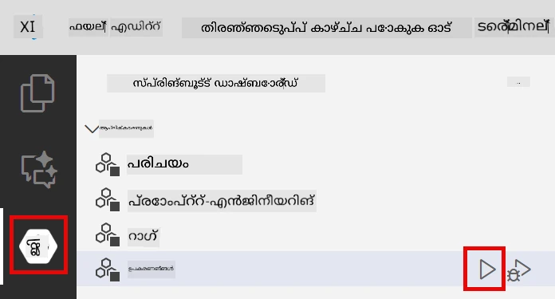
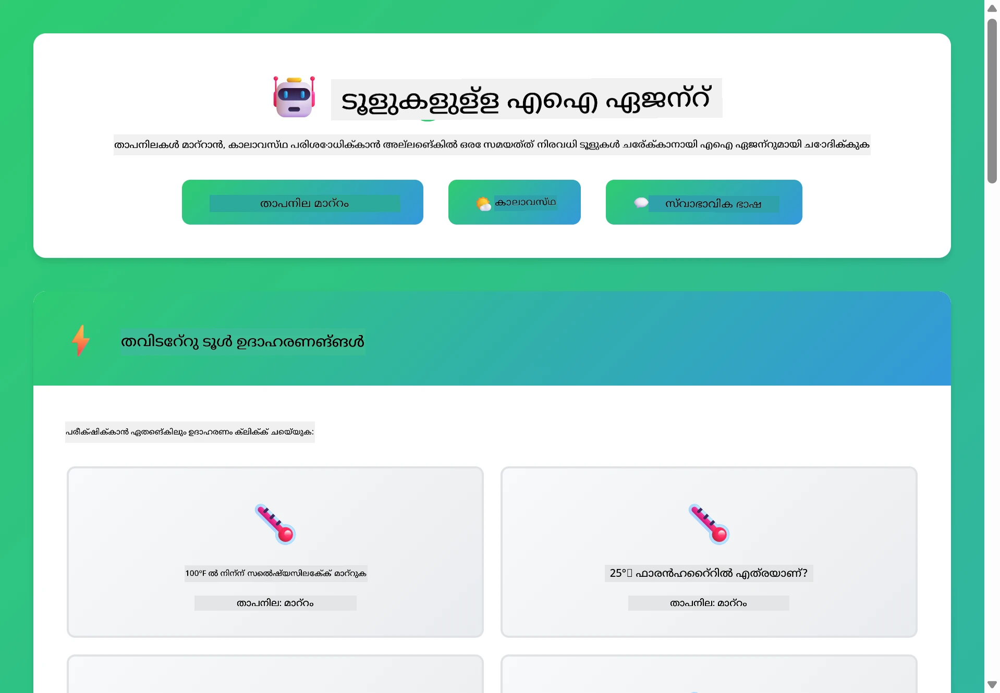
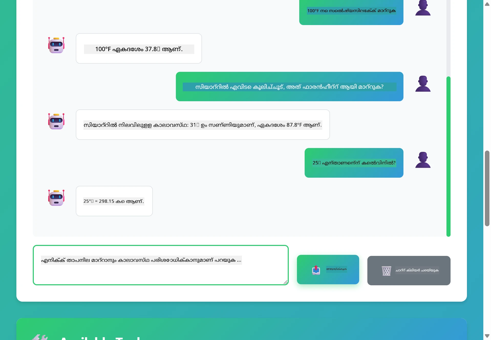

# Module 04: ഓزارങ്ങളോടുകൂടിയ AI ഏജന്റുകൾ

## ഉള്ളടക്ക പട്ടിക

- [വീഡിയോ വാക്ക്‌ത്രൂ](#വീഡിയോ-വാക്ക്‌ത്രൂ)
- [നിങ്ങൾ പഠിക്കുന്നത്](#നിങ്ങൾ-പഠിക്കുന്നത്)
- [അവശ്യപ്പെടുന്നതിന്റേതുകൾ](#ആവശ്യകതകൾ)
- [ഓजारങ്ങളോടുകൂടിയ AI ഏജന്റുകളെ അറിയുക](#ഓजारങ്ങളോടുകൂടിയ-ai-ഏജന്റുകൾ-അറിയുക)
- [ഓजारഭോഗം എങ്ങനെ പ്രവർത്തിക്കുന്നു](#ഓജാർ-വിളിക്കുന്ന-വിധം)
  - [ഓജാര നിർവചനം](#ഓജാർ-നിർവചനം)
  - [നിർണയമെടുക്കൽ](#നിർണയമെടുക്കൽ)
  - [നടത്തൽ](#നടപ്പാക്കൽ)
  - [പ്രതികരണം ഉണ്ടാക്കൽ](#മറുപടി-സൃഷ്ടിക്കൽ)
  - [സാമ്പ്രദായിക ഘടകങ്ങൾ: സ്പ്രിംഗ് ബൂട്ട് ഓട്ടോ-വയരിംഗ്](#സാമ്പ്രദായിക-ഘടകങ്ങൾ-സ്പ്രിംഗ്-ബൂട്ട്-ഓട്ടോ-വയരിംഗ്)
- [ഓജാര ചൈൻ ചെയ്യൽ](#ഓജാര-ചൈൻ-ചെയ്യൽ)
- [ആപ്ലിക്കേഷൻ ഓടിക്കുക](#ആപ്ലിക്കേഷൻ-ഓടിക്കുക)
- [ആപ്ലിക്കേഷൻ ഉപയോഗിക്കൽ](#അപ്ലിക്കേഷൻ-ഉപയോഗിക്കൽ)
  - [പൊതുവായ ഓജാര ഉപയോഗം ശ്രമിക്കുക](#ലളിതമായ-ഉപകരണം-ഉപയോഗിച്ച്-പരീക്ഷിക്കുക)
  - [ഓജാര ചൈൻ പരിശോധന](#ഉപകരണങ്ങൾ-ബന്ധിപ്പിച്ച്-പരീക്ഷിക്കുക)
  - [സംവാദ പ്രവാഹം കാണുക](#സംഭാഷണ-പ്രവാഹം-കാണുക)
  - [വിവിധ അപേക്ഷകൾ പരീക്ഷിക്കുക](#വ്യത്യസ്ത-അഭ്യർത്ഥനകളോടൊപ്പം-പരീക്ഷിക്കുക)
- [പ്രധാന ആശയങ്ങൾ](#പ്രധാന-ആശയങ്ങൾ)
  - [ReAct മാതൃക (ചിന്തനവും പ്രവർത്തനവും)](#react-പാറ്റേൺ-കാരണം-പറയൽ-കൂടാതെ-പ്രവർത്തിക്കുന്നു)
  - [ഓജാര വിവരണങ്ങൾ പ്രാധാന്യം ഉള്ളവയാണ്](#ഉപകരണ-വിവരണങ്ങൾ-പ്രധാനമാണ്)
  - [സെഷൻ മാനേജ്മെന്റ്](#സെഷൻ-മാനേജുമെന്റ്)
  - [പിശക് കൈകാര്യംചെയ്യൽ](#പിഴവ്-കൈകാര്യംചെയ്യൽ)
- [ചില ഓജാരങ്ങൾ](#ലഭ്യമായ-ഉപകരണങ്ങൾ)
- [ഓജാര അടിസ്ഥാനമാക്കിയുള്ള ഏജന്റുകൾ ഉപയോഗിക്കേണ്ട സമയം](#ഉപകരണം-അടിസ്ഥാനമായ-ഏജന്റുകൾ-എப்போது-ഉപയോഗിക്കണമെന്ന്)
- [ഓജാരങ്ങൾ vs RAG](#ഉപകരണങ്ങൾ-vs-rag)
- [അടുത്ത ഘട്ടങ്ങൾ](#അടുത്ത-പടികൾ)

## വീഡിയോ വാക്ക്‌ത്രൂ

ഈ ലൈവ് സെഷൻ കാണുക, ഈ മോഡ്യൂൾ ആരംഭിക്കുന്നത് എങ്ങനെ എന്നത് വിശദീകരിക്കുന്നു:

<a href="https://www.youtube.com/watch?v=O_J30kZc0rw"></a>

## നിങ്ങൾ പഠിക്കുന്നത്

ഇത് വരെ, നിങ്ങൾ എഐയുമായി സംവദിക്കുന്നത്, പ്രോംപ്റ്റുകൾ ഫലപ്രദമായി ഘടിപ്പിക്കുന്നത്, മറുപടികൾ നിങ്ങളുടെ രേഖകളിൽ അടിസ്ഥാനം ചെയ്യുന്നത് തുടങ്ങിയവ പഠിച്ചു. എന്നാൽ ഒരു അടിസ്ഥാനപരമായ പരിമിതി ഇനിയും നിലനിൽക്കുന്നു: ഭാഷാ മോഡലുകൾക്ക് വെറും ടെക്സ്റ്റ് സൃഷ്ടിക്കാനാണ് കഴിവ്. അവ കാലാവസ്ഥ പരിശോധിക്കാനോ, കണക്കാക്കി പ്രവർത്തിക്കാനോ, ഡാറ്റാബേസുകൾ തിരയാനോ, ബാഹ്യ സംവിധാനങ്ങളുമായി ഇടപഴകാനോ കഴിയില്ല.

ഓജാരങ്ങൾ ഇതു മാറ്റുന്നു. മോഡലിന് വിളിക്കാനാകുന്ന ഫംഗ്ഷനുകൾ നൽകുമ്പോൾ, നിങ്ങൾ അതിനെ ഒരു ടെക്സ്റ്റ് ജനറേറ്റർ നിന്ന് പ്രവർത്തനശേഷിയുള്ള ഏജന്റായി മാറ്റുന്നു. മോഡൽ ഒരിക്കൽ ഓജാരത്തെ ആവശ്യക്കായി, ഏത് ഓജാരാണ് ഉപയോഗിക്കേണ്ടത്, ഏതെല്ലാം പാരാമീറ്ററുകൾ അയക്കേണ്ടത് എന്നിവ തീരുമാനിക്കുന്നു. നിങ്ങളുടെ കോഡ് ആ ഫംഗ്ഷൻ നടപ്പിലാക്കി ഫലം തിരിച്ച് നൽകും. മോഡൽ ആ ഫലം തന്റെ മറുപടിയിൽ ഉൾപ്പെടുത്തുന്നു.

## ആവശ്യകതകൾ

- പൂർത്തിയാക്കിയ [Module 01 - പരിചയം](../01-introduction/README.md) (Azure OpenAI സ്രോതസ്സുകൾ വിന്യസിച്ചിട്ടുണ്ട്)
- മുൻ മോഡ്യൂളുകൾ പൂർത്തിയാക്കിയിട്ടുണ്ടെങ്കിൽ ഉത്തമം (ഈ മോഡ്യൂൾ [Module 03 - RAG ആശയങ്ങൾ](../03-rag/README.md) -ൽ നിന്നുള്ള സാന്ദർഭികവിവരങ്ങളെ പരാമർശിക്കുന്നു ടൂളുകളും RAG ഉം തമ്മിലുള്ള താരതമ്യത്തിൽ)
- റൂട്ട് ഡയറക്ടറിയിൽ `.env` ഫയൽ Azure ക്രെഡൻഷ്യലുകളോടുകൂടി (Module 01 ൽ `azd up` സൃഷ്ടിച്ചത്)

> **കുറിപ്പ്:** Module 01 പൂർത്തിയാക്കാത്തവരാണ് ഇനിയും, ആദ്യം അവിടെ നൽകിയ വിന്യാസ നിർദ്ദേശങ്ങൾ പാലിക്കുക.

## ഓजारങ്ങളോടുകൂടിയ AI ഏജന്റുകൾ അറിയുക

> **📝 കുറിപ്പ്:** ഈ മോഡ്യൂളിൽ "ഏജന്റുകൾ" എന്നു പറഞ്ഞാൽ ഓജാർ-കോൾ കഴിവുള്ള AI അസിസ്റ്റന്റുകളെയാണ് സൂചിപ്പിക്കുന്നത്. ഈ പാറ്റേണുകൾ [Module 05: MCP](../05-mcp/README.md) യിൽ കവർ ചെയ്യുന്ന ഓട്ടോണോമസ് ഏജന്റുകൾക്ക് വ്യത്യസ്തമാണ് (ആസൂത്രണം, മെമ്മറി, ബഹു-വഴിയുള്ള ചിന്തനം എന്നിവയുള്ള).

ഓജാരങ്ങൾ ഇല്ലാതെയുള്ള ഭാഷാ മോഡൽ വെറും ടെക്സ്റ്റാണ് സൃഷ്ടിക്കാൻ കഴിവുള്ളത്. ഇന്നത്തെ കാലാവസ്ഥ ചോദിച്ചാൽ, അത് ഗസ്സിക്കേണ്ടി വരും. ഓജാരങ്ങൾ നൽകി, അത് കാലാവസ്ഥ API-യെ വിളിക്കാനും കണക്കുകൾ നിർവഹിക്കാനും ഡാറ്റാബേസ് അന്വേഷിക്കാനും കഴിയും — ആ യഥാർത്ഥ ഫലങ്ങൾ തന്റെ മറുപടിയിൽ അടങ്ങിയിടും.


*ഓജാരമില്ലാതെ മോഡൽ ഗസ് ചെയ്യുമ്പോൾ മാത്രം കഴിയും — ഓജാരത്തോടൊപ്പം അത് APIs വിളിക്കാനും കണക്കുകൾ നിർവഹിക്കാനും യഥാർഥ സമയ ഡാറ്റ നൽകാനും കഴിയും.*

ഒരു ഓജാരങ്ങളുമായ AI ഏജന്റ് **ReAct** (ചിന്തനവും പ്രവർത്തനവും) പാറ്റേൺ പിന്തുടരുന്നു. മോഡൽ വെറും മറുപടി നൽകുന്നതല്ല - അതിന്റെ ആവശ്യം എന്താണെന്ന് ചിന്തിച്ച്, ഓജാരത്തെ വിളിച്ച് പ്രവർത്തിച്ച്, ഫലം നിരീക്ഷിച്ച്, വീണ്ടും പ്രവർത്തിക്കണമോ അവസാന മറുപടി നൽകണോ എന്നത് തീരുമാനിക്കുന്നു:

1. **ചിന്തിക്കുക** — ഉപയോക്താവിന്റെ ചോദ്യം വിശകലനം ചെയ്ത് ആവശ്യമുള്ള വിവരങ്ങൾ നിശ്ചയിക്കുക  
2. **പ്രവർത്തിക്കുക** — ശരിയായ ഓജാര തിരഞ്ഞെടുക്കുക, ശരിയായ പാരാമീറ്ററുകൾ സൃഷ്ടിച്ച് വിളിക്കുക  
3. **നിരീക്ഷിക്കുക** — ഓജാറിന്റെ ഫലം ലഭിച്ച് വിലയിരുത്തുക  
4. **പുനരാവൃത്തി അല്ലെങ്കിൽ മറുപടി നൽകുക** — കൂടുതൽ ഡാറ്റ ആവശ്യമുണ്ടെങ്കിൽ തിരികെ ചുഴലികാകും, അല്ലെങ്കിൽ സ്വാഭാവിക ഭാഷയിൽ മറുപടി തയ്യാറാക്കും  


*ReAct ചക്രം — ഏജന്റ് ചെയ്യേണ്ടത് എന്തെന്ന് ചിന്തിച്ച്, ഓജാരം വിളിച്ച് പ്രവർത്തിച്ചും, ഫലം നിരീക്ഷിച്ചും, അവസാനം മറുപടി നൽകുന്നതുവരെ പുനരാവൃത്തിക്കും.*

ഇത് സ്വയം നടക്കുന്നു. നിങ്ങൾ ഓജാരങ്ങളും അവയുടെ വിവരണങ്ങളും നിർവചിക്കുന്നു. മോഡൽ അത് ഉപയോഗിക്കേണ്ട സമയവും വിധവും തീരുമാനിക്കുന്നു.

## ഓജാർ വിളിക്കുന്ന വിധം

### ഓജാർ നിർവചനം

[WeatherTool.java](../../../04-tools/src/main/java/com/example/langchain4j/agents/tools/WeatherTool.java) | [TemperatureTool.java](../../../04-tools/src/main/java/com/example/langchain4j/agents/tools/TemperatureTool.java)

വ്യക്തമായ വിവരണങ്ങളോടും പാരാമീറ്റർ വിശദീകരണങ്ങളോടും കൂടിയ ഫംഗ്ഷനുകൾ നിങ്ങൾ നിർവചിക്കുന്നു. മോഡൽ ഈ വിവരണങ്ങൾ തന്റെ സിസ്റ്റം പ്രോംപ്റ്റിൽ കാണുകയും ഏത് ഓജാരാണ് എന്ത് ചെയ്യുന്നത് എന്നത് മനസ്സിലാക്കുകയും ചെയ്യും.

```java
@Component
public class WeatherTool {
    
    @Tool("Get the current weather for a location")
    public String getCurrentWeather(@P("Location name") String location) {
        // നിങ്ങളുടെ കാലാവസ്ഥാന്വേഷണം ലാജിക്
        return "Weather in " + location + ": 22°C, cloudy";
    }
}

@AiService
public interface Assistant {
    String chat(@MemoryId String sessionId, @UserMessage String message);
}

// അസിസ്റ്റന്റ് സ്വയമേവ സ്പ്രിംഗ് ബൂട്ട് ഉപയോഗിച്ച് വയർ ചെയ്യപ്പെട്ടിരിക്കുന്നു:
// - ചാറ്റ് മോഡൽ ബീൻ
// - @Component ക്ലാസ്സുകളിൽ നിന്നുള്ള എല്ലാ @Tool മെത്തഡ്‌സും
// - സെഷൻ മാനേജ്മെന്റിനായി ChatMemoryProvider
```

താഴെയുള്ള ഡയഗ്രാം ഓരോ അനോട്ടേഷനും വിശദീകരിച്ച് എഐക്ക് എപ്പോൾ എങ്ങനെ ഓജാരിനെ വിളിക്കാമെന്നും ഏത് പാരാമീറ്ററുകൾ നൽകണമെന്നും മനസ്സിലാക്കാൻ സഹായിക്കുന്നു:


*ഓജാർ നിർവചന ഘടകം — @Tool എഐക്ക് ഉപയോഗിക്കേണ്ട സമയമറിയിക്കുന്നു, @P ഓരോ പാരാമീറ്ററെയും വിവരണം നൽകുന്നു, @AiService സ്റ്റാർട്ടപ്പിൽ എല്ലാതാം പ്രവർത്തനങ്ങളും ബന്ധിപ്പിക്കുന്നു.*

> **🤖 [GitHub Copilot](https://github.com/features/copilot) ചാറ്റിൽ ശ്രമിക്കുക:** [`WeatherTool.java`](../../../04-tools/src/main/java/com/example/langchain4j/agents/tools/WeatherTool.java) തുറന്ന് ചോദിക്കൂ:  
> - "റെൽ വേതർ API പോലെ OpenWeatherMap ഇന്റഗ്രേറ്റ് ചെയ്യുന്നത് എങ്ങനെ?"  
> - "എഐ കൃത്യമായി ഉപയോഗിക്കാൻ സഹായിക്കുന്ന നല്ല ഓജാർ വിവരണത്തിന്റെ പ്രത്യേകതകൾ എന്തെല്ലാം?"  
> - "API പിശകുകളും നിരക്കും വിന്യാസവും എങ്ങനെ ഹൈാൻഡിൽ ചെയ്യാം?"  

### നിർണയമെടുക്കൽ

ഉപയോക്താവ് "സിയാട്ടിലിലെ കാലാവസ്ഥ എന്താണ്?" ചോദിച്ചാൽ, മോഡൽ യാദൃച്ഛികമായി ഓജാർ തിരഞ്ഞെടുക്കുകയല്ല. ഉപയോക്താവിന്റെ ഉദ്ദേശ്യം എല്ലാ ഓജാര വിവരണങ്ങളിൽ നിന്ന് താരതമ്യം ചെയ്ത്, പ്രാധാന്യ സ്കോർ ആകർന്ന് ഏറ്റവും അനുയോജ്യമായ ഒന്ന് തിരയുകയും സേ463 ചികയി തരണവെള്ള 6605847്റി സൂ 816 4608 വീണ്ടും പ 565242 70674 പരിചയായി — ഇതിൽ `location` `"Seattle"` ആക്കുന്നതാണ് ഉദാഹരണം.

ഉപയോഗംക്കാർക്കൊന്നും ഓജാർ വേണ്ടെന്ന് തോന്നാതിരുന്നാൽ, മോഡൽ സ്വന്തം അറിവിൽ നിന്നു മറുപടി നൽകും. ഒന്നിലധികം ഓജാരുകൾ പൊരുത്തപ്പെട്ടാൽ ഏറ്റവും പ്രത്യേകമായത് തിരഞ്ഞെടുക്കും.


*ഉപയോക്താവിന്റെ ഉദ്ദേശ്യത്തിന് എതിരായി എല്ലാ ഓജാരുകളും വിലയിരുത്തി മികച്ച ഒന്ന് മോഡൽ തിരഞ്ഞെടുത്തു — അതുകൊണ്ടുതന്നെ വ്യക്തമായ, പ്രത്യേകമായ ഓജാർ വിവരണങ്ങൾ എഴുതുക.*

### നടപ്പാക്കൽ

[AgentService.java](../../../04-tools/src/main/java/com/example/langchain4j/agents/service/AgentService.java)

സ്പ്രിംഗ് ബൂട്ട് `@AiService` ഇൻറർഫെയ്‌സിനൊപ്പം എല്ലാ രജിസ്റ്റർ ചെയ്ത ഓജാരുകളും ഓട്ടോമാറ്റിക്കായി വയർ ചെയ്യുന്നു, LangChain4j ഓജാർ വിളിപ്പിക്കൽ സ്വയം നടത്തുന്നു. ഉപയോക്താവിന്റെ സ്വാഭാവിക ഭാഷാ ചോദ്യത്തിൽ നിന്നു മറുപടി വരെയുള്ള ആറ് ഘട്ടങ്ങളിൽ മുഴുവൻ ഓജാർ വിളിപ്പിക്കൽ പ്രവാഹം കടന്നു പോകുന്നു:


*ആർഭാട മൊത്തം പ്രവാഹം — ഉപയോക്താവ് ചോദ്യം ചോദിക്കുന്നു, മോഡൽ ഓജാർ തിരഞ്ഞെടുക്കുന്നു, LangChain4j അത് നടപ്പിലാക്കുന്നു, മോഡൽ ഫലം സ്വാഭാവിക മറുപടിയാക്കി കാഴ്‌ചവയ്ക്കുന്നു.*

`AiServices` ഏതെങ്കിലും ഓജാറിനും ഓരോ വിളിപ്പിക്കൽ ലൂപ്പ് ഓടിക്കുന്നുണ്ട് — ഇവിടെ ലളിതമായ `Calculator` ഉപയോഗിച്ചാണ് പ്രതിനിധാനം. താഴെയുള്ള പട്ടികയിൽ ആ കോഡ് എങ്ങനെ പ്രവർത്തിക്കുന്നു എന്ന് വ്യക്തമാക്കുന്നു:


*ഓജാർ വിളനിരത്ത് — `AiServices` നിങ്ങളുടെ സന്ദേശവും ഓജാർ സ്കീമകളും LLM-ലേക്ക് അയയ്ക്കുന്നു, LLM `add(42, 58)` പോലെയുള്ള ഫംഗ്ഷൻ കോളുമായി മറുപടി നൽകുന്നു, LangChain4j `Calculator` മെത്തഡ് പ്രാദേശികമായി പ്രവർത്തിപ്പിക്കുന്നു, ഫലം അവസാന മറുപടിക്ക് തരും.*

> **🤖 [GitHub Copilot](https://github.com/features/copilot) ചാറ്റിൽ ശ്രമിക്കുക:** [`AgentService.java`](../../../04-tools/src/main/java/com/example/langchain4j/agents/service/AgentService.java) തുറന്ന് ചോദിക്കൂ:  
> - "ReAct മാതൃക എങ്ങനെ പ്രവർത്തിക്കുന്നു, ഇത് AI ഏജന്റിനായി എന്തുകൊണ്ട് ഫലപ്രദമാണ്?"  
> - "ഏജന്റ് എങ്ങനെ ഓജാർ തിരഞ്ഞെടുക്കുന്നു, ഏതാണ്ടെന്ത് ക്രമത്തിൽ?"  
> - "ഓജാർ പ്രവർത്തനം പരാജയപ്പെട്ടാൽ എന്താകും? പിശക് കൈകാര്യം ശക്തമായി എങ്ങനെ നടത്താം?"  

### മറുപടി സൃഷ്ടിക്കൽ

മോഡൽ കാലാവസ്ഥ ഡാറ്റ സ്വീകരിച്ച് ഉപയോക്താവിനായി സ്വാഭാവിക ഭാഷാ മറുപടിയാക്കി ഡാറ്റ ഫോർമാറ്റ് ചെയ്യുന്നു.

### സാമ്പ്രദായിക ഘടകങ്ങൾ: സ്പ്രിംഗ് ബൂട്ട് ഓട്ടോ-വയരിംഗ്

ഈ മോഡ്യൂൾ LangChain4j-ന്റെ സ്പ്രിംഗ് ബൂട്ട് ഇന്റഗ്രേഷൻ ഉപയോഗിക്കുന്നു, `@AiService` ഡിക്ലറേറ്ററി ഇൻറർഫേസുകളോടെ. സ്പ്രിംഗ് ബൂട്ട് സ്റ്റാർട്ടപ്പിൽ എല്ലാ `@Component` കളെയും, `@Tool` മെത്തഡുകൾ ഉള്ളവയും, നിങ്ങളുടെ ChatModel ബീനും ChatMemoryProvider-ഉം കണ്ടെത്തി എല്ലാ കോമ്പോണന്റുകളും ഒറ്റ `Assistant` ഇൻറർഫേസിലേക്ക് വയർ ചെയ്യുന്നു.


*`@AiService` ഇൻറർഫേസ് ChatModel, ഓജാർ കോമ്പോണന്റുകൾ, മെമ്മറി പ്രൊവൈഡർ എന്നിവ ബന്ധിപ്പിക്കുന്നു — സ്പ്രിംഗ് ബൂട്ട് എല്ലാം സ്വയം വയർ ചെയ്യുന്നു.*

HTTP അഭ്യർത്ഥന മുതൽ കൺട്രോളർ, സർവീസ്, ഓട്ടോ-വയർ ചെയ്ത് പ്രോക്സി വഴി ഓജാർ പ്രവർത്തനം വരെയുള്ള പൂർണ്ണ അഭ്യർത്ഥന ജീവിതചക്രം താഴെ SDD ആയി ലഭ്യമാണ്:


*പിൂർണ്ണ സ്പ്രിംഗ് ബൂട്ട് അഭ്യർത്ഥന പ്രവാഹം — HTTP അഭ്യർത്ഥനം കൺട്രോളർ, സർവീസ്, ഓട്ടോ-വയർ ചെയ്ത Assistant പ്രോക്സിക്ക് കടന്നു LLM-നും ഓജാർ കോൾസിനും ഏകോപിപ്പിക്കും.*

ഈ സമീപനത്തിന്റെ പ്രധാന ഗുണങ്ങൾ:

- **സ്പ്രിംഗ് ബൂട്ട് ഓട്ടോ-വയരിംഗ്** — ChatModel ഉം ഓജാരുകളും സ്വയം ചേർക്കുന്നു  
- **@MemoryId മാതൃക** — സ്വയം സെഷൻ അധിഷ്ഠിത മെമ്മറി മാനേജ്മെന്റ്  
- **ഒറ്റ സംസ്‌ഥാനം** — Assistant ഒരിക്കൽ സൃഷ്ടിച്ച് മികച്ച പ്രകടനത്തിനായി വീണ്ടും ഉപയോഗിക്കുന്നു  
- **ടൈപ്പ്-സേഫ് എക്സിക്യൂഷൻ** — ജാവ മെത്തഡുകൾ നേരിട്ടും ടൈപ്പ് കൺവർഷനോടെ വിളിക്കുന്നു  
- **ബഹു-ടേൺ ഓർക്കസ്ട്രേഷൻ** — ഓജാർ ചൈൻ ചെയ്യൽ സ്വയമേവ കൈകാര്യം ചെയ്യുന്നു  
- **മുടിച്ച് റെസ്പോൺസ് ഇല്ല** — 手动 `AiServices.builder()` കോളുകൾ അല്ല, മെമ്മറി ഹാഷ്മാപ് ഇല്ല  

മറ്റു സമീപനങ്ങൾ (`AiServices.builder()` മാനുവൽ) കൂടുതൽ കോഡ് ആവശ്യപ്പെടുകയും സ്പ്രിംഗ് ബൂട്ട് ഇന്റഗ്രേഷൻ ഗുണങ്ങൾ നഷ്ടപ്പെടുകയും ചെയ്യും.

## ഓജാര ചൈൻ ചെയ്യൽ

**ഓജാർ ചൈൻ ചെയ്യൽ** — ടൂൾ അടിസ്ഥാനമാക്കിയുള്ള ഏജന്റുകളുടെ യഥാർത്ഥ ശക്തി ഒരു ചോദ്യം പല ഓജാരുകളും ആവശ്യപ്പെടുന്നപ്പോൾ പ്രകാശിക്കുന്നു. "സിയാട്ടിലിൽ ഫാരൻഹീറ്റിൽ കാലാവസ്ഥ എന്ത്?" എന്നു ചോദിച്ചാൽ ഏജന്റ് രണ്ട് ഓജാരുകൾ തോഴുകുന്നു: ആദ്യം `getCurrentWeather` വിളിച്ച് സെൽഷ്യസ് താപനില കണ്ടെത്തുന്നു, പിന്നെ അതു `celsiusToFahrenheit` കൊടുക്കുന്നു — ഇത് എല്ലാ സംവാദത്തിലേയ്ക്കും ഒറ്റ തിരിഞ്ഞിരുന്നു.


*ഓജാർ ചൈൻ ചെയ്യുന്നതിന്റെ ഉദാഹരണം — ഏജന്റ് ആദ്യം getCurrentWeather വിളിക്കുന്നു, പിന്നീട് സെൽഷ്യസ് ഫലം celsiusToFahrenheit-ലേക്ക് അയക്കുന്നു, ഒടുവിൽ സംയോജിത മറുപടി നൽകുന്നു.*

**ദയനീയമായ പരാജയങ്ങൾ** — മോക്ക് ഡാറ്റയിൽ ഇല്ലാത്ത നഗരത്തിലേക്ക് കാലാവസ്ഥ ചോദിക്കൂ. ഓജാർ ഒരു പിശക് സന്ദേശം നൽകുന്നു, AI സഹായിക്കുക കഴിയില്ല എന്ന് വിശദീകരിക്കുന്നു, എല്ലാവിധവും പൂട്ടണം എന്ന നില്ക്കുന്നില്ല. ഓജാർ സുരക്ഷിതമായി പരാജയപ്പെടും. താഴെയുള്ള ഡയഗ്രാം രണ്ടു മാർഗ്ഗങ്ങളും താരതമ്യം ചെയ്യുന്നു — ശരിയായ പിശക് കൈകാര്യം ചെയ്യലോടെ ഏജന്റ് ഇനം പിടിച്ച് സഹായക മറുപടി നൽകുന്നു; ഇല്ലെങ്കിൽ ആപ്ലിക്കേഷൻ പൂർണ്ണമായി ക്രാഷ് ചെയ്യും:


*ഒരു ഓജാർ പരാജയപ്പെടുമ്പോൾ, ഏജന്റ് പിശക് പിടിച്ച് ക്രാഷ് ചെയ്യാതെ സഹായകമായ വിശദീകരണം നൽകുന്നു.*

ഇത് ഒറ്റ സംഭാഷണ തിരിഞ്ഞൽക്കുള്ളിലാണ്. ഏജന്റ് സ്വതന്ത്രമായി പല ഓജാറുകളുടെ വിളനിരത്തി ഏകോപിപ്പിക്കുന്നു.

## ആപ്ലിക്കേഷൻ ഓടിക്കുക

**വിന്യാസ സ്ഥിരീകരിക്കുക:**

Azure ക്രെഡൻഷ്യലുകളോടെ `.env` ഫയൽ റൂട്ടിൽ ഉണ്ടെന്ന് ഉറപ്പാക്കുക (Module 01 ൽ സൃഷ്ടിച്ച). ഈ മോഡ്യൂൾ ഡയറക്ടറിയിൽ നിന്നും (`04-tools/`) ഓടിക്കുക:

**ബാഷ്:**
```bash
cat ../.env  # AZURE_OPENAI_ENDPOINT, API_KEY, DEPLOYMENT കാണിക്കണം
```

**പവർഷെൽ:**
```powershell
Get-Content ..\.env  # AZURE_OPENAI_ENDPOINT, API_KEY, DEPLOYMENT കാണിക്കണം
```

**ആപ്ലിക്കേഷൻ ആരംഭിക്കുക:**

> **കുറിപ്പ്:** റൂട്ടിൽ നിന്ന് `./start-all.sh` ഉപയോഗിച്ചു എല്ലാ ആപ്ലിക്കേഷനുകളും നിങ്ങൾ ഇതിനകം ആരംഭിച്ചിട്ടുണ്ടെങ്കിൽ (Module 01 ൽ വിശദമായി), ഈ മോഡ്യൂൾ 8084 പോർട്ടിൽ പ്രവർത്തിക്കുന്നു. താഴെ കാണുന്ന സ്റ്റാർട്ട് കമാൻഡുകൾ ഒഴിവാക്കാം, നേരിട്ട് http://localhost:8084 സന്ദർശിക്കാം.

**ഓപ്ഷൻ 1: സ്പ്രിംഗ് ബൂട്ട് ഡാഷ്ബോർഡ് ഉപയോഗിക്കൽ (VS Code ഉപയോക്താക്കൾക്ക് ശുപാർശ)**

ഡെവ് കണ്ടെയ്നറിൽ സ്പ്രിംഗ് ബൂട്ട് ഡാഷ്ബോർഡ് എക്സ്റ്റെൻഷൻ ഉൾപ്പെടുത്തിയിട്ടുണ്ട്, എല്ലാ സ്പ്രിംഗ് ബൂട്ട് ആപ്ലിക്കേഷൻസ് നിയന്ത്രിക്കാൻ ദൃശ്യമാർഗം നൽകുന്നു. ഇത് VS Code Activity Bar-ൽ ഇടതുവശത്തായി സ്പ്രിംഗ് ബൂട്ട് ഐക്കണിൽ കാണാം.

സ്പ്രിംഗ് ബൂട്ട് ഡാഷ്ബോർഡിൽ നിന്നും:  
- വർക്ക്സ്‌പേസിലെ എല്ലാ സ്പ്രിംഗ് ബൂട്ട് ആപ്ലിക്കേഷനുകളും കാണാം  
- ക്ലിക്ക് മാത്രം കൊണ്ട് ആപ്ലിക്കേഷനുകൾ ആരംഭിക്കുക/നിർത്തുക  
- റിയൽ-ടൈം ആപ്ലിക്കേഷൻ ലോഗുകൾ കാണുക  
- ആപ്ലിക്കേഷൻ നില നിരീക്ഷിക്കുക  

"tools" ന് അടുത്തുള്ള പ്ലേ ബട്ടൺ ക്ലിക്കുചെയ്ത് ഈ മോഡ്യൂൾ ആരംഭിക്കുക, അല്ലെങ്കിൽ എല്ലാ മോഡ്യൂളുകളെയും ഒരുമിച്ച് തുടങ്ങാം.

VS Code-ൽ സ്പ്രിംഗ് ബൂട്ട് ഡാഷ്ബോർഡ് ഇങ്ങനെ കാണപ്പെടുന്നു:


*VS കോഡിൽ സ്പ്രിംഗ് ബൂട്ട് ഡാഷ്ബോർഡ് — എല്ലാ മോഡ്യൂളുകളും ഒരു ഇടത്ത് നിന്നുതാൻ ആരംഭിക്കുക, നിർത്തുക, നിരീക്ഷിക്കുക*

**അപ്ഷൻ 2: ഷെൽ സ്ക്രിപ്റ്റുകൾ ഉപയോഗിച്ച്**

എല്ലാ വെബ് അപ്ലിക്കേഷനുകളും (മുഖ്യമായ 01-04 മോഡ്യൂളുകൾ):

**ബാഷ്:**
```bash
cd ..  # റൂട്ട് ഡയറക്ടറിയിൽ നിന്നാണ്
./start-all.sh
```

**പവർഷെൽ:**
```powershell
cd ..  # റൂട്ട് ഡയറക്ടറിയിൽ നിന്ന്
.\start-all.ps1
```

അല്ലെങ്കിൽ ഈ മോഡ്യൂളിനെ മാത്രം തുടങ്ങുക:

**ബാഷ്:**
```bash
cd 04-tools
./start.sh
```

**പവർഷെൽ:**
```powershell
cd 04-tools
.\start.ps1
```

രണ്ടു സ്ക്രിപ്റ്റുകളും സ്വയം റൂട്ടിലുള്ള `.env` ഫയൽ നിന്നുളള പരിസ്ഥിതി വ്യത്യാസങ്ങൾ ലോഡ് ചെയ്യുകയും If ഇൻജെക്‌ഷൻ ഉണ്ടാകാതെ ജാറുകൾ നിർമ്മിക്കും.

> **കുറിപ്പ്:** നിങ്ങൾക്ക് മുന്നോടിയായി എല്ലാ മോഡ്യൂളുകളും മാനുവൽ ആയി നിർമ്മിച്ച് തുടങ്ങാൻ ആഗ്രഹിക്കുന്നുവെങ്കിൽ:
>
> **ബാഷ്:**
> ```bash
> cd ..  # Go to root directory
> mvn clean package -DskipTests
> ```
>
> **പവർഷെൽ:**
> ```powershell
> cd ..  # Go to root directory
> mvn clean package -DskipTests
> ```

നിങ്ങളുടെ ബ്രൗസറിൽ http://localhost:8084 ഓപ്പൺ ചെയ്യുക.

**നിർത്താൻ:**

**ബാഷ്:**
```bash
./stop.sh  # ഈ മോഡ്യൂളിന് മാത്രം
# അല്ലെങ്കിൽ
cd .. && ./stop-all.sh  # എല്ലാ മോഡ്യൂളുകളും
```

**പവർഷെൽ:**
```powershell
.\stop.ps1  # ഈ മോഡ്യൂളിൽ മാത്രം
# അല്ലെങ്കിൽ
cd ..; .\stop-all.ps1  # എല്ലാ മോഡ്യൂളുകളും
```

## അപ്ലിക്കേഷൻ ഉപയോഗിക്കൽ

ഈ അപ്ലിക്കേഷൻ ഒരു വെബ് ഇന്റർഫെയ്‌സ് നൽകുന്നു, അവിടെ നിങ്ങൾക്ക് കാലാവസ്ഥയും താപനില പരിവർത്തന ഉപകരണങ്ങളും ഉപയോഗിച്ചാണ് AI ഏജന്റുമായി ഇടപഴകാനാകുക. ഇന്റർഫേസിന്റെ ദൃശ്യമാണ് — ഉടൻ തുടങ്ങാനുള്ള ഉദാഹരണങ്ങളും അഭ്യർത്ഥനകൾ അയക്കാനുള്ള ചാറ്റ് പാനലും ഉൾക്കൊള്ളുന്നു:

<a href="images/tools-homepage.png"></a>

*AI ഏജന്റ് ഉപകരണങ്ങളുടെ ഇന്റർഫേസ് - ഉപകരണങ്ങളെക്കുറിച്ച് വളരെ പെട്ടെന്ന് തുടങ്ങാനുള്ള ഉദാഹരണങ്ങളും ചാറ്റ് ഇന്റർഫേസും*

### ലളിതമായ ഉപകരണം ഉപയോഗിച്ച് പരീക്ഷിക്കുക

ഒരു நேர്ഗവം അഭ്യർത്ഥനയുമായി തുടങ്ങുക: "100 ഡിഗ്രി ഫാരൻഹീറ്റ് സെൽഷ്യസിലേക്ക് മാറ്റുക". ഏജന്റ് ഇതിന് താപനില പരിവർത്തന ഉപകരണം ആവശ്യമാണ് എന്ന് തിരിച്ചറിയുകയും ശരിയായ പാരാമീറ്ററുകളോടെ വിളിക്കുകയും ഫലം മറുപടി നൽകുകയും ചെയ്യും. നിങ്ങൾ ഉപകരണം ഉപയോഗിക്കേണ്ടെന്ന് അല്ലെങ്കിൽ എങ്ങനെ വിളിക്കാനെന്നത് വ്യക്തമാക്കിയില്ലെങ്കിലും എത്ര സ്വാഭാവികമായി ഇത് സംഭവിക്കുന്നു എന്ന് ശ്രദ്ധിക്കുക.

### ഉപകരണങ്ങൾ ബന്ധിപ്പിച്ച് പരീക്ഷിക്കുക

ഇപ്പോൾ കുറച്ച്വരെ പ്രയാസമുള്ള കാര്യം ശ്രമിക്കുക: "സിയാറ്റിൽ എങ്ങനെ കാലാവസ്ഥ ഉണ്ട്, അതിനെ ഫാരൻഹീറ്റിലേക്കും മാറ്റുക?" ഏജന്റ് ഘട്ടപ്പെടുത്തി ജോലി ചെയ്യുന്നത് കാണുക. ഇത് ആദ്യം കാലാവസ്ഥ (സെൽഷ്യസ് നൽകുന്നു) നേടുകയും പിന്നീട് ഫാരൻഹീറ്റിലേക്കോ പരിവർത്തനം ചെയ്യാൻ ആവശ്യമായത് തിരിച്ചറിയുകയും, പരിവർത്തന ഉപകരണം വിളിക്കുകയും, രണ്ടിനും ഫലങ്ങൾ ഒരു മറുപടിയാക്കുകയും ചെയ്യുന്നു.

### സംഭാഷണ പ്രവാഹം കാണുക

ചാറ്റ് ഇന്റർഫേസ് സംഭാഷണ ചരിത്രം സൂക്ഷിക്കുന്നു, ഇത് നിങ്ങള്ക്ക് ഒട്ടേറെ ചുറ്റുവളർച്ചകളിൽ ഇടപഴകാൻ സഹായിക്കുന്നു. മുമ്പത്തെ എല്ലാ ചോദ്യങ്ങളും മറുപടികളും കാണാവുന്നതാണ്, ഇത് സംഭാഷണത്തെ പിന്തുടരാനും എങ്ങനെ ഏജന്റ് പല പരസ്പരം ചർച്ചകളിലൂടെ സാന്ദർഭ്യം ഒരുക്കുന്നു എന്നത് മനസ്സിലാക്കാനും സഹായിക്കുന്നു.

<a href="images/tools-conversation-demo.png"></a>

*പല പ്രാവശ്യം ചർച്ചയിൽ ലളിതമായ പരിവർത്തനങ്ങൾ, കാലാവസ്ഥ പരിശോധിക്കൽ, ഉപകരണങ്ങൾ ബന്ധിപ്പിക്കൽ*

### വ്യത്യസ്ത അഭ്യർത്ഥനകളോടൊപ്പം പരീക്ഷിക്കുക

വിവിധ സംയോജിതങ്ങൾ ശ്രമിക്കുക:
- കാലാവസ്ഥ പരിശോധിക്കൽ: "ടോക്യോയിലുള്ള കാലാവസ്ഥ എന്താണ്?"
- താപനില പരിവർത്തനങ്ങൾ: "25°C എന്നത് കെൽവിനിൽ എത്ര?"
- സംയുക്ത ചോദ്യങ്ങൾ: "പാരിസിലെ കാലാവസ്ഥ പരിശോധിച്ച്, 20°C മുകളിലാണ് എങ്കിൽ പറയുക"

ഏജന്റ് പ്രകൃതിദത്ത ഭാഷയെ എങ്ങനെ വ്യാഖ്യാനിച്ച് അനുയോജ്യമായ ഉപകരണ വിളികളിലേക്കും മാറ്റുന്നതും ശ്രദ്ധിക്കുക.

## പ്രധാന ആശയങ്ങൾ

### ReAct പാറ്റേൺ (കാരണം പറയൽ കൂടാതെ പ്രവർത്തിക്കുന്നു)

ഏജന്റ് ചിന്തിക്കുന്ന (എന്തുചെയ്യണം എന്ന് തീരുമാനിക്കൽ) വൃത്താന്തവും പ്രവർത്തിക്കുന്ന (ഉപകരണങ്ങൾ ഉപയോഗിക്കൽ) വൃത്താന്തവും മാറിമാറി പ്രവർത്തിക്കുന്നു. ഇത് സ്വതന്ത്രമായി പ്രശ്ന പരിഹരിക്കാൻ സഹായിക്കുന്നു, നിർദ്ദേശങ്ങൾക്കുപകരം.

### ഉപകരണ വിവരണങ്ങൾ പ്രധാനമാണ്

നിങ്ങളുടെ ഉപകരണം വിവരണങ്ങളുടെ ഉത്ക്കൃഷ്ടത ഏജന്റ് അതിനെ എങ്ങനെ നല്ല വിധത്തിൽ ഉപയോഗിക്കുന്നു എന്നതിനെ നേരിട്ട് സ്വാധീനിക്കുന്നു. അർത്ഥപൂർണ്ണവും വ്യക്തമുമായ വിവരണങ്ങൾ മോഡലിന് ഉപകരണങ്ങൾ എപ്പോഴും എങ്ങനെയാണ് വിളിക്കേണ്ടത് എന്നത് മനസ്സിലാക്കാൻ സഹായിക്കുന്നു.

### സെഷൻ മാനേജുമെന്റ്

`@MemoryId` അനോട്ടേഷൻ സ്വയം സൈരണി അടിസ്ഥാനത്തിലുള്ള ഓർമ്മ മാനേജുമെന്റ് സജ്ജമാക്കുന്നു. ഓരോ സെഷൻ ഐഡിയ്ക്കും `ChatMemoryProvider` ബീൻ മാനേജു ചെയ്യുന്ന സ്വന്തം `ChatMemory` ഇൻസ്റ്റൻസ് ലഭിക്കുന്നു, അതിലൂടെ പല ഉപഭോക്താക്കളും ഒരേസമയം ഏജന്റുമായി ആശയവിനിമയം നടത്തുമ്പോഴും അവരുടെ സംഭാഷണങ്ങൾ പകർന്ന് പോകാറില്ല. താഴെ കാണുന്ന ചിത്രം പല ഉപയോക്താക്കൾ അവരുടെ സെഷൻ ഐഡിയ്ക്കനുസരിച്ച് വേർതിരിഞ്ഞ ഓർമ്മ സ്റ്റോറുകളിലേക്ക് бағытിക്കുന്നതിനെ കാണിക്കുന്നു:


*ഓരോ സെഷൻ ഐഡിയും വേർതിരിഞ്ഞ സംഭാഷണ ചരിത്രത്തിലേക്ക് പരിശ്രമിക്കുന്നു — ഉപയോക്താക്കൾ ഒരുപരസ്പരം സന്ദേശങ്ങൾ കാണാറില്ല.*

### പിഴവ് കൈകാര്യംചെയ്യൽ

ഉപകരണങ്ങൾ പരാജയപ്പെടാറുണ്ട് — APIകൾ സമയംമീതിയാകാം, പാരാമീറ്ററുകൾ തെറ്റായിരിക്കാം, ബാഹ്യ സർവീസുകൾ അടഞ്ഞിരിക്കാൻ സാധ്യതയുണ്ട്. ഉത്പാദന ഏജന്റുകൾക്ക് പിഴവ് കൈകാര്യം ചെയ്യൽ ആവശ്യമുണ്ട്, അതുവഴി മോഡൽ പ്രശ്നങ്ങൾ വിശദീകരിക്കാൻ, അല്ലെങ്കിൽ പകരം മാർഗങ്ങൾ പരീക്ഷിക്കാൻ കഴിയും, ആപ്ലിക്കേഷൻ മുഴുവനായും തകർച്ചയുണ്ടാക്കാതെ. ഒരു ഉപകരണം തകരാറിലായാൽ, LangChain4j അതിനെ പിടിച്ച് പിഴവ് സന്ദേശം മോഡലിലേക്ക് Feeding ചെയ്തു, അത് പ്രകൃതിദത്ത ഭാഷയിൽ പ്രശ്നം വിശദീകരിക്കാനാകും.

## ലഭ്യമായ ഉപകരണങ്ങൾ

താഴെയുള്ള ആകൃതിയിലെത്താം, നിങ്ങൾ നിർമ്മിക്കാവുന്ന ഉപകരണങ്ങളുടെ വിപുലമായ പരിസരത്തെ ഇത് കാണിക്കുന്നു. ഈ മോഡ്യൂൾ കാലാവസ്ഥയും താപനില സമ്പർക്കമുള്ള ഉപകരണങ്ങൾ പ്രദർശിപ്പിക്കുന്നു, പക്ഷേ ''@Tool'' പാറ്റേൺ ജാവ മെഥഡുകൾക്കായി നിത്യസാധ്യമാകുന്നു — ഡാറ്റാബേസ് ക്വെറിയിംഗിൽ നിന്ന് പേയ്മെന്റ് പ്രോസസ്സിംഗ് വരെ.


*''@Tool'' എന്ന അനോട്ടേഷൻ ഉള്ള ജാവ മെഥഡുകൾ AI-യ്‌ക്ക് ലഭ്യമാകുന്നു — ഈ പാറ്റേൺ ഡാറ്റാബേസുകൾ, APIകൾ, ഇമെയിൽ, ഫയൽ പ്രവർത്തനങ്ങൾ മുതലായവയ്ക്കും വ്യാപിക്കുന്നു.*

## ഉപകരണം അടിസ്ഥാനമായ ഏജന്റുകൾ എப்போது ഉപയോഗിക്കണമെന്ന്

എല്ലാ അഭ്യർത്ഥനക്കും ഉപകരണങ്ങൾ ആവശ്യമില്ല. തീരുമാനം AIക്ക് ബാഹ്യ സിസ്റ്റങ്ങൾ ഉപയോഗിക്കേണ്ടതുണ്ടോ അതോ അതിന്റെ സ്വന്തം ജ്ഞാനത്തിൽ നിന്നുമാണോ ഉത്തരം നൽകേണ്ടതെന്നതിൽ ആണ്. താഴെയുള്ള മാർഗ്ഗനിർദ്ദേശം ഉപകരണങ്ങൾ എന്തുചെയ്യുമ്പോൾ മൂല്യം കൂട്ടും, എന്തിൽ ആവശ്യമില്ല എന്നതിന്റെ സംഗ്രഹമാണ്:


*ഏറ്റവും പെട്ടെന്ന് തീരുമാനം - ഉപകരണങ്ങൾ സത്യകാല ഡാറ്റ, കണക്കുകൾ, പ്രവർത്തനങ്ങൾക്കായാണ്; പൊതുവായ ജ്ഞാനം, സൃഷ്ടിപരമായ ദൈനംദിന കാര്യങ്ങൾക്ക് വേണ്ടതല്ല.*

## ഉപകരണങ്ങൾ vs RAG

മോഡ്യൂൾസ് 03, 04 രണ്ടും AI നൽകാനുള്ള കഴിവുകൾ വർദ്ധിപ്പിക്കുന്നു, എങ്കിലും അടിസ്ഥാനപരമായി വ്യത്യസ്ത മാർഗ്ഗത്തിലൂടെ. RAG മോഡലിന് **ജ്ഞാനം** നേടാൻ ഒരു സ്രോതസ്സ് നൽകുന്നു, അത് ഡോക്യുമെന്റുകൾ തിരയിയാണ്. ഉപകരണങ്ങൾ മോഡലിന് **പ്രവർത്തനങ്ങൾ** നടത്താൻ കഴിവ് നൽകുന്നു, ഫംഗ്ഷൻ വിളിക്കുന്നതിലൂടെ. താഴെയുള്ള ചിത്രത്തിൽ ഈ രണ്ട് ആശയങ്ങളെ തമ്മിൽ താരതമ്യം ചെയ്തിരിക്കുന്നു — ഓരോ പ്രവൃത്തിസംബന്ധിയായ പ്രവാഹം എങ്ങിനെയാണ് പ്രവർത്തിക്കുന്നത്, അവ തമ്മിലുള്ള ഇടപിശ്ചകളും:


*RAG സ്ഥിരമായ ഡോക്യുമെന്റുകളിൽനിന്നും വിവരങ്ങൾ നേടുന്നു — ഉപകരണങ്ങൾ പ്രവർത്തനങ്ങൾ നിർവഹിക്കുകയും സജീവ, യഥാർത്ഥകാല ഡാറ്റ കൈകാര്യം ചെയ്യുകയും ചെയ്യുന്നു. പല ഉത്‌പാദന സംവിധാനങ്ങളും ഈ രണ്ട് മാർഗ്ഗങ്ങൾ സംയോജിപ്പിക്കുന്നു.*

പ്രായോഗികമായി, പല ഉൽപാദന സംവിധാനങ്ങളും രണ്ട് മാർഗ്ഗങ്ങളും ചേർന്ന് ഉപയോഗിക്കുന്നു: RAG നിങ്ങളുടെ ഡോക്യുമെന്റേഷനിൽ ഉത്തരങ്ങൾ ആസ്പദമാക്കാൻ, ഉപകരണങ്ങൾ സജീവ ഡാറ്റ പകർക്കുന്നല്ലാതെ പ്രവർത്തനങ്ങൾ നടത്താൻ.

## അടുത്ത പടികൾ

**അടുത്ത മോഡ്യൂൾ:** [05-mcp - മോഡൽ കോൺടക്സ്റ്റ് പ്രോട്ടോക്കോൾ (MCP)](../05-mcp/README.md)

---

**നാവിഗേഷൻ:** [← മുൻപത്തെ: മോഡ്യൂൾ 03 - RAG](../03-rag/README.md) | [പ്രധാനത്തിലേക്ക് മടങ്ങുക](../README.md) | [അടുത്തത്: മോഡ്യൂൾ 05 - MCP →](../05-mcp/README.md)

---

<!-- CO-OP TRANSLATOR DISCLAIMER START -->
**അറിയിപ്പ്**:
ഈ രേഖ AI പരിഭാഷാ സേവനം [Co-op Translator](https://github.com/Azure/co-op-translator) ഉപയോഗിച്ച് പരിഭാഷപ്പെടുത്തിയതാണ്. ഞങ്ങൾ കൃത്യതയ്ക്കായി ശ്രമിക്കുന്നുവെങ്കിലും, ഓട്ടോമേറ്റഡ് പരിഭാഷകളിൽ പിഴവുകൾ അല്ലെങ്കിൽ തെറ്റായ വിവരങ്ങൾ ഉണ്ടാകാൻ സാധ്യതയുണ്ട്. അതിന്റെ സ്വാഭാവിക ഭാഷയിലുള്ള അസൽ രേഖയാണ് പ്രാമാണികമായ ഉറവിടമായി പരിഗണിക്കേണ്ടത്. നിർണായകമായ വിവരങ്ങൾക്ക്, പ്രൊഫഷണൽ മനുഷ്യ പരിഭാഷ ശുപാർശ ചെയ്യുന്നു. ഈ പരിഭാഷ ഉപയോഗിച്ച് ഉണ്ടാകുന്ന തെറ്റിദ്ധാരണകൾ അല്ലെങ്കിൽ തെറ്റായ വ്യാഖ്യാനങ്ങൾക്കായി ഞങ്ങൾ ഉത്തരവാദികളല്ല.
<!-- CO-OP TRANSLATOR DISCLAIMER END -->