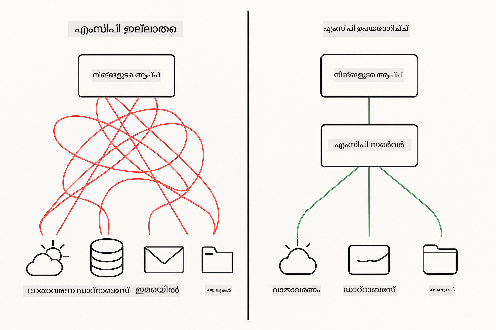
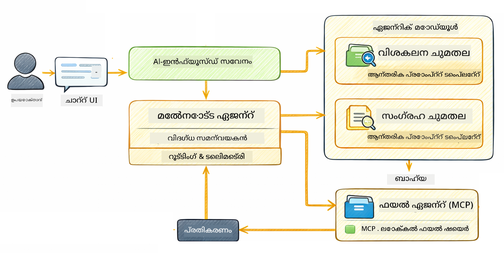

<!--
CO_OP_TRANSLATOR_METADATA:
{
  "original_hash": "f89f4c106d110e4943c055dd1a2f1dff",
  "translation_date": "2025-12-31T08:03:14+00:00",
  "source_file": "05-mcp/README.md",
  "language_code": "ml"
}
-->
# Module 05: Model Context Protocol (MCP)

## Table of Contents

- [നിങ്ങൾ പഠിക്കാനിരിക്കുന്നതെ](../../../05-mcp)
- [MCP എന്താണ്?](../../../05-mcp)
- [MCP എങ്ങനെ പ്രവർത്തിക്കുന്നു](../../../05-mcp)
- [എജന്റിക് മോഡ്യൂൾ](../../../05-mcp)
- [ഉദാഹരണങ്ങൾ പ്രവർത്തിപ്പിക്കൽ](../../../05-mcp)
  - [ആവശ്യമായ നിബന്ധനകൾ](../../../05-mcp)
- [ക്വിക്ക് സ്റ്റാർട്ട്](../../../05-mcp)
  - [ഫയൽ ഓപ്പറേഷനുകൾ (Stdio)](../../../05-mcp)
  - [സൂപ്പർവൈസർ ഏജന്റ്](../../../05-mcp)
    - [ഔട്ട്‌പുട്ട് മനസ്സിലാക്കൽ](../../../05-mcp)
    - [എജന്റിക് മോഡ്യൂളുടെ ഭാഗങ്ങളുടേയും ഫീച്ചറുകളുടേയും വിശദീകരണം](../../../05-mcp)
- [പ്രധാന ആശയങ്ങൾ](../../../05-mcp)
- [അഭിനന്ദനങ്ങൾ!](../../../05-mcp)
  - [ഇനിയെന്താണ്?](../../../05-mcp)

## What You'll Learn

നിങ്ങൾ സംഭാഷണ സ്വഭാവമുള്ള AI ഉണ്ടാക്കി, പ്രോംപ്റ്റുകളിൽ പ്രാവീണ്യം നേടി, രേഖകളിൽ നിന്നുള്ള മറുപടികളെ ഗ്രൗണ്ടുചെയ്തു, ടൂളുകൾ ഉപയോഗിച്ച് ഏജന്റുകൾ ഉണ്ടാക്കി. പക്ഷേ ആ എല്ലാ ടൂളുകളും നിങ്ങളുടെ പ്രത്യേക अनुप്രയോഗത്തിനായി കസ്റ്റംമായി നിർമിച്ചിട്ടുണ്ട്. നിങ്ങളുടെ AI-ന് ആരും ഉണ്ടാക്കാനും പങ്കിടാനുമാകുന്ന സ്റാൻഡർഡൈസ്ഡ് ടൂൾ ഇക്കോസിസ്റ്റത്തിലേക്ക് ആക്‌സസ് നൽകാൻ നിങ്ങൾക്ക് കഴിയുകയാണെങ്കിൽ? ഈ മോഡ്യൂളിൽ, നിങ്ങൾ അതിന് വേണ്ടത് എങ്ങനെ ചെയ്യാമെന്ന് Model Context Protocol (MCP) மற்றும் LangChain4j-ന്റെ എജന്റിക് മോഡ്യൂൾ ഉപയോഗിച്ച് പഠിക്കും. ആദ്യം ഒരു ലളിതമായ MCP ഫയൽ റീഡർ കാണിക്കുകയും പിന്നീട് അത് Supervisor Agent പാറ്റേൺ ഉപയോഗിച്ച് എളുപ്പത്തിൽ അഡ്‌വാൻസ്ഡ് എജന്റിക് വര്‍ക്‌ഫ്ലോകളുമായി എങ്ങനെ ഇന്റഗ്രേറ്റ് ചെയ്യാമെന്നു കാണിക്കുകയും ചെയ്യും.

## What is MCP?

Model Context Protocol (MCP) അതേറാ — AI ആപ്ലിക്കേഷനുകൾക്ക് ബാഹ്യ ടൂളുകൾ കണ്ടെത്താനും ഉപയോഗിക്കാനും ഒരു സ്റാൻഡർഡ് മാർഗം നൽകുന്നു. ഓരോ ഡാറ്റാ സ്രോതസ്സും സേവനവും വേണ്ടി കസ്റ്റം ഇന്റഗ്രേഷനുകൾ എഴുതുന്നതിനുപകരം, അവരുടെ കപബിലിറ്റികള്‍ സുസ്ഥിര ഫോർമാറ്റിൽ എക്‌സ്‌പോസ് ചെയ്യുന്ന MCP സർവറുകളിൽ നിങ്ങൾ ബന്ധപ്പെടാം. പിന്നീട് നിങ്ങളുടെ AI ഏജന്റ് 自动മായി ഈ ടൂളുകൾ കണ്ടെത്തുകയും ഉപയോഗിക്കുകയും ചെയ്യാം.



*MCP ന് മുമ്പ്: സങ്കീർണ്ണമായ പോയിന്റ്-ടു-പോയിന്റ് ഇന്റഗ്രേഷനുകൾ. MCP കഴിഞ്ഞ്: ഒരു പ്രോട്ടോക്കോൾ, അനന്ത സാധ്യതകൾ.*

MCP AI ഡെവലപ്മെന്റ് ൽ ഒരു അടിസ്ഥാന പ്രശ്നം പരിഹരിക്കുന്നു: ഓരോ ഇന്റഗ്രേഷനും കസ്റ്റം ആയിരിക്കുകയാണ്. GitHub ആക്‌സസ് ചെയ്യാൻ ആഗ്രഹിക്കുന്നുണ്ടോ? കസ്റ്റം കോഡ്. ഫയലുകൾ വായിക്കാൻ ആഗ്രഹമുണ്ടോ? കസ്റ്റം കോഡ്. ഡാറ്റാബേസ് ക്വെറി ചെയ്യണമോ? കസ്റ്റം കോഡ്. അവയിൽ ഒന്നും മറ്റു AI ആപ്ലിക്കേഷനുകളുമായി പ്രവർത്തിക്കുകയില്ല.

MCP ഇതിനെ സ്റ്റാൻഡർഡൈസ് ചെയ്യുന്നു. ഒരു MCP സർവർ വിശദമായ വിവരണങ്ങളും സ്കീമകളോടുകൂടി ടൂളുകൾ എക്‌സ്‌പോസു ചെയ്യുന്നു. ഏത് MCP ക്ലയന്റും കണക് ചെയ്ത് ലഭ്യമായ ടൂളുകൾ കണ്ടെത്തുകയും ഉപയോഗിക്കുകയും ചെയ്യാം. ഒന്ന് നിർമ്മിക്കുക, എല്ലായിടത്തും ഉപയോഗിക്കുക.


*Model Context Protocol ആർക്കിടെക്ചർ - സ്റാൻഡർഡൈസ്ഡ് ടൂൾ കണ്ടെത്തൽയും പ്രവർത്തന നിർമ്മാണവും*

## How MCP Works

**Server-Client Architecture**

MCP ഒരു ക്ലയന്റ്-സെർവർ മോഡൽ ഉപയോഗിക്കുന്നു. സെർവറുകൾ ടൂളുകൾ നൽകുന്നു - ഫയലുകൾ വായിക്കൽ, ഡാറ്റാബേസുകൾ ക്വെറി ചെയ്യൽ, APIs വിളിക്കൽ. ക്ലയന്റുകൾ (നിങ്ങളുടെ AI ആപ്ലിക്കേഷൻ) സെർവറുകളുമായി കണക്റ്റ് ചെയ്യുകയും അവരുടെ ടൂളുകൾ ഉപയോഗിക്കുകയും ചെയ്യുന്നു.

LangChain4j-ഉം MCP കൂടി ഉപയോഗിക്കാൻ, ഈ Maven dependency കൂട്ടുക:

```xml
<dependency>
    <groupId>dev.langchain4j</groupId>
    <artifactId>langchain4j-mcp</artifactId>
    <version>${langchain4j.version}</version>
</dependency>
```

**Tool Discovery**

നിങ്ങളുടെ ക്ലയന്റ് ഒരു MCP സെർവറുമായി കണക്റ്റ് ചെയുമ്പോൾ, അത് ചോദിക്കുന്നു "നിങ്ങൾക്കുണ്ടായിരിക്കുന്ന ടൂളുകൾ എന്തെല്ലാം?" സെർവർ ലഭ്യമായ ടൂളുകളുടെ പട്ടികയും ഓരോതിന്റെയും വിവരണങ്ങളും പാരാമീറ്റർ സ്കീമകളും റിസ്പോൺസ് ആയി നൽകുന്നു. ഉപയോക്താവിന്റെ അഭ്യർത്ഥനകൾ അടിസ്ഥാനമാക്കി നിങ്ങളുടെ AI ഏജന്റ് പിന്നീട് ഉപയോഗിക്കേണ്ട ടൂളുകൾ തീരുമാനിച്ചെടുക്കാൻ കഴിയും.

**Transport Mechanisms**

MCP വ്യത്യസ്ത ട്രാൻസ്പോർട്ട് മെക്കാനിസമുകളും പിന്തുണയ്‌ക്കുന്നു. ഈ മോഡ്യൂൾ ലൊക്കൽ പ്രോസസ്സുകൾക്കായുള്ള Stdio ട്രാൻസ്പോർട്ട് ഡെമോ കാണിക്കുന്നു:


*MCP ട്രാൻസ്പോർട്ട് മെക്കാനിസങ്ങൾ: ശ്രീമാനല്ലാത്ത сервറുകൾക്കായി HTTP, ലൊക്കൽ പ്രോസസ്സുകൾക്കായി Stdio*

**Stdio** - [StdioTransportDemo.java](../../../05-mcp/src/main/java/com/example/langchain4j/mcp/StdioTransportDemo.java)

ലൊക്കൽ പ്രോസസ്സുകൾക്കായി. നിങ്ങളുടെ ആപ്ലിക്കേഷൻ ഒരു സെർവർ subprocess ആയി സ്പോൺ ചെയ്യുകയും സ്റ്റാൻഡേർഡ് ഇൻപുട്ട്/ഓട്ട്പുട്ടിലൂടെ സംവദിക്കുകയും ചെയ്യുന്നു. ഫയൽസിസ്റ്റം ആക്‌സസ് അല്ലെങ്കിൽ കമാൻഡ്-ലൈൻ ടൂളുകൾക്കായി ഇത് ഉപകാരപ്രദമാണ്.

```java
McpTransport stdioTransport = new StdioMcpTransport.Builder()
    .command(List.of(
        npmCmd, "exec",
        "@modelcontextprotocol/server-filesystem@2025.12.18",
        resourcesDir
    ))
    .logEvents(false)
    .build();
```

> **🤖 Try with [GitHub Copilot](https://github.com/features/copilot) Chat:** Open [`StdioTransportDemo.java`](../../../05-mcp/src/main/java/com/example/langchain4j/mcp/StdioTransportDemo.java) and ask:
> - "Stdio ട്രാൻസ്പോർട്ട് എങ്ങനെ പ്രവർത്തിക്കുന്നു, HTTP ന്റെ сравненൽ 언제 사용해야 합니다?"
> - "LangChain4j spawn ചെയ്ത MCP സെർവർ പ്രോസസുകളുടെ ലൈഫ്സൈക്കിള്‍ എങ്ങനെ മാനേജ് ചെയ്യുന്നു?"
> - "AI-ന് ഫയൽ സിസ്റ്റം ആക്‌സസ് നൽകുന്നതിന്റെ സുരക്ഷാ പരിഗണനകൾ എന്തെല്ലാം?"

## The Agentic Module

MCP സ്റാൻഡർഡൈസ്ഡ് ടൂളുകൾ നൽകുന്നപ്പോൾ, LangChain4j-ന്റെ **agentic module** ആ ടൂൾകളെ ഓർക്കസ്ട്രേറ്റ് ചെയ്യുന്ന ഏജന്റുകൾ നിർമ്മിക്കാൻ ഒരു പ്രഖ്യാപനപരമായ മാർഗം (declarative way) നൽകുന്നു. `@Agent` അനോടെഷനും `AgenticServices` ഉം നിങ്ങളുടെ ഏജന്റ് പെരുമാറ്റം ഇന്നർഫേസുകൾ മുഖേന നിർവചനാത്മകമായി നിർവചിക്കാൻ അനുവദിക്കുന്നു, നിർദ്ദേശാത്മക കോഡിന്റെ പകരം.

ഈ മോഡ്യൂളിൽ, നിങ്ങൾ **Supervisor Agent** പാറ്റേൺ പരിശോധിക്കും — ഉപയോക്താവിന്റെ അഭ്യർത്ഥനകൾ അടിസ്ഥാനമാക്കി ഏതെല്ലാ സബ്-ഏജന്റുകൾ വിളിക്കണമെന്ന് ഡൈനമികമായി നിർണ്ണയിക്കുന്ന ഒരു അഡ്വാൻസ്ഡ് എജന്റിക് AI സമീപനം. ഞങ്ങൾ രണ്ട് ആശയങ്ങളും സംയോജിപ്പിച്ച് ഞങ്ങളുടെ ഒരു സബ്-ഏജന്റിന് MCP-ചാലിത ഫയൽ ആക്‌സസ് കഴിയുന്ന വിധത്തിൽ നൽകും.

എജന്റിക് മോഡ്യൂൾ ഉപയോഗിക്കാൻ, ഈ Maven dependency കൂട്ടുക:

```xml
<dependency>
    <groupId>dev.langchain4j</groupId>
    <artifactId>langchain4j-agentic</artifactId>
    <version>${langchain4j.mcp.version}</version>
</dependency>
```

> **⚠️ Experimental:** `langchain4j-agentic` മോഡ്യൂൾ **പ്രായോഗിക പരീക്ഷണ ഘട്ടത്തിൽ** ആണ് (experimental) ۽ മാറ്റങ്ങൾക്ക് വിധേയമാണ്. AI അസിസ്റ്റന്റുകൾ നിർമ്മിക്കാനുള്ള സ്ഥിരതയുള്ള വഴി `langchain4j-core` ലെ കസ്റ്റം ടൂളുകളാണ് (Module 04).

## Running the Examples

### Prerequisites

- Java 21+, Maven 3.9+
- Node.js 16+ and npm (for MCP servers)
- പരിസ്ഥിതി വേരിയബിളുകൾ `.env` ഫയൽ-ൽ കോൺഫിഗർ ചെയിട്ടുണ്ട് (root ഡയറക്ടറിയിൽ നിന്നും):
  - **StdioTransportDemo-യ്ക്കായി:** `GITHUB_TOKEN` (GitHub Personal Access Token)
  - **SupervisorAgentDemo-യ്ക്ക്:** `AZURE_OPENAI_ENDPOINT`, `AZURE_OPENAI_API_KEY`, `AZURE_OPENAI_DEPLOYMENT` (Module 01-04-ലുമായി նույնം)

> **Note:** നിങ്ങൾ ഇനിയും പരിസ്ഥിതി വേരിയബിളുകൾ സജ്ജീകരിച്ചിട്ടില്ലെങ്കിൽ, നിർദ്ദേശങ്ങൾക്ക് [Module 00 - Quick Start](../00-quick-start/README.md) കാണുക, അല്ലെങ്കിൽ root ഡയറക്ടറിയിൽ `.env.example` നെ `.env` ആയി പകർത്തി മൂല്യങ്ങൾ നൽകുക.

## Quick Start

**VS Code ഉപയോഗിച്ച്:** Explorer-ലിലെ ഏതെങ്കിലും ഡെമോ ഫയലിൽ റൈറ്റ്-ক്ലിക്ക് ചെയ്ത് **"Run Java"** തിരഞ്ഞെടുക്കുക, അല്ലെങ്കിൽ Run and Debug പാനലിൽ നിന്നുള്ള ലാഞ്ച് കോൺഫിഗറേഷനുകൾ ഉപയോഗിക്കുക (ആദ്യം `.env` ഫയലിൽ നിങ്ങളുടെ ടോക്കൺ ചേർത്തിട്ടുണ്ടെന്ന് ഉറപ്പാക്കുക).

**Maven ഉപയോഗിച്ച്:** അല്ലെങ്കിൽ, താഴെ കാണുന്ന ഉദാഹരണങ്ങളോടുകൂടി കമാൻഡ് ലൈൻ നിന്ന് നിങ്ങൾ റൺ ചെയ്യാം.

### File Operations (Stdio)

ഇത് ലൊക്കൽ subprocess-ആധാരിത ടൂളുകൾ കാണിക്കുന്നു.

**✅ മുൻകരുതലുകൾ വേണ്ടതില്ല** - MCP സർവർ സ്വയം സ്പോൺ ചെയ്യപ്പെടും.

**VS Code ഉപയോഗിച്ച്:** `StdioTransportDemo.java`-യിൽ റൈറ്റ്-क്ലിക്ക് ചെയ്ത് **"Run Java"** തിരഞ്ഞെടുക്കുക.

**Maven ഉപയോഗിച്ച്:**

**Bash:**
```bash
export GITHUB_TOKEN=your_token_here
cd 05-mcp
mvn compile exec:java -Dexec.mainClass=com.example.langchain4j.mcp.StdioTransportDemo
```

**PowerShell:**
```powershell
$env:GITHUB_TOKEN=your_token_here
cd 05-mcp
mvn --% compile exec:java -Dexec.mainClass=com.example.langchain4j.mcp.StdioTransportDemo
```

ആപ്ലിക്കേഷൻ ഒരു ഫയൽസിസ്റ്റം MCP സെർവർ സ്വയം സ്പോൺ ചെയ്ത് ഒരു ലോക്കൽ ഫയൽ വായിക്കുന്നു. subprocess മാനേജ്‌മെന്റ് എങ്ങനെ കൈകാര്യം ചെയ്യപ്പെടുന്നു എന്ന് ശ്രദ്ധിക്കുക.

**പ്രതീക്ഷിച്ച ഔട്ട്‌പുട്ട്:**
```
Assistant response: The file provides an overview of LangChain4j, an open-source Java library
for integrating Large Language Models (LLMs) into Java applications...
```

### Supervisor Agent




**Supervisor Agent പാറ്റേൺ** ഒരു **ഫ്ലെക്സിബിൾ** എജന്റിക് AI രൂപമാണ്. നിർണ്ണയાત્મક വർക്‌ഫ്ലോകളിൽ നിന്നാണ് വ്യത്യസ്തം (ക്രമപ്രകാരമാണ്, ലൂപ്പ്, പാരലൽ) — ഒരു സൂപ്പർവൈസർ LLM ഉപയോഗിച്ച് ഉപയോക്താവിന്റെ അഭ്യർത്ഥന അടിസ്ഥാനമാക്കി സ്വതന്ത്രമായി ഏത് ഏജന്റുകളെ വിളിക്കാമെന്ന് തീരുമാനിക്കുന്നു.

**Supervisor-നെ MCP-യുമായി സംയോജിപ്പിക്കൽ:** ഈ ഉദാഹരണത്തിൽ, `FileAgent`-ന് `toolProvider(mcpToolProvider)` വഴി MCP ഫയൽ സിസ്റ്റം ടൂളുകളുടെ ആക്‌സസ് നമുക്ക് നൽകുന്നു. ഒരു ഉപയോക്താവ് "ഫയൽ വായിച്ചു വിശകലനം ചെയ്യുക" എന്ന് ചോദിക്കുമ്പോൾ, Supervisor അഭ്യർത്ഥന വിശകലനം ചെയ്ത് ഒരു എക്സിക്യൂഷൻ പ്ലാൻ നിർമ്മിക്കുന്നു. തുടർന്ന് അത് ആവശ്യപ്പെടുന്ന രീതിയിൽ `FileAgent`-ലേക്ക് റൂട്ടുചെയ്യുന്നു, ഇത് MCP-യുടെ `read_file` ടൂൾ ഉപയോഗിച്ച് ഉള്ളടക്കം നേടി. Supervisor ആ ഉള്ളടക്കം `AnalysisAgent`-ലേക്ക് നിർവചിക്കുന്നതിന് അയക്കുന്നു, ആവശ്യമായെങ്കിൽ `SummaryAgent`-നെ വിളിച്ച് ഫലത്തെ സംക്ഷിപ്തമാക്കും.

ഇത് MCP ടൂളുകൾ എജന്റിക് വർക്‌ഫ്ലോകളിൽ എളുപ്പത്തിൽ എങ്ങനെ ഇന്റഗ്രേറ്റ് ചെയ്യാമെന്ന് കാണിക്കുന്നു — Supervisor എങ്ങനെ ഫയലുകൾ വായിക്കപ്പെടുന്നുവെന്ന് അറിയേണ്ടതില്ല, വെറും `FileAgent` അത് ചെയ്യാൻ കഴിയും എന്നു ധരിപ്പിച്ചാലേ മതിയാകൂ. Supervisor വിവിധ തരത്തിലുള്ള അഭ്യർത്ഥനകൾക്ക് ഡൈനമിക് ആയി അഡാപ്റ്റ് ചെയ്യുകയും അവസാന ഏജന്റിന്റെ മറുപടിയോ മുഴുവൻ ഓപറേഷനുകളുടെ സംക്ഷേപമോ واپس നൽകുകയും ചെയ്യുന്നു.

**Start സ്‌ക്രിപ്റ്റുകൾ ഉപയോഗിക്കുക (ശുപാർശ):**

Start സ്‌ക്രിപ്റ്റുകൾ root `.env` ഫയൽ നിന്ന് പരിസ്ഥിതി വേരിയബിളുകൾ സ്വയം ലോഡ് ചെയ്യുന്നു:

**Bash:**
```bash
cd 05-mcp
chmod +x start.sh
./start.sh
```

**PowerShell:**
```powershell
cd 05-mcp
.\start.ps1
```

**VS Code ഉപയോഗിച്ച്:** `SupervisorAgentDemo.java`-ൽ റൈറ്റ്-क്ലിക് ചെയ്ത് **"Run Java"** തിരഞ്ഞെടുക്കുക (`.env` ഫയൽ കോൺഫിഗർ ചെയ്തിട്ടുണ്ടെന്ന് ഉറപ്പാക്കുക).

**Supervisor എങ്ങനെ പ്രവർത്തിക്കുന്നു:**

```java
// നിശ്ചിത കഴിവുകളുള്ള പല ഏജന്റുകളും നിർവചിക്കുക
FileAgent fileAgent = AgenticServices.agentBuilder(FileAgent.class)
        .chatModel(model)
        .toolProvider(mcpToolProvider)  // ഫയൽ പ്രവർത്തനങ്ങൾക്ക് MCP ഉപകരണങ്ങൾ ഉണ്ട്
        .build();

AnalysisAgent analysisAgent = AgenticServices.agentBuilder(AnalysisAgent.class)
        .chatModel(model)
        .build();

SummaryAgent summaryAgent = AgenticServices.agentBuilder(SummaryAgent.class)
        .chatModel(model)
        .build();

// ഈ ഏജന്റുകളെ ഏകോപിപ്പിക്കുന്ന ഒരു സൂപ്പർവൈസർ സൃഷ്ടിക്കുക
SupervisorAgent supervisor = AgenticServices.supervisorBuilder()
        .chatModel(model)  // "planner" മോഡൽ
        .subAgents(fileAgent, analysisAgent, summaryAgent)
        .responseStrategy(SupervisorResponseStrategy.SUMMARY)
        .build();

// സൂപ്പർവൈസർ സ്വയം ഏജന്റുകളെ ആരെയൊക്കെ വിളിക്കണമെന്ന് തീരുമാനിക്കുന്നു
// വെറും ഒരു സ്വാഭാവിക ഭാഷാ അഭ്യർത്ഥന നൽകുക - LLM നടപ്പാക്കൽ പദ്ധതിയിടുന്നു
String response = supervisor.invoke("Read the file at /path/file.txt and analyze it");
```

സമ്പൂർണ ഇംപ്ലിമെന്റേഷൻ കാണാൻ [SupervisorAgentDemo.java](../../../05-mcp/src/main/java/com/example/langchain4j/mcp/SupervisorAgentDemo.java) കാണുക.

> **🤖 Try with [GitHub Copilot](https://github.com/features/copilot) Chat:** Open [`SupervisorAgentDemo.java`](../../../05-mcp/src/main/java/com/example/langchain4j/mcp/SupervisorAgentDemo.java) and ask:
> - "Supervisor ഏജന്റുകളെ ഇടപെടുവാൻ എങ്ങനെ തീരുമാനിക്കുന്നു?"
> - "Supervisor workflow pattern-ഉം Sequential workflow pattern-ഉം തമ്മിലുള്ള വ്യത്യാസം എന്താണ്?"
> - "Supervisor-ന്റെ പ്ലാനിംഗ് പെരുമാറ്റം എങ്ങനെ കസ്റ്റമൈസ് ചെയ്യാം?"

#### Understanding the Output

ഡെമോ റൺ ചെയ്യുമ്പോൾ Supervisor എങ്ങനെയാണ് متعدد ഏജന്റുകളെ ഓർക്കസ്ട്രേറ്റ് ചെയ്യുന്നത് എന്നതിന്റെ ഘടനാപൂരിതമായ വാക്കിവിവരണം നിങ്ങൾ കാണുകയും ചെയ്യും. ഓരോ വിഭാഗത്തിന്റെ അർത്ഥം:

```
======================================================================
  SUPERVISOR AGENT DEMO
======================================================================

This demo shows how a Supervisor Agent orchestrates multiple specialized agents.
The Supervisor uses an LLM to decide which agent to call based on the task.
```

**ഹെഡർ** ഡെമോ പരിചയപ്പെടുത്തുകയും കോർ കോൺസെപ്റ്റ് വിശദീകരിക്കുകയും ചെയ്യുന്നു: Supervisor ഒരു LLM (ഹാർഡ്‌കോഡഡ് നിയമങ്ങൾ അല്ല) ഉപയോഗിച്ച് ഏജന്റുകളെ വിളിക്കുമെന്നും തീരുമാനിക്കുന്നു.

```
--- AVAILABLE AGENTS -------------------------------------------------
  [FILE]     FileAgent     - Reads files using MCP filesystem tools
  [ANALYZE]  AnalysisAgent - Analyzes content for structure, tone, and themes
  [SUMMARY]  SummaryAgent  - Creates concise summaries of content
```

**ലഭ്യമായ ഏജന്റുകൾ** Supervisor തിരഞ്ഞെടുക്കാവുന്ന മൂന്ന് സ്പെഷലൈസ്ഡ് ഏജന്റുകളാണ് കാണിക്കുന്നത്. ഓരോ ഏജന്റിനും ഒരു പ്രത്യേക കഴിവുണ്ട്:
- **FileAgent** MCP ടൂളുകൾ ഉപയോഗിച്ച് ഫയലുകൾ വായിക്കാൻ കഴിയും (ബാഹ്യ ശേഷി)
- **AnalysisAgent** ഉള്ളടക്കം വിശകലനം ചെയ്യുന്നു (ശുദ്ധമായ LLM ശേഷി)
- **SummaryAgent** സംക്ഷേപങ്ങൾ സൃഷ്ടിക്കുന്നു (ശുദ്ധമായ LLM ശേഷി)

```
--- USER REQUEST -----------------------------------------------------
  "Read the file at .../file.txt and analyze what it's about"
```

**User Request** എന്താണ് ചോദിച്ചതെന്ന് കാണിക്കുന്നു. Supervisor ഇത് പാഴ്സുചെയ്ത് ഏജന്റുകൾ തിരഞ്ഞെടുക്കേണ്ടതായിരിക്കും.

```
--- SUPERVISOR ORCHESTRATION -----------------------------------------
  The Supervisor will now decide which agents to invoke and in what order...

  +-- STEP 1: Supervisor chose -> FileAgent (reading file via MCP)
  |
  |   Input: .../file.txt
  |
  |   Result: LangChain4j is an open-source Java library designed to simplify...
  +-- [OK] FileAgent (reading file via MCP) completed

  +-- STEP 2: Supervisor chose -> AnalysisAgent (analyzing content)
  |
  |   Input: LangChain4j is an open-source Java library...
  |
  |   Result: Structure: The content is organized into clear paragraphs that int...
  +-- [OK] AnalysisAgent (analyzing content) completed
```

**Supervisor Orchestration** വൻവിധേയമായ ഭാഗമാണ്. ഇതു നോക്കുക:
1. Supervisor **ആദ്യം FileAgent തിരഞ്ഞെടുക്കുന്നു** കാരണം അഭ്യർത്ഥനയിൽ "ഫയൽ വായിക്കുക" എന്നതു ഉണ്ട്
2. FileAgent MCP-യുടെ `read_file` ടൂൾ ഉപയോഗിച്ച് ഫയൽ ഉള്ളടക്കം നേടുന്നു
3. പിന്നീട് Supervisor **AnalysisAgent തിരഞ്ഞെടുക്കുന്നു** ആ ഫയൽ ഉള്ളടക്കം അതിന് കൈമാറുന്നു
4. AnalysisAgent ഘടന, ടോൺ, വിഷയങ്ങൾ വിശകലനം ചെയ്തു

ഉപയോക്താവിന്റെ അഭ്യർത്ഥന അടിസ്ഥാനമാക്കി Supervisor ഈ തീരുമാനങ്ങൾ **സ്വതന്ത്രമായി** എടുത്തതായി ശ്രദ്ധിക്കുക — ഹാർഡ്‌കോഡഡ് വർക്‌ഫ്ലോ ഇല്ല!

**Final Response** Supervisor സംയോജിതമായ മറുപടിയാണ്, അത് വിളിച്ച എല്ലാ ഏജന്റുകളിലെയും ഔട്ട്‌പുട്ടുകൾ സംയോജിപ്പിച്ച് ഒരുക്കിയതും. ഉദാഹരണം ഓരോ ഏജന്റും സേവ് ചെയ്ത സംക്ഷേപവും വിശകലന ഫലങ്ങളും കാണിക്കുന്ന എജന്റിക് സ്കോപ്പ് ഡംപ് ചെയ്യുന്നു.

```
--- FINAL RESPONSE ---------------------------------------------------
I read the contents of the file and analyzed its structure, tone, and key themes.
The file introduces LangChain4j as an open-source Java library for integrating
large language models...

--- AGENTIC SCOPE (Shared Memory) ------------------------------------
  Agents store their results in a shared scope for other agents to use:
  * summary: LangChain4j is an open-source Java library...
  * analysis: Structure: The content is organized into clear paragraphs that in...
```

### Explanation of Agentic Module Features

ഉദാഹരണം എജന്റിക് മോഡ്യൂളിന്റെ ഒന്നിലധികം അഡ്വാൻസ്ഡ് ഫീച്ചറുകൾ കാണിക്കുന്നു. Agentic Scope and Agent Listeners നെ കുറിച്ച് കൂടുതൽ സമീപനത്തോട് നോക്കാം.

**Agentic Scope** ഏജന്റുകൾ അവരുടെ ഫലങ്ങൾ `@Agent(outputKey="...")` ഉപയോഗിച്ച് എവിടെ സ്റ്റോർ ചെയ്‌തുവെന്ന് കാണിക്കുന്ന പങ്കിട്ട മെമറിയാണ്. ഇത് അനുവദിക്കുന്നു:
- പിന്നീട് വരുന്ന ഏജന്റുകൾക്ക് മുമ്പത്തെ ഏജന്റുകളുടെ ഔട്ട്‌പുട്ടുകൾ ആക്‌സസ് ചെയ്യാൻ
- Supervisor-ന് അന്തിമ മറുപടി സംയോജിപ്പിക്കാൻ
- നിങ്ങൾക്ക് ഓരോ ഏജന്റും എന്തെല്ലാം ഉത്പാദിപ്പിച്ചോ എന്ന് നിരീക്ഷിക്കാൻ

```java
ResultWithAgenticScope<String> result = supervisor.invokeWithAgenticScope(request);
AgenticScope scope = result.agenticScope();
String story = scope.readState("story");
List<AgentInvocation> history = scope.agentInvocations("analysisAgent");
```

**Agent Listeners** ഏജന്റ് എക്സിക്യൂഷൻ നിരീക്ഷണത്തിലും ഡീബഗിങിലും സഹായിക്കുന്നു. ഡെമോയിൽ കാണുന്ന ഘട്ടം-വൈസ് ഔട്ട്‌പുട്ട് ഒരു AgentListener-നാണ് നിന്നുമുള്ളത്, അത് ഓരോ ഏജന്റ് വിളിച്ചലിലും ഹുക്കുചെയ്യുന്നു:
- **beforeAgentInvocation** - Supervisor ഒരു ഏജന്റ് തിരഞ്ഞെടുക്കുമ്പോൾ വിളിക്കുന്നു, ഏജന്റ് എന്തിനായി തിരഞ്ഞെടുത്തു എന്നും എന്തുകൊണ്ടാണെന്ന് കാണിക്കുന്നു
- **afterAgentInvocation** - ഒരു ഏജന്റ് പൂർത്തിയായപ്പോൾ വിളിക്കുന്നു, അതിന്റെ ഫലം കാണിക്കുന്നു
- **inheritedBySubagents** - സത്യം ആയി സജ്ജമ ചെയ്താൽ, ലിസണർ ഹെറാർക്രിയിലെ എല്ലാ ഏജന്റുകൾക്കും നിരീക്ഷണം അനുവദിക്കുന്നു

```java
AgentListener monitor = new AgentListener() {
    private int step = 0;
    
    @Override
    public void beforeAgentInvocation(AgentRequest request) {
        step++;
        System.out.println("  +-- STEP " + step + ": " + request.agentName());
    }
    
    @Override
    public void afterAgentInvocation(AgentResponse response) {
        System.out.println("  +-- [OK] " + response.agentName() + " completed");
    }
    
    @Override
    public boolean inheritedBySubagents() {
        return true; // എല്ലാ ഉപഏജന്റുകളിലേക്കും പ്രചരിപ്പിക്കുക
    }
};
```

Supervisor പാറ്റേണിനു പുറത്തും, `langchain4j-agentic` മോഡ്യൂൾ നിരവധി ശക്തമായ വർക്ക്‌ഫ്ലോ പാറ്റേണുകളും ഫീച്ചറുകളും നൽകുന്നു:

| Pattern | Description | Use Case |
|---------|-------------|----------|
| **Sequential** | ഏജന്റുകൾ ക്രമത്തിൽ നടപ്പാക്കുക, ഔട്ട്‌പുട്ട് അടുത്തതിനായി ഫ്ലോ ചെയ്യുന്നു | പൈപ്ലൈനുകൾ: research → analyze → report |
| **Parallel** | ഏஜന്റുകൾ ഒരേ സമയത്ത് പ്രവർത്തിപ്പിക്കുക | സ്വതന്ത്ര ടാസ്കുകൾ: weather + news + stocks |
| **Loop** | നിശ്ചിത ശൃംഖല സത്യമായിരുന്നു വരെയും ആവർത്തിക്കുക | ഗുണനിലവാര സ്കോറിംഗ്: score ≥ 0.8 വരെ ശോദ്ധിക്കുക |
| **Conditional** | നിബന്ധനകൾ അടിസ്ഥാനമാക്കി റൂട്ടുചെയ്യുക | വർഗ്ഗീകരണം → സ്പെഷ്യലിസ്റ്റ് ഏജന്റിലേക്ക് റൂട്ടിംഗ് |
| **Human-in-the-Loop** | മനുഷ്യ ചെക്ക്പോയിന്റുകൾ ചേർക്കുക | അംഗീകാരം പ്രവൃത്തികൾ, ഉള്ളടക്ക റിവ്യൂ |

## Key Concepts

**MCP** നിലവിലുള്ള ടൂൾ ഇക്കോസിസ്റ്റങ്ങളിലൊത്ത് ലാഭമെടുക്കേണ്ടപ്പോൾ, ഒരേസമയം പല ആപ്ലിക്കേഷനുകളും പങ്കിടാവുന്ന ടൂളുകൾ നിർമ്മിക്കുമ്പോൾ, സ്റ്റാൻഡർഡ് പ്രോട്ടോക്കോളുകളോടെ തൃतीय-പക്ഷ സേവനങ്ങൾ ഇന്റഗ്രേറ്റ് ചെയ്യുമ്പോൾ, അല്ലെങ്കിൽ ടൂൾ ഇംപ്രിമെന്റേഷനുകൾ മാറ്റിക്കൊണ്ടിരുന്നാലും കോഡ് മാറ്റാതെ ഉപയോഗിക്കേണ്ടപ്പോൾ ഏറ്റവും അനുയോജ്യമാണ്.

**എജന്റിക് മോഡ്യൂൾ** `@Agent` അനോടെഷനുകളോടെ പ്രഖ്യാപനപരമായ ഏജന്റ് നിർവചനങ്ങൾ ആഗ്രഹിക്കുമ്പോൾ മികച്ചതാണ്, workflow ഓർക്കസ്ട്രേഷൻ (sequential, loop, parallel) ആവശ്യമായപ്പോൾ, ഇൻറർഫേസ്-അധിഷ്ഠിത ഏജന്റ് ഡിസൈൻ മുൻഗണനയുള്ളപ്പോൾ അല്ലെങ്കിൽ outputKey മുഖേന പങ്കിട്ട ഔട്ട്‌പുട്ടുകൾ ഉപയോഗിച്ച് متعدد ഏജന്റുകൾ സംയോജിപ്പിക്കുമ്പോൾ ഇത് ഉപയുക്തമാണ്.

**Supervisor Agent പാറ്റേൺ** മുന്നായി പ്രവചനീയമല്ലാത്ത workflow ഉം LLM-നെ ഉപയോഗിച്ച് തീരുമാനം എടുക്കാൻ നൽകേണ്ടതുള്ള പ്രതിഭാസങ്ങൾ ഉണ്ടാകുമ്പോൾ പ്രകാശിക്കുന്നു, متعدد സ്പെഷ്യലൈസ്ഡ് ഏജന്റുകൾക്കിടയിൽ ഡൈനാമിക് ഓർക്കസ്ട്രേഷൻ ആവശ്യമായപ്പോൾ, വിവിധ ശേഷികളിലേക്ക് റൂട്ടിംഗ് ചെയ്യുന്ന സംഭാഷണ സിസ്റ്റങ്ങൾ നിർമ്മിക്കുമ്പോൾ, അല്ലെങ്കിൽ ഏറ്റവും ഫ്ലെക്സിബിൾ, അഡാപ്റ്റീവ് ഏജന്റ് പെരുമാറ്റം ആവശ്യമുള്ളപ്പോൾ ഇത് ഏറ്റവും അനുയോജ്യമാണ്.

## Congratulations!

നിങ്ങൾ LangChain4j for Beginners കോഴ്സ് പൂര്‍ത്തിയാക്കി. നിങ്ങൾ പഠിച്ചു:

- മെമ്മറിയോടുകൂടിയ സംഭാഷണ AI നിർമ്മിക്കുന്നത് (Module 01)
- വ്യത്യസ്ത ടാസ്കുകൾക്കുള്ള പ്രോംപ്റ്റ് എൻജിനീയറിംഗ് പാറ്റേണുകൾ (Module 02)
- RAG ഉപയോഗിച്ച് നിങ്ങളുടെ രേഖകളിൽ നിന്നുള്ള മറുപടികളെ ഗ്രൗണ്ട് ചെയ്യുന്നത് (Module 03)
- കസ്റ്റം ടൂളുകൾ ഉപയോഗിച്ച് അടിസ്ഥാന AI ഏജന്റുകൾ (അസിസ്റ്റന്റുകൾ) നിർമ്മിക്കൽ (Module 04)
- LangChain4j MCP மற்றும் Agentic മോഡ്യൂളുകളുമായുള്ള സ്റ്റാൻഡാർഡൈസ്ഡ് ടൂളുകളുടെ സംയോജനം (Module 05)

### അടുത്തതായി എന്താണ്?

മൊഡ്യൂളുകൾ പൂർത്തിയാക്കിയതിനു ശേഷം LangChain4j ടെസ്റ്റിംഗ് ആശയങ്ങൾ പ്രവർത്തനത്തിൽ കാണാൻ [ടെസ്റ്റിംഗ് ഗൈഡ്](../docs/TESTING.md) പരിശോധിക്കുക.

**അധികൃത വിഭവങ്ങൾ:**
- [LangChain4j ഡോക്യുമെന്റേഷൻ](https://docs.langchain4j.dev/) - വ്യാപകമായ ഗൈഡുകളും API റഫറൻസും
- [LangChain4j GitHub](https://github.com/langchain4j/langchain4j) - സോഴ്‌സ് കോഡ് ಮತ್ತು ഉദാഹരണങ്ങൾ
- [LangChain4j ട്യൂട്ടോറിയലുകൾ](https://docs.langchain4j.dev/tutorials/) - വിവിധ ഉപയോഗക്കേസുകൾക്കുള്ള ഘട്ടംപ്രകാരം ട്യൂട്ടോറിയലുകൾ

ഈ കോഴ്‌സ് പൂർത്തിയാക്കിയതിന് നന്ദി!

---

**നാവിഗേഷൻ:** [← മുൻപ്: Module 04 - Tools](../04-tools/README.md) | [പ്രധാനത്തിലേക്ക്](../README.md)

---

<!-- CO-OP TRANSLATOR DISCLAIMER START -->
ഡിസ്‌ക്ലെയിമർ:
ഈ രേഖ AI വിവർത്തന സേവനമായ [Co-op Translator](https://github.com/Azure/co-op-translator) ഉപയോഗിച്ച് വിവർത്തനം ചെയ്തതാണ്. ഞങ്ങൾ വസ്തുതാസാധുതയ്ക്ക് ശ്രമിച്ചിരുന്നെങ്കിലും, ഓട്ടോമേറ്റഡ് വിവർത്തനങ്ങളിൽ പിശകുകളും അപ്രതീക്ഷിത അശുദ്ധതകളും ഉണ്ടാകാവുന്നതാണ് എന്ന് ദുര്യമാക്കി ശ്രദ്ധിക്കുക. മുല് രേഖ അതിന്റെ മാതൃഭാഷയിലെ പതിപ്പാണ് അധികാരപരമായ ഉറവിടം എന്ന് കരുതുക. നിർണായകമായ വിവരങ്ങൾക്ക് പ്രൊഫഷണൽ മനുഷ്യ വിവർത്തനം ശിപാർശ ചെയ്യപ്പെടുന്നു. ഈ വിവർത്തനത്തിന്റെ ഉപയോഗത്തിൽ നിന്നുണ്ടാകുന്ന ഏതൌ തെറ്റിദ്ധാരണകൾക്കും ഞങ്ങൾ ഉത്തരവാദികളല്ല.
<!-- CO-OP TRANSLATOR DISCLAIMER END -->