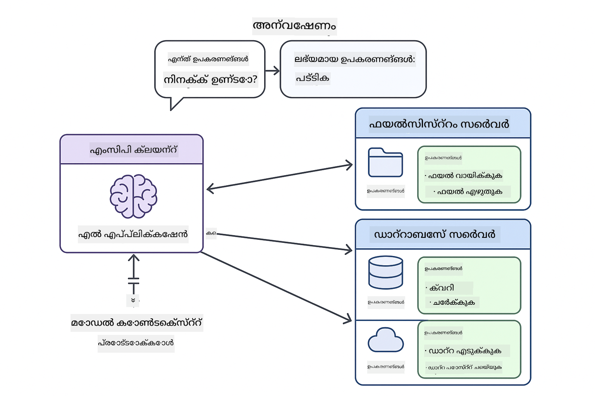

<!--
CO_OP_TRANSLATOR_METADATA:
{
  "original_hash": "c25ec1f10ef156c53e190cdf8b0711ab",
  "translation_date": "2025-12-13T18:15:04+00:00",
  "source_file": "05-mcp/README.md",
  "language_code": "ml"
}
-->
# Module 05: മോഡൽ കോൺടെക്സ്റ്റ് പ്രോട്ടോക്കോൾ (MCP)

## ഉള്ളടക്ക പട്ടിക

- [നിങ്ങൾ പഠിക്കാനിരിക്കുന്നതെന്ത്](../../../05-mcp)
- [MCP മനസ്സിലാക്കുക](../../../05-mcp)
- [MCP എങ്ങനെ പ്രവർത്തിക്കുന്നു](../../../05-mcp)
  - [സർവർ-ക്ലയന്റ് ആർക്കിടെക്ചർ](../../../05-mcp)
  - [ടൂൾ കണ്ടെത്തൽ](../../../05-mcp)
  - [ട്രാൻസ്പോർട്ട് മെക്കാനിസങ്ങൾ](../../../05-mcp)
- [ആവശ്യമായ മുൻകൂട്ടി അറിവുകൾ](../../../05-mcp)
- [ഈ മോഡ്യൂൾ ഉൾക്കൊള്ളുന്നത്](../../../05-mcp)
- [വേഗത്തിലുള്ള ആരംഭം](../../../05-mcp)
  - [ഉദാഹരണം 1: റിമോട്ട് കാൽക്കുലേറ്റർ (Streamable HTTP)](../../../05-mcp)
  - [ഉദാഹരണം 2: ഫയൽ ഓപ്പറേഷനുകൾ (Stdio)](../../../05-mcp)
  - [ഉദാഹരണം 3: Git വിശകലനം (Docker)](../../../05-mcp)
- [പ്രധാന ആശയങ്ങൾ](../../../05-mcp)
  - [ട്രാൻസ്പോർട്ട് തിരഞ്ഞെടുപ്പ്](../../../05-mcp)
  - [ടൂൾ കണ്ടെത്തൽ](../../../05-mcp)
  - [സെഷൻ മാനേജ്മെന്റ്](../../../05-mcp)
  - [ക്രോസ്-പ്ലാറ്റ്ഫോം പരിഗണനകൾ](../../../05-mcp)
- [എപ്പോൾ MCP ഉപയോഗിക്കണം](../../../05-mcp)
- [MCP പരിസ്ഥിതി](../../../05-mcp)
- [അഭിനന്ദനങ്ങൾ!](../../../05-mcp)
  - [അടുത്തത് എന്ത്?](../../../05-mcp)
- [പ്രശ്നപരിഹാരം](../../../05-mcp)

## നിങ്ങൾ പഠിക്കാനിരിക്കുന്നതെന്ത്

നിങ്ങൾ സംഭാഷണാത്മക AI നിർമ്മിച്ചു, പ്രോംപ്റ്റുകൾ കൈകാര്യം ചെയ്തു, ഡോക്യുമെന്റുകളിൽ അടിസ്ഥാനമാക്കിയുള്ള പ്രതികരണങ്ങൾ സൃഷ്ടിച്ചു, ടൂളുകളുള്ള ഏജന്റുകൾ സൃഷ്ടിച്ചു. എന്നാൽ ആ എല്ലാ ടൂളുകളും നിങ്ങളുടെ പ്രത്യേക ആപ്ലിക്കേഷനിനായി കസ്റ്റം-നിർമ്മിതമായവയാണ്. ആരും സൃഷ്ടിക്കുകയും പങ്കുവെക്കുകയും ചെയ്യാവുന്ന ഒരു സ്റ്റാൻഡേർഡൈസ്ഡ് ടൂൾ പരിസ്ഥിതിക്ക് നിങ്ങളുടെ AI ആക്‌സസ് നൽകാൻ കഴിയുമെങ്കിൽ?

Model Context Protocol (MCP) അതേത് നൽകുന്നു - AI ആപ്ലിക്കേഷനുകൾക്ക് ബാഹ്യ ടൂളുകൾ കണ്ടെത്താനും ഉപയോഗിക്കാനും ഒരു സ്റ്റാൻഡേർഡ് മാർഗം. ഓരോ ഡാറ്റാ സോഴ്‌സ് അല്ലെങ്കിൽ സർവീസിനും കസ്റ്റം ഇന്റഗ്രേഷനുകൾ എഴുതുന്നതിന് പകരം, നിങ്ങൾ MCP സർവറുകളുമായി ബന്ധപ്പെടുന്നു, അവ അവരുടെ കഴിവുകൾ സ്ഥിരമായ ഫോർമാറ്റിൽ പ്രദർശിപ്പിക്കുന്നു. നിങ്ങളുടെ AI ഏജന്റ് പിന്നീട് ഈ ടൂളുകൾ സ്വയം കണ്ടെത്തി ഉപയോഗിക്കാം.


*MCP മുൻപ്: സങ്കീർണ്ണമായ പോയിന്റ്-ടു-പോയിന്റ് ഇന്റഗ്രേഷനുകൾ. MCP ശേഷം: ഒരു പ്രോട്ടോക്കോൾ, അനന്ത സാധ്യതകൾ.*

## MCP മനസ്സിലാക്കുക

MCP AI വികസനത്തിലെ ഒരു അടിസ്ഥാന പ്രശ്നം പരിഹരിക്കുന്നു: ഓരോ ഇന്റഗ്രേഷനും കസ്റ്റമാണ്. GitHub ആക്‌സസ് ചെയ്യണമോ? കസ്റ്റം കോഡ്. ഫയലുകൾ വായിക്കണമോ? കസ്റ്റം കോഡ്. ഡാറ്റാബേസ് ക്വറി ചെയ്യണമോ? കസ്റ്റം കോഡ്. ഈ ഇന്റഗ്രേഷനുകൾ മറ്റേതെങ്കിലും AI ആപ്ലിക്കേഷനുകളുമായി പ്രവർത്തിക്കുന്നില്ല.

MCP ഇതിനെ സ്റ്റാൻഡേർഡൈസ് ചെയ്യുന്നു. ഒരു MCP സർവർ ടൂളുകൾ വ്യക്തമായ വിവരണങ്ങളോടും സ്കീമകളോടും കൂടി പ്രദർശിപ്പിക്കുന്നു. ഏതെങ്കിലും MCP ക്ലയന്റ് കണക്ട് ചെയ്ത് ലഭ്യമായ ടൂളുകൾ കണ്ടെത്തുകയും ഉപയോഗിക്കുകയും ചെയ്യാം. ഒരിക്കൽ നിർമ്മിച്ച് എല്ലായിടത്തും ഉപയോഗിക്കുക.



*Model Context Protocol ആർക്കിടെക്ചർ - സ്റ്റാൻഡേർഡൈസ്ഡ് ടൂൾ കണ്ടെത്തലും പ്രവർത്തനവും*

## MCP എങ്ങനെ പ്രവർത്തിക്കുന്നു

**സർവർ-ക്ലയന്റ് ആർക്കിടെക്ചർ**

MCP ഒരു ക്ലയന്റ്-സർവർ മോഡൽ ഉപയോഗിക്കുന്നു. സർവറുകൾ ടൂളുകൾ നൽകുന്നു - ഫയലുകൾ വായിക്കൽ, ഡാറ്റാബേസുകൾ ക്വറി ചെയ്യൽ, APIകൾ വിളിക്കൽ. ക്ലയന്റുകൾ (നിങ്ങളുടെ AI ആപ്ലിക്കേഷൻ) സർവറുകളുമായി കണക്ട് ചെയ്ത് അവരുടെ ടൂളുകൾ ഉപയോഗിക്കുന്നു.

**ടൂൾ കണ്ടെത്തൽ**

നിങ്ങളുടെ ക്ലയന്റ് MCP സർവറുമായി കണക്ട് ചെയ്യുമ്പോൾ, അത് ചോദിക്കുന്നു "നിങ്ങൾക്ക് എന്ത് ടൂളുകൾ ഉണ്ട്?" സർവർ ലഭ്യമായ ടൂളുകളുടെ പട്ടിക വിവരണങ്ങളോടും പാരാമീറ്റർ സ്കീമകളോടും കൂടി നൽകുന്നു. നിങ്ങളുടെ AI ഏജന്റ് ഉപയോക്തൃ അഭ്യർത്ഥനകളുടെ അടിസ്ഥാനത്തിൽ ഏത് ടൂളുകൾ ഉപയോഗിക്കാമെന്ന് തീരുമാനിക്കും.

**ട്രാൻസ്പോർട്ട് മെക്കാനിസങ്ങൾ**

MCP രണ്ട് ട്രാൻസ്പോർട്ട് മെക്കാനിസങ്ങൾ നിർവചിക്കുന്നു: റിമോട്ട് സർവറുകൾക്കായി HTTP, ലോക്കൽ പ്രോസസ്സുകൾക്കായി Stdio (Docker കണ്ടെയ്‌നറുകൾ ഉൾപ്പെടെ):


*MCP ട്രാൻസ്പോർട്ട് മെക്കാനിസങ്ങൾ: റിമോട്ട് സർവറുകൾക്കായി HTTP, ലോക്കൽ പ്രോസസ്സുകൾക്കായി Stdio (Docker കണ്ടെയ്‌നറുകൾ ഉൾപ്പെടെ)*

**Streamable HTTP** - [StreamableHttpDemo.java](../../../05-mcp/src/main/java/com/example/langchain4j/mcp/StreamableHttpDemo.java)

റിമോട്ട് സർവറുകൾക്കായി. നിങ്ങളുടെ ആപ്ലിക്കേഷൻ നെറ്റ്വർക്കിൽ എവിടെയെങ്കിലും പ്രവർത്തിക്കുന്ന ഒരു സർവറിലേക്ക് HTTP അഭ്യർത്ഥനകൾ അയയ്ക്കുന്നു. റിയൽ-ടൈം കമ്മ്യൂണിക്കേഷനായി Server-Sent Events ഉപയോഗിക്കുന്നു.

```java
McpTransport httpTransport = new StreamableHttpMcpTransport.Builder()
    .url("http://localhost:3001/mcp")
    .timeout(Duration.ofSeconds(60))
    .logRequests(true)
    .logResponses(true)
    .build();
```

> **🤖 [GitHub Copilot](https://github.com/features/copilot) ചാറ്റുമായി പരീക്ഷിക്കുക:** [`StreamableHttpDemo.java`](../../../05-mcp/src/main/java/com/example/langchain4j/mcp/StreamableHttpDemo.java) തുറന്ന് ചോദിക്കുക:
> - "Module 04 ലെ നേരിട്ടുള്ള ടൂൾ ഇന്റഗ്രേഷനുമായി MCP എങ്ങനെ വ്യത്യസ്തമാണ്?"
> - "ആപ്ലിക്കേഷനുകൾക്കിടയിൽ ടൂൾ പങ്കുവെക്കുന്നതിന് MCP ഉപയോഗിക്കുന്നതിന്റെ ഗുണങ്ങൾ എന്തെല്ലാം?"
> - "MCP സർവറുകളിലേക്ക് കണക്ഷൻ പരാജയങ്ങൾ അല്ലെങ്കിൽ ടൈംഔട്ടുകൾ എങ്ങനെ കൈകാര്യം ചെയ്യാം?"

**Stdio** - [StdioTransportDemo.java](../../../05-mcp/src/main/java/com/example/langchain4j/mcp/StdioTransportDemo.java)

ലോക്കൽ പ്രോസസ്സുകൾക്കായി. നിങ്ങളുടെ ആപ്ലിക്കേഷൻ ഒരു സർവർ subprocess ആയി ആരംഭിച്ച് സ്റ്റാൻഡേർഡ് ഇൻപുട്ട്/ഔട്ട്പുട്ട് വഴി ആശയവിനിമയം നടത്തുന്നു. ഫയൽസിസ്റ്റം ആക്‌സസിനോ കമാൻഡ്-ലൈൻ ടൂളുകൾക്കോ ഉപയോഗപ്രദം.

```java
McpTransport stdioTransport = new StdioMcpTransport.Builder()
    .command(List.of(
        npmCmd, "exec",
        "@modelcontextprotocol/server-filesystem@0.6.2",
        resourcesDir
    ))
    .logEvents(false)
    .build();
```

> **🤖 [GitHub Copilot](https://github.com/features/copilot) ചാറ്റുമായി പരീക്ഷിക്കുക:** [`StdioTransportDemo.java`](../../../05-mcp/src/main/java/com/example/langchain4j/mcp/StdioTransportDemo.java) തുറന്ന് ചോദിക്കുക:
> - "Stdio ട്രാൻസ്പോർട്ട് എങ്ങനെ പ്രവർത്തിക്കുന്നു, HTTP-യുമായി എപ്പോൾ ഉപയോഗിക്കണം?"
> - "LangChain4j MCP സർവർ പ്രോസസ്സുകളുടെ ലൈഫ്‌സൈക്കിൾ എങ്ങനെ മാനേജ് ചെയ്യുന്നു?"
> - "AI-യ്ക്ക് ഫയൽ സിസ്റ്റം ആക്‌സസ് നൽകുന്നതിന്റെ സുരക്ഷാ പ്രത്യാഘാതങ്ങൾ എന്തെല്ലാം?"

**Docker (Stdio ഉപയോഗിക്കുന്നു)** - [GitRepositoryAnalyzer.java](../../../05-mcp/src/main/java/com/example/langchain4j/mcp/GitRepositoryAnalyzer.java)

കണ്ടെയ്‌നറൈസ്ഡ് സർവീസുകൾക്കായി. `docker run` വഴി Docker കണ്ടെയ്‌നറുമായി stdio ട്രാൻസ്പോർട്ട് ഉപയോഗിച്ച് ആശയവിനിമയം നടത്തുന്നു. സങ്കീർണ്ണമായ ആശ്രിതങ്ങൾക്കോ വേർതിരിച്ച പരിസ്ഥിതികൾക്കോ അനുയോജ്യം.

```java
McpTransport dockerTransport = new StdioMcpTransport.Builder()
    .command(List.of(
        "docker", "run",
        "-e", "GITHUB_PERSONAL_ACCESS_TOKEN=" + System.getenv("GITHUB_TOKEN"),
        "-v", volumeMapping,
        "-i", "mcp/git"
    ))
    .logEvents(true)
    .build();
```

> **🤖 [GitHub Copilot](https://github.com/features/copilot) ചാറ്റുമായി പരീക്ഷിക്കുക:** [`GitRepositoryAnalyzer.java`](../../../05-mcp/src/main/java/com/example/langchain4j/mcp/GitRepositoryAnalyzer.java) തുറന്ന് ചോദിക്കുക:
> - "Docker ട്രാൻസ്പോർട്ട് MCP സർവറുകളെ എങ്ങനെ വേർതിരിക്കുന്നു, ഗുണങ്ങൾ എന്തെല്ലാം?"
> - "ഹോസ്റ്റ്-കണ്ടെയ്‌നർ ഡാറ്റ പങ്കുവെക്കാൻ വോള്യം മൗണ്ടുകൾ എങ്ങനെ കോൺഫിഗർ ചെയ്യാം?"
> - "പ്രൊഡക്ഷനിൽ Docker അടിസ്ഥാനമാക്കിയ MCP സർവർ ലൈഫ്‌സൈക്കിൾ മാനേജ്മെന്റിന് മികച്ച പ്രാക്ടീസുകൾ എന്തെല്ലാം?"

## ഉദാഹരണങ്ങൾ പ്രവർത്തിപ്പിക്കൽ

### ആവശ്യമായ മുൻകൂട്ടി അറിവുകൾ

- Java 21+, Maven 3.9+
- Node.js 16+ and npm (MCP സർവറുകൾക്കായി)
- **Docker Desktop** - ഉദാഹരണം 3-ന് **RUNNING** ആയിരിക്കണം (ഇൻസ്റ്റാൾ ചെയ്തതല്ല)
- GitHub Personal Access Token `.env` ഫയലിൽ കോൺഫിഗർ ചെയ്തിരിക്കണം (Module 00-ൽ നിന്നുള്ളത്)

> **കുറിപ്പ്:** GitHub ടോക്കൺ സജ്ജമാക്കിയിട്ടില്ലെങ്കിൽ, [Module 00 - Quick Start](../00-quick-start/README.md) കാണുക.

> **⚠️ Docker ഉപയോക്താക്കൾ:** ഉദാഹരണം 3 പ്രവർത്തിപ്പിക്കുന്നതിന് മുമ്പ് `docker ps` ഉപയോഗിച്ച് Docker Desktop പ്രവർത്തനക്ഷമമാണെന്ന് ഉറപ്പാക്കുക. കണക്ഷൻ പിശകുകൾ കാണുന്നുവെങ്കിൽ Docker Desktop ആരംഭിച്ച് ഏകദേശം 30 സെക്കൻഡ് കാത്തിരിക്കുക.

## വേഗത്തിലുള്ള ആരംഭം

**VS Code ഉപയോഗിച്ച്:** എക്സ്പ്ലോററിൽ ഏതെങ്കിലും ഡെമോ ഫയലിൽ റൈറ്റ്-ക്ലിക്ക് ചെയ്ത് **"Run Java"** തിരഞ്ഞെടുക്കുക, അല്ലെങ്കിൽ റൺ ആൻഡ് ഡീബഗ് പാനലിൽ നിന്നുള്ള ലോഞ്ച് കോൺഫിഗറേഷനുകൾ ഉപയോഗിക്കുക (മുൻപ് `.env` ഫയലിൽ ടോക്കൺ ചേർത്തിട്ടുണ്ടെന്ന് ഉറപ്പാക്കുക).

**Maven ഉപയോഗിച്ച്:** താഴെ കൊടുത്തിരിക്കുന്ന ഉദാഹരണങ്ങൾ കമാൻഡ് ലൈൻ വഴി പ്രവർത്തിപ്പിക്കാം.

**⚠️ പ്രധാനമാണ്:** ചില ഉദാഹരണങ്ങൾക്ക് മുൻകൂട്ടി ആവശ്യങ്ങൾ ഉണ്ട് (MCP സർവർ ആരംഭിക്കൽ അല്ലെങ്കിൽ Docker ഇമേജുകൾ നിർമ്മിക്കൽ). ഓരോ ഉദാഹരണത്തിന്റെ ആവശ്യങ്ങൾ പരിശോധിച്ച് പ്രവർത്തിപ്പിക്കുക.

### ഉദാഹരണം 1: റിമോട്ട് കാൽക്കുലേറ്റർ (Streamable HTTP)

ഇത് നെറ്റ്വർക്ക് അടിസ്ഥാനമാക്കിയ ടൂൾ ഇന്റഗ്രേഷൻ കാണിക്കുന്നു.

**⚠️ മുൻകൂട്ടി:** MCP സർവർ ആദ്യം ആരംഭിക്കണം (താഴെ ടർമിനൽ 1 കാണുക).

**ടർമിനൽ 1 - MCP സർവർ ആരംഭിക്കുക:**

**Bash:**
```bash
git clone https://github.com/modelcontextprotocol/servers.git
cd servers/src/everything
npm install
node dist/streamableHttp.js
```

**PowerShell:**
```powershell
git clone https://github.com/modelcontextprotocol/servers.git
cd servers/src/everything
npm install
node dist/streamableHttp.js
```

**ടർമിനൽ 2 - ഉദാഹരണം പ്രവർത്തിപ്പിക്കുക:**

**VS Code ഉപയോഗിച്ച്:** `StreamableHttpDemo.java`-യിൽ റൈറ്റ്-ക്ലിക്ക് ചെയ്ത് **"Run Java"** തിരഞ്ഞെടുക്കുക.

**Maven ഉപയോഗിച്ച്:**

**Bash:**
```bash
export GITHUB_TOKEN=your_token_here
cd 05-mcp
mvn compile exec:java -Dexec.mainClass=com.example.langchain4j.mcp.StreamableHttpDemo
```

**PowerShell:**
```powershell
$env:GITHUB_TOKEN=your_token_here
cd 05-mcp
mvn --% compile exec:java -Dexec.mainClass=com.example.langchain4j.mcp.StreamableHttpDemo
```

ഏജന്റ് ലഭ്യമായ ടൂളുകൾ കണ്ടെത്തുന്നത് കാണുക, തുടർന്ന് കാൽക്കുലേറ്റർ ഉപയോഗിച്ച് കൂട്ടിച്ചേർക്കൽ നടത്തുക.

### ഉദാഹരണം 2: ഫയൽ ഓപ്പറേഷനുകൾ (Stdio)

ഇത് ലോക്കൽ subprocess അടിസ്ഥാനമാക്കിയ ടൂളുകൾ കാണിക്കുന്നു.

**✅ മുൻകൂട്ടി ആവശ്യമില്ല** - MCP സർവർ സ്വയം subprocess ആയി ആരംഭിക്കും.

**VS Code ഉപയോഗിച്ച്:** `StdioTransportDemo.java`-യിൽ റൈറ്റ്-ക്ലിക്ക് ചെയ്ത് **"Run Java"** തിരഞ്ഞെടുക്കുക.

**Maven ഉപയോഗിച്ച്:**

**Bash:**
```bash
export GITHUB_TOKEN=your_token_here
cd 05-mcp
mvn compile exec:java -Dexec.mainClass=com.example.langchain4j.mcp.StdioTransportDemo
```

**PowerShell:**
```powershell
$env:GITHUB_TOKEN=your_token_here
cd 05-mcp
mvn --% compile exec:java -Dexec.mainClass=com.example.langchain4j.mcp.StdioTransportDemo
```

ആപ്ലിക്കേഷൻ സ്വയം ഫയൽസിസ്റ്റം MCP സർവർ subprocess ആയി ആരംഭിച്ച് ഒരു ലോക്കൽ ഫയൽ വായിക്കുന്നു. subprocess മാനേജ്മെന്റ് എങ്ങനെ കൈകാര്യം ചെയ്യപ്പെടുന്നു എന്ന് ശ്രദ്ധിക്കുക.

**പ്രതീക്ഷിക്കുന്ന ഔട്ട്പുട്ട്:**
```
Assistant response: The content of the file is "Kaboom!".
```

### ഉദാഹരണം 3: Git വിശകലനം (Docker)

ഇത് കണ്ടെയ്‌നറൈസ്ഡ് ടൂൾ സർവറുകൾ കാണിക്കുന്നു.

**⚠️ മുൻകൂട്ടി:** 
1. **Docker Desktop പ്രവർത്തനക്ഷമമായിരിക്കണം** (ഇൻസ്റ്റാൾ ചെയ്തതല്ല)
2. **Windows ഉപയോക്താക്കൾ:** WSL 2 മോഡ് ശുപാർശ ചെയ്യുന്നു (Docker Desktop Settings → General → "Use the WSL 2 based engine"). Hyper-V മോഡിന് മാനുവൽ ഫയൽ ഷെയറിംഗ് കോൺഫിഗറേഷൻ ആവശ്യമാണ്.
3. Docker ഇമേജ് ആദ്യം നിർമ്മിക്കണം (താഴെ ടർമിനൽ 1 കാണുക)

**Docker പ്രവർത്തനക്ഷമമാണെന്ന് പരിശോധിക്കുക:**

**Bash:**
```bash
docker ps  # ഒരു പിശക് അല്ല, കണ്ടെയ്‌നർ ലിസ്റ്റ് കാണിക്കണം
```

**PowerShell:**
```powershell
docker ps  # ഒരു പിശക് അല്ല, കണ്ടെയ്‌നർ ലിസ്റ്റ് കാണിക്കണം
```

"Cannot connect to Docker daemon" അല്ലെങ്കിൽ "The system cannot find the file specified" പോലുള്ള പിശകുകൾ കാണുന്നുവെങ്കിൽ Docker Desktop ആരംഭിച്ച് ഏകദേശം 30 സെക്കൻഡ് കാത്തിരിക്കുക.

**പ്രശ്നപരിഹാരം:**
- AI ശൂന്യമായ റിപോസിറ്ററി അല്ലെങ്കിൽ ഫയലുകൾ ഇല്ലെന്ന് റിപ്പോർട്ട് ചെയ്താൽ, വോള്യം മൗണ്ട് (`-v`) പ്രവർത്തിക്കുന്നില്ല.
- **Windows Hyper-V ഉപയോക്താക്കൾ:** പ്രോജക്ട് ഡയറക്ടറി Docker Desktop Settings → Resources → File sharing-ൽ ചേർക്കുക, തുടർന്ന് Docker Desktop പുനരാരംഭിക്കുക.
- **ശുപാർശ ചെയ്ത പരിഹാരം:** ഓട്ടോമാറ്റിക് ഫയൽ ഷെയറിംഗിനായി WSL 2 മോഡിലേക്ക് മാറുക (Settings → General → "Use the WSL 2 based engine" സജീവമാക്കുക).

**ടർമിനൽ 1 - Docker ഇമേജ് നിർമ്മിക്കുക:**

**Bash:**
```bash
cd servers/src/git
docker build -t mcp/git .
```

**PowerShell:**
```powershell
cd servers/src/git
docker build -t mcp/git .
```

**ടർമിനൽ 2 - അനലൈസർ പ്രവർത്തിപ്പിക്കുക:**

**VS Code ഉപയോഗിച്ച്:** `GitRepositoryAnalyzer.java`-യിൽ റൈറ്റ്-ക്ലിക്ക് ചെയ്ത് **"Run Java"** തിരഞ്ഞെടുക്കുക.

**Maven ഉപയോഗിച്ച്:**

**Bash:**
```bash
export GITHUB_TOKEN=your_token_here
cd 05-mcp
mvn compile exec:java -Dexec.mainClass=com.example.langchain4j.mcp.GitRepositoryAnalyzer
```

**PowerShell:**
```powershell
$env:GITHUB_TOKEN=your_token_here
cd 05-mcp
mvn --% compile exec:java -Dexec.mainClass=com.example.langchain4j.mcp.GitRepositoryAnalyzer
```

ആപ്ലിക്കേഷൻ Docker കണ്ടെയ്‌നർ ആരംഭിച്ച് നിങ്ങളുടെ റിപോസിറ്ററി മൗണ്ട് ചെയ്ത് AI ഏജന്റിലൂടെ റിപോസിറ്ററി ഘടനയും ഉള്ളടക്കവും വിശകലനം ചെയ്യുന്നു.

## പ്രധാന ആശയങ്ങൾ

**ട്രാൻസ്പോർട്ട് തിരഞ്ഞെടുപ്പ്**

നിങ്ങളുടെ ടൂളുകൾ എവിടെയാണ് എന്നതിന്റെ അടിസ്ഥാനത്തിൽ തിരഞ്ഞെടുക്കുക:
- റിമോട്ട് സർവീസുകൾ → Streamable HTTP
- ലോക്കൽ ഫയൽ സിസ്റ്റം → Stdio
- സങ്കീർണ്ണ ആശ്രിതങ്ങൾ → Docker

**ടൂൾ കണ്ടെത്തൽ**

MCP ക്ലയന്റുകൾ കണക്ട് ചെയ്യുമ്പോൾ ലഭ്യമായ ടൂളുകൾ സ്വയം കണ്ടെത്തുന്നു. നിങ്ങളുടെ AI ഏജന്റ് ടൂൾ വിവരണങ്ങൾ കാണുകയും ഉപയോക്തൃ അഭ്യർത്ഥനയുടെ അടിസ്ഥാനത്തിൽ ഉപയോഗിക്കാനുള്ള ടൂളുകൾ തീരുമാനിക്കുകയും ചെയ്യുന്നു.

**സെഷൻ മാനേജ്മെന്റ്**

Streamable HTTP ട്രാൻസ്പോർട്ട് സെഷനുകൾ നിലനിർത്തുന്നു, റിമോട്ട് സർവറുകളുമായി സ്റ്റേറ്റ്‌ഫുൾ ഇടപെടലുകൾ അനുവദിക്കുന്നു. Stdio, Docker ട്രാൻസ്പോർട്ടുകൾ സാധാരണയായി സ്റ്റേറ്റ്‌ലസ് ആണ്.

**ക്രോസ്-പ്ലാറ്റ്ഫോം പരിഗണനകൾ**

ഉദാഹരണങ്ങൾ പ്ലാറ്റ്ഫോം വ്യത്യാസങ്ങൾ സ്വയം കൈകാര്യം ചെയ്യുന്നു (Windows vs Unix കമാൻഡ് വ്യത്യാസങ്ങൾ, Docker-ക്കുള്ള പാത മാറ്റങ്ങൾ). വ്യത്യസ്ത പരിസ്ഥിതികളിൽ പ്രൊഡക്ഷൻ ഡിപ്ലോയ്മെന്റുകൾക്കായി ഇത് പ്രധാനമാണ്.

## എപ്പോൾ MCP ഉപയോഗിക്കണം

**MCP ഉപയോഗിക്കുക:**
- നിലവിലുള്ള ടൂൾ പരിസ്ഥിതികൾ പ്രയോജനപ്പെടുത്താൻ
- പല ആപ്ലിക്കേഷനുകളും ഉപയോഗിക്കുന്ന ടൂളുകൾ നിർമ്മിക്കാൻ
- സ്റ്റാൻഡേർഡ് പ്രോട്ടോക്കോളുകൾ ഉപയോഗിച്ച് മൂന്നാംകക്ഷി സർവീസുകൾ ഇന്റഗ്രേറ്റ് ചെയ്യാൻ
- കോഡ് മാറ്റങ്ങൾ ഇല്ലാതെ ടൂൾ ഇംപ്ലിമെന്റേഷനുകൾ മാറ്റാൻ

**കസ്റ്റം ടൂളുകൾ (Module 04) ഉപയോഗിക്കുക:**
- ആപ്ലിക്കേഷൻ-നിർദ്ദിഷ്ട ഫംഗ്ഷണാലിറ്റി നിർമ്മിക്കുമ്പോൾ
- പ്രകടനം നിർണായകമായപ്പോൾ (MCP ചില ഓവർഹെഡ് ഉണ്ടാക്കും)
- ടൂളുകൾ ലളിതമായവയും പുനരുപയോഗിക്കാത്തവയും ആണെങ്കിൽ
- പ്രവർത്തനം പൂർണ്ണമായി നിയന്ത്രിക്കേണ്ടതുണ്ടെങ്കിൽ

## MCP പരിസ്ഥിതി

Model Context Protocol ഒരു തുറന്ന സ്റ്റാൻഡേർഡാണ്, വളരുന്ന പരിസ്ഥിതിയോടുകൂടി:

- സാധാരണ ജോലികൾക്കുള്ള ഔദ്യോഗിക MCP സർവറുകൾ (ഫയൽസിസ്റ്റം, Git, ഡാറ്റാബേസുകൾ)
- വിവിധ സർവീസുകൾക്കുള്ള കമ്മ്യൂണിറ്റി സംഭാവനകൾ
- സ്റ്റാൻഡേർഡൈസ്ഡ് ടൂൾ വിവരണങ്ങളും സ്കീമകളും
- ക്രോസ്-ഫ്രെയിംവർക്ക് അനുയോജ്യത (ഏതെങ്കിലും MCP ക്ലയന്റുമായി പ്രവർത്തിക്കുന്നു)

ഈ സ്റ്റാൻഡേർഡൈസേഷൻ ഒരു AI ആപ്ലിക്കേഷനായി നിർമ്മിച്ച ടൂളുകൾ മറ്റുള്ളവയുമായി പ്രവർത്തിക്കാൻ അനുവദിക്കുന്നു, കഴിവുകളുടെ പങ്കുവെച്ച പരിസ്ഥിതി സൃഷ്ടിക്കുന്നു.

## അഭിനന്ദനങ്ങൾ!

നിങ്ങൾ LangChain4j for Beginners കോഴ്സ് പൂർത്തിയാക്കി. നിങ്ങൾ പഠിച്ചത്:

- മെമ്മറിയോടുകൂടിയ സംഭാഷണാത്മക AI നിർമ്മിക്കൽ (Module 01)
- വ്യത്യസ്ത ജോലികൾക്കുള്ള പ്രോംപ്റ്റ് എഞ്ചിനീയറിംഗ് പാറ്റേണുകൾ (Module 02)
- RAG ഉപയോഗിച്ച് ഡോക്യുമെന്റുകളിൽ അടിസ്ഥാനമാക്കിയുള്ള പ്രതികരണങ്ങൾ (Module 03)
- കസ്റ്റം ടൂളുകളുള്ള AI ഏജന്റുകൾ സൃഷ്ടിക്കൽ (Module 04)
- MCP വഴി സ്റ്റാൻഡേർഡൈസ്ഡ് ടൂളുകൾ ഇന്റഗ്രേറ്റ് ചെയ്യൽ (Module 05)

നിങ്ങൾക്ക് ഇപ്പോൾ പ്രൊഡക്ഷൻ AI ആപ്ലിക്കേഷനുകൾ നിർമ്മിക്കാൻ അടിസ്ഥാനമുണ്ട്. നിങ്ങൾ പഠിച്ച ആശയങ്ങൾ പ്രത്യേക ഫ്രെയിംവർക്ക് അല്ലെങ്കിൽ മോഡലുകൾക്ക് പരിമിതമല്ല - AI എഞ്ചിനീയറിംഗിലെ അടിസ്ഥാന പാറ്റേണുകളാണ്.

### അടുത്തത് എന്ത്?

മോഡ്യൂളുകൾ പൂർത്തിയാക്കിയ ശേഷം, LangChain4j ടെസ്റ്റിംഗ് ആശയങ്ങൾ പ്രവർത്തനത്തിൽ കാണാൻ [Testing Guide](../docs/TESTING.md) പരിശോധിക്കുക.

**അധികാരിക വിഭവങ്ങൾ:**
- [LangChain4j ഡോക്യുമെന്റേഷൻ](https://docs.langchain4j.dev/) - സമഗ്ര ഗൈഡുകളും API റഫറൻസും
- [LangChain4j GitHub](https://github.com/langchain4j/langchain4j) - സോഴ്‌സ് കോഡ്, ഉദാഹരണങ്ങൾ
- [LangChain4j ട്യൂട്ടോറിയലുകൾ](https://docs.langchain4j.dev/tutorials/) - വിവിധ ഉപയോഗകേസുകൾക്കുള്ള ഘട്ടം ഘട്ടം ട്യൂട്ടോറിയലുകൾ

ഈ കോഴ്സ് പൂർത്തിയാക്കിയതിന് നന്ദി!

---

**നാവിഗേഷൻ:** [← മുൻപ്: Module 04 - Tools](../04-tools/README.md) | [പ്രധാനത്തിലേക്ക് മടങ്ങുക](../README.md)

---

## പ്രശ്നപരിഹാരം

### PowerShell Maven കമാൻഡ് സിന്റാക്സ്
**പ്രശ്നം**: Maven കമാൻഡുകൾ `Unknown lifecycle phase ".mainClass=..."` എന്ന പിശക് കാണിച്ച് പരാജയപ്പെടുന്നു

**കാരണം**: PowerShell `=` നെ വേരിയബിൾ അസൈൻമെന്റ് ഓപ്പറേറ്ററായി വ്യാഖ്യാനിക്കുന്നു, Maven പ്രോപ്പർട്ടി സിന്റാക്സ് തകരുന്നു

**പരിഹാരം**: Maven കമാൻഡിന് മുമ്പ് സ്റ്റോപ്പ്-പാഴ്സിംഗ് ഓപ്പറേറ്റർ `--%` ഉപയോഗിക്കുക:

**PowerShell:**
```powershell
mvn --% compile exec:java -Dexec.mainClass=com.example.langchain4j.mcp.StreamableHttpDemo
```

**Bash:**
```bash
mvn compile exec:java -Dexec.mainClass=com.example.langchain4j.mcp.StreamableHttpDemo
```

`--%` ഓപ്പറേറ്റർ PowerShell-ന് ശേഷിക്കുന്ന എല്ലാ ആർഗ്യുമെന്റുകളും വ്യാഖ്യാനിക്കാതെ നേരിട്ട് Maven-ലേക്ക് പാസ്സ് ചെയ്യാൻ പറയുന്നു.

### Docker കണക്ഷൻ പ്രശ്നങ്ങൾ

**പ്രശ്നം**: Docker കമാൻഡുകൾ "Cannot connect to Docker daemon" അല്ലെങ്കിൽ "The system cannot find the file specified" എന്ന പിശക് കാണിക്കുന്നു

**കാരണം**: Docker Desktop പ്രവർത്തനക്ഷമമല്ല അല്ലെങ്കിൽ പൂർണ്ണമായി ഇൻഷിയലൈസ് ചെയ്തിട്ടില്ല

**പരിഹാരം**: 
1. Docker Desktop ആരംഭിക്കുക
2. പൂർണ്ണ ഇൻഷിയലൈസേഷനായി ഏകദേശം 30 സെക്കൻഡ് കാത്തിരിക്കുക
3. `docker ps` ഉപയോഗിച്ച് പരിശോധിക്കുക (പിശക് കാണിക്കാതെ കണ്ടെയ്‌നർ ലിസ്റ്റ് കാണിക്കണം)
4. തുടർന്ന് നിങ്ങളുടെ ഉദാഹരണം പ്രവർത്തിപ്പിക്കുക

### Windows Docker വോള്യം മൗണ്ടിംഗ്

**പ്രശ്നം**: Git റിപോസിറ്ററി അനലൈസർ ശൂന്യമായ റിപോസിറ്ററി അല്ലെങ്കിൽ ഫയലുകൾ കാണുന്നില്ല എന്ന് റിപ്പോർട്ട് ചെയ്യുന്നു

**കാരണം**: ഫയൽ ഷെയറിംഗ് കോൺഫിഗറേഷനു കാരണം വോള്യം മൗണ്ട് (`-v`) പ്രവർത്തിക്കുന്നില്ല

**പരിഹാരം**:
- **ശുപാർശ ചെയ്യുന്നത്:** WSL 2 മോഡിലേക്ക് മാറുക (Docker Desktop Settings → General → "Use the WSL 2 based engine")
- **മാറ്റുവഴി (Hyper-V):** പ്രോജക്ട് ഡയറക്ടറി Docker Desktop Settings → Resources → File sharing-ൽ ചേർക്കുക, തുടർന്ന് Docker Desktop റീസ്റ്റാർട്ട് ചെയ്യുക

---

<!-- CO-OP TRANSLATOR DISCLAIMER START -->
**അസൂയാപത്രം**:  
ഈ രേഖ AI വിവർത്തന സേവനം [Co-op Translator](https://github.com/Azure/co-op-translator) ഉപയോഗിച്ച് വിവർത്തനം ചെയ്തതാണ്. നാം കൃത്യതയ്ക്ക് ശ്രമിച്ചിട്ടുണ്ടെങ്കിലും, സ്വയം പ്രവർത്തിക്കുന്ന വിവർത്തനങ്ങളിൽ പിശകുകൾ അല്ലെങ്കിൽ തെറ്റുകൾ ഉണ്ടാകാമെന്ന് ദയവായി ശ്രദ്ധിക്കുക. അതിന്റെ മാതൃഭാഷയിലുള്ള യഥാർത്ഥ രേഖ അധികാരപരമായ ഉറവിടമായി കണക്കാക്കപ്പെടണം. നിർണായക വിവരങ്ങൾക്ക്, പ്രൊഫഷണൽ മനുഷ്യ വിവർത്തനം ശുപാർശ ചെയ്യപ്പെടുന്നു. ഈ വിവർത്തനം ഉപയോഗിക്കുന്നതിൽ നിന്നുണ്ടാകുന്ന ഏതെങ്കിലും തെറ്റിദ്ധാരണകൾക്കോ തെറ്റായ വ്യാഖ്യാനങ്ങൾക്കോ ഞങ്ങൾ ഉത്തരവാദികളല്ല.
<!-- CO-OP TRANSLATOR DISCLAIMER END -->