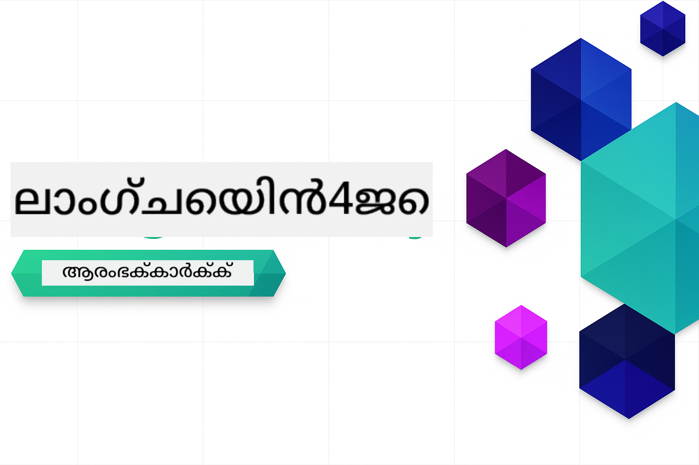
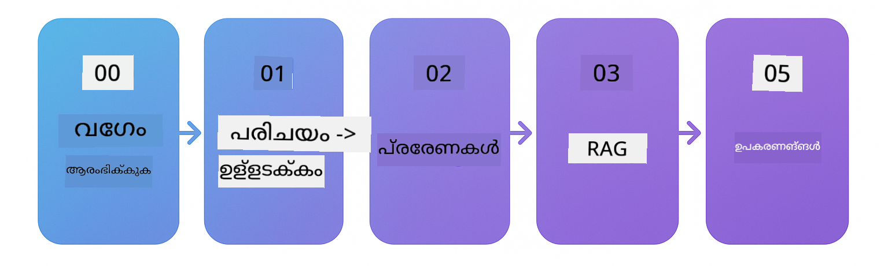

<!--
CO_OP_TRANSLATOR_METADATA:
{
  "original_hash": "1e85afe0b0ee47fc09b20442b0ee4ca5",
  "translation_date": "2025-12-23T11:34:25+00:00",
  "source_file": "README.md",
  "language_code": "ml"
}
-->


### 🌐 ബഹുഭാഷാ പിന്തുണ

#### GitHub Action വഴി പിന്തുണ (സ്വയംപ്രവർത്തിക്കുന്നതും എല്ലായ്പ്പോഴും അപ്-ടു-ഡേറ്റ്)

<!-- CO-OP TRANSLATOR LANGUAGES TABLE START -->
[അറബി](../ar/README.md) | [ബംഗാളി](../bn/README.md) | [ബൾഗേറിയൻ](../bg/README.md) | [ബർമീസ് (മ്യാൻമാർ)](../my/README.md) | [ചൈനീസ് (സിംപ്ലിഫൈഡ്)](../zh/README.md) | [ചൈനീസ് (പരമ്പരാഗതം, ഹോങ്കോങ്)](../hk/README.md) | [ചൈനീസ് (പരമ്പരാഗതം, മക്കാവോ)](../mo/README.md) | [ചൈനീസ് (പരമ്പരാഗതം, തായ്‌വാൻ)](../tw/README.md) | [ക്രൊവേഷ്യൻ](../hr/README.md) | [ചെക്ക്](../cs/README.md) | [ഡാനിഷ്](../da/README.md) | [ഡച്ച്](../nl/README.md) | [എസ്റ്റോണിയൻ](../et/README.md) | [ഫിന്നിഷ്](../fi/README.md) | [ഫ്രഞ്ച്](../fr/README.md) | [ജർമൻ](../de/README.md) | [ഗ്രീക്ക്](../el/README.md) | [ഹീബ്രു](../he/README.md) | [ഹിന്ദി](../hi/README.md) | [ഹംഗേറിയൻ](../hu/README.md) | [ഇൻഡോനേഷ്യൻ](../id/README.md) | [ഇറ്റാലിയൻ](../it/README.md) | [ജാപ്പനീസ്](../ja/README.md) | [ಕನ್ನಡ](../kn/README.md) | [കൊറിയൻ](../ko/README.md) | [ലിത്വാനിയൻ](../lt/README.md) | [മലേ](../ms/README.md) | [മലയാളം](./README.md) | [മറാത്തി](../mr/README.md) | [നേപ്പാളി](../ne/README.md) | [നൈജീരിയൻ പിഡ്ജിൻ](../pcm/README.md) | [നോർവീജിയൻ](../no/README.md) | [ഫാർസി (പേർഷ്യൻ)](../fa/README.md) | [പോളിഷ്](../pl/README.md) | [പോർച്ചുഗീസ് (ബ്രസീൽ)](../br/README.md) | [പോർച്ചുഗീസ് (പോർച്ചുഗൽ)](../pt/README.md) | [പഞ്ചാബി (ഗുരുമുഖി)](../pa/README.md) | [റൊമേനിയൻ](../ro/README.md) | [റഷ്യൻ](../ru/README.md) | [സെർബിയൻ (സിറിലിക്)](../sr/README.md) | [സ്ലോവാക്](../sk/README.md) | [സ്ലൊവേനിയൻ](../sl/README.md) | [സ്പാനിഷ്](../es/README.md) | [സ്വാഹിലി](../sw/README.md) | [സ്വീഡിഷ്](../sv/README.md) | [തഗാലോഗ് (ഫിലിപ്പിനോ)](../tl/README.md) | [തമിഴ്](../ta/README.md) | [തെലുങ്ക്](../te/README.md) | [തായ്](../th/README.md) | [തുർക്കിഷ്](../tr/README.md) | [ഉക്രെയ്നിയൻ](../uk/README.md) | [ഉർദു](../ur/README.md) | [വിയറ്റ്നാമീസ്](../vi/README.md)
<!-- CO-OP TRANSLATOR LANGUAGES TABLE END -->

# LangChain4j ആരംഭിക്കുന്നവർക്ക്

LangChain4j ഉം Azure OpenAI GPT-5 ഉം ഉപയോഗിച്ച് അടിസ്ഥാന ചാറ്റിൽ നിന്ന başlayിച്ചു AI ഏജന്റുകളിലേക്കുള്ള AI അപ്ലിക്കേഷനുകൾ നിർമ്മിക്കാൻ ഉള്ള ഒരു കോഴ്‌സ്.

**LangChain4j-ൽ പുതുമാണോ?** പ്രധാന പദങ്ങളും ആശയങ്ങളും നിർവചിക്കുന്നതിനായി [Glossary](docs/GLOSSARY.md) നോക്കുക.

## Table of Contents

1. [Quick Start](00-quick-start/README.md) - LangChain4j ഉപയോഗിച്ച് ആരംഭിക്കുക
2. [Introduction](01-introduction/README.md) - LangChain4j ന്റെയും അതിന്റെ അടിസ്ഥാന പ്രതിഭാസങ്ങളെയും പഠിക്കുക
3. [Prompt Engineering](02-prompt-engineering/README.md) - ഫലപ്രദമായ പ്രാമ്പ്റ്റ് രൂപകൽപ്പന習掌ിക്കുക
4. [RAG (Retrieval-Augmented Generation)](03-rag/README.md) - ബുദ്ധിമത്തയോടെ പ്രവര്‍ത്തിക്കുന്ന വിജ്ഞാനാധിഷ്ഠിത സിസ്റ്റങ്ങൾ നിർമിക്കുക
5. [Tools](04-tools/README.md) - AI ഏജന്റുകളുമായി ബാഹ്യ ടൂളുകളും APIs-ഉം സംയോജിപ്പിക്കുക
6. [MCP (Model Context Protocol)](05-mcp/README.md) - Model Context Protocol-നൊപ്പം പ്രവർത്തിക്കുക
---

##  Learning Path

> **Quick Start**

1. ഈ റീപോസിറ്ററി നിങ്ങളുടെ GitHub അക്കൗണ്ടിലേക്ക് Fork ചെയ്യുക
2. ക്ലിക്ക് ചെയ്യുക **Code** → **Codespaces** ടാബ് → **...** → **New with options...**
3. ഡിഫോൾട്ട് ക്രമീകരണങ്ങൾ ഉപയോഗിക്കുക – ഇതാണ് ഈ കോഴ്‌സ്‍ക്കായി സൃഷ്ടിച്ച Development container തിരഞ്ഞെടുക്കുന്നത്
4. ക്ലിക്ക് ചെയ്യുക **Create codespace**
5. പരിസ്ഥിതി തയ്യാറാകാൻ 5-10 മിനിറ്റ് വരെ കാത്തിരിക്കുക
6. തുടങ്ങാൻ നേരിട്ട് [Quick Start](./00-quick-start/README.md) സന്ദർശിക്കുക!

> **പ്രാദേശികമായി ക്ലോൺ ചെയ്യാൻ ഇഷ്ടമുണ്ടോ?**
>
> ഈ റീപോസിറ്ററിയിൽ 50-ലധികം ഭാഷാനുവാദങ്ങൾ ഉൾക്കൊള്ളുന്നുവെന്ന് ഡൗൺലോഡ് വലുപ്പം വളരെ വർധിപ്പിക്കുന്നു. പരിഭാഷകൾ ഇല്ലാതെ ക്ലോൺ ചെയ്യാൻ sparse checkout ഉപയോഗിക്കുക:
> ```bash
> git clone --filter=blob:none --sparse https://github.com/microsoft/LangChain4j-for-Beginners.git
> cd LangChain4j-for-Beginners
> git sparse-checkout set --no-cone '/*' '!translations' '!translated_images'
> ```
> ഇത് കോഴ്‍സ് പൂർത്തിയാക്കാൻ ആവശ്യമായ എല്ലാം വളരെ വേഗത്തിൽ ഡൗൺലോഡ് ചെയ്യാൻ നൽകും.

തുടങ്ങുക [Quick Start](00-quick-start/README.md) മോഡ്യൂളിലൂടെ, ഓരോ മോഡ്യൂളിലും കടന്ന് നിങ്ങളുടെ കഴിവുകൾ ഘട്ടം ഘട്ടമായി വളർത്തുക. അടിസ്ഥാന ആശയങ്ങൾ മനസ്സിലാക്കാൻ സാധാരണ ഉദാഹരണങ്ങൾ പരീക്ഷിക്കാനുള്ളതിനു ശേഷം GPT-5 ഉപയോഗിച്ച് കൂടുതൽ വിശദമായ പഠനത്തിനായി [Introduction](01-introduction/README.md) മോഡ്യൂളിലേക്ക് പോകുക.



മോഡ്യൂളുകൾ പൂർത്തീകരിച്ച ശേഷം LangChain4j ടെസ്റ്റിംഗ് ആശയങ്ങൾ പ്രവർത്തനക്ഷമമായി കാണാൻ [Testing Guide](docs/TESTING.md) അന്വേഷണിക്കുക.

> **ശ്രദ്ധിക്കുക:** ഈ പരിശീലനത്തിൽ GitHub Models-യും Azure OpenAI-യും ഇരുവരും ഉപയോഗിക്കുന്നു. [Quick Start](00-quick-start/README.md) மற்றும் [MCP](05-mcp/README.md) മോഡ്യൂളുകൾ GitHub Models ഉപയോഗിക്കുന്നു (Azure സബ്സ്ക്രിപ്ഷൻ ആവശ്യമില്ല), എന്നാൽ മോഡ്യൂളുകൾ 1-4 Azure OpenAI GPT-5 ഉപയോഗിക്കുന്നു.


## Learning with GitHub Copilot

കൊഡിംഗ് ഉടനെ തുടങ്ങാൻ, ഈ പ്രോജക്ട് GitHub Codespace-ൽ അല്ലെങ്കിൽ നൽകിയ devcontainer ഉൾപ്പെടെയുള്ള നിങ്ങളുടെ ലൊക്കൽ IDE-യിൽ തുറക്കുക. ഈ കോഴ്‌സിൽ ഉപയോഗിച്ച devcontainer GitHub Copilot-നെ AI പേയർഡ് പ്രോഗ്രാമിങിനായി മുൻകൂട്ടി കോൺഫിഗർ ചെയ്‌തതാണ്.

ഓരോ കോഡ് ഉദാഹരണവും GitHub Copilot-നോട് ചോദിക്കാൻ നിങ്ങൾക്ക് നിർദ്ദേശിക്കപ്പെട്ട ചോദ്യങ്ങൾ ഉൾക്കൊള്ളുന്നു, ഇതിലൂടെ നിങ്ങളുടെ ബോധം ഗഹനമാക്കാം. നോക്കേണ്ടത് 💡/🤖 പ്രോംപ്റ്റുകളാണ്:

- **Java file headers** - ഓരോ ഉദാഹരണത്തിനുമായി പ്രത്യേക ചോദ്യങ്ങൾ
- **Module READMEs** - കോഡ് ഉദാഹരണങ്ങൾക്കുശേഷമുള്ള അന്വേഷണ പ്രോംപ്റ്റുകൾ

**എങ്ങനെ ഉപയോഗിക്കാം:** ഏതെങ്കിലും കോഡ് ഫയൽ തുറന്ന് Copilot-നോട് നിർദ്ദേശിച്ച ചോദások ചോദിക്കുക. ഇത് കോഡ്ാബേസ് యొక్క പൂർണ്ണ സന്ദർഭം അറിയുന്നു અને വിശദീകരിക്കുകയും, നീട്ടുകയും, ഐറണേറ്റിവുകള നിർദ്ദേശിക്കുകയും ചെയ്യാൻ കഴിയും.

കൂടുതൽ അറിയണോ? നോക്കുക [Copilot for AI Paired Programming](https://aka.ms/GitHubCopilotAI).


## Additional Resources

<!-- CO-OP TRANSLATOR OTHER COURSES START -->
### LangChain
[](https://aka.ms/langchain4j-for-beginners)
[](https://aka.ms/langchainjs-for-beginners?WT.mc_id=m365-94501-dwahlin)

---

### Azure / Edge / MCP / Agents
[](https://github.com/microsoft/AZD-for-beginners?WT.mc_id=academic-105485-koreyst)
[](https://github.com/microsoft/edgeai-for-beginners?WT.mc_id=academic-105485-koreyst)
[](https://github.com/microsoft/mcp-for-beginners?WT.mc_id=academic-105485-koreyst)
[](https://github.com/microsoft/ai-agents-for-beginners?WT.mc_id=academic-105485-koreyst)

---
 
### Generative AI Series
[](https://github.com/microsoft/generative-ai-for-beginners?WT.mc_id=academic-105485-koreyst)
[-9333EA?style=for-the-badge&labelColor=E5E7EB&color=9333EA)](https://github.com/microsoft/Generative-AI-for-beginners-dotnet?WT.mc_id=academic-105485-koreyst)
[-C084FC?style=for-the-badge&labelColor=E5E7EB&color=C084FC)](https://github.com/microsoft/generative-ai-for-beginners-java?WT.mc_id=academic-105485-koreyst)
[-E879F9?style=for-the-badge&labelColor=E5E7EB&color=E879F9)](https://github.com/microsoft/generative-ai-with-javascript?WT.mc_id=academic-105485-koreyst)

---
 
### Core Learning
[](https://aka.ms/ml-beginners?WT.mc_id=academic-105485-koreyst)
[](https://aka.ms/datascience-beginners?WT.mc_id=academic-105485-koreyst)
[](https://aka.ms/ai-beginners?WT.mc_id=academic-105485-koreyst)
[](https://github.com/microsoft/Security-101?WT.mc_id=academic-96948-sayoung)
[](https://aka.ms/webdev-beginners?WT.mc_id=academic-105485-koreyst)
[](https://aka.ms/iot-beginners?WT.mc_id=academic-105485-koreyst)
[](https://github.com/microsoft/xr-development-for-beginners?WT.mc_id=academic-105485-koreyst)

---
 
### Copilot സീരീസ്
[](https://aka.ms/GitHubCopilotAI?WT.mc_id=academic-105485-koreyst)
[](https://github.com/microsoft/mastering-github-copilot-for-dotnet-csharp-developers?WT.mc_id=academic-105485-koreyst)
[](https://github.com/microsoft/CopilotAdventures?WT.mc_id=academic-105485-koreyst)
<!-- CO-OP TRANSLATOR OTHER COURSES END -->

## സഹായം ലഭിക്കുക

AI ആപ്പുകൾ നിർമ്മിക്കുമ്പോൾ നിങ്ങള്‍ കുടുങ്ങിയോ അല്ലെങ്കിൽ ആ വിഷയത്തെക്കുറിച്ച് എന്തെങ്കിലും ചോദ്യങ്ങളുണ്ടോ എങ്കിൽ, ചേരുക:

[](https://aka.ms/foundry/discord)

ഉൽപ്പന്ന ഫീഡ്ബാക്കോ നിർമ്മാണ സമയത്ത് ഉണ്ടായ പിശകുകളോ ഉണ്ടെങ്കിൽ സന്ദർശിക്കുക:

[](https://aka.ms/foundry/forum)

## ലൈസൻസ്

MIT ലൈസൻസ് - വിശദാംശങ്ങൾക്ക് [LICENSE](../../LICENSE) ഫയൽ കാണുക.

---

<!-- CO-OP TRANSLATOR DISCLAIMER START -->
അസ്വീകരണം:
ഈ രേഖ AI പരിഭാഷ സേവനമായ [Co-op Translator](https://github.com/Azure/co-op-translator) ഉപയോഗിച്ച് പരിഭാഷപ്പെടുത്തിയതാണ്. ഞങ്ങൾ കൃത്യത കൈവരിക്കാൻ ശ്രമിക്കുന്നുവെങ്കിലും, സ്വയമാറ്റം ചെയ്ത പരിഭാഷയിൽ പിഴവുകളോ തെറ്റായ വിവരങ്ങളോ ഉണ്ടാവാൻ സാധ്യതയുണ്ടെന്ന് ദയവായി ശ്രദ്ധിക്കുക. അതിന്റെ മാതൃഭാഷയിലുള്ള മൂല പ്രമാണം ആധികാരിക സ്രോതസ്സായി കണക്കാക്കപ്പെടണം. നിർണായകമായ വിവരങ്ങൾക്ക് പ്രൊഫഷണൽ انسانی പരിഭാഷ ശുപാർശ ചെയ്യപ്പെടുന്നു. ഈ പരിഭാഷ ഉപയോഗിച്ചതിൽ നിന്നുണ്ടാകുന്ന ഏതെങ്കിലും തെറ്റിദ്ധാരണകൾക്കോ തെറ്റായ വ്യാഖ്യാനങ്ങളിലോ ഞങ്ങൾ ഉത്തരവാദികളല്ല.
<!-- CO-OP TRANSLATOR DISCLAIMER END -->