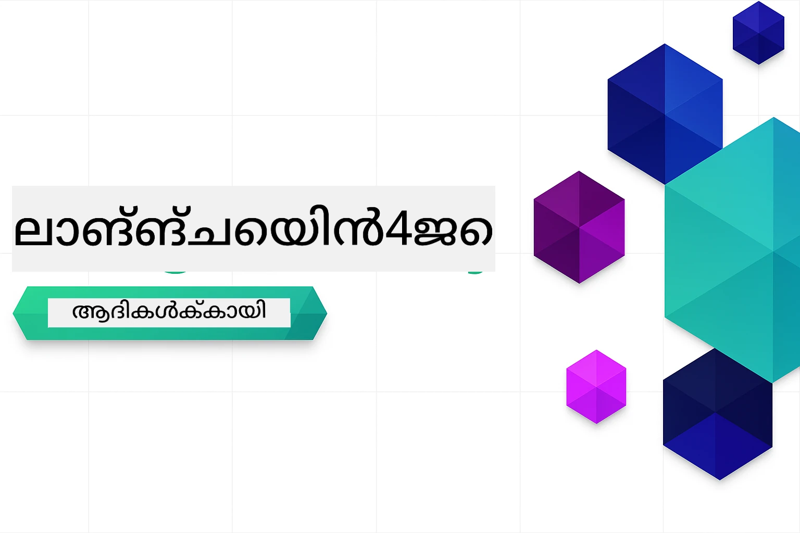

# LangChain4j വേണ്ടി തുടക്കക്കാർക്ക്

LangChain4j കൂടാതെ Azure OpenAI GPT-5.2 ഉപയോഗിച്ച് എഐ ആപ്ലിക്കേഷനുകൾ നിർമ്മിക്കുന്ന കോഴ്സ്, അടിസ്ഥാന സംവാദത്തിൽ നിന്ന് എഐ ഏജൻറുകൾ വരെ.

### 🌐 ബഹുഭാഷാ പിന്തുണ

#### GitHub Action വഴി പിന്തുണ (സ്വയംപ്രവർത്തിക്കുന്നതും എപ്പൊഴും പുതുക്കപ്പെട്ടതും)

<!-- CO-OP TRANSLATOR LANGUAGES TABLE START -->
[Arabic](../ar/README.md) | [Bengali](../bn/README.md) | [Bulgarian](../bg/README.md) | [Burmese (Myanmar)](../my/README.md) | [Chinese (Simplified)](../zh-CN/README.md) | [Chinese (Traditional, Hong Kong)](../zh-HK/README.md) | [Chinese (Traditional, Macau)](../zh-MO/README.md) | [Chinese (Traditional, Taiwan)](../zh-TW/README.md) | [Croatian](../hr/README.md) | [Czech](../cs/README.md) | [Danish](../da/README.md) | [Dutch](../nl/README.md) | [Estonian](../et/README.md) | [Finnish](../fi/README.md) | [French](../fr/README.md) | [German](../de/README.md) | [Greek](../el/README.md) | [Hebrew](../he/README.md) | [Hindi](../hi/README.md) | [Hungarian](../hu/README.md) | [Indonesian](../id/README.md) | [Italian](../it/README.md) | [Japanese](../ja/README.md) | [Kannada](../kn/README.md) | [Khmer](../km/README.md) | [Korean](../ko/README.md) | [Lithuanian](../lt/README.md) | [Malay](../ms/README.md) | [Malayalam](./README.md) | [Marathi](../mr/README.md) | [Nepali](../ne/README.md) | [Nigerian Pidgin](../pcm/README.md) | [Norwegian](../no/README.md) | [Persian (Farsi)](../fa/README.md) | [Polish](../pl/README.md) | [Portuguese (Brazil)](../pt-BR/README.md) | [Portuguese (Portugal)](../pt-PT/README.md) | [Punjabi (Gurmukhi)](../pa/README.md) | [Romanian](../ro/README.md) | [Russian](../ru/README.md) | [Serbian (Cyrillic)](../sr/README.md) | [Slovak](../sk/README.md) | [Slovenian](../sl/README.md) | [Spanish](../es/README.md) | [Swahili](../sw/README.md) | [Swedish](../sv/README.md) | [Tagalog (Filipino)](../tl/README.md) | [Tamil](../ta/README.md) | [Telugu](../te/README.md) | [Thai](../th/README.md) | [Turkish](../tr/README.md) | [Ukrainian](../uk/README.md) | [Urdu](../ur/README.md) | [Vietnamese](../vi/README.md)

> **പ്രാദേശികമായി ക്ലോൺ ചെയ്യാൻ ഇഷ്ടപ്പെടുന്നുവോ?**
>
> ഈ റിപോസിറ്ററിൽ 50-ലധികം ഭാഷാ വിവർത്തനങ്ങൾ ഉൾപ്പെടുന്നു, ഇത് ഡൗൺലോഡ് വലുപ്പം വളരെ വലുതാക്കുന്നു. വിവർത്തനങ്ങൾ ഇല്ലാതെ ക്ലോൺ ചെയ്യാൻ sparse checkout ഉപയോഗിക്കുക:
>
> **Bash / macOS / Linux:**
> ```bash
> git clone --filter=blob:none --sparse https://github.com/microsoft/LangChain4j-for-Beginners.git
> cd LangChain4j-for-Beginners
> git sparse-checkout set --no-cone '/*' '!translations' '!translated_images'
> ```
>
> **CMD (Windows):**
> ```cmd
> git clone --filter=blob:none --sparse https://github.com/microsoft/LangChain4j-for-Beginners.git
> cd LangChain4j-for-Beginners
> git sparse-checkout set --no-cone "/*" "!translations" "!translated_images"
> ```
>
> കോഴ്സ് പൂർത്തിയാക്കാൻ ആവശ്യമുള്ള മുഴുവൻ ഫയലുകളും വളരെ വേഗത്തിൽ ഡൗൺലോഡ് ചെയ്യാൻ ഇത് സഹായിക്കും.
<!-- CO-OP TRANSLATOR LANGUAGES TABLE END -->

## ഉള്ളടക്ക പട്ടിക

1. [ആമുഖം](01-introduction/README.md) - LangChain4j അടിസ്ഥാനങ്ങളെ പഠിക്കുക
2. [പ്രോംപ്റ്റ് എഞ്ചിനീയറിംഗ്](02-prompt-engineering/README.md) - ഫലപ്രദമായ പ്രോംപ്റ്റ് ഡിസൈൻ അറിഞ്ഞെടുക്കുക
3. [RAG (റിട്രീവൽ-ഓഗ്മെന്റഡ് ജനറേഷൻ)](03-rag/README.md) - ബുദ്ധിമുട്ടുള്ള ജ്ഞാന അധിഷ്ഠിത സിസ്റ്റങ്ങൾ നിർമ്മിക്കുക
4. [ഉപകരണങ്ങൾ](04-tools/README.md) - ബാഹ്യ ഉപകരണങ്ങളും ലളിതമായ സഹായികളും സംയോജിപ്പിക്കുക
5. [MCP (മോഡൽ കോൺടെക്സ്റ്റ് പ്രോട്ടോക്കോൾ)](05-mcp/README.md) - മോഡൽ കോൺടെക്സ്റ്റ് പ്രോട്ടോക്കോൾ (MCP) ഉം ഏജന്റിക് മോഡ്യൂളുകളും ഉപയോഗിക്കുക

### വീഡിയോ അവലോകനങ്ങൾ

ഓരോ മോഡ്യൂളിനും അനുബന്ധമായുള്ള ലൈവ് സെഷൻ ഉണ്ട്, അവിടെ ആശയങ്ങളും കോഡും ഘട്ടം ഘട്ടമായി വിശദീകരിക്കുന്നു.

| മോഡ്യൂൾ | വീഡിയോ |
|--------|-------|
| 01 - ആമുഖം | [LangChain4j ഉപയോഗിച്ച് ആരംഭിക്കൽ](https://www.youtube.com/live/nl_troDm8rQ) |
| 02 - പ്രോംപ്റ്റ് എഞ്ചിനീയറിംഗ് | [LangChain4j ഉപയോഗിച്ച് പ്രോംപ്റ്റ് എഞ്ചിനീയറിംഗ്](https://www.youtube.com/live/PJ6aBaE6bog) |
| 03 - RAG | [LangChain4j ഉപയോഗിച്ച് RAG](https://www.youtube.com/watch?v=_olq75ZH_eY) |
| 04 - ഉപകരണങ്ങൾ & 05 - MCP | [ഉപകരണങ്ങളും MCP യും ഉപയോഗിച്ചുള്ള AI ഏജന്റുകൾ](https://www.youtube.com/watch?v=O_J30kZc0rw) |

---

## പഠന വഴികാട്ടി

**LangChain4j-ലേക്ക് പുതിയവർ?** പ്രധാന മുദ്രാവാക്യങ്ങളും ആശയങ്ങൾക്കും വേണ്ടി [Glossary](docs/GLOSSARY.md) കാണുക.

> **വേഗം ആരംഭിക്കുക**

1. ഈ റിപോസിറ്ററി നിങ്ങളുടെ GitHub അക്കൗണ്ടിലേക്ക് ഫോർക്കുചെയ്യുക
2. **Code** → **Codespaces** ടാബ് → **...** → **New with options...** ക്ലിക്കുചെയ്യുക
3. ഡിഫാൾട്ടുകൾ ഉപയോഗിക്കുക – കോഴ്സിനായി സൃഷ്ടിച്ച ഡവലപ്പ്മെന്റ് കൺറ്റെയ്‌നർ ഇതിലുള്ളതാണ് തിരഞ്ഞെടുക്കുന്നത്
4. **Create codespace** ക്ലിക്ക് ചെയ്യുക
5. പരിസ്ഥിതി സജ്ജമാകാൻ 5-10 മിനിട്ടു കാത്തിരിക്കുക
6. ആരംഭിക്കാൻ വേണ്ടി നേരിട്ട് [ആമുഖം](./01-introduction/README.md) സന്ദർശിക്കുക!

മൊഡ്യൂളുകൾ പൂർത്തിയാക്കിയ ശേഷം, LangChain4j ടെസ്റ്റിംഗ് ആശയങ്ങൾ പ്രയോഗത്തിൽ കാണാൻ [ടസ്റ്റിംഗ് ഗൈഡ്](docs/TESTING.md) പഠിക്കുക.

> **ഗൗരവമായി:** ഈ പരിശീലനം Azure OpenAI ഉപയോഗിക്കുന്നു. നിങ്ങൾക്കോ ഒരു അക്കൗണ്ട് ഇല്ലെങ്കിൽ [FREE Azure account](https://aka.ms/azure-free-account) ഉപയോഗിച്ച് തുടങ്ങിയോളൂ.


## GitHub Copilot ഉപയോഗിച്ച് പഠനം

വേഗത്തിൽ കോഡുചെയ്യാൻ, ഈ പ്രോജക്ട് GitHub Codespace-ൽ അല്ലെങ്കിൽ നൽകപ്പെട്ട devcontainer ഉള്ള നിങ്ങളുടെ പ്രാദേശിക IDE-യിൽ തുറക്കുക. ഈ കോഴ്സിൽ ഉപയോഗിച്ച devcontainer GitHub Copilot AI കൂട്ടായ്മ പ്രോഗ്രാമിംഗിന് മുൻകൂർ ക്രമീകരിച്ചിരിക്കുന്നു.

ഓരോ കോഡ് ഉദാഹരണത്തിലും GitHub Copilot-നോട് ചോദിക്കാവുന്ന നിർദ്ദേശിച്ച ചോദ്യങ്ങൾ ഉൾപ്പെടുത്തിയിട്ടുണ്ട്, നിങ്ങളുടെ ബോധം ഇതിലൂടെ കൂടുതൽ ശക്തമാക്കാം.💡/🤖 പ്രോമ്പ്റ്റുകൾ കാണാം:

- **ജാവ ഫയൽ ഹെഡറുകളിൽ** – ഓരോ ഉദാഹരണത്തിനു പറ്റിയ ചോദ്യങ്ങൾ
- **മോഡ്യൂൾ README-കളിൽ** – കോഡ് ഉദാഹരണങ്ങൾക്കു ശേഷം പരസ്യ ചോദ്യങ്ങൾ

**ഉപയോഗം എങ്ങനെ:** ഏതെങ്കിലും കോഡ് ഫയൽ തുറന്ന് നിർദ്ദേശിച്ച ചോദ്യങ്ങൾ Copilot-നോട് ചോദിക്കുക. ഇത് കോഡ് പൂർണ്ണമായി മനസ്സിലാകുന്നുണ്ട്, വിശദീകരിക്കുകയും, വിപുലമാക്കുകയും, മറ്റ് മാർഗ്ഗങ്ങൾ നിർദ്ദേശിക്കുകയും ചെയ്യും.

കൂടുതൽ അറിയാൻ [Copilot for AI Paired Programming](https://aka.ms/GitHubCopilotAI) സന്ദർശിക്കുക.


## അധികം അക്കൗണ്ടുകൾ

<!-- CO-OP TRANSLATOR OTHER COURSES START -->
### LangChain
[](https://aka.ms/langchain4j-for-beginners)
[](https://aka.ms/langchainjs-for-beginners?WT.mc_id=m365-94501-dwahlin)
[](https://github.com/microsoft/langchain-for-beginners?WT.mc_id=m365-94501-dwahlin)
---

### Azure / Edge / MCP / Agents
[](https://github.com/microsoft/AZD-for-beginners?WT.mc_id=academic-105485-koreyst)
[](https://github.com/microsoft/edgeai-for-beginners?WT.mc_id=academic-105485-koreyst)
[](https://github.com/microsoft/mcp-for-beginners?WT.mc_id=academic-105485-koreyst)
[](https://github.com/microsoft/ai-agents-for-beginners?WT.mc_id=academic-105485-koreyst)

---
 
### Generative AI Series
[](https://github.com/microsoft/generative-ai-for-beginners?WT.mc_id=academic-105485-koreyst)
[-9333EA?style=for-the-badge&labelColor=E5E7EB&color=9333EA)](https://github.com/microsoft/Generative-AI-for-beginners-dotnet?WT.mc_id=academic-105485-koreyst)
[-C084FC?style=for-the-badge&labelColor=E5E7EB&color=C084FC)](https://github.com/microsoft/generative-ai-for-beginners-java?WT.mc_id=academic-105485-koreyst)
[-E879F9?style=for-the-badge&labelColor=E5E7EB&color=E879F9)](https://github.com/microsoft/generative-ai-with-javascript?WT.mc_id=academic-105485-koreyst)

---
 
### കോർ പഠനം
[](https://aka.ms/ml-beginners?WT.mc_id=academic-105485-koreyst)
[](https://aka.ms/datascience-beginners?WT.mc_id=academic-105485-koreyst)
[](https://aka.ms/ai-beginners?WT.mc_id=academic-105485-koreyst)
[](https://github.com/microsoft/Security-101?WT.mc_id=academic-96948-sayoung)

[](https://aka.ms/webdev-beginners?WT.mc_id=academic-105485-koreyst)
[](https://aka.ms/iot-beginners?WT.mc_id=academic-105485-koreyst)
[](https://github.com/microsoft/xr-development-for-beginners?WT.mc_id=academic-105485-koreyst)

---
 
### കോപൈലറ്റ് പരമ്പര  
[](https://aka.ms/GitHubCopilotAI?WT.mc_id=academic-105485-koreyst)
[](https://github.com/microsoft/mastering-github-copilot-for-dotnet-csharp-developers?WT.mc_id=academic-105485-koreyst)
[](https://github.com/microsoft/CopilotAdventures?WT.mc_id=academic-105485-koreyst)
<!-- CO-OP TRANSLATOR OTHER COURSES END -->

## സഹായം നേടൽ

നിങ്ങൾ കുടുങ്ങിയാൽ അല്ലെങ്കിൽ AI ആപ്ലിക്കേഷനുകൾ നിർമ്മിക്കുന്നതിനെക്കുറിച്ച് ഏതെങ്കിലും ചോദ്യങ്ങൾ ഉണ്ടെങ്കിൽ, ചേരുക:

[](https://aka.ms/foundry/discord)

നിങ്ങൾക്ക് ഉൽപ്പന്നമായുള്ള ഫീഡ്‌ബാക്ക് അല്ലെങ്കിൽ നിർമ്മാണത്തിൽ പിഴവുകൾ ഉണ്ടായാൽ സന്ദർശിക്കുക:

[](https://aka.ms/foundry/forum)

## ലൈസൻസ്

MIT ലൈസൻസ് - വിശദാംശങ്ങൾക്കായി [LICENSE](../../LICENSE) ഫയൽ കാണുക.

---

<!-- CO-OP TRANSLATOR DISCLAIMER START -->
**അറിയിപ്പ്**:
ഈ രേഖ AI പരിഭാഷാ സേവനം [Co-op Translator](https://github.com/Azure/co-op-translator) ഉപയോഗിച്ച് പരിഭാഷപ്പെടുത്തിയതാണ്. ഞങ്ങൾ കൃത്യതയ്ക്കായി ശ്രമിക്കുന്നുവെങ്കിലും, ഓട്ടോമേറ്റഡ് പരിഭാഷകളിൽ പിഴവുകൾ അല്ലെങ്കിൽ തെറ്റായ വിവരങ്ങൾ ഉണ്ടാകാൻ സാധ്യതയുണ്ട്. അതിന്റെ സ്വാഭാവിക ഭാഷയിലുള്ള അസൽ രേഖയാണ് പ്രാമാണികമായ ഉറവിടമായി പരിഗണിക്കേണ്ടത്. നിർണായകമായ വിവരങ്ങൾക്ക്, പ്രൊഫഷണൽ മനുഷ്യ പരിഭാഷ ശുപാർശ ചെയ്യുന്നു. ഈ പരിഭാഷ ഉപയോഗിച്ച് ഉണ്ടാകുന്ന തെറ്റിദ്ധാരണകൾ അല്ലെങ്കിൽ തെറ്റായ വ്യാഖ്യാനങ്ങൾക്കായി ഞങ്ങൾ ഉത്തരവാദികളല്ല.
<!-- CO-OP TRANSLATOR DISCLAIMER END -->