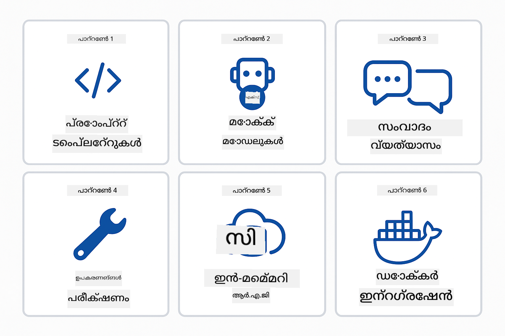
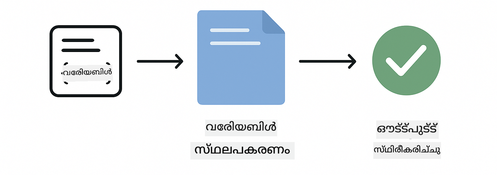
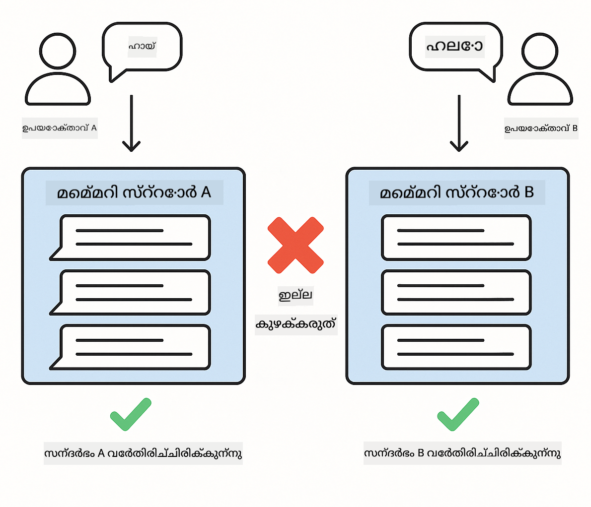

<!--
CO_OP_TRANSLATOR_METADATA:
{
  "original_hash": "b975537560c404d5f254331832811e78",
  "translation_date": "2025-12-13T21:38:29+00:00",
  "source_file": "docs/TESTING.md",
  "language_code": "ml"
}
-->
# LangChain4j ആപ്ലിക്കേഷനുകൾ ടെസ്റ്റിംഗ്

## ഉള്ളടക്ക പട്ടിക

- [ക്വിക്ക് സ്റ്റാർട്ട്](../../../docs)
- [ടെസ്റ്റുകൾ എന്താണ് ഉൾക്കൊള്ളുന്നത്](../../../docs)
- [ടെസ്റ്റുകൾ നടത്തുന്നത്](../../../docs)
- [VS കോഡിൽ ടെസ്റ്റുകൾ നടത്തുന്നത്](../../../docs)
- [ടെസ്റ്റിംഗ് പാറ്റേണുകൾ](../../../docs)
- [ടെസ്റ്റിംഗ് തത്ത്വചിന്ത](../../../docs)
- [അടുത്ത ഘട്ടങ്ങൾ](../../../docs)

API കീകൾ അല്ലെങ്കിൽ ബാഹ്യ സേവനങ്ങൾ ആവശ്യമില്ലാതെ എഐ ആപ്ലിക്കേഷനുകൾ എങ്ങനെ ടെസ്റ്റ് ചെയ്യാമെന്ന് കാണിക്കുന്ന ടെസ്റ്റുകൾ വഴി ഈ ഗൈഡ് നിങ്ങളെ നയിക്കുന്നു.

## ക്വിക്ക് സ്റ്റാർട്ട്

ഒരു കമാൻഡ് ഉപയോഗിച്ച് എല്ലാ ടെസ്റ്റുകളും നടത്തുക:

**Bash:**
```bash
mvn test
```

**PowerShell:**
```powershell
mvn --% test
```


*എല്ലാ ടെസ്റ്റുകളും പാസ്സായി, ഒരു പോലും പരാജയപ്പെടാതെ വിജയകരമായി ടെസ്റ്റ് നടത്തിയത് കാണിക്കുന്നു*

## ടെസ്റ്റുകൾ എന്താണ് ഉൾക്കൊള്ളുന്നത്

ഈ കോഴ്‌സ് പ്രാദേശികമായി പ്രവർത്തിക്കുന്ന **യൂണിറ്റ് ടെസ്റ്റുകൾ**-നാണ് കേന്ദ്രീകരിക്കുന്നത്. ഓരോ ടെസ്റ്റും LangChain4j-ന്റെ ഒരു പ്രത്യേക ആശയം ഒറ്റയ്ക്ക് കാണിക്കുന്നു.


*യൂണിറ്റ് ടെസ്റ്റുകൾ (വേഗം, ഒറ്റപ്പെട്ടത്), ഇന്റഗ്രേഷൻ ടെസ്റ്റുകൾ (യഥാർത്ഥ ഘടകങ്ങൾ), എന്റു-എൻഡ് ടെസ്റ്റുകൾ (ഡോക്കർ ഉപയോഗിച്ച് പൂർണ്ണ സിസ്റ്റം) എന്നിവയുടെ സമതുല്യം കാണിക്കുന്ന ടെസ്റ്റിംഗ് പിരമിഡ്. ഈ പരിശീലനം യൂണിറ്റ് ടെസ്റ്റിംഗിനെ ഉൾക്കൊള്ളുന്നു.*

| മോഡ്യൂൾ | ടെസ്റ്റുകൾ | കേന്ദ്രീകാരം | പ്രധാന ഫയലുകൾ |
|--------|-------|-------|-----------|
| **00 - ക്വിക്ക് സ്റ്റാർട്ട്** | 6 | പ്രോംപ്റ്റ് ടെംപ്ലേറ്റുകളും വേരിയബിൾ സബ്സ്റ്റിറ്റ്യൂഷനും | `SimpleQuickStartTest.java` |
| **01 - പരിചയം** | 8 | സംഭാഷണ മെമ്മറി, സ്റ്റേറ്റ്‌ഫുൾ ചാറ്റ് | `SimpleConversationTest.java` |
| **02 - പ്രോംപ്റ്റ് എഞ്ചിനീയറിംഗ്** | 12 | GPT-5 പാറ്റേണുകൾ, ആവേശ നിലകൾ, ഘടനാപരമായ ഔട്ട്പുട്ട് | `SimpleGpt5PromptTest.java` |
| **03 - RAG** | 10 | ഡോക്യുമെന്റ് ഇൻജെക്ഷൻ, എംബെഡ്ഡിംഗുകൾ, സമാനതാ തിരയൽ | `DocumentServiceTest.java` |
| **04 - ടൂളുകൾ** | 12 | ഫംഗ്ഷൻ കോൾ ചെയ്യലും ടൂൾ ചെയിനിംഗും | `SimpleToolsTest.java` |
| **05 - MCP** | 15 | മോഡൽ കോൺടെക്സ്റ്റ് പ്രോട്ടോക്കോൾ ഡോക്കറുമായി | `SimpleMcpTest.java`, `McpDockerTransportTest.java` |

## ടെസ്റ്റുകൾ നടത്തുന്നത്

**റൂട്ട് നിന്ന് എല്ലാ ടെസ്റ്റുകളും നടത്തുക:**

**Bash:**
```bash
mvn test
```

**PowerShell:**
```powershell
mvn --% test
```

**ഒരു പ്രത്യേക മോഡ്യൂളിനുള്ള ടെസ്റ്റുകൾ നടത്തുക:**

**Bash:**
```bash
cd 01-introduction && mvn test
# അല്ലെങ്കിൽ റൂട്ട് മുതൽ
mvn test -pl 01-introduction
```

**PowerShell:**
```powershell
cd 01-introduction; mvn --% test
# അല്ലെങ്കിൽ റൂട്ട് മുതൽ
mvn --% test -pl 01-introduction
```

**ഒരു ടെസ്റ്റ് ക്ലാസ് മാത്രം നടത്തുക:**

**Bash:**
```bash
mvn test -Dtest=SimpleConversationTest
```

**PowerShell:**
```powershell
mvn --% test -Dtest=SimpleConversationTest
```

**ഒരു പ്രത്യേക ടെസ്റ്റ് മെത്തഡ് നടത്തുക:**

**Bash:**
```bash
mvn test -Dtest=SimpleConversationTest#സംഭാഷണ ചരിത്രം നിലനിർത്തണം
```

**PowerShell:**
```powershell
mvn --% test -Dtest=SimpleConversationTest#സംഭാഷണ ചരിത്രം നിലനിർത്തണം
```

## VS കോഡിൽ ടെസ്റ്റുകൾ നടത്തുന്നത്

നിങ്ങൾ Visual Studio Code ഉപയോഗിക്കുന്നുവെങ്കിൽ, Test Explorer ടെസ്റ്റുകൾ നടത്താനും ഡീബഗ് ചെയ്യാനും ഗ്രാഫിക്കൽ ഇന്റർഫേസ് നൽകുന്നു.


*എല്ലാ ജാവ ടെസ്റ്റ് ക്ലാസുകളും വ്യക്തിഗത ടെസ്റ്റ് മെത്തഡുകളും കാണിക്കുന്ന VS കോഡ് ടെസ്റ്റ് എക്സ്പ്ലോറർ*

**VS കോഡിൽ ടെസ്റ്റുകൾ നടത്താൻ:**

1. Activity Bar-ൽ ബീക്കർ ഐക്കൺ ക്ലിക്ക് ചെയ്ത് Test Explorer തുറക്കുക
2. എല്ലാ മോഡ്യൂളുകളും ടെസ്റ്റ് ക്ലാസുകളും കാണാൻ ടെസ്റ്റ് ട്രീ വിപുലീകരിക്കുക
3. ഏതെങ്കിലും ടെസ്റ്റ് ഒറ്റയ്ക്ക് നടത്താൻ പ്ലേ ബട്ടൺ ക്ലിക്ക് ചെയ്യുക
4. മുഴുവൻ സ്യൂട്ട് നടത്താൻ "Run All Tests" ക്ലിക്ക് ചെയ്യുക
5. ഏതെങ്കിലും ടെസ്റ്റിൽ റൈറ്റ് ക്ലിക്ക് ചെയ്ത് "Debug Test" തിരഞ്ഞെടുക്കുക, ബ്രേക്ക്പോയിന്റുകൾ സജ്ജമാക്കി കോഡ് സ്റ്റെപ്പ് ചെയ്യാൻ

ടെസ്റ്റ് എക്സ്പ്ലോറർ പാസായ ടെസ്റ്റുകൾക്ക് പച്ച ടിക്ക് അടയാളങ്ങൾ കാണിക്കുകയും പരാജയപ്പെട്ടപ്പോൾ വിശദമായ പരാജയ സന്ദേശങ്ങൾ നൽകുകയും ചെയ്യുന്നു.

## ടെസ്റ്റിംഗ് പാറ്റേണുകൾ



*LangChain4j ആപ്ലിക്കേഷനുകൾക്കുള്ള ആറ് ടെസ്റ്റിംഗ് പാറ്റേണുകൾ: പ്രോംപ്റ്റ് ടെംപ്ലേറ്റുകൾ, മോക്കിംഗ് മോഡലുകൾ, സംഭാഷണ ഒറ്റപ്പെടൽ, ടൂളുകൾ ടെസ്റ്റിംഗ്, ഇൻ-മെമ്മറി RAG, ഡോക്കർ ഇന്റഗ്രേഷൻ*

### പാറ്റേൺ 1: പ്രോംപ്റ്റ് ടെംപ്ലേറ്റുകൾ ടെസ്റ്റിംഗ്

എളുപ്പമുള്ള പാറ്റേൺ പ്രോംപ്റ്റ് ടെംപ്ലേറ്റുകൾ എഐ മോഡൽ വിളിക്കാതെ ടെസ്റ്റ് ചെയ്യുന്നു. വേരിയബിൾ സബ്സ്റ്റിറ്റ്യൂഷൻ ശരിയായി പ്രവർത്തിക്കുന്നുവെന്ന് ഉറപ്പാക്കുകയും പ്രോംപ്റ്റുകൾ പ്രതീക്ഷിച്ചതുപോലെ ഫോർമാറ്റ് ചെയ്തിട്ടുണ്ടെന്ന് പരിശോധിക്കുകയും ചെയ്യുന്നു.



*വേരിയബിൾ സബ്സ്റ്റിറ്റ്യൂഷൻ പ്രവാഹം കാണിക്കുന്ന പ്രോംപ്റ്റ് ടെംപ്ലേറ്റ് ടെസ്റ്റിംഗ്: പ്ലേസ്ഹോൾഡറുകളുള്ള ടെംപ്ലേറ്റ് → മൂല്യങ്ങൾ പ്രയോഗിച്ചു → ഫോർമാറ്റ് ചെയ്ത ഔട്ട്പുട്ട് സ്ഥിരീകരിച്ചു*

```java
@Test
@DisplayName("Should format prompt template with variables")
void testPromptTemplateFormatting() {
    PromptTemplate template = PromptTemplate.from(
        "Best time to visit {{destination}} for {{activity}}?"
    );
    
    Prompt prompt = template.apply(Map.of(
        "destination", "Paris",
        "activity", "sightseeing"
    ));
    
    assertThat(prompt.text()).isEqualTo("Best time to visit Paris for sightseeing?");
}
```

ഈ ടെസ്റ്റ് `00-quick-start/src/test/java/com/example/langchain4j/quickstart/SimpleQuickStartTest.java`-ൽ ഉണ്ട്.

**ഇത് നടത്തുക:**

**Bash:**
```bash
cd 00-quick-start && mvn test -Dtest=SimpleQuickStartTest#ടെസ്റ്റ് പ്രോംപ്റ്റ് ടെംപ്ലേറ്റ് ഫോർമാറ്റിംഗ്
```

**PowerShell:**
```powershell
cd 00-quick-start; mvn --% test -Dtest=SimpleQuickStartTest#ടെസ്റ്റ് പ്രോംപ്റ്റ് ടെംപ്ലേറ്റ് ഫോർമാറ്റിംഗ്
```

### പാറ്റേൺ 2: ഭാഷാ മോഡലുകൾ മോക്ക് ചെയ്യൽ

സംഭാഷണ ലജിക് ടെസ്റ്റ് ചെയ്യുമ്പോൾ, മുൻകൂട്ടി നിശ്ചിത പ്രതികരണങ്ങൾ നൽകുന്ന മോക്കിറ്റോ ഉപയോഗിച്ച് ഫേക്ക് മോഡലുകൾ സൃഷ്ടിക്കുക. ഇത് ടെസ്റ്റുകൾ വേഗത്തിലും സൗജന്യത്തിലും നിർണ്ണായകവുമാക്കുന്നു.


*ടെസ്റ്റിംഗിനായി മോക്കുകൾ പ്രിയങ്കരമാണെന്ന് കാണിക്കുന്ന താരതമ്യം: വേഗം, സൗജന്യം, നിർണ്ണായകത, API കീകൾ ആവശ്യമില്ല*

```java
@ExtendWith(MockitoExtension.class)
class SimpleConversationTest {
    
    private ConversationService conversationService;
    
    @Mock
    private OpenAiOfficialChatModel mockChatModel;
    
    @BeforeEach
    void setUp() {
        ChatResponse mockResponse = ChatResponse.builder()
            .aiMessage(AiMessage.from("This is a test response"))
            .build();
        when(mockChatModel.chat(anyList())).thenReturn(mockResponse);
        
        conversationService = new ConversationService(mockChatModel);
    }
    
    @Test
    void shouldMaintainConversationHistory() {
        String conversationId = conversationService.startConversation();
        
        ChatResponse mockResponse1 = ChatResponse.builder()
            .aiMessage(AiMessage.from("Response 1"))
            .build();
        ChatResponse mockResponse2 = ChatResponse.builder()
            .aiMessage(AiMessage.from("Response 2"))
            .build();
        ChatResponse mockResponse3 = ChatResponse.builder()
            .aiMessage(AiMessage.from("Response 3"))
            .build();
        
        when(mockChatModel.chat(anyList()))
            .thenReturn(mockResponse1)
            .thenReturn(mockResponse2)
            .thenReturn(mockResponse3);

        conversationService.chat(conversationId, "First message");
        conversationService.chat(conversationId, "Second message");
        conversationService.chat(conversationId, "Third message");

        List<ChatMessage> history = conversationService.getHistory(conversationId);
        assertThat(history).hasSize(6); // 3 ഉപയോക്താവ് + 3 AI സന്ദേശങ്ങൾ
    }
}
```

ഈ പാറ്റേൺ `01-introduction/src/test/java/com/example/langchain4j/service/SimpleConversationTest.java`-ൽ കാണാം. മോക്ക് സ്ഥിരതയുള്ള പെരുമാറ്റം ഉറപ്പാക്കുന്നു, അതിനാൽ മെമ്മറി മാനേജ്മെന്റ് ശരിയായി പ്രവർത്തിക്കുന്നുവെന്ന് നിങ്ങൾ പരിശോധിക്കാം.

### പാറ്റേൺ 3: സംഭാഷണ ഒറ്റപ്പെടൽ ടെസ്റ്റിംഗ്

സംഭാഷണ മെമ്മറി പല ഉപയോക്താക്കളെയും വേർതിരിച്ച് സൂക്ഷിക്കണം. ഈ ടെസ്റ്റ് സംഭാഷണങ്ങൾ കോൺടെക്സ്റ്റ് മിശ്രിതമാകാതെ വേർതിരിച്ചിട്ടുണ്ടെന്ന് സ്ഥിരീകരിക്കുന്നു.



*വിവിധ ഉപയോക്താക്കൾക്കായി വേർതിരിച്ച മെമ്മറി സ്റ്റോറുകൾ കാണിക്കുന്ന സംഭാഷണ ഒറ്റപ്പെടൽ ടെസ്റ്റിംഗ്*

```java
@Test
void shouldIsolateConversationsByid() {
    String conv1 = conversationService.startConversation();
    String conv2 = conversationService.startConversation();
    
    ChatResponse mockResponse = ChatResponse.builder()
        .aiMessage(AiMessage.from("Response"))
        .build();
    when(mockChatModel.chat(anyList())).thenReturn(mockResponse);

    conversationService.chat(conv1, "Message for conversation 1");
    conversationService.chat(conv2, "Message for conversation 2");

    List<ChatMessage> history1 = conversationService.getHistory(conv1);
    List<ChatMessage> history2 = conversationService.getHistory(conv2);
    
    assertThat(history1).hasSize(2);
    assertThat(history2).hasSize(2);
}
```

ഓരോ സംഭാഷണവും സ്വതന്ത്ര ചരിത്രം സൂക്ഷിക്കുന്നു. ഉത്പാദന സിസ്റ്റങ്ങളിൽ, ഈ ഒറ്റപ്പെടൽ ബഹുഉപയോക്തൃ ആപ്ലിക്കേഷനുകൾക്കായി നിർണായകമാണ്.

### പാറ്റേൺ 4: ടൂളുകൾ സ്വതന്ത്രമായി ടെസ്റ്റ് ചെയ്യൽ

ടൂളുകൾ എഐ വിളിക്കാവുന്ന ഫംഗ്ഷനുകളാണ്. എഐ തീരുമാനങ്ങളെ ആശ്രയിക്കാതെ അവ ശരിയായി പ്രവർത്തിക്കുന്നുവെന്ന് ഉറപ്പാക്കാൻ നേരിട്ട് ടെസ്റ്റ് ചെയ്യുക.


*എഐ കോൾ ഇല്ലാതെ മോക്ക് ടൂൾ എക്സിക്യൂഷൻ കാണിക്കുന്ന ടൂളുകൾ സ്വതന്ത്രമായി ടെസ്റ്റിംഗ്*

```java
@Test
void shouldConvertCelsiusToFahrenheit() {
    TemperatureTool tempTool = new TemperatureTool();
    String result = tempTool.celsiusToFahrenheit(25.0);
    assertThat(result).containsPattern("77[.,]0°F");
}

@Test
void shouldDemonstrateToolChaining() {
    WeatherTool weatherTool = new WeatherTool();
    TemperatureTool tempTool = new TemperatureTool();

    String weatherResult = weatherTool.getCurrentWeather("Seattle");
    assertThat(weatherResult).containsPattern("\\d+°C");

    String conversionResult = tempTool.celsiusToFahrenheit(22.0);
    assertThat(conversionResult).containsPattern("71[.,]6°F");
}
```

`04-tools/src/test/java/com/example/langchain4j/agents/tools/SimpleToolsTest.java`-ൽ നിന്നുള്ള ഈ ടെസ്റ്റുകൾ എഐ പങ്കാളിത്തമില്ലാതെ ടൂൾ ലജിക് പരിശോധിക്കുന്നു. ചെയിനിംഗ് ഉദാഹരണം ഒരു ടൂളിന്റെ ഔട്ട്പുട്ട് മറ്റൊന്നിന്റെ ഇൻപുട്ടായി എങ്ങനെ പോകുന്നു എന്ന് കാണിക്കുന്നു.

### പാറ്റേൺ 5: ഇൻ-മെമ്മറി RAG ടെസ്റ്റിംഗ്

RAG സിസ്റ്റങ്ങൾ സാധാരണയായി വെക്ടർ ഡാറ്റാബേസുകളും എംബെഡ്ഡിംഗ് സേവനങ്ങളും ആവശ്യപ്പെടുന്നു. ഇൻ-മെമ്മറി പാറ്റേൺ ബാഹ്യ ആശ്രിതത്വങ്ങൾ ഇല്ലാതെ മുഴുവൻ പൈപ്പ്‌ലൈൻ ടെസ്റ്റ് ചെയ്യാൻ അനുവദിക്കുന്നു.


*ഡാറ്റാബേസ് ആവശ്യമില്ലാതെ ഡോക്യുമെന്റ് പാർസിംഗ്, എംബെഡ്ഡിംഗ് സംഭരണം, സമാനതാ തിരയൽ കാണിക്കുന്ന ഇൻ-മെമ്മറി RAG ടെസ്റ്റിംഗ് പ്രവാഹം*

```java
@Test
void testProcessTextDocument() {
    String content = "This is a test document.\nIt has multiple lines.";
    InputStream inputStream = new ByteArrayInputStream(content.getBytes(StandardCharsets.UTF_8));
    
    DocumentService.ProcessedDocument result = 
        documentService.processDocument(inputStream, "test.txt");

    assertNotNull(result);
    assertTrue(result.segments().size() > 0);
    assertEquals("test.txt", result.segments().get(0).metadata().getString("filename"));
}
```

`03-rag/src/test/java/com/example/langchain4j/rag/service/DocumentServiceTest.java`-ൽ നിന്നുള്ള ഈ ടെസ്റ്റ് ഒരു ഡോക്യുമെന്റ് മെമ്മറിയിൽ സൃഷ്ടിച്ച് ചങ്കിംഗ്, മെറ്റാഡേറ്റാ കൈകാര്യം പരിശോധിക്കുന്നു.

### പാറ്റേൺ 6: ഡോക്കറുമായി ഇന്റഗ്രേഷൻ ടെസ്റ്റിംഗ്

ചില ഫീച്ചറുകൾക്ക് യഥാർത്ഥ ഇൻഫ്രാസ്ട്രക്ചർ ആവശ്യമാണ്. MCP മോഡ്യൂൾ Testcontainers ഉപയോഗിച്ച് ഡോക്കർ കണ്ടെയ്‌നറുകൾ സ്പിൻ അപ്പ് ചെയ്ത് ഇന്റഗ്രേഷൻ ടെസ്റ്റുകൾ നടത്തുന്നു. ഇവ നിങ്ങളുടെ കോഡ് യഥാർത്ഥ സേവനങ്ങളുമായി പ്രവർത്തിക്കുന്നുവെന്ന് ഉറപ്പാക്കുന്നു, ടെസ്റ്റ് ഒറ്റപ്പെടൽ നിലനിർത്തിക്കൊണ്ട്.


*Testcontainers ഉപയോഗിച്ച് MCP ഇന്റഗ്രേഷൻ ടെസ്റ്റിംഗ്: കണ്ടെയ്‌നർ ലൈഫ്‌സൈക്കിൾ ഓട്ടോമേഷൻ - ആരംഭം, ടെസ്റ്റ് എക്സിക്യൂഷൻ, നിർത്തൽ, ക്ലീനപ്പ്*

`05-mcp/src/test/java/com/example/langchain4j/mcp/McpDockerTransportTest.java`-ൽ ഉള്ള ടെസ്റ്റുകൾക്ക് ഡോക്കർ പ്രവർത്തനക്ഷമമായിരിക്കണം.

**ഇവ നടത്തുക:**

**Bash:**
```bash
cd 05-mcp && mvn test
```

**PowerShell:**
```powershell
cd 05-mcp; mvn --% test
```

## ടെസ്റ്റിംഗ് തത്ത്വചിന്ത

നിങ്ങളുടെ കോഡ് ടെസ്റ്റ് ചെയ്യുക, എഐ അല്ല. നിങ്ങൾ എഴുതുന്ന കോഡ് ശരിയായി പ്രവർത്തിക്കുന്നുവെന്ന് ഉറപ്പാക്കാൻ ടെസ്റ്റുകൾ ഉപയോഗിക്കുക: പ്രോംപ്റ്റുകൾ എങ്ങനെ നിർമ്മിക്കപ്പെടുന്നു, മെമ്മറി എങ്ങനെ കൈകാര്യം ചെയ്യുന്നു, ടൂളുകൾ എങ്ങനെ പ്രവർത്തിക്കുന്നു എന്നിങ്ങനെ പരിശോധിക്കുക. എഐ പ്രതികരണങ്ങൾ വ്യത്യസ്തമായിരിക്കും, അവ ടെസ്റ്റ് ഉറപ്പുകൾക്ക് ഭാഗമാകരുത്. നിങ്ങളുടെ പ്രോംപ്റ്റ് ടെംപ്ലേറ്റ് വേരിയബിൾസ് ശരിയായി സബ്സ്റ്റിറ്റ്യൂട്ട് ചെയ്യുന്നതാണോ എന്ന് ചോദിക്കുക, എഐ ശരിയായ ഉത്തരം നൽകുന്നുണ്ടോ എന്ന് അല്ല.

ഭാഷാ മോഡലുകൾക്ക് മോക്കുകൾ ഉപയോഗിക്കുക. അവ ബാഹ്യ ആശ്രിതത്വങ്ങളാണ്, മന്ദഗതിയുള്ളവ, ചെലവേറിയവ, നിർണ്ണായകമല്ലാത്തവ. മോക്കിംഗ് ടെസ്റ്റുകൾ വേഗത്തിൽ (മില്ലിസെക്കൻഡുകളിൽ), സൗജന്യമായി (API ചെലവില്ലാതെ), നിർണ്ണായകമായി (എപ്പോഴും ഒരേ ഫലം) നടത്താൻ സഹായിക്കുന്നു.

ടെസ്റ്റുകൾ സ്വതന്ത്രമാക്കുക. ഓരോ ടെസ്റ്റും സ്വന്തം ഡാറ്റ സജ്ജമാക്കണം, മറ്റൊരു ടെസ്റ്റിൽ ആശ്രയിക്കരുത്, ടെസ്റ്റ് കഴിഞ്ഞ് ക്ലീൻ അപ്പ് ചെയ്യണം. ടെസ്റ്റുകൾ എക്സിക്യൂഷൻ ഓർഡർ മാറ്റിയാലും പാസാകണം.

സന്തോഷകരമായ പാതയ്ക്ക് പുറമേ എഡ്ജ് കേസുകൾ ടെസ്റ്റ് ചെയ്യുക. ശൂന്യ ഇൻപുട്ടുകൾ, വളരെ വലിയ ഇൻപുട്ടുകൾ, പ്രത്യേക അക്ഷരങ്ങൾ, അസാധുവായ പാരാമീറ്ററുകൾ, അതിരുകൾ എന്നിവ പരീക്ഷിക്കുക. സാധാരണ ഉപയോഗത്തിൽ കാണാത്ത ബഗുകൾ ഇവയിൽ കണ്ടെത്താൻ സാധിക്കും.

വിവരണാത്മകമായ പേരുകൾ ഉപയോഗിക്കുക. `shouldMaintainConversationHistoryAcrossMultipleMessages()` എന്നത് `test1()`-നെ അപേക്ഷിച്ച് വളരെ വ്യക്തമായി എന്താണ് ടെസ്റ്റ് ചെയ്യുന്നത് എന്ന് പറയുന്നു, പരാജയങ്ങൾ ഡീബഗ് ചെയ്യാൻ സഹായിക്കുന്നു.

## അടുത്ത ഘട്ടങ്ങൾ

ഇപ്പോൾ നിങ്ങൾ ടെസ്റ്റിംഗ് പാറ്റേണുകൾ മനസ്സിലാക്കിയതിനാൽ, ഓരോ മോഡ്യൂളിലും കൂടുതൽ ആഴത്തിൽ പ്രവേശിക്കുക:

- **[00 - ക്വിക്ക് സ്റ്റാർട്ട്](../00-quick-start/README.md)** - പ്രോംപ്റ്റ് ടെംപ്ലേറ്റ് അടിസ്ഥാനങ്ങൾ ആരംഭിക്കുക
- **[01 - പരിചയം](../01-introduction/README.md)** - സംഭാഷണ മെമ്മറി മാനേജ്മെന്റ് പഠിക്കുക
- **[02 - പ്രോംപ്റ്റ് എഞ്ചിനീയറിംഗ്](../02-prompt-engineering/README.md)** - GPT-5 പ്രോംപ്റ്റിംഗ് പാറ്റേണുകൾ കൈകാര്യം ചെയ്യുക
- **[03 - RAG](../03-rag/README.md)** - റിട്രീവൽ-ഓഗ്മെന്റഡ് ജനറേഷൻ സിസ്റ്റങ്ങൾ നിർമ്മിക്കുക
- **[04 - ടൂളുകൾ](../04-tools/README.md)** - ഫംഗ്ഷൻ കോൾ ചെയ്യലും ടൂൾ ചെയിനിംഗും നടപ്പിലാക്കുക
- **[05 - MCP](../05-mcp/README.md)** - മോഡൽ കോൺടെക്സ്റ്റ് പ്രോട്ടോക്കോൾ ഡോക്കറുമായി ഇന്റഗ്രേറ്റ് ചെയ്യുക

ഓരോ മോഡ്യൂളിന്റെയും README ഇവിടെ ടെസ്റ്റ് ചെയ്യുന്ന ആശയങ്ങളുടെ വിശദമായ വിശദീകരണങ്ങൾ നൽകുന്നു.

---

**നാവിഗേഷൻ:** [← പ്രധാനത്തിലേക്ക് മടങ്ങുക](../README.md)

---

<!-- CO-OP TRANSLATOR DISCLAIMER START -->
**അസൂയാപത്രം**:  
ഈ രേഖ AI വിവർത്തന സേവനം [Co-op Translator](https://github.com/Azure/co-op-translator) ഉപയോഗിച്ച് വിവർത്തനം ചെയ്തതാണ്. നാം കൃത്യതയ്ക്ക് ശ്രമിച്ചിട്ടുണ്ടെങ്കിലും, യന്ത്രം ചെയ്ത വിവർത്തനങ്ങളിൽ പിശകുകൾ അല്ലെങ്കിൽ തെറ്റുകൾ ഉണ്ടാകാമെന്ന് ദയവായി ശ്രദ്ധിക്കുക. അതിന്റെ മാതൃഭാഷയിലുള്ള യഥാർത്ഥ രേഖ അധികാരപരമായ ഉറവിടമായി കണക്കാക്കണം. നിർണായകമായ വിവരങ്ങൾക്ക്, പ്രൊഫഷണൽ മനുഷ്യ വിവർത്തനം ശുപാർശ ചെയ്യപ്പെടുന്നു. ഈ വിവർത്തനം ഉപയോഗിക്കുന്നതിൽ നിന്നുണ്ടാകുന്ന ഏതെങ്കിലും തെറ്റിദ്ധാരണകൾക്കോ തെറ്റായ വ്യാഖ്യാനങ്ങൾക്കോ ഞങ്ങൾ ഉത്തരവാദികളല്ല.
<!-- CO-OP TRANSLATOR DISCLAIMER END -->