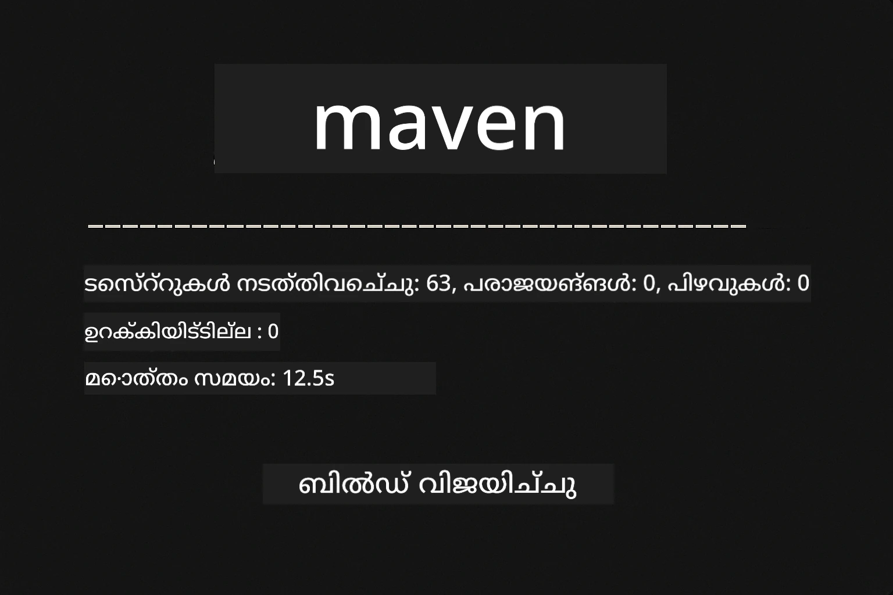
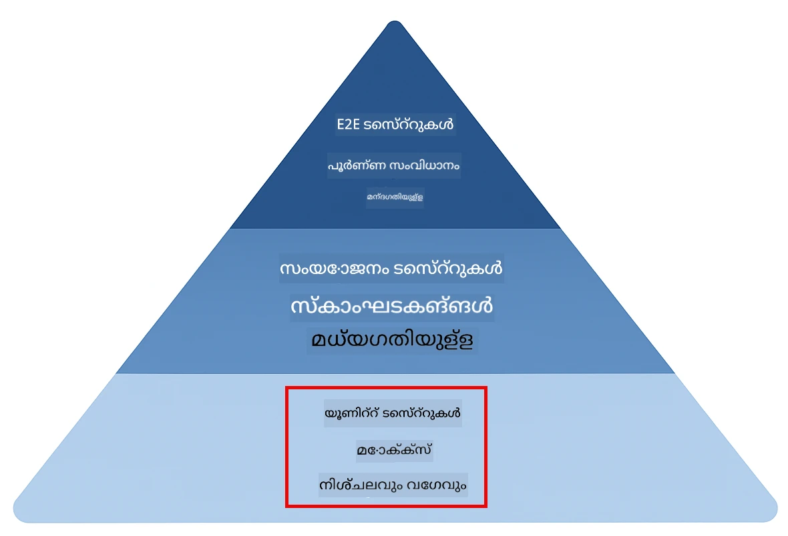
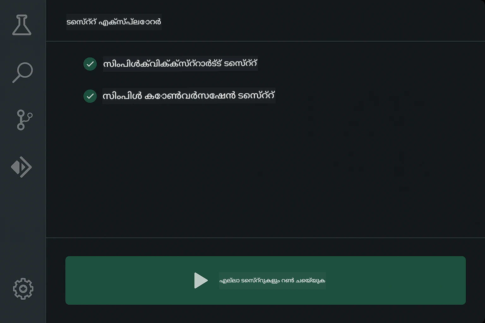
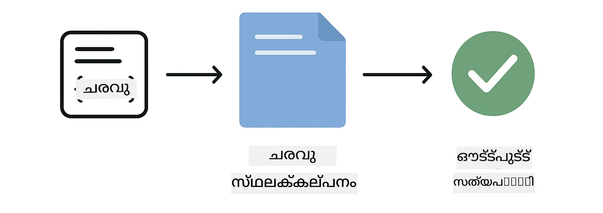
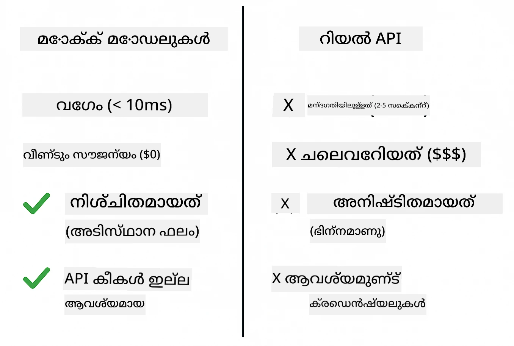
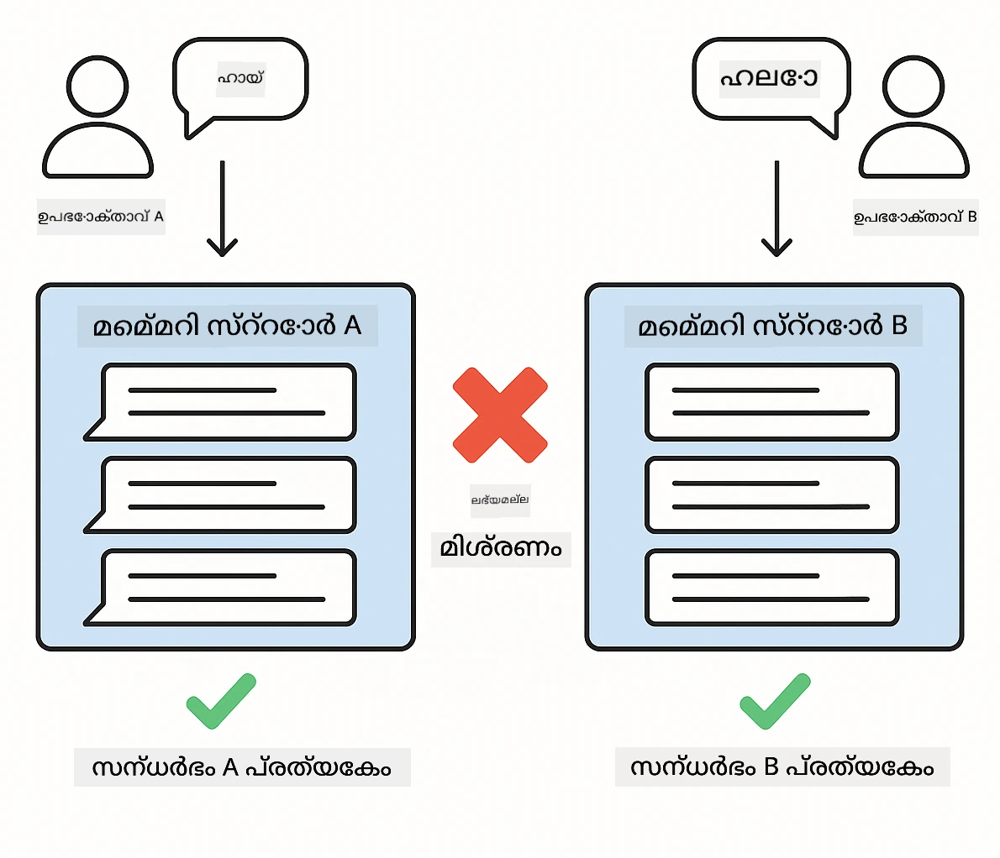
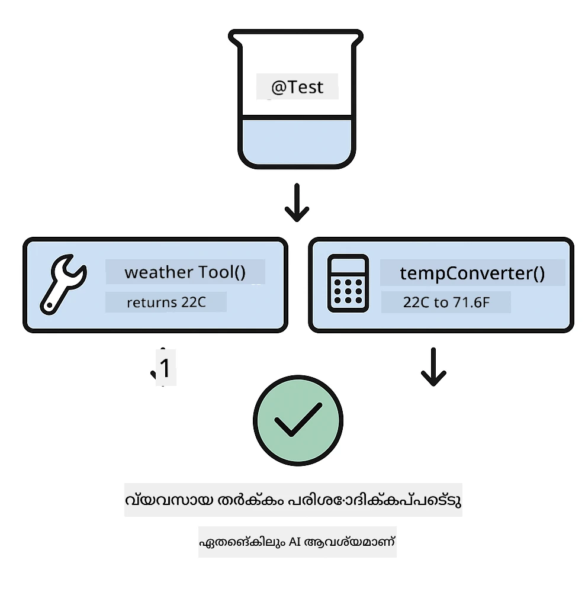
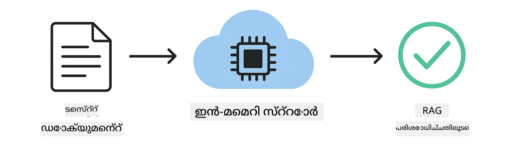

# LangChain4j അപ്ലിക്കേഷനുകൾ ടെസ്റ്റുചെയ്യൽ

## പാഠ്യക്രമം

- [ദ്രുതാരംഭം](#ദ്രുതാരംഭം)
- [ടെസ്റ്റുകൾ പരിശോധിക്കുന്നത് എന്താണെന്ന്](#ടെസ്റ്റുകൾ-പരിശോധിക്കുന്നത്-എന്താണെന്ന്)
- [ടെസ്റ്റുകൾ നടത്തുന്നത്](#ടെസ്റ്റുകൾ-നടത്തുന്നത്)
- [VS കോഡിൽ ടെസ്റ്റുകൾ നടത്തുന്നത്](#vs-കോഡിൽ-ടെസ്റ്റുകൾ-നടത്തുന്നത്)
- [ടെസ്റ്റിംഗ് മാതൃകകൾ](#ടെസ്റ്റിംഗ്-മാതൃകകൾ)
- [ടെസ്റ്റിംഗ് തത്വചിന്ത](#ടെസ്റ്റിംഗ്-തത്വചിന്ത)
- [അടുത്ത ചുവട്](#അടുത്ത-ചുവട്)

API കീകൾക്കോ ബാഹ്യ സേവനങ്ങൾക്കോ ആവശ്യമില്ലാതെ AI അപ്ലിക്കേഷനുകൾ എങ്ങനെ ടെസ്റ്റ് ചെയ്യാമെന്ന് കാണിക്കുന്ന ടെസ്റ്റുകൾ നിങ്ങൾക്ക് ഈ ഗൈഡ് വഴി കൈമാറുന്നു.

## ദ്രുതാരംഭം

ഒരു കമാൻഡ് കൊണ്ട് എല്ലാ ടെസ്റ്റുകളും ഓടിക്കുക:

**Bash:**
```bash
mvn test
```

**PowerShell:**
```powershell
mvn --% test
```
  
എല്ലാ ടെസ്റ്റുകളും വിജയിച്ചാൽ, താഴെയുള്ള സ്ക്രീൻഷോട്ടിന് സമാനം ആവുന്ന ഔട്ട്‌പുട്ട് കാണാം — ടെസ്റ്റുകൾ വാറ്യമില്ലാതെ ഓടുന്നു.



*വാറ്യമില്ലാതെ എല്ലാ ടെസ്റ്റുകളും വിജയിക്കുന്ന വിജയകരമായ ടെസ്റ്റിംഗ്*

## ടെസ്റ്റുകൾ പരിശോധിക്കുന്നത് എന്താണെന്ന്

ഈ കോഴ്സ് പ്രാദേശികമായി ഓടുന്ന **ഒക്ടൈറ്റ്സ് ടെസ്റ്റുകൾ**-ൽ കേന്ദ്രീകരിക്കുന്നു. ഓരോ ടെസ്റ്റ് LangChain4j കോൺസെപ്റ്റ് പ്രത്യേകിച്ച് പ്രദർശിപ്പിക്കുന്നു. താഴെയുള്ള ടെസ്റ്റിംഗ് പിരമിഡ് ഒക്ടൈറ്റ്സ് ടെസ്റ്റുകൾ എവിടെ പൊരുത്തപ്പെടുന്നു എന്ന് കാണിക്കുന്നു — ഇത് വേഗത്തിൽ, വിശ്വസനീയമായി പണി തുടങ്ങുന്ന അടിത്തറയാണ്, നിങ്ങളുടെ മറ്റ് ടെസ്റ്റ് തന്ത്രത്തിന് സഹായം നൽകുന്നു.



*ഒക്ടൈറ്റ്സ് ടെസ്റ്റുകളുടെ സഞ്ചയമുണ്ട് (വേഗം, നിരന്തരമായ), സംയോജിത ടെസ്റ്റുകൾ (യഥാർത്ഥ ഘടകങ്ങൾ), ഒടുവിലത്തെ ടെസ്റ്റുകൾ എന്നിവയ്ക്കിടയിലുള്ള ബലം. ഈ പരിശീലനം ഒക്ടൈറ്റ്സ് ടെസ്റ്റിംഗിനെക്കുറിച്ചാണ്.*

| മോഡ്യൂൾ | ടെസ്റ്റുകൾ | ശ്രദ്ധ | പ്രധാന ഫയലുകൾ |
|--------|-------|-------|-----------|
| **01 - പരിചയം** | 8 | സംഭാഷണ മെമ്മറിയും സ്‌റ്റേറ്റ്ഫുൾ ചാറ്റും | `SimpleConversationTest.java` |
| **02 - പ്രൊംപ്റ്റ് എൻജിനീയറിംഗ്** | 12 | GPT-5.2 മാതൃകകൾ, ആഗ്രഹ നിലകൾ, ഘടനാബദ്ധമായ ഔട്ട്‌പുട്ട് | `SimpleGpt5PromptTest.java` |
| **03 - RAG** | 10 | ഡോക്യുമെന്റ് ഇഞ്ചഷൻ, എംബെഡ്ഡിംഗുകൾ, സമാനതാ തിരയൽ | `DocumentServiceTest.java` |
| **04 - ഉപകരണങ്ങൾ** | 12 | ഫംഗ്ഷൻ കോൾ ചെയ്യൽ, ഉപകരണ ചൈനിംഗ് | `SimpleToolsTest.java` |
| **05 - MCP** | 8 | മോഡൽ കോൺടക്സ് പ്രോട്ടോക്കോൾ സ്റ്റ്ഡിയോ ട്രാൻസ്പോർട്ടുമായി | `SimpleMcpTest.java` |

## ടെസ്റ്റുകൾ നടത്തുന്നത്

**റൂട്ടിൽനിന്ന് എല്ലാ ടെസ്റ്റുകളും ഓടിക്കുക:**

**Bash:**
```bash
mvn test
```

**PowerShell:**
```powershell
mvn --% test
```
  
**ഒരു പ്രത്യേക മോഡ്യൂൾക്ക് ടെസ്റ്റുകൾ ഓടിക്കുക:**

**Bash:**
```bash
cd 01-introduction && mvn test
# അല്ലെങ്കിൽ റൂട്ടിൽ നിന്ന്
mvn test -pl 01-introduction
```

**PowerShell:**
```powershell
cd 01-introduction; mvn --% test
# അല്ലെങ്കിൽ റൂട്ടിൽ നിന്ന്
mvn --% test -pl 01-introduction
```
  
**ഒരു ടെസ്റ്റ് ക്ലാസ് മാത്രം ഓടിക്കുക:**

**Bash:**
```bash
mvn test -Dtest=SimpleConversationTest
```

**PowerShell:**
```powershell
mvn --% test -Dtest=SimpleConversationTest
```
  
**ഒരു പ്രത്യേക ടെസ്റ്റ് മെത്ത്‌ഡ്സ് ഓടിക്കുക:**

**Bash:**
```bash
mvn test -Dtest=SimpleConversationTest#സംഭാഷണ ചരിത്രം നിലനിർത്തണം
```

**PowerShell:**
```powershell
mvn --% test -Dtest=SimpleConversationTest#സംഭാഷണ ചരിത്രം പരിപാലിക്കേണ്ടതാണ്
```
  
## VS കോഡിൽ ടെസ്റ്റുകൾ നടത്തുന്നത്

Visual Studio Code ഉപയോഗിക്കുകയാണെങ്കിൽ, Test Explorer ടെസ്റ്റുകൾ ഓടിക്കാനും ഡീബഗ് ചെയ്യാനും ഗ്രാഫിക്കൽ ഇന്റർഫേസ് നൽകുന്നു.



*VS Code Test Explorer Java ടെസ്റ്റ് ക്ലാസുകളുടെയും വ്യക്തിഗത ടെസ്റ്റ് മെത്തഡുകളുടെയും പരിശോധനാ വൃക്ഷം കാണിക്കുന്നു*

**VS കോഡിൽ ടെസ്റ്റുകൾ ഓടിക്കാൻ:**

1. പ്രവർത്തന ബാറിൽ നിലവറിയുന്ന ബീക്കർ ഐക്കൺ ക്ലിക്ക് ചെയ്ത് Test Explorer തുറക്കുക
2. ടെസ്റ്റ് മൂലകം വ്യാപിപ്പിച്ച് എല്ലാ മോഡ്യൂളുകളും ടെസ്റ്റ് ക്ലാസുകളും കാണുക
3. ഏതെങ്കിലും ടെസ്റ്റ് തനിക്ക് കൂടെ പ്ലേ ബട്ടൺ ക്ലിക്ക് ചെയ്താൽ അത് ഒറ്റയായി ഓടും
4. "Run All Tests" ക്ലിക്ക് ചെയ്ത് മുഴുവൻ ടെസ്റ്റ് സ്യൂട്ട് പ്രവർത്തിപ്പിക്കുക
5. ഏതെങ്കിലും ടെസ്റ്റ് റൈറ്റ്-ക്ലിക്ക് ചെയ്ത് "Debug Test" തിരഞ്ഞെടുത്ത് ബ്രേക്‌പോയിന്റ് സെറ്റ് ചെയ്ത് കോഡ് ഘട്ടം ഘട്ടമായി പരിശോധിക്കുക

ടെസ്റ്റ് എക്സ്പ്ലോറർ വിജയിച്ച ടെസ്റ്റുകൾക്ക് പച്ച ചെക്ക് മാർക്കുകൾ കാണിക്കുന്നു, പരാജയപ്പെട്ടപ്പോൾ വിശദമായ ഫെയില്യർ വിവരം നൽകുന്നു.

## ടെസ്റ്റിംഗ് മാതൃകകൾ

### മാതൃകം 1: പ്രൊംപ്റ്റ് ടെംപ്ലേറ്റുകൾ ടെസ്റ്റുചെയ്യല്‍

എളിപ്പെട്ട മാതൃകം പ്രൊംപ്റ്റ് ടെംപ്ലേറ്റുകൾ വേറെ എഐ മോഡൽ കോൾ ചെയ്യാതിരിക്കുകയാണ് ടെസ്റ്റ് ചെയ്യുന്നത്. സന്ദർഭഭാഗങ്ങൾ ശരിയായി വിപരീതപ്പെടുത്തിയിട്ടുണ്ടോ എന്നും പ്രൊംപ്റ്റുകൾ പ്രതീക്ഷിച്ചതുപോലെ ഫോർമാറ്റ് ചെയ്തിട്ടുണ്ടോ എന്നും പരിശോധിക്കുന്നു.



*പ്രൊംപ്റ്റ് ടെംപ്ലേറ്റുകൾ ടെസ്റ്റ് ചെയ്യുന്നതിൽ മാറ്റിസ്ഥാപിച്ച വേരിയബിളുകൾ: പ്ലെയ്സ്‌ഹോൾഡറുകൾ ഉള്ള ടെംപ്ലേറ്റ് → മൂല്യങ്ങൾ പ്രയോഗിച്ചത് → ഫോർമാറ്റ് ചെയ്ത ഔട്ട്‌പുട്ട് പരിശോധിച്ചത്*

```java
@Test
@DisplayName("Should format prompt template with variables")
void testPromptTemplateFormatting() {
    PromptTemplate template = PromptTemplate.from(
        "Best time to visit {{destination}} for {{activity}}?"
    );
    
    Prompt prompt = template.apply(Map.of(
        "destination", "Paris",
        "activity", "sightseeing"
    ));
    
    assertThat(prompt.text()).isEqualTo("Best time to visit Paris for sightseeing?");
}
```
  
ഈ മാതൃക വേരിയബിളുകൾ ശരിയായി മാറ്റിസ്ഥാപിച്ചിട്ടുണ്ടെന്നും പ്രൊംപ്റ്റുകൾ പ്രതീക്ഷിച്ചതുപോലെ ഫോർമാറ്റ് ചെയ്തിട്ടുണ്ടെന്നും ഉറപ്പുവരുത്തുന്നു— API കീ യോ മോഡൽ കോൾ ആവശ്യമില്ല.

### മാതൃകം 2: ഭാഷാ മോഡലുകൾ മോക്കിങ്

സംഭാഷണ ലોજിക്ക് ടെസ്റ്റ് ചെയ്യുമ്പോൾ, ഫേക്ക് മോഡലുകൾ സൃഷ്ടിക്കാൻ Mockito ഉപയോഗിക്കുക, അവ നിർവ്വചിച്ച സാദ്ധ്യതകളും മറുപടികളും നൽകുന്നു. ഇത് ടെസ്റ്റുകൾ വേഗത്തിലും സൗജന്യത്തിലും നിർണായകവുമാക്കുന്നു.



*എന്തുകൊണ്ട് മോക്കുകൾ ഉത്തമം ആണെന്ന് കാണിക്കുന്ന താരതമ്യം: ലളിതം, സൗജന്യം, നിർണായകവും API കീ ആവശ്യമില്ല*

```java
@ExtendWith(MockitoExtension.class)
class SimpleConversationTest {
    
    private ConversationService conversationService;
    
    @Mock
    private OpenAiOfficialChatModel mockChatModel;
    
    @BeforeEach
    void setUp() {
        ChatResponse mockResponse = ChatResponse.builder()
            .aiMessage(AiMessage.from("This is a test response"))
            .build();
        when(mockChatModel.chat(anyList())).thenReturn(mockResponse);
        
        conversationService = new ConversationService(mockChatModel);
    }
    
    @Test
    void shouldMaintainConversationHistory() {
        String conversationId = conversationService.startConversation();
        
        ChatResponse mockResponse1 = ChatResponse.builder()
            .aiMessage(AiMessage.from("Response 1"))
            .build();
        ChatResponse mockResponse2 = ChatResponse.builder()
            .aiMessage(AiMessage.from("Response 2"))
            .build();
        ChatResponse mockResponse3 = ChatResponse.builder()
            .aiMessage(AiMessage.from("Response 3"))
            .build();
        
        when(mockChatModel.chat(anyList()))
            .thenReturn(mockResponse1)
            .thenReturn(mockResponse2)
            .thenReturn(mockResponse3);

        conversationService.chat(conversationId, "First message");
        conversationService.chat(conversationId, "Second message");
        conversationService.chat(conversationId, "Third message");

        List<ChatMessage> history = conversationService.getHistory(conversationId);
        assertThat(history).hasSize(6); // 3 ഉപഭോക്താവും 3 AI സന്ദേശങ്ങളും
    }
}
```
  
ഈ മാതൃകം `01-introduction/src/test/java/com/example/langchain4j/service/SimpleConversationTest.java` ൽ കാണാം. മൂക്ക് എന്നാൽ consistent പ്രവർത്തനം ഉറപ്പാക്കും, അതിനാൽ മെമ്മറി മാനേജ്മെന്റ് ശരിയായിട്ടാണ് എന്നത് പരിശോധിക്കാം.

### മാതൃകം 3: സംഭാഷണ വേർതിരിച്ചിടൽ പരീക്ഷണം

സംഭാഷണ മെമ്മറി പല ഉപയോക്താക്കളെ വേർതിരിച്ച് സൂക്ഷിക്കണം. ഈ ടെസ്റ്റ് സംസാരങ്ങൾ പരസ്പരം മിശ്രിതമാകുന്നതില്ലെന്നു ഉറപ്പുവരുത്തുന്നു.



*വ്യത്യസ്ത ഉപയോക്താക്കൾക്ക് സ്വകാര്യമായ മെമ്മറി സ്റ്റോറുകൾ കാണിക്കുന്ന സംഭാഷണ വേർതിരിച്ചു സൂക്ഷിക്കൽ പരിശോധന*

```java
@Test
void shouldIsolateConversationsByid() {
    String conv1 = conversationService.startConversation();
    String conv2 = conversationService.startConversation();
    
    ChatResponse mockResponse = ChatResponse.builder()
        .aiMessage(AiMessage.from("Response"))
        .build();
    when(mockChatModel.chat(anyList())).thenReturn(mockResponse);

    conversationService.chat(conv1, "Message for conversation 1");
    conversationService.chat(conv2, "Message for conversation 2");

    List<ChatMessage> history1 = conversationService.getHistory(conv1);
    List<ChatMessage> history2 = conversationService.getHistory(conv2);
    
    assertThat(history1).hasSize(2);
    assertThat(history2).hasSize(2);
}
```
  
എല്ലാ സംഭാഷണത്തിനും സ്വതന്ത്ര ചരിത്രം നിലനിർത്തണം. പ്രൊഡക്ഷൻ സിസ്റ്റങ്ങളിൽ, ഇത് മൾട്ടി യൂസർ അപ്ലിക്കേഷനുകൾക്ക് അനിവാര്യമാണ്.

### മാതൃകം 4: ഉപകരണങ്ങൾ സ്വതന്ത്രമായി ടെസ്റ്റ് ചെയ്യൽ

ഉപകരണങ്ങൾ എഐ വിളിക്കാവുന്ന ഫംഗ്ഷനുകളാണ്. അവ എഐ തീരുമാനം സ്വാധീനിക്കാതെ ശരിയായി പ്രവർത്തിക്കുന്നുവെന്ന് നേരിട്ട് പരിശോധിക്കുക.



*എഐ കോൾ ഇല്ലാതെ മൊക്ക് ഉപകരണം പ്രവർത്തനം പരിശോദിക്കുന്ന ബിസിനസ് ലൊജിക് പരിശോധിക്കൽ*

```java
@Test
void shouldConvertCelsiusToFahrenheit() {
    TemperatureTool tempTool = new TemperatureTool();
    String result = tempTool.celsiusToFahrenheit(25.0);
    assertThat(result).containsPattern("77[.,]0°F");
}

@Test
void shouldDemonstrateToolChaining() {
    WeatherTool weatherTool = new WeatherTool();
    TemperatureTool tempTool = new TemperatureTool();

    String weatherResult = weatherTool.getCurrentWeather("Seattle");
    assertThat(weatherResult).containsPattern("\\d+°C");

    String conversionResult = tempTool.celsiusToFahrenheit(22.0);
    assertThat(conversionResult).containsPattern("71[.,]6°F");
}
```
  
`04-tools/src/test/java/com/example/langchain4j/agents/tools/SimpleToolsTest.java` എന്ന ഫയലിലെ ഈ ടെസ്റ്റുകൾ AI ഇടപെടൽ കൂടാതെ ഉപകരണങ്ങളുടെ ലൊജിക് പരിശോധിക്കുന്നു. ചൈനിംഗ് ഉദാഹരണം ഒരു ഉപകരണത്തിന്റെ ഔട്ട്‌പുട്ട് മറ്റൊന്നിന്റെ ഇൻപുട്ടാകുന്നത് കാണിക്കുന്നു.

### മാതൃകം 5: ഇൻ-മെമ്മറി RAG ടെസ്റ്റിംഗ്

RAG സംവിധാനം സാധാരണയായി വെക്ടർ ഡാറ്റാബേസുകളും എംബെഡ്ഡിംഗ് സേവനങ്ങളും ആവശ്യപ്പെടുന്നു. ഇൻ-മെമ്മറി മാതൃകയിൽ മുഴുവൻ പൈപ്പ്‌ലൈൻ ബാഹ്യ ആശ്രിതങ്ങളില്ലാതെ ടെസ്റ്റ് ചെയ്യാം.



*ഡാറ്റാബേസ് ആവശ്യമില്ലാതെ ഡോക്യുമെന്റ് പാഴ്‌സിംഗ്, എംബഡ്ഡിംഗ് സംഭരണം, സമാനതാ തിരയൽ എന്നിവയുള്ള ഇൻ മെമ്മറി RAG ടെസ്റ്റിംഗ് പ്രവൃത്തി പ്രക്രിയ*

```java
@Test
void testProcessTextDocument() {
    String content = "This is a test document.\nIt has multiple lines.";
    InputStream inputStream = new ByteArrayInputStream(content.getBytes(StandardCharsets.UTF_8));
    
    DocumentService.ProcessedDocument result = 
        documentService.processDocument(inputStream, "test.txt");

    assertNotNull(result);
    assertTrue(result.segments().size() > 0);
    assertEquals("test.txt", result.segments().get(0).metadata().getString("filename"));
}
```
  
`03-rag/src/test/java/com/example/langchain4j/rag/service/DocumentServiceTest.java`-ൽ നിന്നുള്ള ഈ ടെസ്റ്റ് ഒരു ഡോക്യുമെന്റ് മെമ്മറിയിൽ സൃഷ്ടിച്ച് ചങ്ക് ചെയ്യലും മെറ്റാഡേറ്റ ഹാൻഡ്ലിംഗും പരിശോധിക്കുന്നു.

### മാതൃകം 6: MCP സംയോജിത ടെസ്റ്റിംഗ്

MCP മോഡ്യൂൾ സ്റ്റ്ഡിയൊ ഉപയോഗിച്ച് മോഡൽ കോൺടക്റ്റ് പ്രോട്ടോക്കോൾ സംയോജനം ടെസ്റ്റ് ചെയ്യുന്നു. ഈ ടെസ്റ്റുകൾ നിങ്ങളുടെ അപ്ലിക്കേഷൻ MCP സർവറുമായി subprocess ആയി spawn ചെയ്ത് ആശയവിനിമയം നടത്താൻ കഴിയുന്നതായിരിക്കണം ഉറപ്പാക്കുന്നു.

`05-mcp/src/test/java/com/example/langchain4j/mcp/SimpleMcpTest.java`-ലെ ടെസ്റ്റുകൾ MCP ക്ലയന്റ് പ്രവർത്തനം പരിശോധിക്കുന്നു.

**ഓടിക്കുക:**

**Bash:**
```bash
cd 05-mcp && mvn test
```

**PowerShell:**
```powershell
cd 05-mcp; mvn --% test
```
  
## ടെസ്റ്റിംഗ് തത്വചിന്ത

AI-യെല്ലാം അല്ല, നിങ്ങൾ എഴുതുന്നത് പരീക്ഷിക്കുക. നിങ്ങളുടെ ടെസ്റ്റുകൾ എഴുതുന്ന കോഡ് ശരിയാണോ എന്ന് ഉറപ്പാക്കണം — പ്രൊംപ്റ്റുകൾ എങ്ങനെ നിർമ്മിക്കുന്നത്, മെമ്മറി എങ്ങനെ മാനേജ് ചെയ്യുന്നത്, ഉപകരണങ്ങൾ എങ്ങനെ പ്രവർത്തിക്കുന്നു എന്നിങ്ങനെ പരിശോധിക്കുക. AI മറുപടികൾ വ്യത്യസ്തമാണ്, അവ പ്രൂഫ് അനുവദിക്കരുത്. നിങ്ങളുടെ പ്രൊംപ്റ്റ് ടെംപ്ലേറ്റ് ശരിയായി വേരിയബിളുകൾ മാറ്റിസ്ഥാപിക്കുന്നുണ്ടോ എന്ന് ചോദിക്കുക, AI ശരിയായ മറുപടി നൽകുന്നുവോ എന്ന് അല്ല.

ഭാഷാ മോഡലുകൾക്കായി മോക്കുകൾ ഉപയോഗിക്കുക. അവ ബാഹ്യ ആശ്രിതങ്ങളാണ്, സ്ലോ ആയ, ചെലവുള്ള, നിരണായകമല്ലാത്തവ. മോക്കിംഗ് ടെസ്റ്റുകൾ സെക്കൻഡുകൾക്കുപകരം മില്ലിസെക്കൻഡ് വേഗതയിൽ, സൗജന്യമായി API ചെലവുകൾ ഇല്ലാതെ, എല്ലാ സമയം ഒരേ ഫലം നൽകിയാണ് നടത്തുന്നത്.

ടെസ്റ്റുകൾ സ്വതന്ത്രമാക്കുക. ഓരോ ടെസ്റ്റ് വേണ്ടപ്പെട്ട ഡാറ്റയും സ്വയം സജ്ജമാക്കണം, മറ്റുള്ള ടെസ്റ്റുകളിൽ ആശ്രയിക്കരുത്, ടെസ്റ്റ് കഴിഞ്ഞ് സ്വയം ക്ലീൻ ആയിരിക്കണം. ഓട്ടോക്രമണത്തിനെങ്കിലും ടെസ്റ്റുകൾ വിജയിക്കണം.

ഹാപ്പി പാതയ്ക്ക് പുറമെ എഡ്ജ് കേസുകൾ ടെസ്റ്റ് ചെയ്യുക. ശൂന്യമായ ഇൻപുട്ടുകൾ, വലിയ ഇൻപുട്ടുകൾ, പ്രത്യേക അക്ഷരങ്ങൾ, അസാധുവായ പാരാമീറ്ററുകൾ, അതിരുകൾ അവസരങ്ങൾ എന്നിവ പരീക്ഷിക്കുക. ഇത് സാധാരണ ഉപയോഗം പുറത്തുപറയാത്ത പിശകുകൾ കണ്ടെത്താനാകും.

വിവരണാത്മക നാമങ്ങൾ ഉപയോഗിക്കുക. `shouldMaintainConversationHistoryAcrossMultipleMessages()` എന്നത് `test1()`ക്കൊപ്പം താരതമ്യം ചെയ്യുക. മുമ്പുള്ളത് എന്താണെന്ന് വ്യക്തമാക്കുന്നു, പരാജയങ്ങൾ ഡീബഗ് ചെയ്യാൻ സഹായിക്കുന്നു.

## അടുത്ത ചുവട്

ടെസ്റ്റിംഗ് മാതൃകകൾ മനസ്സിലാക്കിയതിനു ശേഷം ഓരോ മോഡ്യൂളിലും ആഴത്തിൽ നോക്കാം:

- **[01 - പരിചയം](../01-introduction/README.md)** - സംഭാഷണ മെമ്മറി മാനേജ്മെന്റ് പഠിക്കുക
- **[02 - പ്രൊംപ്റ്റ് എൻജിനീയറിംഗ്](../02/prompt-engineering/README.md)** - GPT-5.2 പ്രൊംപ്റ്റിംഗ് മാതൃകകൾ റൂറുക
- **[03 - RAG](../03-rag/README.md)** - റെട്രീവൽ-ഓગുമെന്റഡ് ജനറേഷൻ системы നിർമ്മിക്കുക
- **[04 - ഉപകരണങ്ങൾ](../04-tools/README.md)** - ഫംഗ്ഷൻ കോൾ ചെയ്യലും ഉപകരണ ചൈനിംഗും നടപ്പിലാക്കുക
- **[05 - MCP](../05-mcp/README.md)** - മോഡൽ കോൺടക്സ് പ്രോട്ടോക്കോൾ സംയോജിപ്പിക്കുക

ഓരോ മോഡ്യൂളിന്റെയും README ഇവിടെ പരിശോധിച്ച ആശയങ്ങളുടെ വിശദീകരണം നൽകുന്നു.

---

**വഴികാട്ടി:** [← പ്രധാനത്തിലേക്ക് മടങ്ങാൻ](../README.md)

---

<!-- CO-OP TRANSLATOR DISCLAIMER START -->
**അറിയിപ്പ്**:
ഈ രേഖ AI പരിഭാഷാ സേവനം [Co-op Translator](https://github.com/Azure/co-op-translator) ഉപയോഗിച്ച് പരിഭാഷപ്പെടുത്തിയതാണ്. ഞങ്ങൾ കൃത്യതയ്ക്കായി ശ്രമിക്കുന്നുവെങ്കിലും, ഓട്ടോമേറ്റഡ് പരിഭാഷകളിൽ പിഴവുകൾ അല്ലെങ്കിൽ തെറ്റായ വിവരങ്ങൾ ഉണ്ടാകാൻ സാധ്യതയുണ്ട്. അതിന്റെ സ്വാഭാവിക ഭാഷയിലുള്ള അസൽ രേഖയാണ് പ്രാമാണികമായ ഉറവിടമായി പരിഗണിക്കേണ്ടത്. നിർണായകമായ വിവരങ്ങൾക്ക്, പ്രൊഫഷണൽ മനുഷ്യ പരിഭാഷ ശുപാർശ ചെയ്യുന്നു. ഈ പരിഭാഷ ഉപയോഗിച്ച് ഉണ്ടാകുന്ന തെറ്റിദ്ധാരണകൾ അല്ലെങ്കിൽ തെറ്റായ വ്യാഖ്യാനങ്ങൾക്കായി ഞങ്ങൾ ഉത്തരവാദികളല്ല.
<!-- CO-OP TRANSLATOR DISCLAIMER END -->