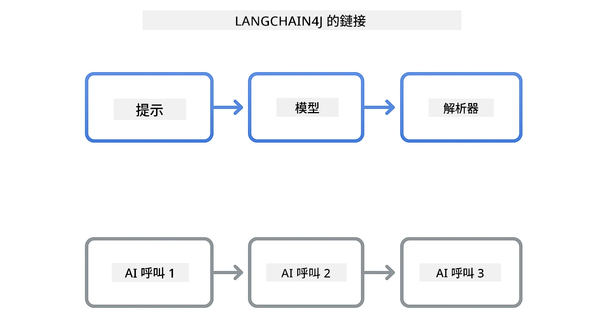
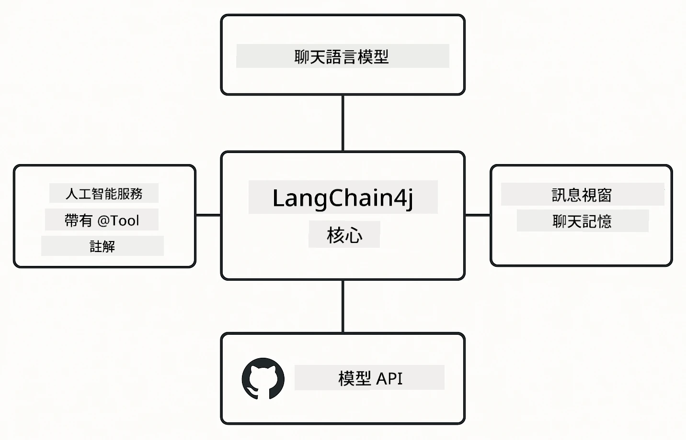

<!--
CO_OP_TRANSLATOR_METADATA:
{
  "original_hash": "22b5d7c8d7585325e38b37fd29eafe25",
  "translation_date": "2026-01-05T21:56:43+00:00",
  "source_file": "00-quick-start/README.md",
  "language_code": "mo"
}
-->
# Module 00: 快速開始

## 目錄

- [介紹](../../../00-quick-start)
- [什麼是 LangChain4j？](../../../00-quick-start)
- [LangChain4j 依賴](../../../00-quick-start)
- [前置條件](../../../00-quick-start)
- [設定](../../../00-quick-start)
  - [1. 取得你的 GitHub 令牌](../../../00-quick-start)
  - [2. 設定你的令牌](../../../00-quick-start)
- [執行範例](../../../00-quick-start)
  - [1. 基本聊天](../../../00-quick-start)
  - [2. 提示模式](../../../00-quick-start)
  - [3. 函式呼叫](../../../00-quick-start)
  - [4. 文件問答 (RAG)](../../../00-quick-start)
  - [5. 負責任的 AI](../../../00-quick-start)
- [每個範例的展示內容](../../../00-quick-start)
- [下一步](../../../00-quick-start)
- [故障排除](../../../00-quick-start)

## 介紹

此快速開始旨在幫助你盡快上手 LangChain4j。它涵蓋了使用 LangChain4j 和 GitHub 模型構建 AI 應用的絕對基礎知識。在接下來的模組中，你將使用 Azure OpenAI 與 LangChain4j 來構建更高級的應用。

## 什麼是 LangChain4j？

LangChain4j 是一個 Java 函式庫，簡化了構建 AI 驅動應用程序的過程。你不必處理 HTTP 客戶端和 JSON 解析，而是使用乾淨的 Java API。

LangChain 中的「鏈（chain）」指的是將多個組件串接在一起—你可能會將提示鏈到模型，再鏈到解析器，或者將多個 AI 調用串接，其中一個輸出成為下一個輸入。本快速開始著重於基礎，後續將探索更複雜的鏈條。



*LangChain4j 中鏈接組件 — 以組建塊連接來創建強大的 AI 工作流程*

我們將使用三個核心組件：

**ChatLanguageModel** — AI 模型互動介面。調用 `model.chat("prompt")` 並獲取回應字串。我們使用 `OpenAiOfficialChatModel`，可與兼容 OpenAI 的端點（如 GitHub 模型）搭配使用。

**AiServices** — 建立類型安全的 AI 服務介面。定義方法，使用 `@Tool` 註解，LangChain4j 處理調度。AI 會在需要時自動呼叫你的 Java 方法。

**MessageWindowChatMemory** — 維護會話歷史。沒有此功能，每次請求都是獨立的。有了它，AI 記住先前的對話並在多輪對話中保持上下文。



*LangChain4j 架構 — 核心組件協同運作以支持你的 AI 應用*

## LangChain4j 依賴

此快速開始使用 [`pom.xml`](../../../00-quick-start/pom.xml) 中的兩個 Maven 依賴：

```xml
<!-- Core LangChain4j library -->
<dependency>
    <groupId>dev.langchain4j</groupId>
    <artifactId>langchain4j</artifactId> <!-- Inherited from BOM in root pom.xml -->
</dependency>

<!-- OpenAI integration (works with GitHub Models) -->
<dependency>
    <groupId>dev.langchain4j</groupId>
    <artifactId>langchain4j-open-ai-official</artifactId> <!-- Inherited from BOM in root pom.xml -->
</dependency>
```

`langchain4j-open-ai-official` 模組提供了連接至兼容 OpenAI API 的 `OpenAiOfficialChatModel` 類。GitHub 模型使用相同的 API 格式，因此不需要特殊適配器—只需將基礎 URL 指向 `https://models.github.ai/inference`。

## 前置條件

**使用開發容器？** Java 和 Maven 已安裝好。你只需要一個 GitHub 個人存取令牌。

**本地開發：**
- Java 21+，Maven 3.9+
- GitHub 個人存取令牌（請參考以下說明）

> **注意：** 本模組使用 GitHub 模型的 `gpt-4.1-nano`。請勿修改程式碼中的模型名稱—它經過配置，可與 GitHub 可用模型兼容。

## 設定

### 1. 取得你的 GitHub 令牌

1. 前往 [GitHub 設定 → 個人存取令牌](https://github.com/settings/personal-access-tokens)
2. 點擊「Generate new token」
3. 設定描述性名稱（例如「LangChain4j Demo」）
4. 設定過期時間（建議 7 天）
5. 在「Account permissions」中，找到「Models」並設為「Read-only」
6. 點擊「Generate token」
7. 複製並保存你的令牌—你將無法再次看到它

### 2. 設定你的令牌

**選項 1：使用 VS Code（推薦）**

若使用 VS Code，將令牌添加到專案根目錄的 `.env` 檔案中：

若不存在 `.env` 檔案，請複製 `.env.example` 為 `.env` 或直接在專案根目錄新建 `.env`。

**範例 `.env` 檔案：**
```bash
# 在 /workspaces/LangChain4j-for-Beginners/.env
GITHUB_TOKEN=your_token_here
```

然後，你只需在 Explorer 中對任何範例檔案（例如 `BasicChatDemo.java`）按右鍵，選擇 **「Run Java」**，或從「Run and Debug」面板使用啟動配置。

**選項 2：使用終端**

將令牌設為環境變數：

**Bash：**
```bash
export GITHUB_TOKEN=your_token_here
```

**PowerShell：**
```powershell
$env:GITHUB_TOKEN=your_token_here
```

## 執行範例

**使用 VS Code：** 在 Explorer 中對任何範例檔案右鍵，選擇 **「Run Java」**，或使用「Run and Debug」面板中的啟動配置（請先確保你已將令牌加入 `.env` 檔案）。

**使用 Maven：** 你也可以從命令行運行：

### 1. 基本聊天

**Bash：**
```bash
mvn compile exec:java -Dexec.mainClass=com.example.langchain4j.quickstart.BasicChatDemo
```

**PowerShell：**
```powershell
mvn --% compile exec:java -Dexec.mainClass=com.example.langchain4j.quickstart.BasicChatDemo
```

### 2. 提示模式

**Bash：**
```bash
mvn compile exec:java -Dexec.mainClass=com.example.langchain4j.quickstart.PromptEngineeringDemo
```

**PowerShell：**
```powershell
mvn --% compile exec:java -Dexec.mainClass=com.example.langchain4j.quickstart.PromptEngineeringDemo
```

展示零次示例（zero-shot）、少示例（few-shot）、思路鏈（chain-of-thought）和角色提示。

### 3. 函式呼叫

**Bash：**
```bash
mvn compile exec:java -Dexec.mainClass=com.example.langchain4j.quickstart.ToolIntegrationDemo
```

**PowerShell：**
```powershell
mvn --% compile exec:java -Dexec.mainClass=com.example.langchain4j.quickstart.ToolIntegrationDemo
```

AI 在需要時自動呼叫你的 Java 方法。

### 4. 文件問答 (RAG)

**Bash：**
```bash
mvn compile exec:java -Dexec.mainClass=com.example.langchain4j.quickstart.SimpleReaderDemo
```

**PowerShell：**
```powershell
mvn --% compile exec:java -Dexec.mainClass=com.example.langchain4j.quickstart.SimpleReaderDemo
```

就 `document.txt` 內容提問。

### 5. 負責任的 AI

**Bash：**
```bash
mvn compile exec:java -Dexec.mainClass=com.example.langchain4j.quickstart.ResponsibleAIDemo
```

**PowerShell：**
```powershell
mvn --% compile exec:java -Dexec.mainClass=com.example.langchain4j.quickstart.ResponsibleAIDemo
```

查看 AI 安全過濾如何阻擋有害內容。

## 每個範例的展示內容

**基本聊天** — [BasicChatDemo.java](../../../00-quick-start/src/main/java/com/example/langchain4j/quickstart/BasicChatDemo.java)

從這裡開始，了解 LangChain4j 的最基本用法。你會建立 `OpenAiOfficialChatModel`，使用 `.chat()` 送出提示，並獲取回應。這示範了基礎：如何使用自訂端點和 API 金鑰初始化模型。理解這個模式後，其他內容都能建立在此基礎上。

```java
ChatLanguageModel model = OpenAiOfficialChatModel.builder()
    .baseUrl("https://models.github.ai/inference")
    .apiKey(System.getenv("GITHUB_TOKEN"))
    .modelName("gpt-4.1-nano")
    .build();

String response = model.chat("What is LangChain4j?");
System.out.println(response);
```

> **🤖 請嘗試使用 [GitHub Copilot](https://github.com/features/copilot) 聊天：** 開啟 [`BasicChatDemo.java`](../../../00-quick-start/src/main/java/com/example/langchain4j/quickstart/BasicChatDemo.java)，並問：
> - 「我如何在此程式碼中將 GitHub 模型切換為 Azure OpenAI？」
> - 「OpenAiOfficialChatModel.builder() 可以配置哪些其他參數？」
> - 「如何在等待完整回應前加上串流回應功能？」

**提示工程** — [PromptEngineeringDemo.java](../../../00-quick-start/src/main/java/com/example/langchain4j/quickstart/PromptEngineeringDemo.java)

現在你已知道如何與模型交談，接著來探究你說的是什麼。此示範使用相同模型設置，但展示四種不同提示模式。試試零次示例提示來直接給指令、少示例提示透過範例學習、思路鏈提示揭示推理過程，及角色提示設定上下文。你會發現同一模型根據你怎麼構造請求，結果會截然不同。

```java
PromptTemplate template = PromptTemplate.from(
    "What's the best time to visit {{destination}} for {{activity}}?"
);

Prompt prompt = template.apply(Map.of(
    "destination", "Paris",
    "activity", "sightseeing"
));

String response = model.chat(prompt.text());
```

> **🤖 請嘗試使用 [GitHub Copilot](https://github.com/features/copilot) 聊天：** 開啟 [`PromptEngineeringDemo.java`](../../../00-quick-start/src/main/java/com/example/langchain4j/quickstart/PromptEngineeringDemo.java)，並問：
> - 「零次示例與少示例提示有什麼不同？我該何時使用？」
> - 「溫度參數如何影響模型回應？」
> - 「有哪些技術能防止生產環境的提示注入攻擊？」
> - 「如何為常用模式建立可重用的 PromptTemplate 物件？」

**工具整合** — [ToolIntegrationDemo.java](../../../00-quick-start/src/main/java/com/example/langchain4j/quickstart/ToolIntegrationDemo.java)

這是 LangChain4j 威力展現之處。你會用 `AiServices` 建立一個 AI 助手，可以呼叫你的 Java 方法。只要用 `@Tool("描述")` 註解方法，LangChain4j 會處理其餘—AI 自動根據用戶的請求決定何時使用每個工具。這展示了函式呼叫，構建能採取行動的 AI（不只是回答問題）的關鍵技術。

```java
@Tool("Performs addition of two numeric values")
public double add(double a, double b) {
    return a + b;
}

MathAssistant assistant = AiServices.create(MathAssistant.class, model);
String response = assistant.chat("What is 25 plus 17?");
```

> **🤖 請嘗試使用 [GitHub Copilot](https://github.com/features/copilot) 聊天：** 開啟 [`ToolIntegrationDemo.java`](../../../00-quick-start/src/main/java/com/example/langchain4j/quickstart/ToolIntegrationDemo.java)，並問：
> - 「@Tool 註解是怎麼運作的？LangChain4j 背後如何處理？」
> - 「AI 可以連續呼叫多個工具來解決複雜問題嗎？」
> - 「如果工具拋出例外，該如何處理錯誤？」
> - 「如何替換成真正的 API，而不是這個計算器範例？」

**文件問答 (RAG)** — [SimpleReaderDemo.java](../../../00-quick-start/src/main/java/com/example/langchain4j/quickstart/SimpleReaderDemo.java)

這裡你將了解 RAG（檢索增強生成）的基礎。它不依賴模型的訓練資料，而是從 [`document.txt`](../../../00-quick-start/document.txt) 載入內容並包含於提示中。AI 根據你的文件回答，而非其一般知識。這是構建能使用你自有資料系統的第一步。

```java
Document document = FileSystemDocumentLoader.loadDocument("document.txt");
String content = document.text();

String prompt = "Based on this document: " + content + 
                "\nQuestion: What is the main topic?";
String response = model.chat(prompt);
```

> **注意：** 這種簡單方法將整個文件載入提示。若檔案過大（>10KB），會超過上下文限制。模組 03 涵蓋了生產級 RAG 系統的分片和向量搜尋。

> **🤖 請嘗試使用 [GitHub Copilot](https://github.com/features/copilot) 聊天：** 開啟 [`SimpleReaderDemo.java`](../../../00-quick-start/src/main/java/com/example/langchain4j/quickstart/SimpleReaderDemo.java)，並問：
> - 「RAG 與使用模型訓練資料相比，如何防止 AI 幻覺？」
> - 「這種簡單方法與使用向量嵌入檢索有何不同？」
> - 「如何擴展至處理多文件或更大知識庫？」
> - 「提示該如何結構化才能確保 AI 只使用提供的上下文？」

**負責任的 AI** — [ResponsibleAIDemo.java](../../../00-quick-start/src/main/java/com/example/langchain4j/quickstart/ResponsibleAIDemo.java)

建立多層防禦的 AI 安全。此示範展現兩層防護協同作用：

**第一部分：LangChain4j 輸入護欄** — 在訊息到達 LLM 之前阻擋危險提示。建立自訂護欄來檢查禁用關鍵字或模式。此流程在你的程式碼內執行，速度快且免費。

```java
class DangerousContentGuardrail implements InputGuardrail {
    @Override
    public InputGuardrailResult validate(UserMessage userMessage) {
        String text = userMessage.singleText().toLowerCase();
        if (text.contains("explosives")) {
            return fatal("Blocked: contains prohibited keyword");
        }
        return success();
    }
}
```

**第二部分：供應商安全過濾** — GitHub 模型內建過濾器，捕捉護欄可能漏檢的內容。你會看到嚴重違規導致的硬阻擋（HTTP 400 錯誤）及 AI 禮貌拒絕的軟拒絕。

> **🤖 請嘗試使用 [GitHub Copilot](https://github.com/features/copilot) 聊天：** 開啟 [`ResponsibleAIDemo.java`](../../../00-quick-start/src/main/java/com/example/langchain4j/quickstart/ResponsibleAIDemo.java)，並問：
> - 「什麼是 InputGuardrail？我如何建立自己的？」
> - 「硬阻擋和軟拒絕有何差別？」
> - 「為什麼同時使用護欄和供應商過濾？」

## 下一步

**下一模組：** [01-introduction - 使用 LangChain4j 及 Azure 上的 gpt-5 入門](../01-introduction/README.md)

---

**導引：** [← 返回主目錄](../README.md) | [下一步：模組 01 - 介紹 →](../01-introduction/README.md)

---

## 故障排除

### 初次 Maven 建置

**問題：** 初次執行 `mvn clean compile` 或 `mvn package` 時耗時較長（10-15 分鐘）

**原因：** Maven 在第一次建置時需要下載所有專案依賴（Spring Boot、LangChain4j 函式庫、Azure SDK 等等）。

**解決方法：** 這是正常現象。後續建置因依賴已快取於本地而大幅加快。下載時間依網路速度而異。

### PowerShell Maven 指令語法

**問題：** Maven 指令失敗並顯示 `Unknown lifecycle phase ".mainClass=..."` 錯誤

**原因：** PowerShell 將等號 `=` 解讀為變數賦值運算子，導致 Maven 屬性語法錯誤。
**解決方案**：在 Maven 命令前使用停止解析操作符 `--%`：

**PowerShell:**
```powershell
mvn --% compile exec:java -Dexec.mainClass=com.example.langchain4j.quickstart.BasicChatDemo
```

**Bash:**
```bash
mvn compile exec:java -Dexec.mainClass=com.example.langchain4j.quickstart.BasicChatDemo
```

`--%` 操作符告訴 PowerShell 將所有剩餘參數字面上傳遞給 Maven，而不進行解釋。

### Windows PowerShell Emoji 顯示

**問題**：AI 回應在 PowerShell 中顯示亂碼（例如 `????` 或 `â??`）而不是表情符號

**原因**：PowerShell 預設編碼不支援 UTF-8 表情符號

**解決方案**：在執行 Java 應用程式之前執行此命令：
```cmd
chcp 65001
```

這會強制終端機使用 UTF-8 編碼。或者，使用 Windows Terminal，其對 Unicode 的支援較佳。

### 除錯 API 呼叫

**問題**：來自 AI 模型的驗證錯誤、速率限制或意外回應

**解決方案**：範例中包含 `.logRequests(true)` 與 `.logResponses(true)`，可在主控台顯示 API 呼叫。這有助於排查驗證錯誤、速率限制或意外回應。在生產環境中移除這些標誌以減少日誌雜訊。

---

<!-- CO-OP TRANSLATOR DISCLAIMER START -->
**免責聲明**：  
本文件係使用人工智能翻譯服務 [Co-op Translator](https://github.com/Azure/co-op-translator) 進行翻譯。雖然我們致力於確保翻譯準確性，但請注意，機器翻譯可能包含錯誤或不準確之處。原始文件以其原語言版本為準，應視為權威來源。對於重要資訊，建議採用專業人工翻譯。我們不對因使用本翻譯而引致之任何誤解或誤釋負責。
<!-- CO-OP TRANSLATOR DISCLAIMER END -->