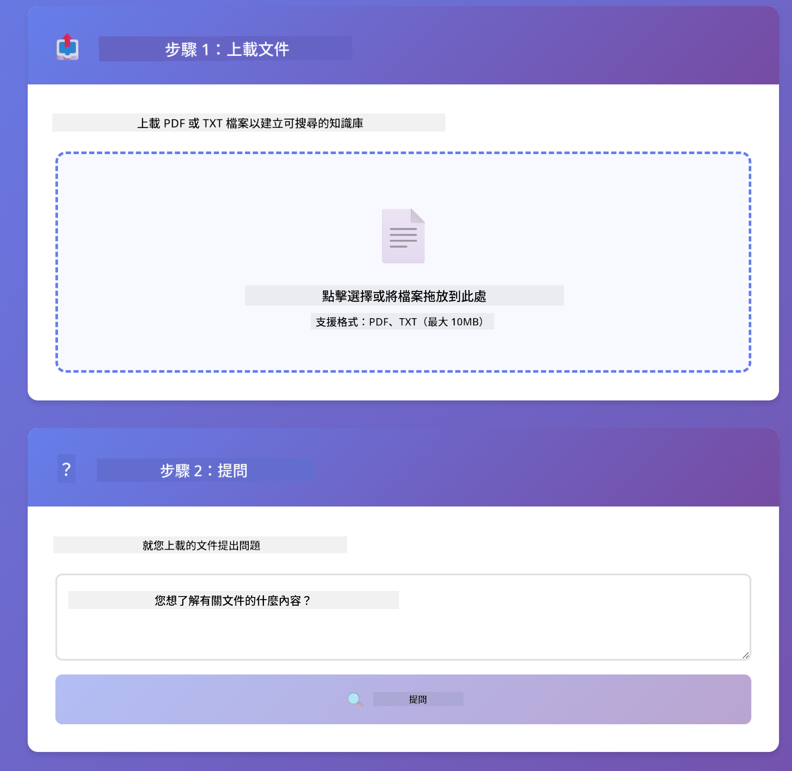
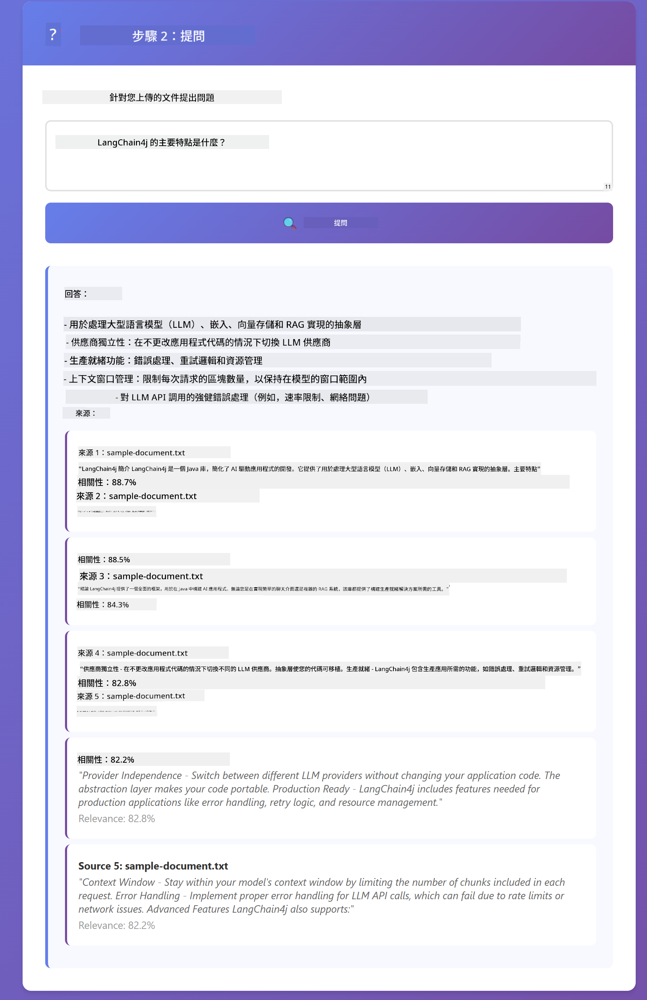

<!--
CO_OP_TRANSLATOR_METADATA:
{
  "original_hash": "81d087662fb3dd7b7124bce1a9c9ec86",
  "translation_date": "2026-01-05T21:57:22+00:00",
  "source_file": "03-rag/README.md",
  "language_code": "mo"
}
-->
# Module 03: RAG（檢索增強生成）

## 目錄

- [你將學到什麼](../../../03-rag)
- [先決條件](../../../03-rag)
- [理解 RAG](../../../03-rag)
- [運作原理](../../../03-rag)
  - [文件處理](../../../03-rag)
  - [建立嵌入](../../../03-rag)
  - [語義搜尋](../../../03-rag)
  - [答案生成](../../../03-rag)
- [執行應用程式](../../../03-rag)
- [使用應用程式](../../../03-rag)
  - [上傳文件](../../../03-rag)
  - [提問](../../../03-rag)
  - [檢查來源參考](../../../03-rag)
  - [試驗提問](../../../03-rag)
- [關鍵概念](../../../03-rag)
  - [分塊策略](../../../03-rag)
  - [相似度分數](../../../03-rag)
  - [記憶體內存儲](../../../03-rag)
  - [上下文視窗管理](../../../03-rag)
- [何時 RAG 重要](../../../03-rag)
- [後續步驟](../../../03-rag)

## 你將學到什麼

在前面的模組中，你學習了如何與 AI 對話及有效地結構你的提示。但有一個基本限制：語言模型只能知道它在訓練期間學到的知識。它們無法回答關於你公司政策、專案文件或任何未曾訓練過的資訊問題。

RAG（檢索增強生成）解決了這個問題。它不是嘗試將你的資訊教給模型（這既昂貴又不實際），而是賦予它搜尋你的文件的能力。當有人提出問題時，系統會尋找相關資訊並將其納入提示中。模型然後根據檢索的上下文回答問題。

把 RAG 想成給模型一本參考圖書館。當你提出問題時，系統會：

1. **用戶查詢** - 你提出問題
2. **嵌入** - 將你的問題轉換成向量
3. **向量搜尋** - 找出相似的文件分塊
4. **上下文組合** - 將相關分塊加入提示
5. **回應** - LLM 根據上下文生成答案

這使模型的回答以你的實際資料為基礎，而非依賴訓練知識或胡亂編造答案。


*RAG 工作流程—從用戶查詢到語義搜索到上下文答案生成*

## 先決條件

- 已完成模組 01（已部署 Azure OpenAI 資源）
- 根目錄含有 `.env` 檔，內含 Azure 憑證（由模組 01 的 `azd up` 建立）

> **注意：** 如果你還沒完成模組 01，請先按照那裡的部署說明操作。

## 運作原理

### 文件處理

[DocumentService.java](../../../03-rag/src/main/java/com/example/langchain4j/rag/service/DocumentService.java)

當你上傳文件時，系統會將它分割成適合模型上下文視窗的小塊。這些分塊有些重疊，以避免在邊界處失去上下文。

```java
Document document = FileSystemDocumentLoader.loadDocument("sample-document.txt");

DocumentSplitter splitter = DocumentSplitters
    .recursive(300, 30, new OpenAiTokenizer());

List<TextSegment> segments = splitter.split(document);
```

> **🤖 嘗試使用 [GitHub Copilot](https://github.com/features/copilot) 聊天：** 開啟 [`DocumentService.java`](../../../03-rag/src/main/java/com/example/langchain4j/rag/service/DocumentService.java) 並發問：
> - 「LangChain4j 如何將文件分割成分塊，為何重疊很重要？」
> - 「不同文件類型的最佳分塊大小是多少，原因為何？」
> - 「如何處理多語言或特殊格式的文件？」

### 建立嵌入

[LangChainRagConfig.java](../../../03-rag/src/main/java/com/example/langchain4j/rag/config/LangChainRagConfig.java)

每個分塊會被轉換成一種數值表示，稱為嵌入—本質上是一種數學指紋，捕捉文本的語意。相似的文本會產生相似的嵌入。

```java
@Bean
public EmbeddingModel embeddingModel() {
    return OpenAiOfficialEmbeddingModel.builder()
        .baseUrl(azureOpenAiEndpoint)
        .apiKey(azureOpenAiKey)
        .modelName(azureEmbeddingDeploymentName)
        .build();
}

EmbeddingStore<TextSegment> embeddingStore = 
    new InMemoryEmbeddingStore<>();
```


*文件在嵌入空間中以向量表示—相似內容聚集在一起*

### 語義搜尋

[RagService.java](../../../03-rag/src/main/java/com/example/langchain4j/rag/service/RagService.java)

當你提出問題，你的問題也會被轉換成嵌入。系統會將你的問題嵌入與所有文件分塊嵌入做比較。它尋找語意最相近的分塊—不只是匹配關鍵字，而是實質的語義相似度。

```java
Embedding queryEmbedding = embeddingModel.embed(question).content();

List<EmbeddingMatch<TextSegment>> matches = 
    embeddingStore.findRelevant(queryEmbedding, 5, 0.7);

for (EmbeddingMatch<TextSegment> match : matches) {
    String relevantText = match.embedded().text();
    double score = match.score();
}
```

> **🤖 嘗試使用 [GitHub Copilot](https://github.com/features/copilot) 聊天：** 開啟 [`RagService.java`](../../../03-rag/src/main/java/com/example/langchain4j/rag/service/RagService.java) 並發問：
> - 「相似度搜尋如何運作，分數怎麼決定？」
> - 「應該用什麼相似度閾值，及它如何影響結果？」
> - 「沒找到相關文件時怎麼辦？」

### 答案生成

[RagService.java](../../../03-rag/src/main/java/com/example/langchain4j/rag/service/RagService.java)

最相關的分塊會包含在模型提示內。模型會閱讀這些特定分塊，根據這些資訊回答你的問題。這避免了幻覺生成—模型只能根據眼前的資料回答。

## 執行應用程式

**驗證部署：**

確保根目錄有 `.env` 檔並含 Azure 憑證（模組 01 建立）：
```bash
cat ../.env  # 應該顯示 AZURE_OPENAI_ENDPOINT、API_KEY、DEPLOYMENT
```

**啟動應用程式：**

> **注意：** 如果你已經用模組 01 的 `./start-all.sh` 啟動所有應用，這個模組已經在 8081 埠執行。你可以跳過以下啟動指令，直接前往 http://localhost:8081 。

**方案一：使用 Spring Boot Dashboard（VS Code 用戶推薦）**

開發容器包含 Spring Boot Dashboard 擴充功能，提供管理所有 Spring Boot 應用的視覺介面。它在 VS Code 左邊的 Activity Bar（活動欄）中（尋找 Spring Boot 圖示）。

你可以在 Spring Boot Dashboard 中：
- 查看工作區所有 Spring Boot 應用
- 一鍵啟動/停止應用
- 實時查看應用日誌
- 監控應用狀態

只需點擊 "rag" 旁的啟動按鈕即可啟動此模組，或一次啟動所有模組。


**方案二：使用 shell 腳本**

啟動所有網頁應用（模組 01-04）：

**Bash:**
```bash
cd ..  # 從根目錄
./start-all.sh
```

**PowerShell:**
```powershell
cd ..  # 從根目錄開始
.\start-all.ps1
```

或只啟動此模組：

**Bash:**
```bash
cd 03-rag
./start.sh
```

**PowerShell:**
```powershell
cd 03-rag
.\start.ps1
```

這些腳本會自動從根目錄 `.env` 載入環境變數，並且如果 JAR 檔案不存在會自動編譯。

> **注意：** 如果你想先手動編譯所有模組再啟動：
>
> **Bash:**
> ```bash
> cd ..  # Go to root directory
> mvn clean package -DskipTests
> ```
>
> **PowerShell:**
> ```powershell
> cd ..  # Go to root directory
> mvn clean package -DskipTests
> ```

在瀏覽器打開 http://localhost:8081 。

**停止：**

**Bash:**
```bash
./stop.sh  # 僅此模組
# 或
cd .. && ./stop-all.sh  # 全部模組
```

**PowerShell:**
```powershell
.\stop.ps1  # 僅此模組
# 或
cd ..; .\stop-all.ps1  # 所有模組
```

## 使用應用程式

此應用程式提供網頁介面供文件上傳及提問。

<a href="images/rag-homepage.png"></a>

*RAG 應用介面—上傳文件並提出問題*

### 上傳文件

開始先上傳文件—TXT 文件最適合測試。目錄中提供了一個名為 `sample-document.txt` 的檔案，內含 LangChain4j 功能、RAG 實作及最佳實踐的資訊，非常適合測試系統。

系統會處理你的文件，將其拆成分塊，並為每個分塊建立嵌入。這會自動在你上傳時進行。

### 提問

現在提問關於文件內容的具體問題。試著問一些文件中明確陳述的事實。系統會搜尋相關分塊，將它們加入提示並生成答案。

### 檢查來源參考

每個答案都會附上帶有相似度分數的來源參考。這些分數（介於 0 到 1）表示各分塊與問題的相關性。分數越高表示匹配越好。這讓你能根據來源材料驗證答案。

<a href="images/rag-query-results.png"></a>

*查詢結果顯示答案及來源參考和相關度分數*

### 試驗提問

嘗試不同類型的問題：
- 具體事實：「主要主題是什麼？」
- 比較問題：「X 與 Y 有何差異？」
- 摘要問題：「請總結 Z 的關鍵要點」

觀察相似度分數如何根據你問題與文件內容的符合程度變化。

## 關鍵概念

### 分塊策略

文件被分割為 300 代幣的分塊，分塊間有 30 代幣重疊。這個平衡確保每個分塊擁有足夠上下文以具意義，同時又小到可以在提示中包含多個分塊。

### 相似度分數

分數在 0 到 1 間：
- 0.7-1.0：高度相關，完全匹配
- 0.5-0.7：相關，有良好上下文
- 低於 0.5：過濾掉，差異太大

系統只會檢索超過最低閾值的分塊以確保品質。

### 記憶體內存儲

此模組為簡單起見使用記憶體內存儲。重啟應用時，已上傳的文件會遺失。生產系統會使用永久性向量資料庫如 Qdrant 或 Azure AI Search。

### 上下文視窗管理

每個模型都有最大上下文視窗。你無法包含大型文件中的所有分塊。系統檢索最相關的前 N 個分塊（預設為 5 個），以在限制下提供足夠上下文來生成準確答案。

## 何時 RAG 重要

**當使用 RAG：**
- 回答關於專有文件的問題
- 資訊常變動（政策、價格、規格）
- 需要來源標示以保證準確
- 內容太大無法放入單次提示
- 需要可驗證且具根據的回答

**不使用 RAG：**
- 問題需要模型已有的通識知識
- 需要即時資料（RAG 僅用於已上傳文件）
- 內容足夠小可直接放入提示

## 後續步驟

**下一模組：** [04-tools - 帶工具的 AI 代理](../04-tools/README.md)

---

**導覽：** [← 上一個：模組 02 - 提示工程](../02-prompt-engineering/README.md) | [回主頁](../README.md) | [下一個：模組 04 - 工具 →](../04-tools/README.md)

---

<!-- CO-OP TRANSLATOR DISCLAIMER START -->
**免責聲明**：
本文件經由人工智能翻譯服務 [Co-op Translator](https://github.com/Azure/co-op-translator) 翻譯而成。儘管我們致力於保持翻譯的準確性，但請注意，自動翻譯或許存在錯誤或不準確之處。原始語言版本的文件應被視為具權威性的資料來源。對於重要資訊，建議採用專業人工翻譯。我們不對因使用此翻譯而引致的任何誤解或曲解承擔責任。
<!-- CO-OP TRANSLATOR DISCLAIMER END -->