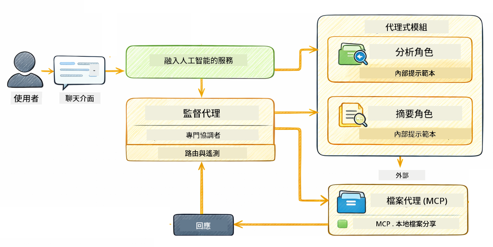

<!--
CO_OP_TRANSLATOR_METADATA:
{
  "original_hash": "6c816d130a1fa47570c11907e72d84ae",
  "translation_date": "2026-01-05T21:58:48+00:00",
  "source_file": "05-mcp/README.md",
  "language_code": "mo"
}
-->
# Module 05: 模型上下文協議 (MCP)

## 目錄

- [你將學習什麼](../../../05-mcp)
- [什麼是 MCP?](../../../05-mcp)
- [MCP 如何運作](../../../05-mcp)
- [Agentic 模組](../../../05-mcp)
- [執行範例](../../../05-mcp)
  - [先決條件](../../../05-mcp)
- [快速開始](../../../05-mcp)
  - [檔案操作（Stdio）](../../../05-mcp)
  - [監督代理](../../../05-mcp)
    - [理解輸出](../../../05-mcp)
    - [回應策略](../../../05-mcp)
    - [Agentic 模組功能說明](../../../05-mcp)
- [關鍵概念](../../../05-mcp)
- [恭喜！](../../../05-mcp)
  - [接下來？](../../../05-mcp)

## 你將學習什麼

你已經建立了對話式人工智能、精通提示詞，能在文件中根據依據回應，並創建配備工具的代理。但所有這些工具都是針對你的特定應用自訂的。如果你能讓你的 AI 存取一個標準化的工具生態系統，並且任何人都能創建與共享，情況會如何？在本模組中，你將學習如何使用模型上下文協議 (MCP) 與 LangChain4j 的 agentic 模組來做到這一點。我們首先展示一個簡單的 MCP 檔案讀取器，然後展示它如何輕鬆整合進使用監督代理模式的進階 agentic 工作流程。

## 什麼是 MCP?

模型上下文協議（MCP）正是提供這種標準方式，讓 AI 應用能發現並使用外部工具。你無需為每個資料來源或服務撰寫自訂整合，改為連線至以一致格式揭露其能力的 MCP 伺服器。這樣你的 AI 代理就能自動發現並使用這些工具。


*MCP 之前：複雜的點對點整合。MCP 之後：一個協議，無限可能。*

MCP 解決了 AI 開發中的根本問題：每個整合都是自訂的。想要訪問 GitHub？需要撰寫自訂程式碼。想讀取檔案？自訂程式碼。想查詢資料庫？自訂程式碼。且這些整合都無法與其他 AI 應用共用。

MCP 將此標準化。MCP 伺服器以明確描述和結構模式（schema）揭露工具。任何 MCP 用戶端都能連接、發現可用工具並使用。寫一次，用到處。


*模型上下文協議架構——標準化工具發現與執行*

## MCP 如何運作

**伺服器-用戶端架構**

MCP 使用用戶端-伺服器模式。伺服器提供工具——讀檔案、查詢資料庫、呼叫 API。用戶端（你的 AI 應用）連接伺服器並使用這些工具。

若要與 LangChain4j 一起使用 MCP，加入以下 Maven 相依性：

```xml
<dependency>
    <groupId>dev.langchain4j</groupId>
    <artifactId>langchain4j-mcp</artifactId>
    <version>${langchain4j.version}</version>
</dependency>
```

**工具發現**

用戶端連接 MCP 伺服器時，會詢問「你有什麼工具？」伺服器回覆一份工具列表，每個工具附有描述與參數結構。你的 AI 代理再根據用戶需求決定使用哪個工具。

**傳輸機制**

MCP 支援不同傳輸機制。本模組示範用於本地程序的 Stdio 傳輸：


*MCP 傳輸機制：遠端伺服器用 HTTP，本地程序用 Stdio*

**Stdio** - [StdioTransportDemo.java](../../../05-mcp/src/main/java/com/example/langchain4j/mcp/StdioTransportDemo.java)

用於本地程序。你的應用啟動一個子程序伺服器，透過標準輸入/輸出通訊。適合檔案系統存取或命令列工具。

```java
McpTransport stdioTransport = new StdioMcpTransport.Builder()
    .command(List.of(
        npmCmd, "exec",
        "@modelcontextprotocol/server-filesystem@2025.12.18",
        resourcesDir
    ))
    .logEvents(false)
    .build();
```

> **🤖 嘗試使用 [GitHub Copilot](https://github.com/features/copilot) Chat：** 開啟 [`StdioTransportDemo.java`](../../../05-mcp/src/main/java/com/example/langchain4j/mcp/StdioTransportDemo.java) 並問：
> - 「Stdio 傳輸如何運作？我該何時用它，什麼時候用 HTTP？」
> - 「LangChain4j 如何管理被啟動的 MCP 伺服器程序的生命週期？」
> - 「讓 AI 存取檔案系統有什麼安全性考量？」

## Agentic 模組

雖然 MCP 提供標準化的工具，LangChain4j 的 **agentic 模組** 則提供一種宣告式方式來建立協調這些工具的代理。藉由 `@Agent` 註解與 `AgenticServices` 介面，你可以透過 interface 定義代理行為，而非指令式程式碼。

在本模組中，你將探索 **監督代理（Supervisor Agent）** 模式——一個進階的 agentic AI 方式，由「監督者」代理根據用戶請求動態決定調用哪些子代理。我們將結合這兩個概念，授予其中一個子代理由 MCP 提供的檔案存取能力。

若要使用 agentic 模組，加入以下 Maven 相依性：

```xml
<dependency>
    <groupId>dev.langchain4j</groupId>
    <artifactId>langchain4j-agentic</artifactId>
    <version>${langchain4j.mcp.version}</version>
</dependency>
```

> **⚠️ 實驗性功能：** `langchain4j-agentic` 模組屬於 **實驗性**，可能會變更。建議使用穩定的方式仍是 `langchain4j-core` 搭配自訂工具（模組04）。

## 執行範例

### 先決條件

- Java 21+，Maven 3.9+
- Node.js 16+ 與 npm（用於 MCP 伺服器）
- 在 `.env` 檔案中設定環境變數（在根目錄）：
  - `AZURE_OPENAI_ENDPOINT`、`AZURE_OPENAI_API_KEY`、`AZURE_OPENAI_DEPLOYMENT`（同模組01-04）

> **注意：** 若尚未設定環境變數，請參見[模組00 - 快速開始](../00-quick-start/README.md)說明，或從根目錄複製 `.env.example` 為 `.env` 並填入你的值。

## 快速開始

**使用 VS Code：** 在檔案總管中右鍵點擊任一示範檔案，選擇 **「Run Java」**，或使用執行與除錯面板的啟動設定（確保 `.env` 已加入你的 token）。

**使用 Maven：** 也可從命令列以以下範例執行。

### 檔案操作（Stdio）

這示範基於本地子程序的工具。

**✅ 無需先決條件**——MCP 伺服器會自動啟動。

**使用啟動腳本（推薦）：**

啟動腳本會自動從根目錄`.env`檔案載入環境變數：

**Bash:**
```bash
cd 05-mcp
chmod +x start-stdio.sh
./start-stdio.sh
```

**PowerShell:**
```powershell
cd 05-mcp
.\start-stdio.ps1
```

**使用 VS Code：** 右鍵點擊 `StdioTransportDemo.java` 並選擇 **「Run Java」** （確保 `.env` 已配置）。

應用程序會自動啟動檔案系統 MCP 伺服器並讀取本地檔案。留意子程序管理是自動處理的。

**預期輸出：**
```
Assistant response: The file provides an overview of LangChain4j, an open-source Java library
for integrating Large Language Models (LLMs) into Java applications...
```

### 監督代理

**監督代理模式** 是一個 **靈活** 的 agentic AI 形式。監督者使用 LLM 自主決定根據用戶請求調用哪些代理。下一個範例中，我們結合 MCP 提供的檔案存取與 LLM 代理，建立一個受監督的檔案讀取→報告工作流程。

在範例中，`FileAgent` 使用 MCP 檔案系統工具讀檔案，`ReportAgent` 則產生一份包含行政摘要（1 句話）、3 個重點及建議的結構化報告。監督者自動協調此流程：



```
┌─────────────┐      ┌──────────────┐
│  FileAgent  │ ───▶ │ ReportAgent  │
│ (MCP tools) │      │  (pure LLM)  │
└─────────────┘      └──────────────┘
   outputKey:           outputKey:
  'fileContent'         'report'
```

每個代理將輸出存於 **Agentic 範圍**（共享記憶），允許後續代理存取先前結果。這展示 MCP 工具如何無縫整合入 agentic 工作流程——監督者無需知道檔案如何被讀取，只需知道 `FileAgent` 能做到。

#### 執行示範

啟動腳本會自動從根目錄`.env`載入環境變數：

**Bash:**
```bash
cd 05-mcp
chmod +x start-supervisor.sh
./start-supervisor.sh
```

**PowerShell:**
```powershell
cd 05-mcp
.\start-supervisor.ps1
```

**使用 VS Code：** 右鍵點擊 `SupervisorAgentDemo.java` 並選擇 **「Run Java」** （確保 `.env` 已配置）。

#### 監督者如何運作

```java
// 第一步：FileAgent 使用 MCP 工具讀取文件
FileAgent fileAgent = AgenticServices.agentBuilder(FileAgent.class)
        .chatModel(model)
        .toolProvider(mcpToolProvider)  // 具備用於文件操作的 MCP 工具
        .build();

// 第二步：ReportAgent 生成結構化報告
ReportAgent reportAgent = AgenticServices.agentBuilder(ReportAgent.class)
        .chatModel(model)
        .build();

// 主管協調文件 → 報告的工作流程
SupervisorAgent supervisor = AgenticServices.supervisorBuilder()
        .chatModel(model)
        .subAgents(fileAgent, reportAgent)
        .responseStrategy(SupervisorResponseStrategy.LAST)  // 返回最終報告
        .build();

// 主管根據請求決定調用哪些代理
String response = supervisor.invoke("Read the file at /path/file.txt and generate a report");
```

#### 回應策略

當你配置 `SupervisorAgent`，你會指定在子代理完成任務後該如何製作對用戶的最終回答。可用策略有：

| 策略 | 說明 |
|----------|-------------|
| **LAST** | 監督者回傳最後被呼叫的子代理或工具的輸出。適用於工作流程末端代理專門產生完整最終答案時（如研究管線中的「摘要代理」）。 |
| **SUMMARY** | 監督者使用自身的內部語言模型（LLM）綜合整個互動和所有子代理輸出的摘要，然後回傳該摘要作為最終回答。提供清晰整合的答覆。 |
| **SCORED** | 系統使用內部 LLM 對 LAST 回應與整個互動摘要進行打分，根據使用者原始請求，回傳分數較高的輸出。 |

完整實作見 [SupervisorAgentDemo.java](../../../05-mcp/src/main/java/com/example/langchain4j/mcp/SupervisorAgentDemo.java)。

> **🤖 嘗試使用 [GitHub Copilot](https://github.com/features/copilot) Chat：** 開啟 [`SupervisorAgentDemo.java`](../../../05-mcp/src/main/java/com/example/langchain4j/mcp/SupervisorAgentDemo.java) 並問：
> - 「監督者如何決定調用哪些代理？」
> - 「監督者模式與序列流程模式有什麼不同？」
> - 「如何客製化監督者的規劃行為？」

#### 理解輸出

執行示範時，你會看到監督者協調多代理的結構化流程。每一段代表：

```
======================================================================
  FILE → REPORT WORKFLOW DEMO
======================================================================

This demo shows a clear 2-step workflow: read a file, then generate a report.
The Supervisor orchestrates the agents automatically based on the request.
```

**標題**介紹工作流程概念：從讀檔到產生報告的專注管線。

```
--- WORKFLOW ---------------------------------------------------------
  ┌─────────────┐      ┌──────────────┐
  │  FileAgent  │ ───▶ │ ReportAgent  │
  │ (MCP tools) │      │  (pure LLM)  │
  └─────────────┘      └──────────────┘
   outputKey:           outputKey:
   'fileContent'        'report'

--- AVAILABLE AGENTS -------------------------------------------------
  [FILE]   FileAgent   - Reads files via MCP → stores in 'fileContent'
  [REPORT] ReportAgent - Generates structured report → stores in 'report'
```

**工作流程圖**顯示代理間的資料流。每個代理皆有其特定角色：
- **FileAgent** 使用 MCP 工具讀檔，並將原始內容存於 `fileContent`
- **ReportAgent** 使用該內容生成結構化報告在 `report`

```
--- USER REQUEST -----------------------------------------------------
  "Read the file at .../file.txt and generate a report on its contents"
```

**用戶請求**展示任務。監督者解析請求並決定依序調用 FileAgent → ReportAgent。

```
--- SUPERVISOR ORCHESTRATION -----------------------------------------
  The Supervisor decides which agents to invoke and passes data between them...

  +-- STEP 1: Supervisor chose -> FileAgent (reading file via MCP)
  |
  |   Input: .../file.txt
  |
  |   Result: LangChain4j is an open-source, provider-agnostic Java framework for building LLM...
  +-- [OK] FileAgent (reading file via MCP) completed

  +-- STEP 2: Supervisor chose -> ReportAgent (generating structured report)
  |
  |   Input: LangChain4j is an open-source, provider-agnostic Java framew...
  |
  |   Result: Executive Summary...
  +-- [OK] ReportAgent (generating structured report) completed
```

**監督者協調**展示兩步驟流程：
1. **FileAgent** 使用 MCP 讀取並存取檔案內容
2. **ReportAgent** 收到內容並生成結構化報告

監督者根據用戶請求 **自主** 作出這些決策。

```
--- FINAL RESPONSE ---------------------------------------------------
Executive Summary
...

Key Points
...

Recommendations
...

--- AGENTIC SCOPE (Data Flow) ----------------------------------------
  Each agent stores its output for downstream agents to consume:
  * fileContent: LangChain4j is an open-source, provider-agnostic Java framework...
  * report: Executive Summary...
```

#### Agentic 模組功能說明

這個範例示範了 agentic 模組的多項進階功能。現在深入看 Agentic 範圍與代理監聽器。

**Agentic 範圍**是共享記憶，代理透過 `@Agent(outputKey="...")` 將結果儲存於此。這讓：
- 後續代理能存取前一代理輸出
- 監督者得以綜合產生最終回應
- 你能檢視每個代理輸出

```java
ResultWithAgenticScope<String> result = supervisor.invokeWithAgenticScope(request);
AgenticScope scope = result.agenticScope();
String fileContent = scope.readState("fileContent");  // 來自 FileAgent 的原始文件數據
String report = scope.readState("report");            // 來自 ReportAgent 的結構化報告
```

**代理監聽器**允許監控與除錯代理執行。示範中所見分步輸出即由掛鉤至每次代理呼叫的 AgentListener 產生：
- **beforeAgentInvocation** - 當監督者選擇代理時呼叫，可查看選中代理及原因
- **afterAgentInvocation** - 代理完成時呼叫，顯示結果
- **inheritedBySubagents** - 若為 true，則監聽整個代理階層的所有代理

```java
AgentListener monitor = new AgentListener() {
    private int step = 0;
    
    @Override
    public void beforeAgentInvocation(AgentRequest request) {
        step++;
        System.out.println("  +-- STEP " + step + ": " + request.agentName());
    }
    
    @Override
    public void afterAgentInvocation(AgentResponse response) {
        System.out.println("  +-- [OK] " + response.agentName() + " completed");
    }
    
    @Override
    public boolean inheritedBySubagents() {
        return true; // 傳播到所有子代理
    }
};
```

除了監督者模式，`langchain4j-agentic` 模組提供數種強大工作流程模式和功能：

| 模式 | 說明 | 使用情景 |
|---------|-------------|----------|
| **Sequential** | 按順序執行代理，輸出流向下一個 | 管線：研究 → 分析 → 報告 |
| **Parallel** | 同時執行多個代理 | 獨立任務：天氣 + 新聞 + 股票 |
| **Loop** | 迭代直到條件達成 | 品質評分：反覆優化直到分數≥0.8 |
| **Conditional** | 根據條件導向路徑 | 分類 → 導向專家代理 |
| **Human-in-the-Loop** | 增加人工檢查點 | 需批准的流程、內容審核 |

## 關鍵概念

既然你已經探索了 MCP 和 agentic 模組的實際應用，讓我們總結何時使用哪種方式。

**MCP** 適合你想利用現有的工具生態系，或打造能讓多個應用共享的工具，整合第三方服務並採用標準協議，或在不改變程式碼的前提下替換工具實現時。

**Agentic 模組** 則適用於你想用宣告式代理定義（藉由 `@Agent` 註解），需要工作流程編排（序列、迴圈、並行），偏好以介面設計代理而非指令式程式碼，或結合多個共享輸出的代理。

**監督代理模式** 在工作流程事先不可預測時極具優勢，當你有多位專門代理需動態編排，打造會根據不同能力路由的對話系統，或你想要最靈活且可自適應的代理行為時，特別適用。
## 恭喜！

你已完成 LangChain4j 初學者課程。你已學會：

- 如何建立具備記憶功能的對話式 AI（模組 01）
- 不同任務的提示工程範式（模組 02）
- 使用 RAG 以你的文件為回應提供依據（模組 03）
- 創建具備自訂工具的基本 AI 代理（助理）（模組 04）
- 使用 LangChain4j MCP 和 Agentic 模組整合標準化工具（模組 05）

### 接下來怎麼辦？

完成模組後，請探索[測試指南](../docs/TESTING.md)，體驗 LangChain4j 測試概念的實際應用。

**官方資源：**
- [LangChain4j 文件](https://docs.langchain4j.dev/) - 全面指南與 API 參考
- [LangChain4j GitHub](https://github.com/langchain4j/langchain4j) - 原始碼與範例
- [LangChain4j 教學](https://docs.langchain4j.dev/tutorials/) - 各種使用案例的逐步教學

感謝你完成本課程！

---

**導覽：** [← 上一節：模組 04 - 工具](../04-tools/README.md) | [返回主頁](../README.md)

---

<!-- CO-OP TRANSLATOR DISCLAIMER START -->
**免責聲明**：  
本文件是使用人工智能翻譯服務 [Co-op Translator](https://github.com/Azure/co-op-translator) 進行翻譯的。雖然我們致力於準確性，但請注意，自動翻譯可能包含錯誤或不準確之處。原始文件的母語版本應被視為權威來源。對於重要資訊，建議採用專業人工翻譯。我們不對因使用此翻譯而引起的任何誤解或誤譯承擔責任。
<!-- CO-OP TRANSLATOR DISCLAIMER END -->