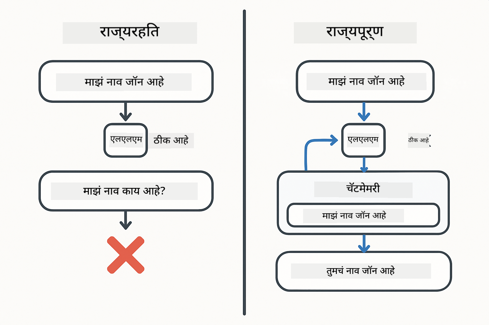
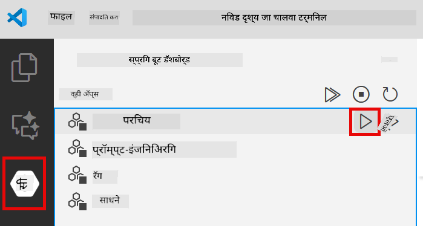

<!--
CO_OP_TRANSLATOR_METADATA:
{
  "original_hash": "c3e07ca58d0b8a3f47d3bf5728541e0a",
  "translation_date": "2025-12-13T13:23:24+00:00",
  "source_file": "01-introduction/README.md",
  "language_code": "mr"
}
-->
# Module 01: LangChain4j सह सुरूवात करणे

## अनुक्रमणिका

- [तुम्ही काय शिकाल](../../../01-introduction)
- [पूर्वअट](../../../01-introduction)
- [मूलभूत समस्या समजून घेणे](../../../01-introduction)
- [टोकन्स समजून घेणे](../../../01-introduction)
- [स्मृती कशी कार्य करते](../../../01-introduction)
- [हे LangChain4j कसे वापरते](../../../01-introduction)
- [Azure OpenAI इन्फ्रास्ट्रक्चर तैनात करा](../../../01-introduction)
- [अ‍ॅप्लिकेशन स्थानिकरित्या चालवा](../../../01-introduction)
- [अ‍ॅप्लिकेशन वापरणे](../../../01-introduction)
  - [स्टेटलेस चॅट (डावा पॅनेल)](../../../01-introduction)
  - [स्टेटफुल चॅट (उजवा पॅनेल)](../../../01-introduction)
- [पुढील पावले](../../../01-introduction)

## तुम्ही काय शिकाल

जर तुम्ही क्विक स्टार्ट पूर्ण केला असेल, तर तुम्ही कसे प्रॉम्प्ट पाठवायचे आणि प्रतिसाद कसे मिळवायचे हे पाहिले असेल. हे मूलभूत आहे, पण खऱ्या अ‍ॅप्लिकेशन्सना अधिक काही आवश्यक असते. हा मॉड्यूल तुम्हाला संवादात्मक AI कसे तयार करायचे ते शिकवतो जे संदर्भ लक्षात ठेवते आणि स्थिती राखते - एकदाच चालणाऱ्या डेमो आणि उत्पादनासाठी तयार अ‍ॅप्लिकेशन यातील फरक.

या मार्गदर्शकात आपण Azure OpenAI चा GPT-5 वापरणार आहोत कारण त्याच्या प्रगत तर्कशक्तीमुळे वेगवेगळ्या पॅटर्नचा वर्तन अधिक स्पष्ट होते. जेव्हा तुम्ही स्मृती जोडता, तेव्हा फरक स्पष्ट दिसतो. यामुळे प्रत्येक घटक तुमच्या अ‍ॅप्लिकेशनमध्ये काय आणतो हे समजणे सोपे होते.

तुम्ही एक अ‍ॅप्लिकेशन तयार कराल जे दोन्ही पॅटर्न दाखवते:

**स्टेटलेस चॅट** - प्रत्येक विनंती स्वतंत्र असते. मॉडेलला मागील संदेशांची कोणतीही स्मृती नसते. हा तोच पॅटर्न आहे जो तुम्ही क्विक स्टार्टमध्ये वापरला.

**स्टेटफुल संभाषण** - प्रत्येक विनंतीमध्ये संभाषणाचा इतिहास असतो. मॉडेल अनेक टर्न्समध्ये संदर्भ राखते. हेच उत्पादन अ‍ॅप्लिकेशन्ससाठी आवश्यक आहे.

## पूर्वअट

- Azure सदस्यता ज्यात Azure OpenAI प्रवेश आहे
- Java 21, Maven 3.9+
- Azure CLI (https://learn.microsoft.com/en-us/cli/azure/install-azure-cli)
- Azure Developer CLI (azd) (https://learn.microsoft.com/en-us/azure/developer/azure-developer-cli/install-azd)

> **टीप:** Java, Maven, Azure CLI आणि Azure Developer CLI (azd) दिलेल्या devcontainer मध्ये पूर्वस्थापित आहेत.

> **टीप:** हा मॉड्यूल Azure OpenAI वर GPT-5 वापरतो. तैनाती `azd up` द्वारे स्वयंचलितपणे कॉन्फिगर केली जाते - कोडमधील मॉडेल नाव बदलू नका.

## मूलभूत समस्या समजून घेणे

भाषा मॉडेल्स स्टेटलेस असतात. प्रत्येक API कॉल स्वतंत्र असतो. जर तुम्ही "माझं नाव जॉन आहे" पाठवलं आणि नंतर "माझं नाव काय आहे?" विचारलं, तर मॉडेलला माहित नाही की तुम्ही स्वतःची ओळख दिली आहे. ते प्रत्येक विनंतीला प्रथम संभाषण असल्यासारखे वागवते.

हे सोप्या प्रश्नोत्तरेसाठी ठीक आहे पण खऱ्या अ‍ॅप्लिकेशन्ससाठी उपयुक्त नाही. ग्राहक सेवा बॉट्सना तुम्ही काय सांगितले ते लक्षात ठेवणे आवश्यक आहे. वैयक्तिक सहाय्यकांना संदर्भ आवश्यक आहे. कोणतेही बहु-टर्न संभाषण स्मृतीची गरज असते.



*स्टेटलेस (स्वतंत्र कॉल्स) आणि स्टेटफुल (संदर्भ-जाणकार) संभाषणांमधील फरक*

## टोकन्स समजून घेणे

संभाषणांमध्ये उतरायच्या आधी, टोकन्स समजून घेणे महत्त्वाचे आहे - भाषा मॉडेल्स जे मूलभूत मजकूर युनिट्स प्रक्रिया करतात:


*मजकूर कसा टोकन्समध्ये विभागला जातो याचे उदाहरण - "I love AI!" हे 4 स्वतंत्र प्रक्रिया युनिट्समध्ये रूपांतरित होते*

टोकन्स हे AI मॉडेल्स मजकूर मोजण्यासाठी आणि प्रक्रिया करण्यासाठी वापरतात. शब्द, विरामचिन्हे, अगदी जागाही टोकन्स असू शकतात. तुमच्या मॉडेलला एकावेळी किती टोकन्स प्रक्रिया करता येतील याची मर्यादा असते (GPT-5 साठी 400,000, ज्यात 272,000 इनपुट टोकन्स आणि 128,000 आउटपुट टोकन्स). टोकन्स समजून घेणे संभाषणाची लांबी आणि खर्च व्यवस्थापित करण्यास मदत करते.

## स्मृती कशी कार्य करते

चॅट स्मृती स्टेटलेस समस्येचे निराकरण करते संभाषणाचा इतिहास राखून. मॉडेलला विनंती पाठवण्यापूर्वी, फ्रेमवर्क संबंधित मागील संदेश जोडते. जेव्हा तुम्ही "माझं नाव काय आहे?" विचारता, तेव्हा सिस्टम प्रत्यक्षात संपूर्ण संभाषणाचा इतिहास पाठवते, ज्यामुळे मॉडेलला कळते की तुम्ही आधी "माझं नाव जॉन आहे" असं सांगितलं होतं.

LangChain4j स्मृती अंमलबजावणी प्रदान करते जी हे स्वयंचलितपणे हाताळते. तुम्ही किती संदेश ठेवायचे ते निवडता आणि फ्रेमवर्क संदर्भ विंडो व्यवस्थापित करते.


*MessageWindowChatMemory अलीकडील संदेशांची स्लायडिंग विंडो राखते, जुने संदेश आपोआप काढून टाकते*

## हे LangChain4j कसे वापरते

हा मॉड्यूल क्विक स्टार्टचा विस्तार आहे ज्यात Spring Boot समाकलित केले आहे आणि संभाषण स्मृती जोडली आहे. घटक कसे जुळतात ते येथे आहे:

**आश्रितता** - दोन LangChain4j लायब्ररी जोडा:

```xml
<dependency>
    <groupId>dev.langchain4j</groupId>
    <artifactId>langchain4j</artifactId> <!-- Inherited from BOM in root pom.xml -->
</dependency>
<dependency>
    <groupId>dev.langchain4j</groupId>
    <artifactId>langchain4j-open-ai-official</artifactId> <!-- Inherited from BOM in root pom.xml -->
</dependency>
```

**चॅट मॉडेल** - Azure OpenAI ला Spring bean म्हणून कॉन्फिगर करा ([LangChainConfig.java](../../../01-introduction/src/main/java/com/example/langchain4j/config/LangChainConfig.java)):

```java
@Bean
public OpenAiOfficialChatModel openAiOfficialChatModel() {
    return OpenAiOfficialChatModel.builder()
            .baseUrl(azureEndpoint)
            .apiKey(azureApiKey)
            .modelName(deploymentName)
            .timeout(Duration.ofMinutes(5))
            .maxRetries(3)
            .build();
}
```

बिल्डर `azd up` ने सेट केलेल्या पर्यावरण चलांमधून क्रेडेन्शियल्स वाचतो. `baseUrl` तुमच्या Azure एंडपॉइंटवर सेट केल्याने OpenAI क्लायंट Azure OpenAI सोबत कार्य करते.

**संभाषण स्मृती** - MessageWindowChatMemory सह चॅट इतिहास ट्रॅक करा ([ConversationService.java](../../../01-introduction/src/main/java/com/example/langchain4j/service/ConversationService.java)):

```java
ChatMemory memory = MessageWindowChatMemory.withMaxMessages(10);

memory.add(UserMessage.from("My name is John"));
memory.add(AiMessage.from("Nice to meet you, John!"));

memory.add(UserMessage.from("What's my name?"));
AiMessage aiMessage = chatModel.chat(memory.messages()).aiMessage();
memory.add(aiMessage);
```

`withMaxMessages(10)` वापरून स्मृती तयार करा ज्यामुळे शेवटचे 10 संदेश ठेवले जातात. वापरकर्ता आणि AI संदेश `UserMessage.from(text)` आणि `AiMessage.from(text)` या टाइप केलेल्या रॅपरने जोडा. इतिहास `memory.messages()` ने मिळवा आणि मॉडेलला पाठवा. सेवा प्रत्येक संभाषण आयडीसाठी स्वतंत्र स्मृती उदाहरणे साठवते, ज्यामुळे अनेक वापरकर्ते एकाच वेळी चॅट करू शकतात.

> **🤖 [GitHub Copilot](https://github.com/features/copilot) चॅटसह प्रयत्न करा:** [`ConversationService.java`](../../../01-introduction/src/main/java/com/example/langchain4j/service/ConversationService.java) उघडा आणि विचारा:
> - "MessageWindowChatMemory विंडो पूर्ण झाल्यावर कोणते संदेश काढते हे कसे ठरवते?"
> - "मी इन-मेमरीऐवजी डेटाबेस वापरून कस्टम स्मृती संचयन कसे अंमलात आणू शकतो?"
> - "मी जुना संभाषण इतिहास संक्षेपित करण्यासाठी सारांश कसा जोडू?"

स्टेटलेस चॅट एंडपॉइंट स्मृती पूर्णपणे वगळतो - फक्त `chatModel.chat(prompt)` वापरतो जसे क्विक स्टार्टमध्ये होते. स्टेटफुल एंडपॉइंट स्मृतीत संदेश जोडतो, इतिहास मिळवतो आणि प्रत्येक विनंतीसह संदर्भ समाविष्ट करतो. मॉडेल कॉन्फिगरेशन सारखेच, पॅटर्न वेगळे.

## Azure OpenAI इन्फ्रास्ट्रक्चर तैनात करा

**Bash:**
```bash
cd 01-introduction
azd up  # सदस्यता आणि स्थान निवडा (eastus2 शिफारस केलेले)
```

**PowerShell:**
```powershell
cd 01-introduction
azd up  # सदस्यता आणि स्थान निवडा (eastus2 शिफारस केलेले)
```

> **टीप:** जर तुम्हाला टाइमआउट त्रुटी (`RequestConflict: Cannot modify resource ... provisioning state is not terminal`) आली, तर फक्त `azd up` पुन्हा चालवा. Azure संसाधने अजूनही पार्श्वभूमीत तैनात होत असू शकतात, आणि पुन्हा प्रयत्न केल्याने संसाधने टर्मिनल स्थितीपर्यंत पोहोचल्यावर तैनाती पूर्ण होईल.

यामुळे:
1. GPT-5 आणि text-embedding-3-small मॉडेल्ससह Azure OpenAI संसाधन तैनात होईल
2. प्रोजेक्ट रूटमध्ये क्रेडेन्शियल्ससह `.env` फाइल स्वयंचलितपणे तयार होईल
3. सर्व आवश्यक पर्यावरण चल सेट होतील

**तैनातीमध्ये अडचण?** तपशीलवार समस्या निवारणासाठी [इन्फ्रास्ट्रक्चर README](infra/README.md) पहा ज्यात सबडोमेन नाव संघर्ष, मॅन्युअल Azure पोर्टल तैनाती पावले, आणि मॉडेल कॉन्फिगरेशन मार्गदर्शन आहे.

**तैनाती यशस्वी झाली का तपासा:**

**Bash:**
```bash
cat ../.env  # AZURE_OPENAI_ENDPOINT, API_KEY, इत्यादी दाखवले पाहिजे.
```

**PowerShell:**
```powershell
Get-Content ..\.env  # AZURE_OPENAI_ENDPOINT, API_KEY, इत्यादी दाखवले पाहिजे.
```

> **टीप:** `azd up` कमांड स्वयंचलितपणे `.env` फाइल तयार करते. नंतर अपडेट करायची गरज असल्यास, तुम्ही `.env` फाइल मॅन्युअली संपादित करू शकता किंवा पुन्हा तयार करण्यासाठी:
>
> **Bash:**
> ```bash
> cd ..
> bash .azd-env.sh
> ```
>
> **PowerShell:**
> ```powershell
> cd ..
> .\.azd-env.ps1
> ```

## अ‍ॅप्लिकेशन स्थानिकरित्या चालवा

**तैनाती तपासा:**

रूट डायरेक्टरीमध्ये Azure क्रेडेन्शियल्ससह `.env` फाइल अस्तित्वात आहे याची खात्री करा:

**Bash:**
```bash
cat ../.env  # AZURE_OPENAI_ENDPOINT, API_KEY, DEPLOYMENT दाखवले पाहिजे
```

**PowerShell:**
```powershell
Get-Content ..\.env  # AZURE_OPENAI_ENDPOINT, API_KEY, DEPLOYMENT दाखवले पाहिजे
```

**अ‍ॅप्लिकेशन्स सुरू करा:**

**पर्याय 1: Spring Boot डॅशबोर्ड वापरून (VS Code वापरकर्त्यांसाठी शिफारस)**

devcontainer मध्ये Spring Boot डॅशबोर्ड विस्तार समाविष्ट आहे, जो सर्व Spring Boot अ‍ॅप्लिकेशन्स व्यवस्थापित करण्यासाठी दृश्य इंटरफेस प्रदान करतो. तुम्हाला VS Code च्या डाव्या बाजूला Activity Bar मध्ये (Spring Boot आयकॉन शोधा) ते सापडेल.

Spring Boot डॅशबोर्डमधून तुम्ही:
- वर्कस्पेसमधील सर्व उपलब्ध Spring Boot अ‍ॅप्लिकेशन्स पाहू शकता
- एक क्लिकने अ‍ॅप्लिकेशन्स सुरू/थांबवू शकता
- अ‍ॅप्लिकेशन लॉग्स रिअल-टाइममध्ये पाहू शकता
- अ‍ॅप्लिकेशन स्थिती निरीक्षण करू शकता

"introduction" जवळील प्ले बटणावर क्लिक करा हा मॉड्यूल सुरू करण्यासाठी, किंवा सर्व मॉड्यूल एकत्र सुरू करा.



**पर्याय 2: शेल स्क्रिप्ट्स वापरून**

सर्व वेब अ‍ॅप्लिकेशन्स (मॉड्यूल 01-04) सुरू करा:

**Bash:**
```bash
cd ..  # मूळ निर्देशिकेतून
./start-all.sh
```

**PowerShell:**
```powershell
cd ..  # रूट निर्देशिकेतून
.\start-all.ps1
```

किंवा फक्त हा मॉड्यूल सुरू करा:

**Bash:**
```bash
cd 01-introduction
./start.sh
```

**PowerShell:**
```powershell
cd 01-introduction
.\start.ps1
```

दोन्ही स्क्रिप्ट्स रूट `.env` फाइलमधून पर्यावरण चल स्वयंचलितपणे लोड करतात आणि जर JAR अस्तित्वात नसेल तर तयार करतात.

> **टीप:** जर तुम्हाला सर्व मॉड्यूल्स मॅन्युअली तयार करायचे असतील सुरू करण्यापूर्वी:
>
> **Bash:**
> ```bash
> cd ..  # Go to root directory
> mvn clean package -DskipTests
> ```
>
> **PowerShell:**
> ```powershell
> cd ..  # Go to root directory
> mvn clean package -DskipTests
> ```

http://localhost:8080 तुमच्या ब्राउझरमध्ये उघडा.

**थांबवण्यासाठी:**

**Bash:**
```bash
./stop.sh  # हा फक्त मॉड्यूल
# किंवा
cd .. && ./stop-all.sh  # सर्व मॉड्यूल्स
```

**PowerShell:**
```powershell
.\stop.ps1  # हा फक्त मॉड्यूल आहे
# किंवा
cd ..; .\stop-all.ps1  # सर्व मॉड्यूल्स
```

## अ‍ॅप्लिकेशन वापरणे

अ‍ॅप्लिकेशन दोन चॅट अंमलबजावण्या बाजूने बाजूने वेब इंटरफेस प्रदान करते.


*डॅशबोर्ड ज्यात साधा चॅट (स्टेटलेस) आणि संभाषणात्मक चॅट (स्टेटफुल) पर्याय दाखवले आहेत*

### स्टेटलेस चॅट (डावा पॅनेल)

हे प्रथम प्रयत्न करा. "माझं नाव जॉन आहे" विचारा आणि लगेच "माझं नाव काय आहे?" विचारा. मॉडेल लक्षात ठेवणार नाही कारण प्रत्येक संदेश स्वतंत्र आहे. हे मूलभूत भाषा मॉडेल समाकलनातील मुख्य समस्या दर्शवते - संभाषणाचा संदर्भ नाही.


*AI मागील संदेशातून तुमचं नाव लक्षात ठेवत नाही*

### स्टेटफुल चॅट (उजवा पॅनेल)

आता येथे त्याच क्रमाने प्रयत्न करा. "माझं नाव जॉन आहे" विचारा आणि नंतर "माझं नाव काय आहे?" यावेळी ते लक्षात ठेवते. फरक MessageWindowChatMemory आहे - ते संभाषणाचा इतिहास राखते आणि प्रत्येक विनंतीसह तो संदर्भ समाविष्ट करते. हेच उत्पादनात्मक संभाषणात्मक AI कसे कार्य करते.


*AI संभाषणात आधी सांगितलेले तुमचं नाव लक्षात ठेवते*

दोन्ही पॅनेल्स एकाच GPT-5 मॉडेलचा वापर करतात. एकमेव फरक स्मृती आहे. यामुळे स्मृती तुमच्या अ‍ॅप्लिकेशनमध्ये काय आणते आणि ती खऱ्या वापरासाठी का आवश्यक आहे हे स्पष्ट होते.

## पुढील पावले

**पुढील मॉड्यूल:** [02-prompt-engineering - GPT-5 सह प्रॉम्प्ट इंजिनिअरिंग](../02-prompt-engineering/README.md)

---

**नेव्हिगेशन:** [← मागील: Module 00 - क्विक स्टार्ट](../00-quick-start/README.md) | [मुख्य पृष्ठावर परत जा](../README.md) | [पुढे: Module 02 - प्रॉम्प्ट इंजिनिअरिंग →](../02-prompt-engineering/README.md)

---

<!-- CO-OP TRANSLATOR DISCLAIMER START -->
**अस्वीकरण**:
हा दस्तऐवज AI अनुवाद सेवा [Co-op Translator](https://github.com/Azure/co-op-translator) वापरून अनुवादित केला आहे. आम्ही अचूकतेसाठी प्रयत्नशील असलो तरी, कृपया लक्षात घ्या की स्वयंचलित अनुवादांमध्ये चुका किंवा अचूकतेच्या त्रुटी असू शकतात. मूळ दस्तऐवज त्याच्या स्थानिक भाषेत अधिकृत स्रोत मानला जावा. महत्त्वाच्या माहितीसाठी व्यावसायिक मानवी अनुवाद शिफारसीय आहे. या अनुवादाच्या वापरामुळे उद्भवलेल्या कोणत्याही गैरसमजुती किंवा चुकीच्या अर्थलागी आम्ही जबाबदार नाही.
<!-- CO-OP TRANSLATOR DISCLAIMER END -->