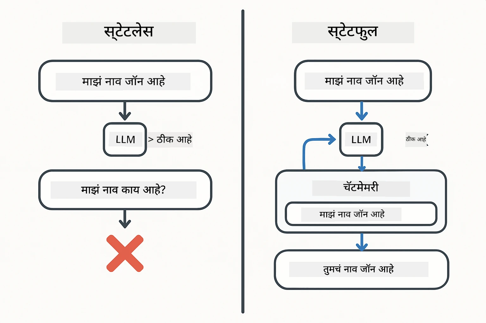
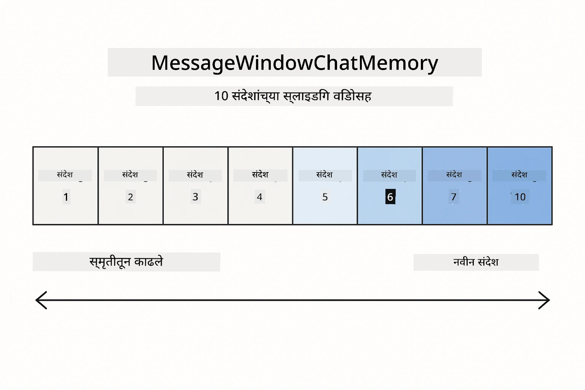
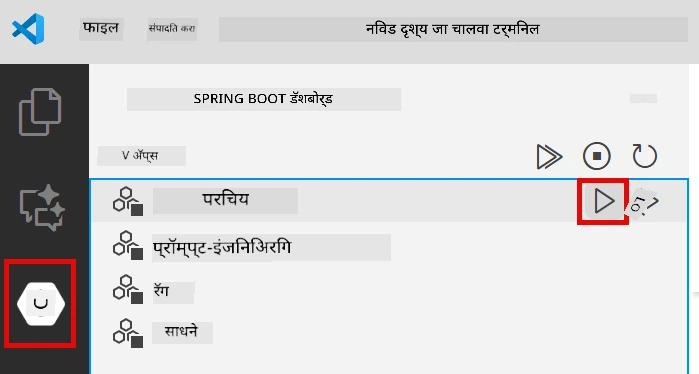
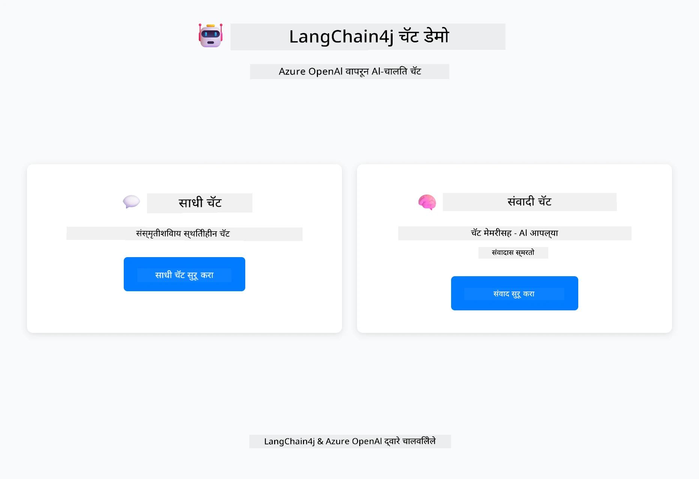
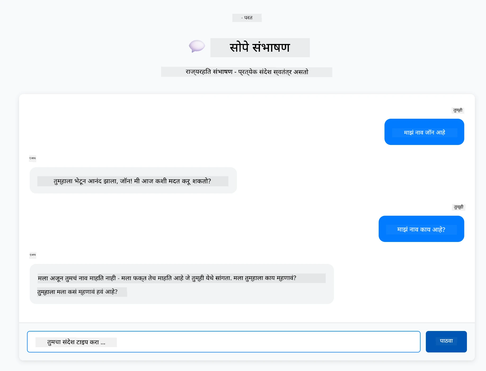
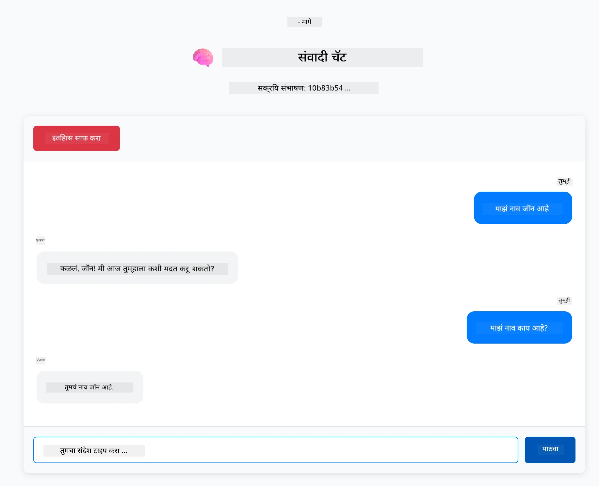

# Module 01: LangChain4j सह प्रारंभ करणे

## अनुक्रमणिका

- [व्हिडिओ मार्गदर्शन](#व्हिडिओ-मार्गदर्शन)
- [आपण काय शिकाल](#आपण-काय-शिकाल)
- [पूर्वअट](#पूर्वअट)
- [मूलभूत समस्येचा समज](#मूलभूत-समस्येचा-समज)
- [टोकन समजणे](#टोकन्स-समजून-घेणे)
- [मेमरी कशी काम करते](#मेमरी-कशी-काम-करते)
- [LangChain4j कसे वापरते](#langchain4j-कसे-वापरते)
- [Azure OpenAI इन्फ्रास्ट्रक्चर तैनात करा](#azure-openai-इन्फ्रास्ट्रक्चर-तैनात-करा)
- [अर्ज स्थानिकपणे चालवा](#अर्ज-स्थानिकपणे-चालवा)
- [अर्जाचा वापर कसा करावा](#अर्जाचा-वापर-कसा-करावा)
  - [स्टेटलेस चॅट (डावा पॅनेल)](#स्टेटलेस-चॅट-डावा-पॅनेल)
  - [स्टेटफुल चॅट (उजवा पॅनेल)](#स्टेटफुल-चॅट-उजवा-पॅनेल)
- [पुढील टप्पे](#पुढील-टप्पे)

## व्हिडिओ मार्गदर्शन

हा थेट सत्र पहा जे तुम्हाला या मॉड्युलसह प्रारंभ करण्याचे मार्गदर्शन करते:

<a href="https://www.youtube.com/live/nl_troDm8rQ?si=6b85S8xGjWnT2fX9"></a>

## आपण काय शिकाल

हे LangChain4j आणि Azure OpenAI सह तुमचे प्रारंभिक ठिकाण आहे. आपण मूलभूत गोष्टींपासून सुरुवात करतो आणि उत्पादन-शैलीतील अनुप्रयोग तयार करतो. हा मॉड्युल संदर्भ लक्षात ठेवणारे आणि स्थिती जपणारे संभाषणात्मक AI यावर लक्ष केंद्रित करतो — हे प्रत्येक पुढील मॉड्युलसाठी मूलभूत संकल्पना आहेत.

या मार्गदर्शिकेत आपण Azure OpenAI च्या GPT-5.2 वापरू कारण त्याच्या प्रगत तर्कशक्तीमुळे वेगवेगळ्या नमुन्यांच्या वर्तनात स्पष्टता येते. जेव्हा तुम्ही मेमरी जोडता, तेव्हा फरक स्पष्टपणे दिसतो. त्यामुळे प्रत्येक घटक तुमच्या अनुप्रयोगासाठी काय आणतो हे समजणे सुलभ होते.

आपण एक अनुप्रयोग तयार करणार आहोत जो दोन्ही नमुने दर्शवेल:

**स्टेटलेस चॅट** - प्रत्येक विनंती स्वतंत्र असते. मॉडेलला मागील संदेशांची कोणतीही आठवण नसते. हे सर्वात सोपे प्रारंभिक बिंदू आहे.

**स्टेटफुल संभाषण** - प्रत्येक विनंतीत संभाषणाचा इतिहास असतो. मॉडेल अनेक वळणांवर संदर्भ राखते. हे उत्पादन अनुप्रयोगासाठी आवश्यक आहे.

## पूर्वअट

- Azure सदस्यता ज्यामध्ये Azure OpenAI प्रवेश आहे
- Java 21, Maven 3.9+
- Azure CLI (https://learn.microsoft.com/en-us/cli/azure/install-azure-cli)
- Azure Developer CLI (azd) (https://learn.microsoft.com/en-us/azure/developer/azure-developer-cli/install-azd)

> **टीप:** Java, Maven, Azure CLI आणि Azure Developer CLI (azd) पूर्व-स्थापित असतात दिलेल्या devcontainer मध्ये.

> **टीप:** हा मॉड्युल Azure OpenAI वरील GPT-5.2 वापरतो. तैनात करण्यासाठी `azd up` द्वारे स्वयंचलितपणे कॉन्फिगर केले गेले आहे - कोडमधील मॉडेल नाव बदला नाही.

## मूलभूत समस्येचा समज

भाषा मॉडेल्स स्टेटलेस असतात. प्रत्येक API कॉल स्वतंत्र असतो. जर तुम्ही "माझं नाव जॉन आहे" पाठवलं आणि नंतर विचारलं "माझं नाव काय आहे?", तर मॉडेलला तुमच्या नावाची काहीही कल्पना नसते. ते प्रत्येक विनंती प्रथम संभाषण असल्यासारखे समजते.

हे सोप्या Q&A साठी चालते पण खऱ्या अनुप्रयोगांसाठी उपयुक्त नाही. ग्राहक सेवा बोट्सना तुम्ही काय सांगितले ते आठवण ठेवायला हवे. वैयक्तिक सहाय्यकांना संदर्भ आवश्यक आहे. कोणताही बहु-टर्न संभाषण मेमरी वर अवलंबून असतो.

खालिल चित्र दोन पद्धतींचा फरक दाखवते — डावीकडे, स्टेटलेस कॉल जो नाव विसरतो; उजवीकडे, ChatMemory-backed स्टेटफुल कॉल जो नाव लक्षात ठेवतो.



*स्टेटलेस (स्वतंत्र कॉल्स) आणि स्टेटफुल (संदर्भ-ज्ञानी) संभाषणांमधील फरक*

## टोकन्स समजून घेणे

संभाषणांमध्ये डुबल्यापूर्वी, टोकन्स समजून घेणे महत्त्वाचे आहे - बेसिक युनिट्स जे भाषा मॉडेल्स प्रक्रिया करतात:


*टेक्स्ट कसा टोकन्समध्ये विभागला जातो याचे उदाहरण - "I love AI!" ४ स्वतंत्र प्रक्रिया युनिट्समध्ये रूपांतरित होतो*

टोकन्स हे AI मॉडेल्समधील टेक्स्ट मोजण्याचा आणि प्रक्रिया करण्याचा मार्ग आहे. शब्द, विरामचिन्हे, अगदी रिकाम्या जागाही टोकन्स असू शकतात. GPT-5.2 साठी एकाच वेळी प्रक्रिया करण्यास मॉडेलच्या क्षमता 400,000 टोकन्स पर्यंत आहेत (272,000 इनपुट टोकन्स आणि 128,000 आउटपुट टोकन्स). टोकन्स समजल्याने संभाषणाची लांबी आणि खर्च नियंत्रित करता येतो.

## मेमरी कशी काम करते

चॅट मेमरी स्टेटलेस समस्येवर उपाय आणते ज्यामुळे संभाषणाचा इतिहास जपला जातो. तुमची विनंती मॉडेलकडे पाठवण्यापूर्वी, फ्रेमवर्क संबंधित मागील संदेश जोडते. तुम्ही "माझं नाव काय आहे?" विचारल्यास, प्रणाली खरोखरच पूर्ण संभाषणाचा इतिहास पाठवते, ज्यामुळे मॉडेलला कळते की तुम्ही आधी "माझं नाव जॉन आहे" असं सांगितलं होतं.

LangChain4j मेमरीच्या अंमलबजावणी प्रदान करते जी हे स्वयंचलित करते. तुम्ही किती संदेश ठेवायचे ते ठरवता आणि फ्रेमवर्क संदर्भ विंडो व्यवस्थापित करते. खालील चित्रात MessageWindowChatMemory कशी सध्याच्या संदेशांचा स्लायडिंग विंडो राखते हे दाखवले आहे.



*MessageWindowChatMemory सध्याच्या संदेशांचा स्लायडिंग विंडो राखते, जुने संदेश स्वयंचलितपणे काढून टाकते*

## LangChain4j कसे वापरते

हा मॉड्युल Spring Boot सह समाकलित करतो आणि संभाषण मेमरी जोडतो. हे भाग कसे जुळतात:

**अवलंबित्वे** - दोन LangChain4j लायब्ररी जोडा:

```xml
<dependency>
    <groupId>dev.langchain4j</groupId>
    <artifactId>langchain4j</artifactId> <!-- Inherited from BOM in root pom.xml -->
</dependency>
<dependency>
    <groupId>dev.langchain4j</groupId>
    <artifactId>langchain4j-open-ai-official</artifactId> <!-- Inherited from BOM in root pom.xml -->
</dependency>
```

**चॅट मॉडेल** - Azure OpenAI ला एक Spring बीन्स म्हणून कॉन्फिगर करा ([LangChainConfig.java](../../../01-introduction/src/main/java/com/example/langchain4j/config/LangChainConfig.java)):

```java
@Bean
public OpenAiOfficialChatModel openAiOfficialChatModel() {
    return OpenAiOfficialChatModel.builder()
            .baseUrl(azureEndpoint)
            .apiKey(azureApiKey)
            .modelName(deploymentName)
            .timeout(Duration.ofMinutes(5))
            .maxRetries(3)
            .build();
}
```

बिल्डर `azd up` द्वारे सेट केलेल्या पर्यावरणीय चल कडून क्रेडेन्शियल वाचतो. `baseUrl` तुमच्या Azure एंडपॉइंटवर सेट केल्याने OpenAI क्लायंट Azure OpenAI सोबत काम करतो.

**संभाषण मेमरी** - MessageWindowChatMemory वापरून चॅट इतिहास ट्रॅक करा ([ConversationService.java](../../../01-introduction/src/main/java/com/example/langchain4j/service/ConversationService.java)):

```java
ChatMemory memory = MessageWindowChatMemory.withMaxMessages(10);

memory.add(UserMessage.from("My name is John"));
memory.add(AiMessage.from("Nice to meet you, John!"));

memory.add(UserMessage.from("What's my name?"));
AiMessage aiMessage = chatModel.chat(memory.messages()).aiMessage();
memory.add(aiMessage);
```

`withMaxMessages(10)` वापरून मेमरी तयार करा जे शेवटचे 10 संदेश ठेवते. वापरकर्ता आणि AI संदेश टाइप केलेल्या रॅपर्ससोबत जोडा: `UserMessage.from(text)` आणि `AiMessage.from(text)`. इतिहास `memory.messages()` ने मिळवा आणि तो मॉडेलला पाठवा. सेवा प्रत्येक संभाषण ID साठी स्वतंत्र मेमरी उदाहरणे साठवते, ज्यामुळे एकाच वेळी अनेक वापरकर्ते चॅट करू शकतात.

> **🤖 [GitHub Copilot](https://github.com/features/copilot) चॅटसह प्रयत्न करा:** [`ConversationService.java`](../../../01-introduction/src/main/java/com/example/langchain4j/service/ConversationService.java) उघडा आणि विचारा:
> - "MessageWindowChatMemory विंडो पूर्ण झाल्यावर कोणते संदेश काढते हे कसे ठरवते?"
> - "मी इन-मेमरीऐवजी डेटाबेस वापरून कस्टम मेमरी स्टोरेज कसे अंमलात आणू शकतो?"
> - "जुना संभाषणाचा इतिहास संक्षिप्त करण्यासाठी सारांश कसा जोडू?"

स्टेटलेस चॅट एंडपॉइंट पूर्णपणे मेमरी वगळतो - फक्त `chatModel.chat(prompt)` प्रमाणे जलद सुरुवात. स्टेटफुल एंडपॉइंट मेमरीमध्ये संदेश जोडतो, इतिहास मिळवतो आणि प्रत्येक विनंतीसह संदर्भ सामील करतो. मॉडेल कॉन्फिगरेशन सारखेच, फक्त वेगवेगळे नमुने.

## Azure OpenAI इन्फ्रास्ट्रक्चर तैनात करा

**Bash:**
```bash
cd 01-introduction
azd up  # सदस्यता आणि स्थान निवडा (eastus2 शिफारस केलेले)
```

**PowerShell:**
```powershell
cd 01-introduction
azd up  # सदस्यता आणि स्थान निवडा (eastus2 शिफारस केलेले)
```

> **टीप:** जर तुम्हाला timeout त्रुटी येत असेल (`RequestConflict: Cannot modify resource ... provisioning state is not terminal`), तर फक्त `azd up` पुन्हा चालवा. Azure स्रोत अजूनही पार्श्वभूमीमध्ये तैनात होत असू शकतात आणि पुन्हा प्रयत्न केल्याने तैनाती पूर्ण होण्यास मदत होते.

हे ते करेल:
1. GPT-5.2 आणि text-embedding-3-small मॉडेलसह Azure OpenAI संसाधन तैनात करा
2. क्रेडेन्शियल्ससह प्रोजेक्ट रूटमध्ये `.env` फाईल स्वयंचलितपणे तयार करा
3. सर्व आवश्यक पर्यावरणीय चल सेट करा

**तैनाती करताना समस्या येत आहेत?** दृष्टी टाका [Infrastructure README](infra/README.md) मध्ये तपशीलवार तांत्रिक त्रुटी निवारणासाठी ज्यात उपडोमेन नाव संघर्ष, मॅन्युअल Azure पोर्टल तैनाती टप्पे आणि मॉडेल कॉन्फिगरेशन मार्गदर्शन आहे.

**तैनात यशस्वीरित्या झाले आहे का तपासा:**

**Bash:**
```bash
cat ../.env  # AZURE_OPENAI_ENDPOINT, API_KEY, इत्यादी दाखवले पाहिजेत.
```

**PowerShell:**
```powershell
Get-Content ..\.env  # AZURE_OPENAI_ENDPOINT, API_KEY, इत्यादी दाखवले पाहिजेत.
```

> **टीप:** `azd up` आदेश स्वयंचलितपणे `.env` फाईल तयार करतो. तुम्हाला नंतर ते अपडेट करायचे असल्यास, तुम्ही `.env` फाईल हाताने संपादित करू शकता किंवा पुढीलप्रमाणे पुन्हा त्याची निर्मिती करू शकता:
>
> **Bash:**
> ```bash
> cd ..
> bash .azd-env.sh
> ```
>
> **PowerShell:**
> ```powershell
> cd ..
> .\.azd-env.ps1
> ```

## अर्ज स्थानिकपणे चालवा

**तैनातीची पुष्टी करा:**

मुळ निर्देशिकेत Azure क्रेडेन्शियलसह `.env` फाईल आहे याची खात्री करा. हा कमांड मॉड्युल निर्देशिकेतून चालवा (`01-introduction/`):

**Bash:**
```bash
cat ../.env  # AZURE_OPENAI_ENDPOINT, API_KEY, DEPLOYMENT दर्शवायला हवे
```

**PowerShell:**
```powershell
Get-Content ..\.env  # AZURE_OPENAI_ENDPOINT, API_KEY, DEPLOYMENT दाखवले पाहिजे
```

**अर्ज सुरू करा:**

**पर्याय 1: Spring Boot डॅशबोर्ड वापरून (VS Code वापरकर्त्यांसाठी शिफारस)**

devcontainer मध्ये Spring Boot डॅशबोर्ड एक्सटेंशन समाविष्ट आहे, जे सर्व Spring Boot अनुप्रयोग व्यवस्थापित करण्यासाठी व्हिज्युअल इंटरफेस प्रदान करतो. VS Code च्या डाव्या बाजूला Activity Bar मध्ये Spring Boot आयकॉन शोधा.

Spring Boot डॅशबोर्ड मधून तुम्ही:
- वर्कस्पेस मधील सर्व उपलब्ध Spring Boot अनुप्रयोग पाहू शकता
- अनुप्रयोग एका क्लिकने सुरू किंवा थांबवू शकता
- अनुप्रयोग लॉग्स रिअल-टाईम मध्ये पाहू शकता
- अनुप्रयोग स्थिती निरीक्षण करू शकता

फक्त "introduction" च्या बाजूला प्ले बटणावर क्लिक करा हा मॉड्युल सुरू करण्यासाठी, किंवा सर्व मॉड्युल एकाच वेळी सुरू करा.



*VS Code मधील Spring Boot डॅशबोर्ड — एकाच ठिकाणी सर्व मॉड्युल सुरू, थांबवून आणि निरीक्षण करा*

**पर्याय 2: शेल स्क्रिप्ट वापरून**

सर्व वेब अनुप्रयोग (मॉड्युल 01-04) सुरू करा:

**Bash:**
```bash
cd ..  # मुळ निर्देशिकेतून
./start-all.sh
```

**PowerShell:**
```powershell
cd ..  # रूट संचिकास्थळावरून
.\start-all.ps1
```

किंवा फक्त हा मॉड्युल सुरू करा:

**Bash:**
```bash
cd 01-introduction
./start.sh
```

**PowerShell:**
```powershell
cd 01-introduction
.\start.ps1
```

दोन्ही स्क्रिप्ट्स मुळ `.env` फाईलमधून पर्यावरणीय चल लोड करतात आणि JAR तयार करतात जर ते अस्तित्वात नसतील.

> **टीप:** जर तुम्हाला सर्व मॉड्युल्स आधी मॅन्युअली तयार करायचे असतील:
>
> **Bash:**
> ```bash
> cd ..  # Go to root directory
> mvn clean package -DskipTests
> ```
>
> **PowerShell:**
> ```powershell
> cd ..  # Go to root directory
> mvn clean package -DskipTests
> ```

तुमच्या ब्राउझरमध्ये http://localhost:8080 उघडा.

**थांबवण्यासाठी:**

**Bash:**
```bash
./stop.sh  # फक्त हा मॉड्यूल
# किंवा
cd .. && ./stop-all.sh  # सर्व मॉड्यूल्स
```

**PowerShell:**
```powershell
.\stop.ps1  # हा फक्त मॉड्यूल
# किंवा
cd ..; .\stop-all.ps1  # सर्व मॉड्यूल्स
```

## अर्जाचा वापर कसा करावा

हा अर्ज दोन वेगळ्या चॅट अंमलबजावण्या एकत्र वेब इंटरफेसवर दर्शवितो.



*डॅशबोर्ड ज्यात सोपी चॅट (स्टेटलेस) व संभाषणात्मक चॅट (स्टेटफुल) पर्याय दिसतात*

### स्टेटलेस चॅट (डावा पॅनेल)

हे प्रथम वापरून पाहा. "माझं नाव जॉन आहे" असा संदेश द्या आणि लगेच "माझं नाव काय आहे?" विचारा. मॉडेल लक्षात ठेवणार नाही कारण प्रत्येक संदेश स्वतंत्र असतो. हे बेसिक भाषा मॉडेल एकत्रिकरणातील मुख्य समस्या दाखवते - संभाषणाचा कोणताही संदर्भ नाही.



*AI ला मागील संदेशातून तुमचं नाव आठवत नाही*

### स्टेटफुल चॅट (उजवा पॅनेल)

आता त्याच क्रमाने येथे प्रयत्न करा. "माझं नाव जॉन आहे" आणि नंतर "माझं नाव काय आहे?" विचारले की यावेळी लक्षात ठेवते. फरक आहे MessageWindowChatMemory मध्ये - ते संभाषणाचा इतिहास टिकवते आणि प्रत्येक विनंतीसह तो संदर्भ देतो. उत्पादन संभाषणात्मक AI असाच काम करतो.



*AI ला आधीच्या संभाषणातून तुमचं नाव आठवतं*

दोन्ही पॅनेल्समध्ये एकाच GPT-5.2 मॉडेलचा वापर आहे. फरक फक्त मेमरी आहे. यामुळे मेमरी तुमच्या अनुप्रयोगासाठी काय आणते आणि प्रत्यक्ष वापरासाठी का आवश्यक आहे हे स्पष्ट होते.

## पुढील टप्पे

**पुढील मॉड्युल:** [02-prompt-engineering - GPT-5.2 सह प्रॉम्प्ट अभियांत्रण](../02-prompt-engineering/README.md)

---

**नेव्हिगेशन:** [← मुख्य पृष्ठाकडे परत जा](../README.md) | [पुढील: Module 02 - Prompt Engineering →](../02-prompt-engineering/README.md)

---

<!-- CO-OP TRANSLATOR DISCLAIMER START -->
**अस्वीकरण**:
हा दस्तऐवज AI भाषांतर सेवा [Co-op Translator](https://github.com/Azure/co-op-translator) चा वापर करून अनुवादित केला आहे. जरी आम्ही अचूकतेसाठी प्रयत्न करतो, तरी कृपया लक्षात घ्या की स्वयंचलित भाषांतरांमध्ये त्रुटी किंवा अचूकतेची कमतरता असू शकते. मूळ दस्तऐवज त्याच्या मूळ भाषेत अधिकृत स्रोत मानला पाहिजे. महत्त्वाची माहिती असल्यास, व्यावसायिक मानवी भाषांतराची शिफारस केली जाते. या भाषांतराच्या वापरामुळे उद्भवणाऱ्या कोणत्याही गैरसमज किंवा चुकीच्या अर्थलावणीसाठी आम्ही जबाबदार नाही.
<!-- CO-OP TRANSLATOR DISCLAIMER END -->