<!--
CO_OP_TRANSLATOR_METADATA:
{
  "original_hash": "8d787826cad7e92bf5cdbd116b1e6116",
  "translation_date": "2025-12-13T15:59:45+00:00",
  "source_file": "02-prompt-engineering/README.md",
  "language_code": "mr"
}
-->
# Module 02: GPT-5 सह प्रॉम्प्ट अभियांत्रिकी

## अनुक्रमणिका

- [तुम्ही काय शिकाल](../../../02-prompt-engineering)
- [पूर्वअट](../../../02-prompt-engineering)
- [प्रॉम्प्ट अभियांत्रिकी समजून घेणे](../../../02-prompt-engineering)
- [हे LangChain4j कसे वापरते](../../../02-prompt-engineering)
- [मूलभूत नमुने](../../../02-prompt-engineering)
- [विद्यमान Azure संसाधने वापरणे](../../../02-prompt-engineering)
- [अर्जाचे स्क्रीनशॉट](../../../02-prompt-engineering)
- [नमुने एक्सप्लोर करणे](../../../02-prompt-engineering)
  - [कमी विरागीपणा विरुद्ध जास्त विरागीपणा](../../../02-prompt-engineering)
  - [कार्य अंमलबजावणी (टूल प्रीअँबल्स)](../../../02-prompt-engineering)
  - [स्वतःचे प्रतिबिंबित करणारा कोड](../../../02-prompt-engineering)
  - [संरचित विश्लेषण](../../../02-prompt-engineering)
  - [मल्टी-टर्न चॅट](../../../02-prompt-engineering)
  - [पायरी-दर-पायरी विचारसरणी](../../../02-prompt-engineering)
  - [बांधिल आउटपुट](../../../02-prompt-engineering)
- [तुम्ही खरोखर काय शिकत आहात](../../../02-prompt-engineering)
- [पुढील पावले](../../../02-prompt-engineering)

## तुम्ही काय शिकाल

मागील मॉड्यूलमध्ये, तुम्ही पाहिले की मेमरी कशी संभाषणात्मक AI सक्षम करते आणि GitHub मॉडेल्स वापरून मूलभूत संवाद कसे साधले जातात. आता आपण कसे प्रश्न विचारायचे - म्हणजेच प्रॉम्प्ट्स - Azure OpenAI च्या GPT-5 वापरून यावर लक्ष केंद्रित करू. तुम्ही तुमचे प्रॉम्प्ट कसे रचता याचा प्रतिसादांच्या गुणवत्तेवर मोठा परिणाम होतो.

आपण GPT-5 वापरणार आहोत कारण ते विचार करण्यावर नियंत्रण आणते - तुम्ही मॉडेलला उत्तर देण्यापूर्वी किती विचार करायचा हे सांगू शकता. यामुळे वेगवेगळ्या प्रॉम्प्टिंग धोरणे अधिक स्पष्ट होतात आणि तुम्हाला प्रत्येक पद्धत कधी वापरायची हे समजते. तसेच, GitHub मॉडेल्सच्या तुलनेत Azure कडून GPT-5 साठी कमी दर मर्यादा मिळतात.

## पूर्वअट

- मॉड्यूल 01 पूर्ण केलेले (Azure OpenAI संसाधने तैनात केलेली)
- मूळ निर्देशिकेत `.env` फाइल Azure क्रेडेन्शियल्ससह (मॉड्यूल 01 मध्ये `azd up` ने तयार केलेली)

> **टीप:** जर तुम्ही मॉड्यूल 01 पूर्ण केले नसेल, तर प्रथम तिथल्या तैनाती सूचना पाळा.

## प्रॉम्प्ट अभियांत्रिकी समजून घेणे

प्रॉम्प्ट अभियांत्रिकी म्हणजे अशी इनपुट मजकूर डिझाइन करणे जे तुम्हाला सतत हवे असलेले परिणाम देते. हे फक्त प्रश्न विचारण्याबाबत नाही - हे विनंत्या अशा प्रकारे रचण्याबाबत आहे की मॉडेल नेमके काय हवे आहे आणि ते कसे देय याचा समजून घेते.

हे समजा की तुम्ही सहकाऱ्याला सूचना देत आहात. "बग दुरुस्त करा" हा अस्पष्ट आहे. "UserService.java च्या ओळ 45 मधील null pointer exception दुरुस्त करा null check जोडून" हे विशिष्ट आहे. भाषा मॉडेल्स देखील तसेच काम करतात - विशिष्टता आणि रचना महत्त्वाची आहे.

## हे LangChain4j कसे वापरते

हा मॉड्यूल मागील मॉड्यूल्समधीलच LangChain4j पाया वापरून प्रगत प्रॉम्प्टिंग नमुने दाखवतो, ज्यामध्ये प्रॉम्प्ट रचना आणि विचार नियंत्रणावर लक्ष केंद्रित केले आहे.


*LangChain4j तुमचे प्रॉम्प्ट Azure OpenAI GPT-5 शी कसे जोडते*

**आश्रितता** - मॉड्यूल 02 मध्ये `pom.xml` मध्ये परिभाषित खालील langchain4j आश्रितता वापरली आहे:
```xml
<dependency>
    <groupId>dev.langchain4j</groupId>
    <artifactId>langchain4j</artifactId> <!-- Inherited from BOM in root pom.xml -->
</dependency>
<dependency>
    <groupId>dev.langchain4j</groupId>
    <artifactId>langchain4j-open-ai-official</artifactId> <!-- Inherited from BOM in root pom.xml -->
</dependency>
```

**OpenAiOfficialChatModel कॉन्फिगरेशन** - [LangChainConfig.java](../../../02-prompt-engineering/src/main/java/com/example/langchain4j/prompts/config/LangChainConfig.java)

चॅट मॉडेल OpenAI अधिकृत क्लायंट वापरून स्प्रिंग बीन म्हणून मॅन्युअली कॉन्फिगर केले आहे, जे Azure OpenAI एंडपॉइंट्सना समर्थन देते. मॉड्यूल 01 पेक्षा मुख्य फरक म्हणजे आपण `chatModel.chat()` ला पाठवलेले प्रॉम्प्ट कसे रचले आहेत, मॉडेल सेटअप नाही.

**सिस्टम आणि वापरकर्ता संदेश** - [Gpt5PromptService.java](../../../02-prompt-engineering/src/main/java/com/example/langchain4j/prompts/service/Gpt5PromptService.java)

LangChain4j स्पष्टतेसाठी संदेश प्रकार वेगळे करतो. `SystemMessage` AI चा वर्तन आणि संदर्भ सेट करते (उदा. "तुम्ही कोड पुनरावलोकक आहात"), तर `UserMessage` मध्ये प्रत्यक्ष विनंती असते. ही वेगळेपणा वेगवेगळ्या वापरकर्ता प्रश्नांमध्ये सातत्यपूर्ण AI वर्तन राखण्यास मदत करते.

```java
SystemMessage systemMsg = SystemMessage.from(
    "You are a helpful Java programming expert."
);

UserMessage userMsg = UserMessage.from(
    "Explain what a List is in Java"
);

String response = chatModel.chat(systemMsg, userMsg);
```

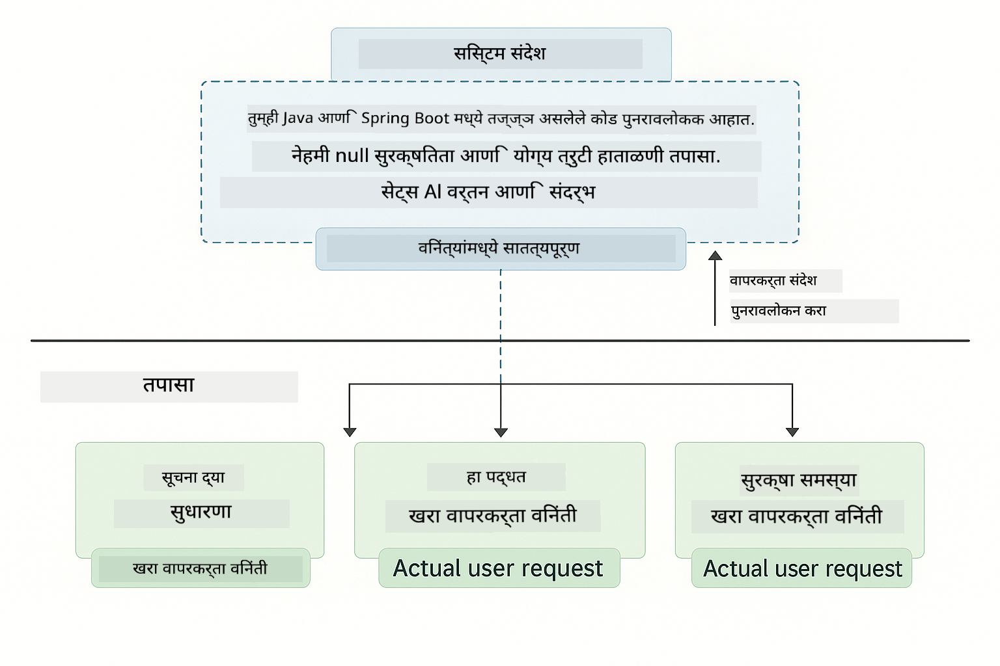

*SystemMessage सातत्यपूर्ण संदर्भ पुरवते तर UserMessages मध्ये वैयक्तिक विनंत्या असतात*

**Multi-Turn साठी MessageWindowChatMemory** - मल्टी-टर्न संभाषण नमुन्यासाठी, आपण मॉड्यूल 01 मधील `MessageWindowChatMemory` पुनर्वापर करतो. प्रत्येक सत्राला स्वतःची मेमरी उदाहरणे `Map<String, ChatMemory>` मध्ये साठवली जातात, ज्यामुळे अनेक एकाच वेळी संभाषणे संदर्भ मिसळविण्याशिवाय चालू राहतात.

**प्रॉम्प्ट टेम्पलेट्स** - येथे खरी लक्ष केंद्रित प्रॉम्प्ट अभियांत्रिकीवर आहे, नवीन LangChain4j API नाही. प्रत्येक नमुना (कमी विरागीपणा, जास्त विरागीपणा, कार्य अंमलबजावणी इ.) एकाच `chatModel.chat(prompt)` पद्धत वापरतो पण काळजीपूर्वक रचलेल्या प्रॉम्प्ट स्ट्रिंगसह. XML टॅग्स, सूचना आणि फॉरमॅटिंग हे सर्व प्रॉम्प्ट मजकूराचा भाग आहेत, LangChain4j वैशिष्ट्ये नाहीत.

**विचार नियंत्रण** - GPT-5 चा विचार करण्याचा प्रयत्न प्रॉम्प्ट सूचनांद्वारे नियंत्रित होतो जसे की "कमाल 2 विचार पायऱ्या" किंवा "सखोल तपास करा". हे प्रॉम्प्ट अभियांत्रिकी तंत्र आहेत, LangChain4j कॉन्फिगरेशन नाही. लायब्ररी फक्त तुमचे प्रॉम्प्ट मॉडेलला पोहोचवते.

महत्त्वाचा मुद्दा: LangChain4j पायाभूत सुविधा पुरवते (मॉडेल कनेक्शन [LangChainConfig.java](../../../02-prompt-engineering/src/main/java/com/example/langchain4j/prompts/config/LangChainConfig.java) द्वारे, मेमरी, संदेश हाताळणी [Gpt5PromptService.java](../../../02-prompt-engineering/src/main/java/com/example/langchain4j/prompts/service/Gpt5PromptService.java) द्वारे), तर हा मॉड्यूल तुम्हाला त्या पायाभूत सुविधेमध्ये प्रभावी प्रॉम्प्ट कसे तयार करायचे ते शिकवतो.

## मूलभूत नमुने

सर्व समस्या एकाच पद्धतीने सोडवायच्या नसतात. काही प्रश्नांना जलद उत्तर हवे असते, काहींना खोल विचार हवा असतो. काहींना दिसणारी विचारसरणी हवी असते, काहींना फक्त निकाल हवा असतो. हा मॉड्यूल आठ प्रॉम्प्टिंग नमुने कव्हर करतो - प्रत्येक वेगळ्या परिस्थितीसाठी ऑप्टिमाइझ केलेले. तुम्ही सर्वांसोबत प्रयोग कराल आणि कधी कोणती पद्धत सर्वोत्तम काम करते ते शिकाल.


*आठ प्रॉम्प्ट अभियांत्रिकी नमुन्यांचा आढावा आणि त्यांचे वापर प्रकरणे*

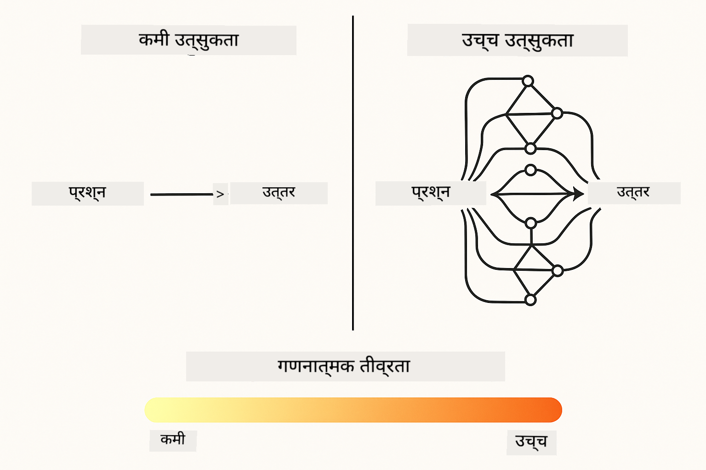

*कमी विरागीपणा (जलद, थेट) विरुद्ध जास्त विरागीपणा (सखोल, तपासणी) विचारसरणी पद्धती*

**कमी विरागीपणा (जलद आणि लक्ष केंद्रित)** - सोप्या प्रश्नांसाठी जिथे तुम्हाला जलद, थेट उत्तर हवे आहे. मॉडेल कमी विचार करते - कमाल 2 पायऱ्या. गणना, शोध किंवा सरळ प्रश्नांसाठी वापरा.

```java
String prompt = """
    <reasoning_effort>low</reasoning_effort>
    <instruction>maximum 2 reasoning steps</instruction>
    
    What is 15% of 200?
    """;

String response = chatModel.chat(prompt);
```

> 💡 **GitHub Copilot सह एक्सप्लोर करा:** [`Gpt5PromptService.java`](../../../02-prompt-engineering/src/main/java/com/example/langchain4j/prompts/service/Gpt5PromptService.java) उघडा आणि विचारा:
> - "कमी विरागीपणा आणि जास्त विरागीपणा प्रॉम्प्टिंग नमुन्यांमध्ये काय फरक आहे?"
> - "प्रॉम्प्टमधील XML टॅग्स AI च्या प्रतिसादाची रचना कशी मदत करतात?"
> - "स्वतःचे प्रतिबिंबित करणारे नमुने आणि थेट सूचना कधी वापराव्यात?"

**जास्त विरागीपणा (सखोल आणि तपासणी)** - जटिल समस्यांसाठी जिथे तुम्हाला सखोल विश्लेषण हवे आहे. मॉडेल सखोल तपासणी करते आणि तपशीलवार विचारसरणी दाखवते. सिस्टम डिझाइन, आर्किटेक्चर निर्णय किंवा जटिल संशोधनासाठी वापरा.

```java
String prompt = """
    <reasoning_effort>high</reasoning_effort>
    <instruction>explore thoroughly, show detailed reasoning</instruction>
    
    Design a caching strategy for a high-traffic REST API.
    """;

String response = chatModel.chat(prompt);
```

**कार्य अंमलबजावणी (पायरी-दर-पायरी प्रगती)** - बहु-चरण कार्यप्रवाहांसाठी. मॉडेल सुरुवातीला योजना देते, प्रत्येक पायरीचे वर्णन करते, नंतर सारांश देते. स्थलांतर, अंमलबजावणी किंवा कोणत्याही बहु-चरण प्रक्रियेसाठी वापरा.

```java
String prompt = """
    <task>Create a REST endpoint for user registration</task>
    <preamble>Provide an upfront plan</preamble>
    <narration>Narrate each step as you work</narration>
    <summary>Summarize what was accomplished</summary>
    """;

String response = chatModel.chat(prompt);
```

चेन-ऑफ-थॉट प्रॉम्प्टिंग मॉडेलला त्याची विचार प्रक्रिया दाखवण्यास सांगते, ज्यामुळे जटिल कार्यांसाठी अचूकता सुधारते. पायरी-दर-पायरी विश्लेषण माणसांना आणि AI दोघांनाही तर्क समजून घेण्यास मदत करते.

> **🤖 [GitHub Copilot](https://github.com/features/copilot) चॅटसह प्रयत्न करा:** या नमुन्याबद्दल विचारा:
> - "दीर्घकालीन ऑपरेशन्ससाठी कार्य अंमलबजावणी नमुना कसा अनुकूल करेन?"
> - "उत्पादन अनुप्रयोगांमध्ये टूल प्रीअँबल्स रचनेसाठी सर्वोत्तम पद्धती काय आहेत?"
> - "UI मध्ये मधल्या प्रगती अद्यतने कशी टिपावी आणि दाखवावी?"


*बहु-चरण कार्यांसाठी योजना → अंमलबजावणी → सारांश कार्यप्रवाह*

**स्वतःचे प्रतिबिंबित करणारा कोड** - उत्पादन-गुणवत्तेचा कोड तयार करण्यासाठी. मॉडेल कोड तयार करते, गुणवत्ता निकषांशी तपासते आणि पुनरावृत्तीने सुधारणा करते. नवीन वैशिष्ट्ये किंवा सेवा तयार करताना वापरा.

```java
String prompt = """
    <task>Create an email validation service</task>
    <quality_criteria>
    - Correct logic and error handling
    - Best practices (clean code, proper naming)
    - Performance optimization
    - Security considerations
    </quality_criteria>
    <instruction>Generate code, evaluate against criteria, improve iteratively</instruction>
    """;

String response = chatModel.chat(prompt);
```

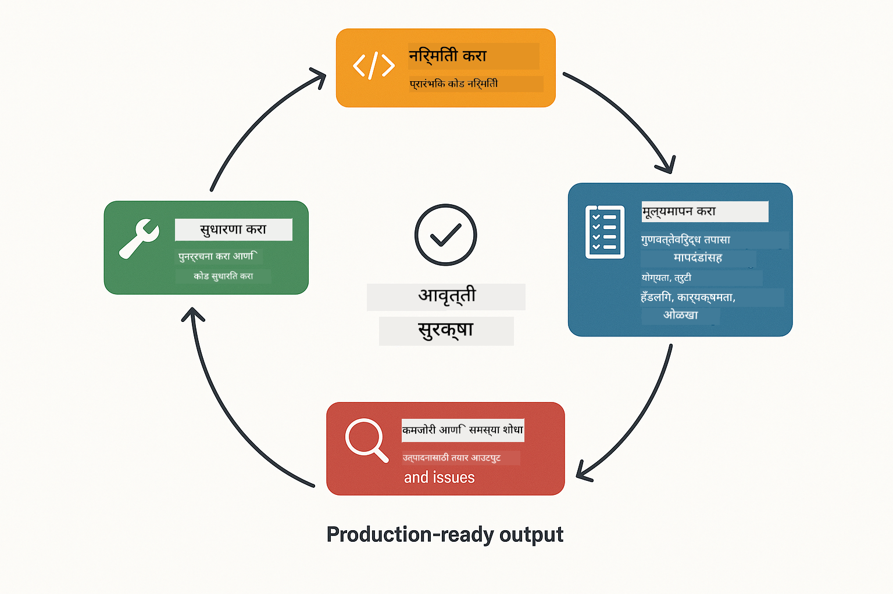

*पुनरावृत्ती सुधारणा लूप - तयार करा, मूल्यांकन करा, समस्या ओळखा, सुधारणा करा, पुनरावृत्ती करा*

**संरचित विश्लेषण** - सातत्यपूर्ण मूल्यांकनासाठी. मॉडेल कोडचे पुनरावलोकन निश्चित चौकटीत (योग्यता, पद्धती, कार्यक्षमता, सुरक्षा) करते. कोड पुनरावलोकने किंवा गुणवत्ता मूल्यांकनासाठी वापरा.

```java
String prompt = """
    <code>
    public List getUsers() {
        return database.query("SELECT * FROM users");
    }
    </code>
    
    <framework>
    Evaluate using these categories:
    1. Correctness - Logic and functionality
    2. Best Practices - Code quality
    3. Performance - Efficiency concerns
    4. Security - Vulnerabilities
    </framework>
    """;

String response = chatModel.chat(prompt);
```

> **🤖 [GitHub Copilot](https://github.com/features/copilot) चॅटसह प्रयत्न करा:** संरचित विश्लेषणाबद्दल विचारा:
> - "वेगवेगळ्या प्रकारच्या कोड पुनरावलोकनांसाठी विश्लेषण चौकट कशी सानुकूलित करावी?"
> - "संरचित आउटपुट प्रोग्रामॅटिकली पार्स आणि वापरण्याचा सर्वोत्तम मार्ग काय आहे?"
> - "वेगवेगळ्या पुनरावलोकन सत्रांमध्ये सातत्यपूर्ण गंभीरता पातळ्या कशा सुनिश्चित कराव्यात?"

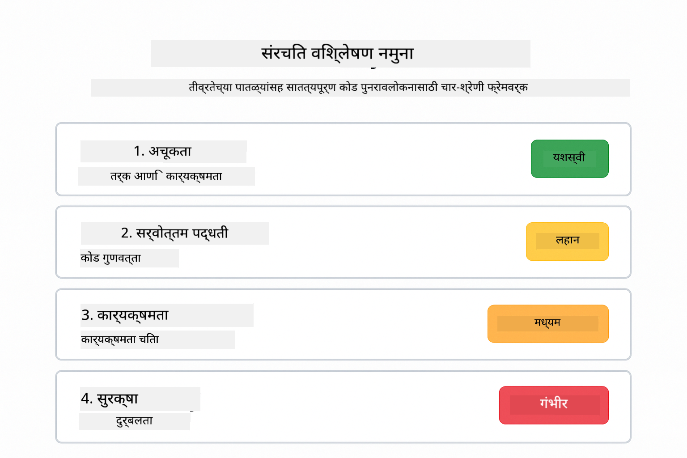

*सातत्यपूर्ण कोड पुनरावलोकनांसाठी चार-श्रेणी फ्रेमवर्क गंभीरता पातळ्यांसह*

**मल्टी-टर्न चॅट** - संदर्भ आवश्यक असलेल्या संभाषणांसाठी. मॉडेल मागील संदेश लक्षात ठेवते आणि त्यावर आधारित वाढवते. संवादात्मक मदत सत्रे किंवा जटिल प्रश्नोत्तरे यासाठी वापरा.

```java
ChatMemory memory = MessageWindowChatMemory.withMaxMessages(10);

memory.add(UserMessage.from("What is Spring Boot?"));
AiMessage aiMessage1 = chatModel.chat(memory.messages()).aiMessage();
memory.add(aiMessage1);

memory.add(UserMessage.from("Show me an example"));
AiMessage aiMessage2 = chatModel.chat(memory.messages()).aiMessage();
memory.add(aiMessage2);
```


*संवाद संदर्भ अनेक टर्नमध्ये जमा होतो जोपर्यंत टोकन मर्यादा पोहोचत नाही*

**पायरी-दर-पायरी विचारसरणी** - दृश्यमान तर्क आवश्यक असलेल्या समस्यांसाठी. मॉडेल प्रत्येक पायरीसाठी स्पष्ट विचारसरणी दाखवते. गणिती समस्या, तर्क कोडे किंवा विचार प्रक्रिया समजून घेण्यासाठी वापरा.

```java
String prompt = """
    <instruction>Show your reasoning step-by-step</instruction>
    
    If a train travels 120 km in 2 hours, then stops for 30 minutes,
    then travels another 90 km in 1.5 hours, what is the average speed
    for the entire journey including the stop?
    """;

String response = chatModel.chat(prompt);
```


*समस्यांचे स्पष्ट तर्कशास्त्रीय पायऱ्यांमध्ये विघटन*

**बांधिल आउटपुट** - विशिष्ट स्वरूप आवश्यक असलेल्या प्रतिसादांसाठी. मॉडेल कडकपणे स्वरूप आणि लांबी नियमांचे पालन करते. सारांशांसाठी किंवा अचूक आउटपुट रचनेसाठी वापरा.

```java
String prompt = """
    <constraints>
    - Exactly 100 words
    - Bullet point format
    - Technical terms only
    </constraints>
    
    Summarize the key concepts of machine learning.
    """;

String response = chatModel.chat(prompt);
```


*विशिष्ट स्वरूप, लांबी आणि रचना आवश्यकता लागू करणे*

## विद्यमान Azure संसाधने वापरणे

**तैनातीची पुष्टी करा:**

मूळ निर्देशिकेत `.env` फाइल Azure क्रेडेन्शियल्ससह अस्तित्वात आहे याची खात्री करा (मॉड्यूल 01 मध्ये तयार केलेली):
```bash
cat ../.env  # AZURE_OPENAI_ENDPOINT, API_KEY, DEPLOYMENT दाखवले पाहिजे
```

**अर्ज सुरू करा:**

> **टीप:** जर तुम्ही आधीच मॉड्यूल 01 मधील `./start-all.sh` वापरून सर्व अर्ज सुरू केले असतील, तर हा मॉड्यूल पोर्ट 8083 वर चालू आहे. तुम्ही खालील सुरू करण्याच्या आदेशांना वगळू शकता आणि थेट http://localhost:8083 वर जाऊ शकता.

**पर्याय 1: स्प्रिंग बूट डॅशबोर्ड वापरणे (VS Code वापरकर्त्यांसाठी शिफारस)**

डेव्ह कंटेनरमध्ये स्प्रिंग बूट डॅशबोर्ड विस्तार समाविष्ट आहे, जो सर्व स्प्रिंग बूट अर्ज व्यवस्थापित करण्यासाठी दृश्य इंटरफेस पुरवतो. तुम्हाला VS Code च्या डाव्या बाजूला अ‍ॅक्टिव्हिटी बारमध्ये (स्प्रिंग बूट चिन्ह शोधा) सापडेल.

स्प्रिंग बूट डॅशबोर्डमधून तुम्ही:
- वर्कस्पेसमधील सर्व उपलब्ध स्प्रिंग बूट अर्ज पाहू शकता
- एक क्लिकने अर्ज सुरू/थांबवू शकता
- रिअल-टाइममध्ये अर्ज लॉग पाहू शकता
- अर्ज स्थिती निरीक्षण करू शकता

"prompt-engineering" जवळील प्ले बटणावर क्लिक करा हा मॉड्यूल सुरू करण्यासाठी, किंवा सर्व मॉड्यूल एकत्र सुरू करा.

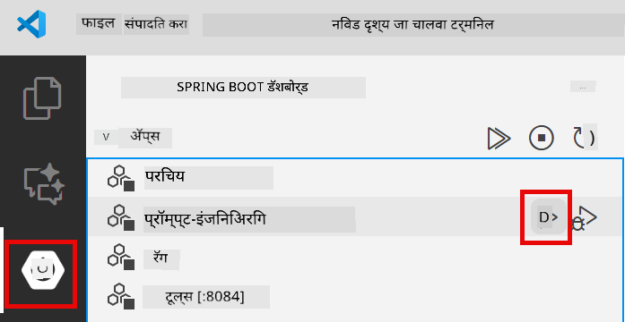

**पर्याय 2: शेल स्क्रिप्ट वापरणे**

सर्व वेब अर्ज (मॉड्यूल 01-04) सुरू करा:

**Bash:**
```bash
cd ..  # मूळ निर्देशिकेतून
./start-all.sh
```

**PowerShell:**
```powershell
cd ..  # मूळ निर्देशिकेतून
.\start-all.ps1
```

किंवा फक्त हा मॉड्यूल सुरू करा:

**Bash:**
```bash
cd 02-prompt-engineering
./start.sh
```

**PowerShell:**
```powershell
cd 02-prompt-engineering
.\start.ps1
```

दोन्ही स्क्रिप्ट्स स्वयंचलितपणे मूळ `.env` फाइलमधून पर्यावरण चल लोड करतात आणि जर JAR अस्तित्वात नसेल तर तयार करतात.

> **टीप:** जर तुम्हाला सर्व मॉड्यूल्स मॅन्युअली तयार करायचे असतील सुरू करण्यापूर्वी:
>
> **Bash:**
> ```bash
> cd ..  # Go to root directory
> mvn clean package -DskipTests
> ```
>
> **PowerShell:**
> ```powershell
> cd ..  # Go to root directory
> mvn clean package -DskipTests
> ```

तुमच्या ब्राउझरमध्ये http://localhost:8083 उघडा.

**थांबवण्यासाठी:**

**Bash:**
```bash
./stop.sh  # हा फक्त मॉड्यूल
# किंवा
cd .. && ./stop-all.sh  # सर्व मॉड्यूल्स
```

**PowerShell:**
```powershell
.\stop.ps1  # हा फक्त मॉड्यूल
# किंवा
cd ..; .\stop-all.ps1  # सर्व मॉड्यूल्स
```

## अर्जाचे स्क्रीनशॉट


*मुख्य डॅशबोर्ड जे सर्व 8 प्रॉम्प्ट अभियांत्रिकी नमुने त्यांची वैशिष्ट्ये आणि वापर प्रकरणांसह दाखवते*

## नमुने एक्सप्लोर करणे

वेब इंटरफेस तुम्हाला वेगवेगळ्या प्रॉम्प्टिंग धोरणांसह प्रयोग करण्याची परवानगी देते. प्रत्येक नमुना वेगवेगळ्या समस्या सोडवतो - त्यांना वापरून पाहा आणि कधी कोणती पद्धत सर्वोत्तम काम करते ते पहा.

### कमी विरागीपणा विरुद्ध जास्त विरागीपणा

"200 चा 15% किती?" असा सोपा प्रश्न कमी विरागीपणा वापरून विचारा. तुम्हाला त्वरित, थेट उत्तर मिळेल. आता "उच्च-ट्रॅफिक API साठी कॅशिंग धोरण डिझाइन करा" असा जटिल प्रश्न जास्त विरागीपणा वापरून विचारा. मॉडेल कसे हळू होते आणि तपशीलवार विचारसरणी देते ते पहा. एकच मॉडेल, एकच प्रश्न रचना - पण प्रॉम्प्ट त्याला किती विचार करायचा ते सांगते.


*कमी विचारसरणीसह जलद गणना*

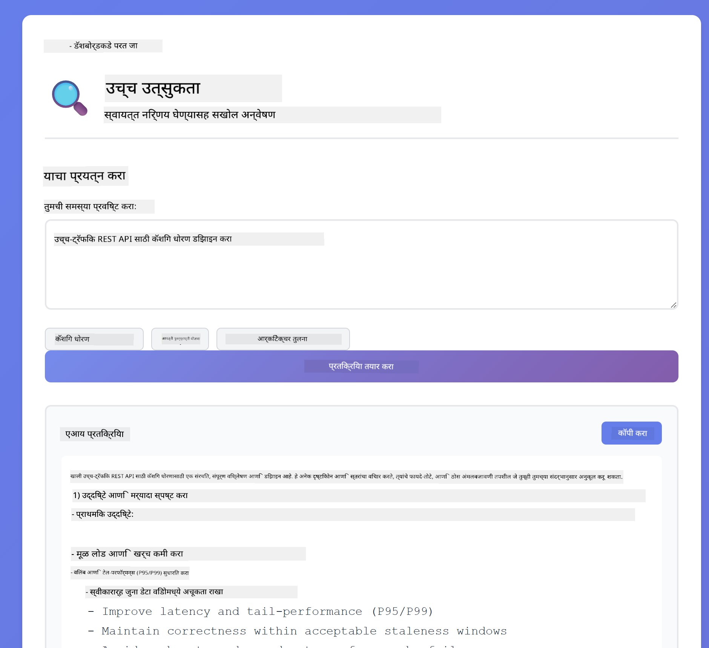

*संपूर्ण कॅशिंग धोरण (2.8MB)*

### कार्य अंमलबजावणी (टूल प्रीअँबल्स)

बहु-टप्प्यांच्या कार्यप्रवाहांना आगाऊ नियोजन आणि प्रगती वर्णन याचा फायदा होतो. मॉडेल काय करणार आहे हे सांगते, प्रत्येक टप्पा वर्णन करते, नंतर निकालांचे सारांश देते.

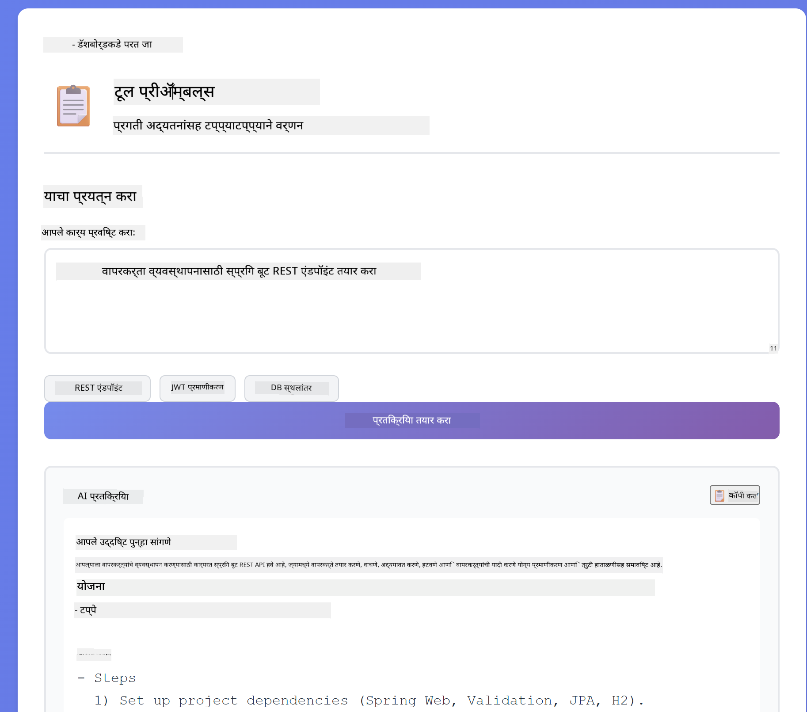

*टप्प्याटप्प्याने वर्णनासह REST एंडपॉइंट तयार करणे (3.9MB)*

### स्व-प्रतिबिंबित कोड

"ईमेल सत्यापन सेवा तयार करा" असे प्रयत्न करा. फक्त कोड तयार करून थांबण्याऐवजी, मॉडेल तयार करते, गुणवत्ता निकषांवर मूल्यांकन करते, कमकुवत भाग ओळखते आणि सुधारणा करते. तुम्ही ते पुनरावृत्ती करताना पाहाल जोपर्यंत कोड उत्पादन मानकांपर्यंत पोहोचत नाही.

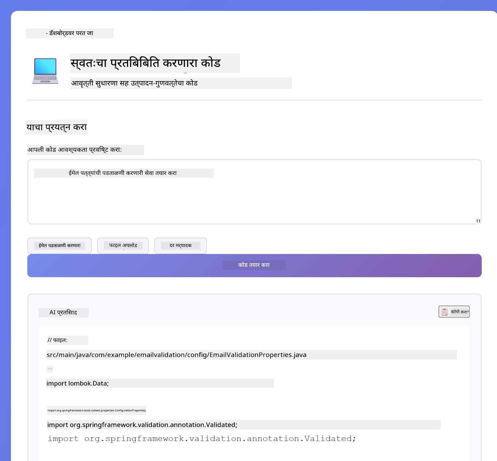

*पूर्ण ईमेल सत्यापन सेवा (5.2MB)*

### संरचित विश्लेषण

कोड पुनरावलोकनांसाठी सुसंगत मूल्यांकन फ्रेमवर्क आवश्यक असतात. मॉडेल निश्चित श्रेण्या (योग्यता, पद्धती, कार्यक्षमता, सुरक्षा) आणि तीव्रता पातळ्यांसह कोडचे विश्लेषण करते.

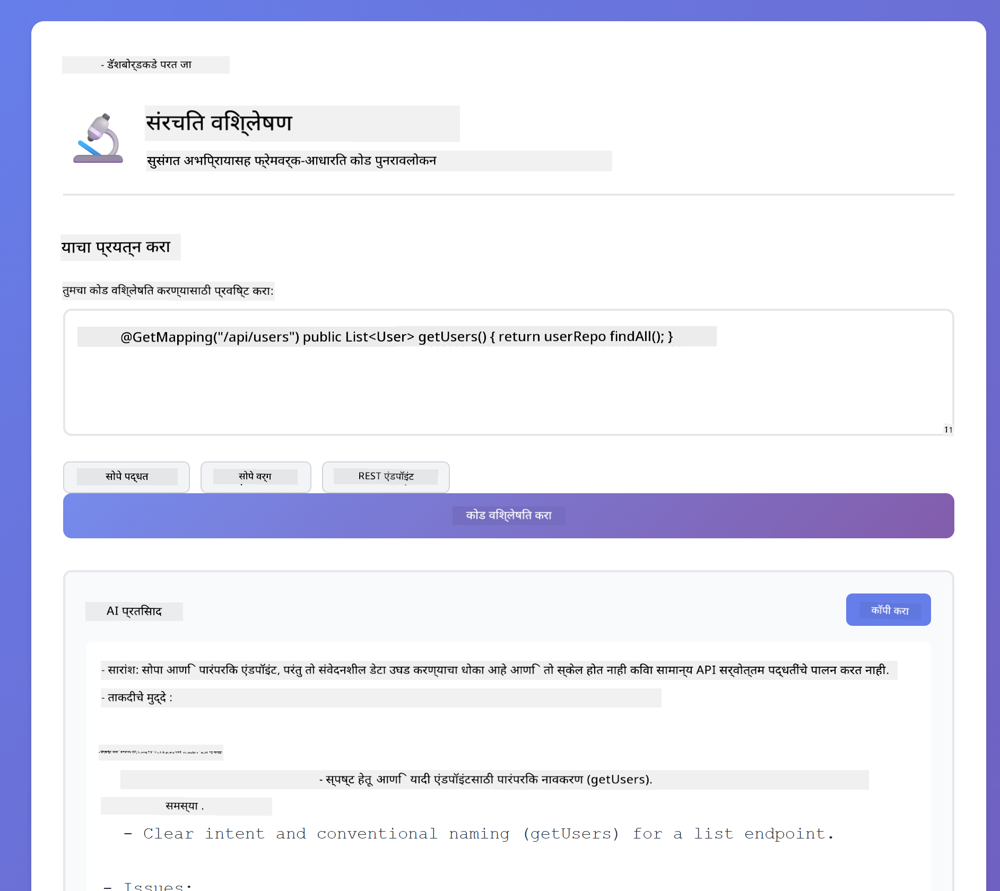

*फ्रेमवर्क-आधारित कोड पुनरावलोकन*

### बहु-टर्न चॅट

"स्प्रिंग बूट म्हणजे काय?" असा प्रश्न विचारा आणि लगेच "मला एक उदाहरण दाखवा" असे पुढील प्रश्न विचारा. मॉडेल तुमचा पहिला प्रश्न लक्षात ठेवते आणि तुम्हाला स्प्रिंग बूटचे विशिष्ट उदाहरण देते. स्मृतीशिवाय, दुसरा प्रश्न फार अस्पष्ट असू शकतो.

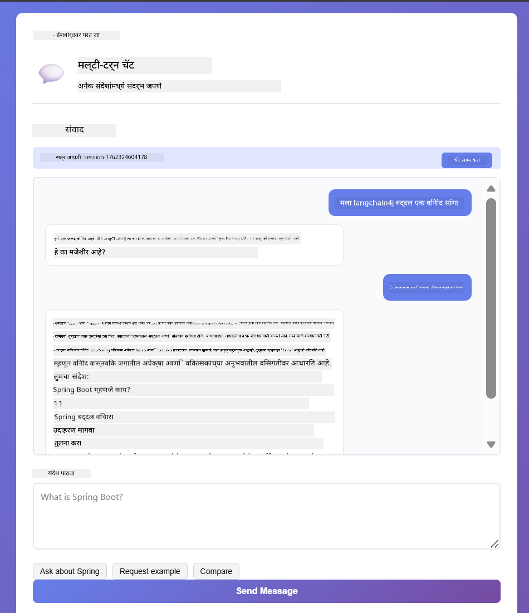

*प्रश्नांमध्ये संदर्भ जपणे*

### टप्प्याटप्प्याने विचारसरणी

कोणतीही गणिताची समस्या निवडा आणि टप्प्याटप्प्याने विचारसरणी आणि कमी उत्साह या दोन्हीने प्रयत्न करा. कमी उत्साह फक्त उत्तर देते - जलद पण अस्पष्ट. टप्प्याटप्प्याने तुम्हाला प्रत्येक गणना आणि निर्णय दाखवते.

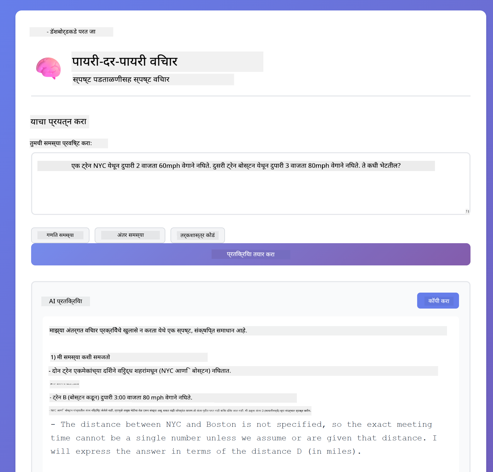

*स्पष्ट टप्प्यांसह गणिताची समस्या*

### बंधनकारक आउटपुट

जेव्हा तुम्हाला विशिष्ट स्वरूप किंवा शब्दसंख्या आवश्यक असते, तेव्हा हा नमुना कडक पालन सुनिश्चित करतो. अचूक 100 शब्दांच्या बुलेट पॉइंट स्वरूपात सारांश तयार करण्याचा प्रयत्न करा.


*स्वरूप नियंत्रणासह मशीन लर्निंग सारांश*

## तुम्ही खरोखर काय शिकत आहात

**विचारसरणीचा प्रयत्न सर्वकाही बदलतो**

GPT-5 तुम्हाला तुमच्या प्रॉम्प्टद्वारे संगणकीय प्रयत्न नियंत्रित करण्याची परवानगी देते. कमी प्रयत्न म्हणजे जलद प्रतिसाद आणि कमी शोध. जास्त प्रयत्न म्हणजे मॉडेल खोलवर विचार करण्यासाठी वेळ घेतो. तुम्ही शिकत आहात की प्रयत्न कार्याच्या गुंतागुंतीशी जुळवून घ्यायचे - सोप्या प्रश्नांवर वेळ वाया घालवू नका, पण गुंतागुंतीच्या निर्णयांवरही घाई करू नका.

**रचना वर्तन मार्गदर्शित करते**

प्रॉम्प्टमधील XML टॅग्स लक्षात घेतले का? ते फक्त सजावटीसाठी नाहीत. मॉडेल्स संरचित सूचना अधिक विश्वासार्हपणे पाळतात. जेव्हा तुम्हाला बहु-टप्प्यांची प्रक्रिया किंवा गुंतागुंतीचे लॉजिक आवश्यक असते, तेव्हा रचना मॉडेलला त्याच्या स्थितीचा आणि पुढे काय करायचे याचा मागोवा ठेवण्यास मदत करते.

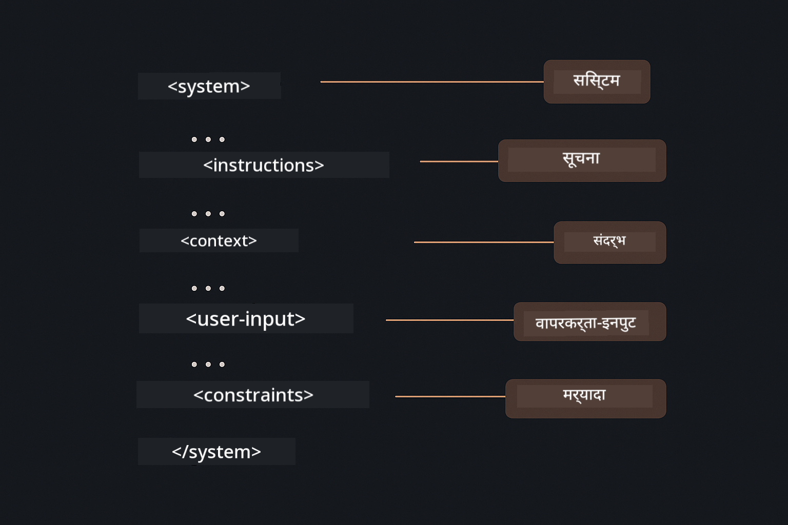

*स्पष्ट विभाग आणि XML-शैलीच्या संघटनेसह चांगल्या रचनेचा प्रॉम्प्ट*

**स्व-मूल्यांकनाद्वारे गुणवत्ता**

स्व-प्रतिबिंबित नमुने गुणवत्ता निकष स्पष्ट करून कार्य करतात. मॉडेल "योग्य करते" अशी आशा करण्याऐवजी, तुम्ही त्याला "योग्य" म्हणजे काय ते नेमके सांगता: योग्य लॉजिक, त्रुटी हाताळणी, कार्यक्षमता, सुरक्षा. मग मॉडेल स्वतःच्या आउटपुटचे मूल्यांकन करू शकते आणि सुधारणा करू शकते. यामुळे कोड निर्मिती लॉटरीऐवजी एक प्रक्रिया बनते.

**संदर्भ मर्यादित आहे**

बहु-टर्न संभाषणे प्रत्येक विनंतीसह संदेश इतिहास समाविष्ट करून कार्य करतात. पण मर्यादा आहे - प्रत्येक मॉडेलची कमाल टोकन संख्या असते. संभाषणे वाढत गेल्यावर, तुम्हाला संबंधित संदर्भ जपण्यासाठी धोरणे आवश्यक असतात ज्यामुळे ती मर्यादा ओलांडली जात नाही. हा मॉड्यूल तुम्हाला स्मृती कशी कार्य करते हे दाखवतो; नंतर तुम्ही कधी सारांश करायचा, कधी विसरायचे आणि कधी पुनर्प्राप्त करायचे हे शिकाल.

## पुढील पावले

**पुढील मॉड्यूल:** [03-rag - RAG (Retrieval-Augmented Generation)](../03-rag/README.md)

---

**नेव्हिगेशन:** [← मागील: मॉड्यूल 01 - परिचय](../01-introduction/README.md) | [मुख्य पृष्ठावर परत](../README.md) | [पुढे: मॉड्यूल 03 - RAG →](../03-rag/README.md)

---

<!-- CO-OP TRANSLATOR DISCLAIMER START -->
**अस्वीकरण**:
हा दस्तऐवज AI अनुवाद सेवा [Co-op Translator](https://github.com/Azure/co-op-translator) वापरून अनुवादित केला आहे. आम्ही अचूकतेसाठी प्रयत्नशील असलो तरी, कृपया लक्षात घ्या की स्वयंचलित अनुवादांमध्ये चुका किंवा अचूकतेच्या त्रुटी असू शकतात. मूळ दस्तऐवज त्याच्या स्थानिक भाषेत अधिकृत स्रोत मानला जावा. महत्त्वाच्या माहितीसाठी व्यावसायिक मानवी अनुवाद शिफारसीय आहे. या अनुवादाच्या वापरामुळे उद्भवलेल्या कोणत्याही गैरसमजुती किंवा चुकीच्या अर्थलागी आम्ही जबाबदार नाही.
<!-- CO-OP TRANSLATOR DISCLAIMER END -->