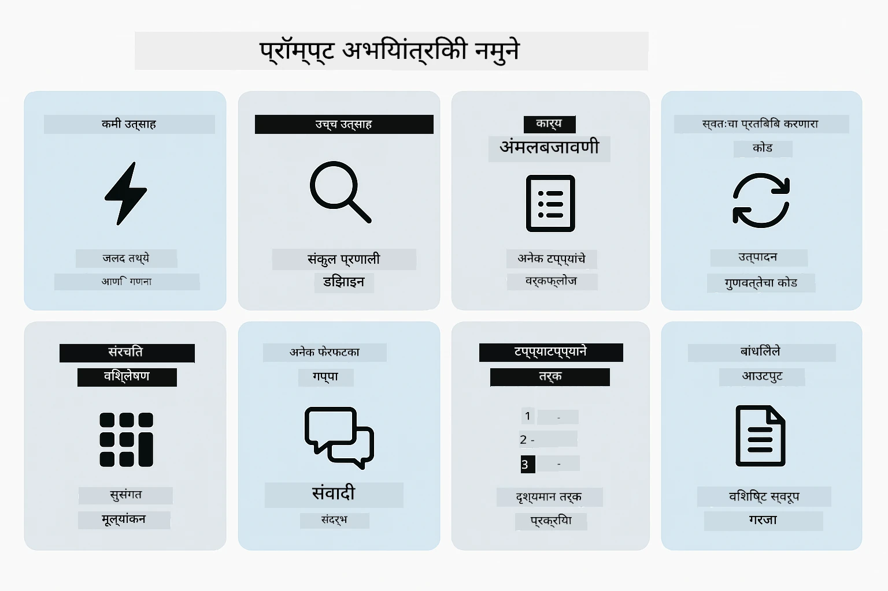
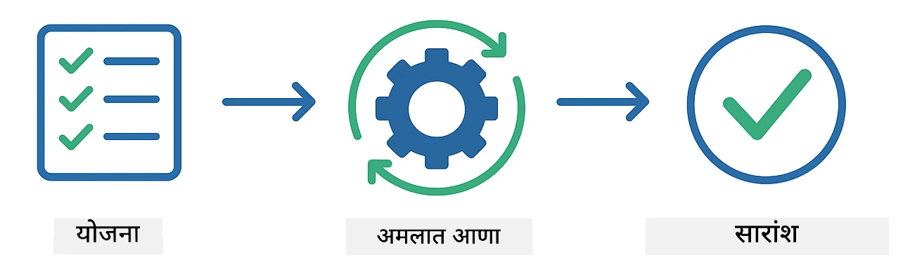
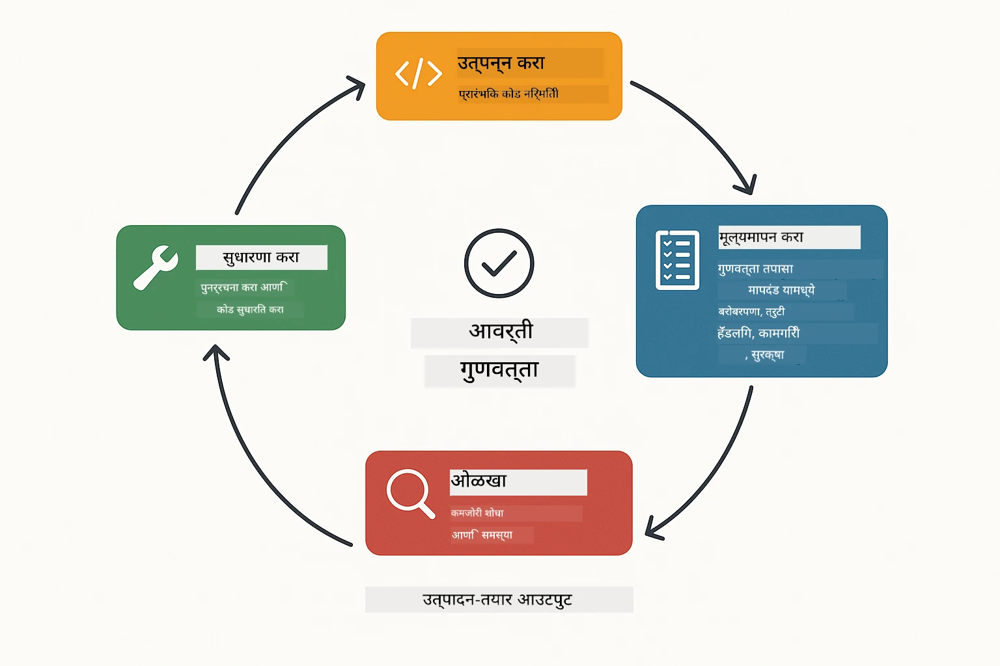
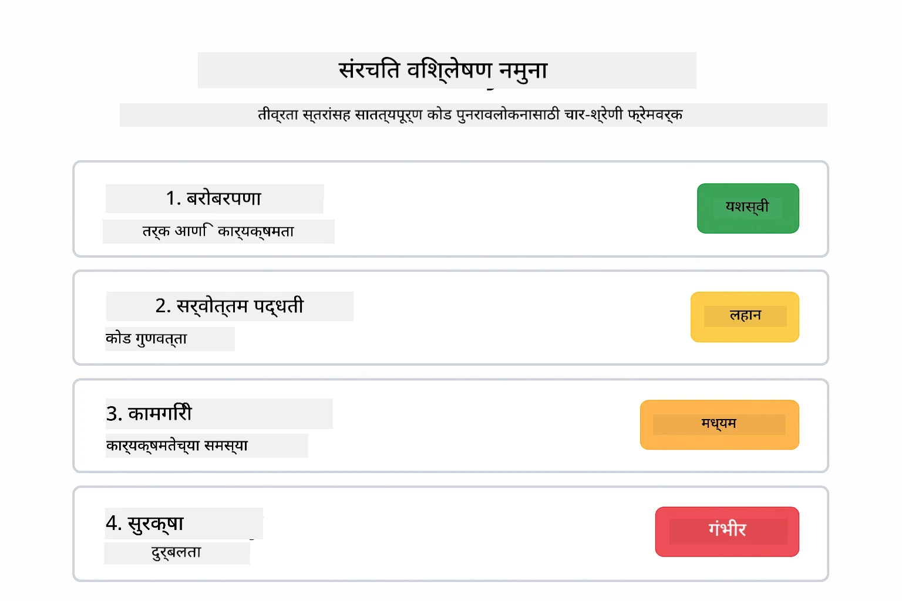
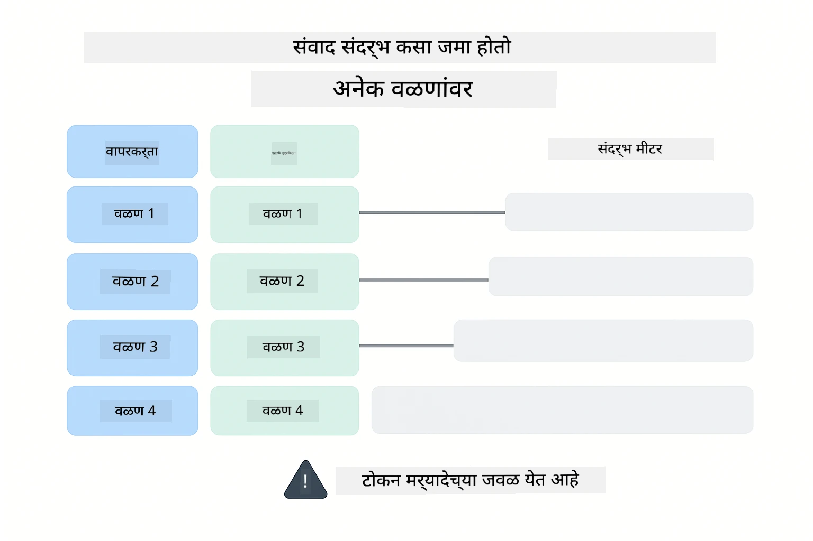
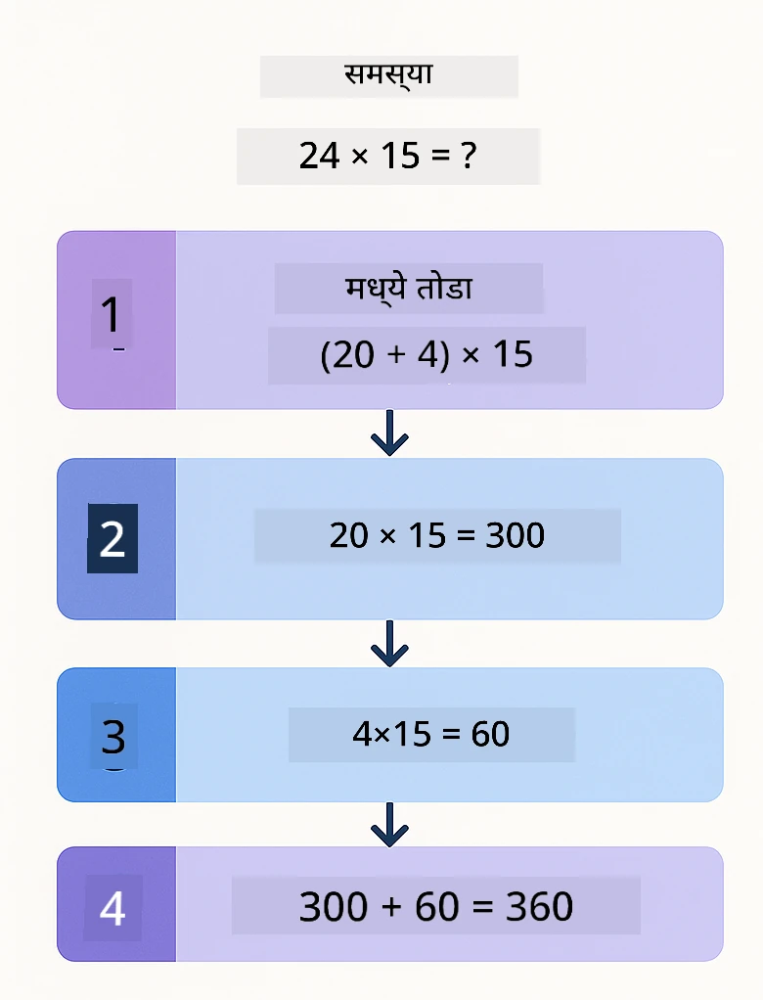
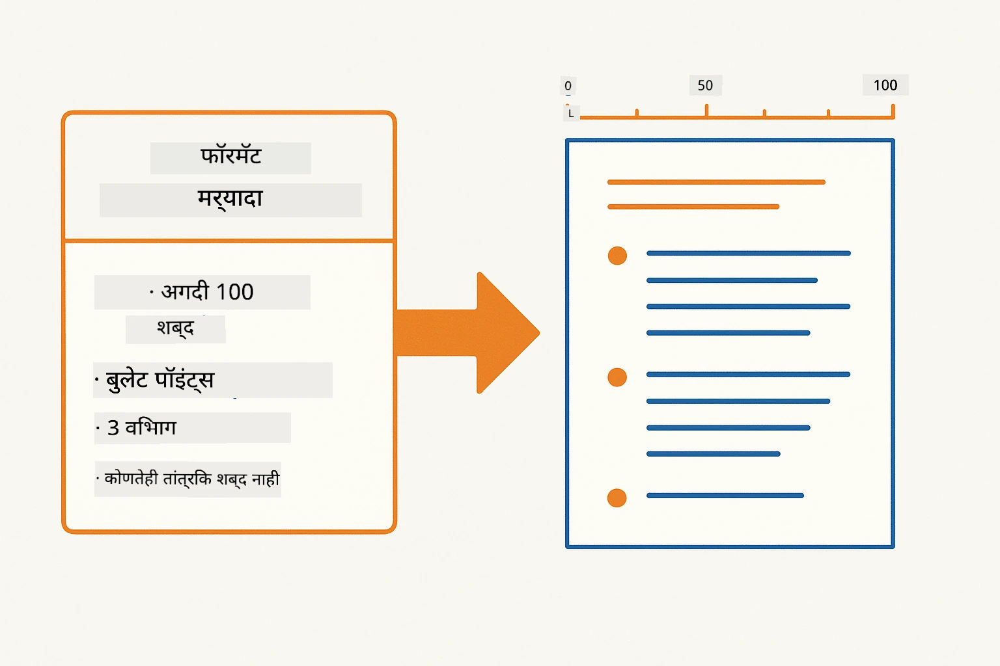
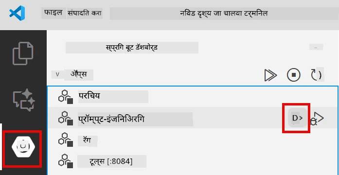
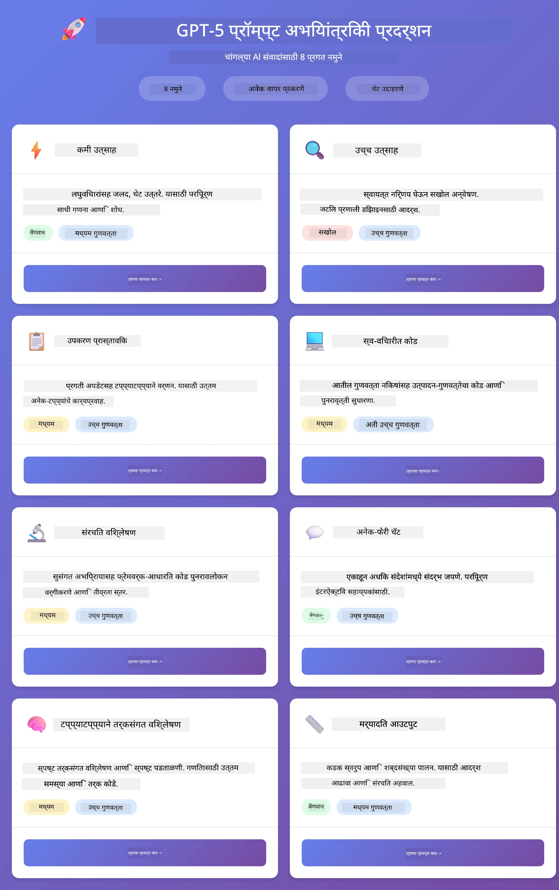
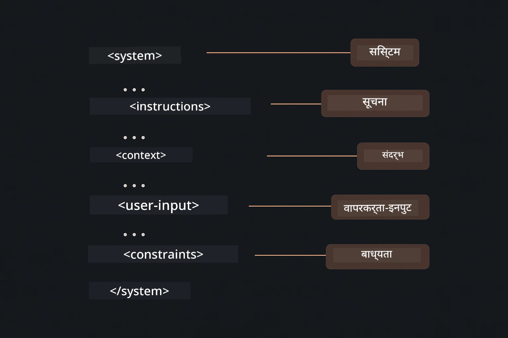

# Module 02: GPT-5.2 सह प्रॉम्प्ट अभियांत्रिकी

## अनुक्रमणिका

- [व्हिडिओ वॉकथ्रू](#व्हिडिओ-वॉकथ्रू)
- [आपण काय शिकणार आहात](#आपण-काय-शिकणार-आहात)
- [पूर्वअटी](#पूर्वअटी)
- [प्रॉम्प्ट अभियांत्रिकी समजून घेणे](#प्रॉम्प्ट-अभियांत्रिकी-समजून-घेणे)
- [प्रॉम्प्ट अभियांत्रिकी मूलतत्त्वे](#प्रॉम्प्ट-अभियांत्रिकी-मूलतत्त्वे)
  - [झीरो-शॉट प्रॉम्प्टिंग](#झीरो-शॉट-प्रॉम्प्टिंग)
  - [फ्यू-शॉट प्रॉम्प्टिंग](#फ्यू-शॉट-प्रॉम्प्टिंग)
  - [चेन ऑफ थॉट](#चेन-ऑफ-थॉट)
  - [रोल-आधारित प्रॉम्प्टिंग](#रोल-आधारित-प्रॉम्प्टिंग)
  - [प्रॉम्प्ट टेम्पलेट्स](#प्रॉम्प्ट-टेम्पलेट्स)
- [प्रगत नमुन्यांसाठी](#प्रगत-नमुने)
- [अॅप्लिकेशन चालवा](#अनुप्रयोग-चालवा)
- [अॅप्लिकेशन स्क्रीनशॉट्स](#अनुप्रयोगाचे-स्क्रीनशॉट)
- [नमुने एक्सप्लोर करणे](#पॅटर्न्सचे-अन्वेषण-करणे)
  - [कमी विरुद्ध जास्त उत्सुकता](#low-vs-high-eagerness)
  - [टास्क अंमलबजावणी (टूल प्रीअ‍ॅंबल्स)](#task-execution-tool-preambles)
  - [स्वतःचे परावर्तन करणारा कोड](#self-reflecting-code)
  - [रचनेत विश्लेषण](#structured-analysis)
  - [मल्टी-टर्न चॅट](#multi-turn-chat)
  - [टप्प्याटप्प्याने तर्क](#step-by-step-reasoning)
  - [बाधित आउटपुट](#constrained-output)
- [आपण खरोखर काय शिकत आहात](#तुम्ही-खरोखर-काय-शिकत-आहात)
- [पुढील पावले](#पुढचे-टप्पे)

## व्हिडिओ वॉकथ्रू

हा लायव्ह सत्र पहा जो या मॉड्यूलसह कसे प्रारंभ करायचे हे समजावून सांगतो:

<a href="https://www.youtube.com/live/PJ6aBaE6bog?si=LDshyBrTRodP-wke"></a>

## आपण काय शिकणार आहात

खाली दिलेला आकृती या मॉड्युलमध्ये आपण विकसीत करणार असलेले मुख्य विषय आणि कौशल्यांचे आराखडा देतो — प्रॉम्प्ट सुधारणा तंत्रांपासून ते आपण अनुसरण करणार्‍या टप्प्याटप्प्यांच्या कार्यप्रवाहापर्यंत.


पूर्वीच्या मॉड्यूलमध्ये, आपण पाहिले की मेमरी कशी Azure OpenAI सह संभाषणात्मक AI सक्षम करते. आता आपण प्रश्न कसे विचाराल यावर लक्ष देणार आहोत — प्रॉम्प्ट्स स्वतः — Azure OpenAI च्या GPT-5.2 वापरून. आपले प्रॉम्प्ट कसे संरचित केले जातात याचा प्रतिसादांची गुणवत्ता मोठ्या प्रमाणात परिणाम होतो. आपण मूलभूत प्रॉम्प्टिंग तंत्रांचे पुनरावलोकन करतो, मग पुढे चालून आठ प्रगत नमुन्यांकडे वळतो जे GPT-5.2 च्या क्षमतांचा पूर्ण फायदा घेतात.

आपण GPT-5.2 वापरणार आहोत कारण ते तर्क नियंत्रण आणते - आपण मॉडेलला सांगू शकता की उत्तर देण्यापूर्वी त्याने किती विचार करायचा आहे. यामुळे वेगवेगळ्या प्रॉम्प्टिंग रणनीती अधिक स्पष्ट होतात आणि आपल्याला प्रत्येक दृष्टिकोन कधी वापरायचा हे समजण्यास मदत होते.

## पूर्वअटी

- Module 01 पूर्ण (Azure OpenAI संसाधने तैनात केली)
- मूळ डिरेक्टरीमध्ये `.env` फाइल आहे ज्यात Azure क्रेडेन्शियल्स आहेत (Module 01 मध्ये `azd up` द्वारा तयार)

> **नोट:** जर आपण Module 01 पूर्ण केले नसेल, तर तिथल्या तैनाती सूचना प्रथम पाळा.

## प्रॉम्प्ट अभियांत्रिकी समजून घेणे

मुळत: प्रॉम्प्ट अभियांत्रिकी ही अस्पष्ट सूचना आणि अचूक सूचनेतील फरक आहे, खालील तुलना हे दर्शविते.


प्रॉम्प्ट अभियांत्रिकी म्हणजे अशा इनपुट टेक्स्ट डिझाइन करणे जे सातत्याने आपल्याला आवश्यक परिणाम देते. हे फक्त प्रश्न विचारण्याबाबतच नाही - हे विनंतींची रचना करण्याबाबत आहे ज्यामुळे मॉडेल आपल्याला नेमकं काय पाहिजे हे समजते आणि कसे प्रदान करायचे ते कळते.

हे जसे आपण सहकाऱ्याला सूचना देतो तशासारखे विचार करा. "बग दुरुस्त करा" हा अस्पष्ट आहे. "UserService.java च्या ओळ 45 मधील नल पॉइंटर अपवाद दुरुस्त करा आणि नल तपासणी जोडा" हे विशिष्ट आहे. भाषा मॉडेल्स देखील तसेच काम करतात - विशिष्टता आणि रचना महत्त्वाची असते.

खालील आकृती दर्शविते की LangChain4j या चित्रात कसा बसतो — आपल्या प्रॉम्प्ट नमुन्यांना SystemMessage आणि UserMessage या बांधकाम ब्लॉक्सद्वारे मॉडेलशी जोडतो.


LangChain4j हे इन्फ्रास्ट्रक्चर पुरवते — मॉडेल कनेक्शन्स, मेमरी, आणि मेसेज प्रकार — तर प्रॉम्प्ट नमुने फक्त काळजीपूर्वक संरचित टेक्स्ट आहेत जे आपण त्या इन्फ्रास्ट्रक्चरमधून पाठवतो. मुख्य ब्लॉक्स म्हणजे `SystemMessage` (जो AI चे वर्तन आणि भूमिका सेट करतो) आणि `UserMessage` (जो आपली प्रत्यक्ष विनंती वाहक असतो).

## प्रॉम्प्ट अभियांत्रिकी मूलतत्त्वे

खाली दिलेले पाच कोर तंत्रज्ञान प्रभावी प्रॉम्प्ट अभियांत्रिकीचे मूलतत्त्व बनवतात. प्रत्येक वेगळ्या पैलूला सामोरे जाते ज्याद्वारे आपण भाषा मॉडेलशी संवाद साधता.


या मॉडुलच्या प्रगत नमुन्यांमध्ये उतरल्यापूर्वी, चला पाच मूलभूत प्रॉम्प्टिंग तंत्रांचा पुनरावलोकन करू. हे त्या मूलभूत ब्लॉक्स आहेत जे प्रत्येक प्रॉम्प्ट अभियंता जाणून घेणे आवश्यक आहे.

### झीरो-शॉट प्रॉम्प्टिंग

सर्वात सोपा दृष्टिकोन: मॉडेलला थेट सूचना द्या, कोणतेही उदाहरणांशिवाय. मॉडेल पूर्णपणे त्याच्या प्रशिक्षणावर अवलंबून असते कार्य समजून घेण्यासाठी आणि अंमलात आणण्यासाठी. हे सोप्या विनंत्यांसाठी उत्तम काम करते जिथे अपेक्षित वर्तन स्पष्ट असते.


*उदाहरणांशिवाय थेट सूचना — मॉडेल फक्त सूचनांपासून कार्याचा अर्थ निघवते*

```java
String prompt = "Classify this sentiment: 'I absolutely loved the movie!'";
String response = model.chat(prompt);
// प्रतिसाद: "सकारात्मक"
```

**कधी वापरायचे:** सोप्या वर्गीकरणांसाठी, थेट प्रश्नांसाठी, भाषांतरांसाठी, किंवा कोणतेही कार्य जे मॉडेल अधिक मार्गदर्शनाशिवाय हाताळू शकते.

### फ्यू-शॉट प्रॉम्प्टिंग

उदाहरणे द्या जी मॉडेलला आपण ज्या नमुन्याचे अनुसरण करावे असे दर्शवतात. मॉडेल आपल्याकडून दिलेल्या उदाहरणांमधून अपेक्षित इनपुट-आउटपुट स्वरूप शिकते आणि ते नवीन इनपुटवर लागू करते. हे सदृढतेत मोठ्या प्रमाणावर सुधारणा करते जिथे इच्छित स्वरूप किंवा वर्तन स्पष्ट नाही.


*उदाहरणांमधून शिकणे — मॉडेल नमुना ओळखते आणि नवीन इनपुटवर लागू करते*

```java
String prompt = """
    Classify the sentiment as positive, negative, or neutral.
    
    Examples:
    Text: "This product exceeded my expectations!" → Positive
    Text: "It's okay, nothing special." → Neutral
    Text: "Waste of money, very disappointed." → Negative
    
    Now classify this:
    Text: "Best purchase I've made all year!"
    """;
String response = model.chat(prompt);
```

**कधी वापरायचे:** सानुकूल वर्गीकरणांसाठी, सुसंगत स्वरूपासाठी, विशिष्ट क्षेत्रातील कार्यांसाठी, किंवा जेव्हा झीरो-शॉट निकाल अस्थिर असतात.

### चेन ऑफ थॉट

मॉडेलला त्याचे तर्क टप्प्याटप्प्याने दाखवण्यास सांगा. थेट उत्तर देण्याऐवजी, मॉडेल समस्या उलगडतो आणि प्रत्येक भाग स्पष्टपणे कार्यान्वित करतो. हे गणित, तर्क, आणि बहु-टप्प्याच्या तर्क कार्यांसाठी अचूकता वाढवते.


*टप्प्याटप्प्याने तर्क — गुंतागुंतीच्या समस्यांचे स्पष्ट लॉजिकल टप्पे करणे*

```java
String prompt = """
    Problem: A store has 15 apples. They sell 8 apples and then 
    receive a shipment of 12 more apples. How many apples do they have now?
    
    Let's solve this step-by-step:
    """;
String response = model.chat(prompt);
// मॉडेल दर्शवितो: 15 - 8 = 7, नंतर 7 + 12 = 19 सफरचंदं
```

**कधी वापरायचे:** गणितीय समस्या, तर्क प्रश्न, डीबगिंग, किंवा कोणत्याही कार्यासाठी जिथे तर्क प्रक्रियेचे प्रदर्शन अचूकता आणि विश्वास वाढवते.

### रोल-आधारित प्रॉम्प्टिंग

AI साठी प्रश्न विचारण्यापूर्वी एक व्यक्तिरेखा किंवा भूमिका सेट करा. हे त्या प्रतिसादाचा टोन, सखोलता आणि फोकस घडवते. “सॉफ्टवेअर आर्किटेक्ट” या भूमिकेकडून वेगळे सल्ले मिळतात “जूनीअर डेव्हलपर” किंवा “सिक्युरिटी ऑडिटर” यांच्या तुलनेत.


*संदर्भ आणि व्यक्तिरेखा सेट करणे — दिलेला प्रश्न दिलेल्या भूमिकेनुसार वेगळ्या प्रकारे उत्तर देतो*

```java
String prompt = """
    You are an experienced software architect reviewing code.
    Provide a brief code review for this function:
    
    def calculate_total(items):
        total = 0
        for item in items:
            total = total + item['price']
        return total
    """;
String response = model.chat(prompt);
```

**कधी वापरायचे:** कोड पुनरावलोकनांसाठी, ट्यूटोरिंगसाठी, क्षेत्रविशिष्ट विश्लेषणासाठी, किंवा जेव्हा आपण परीक्षेची विशिष्ट पातळी किंवा दृष्टीकोन आवश्यक आहे.

### प्रॉम्प्ट टेम्पलेट्स

चल बदलांसाठी जागा असलेले पुन्हा वापरता येणारे प्रॉम्प्ट तयार करा. प्रत्येक वेळी नवीन प्रॉम्प्ट लिहिण्याऐवजी, एकदा टेम्पलेट तयार करा आणि त्यात वेगवेगळ्या मूल्यांची भर करा. LangChain4j चे `PromptTemplate` वर्ग हे `{{variable}}` सिंटॅक्स वापरून यास सोपे करते.


*चल बदलांसह पुन्हा वापरता येणारे प्रॉम्प्ट — एक टेम्पलेट, अनेक वापर*

```java
PromptTemplate template = PromptTemplate.from(
    "What's the best time to visit {{destination}} for {{activity}}?"
);

Prompt prompt = template.apply(Map.of(
    "destination", "Paris",
    "activity", "sightseeing"
));

String response = model.chat(prompt.text());
```

**कधी वापरायचे:** वेगवेगळ्या इनपुटसह पुनरावृत्ती प्रश्नांसाठी, बॅच प्रक्रिया, पुन्हा वापरता येणारे AI कार्यप्रवाह तयार करण्यासाठी, किंवा कोणत्याही परिस्थितीत जिथे प्रॉम्प्ट रचना सारखी राहते परंतु डेटा बदलतो.

---

हे पाच मूलतत्त्वे आपल्याला बहुतेक प्रॉम्प्टिंग कृत्यांसाठी एक मजबूत साधनसामुग्री देतात. या मॉड्युलचा उर्वरित भाग **आठ प्रगत नमुन्यां**वर आधारित आहे जे GPT-5.2 च्या तर्क नियंत्रण, स्व-मूल्यमापन, आणि रचनेत पडण्यासाठी क्षमतेचा उपयोग करतात.

## प्रगत नमुने

मूलतत्त्वे झाकल्यानंतर, चला आठ प्रगत नमुन्यांकडे वळू जे या मॉड्युलला खास बनवतात. सर्व प्रश्नांसाठी समान दृष्टिकोन आवश्यक नसतो. काही प्रश्नांना वेगवान उत्तरे लागतात, तर काहीना सखोल विचार हवा असतो. काहींना दृश्यमान तर्क हवाअसतो, तर इतरांना फक्त निकाल हवेत. खालील प्रत्येक नमुना वेगळ्या परिस्थितीसाठी ऑप्टिमाइझ केलेले आहे — आणि GPT-5.2 चे तर्क नियंत्रण फरक आणखी स्पष्ट करते.



*आठ प्रॉम्प्ट अभियांत्रिकी नमुन्यांचा आढावा आणि त्यांचे उपयोग प्रकरणे*

GPT-5.2 या नमुन्यांना आणखी एक परिमाण जोडते: *तर्क नियंत्रण*. खालील स्लायडर दाखवितो की आपण मॉडेलचा विचार करण्याचा प्रयत्न कसा समायोजित करू शकता — जलद, थेट उत्तरांपासून ते सखोल, पूर्ण विश्लेषणापर्यंत.


*GPT-5.2 चे तर्क नियंत्रण आपल्याला मॉडेलने किती विचार करायचा हे निर्दिष्ट करण्याची परवानगी देते — जलद थेट उत्तरे ते सखोल शोध यामध्ये*

**कमी उत्सुकता (जलद आणि लक्ष केंद्रीत)** - सोप्या प्रश्नांसाठी जेथे आपल्याला जलद, थेट उत्तरे पाहिजेत. मॉडेल किमान तर्क वापरते - कमाल 2 टप्पे. गणना, शोध, किंवा सरळ प्रश्नांसाठी वापरा.

```java
String prompt = """
    <context_gathering>
    - Search depth: very low
    - Bias strongly towards providing a correct answer as quickly as possible
    - Usually, this means an absolute maximum of 2 reasoning steps
    - If you think you need more time, state what you know and what's uncertain
    </context_gathering>
    
    Problem: What is 15% of 200?
    
    Provide your answer:
    """;

String response = chatModel.chat(prompt);
```

> 💡 **GitHub Copilot सह एक्सप्लोर करा:** [`Gpt5PromptService.java`](../../../02-prompt-engineering/src/main/java/com/example/langchain4j/prompts/service/Gpt5PromptService.java) उघडा आणि विचारा:
> - "कमी उत्सुकता आणि जास्त उत्सुकता प्रॉम्प्टिंग नमुन्यांमध्ये काय फरक आहे?"
> - "प्रॉम्प्टमधील XML टॅग्स AI चा प्रतिसाद कसा रचतात?"
> - "स्व-परावर्तन नमुने आणि थेट सूचना कधी वापराव्यात?"

**जास्त उत्सुकता (सखोल आणि पूर्ण)** - जटिल समस्यांसाठी जिथे आपल्याला सखोल विश्लेषण पाहिजे. मॉडेल सखोलपणे शोधतो आणि सविस्तर तर्क दाखवतो. सिस्टीम डिझाइन, आर्किटेक्चर निर्णय, किंवा जटिल संशोधनासाठी वापरा.

```java
String prompt = """
    Analyze this problem thoroughly and provide a comprehensive solution.
    Consider multiple approaches, trade-offs, and important details.
    Show your analysis and reasoning in your response.
    
    Problem: Design a caching strategy for a high-traffic REST API.
    """;

String response = chatModel.chat(prompt);
```

**टास्क अंमलबजावणी (टप्प्याटप्प्याने प्रगती)** - बहु-टप्प्यांच्या कार्यप्रवाहांसाठी. मॉडेल एक आराखडा आधी देतो, प्रत्येक टप्पा काम करताना सांगतो, मग सारांश देतो. माइग्रेशन्स, अंमलबजावणींसाठी किंवा कोणत्याही बहु-टप्प्याच्या प्रक्रियेसाठी वापरा.

```java
String prompt = """
    <task_execution>
    1. First, briefly restate the user's goal in a friendly way
    
    2. Create a step-by-step plan:
       - List all steps needed
       - Identify potential challenges
       - Outline success criteria
    
    3. Execute each step:
       - Narrate what you're doing
       - Show progress clearly
       - Handle any issues that arise
    
    4. Summarize:
       - What was completed
       - Any important notes
       - Next steps if applicable
    </task_execution>
    
    <tool_preambles>
    - Always begin by rephrasing the user's goal clearly
    - Outline your plan before executing
    - Narrate each step as you go
    - Finish with a distinct summary
    </tool_preambles>
    
    Task: Create a REST endpoint for user registration
    
    Begin execution:
    """;

String response = chatModel.chat(prompt);
```

चेन-ऑफ-थॉट प्रॉम्प्टिंग स्पष्टपणे मॉडेलला त्याचा तर्क प्रक्रिया दर्शवण्यास सांगते, ज्यामुळे जटिल कार्यांवरील अचूकता सुधारते. टप्प्याटप्प्याने विघटन मानव आणि AI दोघांनाही लॉजिक समजण्यात मदत करते.

> **🤖 GitHub Copilot चॅट सह प्रयत्न करा:** या नमुन्याबद्दल विचारा:
> - "लांब चालणाऱ्या ऑपरेशनसाठी टास्क अंमलबजावणी नमुना कसा जुळवेन?"
> - "प्रोडक्शन अॅप्लिकेशन्समध्ये टूल प्रीअ‍ॅंबल्सचे रचनेतील सर्वोत्तम पद्धती काय आहेत?"
> - "UI मध्ये मधल्या प्रगतीच्या अपडेट्स कसे कॅप्चर आणि प्रदर्शित करायचे?"

खालील आकृती हा Plan → Execute → Summarize कार्यप्रवाह दर्शविते.



*बहु-टप्प्यांच्या कार्यांसाठी Plan → Execute → Summarize कार्यप्रवाह*

**स्वतःचे परावर्तन करणारा कोड** - उत्पादन-गुणवत्तेचा कोड तयार करण्यासाठी. मॉडेल उत्पादन मानकांनुसार योग्य त्रुटी हाताळणीसह कोड तयार करतो. नवीन वैशिष्ट्ये किंवा सेवा तयार करताना वापरा.

```java
String prompt = """
    Generate Java code with production-quality standards: Create an email validation service
    Keep it simple and include basic error handling.
    """;

String response = chatModel.chat(prompt);
```

खालील आकृती हा पुनरावृत्ती सुधारणा चक्र दर्शविते — तयार करा, मूल्यमापन करा, कमकुवत बाजू शोधा, आणि कोड उत्पादन मानक पूर्ण होईपर्यंत सुधारणा करा.



*परावृत्ती सुधारणा चक्र - तयार करा, मूल्यमापन करा, समस्या ओळखा, सुधारणा करा, पुन्हा करा*

**रचनेत विश्लेषण** - सुसंगत मूल्यमापनासाठी. मॉडेल स्थिर फ्रेमवर्क (योग्यता, सराव, कार्यक्षमता, सुरक्षा, देखभालयोग्यता) वापरून कोड पुनरावलोकन करते. कोड पुनरावलोकन किंवा गुणवत्ता मूल्यांकनासाठी वापरा.

```java
String prompt = """
    <analysis_framework>
    You are an expert code reviewer. Analyze the code for:
    
    1. Correctness
       - Does it work as intended?
       - Are there logical errors?
    
    2. Best Practices
       - Follows language conventions?
       - Appropriate design patterns?
    
    3. Performance
       - Any inefficiencies?
       - Scalability concerns?
    
    4. Security
       - Potential vulnerabilities?
       - Input validation?
    
    5. Maintainability
       - Code clarity?
       - Documentation?
    
    <output_format>
    Provide your analysis in this structure:
    - Summary: One-sentence overall assessment
    - Strengths: 2-3 positive points
    - Issues: List any problems found with severity (High/Medium/Low)
    - Recommendations: Specific improvements
    </output_format>
    </analysis_framework>
    
    Code to analyze:
    ```
    public List getUsers() {
        return database.query("SELECT * FROM users");
    }
    ```
    Provide your structured analysis:
    """;

String response = chatModel.chat(prompt);
```

> **🤖 GitHub Copilot चॅट सह प्रयत्न करा:** रचनेत विश्लेषणाबद्दल विचारा:
> - "वेगवेगळ्या प्रकारच्या कोड पुनरावलोकनांसाठी विश्लेषण फ्रेमवर्क कसा सानुकूल करावा?"
> - "रचनेत आउटपुट प्रोग्रामॅटिकली पार्स व क्रियान्वित करण्याचा सर्वोत्तम मार्ग कोणता?"
> - "वेगवेगळ्या पुनरावलोकन सत्रांमध्ये गंभीरतेचे स्तर कसे सुसंगत ठेवायचे?"

खालील आकृती दाखवते की ही रचनाबद्ध चौकट कशी कोड पुनरावलोकनाला सुसंगत श्रेण्यांमध्ये आणि गंभीरता स्तरांसह आयोजित करते.



*गंभीरता स्तरांसह सुसंगत कोड पुनरावलोकनांसाठी फ्रेमवर्क*

**मल्टी-टर्न चॅट** - ज्यांना संदर्भाची गरज आहे अशा संवादांसाठी. मॉडेल मागील संदेश लक्षात ठेवते आणि त्यावर आधारित पुढे वाढवते. संवादात्मक मदत सत्रे किंवा जटिल प्रश्नोत्तरांसाठी वापरा.

```java
ChatMemory memory = MessageWindowChatMemory.withMaxMessages(10);

memory.add(UserMessage.from("What is Spring Boot?"));
AiMessage aiMessage1 = chatModel.chat(memory.messages()).aiMessage();
memory.add(aiMessage1);

memory.add(UserMessage.from("Show me an example"));
AiMessage aiMessage2 = chatModel.chat(memory.messages()).aiMessage();
memory.add(aiMessage2);
```

खाली आकृती दाखवते की संवाद संदर्भ कसा अनेक टप्प्यांत जमा होतो आणि तो मॉडेलच्या टोकन मर्यादेशी कसा संबंधित आहे.



*संवाद संदर्भ अनेक टप्प्यांमध्ये जमा होतो जोपर्यंत टोकन मर्यादेला पोहोचत नाही*

**टप्प्याटप्प्याने तर्क** - दृश्यिय लॉजिकची आवश्यकता असलेल्या समस्या साठी. मॉडेल प्रत्येक टप्प्यासाठी स्पष्ट तर्क दाखवते. गणित समस्या, तर्क प्रश्न, किंवा विचार प्रक्रिया समजून घेण्याची गरज असेल तेव्हा वापरा.

```java
String prompt = """
    <instruction>Show your reasoning step-by-step</instruction>
    
    If a train travels 120 km in 2 hours, then stops for 30 minutes,
    then travels another 90 km in 1.5 hours, what is the average speed
    for the entire journey including the stop?
    """;

String response = chatModel.chat(prompt);
```

खाली आकृती दाखवते की मॉडेल समस्या कशा स्पष्ट, क्रमांकित तर्क टप्प्यांमध्ये विभाजित करते.


*समस्यांचे स्पष्ट तार्किक टप्प्यांमध्ये विभाजन करणे*

**मर्यादित आउटपुट** - विशिष्ट फॉरमॅट आवश्यकता असलेल्या प्रतिसादांसाठी. मॉडेल फॉरमॅट आणि लांबी नियम काटेकोरपणे पाळते. सारांशांसाठी किंवा तुम्हाला अचूक आउटपुट रचना आवश्यक असल्यास याचा वापर करा.

```java
String prompt = """
    <constraints>
    - Exactly 100 words
    - Bullet point format
    - Technical terms only
    </constraints>
    
    Summarize the key concepts of machine learning.
    """;

String response = chatModel.chat(prompt);
```

खालील आकृतीमध्ये दाखवले आहे की कसे बंधने मॉडेलला आउटपुट तयार करताना तुमच्या फॉरमॅट आणि लांबीच्या अटींचे काटेकोर पालन करण्यासाठी मार्गदर्शन करतात.



*विशिष्ट फॉरमॅट, लांबी आणि रचना आवश्यकता लागू करणे*

## अनुप्रयोग चालवा

**तैनातीची पडताळणी करा:**

रूट डिरेक्टरीमध्ये `.env` फाइल अस्तित्वात आहे का याची खात्री करा ज्यात Azure क्रेडेन्शियल्स आहेत (Module 01 दरम्यान तयार केलेली). हे मॉड्यूल डिरेक्टरी (`02-prompt-engineering/`) मधून चालवा:

**Bash:**
```bash
cat ../.env  # AZURE_OPENAI_ENDPOINT, API_KEY, DEPLOYMENT दाखवायला हवे
```

**PowerShell:**
```powershell
Get-Content ..\.env  # AZURE_OPENAI_ENDPOINT, API_KEY, DEPLOYMENT दाखवले पाहिजे
```

**अनुप्रयोग सुरू करा:**

> **टीप:** जर तुम्ही आधीच सर्व अनुप्रयोग रूट डिरेक्टरीमधून `./start-all.sh` वापरून चालू केले असतील (Module 01 मध्ये वर्णन केल्याप्रमाणे), तर हे मॉड्यूल पोर्ट 8083 वर चालू आहे. तुम्ही खालील स्टार्ट आदेश विसरून थेट http://localhost:8083 वर जाऊ शकता.

**पर्याय 1: Spring Boot डॅशबोर्ड वापरून (VS Code वापरकर्त्यांसाठी शिफारस केलेले)**

डिव्ह कंटेनरमध्ये Spring Boot डॅशबोर्ड विस्तार समाविष्ट आहे, जो सर्व Spring Boot अनुप्रयोगांचे व्यवस्थापन करण्यासाठी दृश्य इंटरफेस पुरवतो. तुम्हाला तो VS Code च्या डाव्या बाजूच्या अॅक्टिव्हिटी बारमध्ये Spring Boot आयकॉन म्हणून दिसेल.

Spring Boot डॅशबोर्डमधून तुम्ही:
- वर्कस्पेसमधील सर्व उपलब्ध Spring Boot अनुप्रयोग पाहू शकता
- एकाच क्लिकने अनुप्रयोग सुरू/थांबवू शकता
- अनुप्रयोगाच्या लॉग्सचे रिअल-टाइममध्ये निरीक्षण करू शकता
- अनुप्रयोगाची स्थिती पाहू शकता

सोप्या क्लिकने "prompt-engineering" च्या बाजूला प्ले बटण दाबून हे मॉड्यूल सुरू करा, किंवा एकाच वेळी सर्व मॉड्यूल सुरू करा.



*VS Code मधील Spring Boot डॅशबोर्ड — एकाच ठिकाणी सर्व मॉड्यूल सुरू, थांबवा आणि निरीक्षण करा*

**पर्याय 2: शेल स्क्रिप्ट वापरून**

सर्व वेब अनुप्रयोग (मॉड्यूल 01-04) सुरू करा:

**Bash:**
```bash
cd ..  # रूट निर्देशिकेतून
./start-all.sh
```

**PowerShell:**
```powershell
cd ..  # रूट डिरेक्टरीमधून
.\start-all.ps1
```

किंवा फक्त हे मॉड्यूल सुरू करा:

**Bash:**
```bash
cd 02-prompt-engineering
./start.sh
```

**PowerShell:**
```powershell
cd 02-prompt-engineering
.\start.ps1
```

दोन्ही स्क्रिप्ट रूट `.env` फाइलमधून स्वयंचलितपणे पर्यावरणीय चल लोड करतात आणि जर JARs अस्तित्वात नसतील तर तयार करतात.

> **टीप:** तुम्हाला सर्व मॉड्यूल मॅन्युअली तयार करून सुरू करायचे असल्यास:
>
> **Bash:**
> ```bash
> cd ..  # Go to root directory
> mvn clean package -DskipTests
> ```
>
> **PowerShell:**
> ```powershell
> cd ..  # Go to root directory
> mvn clean package -DskipTests
> ```

तुमच्या ब्राउझरमध्ये http://localhost:8083 उघडा.

**थांबवण्यासाठी:**

**Bash:**
```bash
./stop.sh  # हे फक्त मॉड्यूल
# किंवा
cd .. && ./stop-all.sh  # सर्व मॉड्यूल
```

**PowerShell:**
```powershell
.\stop.ps1  # ही फक्त मॉड्यूल
# किंवा
cd ..; .\stop-all.ps1  # सर्व मॉड्यूल्स
```

## अनुप्रयोगाचे स्क्रीनशॉट

येथे हा prompt engineering मॉड्यूलचा मुख्य इंटरफेस आहे, जिथे तुम्ही एकाच वेळेस सर्व आठ पॅटर्नची चाचणी करू शकता.



*मुख्य डॅशबोर्ड ज्यात सर्व 8 prompt engineering पॅटर्न, त्यांचे वैशिष्ट्ये आणि वापर प्रकरणे दाखवली आहेत*

## पॅटर्न्सचे अन्वेषण करणे

वेब इंटरफेस तुम्हाला विविध प्रॉम्प्टिंग रणनीती वापरून पाहण्याची संधी देते. प्रत्येक पॅटर्न वेगवेगळ्या समस्या सोडवतो - ते वापरून पाहा आणि पाहा की कोणती पद्धत केव्हा चमकते.

> **टीप: स्ट्रिमिंग विरुद्ध नॉन-स्ट्रिमिंग** — प्रत्येक पॅटर्न पेजवर दोन बटणे असतात: **🔴 Stream Response (Live)** आणि **Non-streaming** पर्याय. स्ट्रिमिंग Server-Sent Events (SSE) वापरून टोकन्स वास्तविक वेळेत दाखवते जसे मॉडेल तयार करत असते, त्यामुळे तुम्हाला प्रगती लगेच दिसते. नॉन-स्ट्रिमिंग पर्याय संपूर्ण प्रतिसाद येईपर्यंत वाट पाहतो. खोलगट विचार करणाऱ्या प्रॉम्प्टसाठी (उदा., High Eagerness, Self-Reflecting Code), नॉन-स्ट्रिमिंग कॉल खूप वेळ घेऊ शकतो — कधी कधी मिनिटे — आणि कोणताही दृश्य अभिप्राय नाही. **गुंतागुंतीच्या प्रॉम्प्टसह प्रयोग करताना स्ट्रिमिंग वापरा** जेणे करून तुम्हाला मॉडेलचे कार्य चालतेय हे दिसेल आणि विनंती वेळ संपल्याचा भास टळेल.
>
> **टीप: ब्राउझरची गरज** — स्ट्रिमिंग वैशिष्ट्य Fetch Streams API (`response.body.getReader()`) वापरते, ज्यासाठी पूर्ण ब्राउझर (Chrome, Edge, Firefox, Safari) आवश्यक आहे. हे VS Code च्या अंगभूत Simple Browser मध्ये चालत नाही कारण त्याच्या वेबव्ह्यूमध्ये ReadableStream API ची समर्थन नाही. जर तुम्ही Simple Browser वापरत असाल तर नॉन-स्ट्रिमिंग बटणे नेहमीप्रमाणे काम करतील — फक्त स्ट्रिमिंग बटण प्रभावित राहील. पूर्ण अनुभवासाठी `http://localhost:8083` बाह्य ब्राउझरमध्ये उघडा.

### Low vs High Eagerness

Low Eagerness वापरून "15% of 200 काय आहे?" असा साधा प्रश्न विचारा. तुम्हाला त्वरीत, थेट उत्तर मिळेल. आता High Eagerness वापरून "उच्च ट्रॅफिक API साठी कॅशिंग धोरण डिझाइन करा" असा गुंतागुंतीचा प्रश्न विचारा. **🔴 Stream Response (Live)** क्लिक करा आणि मॉडेलचे सखोल चिंतन टोकन-दर-टोकन दिसेल. एकच मॉडेल, एकच प्रश्न रचना — परंतु प्रॉम्प्ट मॉडेलला किती विचार करायचा आहे ते सांगते.

### Task Execution (Tool Preambles)

अनेक टप्प्यांचे वर्कफ्लोज अग्रिम योजना आणि प्रगती वर्णनातून लाभ घेतात. मॉडेल काय करणार आहे ते सांगते, प्रत्येक टप्पा वर्णन करते आणि नंतर निकाल सारांशित करते.

### Self-Reflecting Code

"Create an email validation service" चा प्रयत्न करा. फक्त कोड तयार करून थांबण्याऐवजी, मॉडेल तयार करते, गुणवत्ता निकषांवर मूल्यांकन करते, कमकुवत भाग ओळखते आणि सुधारणा करते. तुम्हाला ते पुनरावृत्ती करताना दिसेल जोपर्यंत कोड उत्पादन मानकांनुसार बना होत नाही.

### Structured Analysis

कोड पुनरावलोकनांसाठी सातत्यपूर्ण मूल्यांकन फ्रेमवर्क आवश्यक आहे. मॉडेल कोडचे विश्लेषण निश्चित विभागांमध्ये (योग्यता, पद्धती, कार्यक्षमता, सुरक्षा) आणि गंभीरतेच्या स्तरांसह करते.

### Multi-Turn Chat

"Spring Boot काय आहे?" असा प्रश्न विचारा आणि लगेच "मला उदाहरण दाखवा" असा पुढचा प्रश्न विचारा. मॉडेल तुमचा पहिला प्रश्न लक्षात ठेवतो आणि विशिष्ट Spring Boot उदाहरण देते. स्मृती नसेल तर दुसरा प्रश्न फार अस्पष्ट राहील.

### Step-by-Step Reasoning

कोणीही गणिती समस्या निवडा आणि ती Step-by-Step Reasoning व Low Eagerness या दोन्हीने तपासा. Low eagerness फक्त उत्तर देते - जलद परंतु अस्पष्ट. Step-by-step तुम्हाला प्रत्येक गणना आणि निर्णय दाखवते.

### Constrained Output

ज्यावेळी तुम्हाला विशिष्ट फॉरमॅट किंवा शब्दसंख्या हवी असते, त्या वेळी हा पॅटर्न काटेकोर पालन करून आउटपुट देते. काढलेले सारांश नक्की 100 शब्दांत बुलेट पॉईंट स्वरुपात तयार करा.

## तुम्ही खरोखर काय शिकत आहात

**चिंतन प्रयत्न सर्वकाही बदलतो**

GPT-5.2 तुम्हाला तुमच्या प्रॉम्प्टद्वारे संगणकीय प्रयत्न नियंत्रित करण्याची मुभा देतो. कमी प्रयत्न म्हणजे त्वरीत प्रतिसाद कमी शोध घेऊन. जास्त प्रयत्न म्हणजे मॉडेल खोल विचार करण्यासाठी वेळ घेतो. तुम्ही शिकत आहात की प्रयत्न किती करायचा ते कामाच्या गुंतागुंतीनुसार ठरवा - सोप्या प्रश्नांवर वेळ वाया घालवू नका, पण जटिल निर्णयही घाईघोडीने करू नका.

**रचना वर्तन मार्गदर्शन करते**

प्रॉम्प्टमधील XML टॅग्स तुम्हाला दिसलेत का? ते सजावटीसाठी नाहीत. मॉडेल मुक्त स्वरूपाच्या मजकूरापेक्षा संरचित सूचनांचे अधिक विश्वसनीयपणे पालन करतात. तुम्हाला अनेक टप्प्यांचे पद्धत किंवा गुंतागुंतीचे लॉजिक हवे असल्यास, रचना मॉडेलला त्याचा स्थिती आणि पुढे काय करायचे ते ट्रॅक करण्यास मदत करते. खालील आकृती एक चांगल्या रचनेच्या प्रॉम्प्टचे विहंगम दर्शन देते, ज्यात `<system>`, `<instructions>`, `<context>`, `<user-input>`, आणि `<constraints>` सारखे टॅग्स चांगल्या विभागांमध्ये मार्गदर्शन करतात.



*स्पष्ट विभागांसह आणि XML शैलीचे आयोजन असलेले उत्तम रचनेचे प्रॉम्प्टचे अॅनाटॉमी*

**स्वतःच्या मूल्यांकनाद्वारे गुणवत्ता**

स्वत:चं प्रतिबिंबित करणारे पॅटर्न explicit गुणवत्ता निकष ठरवून कार्य करतात. "मॉडेल बरोबर करेल" अशी अपेक्षा करण्याऐवजी, तुम्ही मॉडेलला नेमके काय बरोबर आहे ते सांगता: योग्य लॉजिक, त्रुटी हाताळणी, कार्यक्षमता, सुरक्षा. मॉडेल नंतर स्वतःच्या आउटपुटचे मूल्यांकन करू शकतो आणि सुधारणा करतो. त्यामुळे कोड निर्माण करणं लॉटरीसारखं नसून प्रक्रियेमध्ये रूपांतरित होते.

**संदर्भ मर्यादित आहे**

अनेक टप्प्यांच्या संवादांमध्ये प्रत्येक विनंतीसोबत संदेश इतिहास असतो. पण सीमा आहे - प्रत्येक मॉडेलची टोकन मर्यादा आहे. संवाद वाढल्यावर संबंधित संदर्भ टिकवण्यासाठी तुम्हाला धोरणे वापरावी लागतील ज्यामुळे त्या मर्यादेपर्यंत पोहोचू नये. हे मॉड्यूल तुम्हाला स्मृती कशी काम करते हे दाखवते; नंतर तुम्हाला शिकायला मिळेल की केव्हा सारांश करायचा, केव्हा विसरायचं आणि केव्हा पुन्हा शोधायचं.

## पुढचे टप्पे

**पुढचे मॉड्यूल:** [03-rag - RAG (Retrieval-Augmented Generation)](../03-rag/README.md)

---

**नेव्हिगेशन:** [← मागील: मॉड्यूल 01 - परिचय](../01-introduction/README.md) | [मुख्य पृष्ठावर परत या](../README.md) | [पुढचे: मॉड्यूल 03 - RAG →](../03-rag/README.md)

---

<!-- CO-OP TRANSLATOR DISCLAIMER START -->
**अस्वीकरण**:
हा दस्तऐवज AI भाषांतर सेवा [Co-op Translator](https://github.com/Azure/co-op-translator) चा वापर करून अनुवादित केला आहे. जरी आम्ही अचूकतेसाठी प्रयत्न करतो, तरी कृपया लक्षात घ्या की स्वयंचलित भाषांतरांमध्ये त्रुटी किंवा अचूकतेची कमतरता असू शकते. मूळ दस्तऐवज त्याच्या मूळ भाषेत अधिकृत स्रोत मानला पाहिजे. महत्त्वाची माहिती असल्यास, व्यावसायिक मानवी भाषांतराची शिफारस केली जाते. या भाषांतराच्या वापरामुळे उद्भवणाऱ्या कोणत्याही गैरसमज किंवा चुकीच्या अर्थलावणीसाठी आम्ही जबाबदार नाही.
<!-- CO-OP TRANSLATOR DISCLAIMER END -->