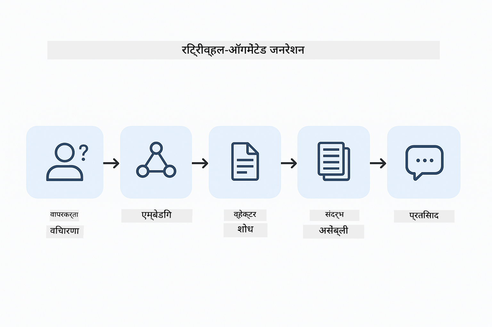
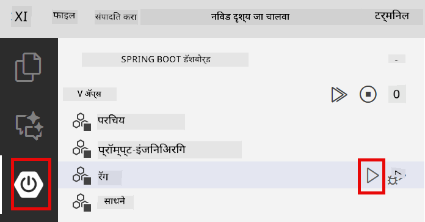

<!--
CO_OP_TRANSLATOR_METADATA:
{
  "original_hash": "81d087662fb3dd7b7124bce1a9c9ec86",
  "translation_date": "2026-01-05T22:39:47+00:00",
  "source_file": "03-rag/README.md",
  "language_code": "mr"
}
-->
# Module 03: RAG (Retrieval-Augmented Generation)

## अनुक्रमणिका

- [तुम्हाला काय शिकायला मिळेल](../../../03-rag)
- [पूर्वअट](../../../03-rag)
- [RAG चे समज](../../../03-rag)
- [ते कसे काम करते](../../../03-rag)
  - [दस्तऐवज प्रक्रिया](../../../03-rag)
  - [एंबेडिंग तयार करणे](../../../03-rag)
  - [सिमॅंटिक शोध](../../../03-rag)
  - [उत्तर निर्मिती](../../../03-rag)
- [अॅप्लिकेशन चालवा](../../../03-rag)
- [अॅप्लिकेशनचा वापर](../../../03-rag)
  - [दस्तऐवज अपलोड करा](../../../03-rag)
  - [प्रश्न विचारा](../../../03-rag)
  - [स्त्रोत संदर्भ तपासा](../../../03-rag)
  - [प्रश्नांशी प्रयोग करा](../../../03-rag)
- [महत्वाचे संकल्पना](../../../03-rag)
  - [चंकिंग धोरण](../../../03-rag)
  - [समानता गुणांकन](../../../03-rag)
  - [इन-मेमरी साठवणूक](../../../03-rag)
  - [संदर्भ विंडो व्यवस्थापन](../../../03-rag)
- [RAG कधी महत्त्वाचे](../../../03-rag)
- [पुढील पावले](../../../03-rag)

## तुम्हाला काय शिकायला मिळेल

मागील मॉड्यूलमध्ये, तुम्ही AI बरोबर संवाद साधण्याचे आणि आपल्या प्रॉम्प्ट्स प्रभावीपणे तयार करण्याचे कसे करायचे ते शिकलात. पण एक मूलभूत मर्यादा आहे: भाषा मॉडेल्सना फक्त तेच माहित असते जे त्यांनी प्रशिक्षणादरम्यान शिकले आहे. ते तुमच्या कंपनीच्या धोरणांबद्दल, तुमच्या प्रकल्प दस्तऐवजांबद्दल किंवा त्यांच्या प्रशिक्षणात नसलेल्या कोणत्याही माहितीसंबंधी प्रश्नांची उत्तरे देऊ शकत नाहीत.

RAG (Retrieval-Augmented Generation) हा प्रश्न सोडवतो. मॉडेलला तुमची माहिती शिकवण्याचा प्रयत्न करण्याऐवजी (जो महागडा आणि अव्यवहार्य असतो), तुम्ही त्याला तुमच्या दस्तऐवजांमधून शोध घेण्याची क्षमता देता. जेव्हा कोणी प्रश्न विचारतो, तेव्हा सिस्टम संबंधित माहिती शोधून ती प्रॉम्प्टमध्ये समाविष्ट करते. मॉडेल नंतर त्या प्राप्त संदर्भावर आधारित उत्तर देते.

RAG ला मॉडेलला संदर्भ ग्रंथालय देण्याचे समजून घ्या. जेव्हा तुम्ही प्रश्न विचारता, तेव्हा सिस्टम:

1. **वापरकर्ता क्वेरी** - तुम्ही प्रश्न विचारता
2. **एंबेडिंग** - तुमचा प्रश्न व्हेक्टरमध्ये रूपांतरित करते
3. **व्हेक्टर शोध** - समान दस्तऐवज चंक शोधते
4. **संदर्भ संकलन** - संबंधित चंक प्रॉम्प्टमध्ये जोडते
5. **उत्तर** - LLM त्या संदर्भावर आधारित उत्तर तयार करते

हे मॉडेलच्या उत्तरांना त्याच्या प्रशिक्षण ज्ञानावर अवलंबून न राहता, तुमच्या वास्तविक डेटावर आधारित ठरवते.



*RAG वर्कफ्लो - वापरकर्त्याच्या क्वेरीपासून सिमॅंटिक शोध आणि संदर्भात्मक उत्तर निर्मितीपर्यंत*

## पूर्वअट

- मॉड्यूल 01 पूर्ण केले आहे (Azure OpenAI संसाधने तैनात केली आहेत)
- मूळ निर्देशिकेत `.env` फाइल Azure प्रमाणपत्रांसह (मॉड्यूल 01 मध्ये `azd up` ने तयार केलेली)

> **टीप:** जर तुम्ही मॉड्यूल 01 पूर्ण केले नसेल, तर तिथल्या तैनात सूचनांचे पालन करा.

## ते कसे काम करते

### दस्तऐवज प्रक्रिया

[DocumentService.java](../../../03-rag/src/main/java/com/example/langchain4j/rag/service/DocumentService.java)

जेव्हा तुम्ही दस्तऐवज अपलोड करता, तेव्हा सिस्टम तो लहान भागांमध्ये (चंक) विभागते - जे मॉडेलच्या संदर्भ विंडोत सहज बसतील. हे चंक थोडेसे ओव्हरलॅप करतात जेणेकरून तुम्हाला सीमांवर संदर्भ हरवावा लागणार नाही.

```java
Document document = FileSystemDocumentLoader.loadDocument("sample-document.txt");

DocumentSplitter splitter = DocumentSplitters
    .recursive(300, 30, new OpenAiTokenizer());

List<TextSegment> segments = splitter.split(document);
```

> **🤖 [GitHub Copilot](https://github.com/features/copilot) चॅटसह प्रयत्न करा:** [`DocumentService.java`](../../../03-rag/src/main/java/com/example/langchain4j/rag/service/DocumentService.java) उघडा आणि विचारा:
> - "LangChain4j दस्तऐवज कसे चंकमध्ये विभागतो आणि ओव्हरलॅप का महत्त्वाचा आहे?"
> - "भिन्न दस्तऐवज प्रकारांसाठी आदर्श चंक आकार काय आहे आणि का?"
> - "कसे मल्टीलँग्वेज दस्तऐवज किंवा विशेष स्वरूपन असलेले दस्तऐवज हाताळायचे?"

### एंबेडिंग तयार करणे

[LangChainRagConfig.java](../../../03-rag/src/main/java/com/example/langchain4j/rag/config/LangChainRagConfig.java)

प्रत्येक चंकला एका संख्यात्मक प्रतिनिधित्वात रूपांतरित केले जाते ज्याला एंबेडिंग म्हणतात - मूलतः एक गणितीय ठसा जो मजकुराचा अर्थ पकडतो. समान मजकूर समान एंबेडिंग तयार करतो.

```java
@Bean
public EmbeddingModel embeddingModel() {
    return OpenAiOfficialEmbeddingModel.builder()
        .baseUrl(azureOpenAiEndpoint)
        .apiKey(azureOpenAiKey)
        .modelName(azureEmbeddingDeploymentName)
        .build();
}

EmbeddingStore<TextSegment> embeddingStore = 
    new InMemoryEmbeddingStore<>();
```


*वेक्टर एंबेडिंग स्पेसमध्ये दस्तऐवजांचे प्रतिनिधित्व - समान सामग्री क्लस्टर मध्ये एकत्र*

### सिमॅंटिक शोध

[RagService.java](../../../03-rag/src/main/java/com/example/langchain4j/rag/service/RagService.java)

जेव्हा तुम्ही प्रश्न विचारता, तेव्हा तुमचा प्रश्न देखील एंबेडिंगमध्ये रूपांतरित होतो. सिस्टम तुमच्या प्रश्नाच्या एंबेडिंगची तुलना सर्व दस्तऐवज चंकच्या एंबेडिंगशी करते. ते समान अर्थाच्या चंक शोधतो - फक्त कीवर्डशी जुळणारे नाही, तर खरे सिमॅंटिक साम्य.

```java
Embedding queryEmbedding = embeddingModel.embed(question).content();

List<EmbeddingMatch<TextSegment>> matches = 
    embeddingStore.findRelevant(queryEmbedding, 5, 0.7);

for (EmbeddingMatch<TextSegment> match : matches) {
    String relevantText = match.embedded().text();
    double score = match.score();
}
```

> **🤖 [GitHub Copilot](https://github.com/features/copilot) चॅटसह प्रयत्न करा:** [`RagService.java`](../../../03-rag/src/main/java/com/example/langchain4j/rag/service/RagService.java) उघडा आणि विचारा:
> - "एंबेडिंगसह समान शोध कसा कार्य करतो आणि गुणांकन काय ठरवते?"
> - "साम्याची थ्रेशोल्ड काय वापरावी आणि त्याचा निकालांवर काय परिणाम होतो?"
> - "प्रासंगिक दस्तऐवज सापडले नाही तर कसे हाताळावे?"

### उत्तर निर्मिती

[RagService.java](../../../03-rag/src/main/java/com/example/langchain4j/rag/service/RagService.java)

सर्वात प्रासंगिक चंक मॉडेलच्या प्रॉम्प्टमध्ये समाविष्ट केले जातात. मॉडेल ते विशिष्ट चंक वाचते आणि त्या माहितीवर आधारित तुमच्या प्रश्नाचे उत्तर देते. हे मतभ्रम टाळते - मॉडेल फक्त समोरच्या माहितीवरून निश्चित उत्तर देऊ शकते.

## अॅप्लिकेशन चालवा

**तैनाती तपासा:**

मूळ निर्देशिकेत `.env` फाइल Azure प्रमाणपत्रांसह आहे का याची खात्री करा (मॉड्यूल 01 दरम्यान तयार केले गेलेली):
```bash
cat ../.env  # AZURE_OPENAI_ENDPOINT, API_KEY, DEPLOYMENT दाखवायला हवे
```

**अॅप्लिकेशन सुरू करा:**

> **टीप:** जर तुम्ही आधीपासूनच मॉड्यूल 01 मधील `./start-all.sh` वापरून सर्व अॅप्लिकेशन्स सुरू केली असतील, तर हा मॉड्यूल 8081 पोर्टवर चालू आहे. तुम्ही खालील सुरू करण्याच्या कमांड्स वगळू शकता आणि थेट http://localhost:8081 वर जाऊ शकता.

**पर्याय 1: स्प्रिंग बूट डॅशबोर्ड वापरून (VS कोड वापरकर्त्यांसाठी शिफारसीय)**

डेव्ह कंटेनरमध्ये स्प्रिंग बूट डॅशबोर्ड विस्तार समाविष्ट आहे, जे सर्व स्प्रिंग बूट अॅप्लिकेशन्सचे व्यवस्थापन करण्यासाठी दृश्य इंटरफेस देते. तुम्ही ते VS कोडच्या डाव्या बाजूच्या ऍक्टिव्हिटी बारमध्ये (स्प्रिंग बूट चिन्हाला शोधा) पाहू शकता.

स्प्रिंग बूट डॅशबोर्डमधून तुम्ही:
- वर्कस्पेसमधील सर्व उपलब्ध स्प्रिंग बूट अॅप्लिकेशन्स पाहू शकता
- एका क्लिकने अॅप्लिकेशन्स सुरू/थांबवू शकता
- अॅप्लिकेशन लॉग्स रिअल-टाइममध्ये पाहू शकता
- अॅप्लिकेशन स्थिती निरीक्षण करू शकता

"rag" च्या बाजूला प्ले बटणावर क्लिक करा किंवा सर्व मॉड्यूल्स एकत्र सुरू करा.



**पर्याय 2: शेल स्क्रिप्ट्स वापरून**

सर्व वेब अॅप्लिकेशन (मॉड्यूल 01-04) सुरू करा:

**Bash:**
```bash
cd ..  # मूळ निर्देशिका पासून
./start-all.sh
```

**PowerShell:**
```powershell
cd ..  # मूळ निर्देशिकेपासून
.\start-all.ps1
```

किंवा फक्त हा मॉड्यूल सुरू करा:

**Bash:**
```bash
cd 03-rag
./start.sh
```

**PowerShell:**
```powershell
cd 03-rag
.\start.ps1
```

दोन्ही स्क्रिप्ट्स स्वयंचलितपणे मूळ `.env` फाइलमधील पर्यावरण बदल आपोआप लोड करतात आणि जर JAR अस्तित्वात नसेल तर तयार करतील.

> **टीप:** जर तुम्हाला सर्व मॉड्यूल्स मॅन्युअली तयार करायचे असतील सुरुवातीला:
>
> **Bash:**
> ```bash
> cd ..  # Go to root directory
> mvn clean package -DskipTests
> ```
>
> **PowerShell:**
> ```powershell
> cd ..  # Go to root directory
> mvn clean package -DskipTests
> ```

तुमच्या ब्राउझरमध्ये http://localhost:8081 उघडा.

**थांबवण्यासाठी:**

**Bash:**
```bash
./stop.sh  # हे मॉड्यूल फक्त
# किंवा
cd .. && ./stop-all.sh  # सर्व मॉड्युळ्स
```

**PowerShell:**
```powershell
.\stop.ps1  # हे फक्त मॉड्युल
# किंवा
cd ..; .\stop-all.ps1  # सर्व मॉड्युल्स
```

## अॅप्लिकेशनचा वापर

हा अॅप्लिकेशन दस्तऐवज अपलोड आणि प्रश्न विचारण्यासाठी वेब इंटरफेस प्रदान करतो.

<a href="images/rag-homepage.png"></a>

*RAG अॅप्लिकेशन इंटरफेस - दस्तऐवज अपलोड करा आणि प्रश्न विचारा*

### दस्तऐवज अपलोड करा

दस्तऐवज अपलोड करून प्रारंभ करा - चाचणीसाठी TXT फाइल्स फायदेशीर आहेत. या निर्देशिकेत `sample-document.txt` दिलेला आहे ज्यात LangChain4j वैशिष्ट्ये, RAG अंमलबजावणी आणि सर्वोत्तम प्रॅक्टिस याबद्दल माहिती आहे - जो सिस्टम चाचणीसाठी उत्तम आहे.

सिस्टम तुमचा दस्तऐवज प्रक्रिया करते, ते चंक मध्ये विभागते, आणि प्रत्येक चंकसाठी एंबेडिंग तयार करते. हे स्वयंचलितपणे अपलोड करताच होते.

### प्रश्न विचारा

आता दस्तऐवज सामग्रीबद्दल विशिष्ट प्रश्न विचारा. काही तथ्यात्मक गोष्ट विचारण्याचा प्रयत्न करा जी दस्तऐवजात स्पष्टपणे नमूद केलेली आहे. सिस्टम संबंधित चंक शोधते, त्यांना प्रॉम्प्टमध्ये समाविष्ट करते, आणि उत्तर तयार करते.

### स्रोत संदर्भ तपासा

प्रत्येक उत्तरात स्रोत संदर्भ आणि समानता गुणांकन दिसतात. हे गुणांकन (0 ते 1) दाखवतात की प्रत्येक चंक तुमच्या प्रश्नाशी किती संबंधित होता. जास्त गुण उच्च सुसंगतता दर्शवतात. यामुळे तुम्हाला उत्तर स्रोत सामग्रीशी तपासता येते.

<a href="images/rag-query-results.png"></a>

*प्रश्नांचे निकाल दर्शवत आहेत उत्तर सोबत स्रोत संदर्भ आणि सुसंगतता गुणांकन*

### प्रश्नांशी प्रयोग करा

भिन्न प्रकारचे प्रश्न विचारून पहा:
- विशिष्ट तथ्य: "मुख्य विषय काय आहे?"
- तुलना: "X आणि Y मध्ये काय फरक आहे?"
- सारांश: "Z बाबत मुख्य मुद्दे संक्षेप करा"

प्रश्नाचे दस्तऐवज सामग्रीशी जसे जुळते तसा समानता गुणांकन कसे बदलते ते पहा.

## महत्वाचे संकल्पना

### चंकिंग धोरण

दस्तऐवज 300-टोकन चंकमध्ये विभागले जातात, ज्यात 30 टोकनचे ओव्हरलॅप असते. हे संतुलन प्रत्येक चंकला पुरेसा संदर्भ देण्यास मदत करते आणि प्रॉम्प्टमध्ये अनेक चंक ठेवण्यास परवानगी देते.

### समानता गुणांकन

गुणांकन 0 ते 1 दरम्यान असतात:
- 0.7-1.0: अत्यंत संबंधित, अचूक जुळणारे
- 0.5-0.7: संबंधित, चांगला संदर्भ
- 0.5 खाली: वगळले, खूप विसंगत

सिस्टम केवळ किमान थ्रेशोल्ड पेक्षा जास्त गुण असलेल्या चंकच घेतो जेणेकरून गुणवत्ता नक्की राहील.

### इन-मेमरी साठवणूक

हा मॉड्यूल सुलभतेसाठी इन-मेमरी साठवणूक वापरतो. अॅप्लिकेशन पुन्हा सुरू केल्यावर अपलोड केलेले दस्तऐवज नष्ट होतात. उत्पादन प्रणालीसाठी Qdrant किंवा Azure AI Search सारख्या कायमस्वरूपी व्हेक्टर डेटाबेसचा वापर होतो.

### संदर्भ विंडो व्यवस्थापन

प्रत्येक मॉडेलची अधिकतम संदर्भ विंडो असते. मोठ्या दस्तऐवजाचे सर्व चंक समाविष्ट करणे शक्य नाही. सिस्टम मर्यादांच्या आत राहून, सर्वात संबंधित टॉप N चंक (डिफॉल्ट 5) आणते जेणेकरून पुरेसा संदर्भ मिळू शकेल आणि अचूक उत्तर द्यायला मदत होईल.

## RAG कधी महत्त्वाचे

**RAG वापरा जेव्हा:**
- मालकीच्या दस्तऐवजांबद्दल प्रश्नांची उत्तरे द्यायची असतात
- माहिती वेगवेगळ्या वेळेस बदलते (धोरणे, किंमती, तपशील)
- अचूकतेसाठी स्रोत दिला पाहिजे
- सामग्री एका प्रॉम्प्टमध्ये फिट होण्यासाठी खूप मोठी आहे
- तुम्हाला पुष्टीकरणीय, आधारभूत उत्तरे हवी आहेत

**RAG वापरू नका जेव्हा:**
- प्रश्न सामान्य ज्ञानाशी संबंधित असतात जे मॉडेलला आधीपासून माहित आहे
- रिअल-टाइम डेटाची गरज आहे (RAG अपलोड केलेल्या दस्तऐवजांवर आधारित असतो)
- सामग्री थोडी आहे जी थेट प्रॉम्प्टमध्ये समाविष्ट करता येईल

## पुढील पावले

**पुढील मॉड्यूल:** [04-tools - AI Agents with Tools](../04-tools/README.md)

---

**नेव्हिगेशन:** [← मागील: Module 02 - Prompt Engineering](../02-prompt-engineering/README.md) | [मुख्य पानावर परत जा](../README.md) | [पुढील: Module 04 - Tools →](../04-tools/README.md)

---

<!-- CO-OP TRANSLATOR DISCLAIMER START -->
**अस्वीकरण**:  
हा दस्तऐवज AI अनुवाद सेवा [Co-op Translator](https://github.com/Azure/co-op-translator) चा वापर करून अनुवादित केला आहे. आम्ही अचूकतेसाठी प्रयत्न करतो, तरी कृपया लक्षात ठेवा की स्वयंचलित अनुवादांमध्ये चुका किंवा अचूकतेचा अभाव असू शकतो. मूळ दस्तऐवज त्याच्या स्थानिक भाषेत अधिकृत स्रोत मानला जावा. महत्त्वाची माहिती साठी व्यावसायिक मानवी अनुवाद शिफारस केला जातो. या अनुवादाच्या वापरामुळे उद्भवू शकणाऱ्या कोणत्याही गैरसमजुतींसाठी किंवा चुकीच्या अर्थ लावण्या बद्दल आम्ही जबाबदार नाही.
<!-- CO-OP TRANSLATOR DISCLAIMER END -->