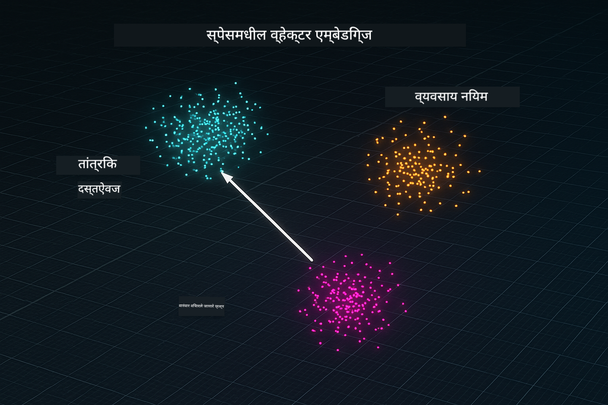
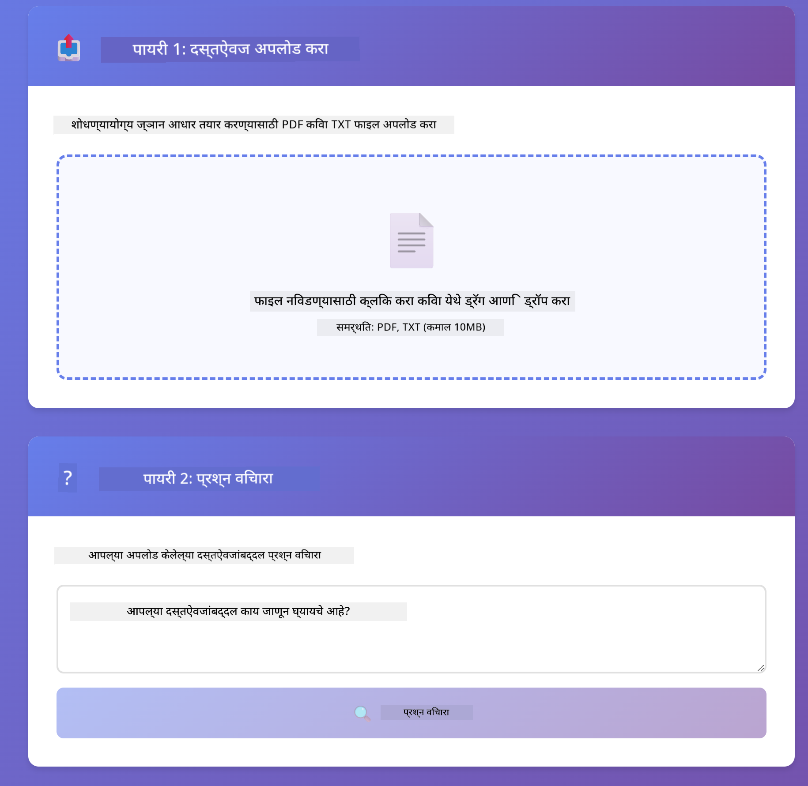
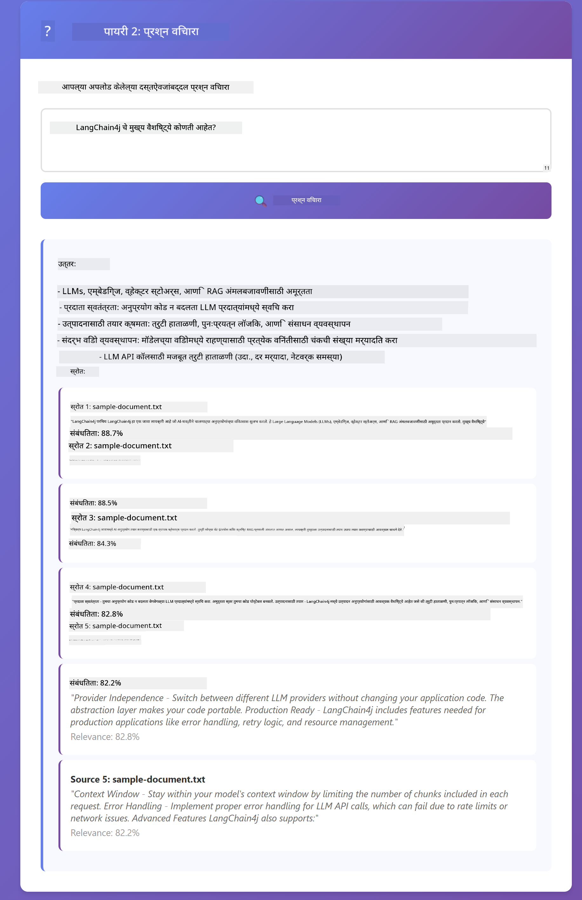

<!--
CO_OP_TRANSLATOR_METADATA:
{
  "original_hash": "f538a51cfd13147d40d84e936a0f485c",
  "translation_date": "2025-12-13T16:55:13+00:00",
  "source_file": "03-rag/README.md",
  "language_code": "mr"
}
-->
# Module 03: RAG (Retrieval-Augmented Generation)

## Table of Contents

- [What You'll Learn](../../../03-rag)
- [Prerequisites](../../../03-rag)
- [Understanding RAG](../../../03-rag)
- [How It Works](../../../03-rag)
  - [Document Processing](../../../03-rag)
  - [Creating Embeddings](../../../03-rag)
  - [Semantic Search](../../../03-rag)
  - [Answer Generation](../../../03-rag)
- [Run the Application](../../../03-rag)
- [Using the Application](../../../03-rag)
  - [Upload a Document](../../../03-rag)
  - [Ask Questions](../../../03-rag)
  - [Check Source References](../../../03-rag)
  - [Experiment with Questions](../../../03-rag)
- [Key Concepts](../../../03-rag)
  - [Chunking Strategy](../../../03-rag)
  - [Similarity Scores](../../../03-rag)
  - [In-Memory Storage](../../../03-rag)
  - [Context Window Management](../../../03-rag)
- [When RAG Matters](../../../03-rag)
- [Next Steps](../../../03-rag)

## What You'll Learn

मागील मॉड्यूलमध्ये, तुम्ही AI सोबत संवाद कसा करायचा आणि तुमचे प्रॉम्प्ट प्रभावीपणे कसे रचायचे हे शिकलात. पण एक मूलभूत मर्यादा आहे: भाषा मॉडेल्सना फक्त तेच माहिती असते जी त्यांनी प्रशिक्षणादरम्यान शिकली आहे. ते तुमच्या कंपनीच्या धोरणांबद्दल, तुमच्या प्रोजेक्ट दस्तऐवजांबद्दल किंवा ज्यावर त्यांना प्रशिक्षण दिले गेले नाही अशा कोणत्याही माहितीबद्दल प्रश्नांची उत्तरे देऊ शकत नाहीत.

RAG (Retrieval-Augmented Generation) हा हा प्रश्न सोडवतो. मॉडेलला तुमची माहिती शिकवण्याचा प्रयत्न करण्याऐवजी (जो महाग आणि अव्यवहार्य आहे), तुम्ही त्याला तुमच्या दस्तऐवजांमधून शोध घेण्याची क्षमता देता. जेव्हा कोणी प्रश्न विचारतो, तेव्हा सिस्टम संबंधित माहिती शोधते आणि ती प्रॉम्प्टमध्ये समाविष्ट करते. मॉडेल नंतर त्या प्राप्त संदर्भावर आधारित उत्तर देते.

RAG ला मॉडेलला संदर्भ ग्रंथालय देण्यासारखे समजा. जेव्हा तुम्ही प्रश्न विचारता, तेव्हा सिस्टम:

1. **User Query** - तुम्ही प्रश्न विचारता
2. **Embedding** - तुमचा प्रश्न व्हेक्टरमध्ये रूपांतरित करतो
3. **Vector Search** - समान दस्तऐवज चंक शोधतो
4. **Context Assembly** - संबंधित चंक प्रॉम्प्टमध्ये जोडतो
5. **Response** - LLM संदर्भावर आधारित उत्तर तयार करतो

हे मॉडेलच्या प्रतिसादांना त्याच्या प्रशिक्षण ज्ञानावर अवलंबून न राहता तुमच्या वास्तविक डेटावर आधारित करते.


*RAG कार्यप्रवाह - वापरकर्त्याच्या प्रश्नापासून सेमॅंटिक शोध आणि संदर्भात्मक उत्तर निर्मितीपर्यंत*

## Prerequisites

- पूर्ण केलेले Module 01 (Azure OpenAI संसाधने तैनात केली आहेत)
- रूट डिरेक्टरीमध्ये `.env` फाइल Azure क्रेडेन्शियल्ससह (Module 01 मध्ये `azd up` ने तयार केलेली)

> **Note:** जर तुम्ही Module 01 पूर्ण केले नसेल, तर प्रथम तिथल्या तैनातीच्या सूचना पाळा.

## How It Works

**Document Processing** - [DocumentService.java](../../../03-rag/src/main/java/com/example/langchain4j/rag/service/DocumentService.java)

जेव्हा तुम्ही दस्तऐवज अपलोड करता, तेव्हा सिस्टम त्याला चंकमध्ये विभागते - छोटे तुकडे जे मॉडेलच्या संदर्भ विंडोमध्ये आरामात बसतात. हे चंक थोडेसे ओव्हरलॅप करतात जेणेकरून सीमांवर संदर्भ गमावला जात नाही.

```java
Document document = FileSystemDocumentLoader.loadDocument("sample-document.txt");

DocumentSplitter splitter = DocumentSplitters
    .recursive(300, 30, new OpenAiTokenizer());

List<TextSegment> segments = splitter.split(document);
```

> **🤖 Try with [GitHub Copilot](https://github.com/features/copilot) Chat:** Open [`DocumentService.java`](../../../03-rag/src/main/java/com/example/langchain4j/rag/service/DocumentService.java) and ask:
> - "How does LangChain4j split documents into chunks and why is overlap important?"
> - "What's the optimal chunk size for different document types and why?"
> - "How do I handle documents in multiple languages or with special formatting?"

**Creating Embeddings** - [LangChainRagConfig.java](../../../03-rag/src/main/java/com/example/langchain4j/rag/config/LangChainRagConfig.java)

प्रत्येक चंकला संख्यात्मक प्रतिनिधित्वात रूपांतरित केले जाते ज्याला एम्बेडिंग म्हणतात - मूलतः एक गणितीय फिंगरप्रिंट जो मजकुराचा अर्थ पकडतो. समान मजकूर समान एम्बेडिंग तयार करतो.

```java
@Bean
public EmbeddingModel embeddingModel() {
    return OpenAiOfficialEmbeddingModel.builder()
        .baseUrl(azureOpenAiEndpoint)
        .apiKey(azureOpenAiKey)
        .modelName(azureEmbeddingDeploymentName)
        .build();
}

EmbeddingStore<TextSegment> embeddingStore = 
    new InMemoryEmbeddingStore<>();
```



*दस्तऐवज एम्बेडिंग स्पेसमधील व्हेक्टर म्हणून सादर - समान सामग्री एकत्र क्लस्टर होते*

**Semantic Search** - [RagService.java](../../../03-rag/src/main/java/com/example/langchain4j/rag/service/RagService.java)

जेव्हा तुम्ही प्रश्न विचारता, तुमचा प्रश्न देखील एम्बेडिंगमध्ये रूपांतरित होतो. सिस्टम तुमच्या प्रश्नाच्या एम्बेडिंगची तुलना सर्व दस्तऐवज चंकच्या एम्बेडिंगशी करते. ते सर्वात समान अर्थ असलेले चंक शोधतात - फक्त कीवर्ड जुळण्यापेक्षा, वास्तविक सेमॅंटिक समानता.

```java
Embedding queryEmbedding = embeddingModel.embed(question).content();

List<EmbeddingMatch<TextSegment>> matches = 
    embeddingStore.findRelevant(queryEmbedding, 5, 0.7);

for (EmbeddingMatch<TextSegment> match : matches) {
    String relevantText = match.embedded().text();
    double score = match.score();
}
```

> **🤖 Try with [GitHub Copilot](https://github.com/features/copilot) Chat:** Open [`RagService.java`](../../../03-rag/src/main/java/com/example/langchain4j/rag/service/RagService.java) and ask:
> - "How does similarity search work with embeddings and what determines the score?"
> - "What similarity threshold should I use and how does it affect results?"
> - "How do I handle cases where no relevant documents are found?"

**Answer Generation** - [RagService.java](../../../03-rag/src/main/java/com/example/langchain4j/rag/service/RagService.java)

सर्वात संबंधित चंक प्रॉम्प्टमध्ये समाविष्ट केले जातात. मॉडेल त्या विशिष्ट चंक वाचते आणि त्या माहितीवर आधारित तुमच्या प्रश्नाचे उत्तर देते. यामुळे भ्रम निर्माण होण्यापासून प्रतिबंध होतो - मॉडेल फक्त समोर असलेल्या माहितीवरूनच उत्तर देऊ शकते.

## Run the Application

**Verify deployment:**

रूट डिरेक्टरीमध्ये `.env` फाइल Azure क्रेडेन्शियल्ससह अस्तित्वात आहे याची खात्री करा (Module 01 दरम्यान तयार केलेली):
```bash
cat ../.env  # AZURE_OPENAI_ENDPOINT, API_KEY, DEPLOYMENT दाखवले पाहिजे
```

**Start the application:**

> **Note:** जर तुम्ही आधीच Module 01 मधील `./start-all.sh` वापरून सर्व अ‍ॅप्लिकेशन्स सुरू केले असतील, तर हा मॉड्यूल पोर्ट 8081 वर आधीच चालू आहे. तुम्ही खालील सुरू करण्याच्या आदेशांना वगळू शकता आणि थेट http://localhost:8081 वर जाऊ शकता.

**Option 1: Using Spring Boot Dashboard (Recommended for VS Code users)**

डेव्ह कंटेनरमध्ये Spring Boot Dashboard विस्तार समाविष्ट आहे, जो सर्व Spring Boot अ‍ॅप्लिकेशन्स व्यवस्थापित करण्यासाठी दृश्यात्मक इंटरफेस प्रदान करतो. तुम्हाला VS Code च्या डाव्या बाजूला Activity Bar मध्ये (Spring Boot आयकॉन शोधा) ते सापडेल.

Spring Boot Dashboard मधून, तुम्ही:
- वर्कस्पेसमधील सर्व उपलब्ध Spring Boot अ‍ॅप्लिकेशन्स पाहू शकता
- एक क्लिकने अ‍ॅप्लिकेशन्स सुरू/थांबवू शकता
- अ‍ॅप्लिकेशन लॉग्स रिअल-टाइममध्ये पाहू शकता
- अ‍ॅप्लिकेशन स्थिती निरीक्षण करू शकता

"rag" च्या बाजूला प्ले बटणावर क्लिक करा हा मॉड्यूल सुरू करण्यासाठी, किंवा सर्व मॉड्यूल एकत्र सुरू करा.


**Option 2: Using shell scripts**

सर्व वेब अ‍ॅप्लिकेशन्स (मॉड्यूल 01-04) सुरू करा:

**Bash:**
```bash
cd ..  # मूळ निर्देशिकेतून
./start-all.sh
```

**PowerShell:**
```powershell
cd ..  # मूळ निर्देशिकेतून
.\start-all.ps1
```

किंवा फक्त हा मॉड्यूल सुरू करा:

**Bash:**
```bash
cd 03-rag
./start.sh
```

**PowerShell:**
```powershell
cd 03-rag
.\start.ps1
```

दोन्ही स्क्रिप्ट्स रूट `.env` फाइलमधून पर्यावरणीय चल स्वयंचलितपणे लोड करतात आणि जर JAR अस्तित्वात नसतील तर तयार करतील.

> **Note:** जर तुम्हाला सर्व मॉड्यूल्स मॅन्युअली तयार करायचे असतील सुरू करण्यापूर्वी:
>
> **Bash:**
> ```bash
> cd ..  # Go to root directory
> mvn clean package -DskipTests
> ```
>
> **PowerShell:**
> ```powershell
> cd ..  # Go to root directory
> mvn clean package -DskipTests
> ```

तुमच्या ब्राउझरमध्ये http://localhost:8081 उघडा.

**To stop:**

**Bash:**
```bash
./stop.sh  # हा फक्त मॉड्यूल आहे
# किंवा
cd .. && ./stop-all.sh  # सर्व मॉड्यूल्स
```

**PowerShell:**
```powershell
.\stop.ps1  # हा फक्त मॉड्यूल
# किंवा
cd ..; .\stop-all.ps1  # सर्व मॉड्यूल्स
```

## Using the Application

अ‍ॅप्लिकेशन दस्तऐवज अपलोड आणि प्रश्न विचारण्यासाठी वेब इंटरफेस प्रदान करते.

<a href="images/rag-homepage.png"></a>

*RAG अ‍ॅप्लिकेशन इंटरफेस - दस्तऐवज अपलोड करा आणि प्रश्न विचारा*

**Upload a Document**

दस्तऐवज अपलोड करून सुरुवात करा - TXT फाइल्स चाचणीसाठी सर्वोत्तम काम करतात. या डिरेक्टरीमध्ये `sample-document.txt` उपलब्ध आहे ज्यात LangChain4j वैशिष्ट्ये, RAG अंमलबजावणी, आणि सर्वोत्तम पद्धतींबद्दल माहिती आहे - प्रणालीची चाचणी करण्यासाठी परिपूर्ण.

सिस्टम तुमचा दस्तऐवज प्रक्रिया करते, त्याला चंकमध्ये विभागते, आणि प्रत्येक चंकसाठी एम्बेडिंग तयार करते. हे स्वयंचलितपणे अपलोड करताना होते.

**Ask Questions**

आता दस्तऐवजाच्या सामग्रीबद्दल विशिष्ट प्रश्न विचारा. काही तथ्यात्मक प्रश्न विचारा जे दस्तऐवजात स्पष्टपणे नमूद आहेत. सिस्टम संबंधित चंक शोधते, त्यांना प्रॉम्प्टमध्ये समाविष्ट करते, आणि उत्तर तयार करते.

**Check Source References**

प्रत्येक उत्तरात स्रोत संदर्भ आणि समानता गुणधर्म असतात. हे गुणधर्म (0 ते 1 पर्यंत) दर्शवतात की प्रत्येक चंक तुमच्या प्रश्नाशी कितपत संबंधित होता. जास्त गुणधर्म म्हणजे चांगले जुळणारे. यामुळे तुम्ही उत्तर स्रोत सामग्रीशी तपासू शकता.

<a href="images/rag-query-results.png"></a>

*प्रश्नांचे निकाल जे उत्तर स्रोत संदर्भ आणि संबंधित गुणांसह दाखवतात*

**Experiment with Questions**

वेगवेगळ्या प्रकारचे प्रश्न विचारून पहा:
- विशिष्ट तथ्ये: "मुख्य विषय काय आहे?"
- तुलना: "X आणि Y मध्ये काय फरक आहे?"
- सारांश: "Z बद्दल मुख्य मुद्दे सारांशित करा"

तुमच्या प्रश्नाच्या दस्तऐवज सामग्रीशी जुळणीवर आधारित संबंधित गुणधर्म कसे बदलतात ते पाहा.

## Key Concepts

**Chunking Strategy**

दस्तऐवज 300-टोकन चंकमध्ये विभागले जातात ज्यात 30 टोकन ओव्हरलॅप असतो. हा समतोल प्रत्येक चंकला अर्थपूर्ण संदर्भ देतो आणि एकाच वेळी अनेक चंक प्रॉम्प्टमध्ये समाविष्ट करण्यास लहान ठेवतो.

**Similarity Scores**

गुणधर्म 0 ते 1 पर्यंत असतात:
- 0.7-1.0: अत्यंत संबंधित, अचूक जुळणी
- 0.5-0.7: संबंधित, चांगला संदर्भ
- 0.5 खाली: फिल्टर केलेले, खूप वेगळे

सिस्टम केवळ किमान थ्रेशोल्ड पेक्षा वरचे चंक पुनर्प्राप्त करते जेणेकरून गुणवत्ता सुनिश्चित होईल.

**In-Memory Storage**

हा मॉड्यूल सोप्या साठी इन-मेमरी स्टोरेज वापरतो. जेव्हा तुम्ही अ‍ॅप्लिकेशन पुन्हा सुरू करता, तेव्हा अपलोड केलेले दस्तऐवज गहाळ होतात. उत्पादन प्रणाली Qdrant किंवा Azure AI Search सारख्या कायमस्वरूपी व्हेक्टर डेटाबेस वापरतात.

**Context Window Management**

प्रत्येक मॉडेलची कमाल संदर्भ विंडो असते. तुम्ही मोठ्या दस्तऐवजातील प्रत्येक चंक समाविष्ट करू शकत नाही. सिस्टम टॉप N सर्वात संबंधित चंक (डिफॉल्ट 5) पुनर्प्राप्त करते जेणेकरून मर्यादांमध्ये राहून अचूक उत्तरांसाठी पुरेसा संदर्भ मिळेल.

## When RAG Matters

**RAG वापरा जेव्हा:**
- मालकीच्या दस्तऐवजांबद्दल प्रश्नांची उत्तरे द्यायची असतील
- माहिती वारंवार बदलते (धोरणे, किंमती, तपशील)
- अचूकतेसाठी स्रोत संदर्भ आवश्यक असतो
- सामग्री एकाच प्रॉम्प्टमध्ये बसण्याइतकी लहान नाही
- तुम्हाला पडताळणी करता येणारी, आधारभूत उत्तरे हवी असतील

**RAG वापरू नका जेव्हा:**
- प्रश्न सामान्य ज्ञानावर आधारित असतील जे मॉडेलला आधीच माहित आहे
- रिअल-टाइम डेटा आवश्यक असेल (RAG अपलोड केलेल्या दस्तऐवजांवर काम करते)
- सामग्री इतकी लहान असेल की थेट प्रॉम्प्टमध्ये समाविष्ट करता येईल

## Next Steps

**Next Module:** [04-tools - AI Agents with Tools](../04-tools/README.md)

---

**Navigation:** [← Previous: Module 02 - Prompt Engineering](../02-prompt-engineering/README.md) | [Back to Main](../README.md) | [Next: Module 04 - Tools →](../04-tools/README.md)

---

<!-- CO-OP TRANSLATOR DISCLAIMER START -->
**अस्वीकरण**:
हा दस्तऐवज AI अनुवाद सेवा [Co-op Translator](https://github.com/Azure/co-op-translator) वापरून अनुवादित केला आहे. आम्ही अचूकतेसाठी प्रयत्नशील असलो तरी, कृपया लक्षात घ्या की स्वयंचलित अनुवादांमध्ये चुका किंवा अचूकतेची कमतरता असू शकते. मूळ दस्तऐवज त्याच्या स्थानिक भाषेत अधिकृत स्रोत मानला जावा. महत्त्वाच्या माहितीसाठी व्यावसायिक मानवी अनुवाद शिफारसीय आहे. या अनुवादाच्या वापरामुळे उद्भवलेल्या कोणत्याही गैरसमजुती किंवा चुकीच्या अर्थलागी आम्ही जबाबदार नाही.
<!-- CO-OP TRANSLATOR DISCLAIMER END -->