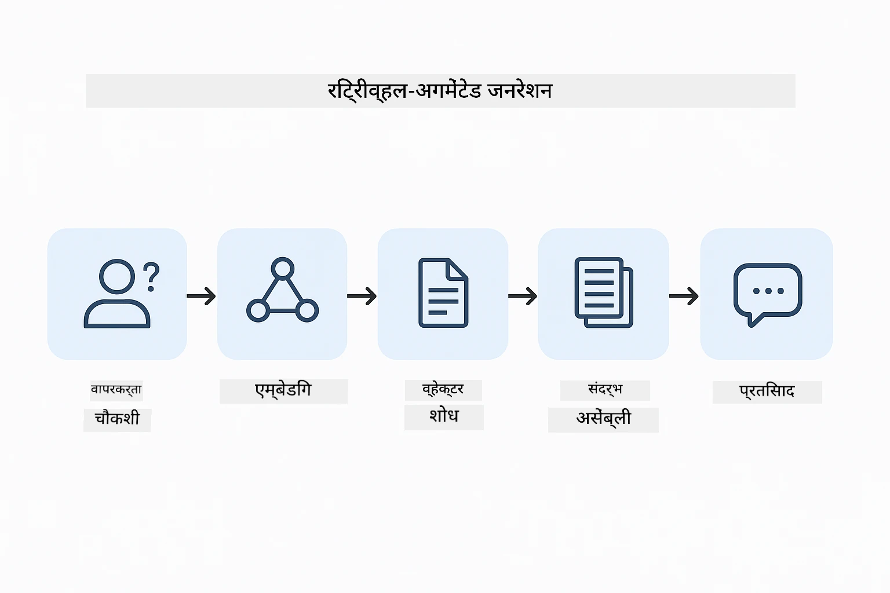
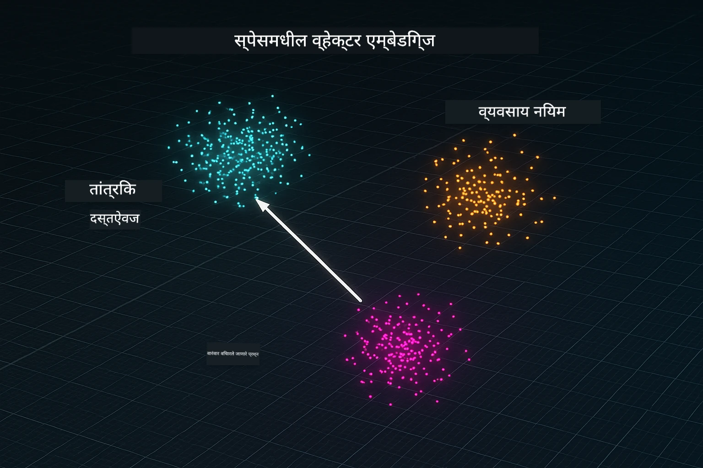
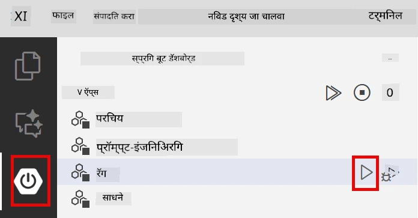
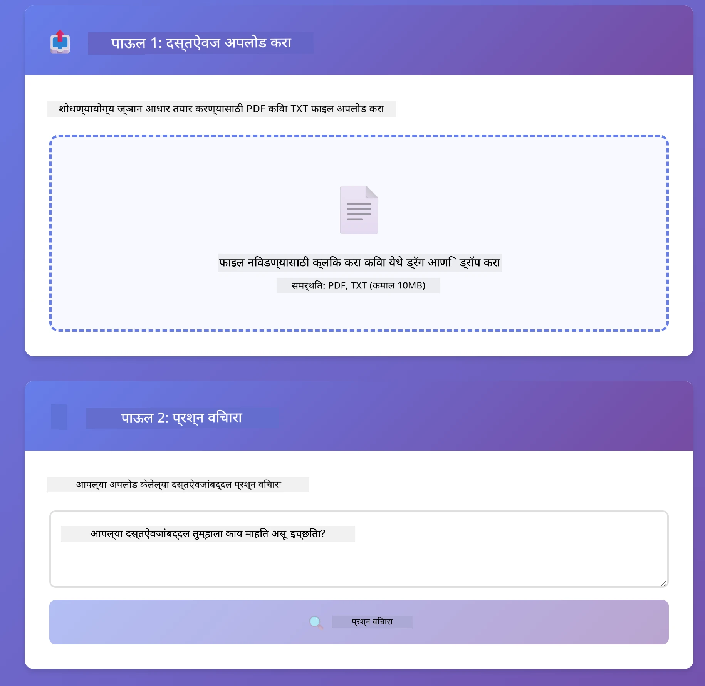
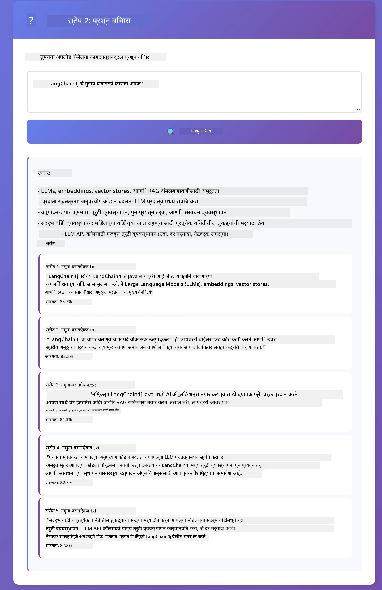

# Module 03: RAG (रिट्रीवल-अगमेंटेड जनरेशन)

## Table of Contents

- [व्हिडिओ वॉकथ्रू](#व्हिडिओ-वॉकथ्रू)
- [तुम्ही काय शिकाल](#तुम्ही-काय-शिकाल)
- [पूर्वअट](#पूर्वअट)
- [RAG समजून घेणे](#rag-समजून-घेणे)
  - [या ट्युटोरियलमध्ये कोणता RAG दृष्टिकोन वापरला जातो?](#या-ट्युटोरियलमध्ये-कोणता-rag-दृष्टिकोन-वापरला-जातो)
- [हे कसे कार्य करते](#हे-कसे-कार्य-करते)
  - [डॉक्युमेंट प्रक्रिया](#डॉक्युमेंट-प्रक्रिया)
  - [एंबेडिंग्ज तयार करणे](#एंबेडिंग्ज-तयार-करणे)
  - [सामांाजीक शोध](#सामांजिक-शोध)
  - [उत्तर निर्मिती](#उत्तर-निर्मिती)
- [अॅप्लिकेशन चालवा](#अनुप्रयोग-चालवा)
- [अॅप्लिकेशन वापरणे](#अनुप्रयोग-वापरणे)
  - [डॉक्युमेंट अपलोड करा](#दस्तऐवज-अपलोड-करा)
  - [प्रश्न विचारा](#प्रश्न-विचारा)
  - [स्त्रोत संदर्भ तपासा](#स्रोत-संदर्भ-तपासा)
  - [प्रश्नांसह प्रयोग करा](#प्रश्नांबरोबर-प्रयोग-करा)
- [मुख्य संकल्पना](#मुख्य-संकल्पना)
  - [चंकिंग धोरण](#तुकड्यांसाठी-धोरण)
  - [सादृश्य गुणांकन](#सादृश्यता-स्कोअर्स)
  - [मेमरीत संग्रहण](#इन-मेमरी-स्टोरेज)
  - [संदर्भ विंडो व्यवस्थापन](#संदर्भ-विंडो-व्यवस्थापन)
- [RAG कुठे महत्वाचा असतो](#rag-कधी-महत्त्वाचा-आहे)
- [पुढील टप्पे](#पुढील-टप्पे)

## व्हिडिओ वॉकथ्रू

हा थेट सत्र पहा ज्यात या मॉड्यूलसह सुरुवात कशी करावी हे स्पष्ट केले आहे:

<a href="https://www.youtube.com/watch?v=_olq75ZH_eY"></a>

## तुम्ही काय शिकाल

मागील मॉड्यूलमध्ये, तुम्ही AI सोबत संवाद कसा साधायचा आणि तुम्ही तुमचे प्रॉम्प्ट कसे प्रभावीपणे रचाल हे शिकले आहे. पण एक मूलभूत मर्यादा आहे: भाषा मॉडेल्सना केवळ प्रशिक्षणादरम्यान जे शिकवले गेले तेच माहीत असते. ते तुमच्या कंपनीच्या धोरणांबद्दल, प्रकल्प दस्तऐवजाबद्दल किंवा जे माहिती त्यांनी शिकले नाही त्याबद्दल प्रश्नांची उत्तरे देऊ शकत नाहीत.

RAG (रिट्रीवल-अगमेंटेड जनरेशन) हा समस्या सोडवतो. मॉडेलला तुमची माहिती शिकवण्याऐवजी (जो महागडा आणि प्रत्यक्षात तोडगा नाही), तुम्ही त्याला तुमच्या दस्तऐवजांमधून शोधण्याची क्षमता देता. जेव्हा कोणी प्रश्न विचारतो, तेव्हा प्रणाली संबंधित माहिती शोधते आणि त्या संदर्भासह प्रॉम्प्टमध्ये समाविष्ट करते. त्यानंतर मॉडेल प्राप्त केलेल्या संदर्भावर आधारित उत्तरे देते.

RAG म्हणजे मॉडेलला संदर्भ ग्रंथालय देणे मानू शकता. जेव्हा तुम्ही प्रश्न विचारता, प्रणाली:

1. **वापरकर्ता प्रश्न** - तुम्ही प्रश्न विचारता
2. **एंबेडिंग** - तुमचा प्रश्न व्हेक्टरमध्ये रूपांतरित करतो
3. **व्हेक्टर शोध** - समान दस्तऐवज चंक शोधतो
4. **संदर्भ संकलन** - संबंधित चंक प्रॉम्प्टमध्ये जोडतो
5. **प्रतिसाद** - सर्व संदर्भावर आधारित LLM उत्तर तयार करतो

हे मॉडेलची उत्तरे तुमच्या वास्तविक डेटावर आधारित बनवते, त्याच्या प्रशिक्षण ज्ञानावर अवलंबून न राहता किंवा उत्तरे बनवून देण्याऐवजी.

## पूर्वअट

- पूर्ण केलेले [Module 01 - परिचय](../01-introduction/README.md) (Azure OpenAI स्रोतांसह, ज्यात `text-embedding-3-small` एंबेडिंग मॉडेल समाविष्ट आहे)
- रूट डायरेक्टरीमध्ये `.env` फाईल Azure क्रेडेन्शियल्ससह (Module 01 मध्ये `azd up` ने तयार केलेली)

> **टीप:** जर तुम्ही Module 01 पूर्ण केले नसेल, तर प्रथम तिथल्या तैनाती सूचना अनुसरा. `azd up` कमांड या मॉड्यूलमध्ये वापरल्या जाणार्‍या GPT चॅट मॉडेल आणि एंबेडिंग मॉडेल दोन्ही तैनात करतो.

## RAG समजून घेणे

खालील आकृती मुख्य संकल्पना दर्शवते: मॉडेलच्या प्रशिक्षण डेटावर अवलंबून राहण्याऐवजी, RAG त्याला प्रत्येक उत्तर तयार करण्यापूर्वी तुमच्या दस्तऐवजांचा संदर्भ ग्रंथालय देते.


*ही आकृती दर्शवते सामान्य LLM (जो प्रशिक्षण डेटावरून अंदाज घेतो) आणि RAG-युक्त LLM (जो प्रथम तुमच्या दस्तऐवजांचा संदर्भ घेतो) यातील फरक.*

हे कसे जोडले आहे ते खालीलप्रमाणे. वापरकर्त्याचा प्रश्न चार टप्प्यांमधून जातो — एंबेडिंग, व्हेक्टर शोध, संदर्भ संकलन, आणि उत्तर निर्मिती — प्रत्येक मागील टप्प्यावर आधारित:



*ही आकृती पूर्ण RAG पाइपलाइन दाखवते — वापरकर्ता प्रश्न एंबेडिंग, व्हेक्टर शोध, संदर्भ संकलन, आणि उत्तर निर्मिती यामधून जातो.*

या मॉड्यूलमध्ये प्रत्येक टप्प्यातील तपशीलवार मार्गदर्शन आणि कोड उपलब्ध आहे ज्याचा तुम्ही वापर करू शकता आणि सुधारू शकता.

### या ट्युटोरियलमध्ये कोणता RAG दृष्टिकोन वापरला जातो?

LangChain4j RAG अमलात आणण्यासाठी तीन मार्गांची ऑफर देते, प्रत्येक वेगवेगळ्या पातळीची सोपा करतो. खालील आकृती त्यांची बाजूने तुलना करते:


*ही आकृती तीन LangChain4j RAG दृष्टिकोनांची तुलना करते — Easy, Native, आणि Advanced — त्यांचे मुख्य घटक आणि वापर कधी करायचा ते दाखवते.*

| दृष्टिकोन | काय करतो | तोटा |
|---|---|---|
| **Easy RAG** | `AiServices` आणि `ContentRetriever` द्वारे सर्व काही आपोआप जोडतो. तुम्ही इंटरफेसला अ‍ॅनोटेट करता, रिट्रीव्हर जोडता, आणि LangChain4j एंबेडिंग, शोध आणि प्रॉम्प्ट संकलन पार्श्वभूमीवर हाताळतो. | किमान कोड पण प्रत्येक टप्प्यावर काय होत आहे ते दिसत नाही. |
| **Native RAG** | तुम्ही स्वतः एंबेडिंग मॉडेल कॉल करता, स्टोअर शोधता, प्रॉम्प्ट तयार करता, आणि उत्तर तयार करता — प्रत्येक टप्पा स्पष्टपणे. | अधिक कोड पण प्रत्येक टप्पा दिसतो आणि मोडिफाय करता येतो. |
| **Advanced RAG** | `RetrievalAugmentor` फ्रेमवर्क वापरतो ज्यात क्वेरी ट्रान्सफॉर्मर्स, राउटर्स, री-रँकर्स, आणि कंटेंट इंजेक्टर असतात, प्रॉडक्शन-ग्रेड पाइपलाइनसाठी. | जास्तीत जास्त लवचिकता पण फार अधिक गुंतागुंत. |

**हा ट्युटोरियल Native दृष्टिकोन वापरतो.** RAG पाइपलाइनच्या प्रत्येक टप्प्याचे — क्वेरी एंबेड करणे, व्हेक्टर स्टोअर शोधणे, संदर्भ संकलन करणे, आणि उत्तर तयार करणे — स्पष्टपणे [`RagService.java`](../../../03-rag/src/main/java/com/example/langchain4j/rag/service/RagService.java) मध्ये लिहिलेले आहे. हे उद्देशपूर्ण आहे: शिकण्याच्या स्रोत म्हणून, प्रत्येक टप्पा तुम्हाला दिसणे आणि समजणे महत्त्वाचे आहे, कोड कमी करण्यापेक्षा. एकदा तुम्हाला ते कसे काम करतात हे समजले की, तुम्ही त्वरित प्रोटोटाइपसाठी Easy RAG किंवा उत्पादन प्रणाल्यांसाठी Advanced RAG कडे जाऊ शकता.

> **💡 Easy RAG बद्दल उत्सुक आहात का?** LangChain4j मध्ये *Easy RAG* असा दृष्टिकोन देखील आहे जिथे `AiServices` आणि `ContentRetriever` एंबेडिंग, शोध, आणि प्रॉम्प्ट संकलन आपोआप हाताळतात. हे मॉड्यूल अधिक स्पष्ट मार्ग घेतो — त्या पाइपलाइनचे उघडपणे विश्लेषण करून तुम्हाला प्रत्येक टप्पा पाहता आणि नियंत्रित करता येतो.

खालील आकृती Easy RAG पाइपलाइन दाखवते. येथे दिसते की `AiServices` आणि `EmbeddingStoreContentRetriever` सर्व गुंतागुंत लपवतात — तुम्ही दस्तऐवज लोड करता, रिट्रीव्हर जोडता, आणि उत्तरे मिळवता. या मॉड्यूलमधील Native दृष्टिकोन त्या लपलेल्या टप्प्यांनाही उघड करतो:


*ही आकृती Easy RAG पाइपलाइन दाखवते. याची तुलना Native दृष्टिकोनाशी करा: Easy RAG मध्ये एंबेडिंग, रिट्रीवल, आणि प्रॉम्प्ट संकलन `AiServices` आणि `ContentRetriever` मागे लपलेले असते — तुम्ही दस्तऐवज लोड करता, रिट्रीव्हर जोडता, आणि उत्तरे मिळवता. Native दृष्टिकोन त्या पाइपलाइनचे उघड करून प्रत्येक टप्पा (एंबेड, शोध, संदर्भ संकलन, तयार करणे) स्वतः कॉल करण्याची पूर्ण पारदर्शकता आणि नियंत्रण देतो.*

## हे कसे कार्य करते

या मॉड्यूलमधील RAG पाइपलाइन चार टप्प्यांमध्ये विभागलेली आहे जी वापरकर्ता प्रश्न विचारल्यावर क्रमाने चालतात. प्रथम, अपलोड केलेला दस्तऐवज **पार्स आणि चंक केला जातो**, म्हणजे छोटे व्यवस्थापनीय तुकडे केले जातात. नंतर त्या चंकना **व्हेक्टर एंबेडिंग्जमध्ये** रूपांतरित करून संग्रहित केले जाते, जेणेकरून त्यांची गणिती तुलना करता येईल. जेव्हा क्वेरी येते, तेव्हा प्रणाली **सामांजिक शोध** करते ज्यामुळे संबंधित चंक सापडतात, आणि शेवटी त्यांना संदर्भ म्हणून LLM कडे **उत्तर निर्मितीसाठी** देण्यात येते. खालील विभाग प्रत्येक टप्पा कोड व आकृतीसह समजावतात. पहिल्या टप्प्याकडे पाहूया.

### डॉक्युमेंट प्रक्रिया

[DocumentService.java](../../../03-rag/src/main/java/com/example/langchain4j/rag/service/DocumentService.java)

जेव्हा तुम्ही दस्तऐवज अपलोड करता, तेव्हा प्रणाली तो पार्स करते (PDF किंवा साधा मजकूर), फाईल नावासारखी मेटाडेटा जोडते, आणि नंतर तो दस्तऐवज लहान चंकमध्ये विभागतो — जे मॉडेलच्या संदर्भ विंडोमध्ये सहज बसतात. हे चंक थोडेसे ओव्हरलॅप करतात ज्यामुळे सीमा भागातील संदर्भ गमावला जात नाही.

```java
// अपलोड केलेल्या फाइलचे पार्सिंग करा आणि ती LangChain4j दस्तऐवजामध्ये वेढा
Document document = Document.from(content, metadata);

// 300-टोकनच्या तुकड्यांमध्ये विभाजित करा ज्यात 30-टोकनचे ओव्हरलॅप असेल
DocumentSplitter splitter = DocumentSplitters
    .recursive(300, 30);

List<TextSegment> segments = splitter.split(document);
```

खालील आकृती याचे दृश्यमान स्पष्टीकरण देते. प्रत्येक चंक शेजारील टोकन्ससह काही भाग सामायिक करतो — 30-टोकन ओव्हरलॅपमुळे महत्त्वाचा संदर्भ कधीही गमावला जात नाही:


*ही आकृती दर्शवते की डॉक्युमेंट 300-टोकन चंकमध्ये विभाजित केले जाते, ज्यात 30-टोकन ओव्हरलॅप आहे, तसेच चंक सीमांवरील संदर्भ राखला जातो.*

> **🤖 [GitHub Copilot](https://github.com/features/copilot) चॅटसह प्रयत्न करा:** उघडा [`DocumentService.java`](../../../03-rag/src/main/java/com/example/langchain4j/rag/service/DocumentService.java) आणि विचारा:
> - "LangChain4j कसे दस्तऐवज चंकमध्ये विभागतो आणि ओव्हरलॅप का महत्त्वाचा आहे?"
> - "वेगवेगळ्या दस्तऐवज प्रकारांसाठी आदर्श चंक आकार काय आहे आणि का?"
> - "मी कसे मल्टीलँग्वेज किंवा विशेष स्वरूप असलेले दस्तऐवज हाताळू शकतो?"

### एंबेडिंग्ज तयार करणे

[LangChainRagConfig.java](../../../03-rag/src/main/java/com/example/langchain4j/rag/config/LangChainRagConfig.java)

प्रत्येक चंक संख्यात्मक रूपांतरणात बदलला जातो ज्याला एंबेडिंग म्हणतात — प्रत्यक्षात अर्थ-ते-संख्यांमध्ये रूपांतर करणारा कन्व्हर्टर. एंबेडिंग मॉडेल चॅट मॉडेलप्रमाणे बुद्धिमान नाही; ते सूचना पाळू शकत नाही, तर्क करू शकत नाही, किंवा प्रश्नांना उत्तर देऊ शकत नाही. मुलत: हे मजकूराला गणिती जागेत नकाशित करते जिथे समान अर्थ जवळचे स्थाने घेतात — "कार" जवळ "ऑटोमोबाईल," "परतावा धोरण" जवळ "माझी पैसे परत करा." चॅट मॉडेल म्हणजे व्यक्तीशी संवाद करणारा, तर एंबेडिंग मॉडेल एक अत्यंत चांगली वर्गीकरण यंत्रणा आहे.

खालील आकृती ही संकल्पना दृश्यमान करते — मजकूर इनपुट म्हणून जातो, संख्यात्मक व्हेक्टर बाहेर येतात, आणि समान अर्थ जवळच्या व्हेक्टर रूपात उत्पन्न होतो:


*ही आकृती दर्शवते की एंबेडिंग मॉडेल कसे मजकूराला संख्यात्मक व्हेक्टरमध्ये रूपांतरित करतं, जिथे "कार" आणि "ऑटोमोबाईल" सारखे समान अर्थ जवळपास व्हेक्टर स्पेसमध्ये राहतात.*

```java
@Bean
public EmbeddingModel embeddingModel() {
    return OpenAiOfficialEmbeddingModel.builder()
        .baseUrl(azureOpenAiEndpoint)
        .apiKey(azureOpenAiKey)
        .modelName(azureEmbeddingDeploymentName)
        .build();
}

EmbeddingStore<TextSegment> embeddingStore = 
    new InMemoryEmbeddingStore<>();
```

खालील वर्ग आकृती RAG पाइपलाइनमधील दोन वेगळ्या प्रवाहांचे आणि LangChain4j वर्गांचे दर्शन करते जे त्यांना अंमलात आणतात. **इंगेस्टन प्रवाह** (प्रत्येक वेळा अपलोड केल्यावर चालतो) दस्तऐवज विभागतो, चंक एंबेड करतो, आणि `.addAll()` द्वारे संग्रहित करतो. **क्वेरी प्रवाह** (प्रत्येक वेळी वापरकर्ता प्रश्न विचारल्यावर चालतो) प्रश्न एंबेड करतो, `.search()` ने स्टोअर शोधतो, आणि मिळालेले संदर्भ चॅट मॉडेलला पास करतो. दोन्ही प्रवाह सामायिक `EmbeddingStore<TextSegment>` इंटरफेसवर भेटतात:


*ही आकृती RAG पाइपलाइनमधील दोन प्रवाह — इंगेस्टन आणि क्वेरी — आणि ते कसे सामायिक एंबेडिंग स्टोअरद्वारे जोडलेले आहेत ते दाखवते.*

एकदा एंबेडिंग्ज संग्रहित केल्या की, समान सामग्री नैसर्गिकरित्या व्हेक्टर स्पेसमध्ये एकत्र गुच्छबद्ध होते. खाली दिलेली दृश्ये दर्शवतात की संबंधित विषयांचे दस्तऐवज जवळजवळ बिंदू म्हणून कसे दाखवले जातात, ज्यामुळे सामांजिक शोध शक्य होतो:



*ही दृश्ये दाखवतात की तांत्रिक दस्तऐवज, व्यवसाय नियम, आणि FAQ सारखे विषय 3D व्हेक्टर स्पेसमध्ये स्वतंत्र गटांमध्ये कसे समोडलेले आहेत.*

जेव्हा वापरकर्ता शोधतो, तेव्हा प्रणाली चार पावले पार करते: दस्तऐवजांची एकदा एंबेडिंग करणे, प्रत्येक शोधामध्ये क्वेरीला एंबेडिंग करणे, क्वेरी व्हेक्टरची साठवलेल्या सर्व व्हेक्टरशी कोसाईन सादृश्यतेने तुलना करणे, आणि सर्वोच्च-गुणांकन करणाऱ्या टॉप-K चंक परत करणे. खालील आकृती प्रत्येक टप्पा आणि संबंधित LangChain4j वर्ग दाखवते:


*ही आकृती चार टप्प्यांचा एंबेडिंग शोध प्रक्रिया दाखवते: दस्तऐवज एंबेड करणे, क्वेरी एंबेड करणे, कोसाईन सादृश्यतेने व्हेक्टर तुलना करणे, आणि टॉप-K परिणाम परत करणे.*

### सामांजिक शोध

[RagService.java](../../../03-rag/src/main/java/com/example/langchain4j/rag/service/RagService.java)

जेव्हा तुम्ही प्रश्न विचारता, तुमचा प्रश्नही एंबेडिंगमध्ये रूपांतरित होतो. प्रणाली तुमच्या प्रश्नाच्या एंबेडिंगची तुलना सर्व दस्तऐवज चंकच्या एंबेडिंगशी करते. ती चंक शोधते ज्याचा अर्थ सर्वाधिक समान असतो - फक्त कीवर्ड नाही परंतु खरा सामांजिक सादृश्यता.

```java
Embedding queryEmbedding = embeddingModel.embed(question).content();

EmbeddingSearchRequest searchRequest = EmbeddingSearchRequest.builder()
    .queryEmbedding(queryEmbedding)
    .maxResults(5)
    .minScore(0.5)
    .build();

EmbeddingSearchResult<TextSegment> searchResult = embeddingStore.search(searchRequest);
List<EmbeddingMatch<TextSegment>> matches = searchResult.matches();

for (EmbeddingMatch<TextSegment> match : matches) {
    String relevantText = match.embedded().text();
    double score = match.score();
}
```

खालील आकृती सामांजिक शोध आणि पारंपरिक कीवर्ड शोध यातील फरक दाखवते. "vehicle" या कीवर्डसाठी केलेल्या शोधात "cars and trucks" विषयी एक चंक चुकतो, पण सामांजिक शोध ते समजतो आणि ते उच्च गुणांकनाने परत करतो:


*ही आकृती कीवर्ड-आधारित शोध आणि सामांजिक शोधाची तुलना करते, पाहवयासाठी की सामांजिक शोध संकल्पनात्मक दृष्टिकोनातून संबंधित सामग्री देखील शोधून काढतो जरी तपशिलनुसार कीवर्ड निराळे असले तरी.*

आतल्या प्रक्रियेत, सादृश्यता कोसाईन सादृश्यतेने मोजली जाते — म्हणजे "हे दोन बाण सारखेच दिशेकडे आहेत का?" विचारणे. दोन चंक पूर्णपणे वेगळ्या शब्दांचा वापर करू शकतात, पण जर त्यांचा अर्थ सारखाच असेल तर त्यांचे व्हेक्टर समान दिशेत असतील आणि 1.0 जवळ गुणांकन करतील:


*हा आकृती एनबेडिंग व्हेक्टरमधील कोसाइन सादृश्यता म्हणून कोन दर्शवितो — अधिक संरेखित व्हेक्टर 1.0 च्या जवळील स्कोअर प्राप्त करतात, ज्याचा अर्थ जास्त सेमँटिक सादृश्यता.* 

> **🤖 [GitHub Copilot](https://github.com/features/copilot) चॅटसह प्रयत्न करा:** [`RagService.java`](../../../03-rag/src/main/java/com/example/langchain4j/rag/service/RagService.java) उघडा आणि विचारा:
> - "एंबेडिंग्ससह सादृश्यता शोध कसा कार्य करतो आणि स्कोअर काय ठरवते?"
> - "मी कोणता सादृश्यता थ्रेशोल्ड वापरावा आणि त्याचा परिणाम कसा होतो?"
> - "जेव्हा संबंधित दस्तऐवज आढळत नाहीत तेव्हा मी कसे हाताळू?"

### उत्तर निर्मिती

[RagService.java](../../../03-rag/src/main/java/com/example/langchain4j/rag/service/RagService.java)

सर्वात संबंधित तुकडे एक संरचित प्रॉम्प्टमध्ये एकत्र केले जातात ज्यात स्पष्ट निर्देश, प्राप्त संदर्भ, आणि वापरकर्त्याचा प्रश्न समाविष्ट आहे. मॉडेल त्या विशिष्ट तुकड्यांना वाचतो आणि त्या माहितीच्या आधारे उत्तर देते — ते समोर काय आहे तेच वापरू शकते, ज्यामुळे भ्रम निर्माण होण्यापासून टाळला जातो.

```java
String context = matches.stream()
    .map(match -> match.embedded().text())
    .collect(Collectors.joining("\n\n"));

String prompt = String.format("""
    Answer the question based on the following context.
    If the answer cannot be found in the context, say so.

    Context:
    %s

    Question: %s

    Answer:""", context, request.question());

String answer = chatModel.chat(prompt);
```

खालील आकृती या एकत्रिकरणाची क्रिया दर्शविते — शोध टप्प्यातून सर्वोच्च स्कोअर असलेले तुकडे प्रॉम्प्ट टेम्प्लेटमध्ये ऑटोपायलट केले जातात, आणि `OpenAiOfficialChatModel` एक आधारित उत्तर तयार करतो:


*ही आकृती दर्शवते की सर्वोच्च स्कोअर असलेले तुकडे कसे संरचित प्रॉम्प्टमध्ये एकत्रित होतात, ज्यामुळे मॉडेल तुमच्या डेटावरून आधारित उत्तर तयार करू शकते.*

## अनुप्रयोग चालवा

**डिप्लॉयमेंट तपासा:**

मूल निर्देशिकेत `.env` फाइल अस्तित्वात आहे याची खात्री करा ज्यात Azure क्रेडेन्शियल्स असतील (Module 01 मध्ये तयार केलेले). हा कमांड मॉड्यूल निर्देशिकेतून (`03-rag/`) चालवा:

**Bash:**
```bash
cat ../.env  # AZURE_OPENAI_ENDPOINT, API_KEY, DEPLOYMENT दाखवावे
```

**PowerShell:**
```powershell
Get-Content ..\.env  # AZURE_OPENAI_ENDPOINT, API_KEY, DEPLOYMENT दाखवले पाहिजे
```

**अनुप्रयोग सुरू करा:**

> **नोट:** जर तुम्ही आधीच रूट निर्देशिकेतून `./start-all.sh` वापरून सर्व अनुप्रयोग सुरू केले असल्यास (जसे Module 01 मध्ये सांगितले आहे), तर हा मॉड्यूल पोर्ट 8081 वर चालू आहे. तुम्ही खालील स्टार्ट कमांड टाळू शकता आणि थेट http://localhost:8081 वर जाऊ शकता.

**पर्याय 1: Spring Boot Dashboard वापरून (VS Code वापरकर्त्यांसाठी शिफारसीय)**

डेव्ह कंटेनरमध्ये Spring Boot Dashboard विस्तार समाविष्ट आहे, जो सर्व Spring Boot अनुप्रयोगांचे व्हिज्युअल व्यवस्थापन सुविधा पुरवतो. तो VS Code च्या डाव्या बाजूच्या अ‍ॅक्टिव्हिटी बारमध्ये (Spring Boot आयकॉन पहा) मिळेल.

Spring Boot Dashboard मधून तुम्ही:
- वर्कस्पेसमधील सर्व उपलब्ध Spring Boot अनुप्रयोग पाहू शकता
- एका क्लिकने अनुप्रयोग सुरू / थांबवू शकता
- रिअल-टाइम मध्ये अनुप्रयोगाचे लॉग पाहू शकता
- अनुप्रयोग स्थिती पाहू शकता

फक्त "rag" समोरील प्ले बटण क्लिक करा तो मॉड्यूल सुरू करण्यासाठी, किंवा सर्व मॉड्यूल एकदम सुरू करा.



*ही स्क्रीनशॉट VS Code मधील Spring Boot Dashboard दाखवते, जिथे तुम्ही अनुप्रयोग व्हिज्युअली सुरू, थांबवू आणि मॉनिटर करू शकता.*

**पर्याय 2: शेल स्क्रिप्ट वापरून**

सर्व वेब अनुप्रयोग (मॉड्यूल 01-04) सुरू करा:

**Bash:**
```bash
cd ..  # रूट निर्देशिकेकडून
./start-all.sh
```

**PowerShell:**
```powershell
cd ..  # रूट निर्देशिकेपासून
.\start-all.ps1
```

किंवा फक्त हा मॉड्यूल सुरू करा:

**Bash:**
```bash
cd 03-rag
./start.sh
```

**PowerShell:**
```powershell
cd 03-rag
.\start.ps1
```

दोन्ही स्क्रिप्ट्स स्वयंचलितपणे मूळ `.env` फाइलमधून पर्यावरण चल लोड करतात आणि जर JAR अस्तित्वात नसतील तर तयार करतात.

> **नोट:** जर तुम्हाला सर्व मॉड्यूल्स मॅन्युअली बिल्ड करायचे असतील तर ते सुरू करण्यापूर्वी:
>
> **Bash:**
> ```bash
> cd ..  # Go to root directory
> mvn clean package -DskipTests
> ```
>
> **PowerShell:**
> ```powershell
> cd ..  # Go to root directory
> mvn clean package -DskipTests
> ```

ब्राउझरमध्ये http://localhost:8081 उघडा.

**थांबवण्यासाठी:**

**Bash:**
```bash
./stop.sh  # फक्त हा मॉड्यूल
# किंवा
cd .. && ./stop-all.sh  # सर्व मॉड्यूल
```

**PowerShell:**
```powershell
.\stop.ps1  # हा फक्त मॉड्यूल
# किंवा
cd ..; .\stop-all.ps1  # सर्व मॉड्यूल्स
```

## अनुप्रयोग वापरणे

हा अनुप्रयोग दस्तऐवज अपलोड आणि प्रश्न विचारण्यासाठी वेब इंटरफेस प्रदान करतो.

<a href="images/rag-homepage.png"></a>

*ही स्क्रीनशॉट RAG अनुप्रयोग इंटरफेस दाखवते जिथे तुम्ही दस्तऐवज अपलोड करू शकता आणि प्रश्न विचारू शकता.*

### दस्तऐवज अपलोड करा

दस्तऐवज अपलोड करून सुरू करा - TXT फाइल्स चाचणीसाठी सर्वोत्तम आहेत. या निर्देशिकेत `sample-document.txt` आहे ज्यात LangChain4j वैशिष्ट्ये, RAG अंमलबजावणी, आणि सर्वोत्तम सरावांची माहिती आहे - सिस्टम चाचणीसाठी परिपूर्ण.

सिस्टम तुमचा दस्तऐवज प्रक्रिया करते, तुकड्यांमध्ये विभागते, आणि प्रत्येक तुकड्याचे एंबेडिंग तयार करते. हे आपोआपच तुम्ही अपलोड केल्यानंतर होते.

### प्रश्न विचारा

आता दस्तऐवजाच्या सामग्रीबाबत विशिष्ट प्रश्न विचारा. असे तथ्य विचारा जे ठळकपणे दस्तऐवजात दिलेले आहे. सिस्टम संबंधित तुकडे शोधते, त्यांना प्रॉम्प्टमध्ये समाविष्ट करते आणि उत्तर तयार करते.

### स्रोत संदर्भ तपासा

प्रत्येक उत्तरास सोबत स्रोत संदर्भ आणि सादृश्यता स्कोअर्स असतात. हे स्कोअर्स (0 ते 1) दर्शवतात की प्रत्येक तुकडा तुमच्या प्रश्नाशी कितपत संबंधित होता. जास्त स्कोअर्स म्हणजे चांगला जुळवापठव. यातून तुम्ही उत्तराची तुलना मूळ सामग्रीशी करू शकता.

<a href="images/rag-query-results.png"></a>

*ही स्क्रीनशॉट क्वेरी निकाल दाखवते ज्यात तयार केलेले उत्तर, स्रोत संदर्भ, आणि प्रत्येक प्राप्त तुकड्याचा सादृश्यता स्कोअर समाविष्ट आहे.*

### प्रश्नांबरोबर प्रयोग करा

वेगवेगळ्या प्रकारचे प्रश्न विचारा:
- विशिष्ट तथ्ये: "मुख्य विषय काय आहे?"
- तुलना: "X आणि Y यामध्ये काय फरक आहे?"
- सारांश: "Z विषयी महत्त्वाचे मुद्दे संक्षेप करा"

तुमच्या प्रश्नाशी दस्तऐवजाचा कितपत सुसंगतता आहे यावर सादृश्यता स्कोअर कसे बदलतात हे पहा.

## मुख्य संकल्पना

### तुकड्यांसाठी धोरण

दस्तऐवज 300-टोकन तुकड्यांमध्ये विभागलेले आहेत ज्यात 30 टोकन ओव्हरलॅप आहे. या संतुलनामुळे प्रत्येक तुकड्याला अर्थपूर्ण संदर्भ मिळतो आणि प्रॉम्प्टमध्ये अनेक तुकडे समाविष्ट करता येतात.

### सादृश्यता स्कोअर्स

प्रत्येक प्राप्त तुकड्याला 0 ते 1 दरम्यान सादृश्यता स्कोअर असतो जो वापरकर्त्याच्या प्रश्नाशी कितपत जुळतो ते दर्शवतो. खाली आकृती स्कोअर श्रेणी दर्शवते आणि सिस्टम त्या वापरून निकाल कसे फिल्टर करते:


*ही आकृती 0 ते 1 पर्यंत स्कोअर श्रेणी दाखवते, ज्यात किमान थ्रेशोल्ड 0.5 आहे जो असंबंधित तुकडे काढून टाकतो.*

स्कोअर्स श्रेणीमध्ये:
- 0.7-1.0: अत्यंत संबंधित, अचूक जुळवापठव
- 0.5-0.7: संबंधित, चांगला संदर्भ
- 0.5 खाली: काढून टाकलेले, फारसे भिन्न

सिस्टम केवळ किमान थ्रेशोल्डवरील तुकडे प्राप्त करते जेणेकरून गुणवत्ता सुनिश्चित होते.

एंबेडिंग्स चांगले कार्य करतात जेव्हा अर्थ क्लस्टर्समध्ये स्वच्छपणे विभागला जातो, पण त्यातही त्रुटी असतात. खाली आकृती सामान्य दोष दाखवते — फार मोठे तुकडे असलेले अवघड व्हेक्टर तयार करतात, फार छोटे तुकडे संदर्भ कमी करतात, अस्पष्ट अटी अनेक क्लस्टर्सकडे निर्देश करतात, आणि अचूक जुळवापठव शोध (IDs, भाग क्रमांक) एंबेडिंग्ससाठी कार्य करत नाहीत:


*ही आकृती सामान्य embedding दोष दाखवते: फार मोठे तुकडे, फार छोटे तुकडे, अस्पष्ट अटी ज्यामुळे अनेक क्लस्टर्स दर्शवतात, आणि अचूक जुळवापठव शोध जसे IDs.*

### इन-मेमरी स्टोरेज

हा मॉड्यूल साधेपणासाठी इन-मेमरी स्टोरेज वापरतो. अनुप्रयोग पुन्हा सुरू केल्यावर अपलोड केलेले दस्तऐवज हरवतात. उत्पादन पद्धतीत Qdrant किंवा Azure AI Search सारखे सतत व्हेक्टर डेटाबेस वापरले जातात.

### संदर्भ विंडो व्यवस्थापन

प्रत्येक मॉडेलचा जास्तीत जास्त संदर्भ विंडो आकार असतो. मोठ्या दस्तऐवजातून प्रत्येक तुकडा समाविष्ट करता येत नाही. सिस्टम टॉप N सर्वात संबंधित तुकडे (मूलतः 5) मिळवते जेणेकरून मर्यादेत राहून अचूक उत्तरे देता येतील.

## RAG कधी महत्त्वाचा आहे

RAG नेहमीच योग्य उपाय नाही. खाली निर्णय मार्गदर्शक आहे जो RAG कधी मूल्य वाढवतो आणि कधी सोपे उपाय (जसे थेट कंटेंट समाविष्ट करणे किंवा मॉडेलच्या अंगभूत ज्ञानावर अवलंबून राहणे) पुरेसे असतात हे ठरवतो:


*ही आकृती निर्णय मार्गदर्शक दाखवते की RAG कधी मूल्य वाढवते आणि कधी सोपे उपाय पुरेसे असतात.*

## पुढील टप्पे

**पुढील मॉड्यूल:** [04-tools - AI Agents with Tools](../04-tools/README.md)

---

**नॅव्हिगेशन:** [← मागील: Module 02 - Prompt Engineering](../02-prompt-engineering/README.md) | [मुख्यपृष्ठाकडे](../README.md) | [पुढे: Module 04 - Tools →](../04-tools/README.md)

---

<!-- CO-OP TRANSLATOR DISCLAIMER START -->
**अस्वीकरण**:
हा दस्तऐवज AI भाषांतर सेवा [Co-op Translator](https://github.com/Azure/co-op-translator) चा वापर करून अनुवादित केला आहे. जरी आम्ही अचूकतेसाठी प्रयत्न करतो, तरी कृपया लक्षात घ्या की स्वयंचलित भाषांतरांमध्ये त्रुटी किंवा अचूकतेची कमतरता असू शकते. मूळ दस्तऐवज त्याच्या मूळ भाषेत अधिकृत स्रोत मानला पाहिजे. महत्त्वाची माहिती असल्यास, व्यावसायिक मानवी भाषांतराची शिफारस केली जाते. या भाषांतराच्या वापरामुळे उद्भवणाऱ्या कोणत्याही गैरसमज किंवा चुकीच्या अर्थलावणीसाठी आम्ही जबाबदार नाही.
<!-- CO-OP TRANSLATOR DISCLAIMER END -->