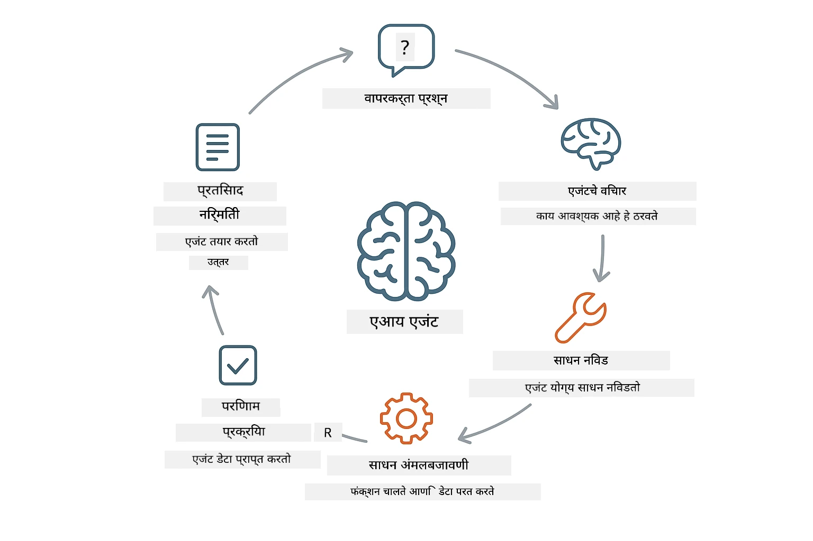
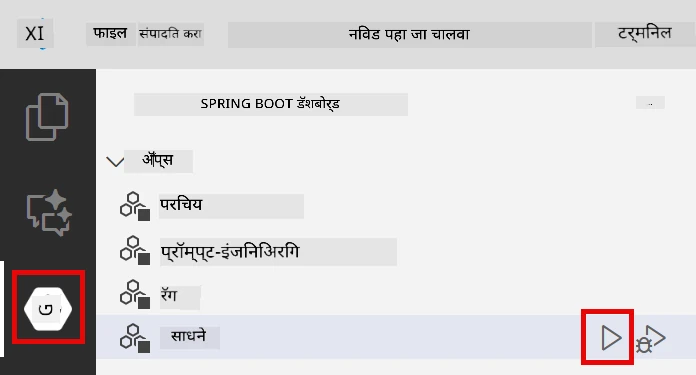
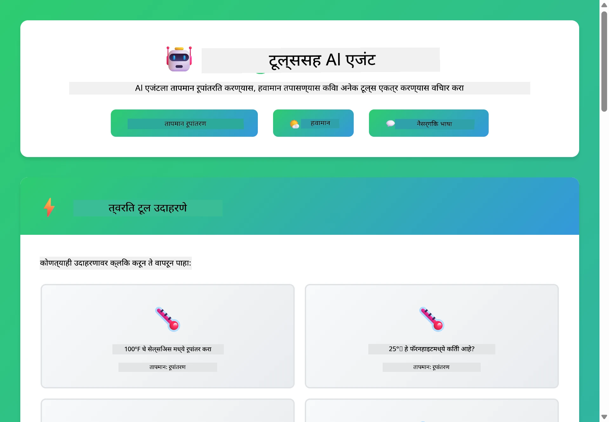

<!--
CO_OP_TRANSLATOR_METADATA:
{
  "original_hash": "844788938b26242f3cc54ce0d0951bea",
  "translation_date": "2026-01-05T22:42:13+00:00",
  "source_file": "04-tools/README.md",
  "language_code": "mr"
}
-->
# Module 04: टूलसह AI एजंट्स

## अनुक्रमणिका

- [तुम्ही काय शिकाल](../../../04-tools)
- [पूर्वअट](../../../04-tools)
- [टूलसह AI एजंट्स समजून घेणे](../../../04-tools)
- [टूल कॉल कसे कार्य करते](../../../04-tools)
  - [टूल व्याख्या](../../../04-tools)
  - [निर्णय घेणे](../../../04-tools)
  - [अंमलबजावणी](../../../04-tools)
  - [प्रतिक्रिया निर्मिती](../../../04-tools)
- [टूल चेनिंग](../../../04-tools)
- [अ‍ॅप्लिकेशन चालवा](../../../04-tools)
- [अ‍ॅप्लिकेशन वापरणे](../../../04-tools)
  - [साध्या टूल वापराचा प्रयत्न करा](../../../04-tools)
  - [टूल चेनिंग तपासा](../../../04-tools)
  - [संवाद प्रवाह पहा](../../../04-tools)
  - [विविध विनंत्यांसह प्रयोग करा](../../../04-tools)
- [महत्त्वाचे संकल्पना](../../../04-tools)
  - [ReAct पॅटर्न (तर्क आणि कृती)](../../../04-tools)
  - [टूल वर्णने महत्वाची](../../../04-tools)
  - [सेशन व्यवस्थापन](../../../04-tools)
  - [त्रुटी हाताळणी](../../../04-tools)
- [उपलब्ध टूल्स](../../../04-tools)
- [टूल-आधारित एजंट्स कधी वापरावे](../../../04-tools)
- [पुढील पावले](../../../04-tools)

## तुम्ही काय शिकाल

आत्तापर्यंत, तुम्ही AI सोबत संवाद कसा साधायचा, प्रभावीपणे प्रॉम्प्ट कसे रचायचे, आणि तुमच्या दस्तऐवजांमध्ये आधारित प्रतिसाद कसे तयार करायचे हे शिकलात. पण अजून एक मूलभूत निर्बंध आहे: भाषा मॉडेल्स फक्त मजकूर निर्माण करू शकतात. ते हवामान तपासू शकत नाहीत, गणना करू शकत नाहीत, डेटाबेस क्वेरी करू शकत नाहीत किंवा बाह्य प्रणालींशी संवाद साधू शकत नाहीत.

टूल्स हे बदलतात. मॉडेलला फंक्शन्स कॉल करण्याची परवानगी देऊन, तुम्ही त्याला मजकूर निर्माते पासून एक एजंटमध्ये रूपांतर करता जो कृती करू शकतो. मॉडेल ठरवते की कोणत्या वेळी टूल आवश्यक आहे, कोणता टूल वापरायचा आणि कोणते पॅरामिटर्स पास करायचे. तुमचा कोड फंक्शन अंमलात आणतो आणि निकाल परत करतो. मॉडेल त्या निकालाला आपल्या प्रतिसादात समाविष्ट करते.

## पूर्वअट

- पूर्ण केलेले Module 01 (Azure OpenAI संसाधने संस्थापित केली आहेत)
- मूळ निर्देशिकेत `.env` फाइल आहे ज्यात Azure प्रमाणपत्रे आहेत (Module 01 मध्ये `azd up` ने तयार केलेले)

> **नोट:** जर तुम्ही Module 01 पूर्ण केले नसेल, तर प्रथम तिथल्या डिप्लॉयमेंट सूचना पाळा.

## टूलसह AI एजंट्स समजून घेणे

> **📝 लक्षात ठेवा:** या मॉड्यूलमधील "एजंट्स" म्हणजे टूल कॉलिंग क्षमतांनी सुधारित AI सहाय्यक. हे त्या **Agentic AI** नमुन्यांपेक्षा भिन्न आहे (स्वायत्त एजंट ज्यात नियोजन, स्मृती आणि मल्टी-स्टेप तर्क आहे) जे आपण [Module 05: MCP](../05-mcp/README.md) मध्ये कव्हर करू.

टूलसह AI एजंट खालील तर्क व कृती पॅटर्न (ReAct) चे अनुसरण करतो:

1. वापरकर्ता प्रश्न विचारतो
2. एजंट काय जाणून घ्यायचे आहे हे तर्क करतो
3. एजंट ठरवतो की उत्तर देण्यासाठी टूलची गरज आहे का
4. होय असल्यास, एजंट योग्य टूल योग्य पॅरामिटर्ससह कॉल करतो
5. टूल कार्यान्वित होतो आणि डेटा परत करतो
6. एजंट निकाल समाविष्ट करून अंतिम उत्तर प्रदान करतो



*ReAct पॅटर्न - AI एजंट्स कसे तर्क आणि कृती यामध्ये बदल करून समस्या सोडवतात*

हे स्वयंचलितपणे होते. तुम्ही टूल्स आणि त्यांची वर्णने परिभाषित करता. मॉडेल ते कधी आणि कसे वापरायचे हे ठरवते.

## टूल कॉलिंग कसे कार्य करते

### टूल व्याख्या

[WeatherTool.java](../../../04-tools/src/main/java/com/example/langchain4j/agents/tools/WeatherTool.java) | [TemperatureTool.java](../../../04-tools/src/main/java/com/example/langchain4j/agents/tools/TemperatureTool.java)

तुम्ही स्पष्ट वर्णनांसह आणि पॅरामिटर स्पेसिफिकेशन्ससह फंक्शन्स परिभाषित करता. मॉडेलला त्याच्या सिस्टम प्रॉम्प्टमध्ये ही वर्णने दिसतात आणि ते प्रत्येक टूल काय करते हे समजते.

```java
@Component
public class WeatherTool {
    
    @Tool("Get the current weather for a location")
    public String getCurrentWeather(@P("Location name") String location) {
        // तुमची हवामान तपासणी लॉजिक
        return "Weather in " + location + ": 22°C, cloudy";
    }
}

@AiService
public interface Assistant {
    String chat(@MemoryId String sessionId, @UserMessage String message);
}

// सहाय्यक आपोआप Spring Boot द्वारे जोडलेले आहे:
// - ChatModel बीन
// - @Component वर्गांमधील सर्व @Tool पद्धती
// - सत्र व्यवस्थापनासाठी ChatMemoryProvider
```

> **🤖 [GitHub Copilot](https://github.com/features/copilot) Chat सोबत प्रयत्न करा:** [`WeatherTool.java`](../../../04-tools/src/main/java/com/example/langchain4j/agents/tools/WeatherTool.java) उघडा आणि विचारा:
> - "मी नकली डेटाऐवजी OpenWeatherMap सारखी वास्तविक हवामान API कशी एकत्र करीन?"
> - "एक चांगले टूल वर्णन काय असावे जे AI ला ते योग्यपणे वापरण्यास मदत करते?"
> - "मी टूल इम्प्लिमेंटेशन्समध्ये API त्रुटी आणि दर मर्यादा कशा हाताळू?"

### निर्णय घेणे

जेव्हा वापरकर्ता विचारतो "सीएटल मध्ये हवामान काय आहे?", मॉडेलला कळते की त्याला हवामान टूलची गरज आहे. ते स्थान पॅरामिटर सह "Seattle" म्हणून फंक्शन कॉल तयार करते.

### अंमलबजावणी

[AgentService.java](../../../04-tools/src/main/java/com/example/langchain4j/agents/service/AgentService.java)

स्प्रिंग बूट `@AiService` इंटरफेस आणि नोंदणीकृत टूल्स स्वयंचलितरित्या ऑटो-वायर करते, आणि LangChain4j टूल कॉल्स आपोआप अंमलात आणते.

> **🤖 [GitHub Copilot](https://github.com/features/copilot) Chat सोबत प्रयत्न करा:** [`AgentService.java`](../../../04-tools/src/main/java/com/example/langchain4j/agents/service/AgentService.java) उघडा आणि विचारा:
> - "ReAct पॅटर्न कसे कार्य करते आणि AI एजंट्ससाठी ते का प्रभावी आहे?"
> - "एजंट कोणते टूल वापरेल हे कसे ठरवते आणि कोणत्या क्रमाने?"
> - "जर टूल अंमलबजावणी अयशस्वी झाली तर काय होते - मी त्रुटी कशा मजबूतपणे हाताळू?"

### प्रतिक्रिया निर्मिती

मॉडेल हवामान डेटा प्राप्त करते आणि वापरकर्त्यासाठी त्याला नैसर्गिक भाषेमध्ये प्रतिसाद स्वरूपात तयार करते.

### डेक्लेरेटिव्ह AI सेवा का वापराव्यात?

हा मॉड्यूल LangChain4j च्या स्प्रिंग बूट इंटिग्रेशनसह डेक्लेरेटिव्ह `@AiService` इंटरफेस वापरतो:

- **स्प्रिंग बूट ऑटो-वायरिंग** - ChatModel आणि टूल्स आपोआप इंजेक्ट होतात
- **@MemoryId पॅटर्न** - स्वयंचलित सेशन-बेस्ड मेमरी व्यवस्थापन
- **एकच उदाहरण** - सहाय्यक एकदाच तयार होऊन कार्यक्षमतेसाठी पुनर्वापर केला जातो
- **टाइप-सेफ अंमलबजावणी** - जावा मेथड्स थेट कॉल होतात टाइप रूपांतरणासह
- **मल्टी-टर्न ऑर्केस्ट्रेशन** - टूल चेनिंग आपोआप हाताळते
- **झीरो बॉयलरप्लेट** - कोणत्याही मॅन्युअल AiServices.builder() कॉल्स किंवा मेमरी HashMap ची गरज नाही

पर्यायी पद्धती (मॅन्युअल `AiServices.builder()`) अधिक कोड आवश्यक करतात आणि स्प्रिंग बूट इंटिग्रेशनचे फायदे गमावतात.

## टूल चेनिंग

**टूल चेनिंग** - AI कधीकधी अनुक्रमे एकाहून अधिक टूल कॉल करतो. "सीएटल मध्ये हवामान काय आहे आणि मला छत्री आणायची का?" विचारा आणि बघा कसे ते `getCurrentWeather` कॉल करतं आणि पावसाच्या साहित्याबद्दल तर्क करतो.

<a href="images/tool-chaining.png"></a>

*अनुक्रमे टूल कॉल्स - एका टूलचा आउटपुट पुढच्या निर्णयामध्ये वापरला जातो*

**सौम्य अपयशे** - जर तुम्ही नकली डेटामध्ये नसलेल्या शहरासाठी हवामान विचारले, तर टूल त्रुटी संदेश परत करतो आणि AI सांगतो की ते मदत करू शकत नाही. टूल्स सुरक्षितपणे अयशस्वी होतात.

हे एका संवाद टर्नमध्ये होते. एजंट स्वायत्तपणे अनेक टूल कॉल्स आयोजित करतो.

## अ‍ॅप्लिकेशन चालवा

**डिप्लॉयमेंट सत्यापित करा:**

मूळ निर्देशिकेत `.env` फाइल आहे याची खात्री करा ज्यात Azure प्रमाणपत्रे आहेत (Module 01 चालू करताना तयार झालेले):
```bash
cat ../.env  # AZURE_OPENAI_ENDPOINT, API_KEY, DEPLOYMENT दाखवायला हवे
```

**अ‍ॅप्लिकेशन सुरू करा:**

> **नोट:** जर तुम्ही आधीच Module 01 मधील `./start-all.sh` वापरून सर्व अ‍ॅप्लिकेशन्स सुरू केले असतील, तर हा मॉड्यूल आधीच पोर्ट 8084 वर चालू आहे. तुम्ही खालील सुरू करण्याच्या आदेशांना टाळू शकता आणि थेट http://localhost:8084 ला जाऊ शकता.

**पर्याय 1: Spring Boot Dashboard वापरणे (VS Code वापरकर्त्यांसाठी शिफारसीय)**

डिव्ह कंटेनरमध्ये Spring Boot Dashboard विस्तार समाविष्ट आहे, जे सर्व Spring Boot अनुप्रयोगाचे व्यवस्थापनासाठी व्हिज्युअल इंटरफेस पुरवते. तुम्ही ते VS Code च्या डाव्या बाजूच्या Activity Bar मध्ये (Spring Boot चिन्ह शोधा) पाहू शकता.

Spring Boot Dashboard मधून, तुम्ही:
- वर्कस्पेसमधील सर्व उपलब्ध Spring Boot अ‍ॅप पाहू शकता
- एका क्लिकमध्ये अ‍ॅप्लिकेशन्स सुरू/ थांबवू शकता
- अ‍ॅप्लिकेशन लॉग्स रिअलटाइममध्ये पाहू शकता
- अ‍ॅप्लिकेशन स्थिती मॉनिटर करू शकता

"tools" जवळील प्ले बटण क्लिक करा आणि हा मॉड्यूल सुरू करा, किंवा सर्व मॉड्यूल्स एकत्र सुरू करा.



**पर्याय 2: शेल स्क्रिप्ट्स वापरणे**

सर्व वेब अ‍ॅप्लिकेशन्स (मॉड्यूल 01-04) सुरू करा:

**Bash:**
```bash
cd ..  # मूळ निर्देशिका पासून
./start-all.sh
```

**PowerShell:**
```powershell
cd ..  # मुळ संचिकामंडळातून
.\start-all.ps1
```

किंवा फक्त हा मॉड्यूल सुरू करा:

**Bash:**
```bash
cd 04-tools
./start.sh
```

**PowerShell:**
```powershell
cd 04-tools
.\start.ps1
```

दोन्ही स्क्रिप्ट्स मूळ `.env` फाइलमधून वातावरण चल (environment variables) आपोआप लोड करतात आणि जर JARs अस्तित्वात नसेल तर त्याला बिल्ड करतात.

> **नोट:** तुम्हाला सर्व मॉड्यूल्स मॅन्युअली बिल्ड करायचे असल्यास:
>
> **Bash:**
> ```bash
> cd ..  # Go to root directory
> mvn clean package -DskipTests
> ```
>
> **PowerShell:**
> ```powershell
> cd ..  # Go to root directory
> mvn clean package -DskipTests
> ```

ब्राउझरमध्ये http://localhost:8084 उघडा.

**थांबवण्यासाठी:**

**Bash:**
```bash
./stop.sh  # हा मॉड्यूल फक्त
# किंवा
cd .. && ./stop-all.sh  # सर्व मॉड्यूल्स
```

**PowerShell:**
```powershell
.\stop.ps1  # हा फक्त मॉड्यूल
# किंवा
cd ..; .\stop-all.ps1  # सर्व मॉड्यूल्स
```

## अ‍ॅप्लिकेशन वापरणे

हे अ‍ॅप्लिकेशन वेब इंटरफेस प्रदान करते जिथे तुम्ही हवामान आणि तापमान रूपांतरण टूल्सना प्रवेश असलेल्या AI एजंटशी संवाद साधू शकता.

<a href="images/tools-homepage.png"></a>

*AI एजंट टूल्स इंटरफेस - जलद उदाहरणे आणि टूल्ससह संवादासाठी चॅट इंटरफेस*

### साध्या टूल वापराचा प्रयत्न करा

सोप्या विनंतीने सुरुवात करा: "100 डिग्री फॅरनहाइटचे सेल्सियस मध्ये रूपांतर करा". एजंट ओळखतो की त्याला तापमान रूपांतरण टूलची गरज आहे, ते योग्य पॅरामिटर्ससह कॉल करते आणि निकाल परत करते. पहा कसा नैसर्गिक वाटतो - तुम्ही टूल वापरण्याबाबत किंवा कसे कॉल करायचे हे निर्दिष्ट केले नाही.

### टूल चेनिंग तपासा

आता काही अधिक गुंतागुंतीचे प्रयत्न करा: "सीएटल मध्ये हवामान काय आहे आणि ते फॅरनहाइटमध्ये रूपांतरित करा?" एजंट या प्रक्रियेत टप्प्याटप्प्याने काम करतो. प्रथम हवामान प्राप्त करतो (जे सेल्सियसमध्ये असते), नंतर फॅरनहाइटमध्ये रूपांतर करण्याची गरज ओळखतो, रूपांतरण टूल कॉल करतो, आणि दोन्ही निकाल एकत्र करून प्रतिसाद द्यायचा.

### संवाद प्रवाह पहा

चॅट इंटरफेस संवादाचा इतिहास ठेवतो, ज्यामुळे तुम्हाला मल्टी-टर्न संवाद करता येतात. तुम्ही पूर्वीच्या सर्व प्रश्न आणि प्रतिसाद पाहू शकता, जेणेकरून संवाद ट्रॅक करणे आणि एजंट कसा संदर्भ तयार करतो हे समजणे सोपे होते.

<a href="images/tools-conversation-demo.png"></a>

*मल्टी-टर्न संवाद, साध्या रूपांतरणे, हवामान तपासणी आणि टूल चेनिंग दाखवणारा*

### विविध विनंत्यांसह प्रयोग करा

विविध संयोजन प्रयत्न करा:
- हवामान तपासणी: "टोकियो मध्ये हवामान काय आहे?"
- तापमान रूपांतरण: "25°C किती केल्विनमध्ये आहे?"
- संमिश्र क्वेरीज: "पॅरिसमधील हवामान तपासा आणि मला सांगा की ते 20°C पेक्षा जास्त आहे का"

पहाता कसा एजंट नैसर्गिक भाषा समजतो आणि योग्य टूल कॉलमध्ये नकाशे बनवतो.

## महत्त्वाचे संकल्पना

### ReAct पॅटर्न (तर्क आणि कृती)

एजंट तर्क (काय करायचे ते ठरवणे) आणि कृती (टूल्स वापरणे) यामध्ये बदल करतो. हा पॅटर्न केवळ सूचना पाळण्यातून अधिक स्वायत्त समस्या सोडवू शकतो.

### टूल वर्णने महत्वाची

तुमच्या टूल वर्णनांची गुणवत्ता थेट एजंट कसा टूल वापरेल यावर परिणाम करते. स्पष्ट, विशिष्ट वर्णने मॉडेलला प्रत्येक टूल कधी आणि कसे कॉल करायचे हे समजण्यास मदत करतात.

### सेशन व्यवस्थापन

`@MemoryId` अ‍ॅनोटेशन स्वयंचलित सेशन-बेस्ड मेमरी व्यवस्थापन सक्षम करते. प्रत्येक सेशन आयडीला स्वतःचा `ChatMemory` उदाहरण `ChatMemoryProvider` बीनच्या माध्यमातून मिळतो, ज्यामुळे मॅन्युअल मेमरी ट्रॅकिंगची गरज राहत नाही.

### त्रुटी हाताळणी

टूल्स अयशस्वी होऊ शकतात - API टाइमआउट्स, पॅरामिटर्स अयोग्य, बाह्य सेवा बंद. प्रॉडक्शन एजंट्सना त्रुटी हाताळणीची गरज असते जेणेकरून मॉडेल समस्या स्पष्ट करू शकेल किंवा पर्याय शोधू शकेल.

## उपलब्ध टूल्स

**हवामान टूल्स** (डिमोसाठी नकली डेटा):
- स्थानासाठी वर्तमान हवामान मिळवा
- बहु-दिवसांचे पूर्वानुमान मिळवा

**तापमान रूपांतरण टूल्स**:
- सेल्सियस ते फॅरनहाइट
- फॅरनहाइट ते सेल्सियस
- सेल्सियस ते केल्विन
- केल्विन ते सेल्सियस
- फॅरनहाइट ते केल्विन
- केल्विन ते फॅरनहाइट

हे सोपे उदाहरण आहेत, पण हा पॅटर्न कोणत्याही फंक्शनमध्ये विस्तारू शकतो: डेटाबेस क्वेरीज, API कॉल्स, गणना, फाइल ऑपरेशन्स, किंवा सिस्टम कमांड्स.

## टूल-आधारित एजंट्स कधी वापरावे

**टूल्स वापरा जेव्हा:**
- उत्तरांसाठी रिअल-टाइम डेटा आवश्यक आहे (हवामान, स्टॉक किंमती, इन्व्हेंटरी)
- सोप्या गणितापलीकडे गणना करायची आहे
- डेटाबेस किंवा API ॲक्सेस पाहिजे
- क्रिया करायच्या आहेत (ईमेल पाठवणे, टिकट तयार करणे, रेकॉर्ड अपडेट करणे)
- अनेक डेटा स्रोत एकत्र करायचे आहेत

**टूल्स वापरू नका जेव्हा:**
- प्रश्न सामान्य ज्ञानावरून उत्तर देता येतात
- प्रतिसाद फक्त संभाषणात्मक आहे
- टूलचा विलंब अनुभवाला फार मंद करेल

## पुढील पावले

**पुढील मॉड्यूल:** [05-mcp - Model Context Protocol (MCP)](../05-mcp/README.md)

---

**नेव्हिगेशन:** [← मागील: Module 03 - RAG](../03-rag/README.md) | [मुख्य पृष्ठावर परत जा](../README.md) | [पुढील: Module 05 - MCP →](../05-mcp/README.md)

---

<!-- CO-OP TRANSLATOR DISCLAIMER START -->
**अस्वीकार**:
हा दस्तऐवज AI भाषांतर सेवा [Co-op Translator](https://github.com/Azure/co-op-translator) वापरून भाषांतरित केला आहे. आम्ही अचूकतेसाठी प्रयत्नशील असलो तरी, कृपया लक्षात ठेवा की स्वयंचलित भाषांतरांमध्ये त्रुटी किंवा चुकीचे अर्थ असू शकतात. मूळ दस्तऐवज त्याच्या स्थानिक भाषेत अधिकृत स्रोत मानला जावा. महत्त्वाच्या माहितीसाठी व्यावसायिक मानवी भाषांतराची शिफारस केली जाते. या भाषांतराच्या वापरामुळे उद्भवलेल्या कोणत्याही गैरसमजुती किंवा चुकीच्या अर्थसूद्दीबद्दल आम्ही जबाबदार नाही.
<!-- CO-OP TRANSLATOR DISCLAIMER END -->