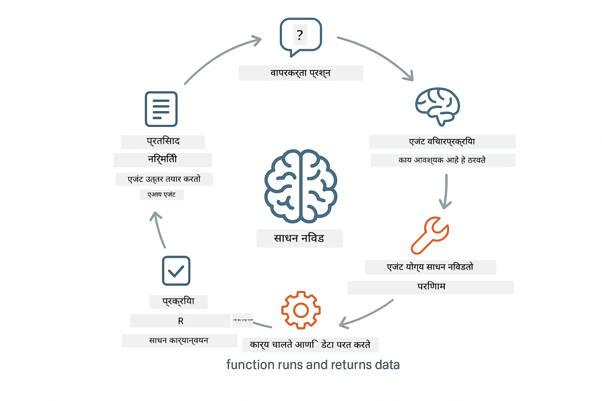
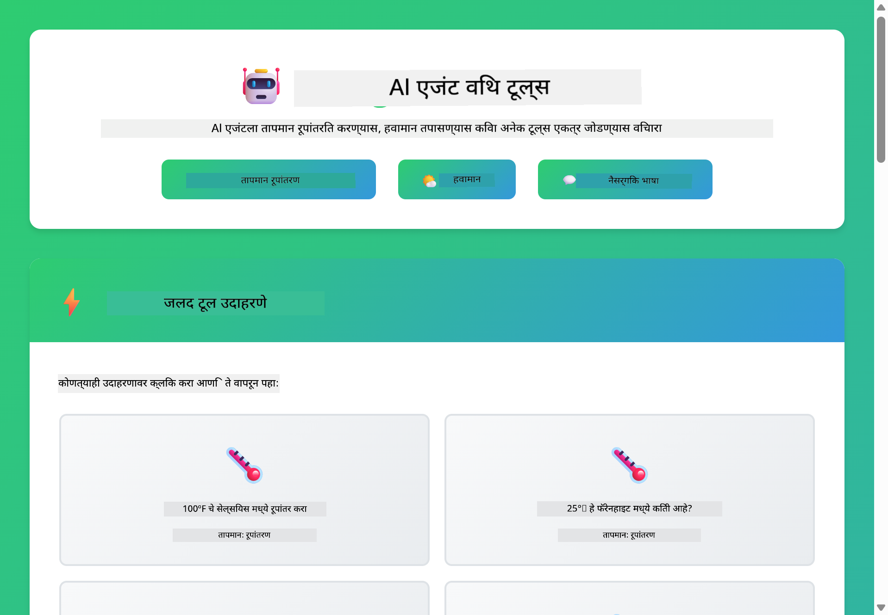

<!--
CO_OP_TRANSLATOR_METADATA:
{
  "original_hash": "13ec450c12cdd1a863baa2b778f27cd7",
  "translation_date": "2025-12-30T22:57:45+00:00",
  "source_file": "04-tools/README.md",
  "language_code": "mr"
}
-->
# Module 04: उपकरणांसह AI एजंट

## अनुक्रमणिका

- [आपण काय शिकाल](../../../04-tools)
- [पूर्वअटी](../../../04-tools)
- [उपकरणांसह AI एजंट समजून घेणे](../../../04-tools)
- [टूल कॉल कसे कार्य करते](../../../04-tools)
  - [टूल व्याख्या](../../../04-tools)
  - [निर्णय घेणे](../../../04-tools)
  - [अंमलबजावणी](../../../04-tools)
  - [प्रत्युत्तर निर्मिती](../../../04-tools)
- [टूल साखळी](../../../04-tools)
- [अॅप्लिकेशन चालवा](../../../04-tools)
- [अॅप्लिकेशन वापरणे](../../../04-tools)
  - [सोप्या टूल वापराचे प्रयत्न करा](../../../04-tools)
  - [टूल साखळी तपासा](../../../04-tools)
  - [संवाद प्रवाह पहा](../../../04-tools)
  - [तर्कशास्त्र निरीक्षण करा](../../../04-tools)
  - [विविध विनंत्यांसह प्रयोग करा](../../../04-tools)
- [महत्वाचे संकल्पना](../../../04-tools)
  - [ReAct पॅटर्न (तर्क व क्रिया)](../../../04-tools)
  - [टूल वर्णने महत्त्वाची असतात](../../../04-tools)
  - [सेशन व्यवस्थापन](../../../04-tools)
  - [त्रुटी हाताळणी](../../../04-tools)
- [उपलब्ध टूल्स](../../../04-tools)
- [कधी टूल-आधारित एजंट वापरायचे](../../../04-tools)
- [पुढील टप्पे](../../../04-tools)

## आपण काय शिकाल

आतापर्यंत, आपण AI सोबत संवाद कसा करायचा, प्रॉम्प्ट प्रभावीपणे कसे रचायचे, आणि आपल्या दस्तऐवजांमध्ये उत्तरांना कसे आधार देायचे हे शिकलात. परंतु एक मूलभूत मर्यादा आहे: भाषा मॉडेल्स फक्त मजकूर तयार करू शकतात. ते हवामान तपासू शकत नाहीत, गणिते करू शकत नाहीत, डेटाबेस क्वेरी करू शकत नाहीत, किंवा बाह्य प्रणालींसह इंटरॅक्ट करू शकत नाहीत.

टूल्स हे हे बदलतात. मॉडेलला कॉल करू शकणाऱ्या फंक्शन्सची ऍक्सेस दिल्याने, आपण ते एक मजकूर जनरेट करणाऱ्या मॉडेलवरून क्रिया घेऊ शकणाऱ्या एजंटमध्ये परिवर्तित करता. मॉडेल ठरवते की त्याला कधी टूलची गरज आहे, कोणते टूल वापरायचे आणि कोणते पॅरामीटर्स पाठवायचे. आपला कोड फंक्शन अंमलात आणतो आणि निकाल परत करतो. मॉडेल त्या निकालाला आपल्या प्रतिसादात समाविष्ट करते.

## पूर्वअटी

- मॉड्यूल 01 पूर्ण केलेले (Azure OpenAI संसाधने तैनात केलेली)
- रूट डायरेक्टरीमध्ये `.env` फाइल Azure क्रेडेन्शियल्ससह (Module 01 मध्ये `azd up` ने तयार केलेली)

> **टीप:** जर आपण Module 01 पूर्ण केलेले नसाल, तर तेथील तैनाती निर्देश प्रथम पूर्ण करा.

## उपकरणांसह AI एजंट समजून घेणे

> **📝 नोंद:** या मॉड्यूलमधील "एजंट" हा टूल-कॉलिंग क्षमता असलेला AI सहाय्यक दर्शवतो. हे त्या **Agentic AI** पॅटर्न्स (योजना, मेमरी, आणि बहु-टप्प्यांचे तर्क करणारे स्वायत्त एजंट) पासून वेगळे आहे जे आपण [Module 05: MCP](../05-mcp/README.md) मध्ये कव्हर करू.

टूल्स असलेला AI एजंट एक तर्क व क्रिया पॅटर्न (ReAct) फॉलो करतो:

1. वापरकर्ता प्रश्न विचारतो
2. एजंट ते काय जाणून घ्यायला हवे याबद्दल विचार करतो
3. एजंट ठरवतो की उत्तर देण्यासाठी त्याला टूलची गरज आहे का
4. जर गरज असेल तर, एजंट योग्य पॅरामीटर्ससह संबंधित टूल कॉल करतो
5. टूल अंमलात येते आणि डेटा परत करते
6. एजंट निकाल समाविष्ट करतो आणि अंतिम उत्तर देते



*ReAct पॅटर्न - AI एजंट समस्या सोडवण्यासाठी तर्क व क्रियेतील बदल कसा करतात*

हे सर्व स्वयंचलितपणे घडते. आपण टूल्स आणि त्यांच्या वर्णनांची व्याख्या करता. मॉडेल कधी आणि कसे ते वापरायचे याबद्दल निर्णय घेतो.

## टूल कॉल कसे कार्य करते

**टूल व्याख्या** - [WeatherTool.java](../../../04-tools/src/main/java/com/example/langchain4j/agents/tools/WeatherTool.java) | [TemperatureTool.java](../../../04-tools/src/main/java/com/example/langchain4j/agents/tools/TemperatureTool.java)

आपण स्पष्ट वर्णने आणि पॅरामीटर स्पेसिफिकेशन्ससह फंक्शन्स परिभाषित करतो. मॉडेल या वर्णनांना त्याच्या सिस्टम प्रॉम्प्टमध्ये पाहते आणि प्रत्येक टूल काय करते हे समजते.

```java
@Component
public class WeatherTool {
    
    @Tool("Get the current weather for a location")
    public String getCurrentWeather(@P("Location name") String location) {
        // तुमचा हवामान शोधण्याचा लॉजिक
        return "Weather in " + location + ": 22°C, cloudy";
    }
}

@AiService
public interface Assistant {
    String chat(@MemoryId String sessionId, @UserMessage String message);
}

// सहाय्यक Spring Boot ने आपोआप खालीलप्रमाणे जोडलेले आहे:
// - ChatModel बीन
// - @Component क्लासमधील सर्व @Tool पद्धती
// - सत्र व्यवस्थापनासाठी ChatMemoryProvider
```

> **🤖 [GitHub Copilot](https://github.com/features/copilot) चॅटसह प्रयत्न करा:** उघडा [`WeatherTool.java`](../../../04-tools/src/main/java/com/example/langchain4j/agents/tools/WeatherTool.java) आणि विचारा:
> - "मॉक डेटाऐवजी वास्तविक हवामान API जसे OpenWeatherMap कसे एकात्मिक करेन?"
> - "AI ने ते योग्यरित्या वापरायला मदत करण्यासाठी चांगली टूल वर्णनं कशी असावीत?"
> - "टूल अंमलबजावणीत API त्रुटी आणि रेट लिमिट्स कसे हाताळाव्यात?"

**निर्णय घेणे**

जेव्हा वापरकर्ता "Seattle मध्ये हवामान काय आहे?" असे विचारतो, तेव्हा मॉडेल ओळखते की त्याला हवामान टूलची आवश्यकता आहे. ते स्थान पॅरामीटर "Seattle" सह फंक्शन कॉल तयार करते.

**अंमलबजावणी** - [AgentService.java](../../../04-tools/src/main/java/com/example/langchain4j/agents/service/AgentService.java)

Spring Boot सर्व नोंदणीकृत टूल्ससह деклараटिव्ह `@AiService` इंटरफेस ऑटो-वायर करतो, आणि LangChain4j टूल कॉल्स स्वयंचलितपणे अंमलात आणते.

> **🤖 [GitHub Copilot](https://github.com/features/copilot) चॅटसह प्रयत्न करा:** उघडा [`AgentService.java`](../../../04-tools/src/main/java/com/example/langchain4j/agents/service/AgentService.java) आणि विचारा:
> - "ReAct पॅटर्न कसा कार्य करतो आणि AI एजंटसाठी का प्रभावी आहे?"
> - "एजंट कोणते टूल वापरायचे आणि कोणत्या क्रमाने हे कसे ठरवते?"
> - "जर एखाद्या टूलची अंमलबजावणी अयशस्वी झाली तर काय होते - त्रुटी कशा पद्धतीने robust पद्धतीने हाताळाव्यात?"

**प्रत्युत्तर निर्मिती**

मॉडेल हवामान डेटा प्राप्त करते आणि ते वापरकर्त्यासाठी नैसर्गिक भाषेतून स्वरूपित करते.

### उद्घोषणे का वापरावीत?

हा मॉड्यूल LangChain4j च्या Spring Boot एकत्रीकरणासह деклараटिव्ह `@AiService` इंटरफेस वापरतो:

- **Spring Boot ऑटो-वाईरिंग** - ChatModel आणि टूल्स आपोआप इंजेक्ट होतात
- **@MemoryId पॅटर्न** - स्वयंचलित सेशन-आधारित मेमरी व्यवस्थापन
- **एकल उदाहरण** - सहाय्यक एकदाच तयार होतो आणि चांगल्या परफॉर्मन्ससाठी पुनर्वापर केला जातो
- **टाइप-सेफ अंमलबजावणी** - Java मेथड्स थेट कॉल केल्या जातात व टाइप रूपांतरण होते
- **मल्टी-टर्न ऑर्केस्ट्रेशन** - टूल साखळी स्वयंचलितपणे हाताळतो
- **शून्य बोइलरप्लेट** - मॅन्युअल AiServices.builder() कॉल्स किंवा मेमरी HashMap आवश्यक नाहीत

वैकल्पिक पध्दती (मॅन्युअल `AiServices.builder()`) अधिक कोड आवश्यकता असते आणि Spring Boot एकत्रीकरणाचे फायदे गमावतात.

## टूल साखळी

**टूल साखळी** - AI अनेक टूल्स सलग कॉल करू शकते. "Seattle मध्ये हवामान काय आहे आणि मी छत्री घेऊन जावे का?" असा विचार करा आणि ते `getCurrentWeather` कॉल करून पावसाबद्दलच्या निर्णयाबद्दल reasoning करेल.

<a href="images/tool-chaining.png"></a>

*अनुक्रमिक टूल कॉल - एका टूलचा आउटपुट पुढील निर्णयात वापरला जातो*

**सौम्य अपयश** - मॉक डेटामध्ये नसलं असलेलं शहर विचारून बघा. टूल एक त्रुटी संदेश परत करेल, आणि AI समजावून सांगेल की ते मदत करू शकत नाही. टूल्स सुरक्षितपणे अयशस्वी होतात.

हे एकाच संभाषण टर्नमध्ये घडते. एजंट स्वायंचलितपणे अनेक टूल कॉल्सचे आयोजन करतो.

## अॅप्लिकेशन चालवा

**तैनाती तपासा:**

रूट डायरेक्टरीमध्ये `.env` फाइल Azure क्रेडेन्शियल्ससह अस्तित्वात आहे याची खात्री करा (Module 01 दरम्यान तयार केलेली):
```bash
cat ../.env  # AZURE_OPENAI_ENDPOINT, API_KEY, DEPLOYMENT दाखवावे.
```

**अॅप्लिकेशन सुरू करा:**

> **टीप:** जर आपण Module 01 मधून `./start-all.sh` वापरून सर्व अॅप्लिकेशन्स आधीच सुरू केली असतील, तर हे मॉड्यूल पोर्ट 8084 वर आधीच चालू आहे. आपण खालील सुरू करण्याच्या आदेशांना वगळून थेट http://localhost:8084 वर जाऊ शकता.

**पर्याय 1: Spring Boot Dashboard वापरणे (VS Code वापरणाऱ्यांसाठी शिफारसीय)**

डेव्ह कंटेनरमध्ये Spring Boot Dashboard एक्सटेंशन समाविष्ट आहे, जे सर्व Spring Boot अॅप्लिकेशन्स व्यवस्थापित करण्यासाठी व्हिज्युअल इंटरफेस प्रदान करते. आपण ते VS Code च्या Activity Bar च्या डाव्या बाजूला (Spring Boot आयकॉन शोधा) पाहू शकता.

Spring Boot Dashboard मधून आपण:
- वर्कस्पेसमधील सर्व उपलब्ध Spring Boot अॅप्लिकेशन्स पाहू शकता
- एक क्लिकने अॅप्लिकेशन्स सुरू/थांबवू शकता
- अॅप्लिकेशन लॉग रिअल-टाइममध्ये पाहू शकता
- अॅप्लिकेशन स्थिती मॉनिटर करू शकता

फक्त "tools" च्या शेजारीला प्ले बटण क्लिक करा हे मॉड्यूल सुरू करण्यासाठी, किंवा सर्व मॉड्यूल एकावेळी सुरू करा.


**पर्याय 2: शेल स्क्रिप्ट्स वापरणे**

सर्व वेब अॅप्लिकेशन्स सुरू करा (मॉड्यूल 01-04):

**Bash:**
```bash
cd ..  # रूट निर्देशिकेतून
./start-all.sh
```

**PowerShell:**
```powershell
cd ..  # रूट निर्देशिकेतून
.\start-all.ps1
```

किंवा फक्त हे मॉड्यूल सुरू करा:

**Bash:**
```bash
cd 04-tools
./start.sh
```

**PowerShell:**
```powershell
cd 04-tools
.\start.ps1
```

दोन्ही स्क्रिप्ट्स रूट `.env` फाइलमधून एन्व्हायरमेंट व्हेरिएबल्स आपोआप लोड करतात आणि जर JARs अस्तित्वात नसतील तर ते बिल्ड करतील.

> **टीप:** जर आपण सर्व मॉड्यूल्स मॅन्युअली बिल्ड करायला प्राधान्य देत असाल:
>
> **Bash:**
> ```bash
> cd ..  # Go to root directory
> mvn clean package -DskipTests
> ```
>
> **PowerShell:**
> ```powershell
> cd ..  # Go to root directory
> mvn clean package -DskipTests
> ```

आपल्या ब्राउजरमध्ये http://localhost:8084 उघडा.

**थांबवण्यासाठी:**

**Bash:**
```bash
./stop.sh  # फक्त हा मॉड्यूल
# किंवा
cd .. && ./stop-all.sh  # सर्व मॉड्यूल
```

**PowerShell:**
```powershell
.\stop.ps1  # फक्त हे मॉड्यूल
# किंवा
cd ..; .\stop-all.ps1  # सर्व मॉड्यूल
```

## अॅप्लिकेशन वापरणे

हे अॅप्लिकेशन एक वेब इंटरफेस प्रदान करते जिथे आपण हवामान आणि तापमान रूपांतरण टूल्ससह AI एजंटशी संवाद साधू शकता.

<a href="images/tools-homepage.png"></a>

*AI एजंट टूल्स इंटरफेस - टूल्स वापरून संवाद साधण्यासाठी जलद उदाहरणे आणि चॅट इंटरफेस*

**सोप्या टूल वापराचे प्रयत्न करा**

सोप्या विनंतीने सुरू करा: "100 डिग्री फॅरेनहाइट सेल्सियसमध्ये रूपांतर करा". एजंट ओळखतो की त्याला तापमान रूपांतरण टूलची गरज आहे, योग्य पॅरामीटर्ससह कॉल करतो, आणि निकाल परत करतो. लक्षात घ्या किती नैसर्गिक वाटते - आपण कोणते टूल वापरायचे किंवा कसे कॉल करायचे हे निर्दिष्ट केले नाही.

**टूल साखळी तपासा**

आता थोडे जास्त क्लिष्ट प्रयत्न करा: "Seattle मध्ये हवामान काय आहे आणि ते फॅरेनहाइटमध्ये रूपांतर करा?" पाहा एजंट हे टप्प्याटप्प्याने कसे हाताळतो. ते प्रथम हवामान मिळवते (जे सेल्सियसमध्ये परत करते), नंतर ते ओळखते की फॅरेनहाइटमध्ये रूपांतर करायचे आहे, रूपांतरण टूल कॉल करते, आणि दोन्ही निकाल एकत्र करून एक प्रतिसाद देते.

**संवाद प्रवाह पहा**

चॅट इंटरफेस संभाषण इतिहास राखतो, ज्यामुळे आपण मल्टी-टर्न संवाद करू शकता. आपण मागील सर्व क्वेरीज आणि प्रतिसाद पाहू शकता, ज्यामुळे संभाषण ट्रॅक करणे आणि एजंट कसा संदर्भ ओळखतो ते समजणे सोपे होते.

<a href="images/tools-conversation-demo.png"></a>

*मल्टी-टर्न संभाषण दर्शवते साधी रूपांतरे, हवामान शोध, आणि टूल साखळी*

**विविध विनंत्यांसह प्रयोग करा**

विविध संयोजनांना प्रयत्न करा:
- हवामान शोध: "Tokyo मध्ये हवामान काय आहे?"
- तापमान रूपांतरण: "25°C किती केल्विन आहे?"
- संयुक्त क्वेरीज: "Paris मध्ये हवामान तपासा आणि सांगा की ते 20°C पेक्षा जास्त आहे का"

लक्षात घ्या की एजंट नैसर्गिक भाषेचे अर्थ कसे समजूून योग्य टूल कॉल्सशी नकाशित करतो.

## महत्वाचे संकल्पना

**ReAct पॅटर्न (तर्क व क्रिया)**

एजंट तर्क (काय करायचे हे ठरवणे) आणि क्रिया (टूल्स वापरणे) यांच्यात गतीमानपणे बदलतो. हा पैटर्न केवळ निर्देशांचे पालन करण्याऐवजी स्वायत्त समस्यासमाधान सक्षम करतो.

**टूल वर्णने महत्त्वाची असतात**

आपल्या टूल वर्णनांची गुणवत्ता थेट प्रभावित करते की एजंट त्यांना किती चांगले वापरतो. स्पष्ट आणि विशिष्ट वर्णने मॉडेलला कधी आणि कसे प्रत्येक टूल कॉल करायचे हे समजून घेण्यास मदत करतात.

**सेशन व्यवस्थापन**

`@MemoryId` अ‍ॅनोटेशन स्वयंचलित सेशन-आधारित मेमरी व्यवस्थापन सक्षम करते. प्रत्येक सेशन आयडीला `ChatMemory` चे स्वतःचे उदाहरण `ChatMemoryProvider` बीनद्वारे व्यवस्थापित केले जाते, ज्यामुळे मॅन्युअल मेमरी ट्रॅकिंगची गरज नाहीशी होते.

**त्रुटी हाताळणी**

टूल्स अयशस्वी होऊ शकतात - API टाइमआउट्स, अवैध पॅरामीटर्स, बाह्य सेवांचे डाउन होणे. उत्पादनातील एजंट्सला त्रुटी हाताळणी आवश्यक आहे जेणेकरून मॉडेल समस्यांबद्दल समजावून सांगू शकेल किंवा पर्याय शोधण्याचा प्रयत्न करू शकेल.

## उपलब्ध टूल्स

**हवामान टूल्स** (सादरीकरणासाठी मॉक डेटा):
- एखाद्या ठिकाणासाठी वर्तमान हवामान मिळवा
- बहु-दिनी अंदाज मिळवा

**तापमान रूपांतरण टूल्स**:
- सेल्सिअस ते फॅरेनहाइट
- फॅरेनहाइट ते सेल्सिअस
- सेल्सिअस ते केल्विन
- केल्विन ते सेल्सिअस
- फॅरेनहाइट ते केल्विन
- केल्विन ते फॅरेनहाइट

हे सोपे उदाहरणे आहेत, परंतु हे पॅटर्न कोणत्याही फंक्शनवर विस्तारू शकते: डेटाबेस क्वेरीज, API कॉल्स, गणना, फाइल ऑपरेशन्स, किंवा सिस्टीम कमांड.

## कधी टूल-आधारित एजंट वापरायचे

**टूल्स वापरा जेव्हा:**
- उत्तर देण्यासाठी रिअल-टाइम डेटा आवश्यक असेल (हवामान, स्टॉक किंमती, इन्व्हेंटरी)
- साध्या गणितापेक्षा जास्त गणना करावी लागेल
- डेटाबेस किंवा API ऍक्सेस करायचा असेल
- क्रिया करायची असेल (ईमेल पाठवणे, तिकीट तयार करणे, रेकॉर्ड अपडेट करणे)
- एकाधिक डेटा स्त्रोत एकत्र करायचे असतील

**टूल्स वापरू नका जेव्हा:**
- प्रश्न सामान्य ज्ञानावरून उत्तर देता येतात
- प्रतिसाद पूर्णपणे संभाषणात्मक आहे
- टूल विलंब अनुभव खूप हळू करील

## पुढील टप्पे

**पुढील मॉड्यूल:** [05-mcp - Model Context Protocol (MCP)](../05-mcp/README.md)

---

**नेव्हिगेशन:** [← मागील: Module 03 - RAG](../03-rag/README.md) | [मुख्य पृष्ठावर परत](../README.md) | [पुढचे: Module 05 - MCP →](../05-mcp/README.md)

---

<!-- CO-OP TRANSLATOR DISCLAIMER START -->
अस्वीकरण:
हा दस्तऐवज AI अनुवाद सेवा [Co-op Translator](https://github.com/Azure/co-op-translator) वापरून अनुवादित केला गेला आहे. आम्ही अचूकतेसाठी प्रयत्न करतो, परंतु कृपया लक्षात घ्या की स्वयंचलित अनुवादांमध्ये चुका किंवा अपूर्णता असू शकतात. मूळ दस्तऐवज त्याच्या मूळ भाषेतच अधिकृत स्रोत मानला पाहिजे. महत्वाच्या माहितीकरिता व्यावसायिक मानवी अनुवादाची शिफारस केली जाते. या अनुवादाच्या वापरामुळे उद्भवणाऱ्या कोणत्याही गैरसमजुतींसाठी किंवा चुकीच्या अर्थनिष्कर्षांसाठी आम्ही जबाबदार नाही.
<!-- CO-OP TRANSLATOR DISCLAIMER END -->