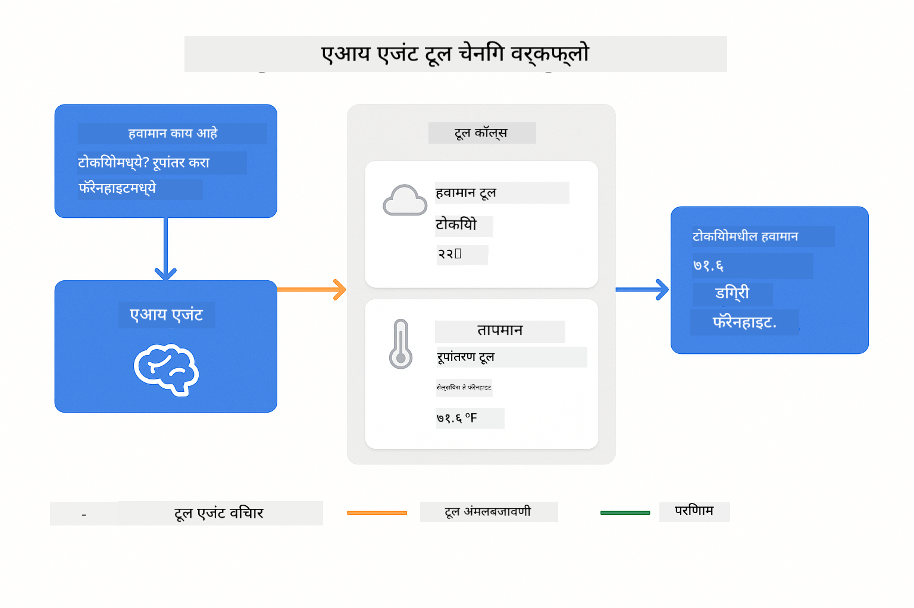
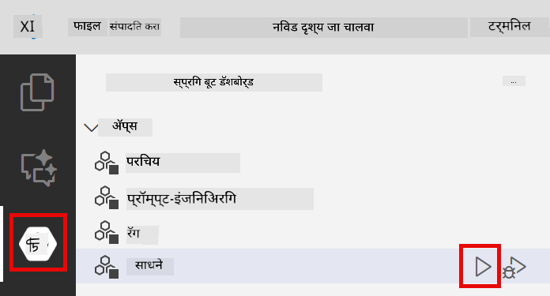
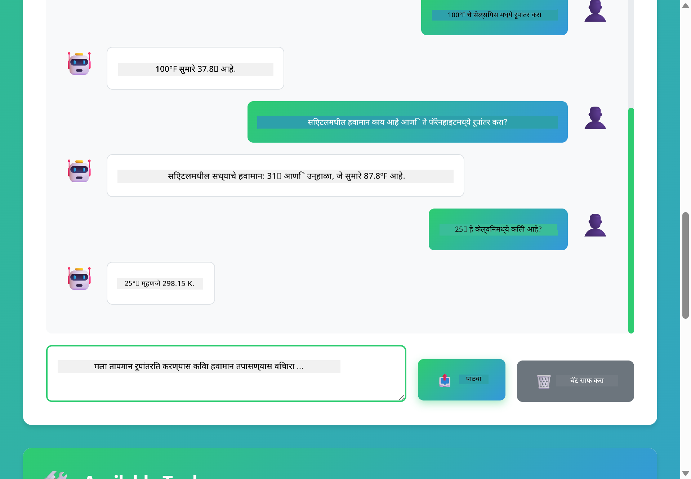

<!--
CO_OP_TRANSLATOR_METADATA:
{
  "original_hash": "aa23f106e7f53270924c9dd39c629004",
  "translation_date": "2025-12-13T18:41:43+00:00",
  "source_file": "04-tools/README.md",
  "language_code": "mr"
}
-->
# Module 04: टूल्ससह AI एजंट्स

## अनुक्रमणिका

- [तुम्ही काय शिकाल](../../../04-tools)
- [पूर्वअट](../../../04-tools)
- [टूल्ससह AI एजंट्स समजून घेणे](../../../04-tools)
- [टूल कॉलिंग कसे कार्य करते](../../../04-tools)
  - [टूल व्याख्या](../../../04-tools)
  - [निर्णय घेणे](../../../04-tools)
  - [अंमलबजावणी](../../../04-tools)
  - [प्रतिक्रिया निर्मिती](../../../04-tools)
- [टूल चेनिंग](../../../04-tools)
- [अॅप्लिकेशन चालवा](../../../04-tools)
- [अॅप्लिकेशन वापरणे](../../../04-tools)
  - [सोप्या टूल वापराचा प्रयत्न करा](../../../04-tools)
  - [टूल चेनिंगची चाचणी करा](../../../04-tools)
  - [संवाद प्रवाह पहा](../../../04-tools)
  - [तर्कशास्त्र निरीक्षण करा](../../../04-tools)
  - [वेगवेगळ्या विनंत्यांसह प्रयोग करा](../../../04-tools)
- [महत्त्वाच्या संकल्पना](../../../04-tools)
  - [ReAct पॅटर्न (तर्कशास्त्र आणि क्रिया)](../../../04-tools)
  - [टूल वर्णने महत्त्वाची आहेत](../../../04-tools)
  - [सेशन व्यवस्थापन](../../../04-tools)
  - [त्रुटी हाताळणी](../../../04-tools)
- [उपलब्ध टूल्स](../../../04-tools)
- [टूल-आधारित एजंट्स कधी वापरावे](../../../04-tools)
- [पुढील पावले](../../../04-tools)

## तुम्ही काय शिकाल

आत्तापर्यंत, तुम्ही AI सोबत संवाद कसा साधायचा, प्रभावीपणे प्रॉम्प्ट कसे तयार करायचे, आणि तुमच्या दस्तऐवजांमध्ये प्रतिसाद कसा आधारभूत करायचा हे शिकलात. पण अजूनही एक मूलभूत मर्यादा आहे: भाषा मॉडेल्स फक्त मजकूर तयार करू शकतात. ते हवामान तपासू शकत नाहीत, गणना करू शकत नाहीत, डेटाबेस क्वेरी करू शकत नाहीत किंवा बाह्य प्रणालींसोबत संवाद साधू शकत नाहीत.

टूल्स हे बदलतात. मॉडेलला कॉल करू शकणाऱ्या फंक्शन्सची प्रवेश देऊन, तुम्ही त्याला मजकूर निर्मात्यापासून अशा एजंटमध्ये रूपांतरित करता जो क्रिया करू शकतो. मॉडेल ठरवते की त्याला कधी टूलची गरज आहे, कोणता टूल वापरायचा आहे, आणि कोणते पॅरामीटर्स द्यायचे आहेत. तुमचा कोड फंक्शन चालवतो आणि निकाल परत करतो. मॉडेल त्या निकालाला त्याच्या प्रतिसादात समाविष्ट करते.

## पूर्वअट

- Module 01 पूर्ण केलेले (Azure OpenAI संसाधने तैनात केलेली)
- रूट डायरेक्टरीमध्ये `.env` फाइल Azure क्रेडेन्शियल्ससह (Module 01 मध्ये `azd up` ने तयार केलेली)

> **टीप:** जर तुम्ही Module 01 पूर्ण केले नसेल, तर प्रथम तिथल्या तैनातीच्या सूचना पाळा.

## टूल्ससह AI एजंट्स समजून घेणे

टूल्ससह AI एजंट ReAct (तर्कशास्त्र आणि क्रिया) पॅटर्नचे पालन करतो:

1. वापरकर्ता प्रश्न विचारतो
2. एजंट काय जाणून घ्यायचे आहे याचा विचार करतो
3. एजंट ठरवतो की उत्तर देण्यासाठी टूलची गरज आहे का
4. जर होय, तर एजंट योग्य टूल योग्य पॅरामीटर्ससह कॉल करतो
5. टूल अंमलबजावणी करतो आणि डेटा परत करतो
6. एजंट निकाल समाविष्ट करतो आणि अंतिम उत्तर देतो


*ReAct पॅटर्न - AI एजंट्स कसे तर्कशास्त्र आणि क्रिया यामध्ये बदल करतात समस्या सोडवण्यासाठी*

हे स्वयंचलितपणे होते. तुम्ही टूल्स आणि त्यांची वर्णने परिभाषित करता. मॉडेल कधी आणि कसे वापरायचे याबाबत निर्णय घेते.

## टूल कॉलिंग कसे कार्य करते

**टूल व्याख्या** - [WeatherTool.java](../../../04-tools/src/main/java/com/example/langchain4j/agents/tools/WeatherTool.java) | [TemperatureTool.java](../../../04-tools/src/main/java/com/example/langchain4j/agents/tools/TemperatureTool.java)

तुम्ही स्पष्ट वर्णने आणि पॅरामीटर तपशीलांसह फंक्शन्स परिभाषित करता. मॉडेल या वर्णनांना त्याच्या सिस्टम प्रॉम्प्टमध्ये पाहते आणि प्रत्येक टूल काय करते हे समजते.

```java
@Component
public class WeatherTool {
    
    @Tool("Get the current weather for a location")
    public String getCurrentWeather(@P("Location name") String location) {
        // तुमची हवामान शोधण्याची लॉजिक
        return "Weather in " + location + ": 22°C, cloudy";
    }
}

@AiService
public interface Assistant {
    String chat(@MemoryId String sessionId, @UserMessage String message);
}

// सहाय्यक स्वयंचलितपणे Spring Boot द्वारे जोडलेले आहे:
// - ChatModel बीन
// - @Component वर्गांमधील सर्व @Tool पद्धती
// - सत्र व्यवस्थापनासाठी ChatMemoryProvider
```

> **🤖 [GitHub Copilot](https://github.com/features/copilot) चॅटसह प्रयत्न करा:** [`WeatherTool.java`](../../../04-tools/src/main/java/com/example/langchain4j/agents/tools/WeatherTool.java) उघडा आणि विचारा:
> - "मी mock डेटा ऐवजी OpenWeatherMap सारखा वास्तविक हवामान API कसा समाकलित करू?"
> - "AI ला योग्य वापरासाठी मदत करणारी चांगली टूल वर्णन काय असते?"
> - "टूल अंमलबजावणीत API त्रुटी आणि दर मर्यादा कशा हाताळायच्या?"

**निर्णय घेणे**

जेव्हा वापरकर्ता विचारतो "सिएटलमध्ये हवामान कसे आहे?", तेव्हा मॉडेलला समजते की त्याला हवामान टूलची गरज आहे. ते "सिएटल" या स्थान पॅरामीटरसह फंक्शन कॉल तयार करते.

**अंमलबजावणी** - [AgentService.java](../../../04-tools/src/main/java/com/example/langchain4j/agents/service/AgentService.java)

Spring Boot सर्व नोंदणीकृत टूल्ससह घोषणात्मक `@AiService` इंटरफेस ऑटो-वायर करते, आणि LangChain4j टूल कॉल्स स्वयंचलितपणे अंमलात आणते.

> **🤖 [GitHub Copilot](https://github.com/features/copilot) चॅटसह प्रयत्न करा:** [`AgentService.java`](../../../04-tools/src/main/java/com/example/langchain4j/agents/service/AgentService.java) उघडा आणि विचारा:
> - "ReAct पॅटर्न कसा कार्य करतो आणि AI एजंट्ससाठी तो का प्रभावी आहे?"
> - "एजंट कसा ठरवतो कोणता टूल वापरायचा आणि कोणत्या क्रमाने?"
> - "जर टूल अंमलबजावणी अयशस्वी झाली तर काय होते - त्रुटी कशा मजबूतपणे हाताळाव्यात?"

**प्रतिक्रिया निर्मिती**

मॉडेल हवामान डेटा प्राप्त करते आणि वापरकर्त्यासाठी नैसर्गिक भाषेत प्रतिसाद तयार करते.

### घोषणात्मक AI सेवा का वापराव्यात?

हा मॉड्यूल LangChain4j च्या Spring Boot एकत्रीकरणासह घोषणात्मक `@AiService` इंटरफेस वापरतो:

- **Spring Boot ऑटो-वायरिंग** - ChatModel आणि टूल्स स्वयंचलितपणे इंजेक्ट होतात
- **@MemoryId पॅटर्न** - स्वयंचलित सेशन-आधारित मेमरी व्यवस्थापन
- **एकच उदाहरण** - सहाय्यक एकदाच तयार होतो आणि पुनर्वापर केला जातो ज्यामुळे कार्यक्षमता सुधारते
- **टाइप-सेफ अंमलबजावणी** - Java पद्धती थेट टाइप रूपांतरणासह कॉल केल्या जातात
- **मल्टी-टर्न ऑर्केस्ट्रेशन** - टूल चेनिंग स्वयंचलितपणे हाताळते
- **झिरो बॉयलरप्लेट** - कोणतेही मॅन्युअल AiServices.builder() कॉल किंवा मेमरी HashMap नाही

पर्यायी पद्धती (मॅन्युअल `AiServices.builder()`) अधिक कोडची गरज असते आणि Spring Boot एकत्रीकरणाचे फायदे गमावतात.

## टूल चेनिंग

**टूल चेनिंग** - AI कदाचित अनेक टूल्स अनुक्रमे कॉल करू शकतो. "सिएटलमध्ये हवामान कसे आहे आणि मला छत्री आणावी का?" असा प्रश्न विचारा आणि ते `getCurrentWeather` कॉलसह पावसाच्या वस्तूंबाबत तर्क करते.

<a href="images/tool-chaining.png"></a>

*अनुक्रमिक टूल कॉल्स - एका टूलचा आउटपुट पुढील निर्णयात वापरला जातो*

**सौम्य अपयश** - mock डेटामध्ये नसलेल्या शहराचा हवामान विचारल्यास टूल त्रुटी संदेश परत करते, आणि AI सांगते की ते मदत करू शकत नाही. टूल्स सुरक्षितपणे अयशस्वी होतात.

हे एका संवाद टर्नमध्ये होते. एजंट स्वायत्तपणे अनेक टूल कॉल्सचे समन्वय करतो.

## अॅप्लिकेशन चालवा

**तैनातीची पुष्टी करा:**

रूट डायरेक्टरीमध्ये `.env` फाइल Azure क्रेडेन्शियल्ससह अस्तित्वात आहे याची खात्री करा (Module 01 दरम्यान तयार केलेली):
```bash
cat ../.env  # AZURE_OPENAI_ENDPOINT, API_KEY, DEPLOYMENT दाखवले पाहिजे
```

**अॅप्लिकेशन सुरू करा:**

> **टीप:** जर तुम्ही आधीच Module 01 मधील `./start-all.sh` वापरून सर्व अॅप्लिकेशन्स सुरू केले असतील, तर हा मॉड्यूल पोर्ट 8084 वर आधीच चालू आहे. तुम्ही खालील सुरू करण्याच्या आदेशांना वगळू शकता आणि थेट http://localhost:8084 वर जाऊ शकता.

**पर्याय 1: Spring Boot डॅशबोर्ड वापरणे (VS Code वापरकर्त्यांसाठी शिफारस)**

डेव्ह कंटेनरमध्ये Spring Boot डॅशबोर्ड विस्तार समाविष्ट आहे, जो सर्व Spring Boot अॅप्लिकेशन्स व्यवस्थापित करण्यासाठी दृश्यात्मक इंटरफेस प्रदान करतो. तुम्हाला VS Code च्या डाव्या बाजूला Activity Bar मध्ये Spring Boot आयकॉन दिसेल.

Spring Boot डॅशबोर्डमधून तुम्ही:
- वर्कस्पेसमधील सर्व उपलब्ध Spring Boot अॅप्लिकेशन्स पाहू शकता
- एक क्लिकने अॅप्लिकेशन्स सुरू/थांबवू शकता
- अॅप्लिकेशन लॉग्स रिअल-टाइममध्ये पाहू शकता
- अॅप्लिकेशन स्थिती निरीक्षण करू शकता

"tools" जवळील प्ले बटणावर क्लिक करा हा मॉड्यूल सुरू करण्यासाठी, किंवा सर्व मॉड्यूल एकत्र सुरू करा.



**पर्याय 2: शेल स्क्रिप्ट्स वापरणे**

सर्व वेब अॅप्लिकेशन्स (मॉड्यूल 01-04) सुरू करा:

**Bash:**
```bash
cd ..  # मूळ निर्देशिकेतून
./start-all.sh
```

**PowerShell:**
```powershell
cd ..  # मूळ निर्देशिकेतून
.\start-all.ps1
```

किंवा फक्त हा मॉड्यूल सुरू करा:

**Bash:**
```bash
cd 04-tools
./start.sh
```

**PowerShell:**
```powershell
cd 04-tools
.\start.ps1
```

दोन्ही स्क्रिप्ट्स रूट `.env` फाइलमधून पर्यावरणीय चल स्वयंचलितपणे लोड करतात आणि जर JAR अस्तित्वात नसेल तर तयार करतात.

> **टीप:** जर तुम्हाला सर्व मॉड्यूल्स मॅन्युअली तयार करायचे असतील सुरू करण्यापूर्वी:
>
> **Bash:**
> ```bash
> cd ..  # Go to root directory
> mvn clean package -DskipTests
> ```
>
> **PowerShell:**
> ```powershell
> cd ..  # Go to root directory
> mvn clean package -DskipTests
> ```

तुमच्या ब्राउझरमध्ये http://localhost:8084 उघडा.

**थांबवण्यासाठी:**

**Bash:**
```bash
./stop.sh  # हा फक्त मॉड्यूल
# किंवा
cd .. && ./stop-all.sh  # सर्व मॉड्यूल्स
```

**PowerShell:**
```powershell
.\stop.ps1  # हा फक्त मॉड्यूल
# किंवा
cd ..; .\stop-all.ps1  # सर्व मॉड्यूल्स
```

## अॅप्लिकेशन वापरणे

अॅप्लिकेशन वेब इंटरफेस प्रदान करते जिथे तुम्ही हवामान आणि तापमान रूपांतरण टूल्ससह AI एजंटशी संवाद साधू शकता.

<a href="images/tools-homepage.png"></a>

*AI एजंट टूल्स इंटरफेस - टूल्ससह संवादासाठी जलद उदाहरणे आणि चॅट इंटरफेस*

**सोप्या टूल वापराचा प्रयत्न करा**

सरळ विनंतीने सुरू करा: "100 डिग्री फॅरेनहाइट ते सेल्सियस मध्ये रूपांतर करा". एजंटला तापमान रूपांतरण टूलची गरज आहे हे लक्षात येते, ते योग्य पॅरामीटर्ससह कॉल करते आणि निकाल परत करते. हे नैसर्गिक कसे वाटते लक्षात घ्या - तुम्ही कोणता टूल वापरायचा किंवा कसा कॉल करायचा हे निर्दिष्ट केले नाही.

**टूल चेनिंगची चाचणी करा**

आता काही अधिक गुंतागुंतीचे प्रयत्न करा: "सिएटलमध्ये हवामान कसे आहे आणि ते फॅरेनहाइटमध्ये रूपांतर करा?" एजंट हे टप्प्याटप्प्याने पार पाडतो. प्रथम हवामान मिळवतो (जे सेल्सियसमध्ये परत करते), नंतर फॅरेनहाइटमध्ये रूपांतर करण्याची गरज ओळखतो, रूपांतरण टूल कॉल करतो, आणि दोन्ही निकाल एकत्र करून प्रतिसाद देतो.

**संवाद प्रवाह पहा**

चॅट इंटरफेस संवाद इतिहास राखतो, ज्यामुळे तुम्हाला मल्टी-टर्न संवाद करता येतो. तुम्ही सर्व मागील प्रश्न आणि प्रतिसाद पाहू शकता, ज्यामुळे संवादाचा मागोवा घेणे आणि एजंट कसा संदर्भ तयार करतो हे समजणे सोपे होते.

<a href="images/tools-conversation-demo.png"></a>

*मल्टी-टर्न संवाद ज्यात सोपे रूपांतरण, हवामान तपासणी, आणि टूल चेनिंग दाखवले आहे*

**वेगवेगळ्या विनंत्यांसह प्रयोग करा**

विविध संयोजनांचा प्रयत्न करा:
- हवामान तपासणी: "टोकियोमध्ये हवामान कसे आहे?"
- तापमान रूपांतरण: "25°C हे केल्विनमध्ये किती आहे?"
- संयुक्त प्रश्न: "पॅरिसमधील हवामान तपासा आणि मला सांगा की ते 20°C पेक्षा जास्त आहे का"

एजंट नैसर्गिक भाषा कशी समजतो आणि योग्य टूल कॉल्सशी कसे जुळवतो हे लक्षात घ्या.

## महत्त्वाच्या संकल्पना

**ReAct पॅटर्न (तर्कशास्त्र आणि क्रिया)**

एजंट तर्कशास्त्र (काय करायचे ते ठरवणे) आणि क्रिया (टूल्स वापरणे) यामध्ये बदल करतो. हा पॅटर्न फक्त सूचना पाळण्याऐवजी स्वायत्त समस्या सोडवण्यास सक्षम करतो.

**टूल वर्णने महत्त्वाची आहेत**

तुमच्या टूल वर्णनांची गुणवत्ता थेट एजंटच्या वापरावर परिणाम करते. स्पष्ट, विशिष्ट वर्णने मॉडेलला कधी आणि कसे टूल कॉल करायचे हे समजण्यास मदत करतात.

**सेशन व्यवस्थापन**

`@MemoryId` अ‍ॅनोटेशन स्वयंचलित सेशन-आधारित मेमरी व्यवस्थापन सक्षम करते. प्रत्येक सेशन आयडीला `ChatMemory` चे स्वतःचे उदाहरण मिळते जे `ChatMemoryProvider` बीनद्वारे व्यवस्थापित केले जाते, ज्यामुळे मॅन्युअल मेमरी ट्रॅकिंगची गरज नाही.

**त्रुटी हाताळणी**

टूल्स अयशस्वी होऊ शकतात - API टाइमआउट, अवैध पॅरामीटर्स, बाह्य सेवा बंद होणे. उत्पादन एजंट्सना त्रुटी हाताळणीची गरज असते जेणेकरून मॉडेल समस्या समजावून सांगू शकेल किंवा पर्याय वापरू शकेल.

## उपलब्ध टूल्स

**हवामान टूल्स** (प्रदर्शनासाठी mock डेटा):
- स्थानासाठी वर्तमान हवामान मिळवा
- बहु-दिवसांची पूर्वसूचना मिळवा

**तापमान रूपांतरण टूल्स**:
- सेल्सियस ते फॅरेनहाइट
- फॅरेनहाइट ते सेल्सियस
- सेल्सियस ते केल्विन
- केल्विन ते सेल्सियस
- फॅरेनहाइट ते केल्विन
- केल्विन ते फॅरेनहाइट

हे सोपे उदाहरणे आहेत, पण हा पॅटर्न कोणत्याही फंक्शनवर लागू होतो: डेटाबेस क्वेरी, API कॉल्स, गणना, फाइल ऑपरेशन्स, किंवा सिस्टम कमांड्स.

## टूल-आधारित एजंट्स कधी वापरावे

**टूल्स वापरा जेव्हा:**
- उत्तर देण्यासाठी रिअल-टाइम डेटा आवश्यक आहे (हवामान, स्टॉक किंमती, इन्व्हेंटरी)
- सोप्या गणितापलीकडे गणना करायची आहे
- डेटाबेस किंवा API ऍक्सेस करायचा आहे
- क्रिया करायच्या आहेत (ईमेल पाठवणे, तिकीट तयार करणे, नोंदी अपडेट करणे)
- अनेक डेटा स्रोत एकत्र करायचे आहेत

**टूल्स वापरू नका जेव्हा:**
- प्रश्न सामान्य ज्ञानावरून उत्तर देता येतात
- प्रतिसाद फक्त संभाषणात्मक आहे
- टूल विलंबामुळे अनुभव खूप संथ होईल

## पुढील पावले

**पुढील मॉड्यूल:** [05-mcp - मॉडेल संदर्भ प्रोटोकॉल (MCP)](../05-mcp/README.md)

---

**नेव्हिगेशन:** [← मागील: Module 03 - RAG](../03-rag/README.md) | [मुख्य पृष्ठावर परत जा](../README.md) | [पुढे: Module 05 - MCP →](../05-mcp/README.md)

---

<!-- CO-OP TRANSLATOR DISCLAIMER START -->
**अस्वीकरण**:
हा दस्तऐवज AI अनुवाद सेवा [Co-op Translator](https://github.com/Azure/co-op-translator) वापरून अनुवादित केला आहे. आम्ही अचूकतेसाठी प्रयत्नशील असलो तरी, कृपया लक्षात घ्या की स्वयंचलित अनुवादांमध्ये चुका किंवा अचूकतेची कमतरता असू शकते. मूळ दस्तऐवज त्याच्या स्थानिक भाषेत अधिकृत स्रोत मानला जावा. महत्त्वाच्या माहितीसाठी व्यावसायिक मानवी अनुवाद शिफारसीय आहे. या अनुवादाच्या वापरामुळे उद्भवलेल्या कोणत्याही गैरसमजुती किंवा चुकीच्या अर्थलागी आम्ही जबाबदार नाही.
<!-- CO-OP TRANSLATOR DISCLAIMER END -->