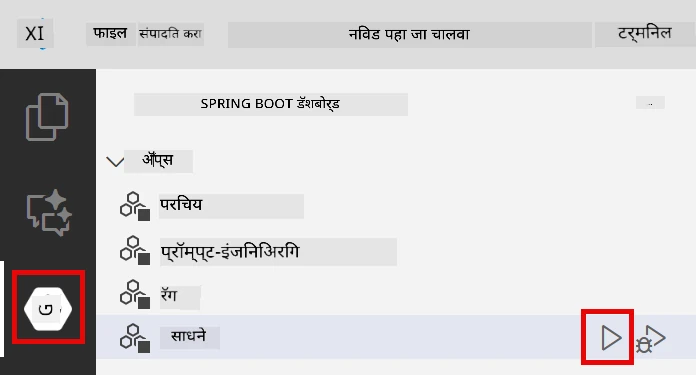
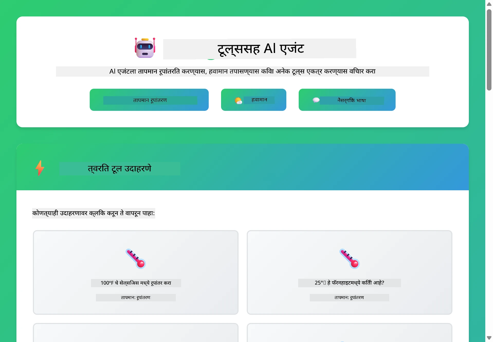
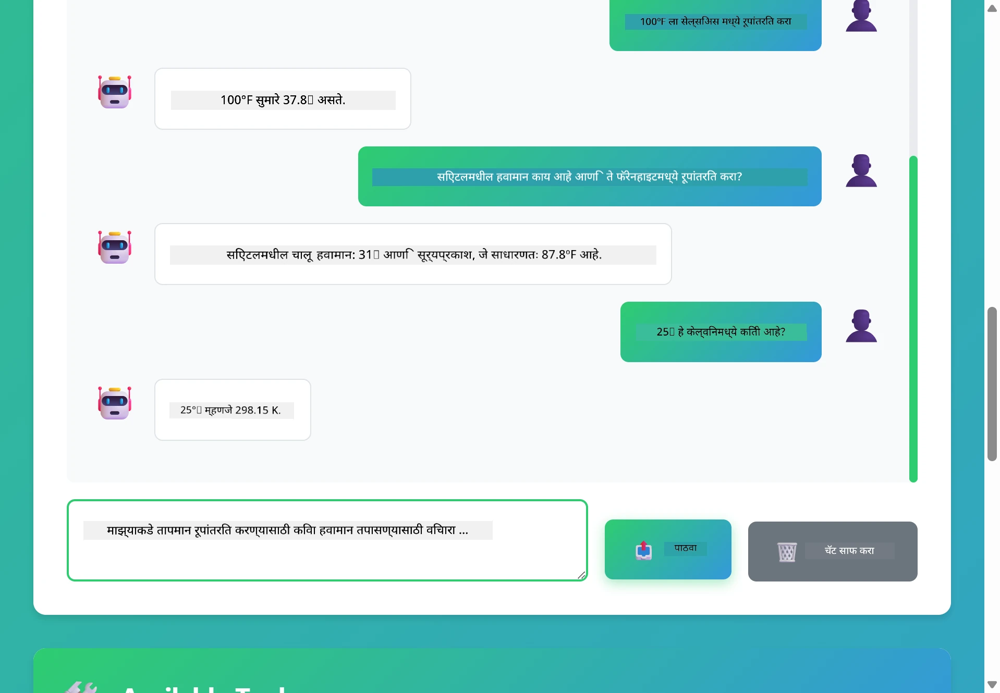

# Module 04: टूलसह AI एजंट्स

## अनुक्रमणिका

- [व्हिडिओ वॉकथ्रू](#व्हिडिओ-वॉकथ्रू)
- [तुम्हाला काय शिकायला मिळेल](#तुम्हाला-काय-शिकायला-मिळेल)
- [पूर्वअटी](#पूर्वअटी)
- [टूलसह AI एजंट्स समजून घेणे](#टूलसह-ai-एजंट्स-समजून-घेणे)
- [टूल कॉल कसे कार्य करते](#टूल-कॉल-कसे-कार्य-करते)
  - [टूल व्याख्या](#टूल-व्याख्या)
  - [निर्णय घेणे](#निर्णय-घेणे)
  - [अंमलबजावणी](#अंमलबजावणी)
  - [प्रतिसाद निर्मिती](#प्रतिसाद-निर्मिती)
  - [आर्किटेक्चर: स्प्रिंग बूट ऑटो-वाईरिंग](#आर्किटेक्चर-स्प्रिंग-बूट-ऑटो-वाईरिंग)
- [टूल चेनिंग](#टूल-चेनिंग)
- [अ‍ॅप्लिकेशन चालवा](#अ‍ॅप्लिकेशन-चालवा)
- [अ‍ॅप्लिकेशन वापरणे](#अनुप्रयोग-वापरणे)
  - [साध्या टूल वापराचा प्रयत्न करा](#सोप्या-उपकरणाचा-वापर-करा)
  - [टूल चेनिंग चाचणी करा](#टूल-चेनिंगची-चाचणी-करा)
  - [संवाद प्रवाह पहा](#संवाद-प्रवाह-पहा)
  - [विभिन्न विनंत्यांशी प्रयोग करा](#विविध-विनंत्यांसह-प्रयोग-करा)
- [महत्वाची संकल्पना](#मुख्य-संकल्पना)
  - [ReAct पॅटर्न (कारण आणि क्रिया)](#react-पॅटर्न-तर्क-आणि-क्रिया)
  - [टूल वर्णने महत्त्वाची](#टूल-वर्णनांचा-महत्त्व)
  - [सत्र व्यवस्थापन](#सत्र-व्यवस्थापन)
  - [त्रुटी हाताळणी](#त्रुटी-हाताळणी)
- [उपलब्ध टूल्स](#उपलब्ध-टूल्स)
- [टूल-आधारित एजंट्स कधी वापरावे](#टूल-आधारित-एजंट्स-वापरण्याची-वेळ)
- [टूल्स विरुद्ध RAG](#टूल्स-विरुद्ध-rag)
- [पुढील टप्पे](#पुढील-पावले)

## व्हिडिओ वॉकथ्रू

हा लाईव्ह सत्र पाहा जो तुम्हाला या मॉड्युलबरोबर सुरुवात कशी करायची ते समजावतो:

<a href="https://www.youtube.com/watch?v=O_J30kZc0rw"></a>

## तुम्हाला काय शिकायला मिळेल

आत्ता पर्यंत, तुम्ही AI सोबत संवाद साधण्याचे, प्रभावीप्रकारे प्रॉम्प्ट कसे तयार करायचे आणि तुमच्या दस्तऐवजांमध्ये उत्तरे आधारलेली कशी ठेवायची हे शिकलात. पण अजून एक मूलभूत मर्यादा आहे: भाषा मॉडेल केवळ मजकूर निर्माण करू शकतात. ते हवामान तपासू शकत नाहीत, गणना करू शकत नाहीत, डेटाबेस क्वेरी करू शकत नाहीत किंवा बाह्य प्रणालींसोबत संवाद साधू शकत नाहीत.

टूल्स हे बदलतात. मॉडेलला फंक्शन्स वापरण्यास परवानगी देऊन, तुम्ही त्याला एक मजकूर जनरेटरपासून एक एजंटमध्ये बदलता जो क्रिया करू शकतो. मॉडेल ठरवते की त्याला कधी टूल पाहिजे आहे, कोणता टूल वापरायचा आहे, आणि कोणते पॅरामीटर्स द्यायचे आहेत. तुमचा कोड फंक्शन चालवतो आणि निकाल परत करतो. मॉडेल हा निकाल त्याच्या प्रतिक्रियेत समाविष्ट करतो.

## पूर्वअटी

- पूर्ण केलेले [Module 01 - Introduction](../01-introduction/README.md) (Azure OpenAI संसाधने लागू केलीली)
- मागील मॉड्युल्स पूर्ण केलेले शिफारस केलेले (हा मॉड्युल [RAG संकल्पना Module 03 मधून](../03-rag/README.md) संदर्भित करतो Tools vs RAG तुलना मध्ये)
- मूळ डिरेक्टरीमध्ये `.env` फाइल असावी ज्यात Azure प्रमाणपत्रे असतील (Module 01 मध्ये `azd up` द्वारे तयार केलेली)

> **टीप:** जर तुम्ही Module 01 पूर्ण केले नसेल, तर प्रथम तिथले तैनाती सूचनांचे पालन करा.

## टूलसह AI एजंट्स समजून घेणे

> **📝 टीप:** या मॉड्युलमध्ये "एजंट्स" या संज्ञेचा अर्थ AI सहाय्यक असा आहे ज्यात टूल-कॉल करण्याची क्षमता आहे. हे वेगळे आहे **Agentic AI** पॅटर्नपासून (स्वयंचलित एजंट्स ज्यात नियोजन, आठवण आणि बहु-चरणीय तर्कशक्ती असते) ज्या आपण [Module 05: MCP](../05-mcp/README.md) मध्ये पाहणार आहोत.

टूलशिवाय, एखादे भाषा मॉडेल केवळ त्याच्या प्रशिक्षण डेटापासून मजकूर निर्माण करू शकते. ज्यावेळी तुम्ही त्याला हवामान विचारता, ते अंदाज बांधावे लागते. टूल दिले की, ते हवामान API कॉल करू शकते, गणना करू शकते, डेटाबेस क्वेरी करू शकते — नंतर त्या वास्तविक निकालांना त्याच्या उत्तरात गुंफते.


*टूलशिवाय मॉडेल केवळ अंदाज लावते — टूलसह ते API कॉल करू शकते, गणना चालवू शकते आणि रिअल-टाइम डेटा परत करू शकते.*

टूलसह AI एजंट एक **ReAct (Reasoning and Acting)** पॅटर्नचा अवलंब करतो. मॉडेल फक्त उत्तर देत नाही — ते विचार करते की त्याला काय आवश्यक आहे, त्या टूलला कॉल करते, निकालाचे निरीक्षण करते आणि मग ठरवते की पुन्हा काही करायचे की अंतिम उत्तर द्यायचे.

1. **तर्क करा** — एजंट वापरकर्त्याच्या प्रश्नाचे विश्लेषण करतो आणि त्याला कोणती माहिती हवी आहे ते ठरवतो
2. **क्रिया करा** — एजंट योग्य टूल निवडतो, योग्य पॅरामीटर्स तयार करतो आणि कॉल करतो
3. **निरीक्षण करा** — एजंट टूलचा आउटपुट प्राप्त करतो आणि निकालाचे मूल्यांकन करतो
4. **पुन्हा करा किंवा प्रतिसाद द्या** — अधिक डेटा आवश्यक असल्यास, एजंट लूपमध्ये परततो; अन्यथा, नैसर्गिक भाषेत उत्तर तयार करतो


*ReAct सायकल — एजंट काय करायचे हे विचार करतो, टूल कॉल करतो, निकाल पाहतो आणि तोपर्यंत लूप करतो जोपर्यंत तो अंतिम उत्तर देऊ शकतो.*

हे सर्व आपोआप होते. तुम्ही टूल्स आणि त्यांचे वर्णन परिभाषित करता. मॉडेल ठरवते की ते कधी आणि कसे वापरायचे.

## टूल कॉल कसे कार्य करते

### टूल व्याख्या

[WeatherTool.java](../../../04-tools/src/main/java/com/example/langchain4j/agents/tools/WeatherTool.java) | [TemperatureTool.java](../../../04-tools/src/main/java/com/example/langchain4j/agents/tools/TemperatureTool.java)

तुम्ही फंक्शन्स स्पष्ट वर्णनांसह आणि पॅरामीटर विशिष्ट करून परिभाषित करता. मॉडेल या वर्णनांना त्याच्या सिस्टम प्रॉम्प्टमध्ये पाहते आणि प्रत्येक टूल काय करते हे समजते.

```java
@Component
public class WeatherTool {
    
    @Tool("Get the current weather for a location")
    public String getCurrentWeather(@P("Location name") String location) {
        // तुमचे हवामान शोधणे लॉजिक
        return "Weather in " + location + ": 22°C, cloudy";
    }
}

@AiService
public interface Assistant {
    String chat(@MemoryId String sessionId, @UserMessage String message);
}

// सहाय्यक स्वयंचलितपणे Spring Boot ने जोडलेले आहे:
// - ChatModel बीन
// - @Component वर्गांमधील सर्व @Tool पद्धती
// - सत्र व्यवस्थापनासाठी ChatMemoryProvider
```

खालील आकृती प्रत्येक अ‍ॅनोटेशनचे विश्लेषण करते आणि दर्शवते की AI कधी टूल कॉल करायचे आहे आणि कोणते आर्ग्युमेंट्स द्यायचे आहेत हे कसे समजते:


*टूल व्याख्येचे रचना — @Tool AI ला सांगते की कधी वापरायचे, @P प्रत्येक पॅरामीटरचे वर्णन करते, आणि @AiService सर्व काही स्टार्टअपवर वायर्स करते.*

> **🤖 [GitHub Copilot](https://github.com/features/copilot) Chat सोबत प्रयत्न करा:** [`WeatherTool.java`](../../../04-tools/src/main/java/com/example/langchain4j/agents/tools/WeatherTool.java) उघडा आणि विचारा:
> - "How would I integrate a real weather API like OpenWeatherMap instead of mock data?"
> - "What makes a good tool description that helps the AI use it correctly?"
> - "How do I handle API errors and rate limits in tool implementations?"

### निर्णय घेणे

जेव्हा वापरकर्ता विचारतो "Seattle मध्ये हवामान काय आहे?", तेव्हा मॉडेल अनियमितपणे टूल निवडत नाही. ते वापरकर्त्याच्या उद्देशाचा प्रत्येक टूलच्या वर्णनांसोबत तुलना करते, संबंधासाठी स्कोअरिंग करते आणि सर्वोत्तम जुळणी निवडते. मग ते योग्य पॅरामीटर्ससह संरचित फंक्शन कॉल तयार करते — या प्रकरणात, `location` ला `"Seattle"` सेट करते.

जर कोणताही टूल वापरकर्त्याच्या विनंतीशी जुळत नसेल, तर मॉडेल आपले ज्ञान वापरून उत्तर देते. जर अनेक टूल जुळले, तर ते सर्वात विशिष्ट निवडते.


*मॉडेल प्रत्येक उपलब्ध टूल वापरकर्त्याच्या उद्देशासोबत तुलना करून सर्वोत्तम निवड करते — म्हणून स्पष्ट, विशिष्ट टूल वर्णने लिहिणे महत्त्वाचे आहे.*

### अंमलबजावणी

[AgentService.java](../../../04-tools/src/main/java/com/example/langchain4j/agents/service/AgentService.java)

स्प्रिंग बूट डिक्लेरेटिव्ह `@AiService` इंटरफेस सर्व नोंदणीकृत टूलसह ऑटो-वायर करते, आणि LangChain4j टूल कॉल्स आपोआप चालवतो. दृश्यामागे, संपूर्ण टूल कॉल सहा टप्प्यांतून प्रवाहित होतो — वापरकर्त्याच्या नैसर्गिक भाषेच्या प्रश्नापासून नैसर्गिक भाषेत उत्तर मिळेपर्यंत:


*एकूण प्रवास — वापरकर्ता प्रश्न विचारतो, मॉडेल टूल निवडते, LangChain4j ते चालवते, आणि मॉडेल निकाल नैसर्गिक प्रतिक्रियेत गुंफते.*

दृश्यामागे, `AiServices` कोणत्याही टूलसाठी समान टूल-कॉल लूप चालवते — येथे एक साध्या `Calculator` सह दाखवले आहे. खाली दिलेला सिक्वेन्स डाग्राम अचूक काय घडते ते दर्शवतो:


*टूल-कॉलिंग लूप — `AiServices` तुमचा मेसेज आणि टूल स्कीमास LLM कडे पाठवते, LLM `add(42, 58)` सारखा फंक्शन कॉल परत देते, LangChain4j `Calculator` मेथड स्थानिकरित्या चालवते, आणि निकाल परत अंतिम उत्तरासाठी पुरवते.*

> **🤖 [GitHub Copilot](https://github.com/features/copilot) Chat सोबत प्रयत्न करा:** [`AgentService.java`](../../../04-tools/src/main/java/com/example/langchain4j/agents/service/AgentService.java) उघडा आणि विचारा:
> - "How does the ReAct pattern work and why is it effective for AI agents?"
> - "How does the agent decide which tool to use and in what order?"
> - "What happens if a tool execution fails - how should I handle errors robustly?"

### प्रतिसाद निर्मिती

मॉडेल हवामान माहिती प्राप्त करते आणि वापरकर्त्यासाठी नैसर्गिक भाषेत प्रतिसाद स्वरूपात तयार करते.

### आर्किटेक्चर: स्प्रिंग बूट ऑटो-वाईरिंग

हा मॉड्युल LangChain4j चा स्प्रिंग बूट एकत्रीकरण वापरतो डिक्लेरेटिव्ह `@AiService` इंटरफेसेससह. स्टार्टअपवर स्प्रिंग बूट प्रत्येक `@Component` जो `@Tool` मेथड्स असलेला असतो, तुमचा `ChatModel` बीन, आणि `ChatMemoryProvider` शोधून सर्व एकत्र एक `Assistant` इंटरफेस मध्ये वायर्स करतो, कोणताही कोड न लिहिता.


*@AiService इंटरफेस ChatModel, टूल कंपोनेंट्स, आणि मेमरी प्रोव्हायडर एकत्र करतो — स्प्रिंग बूट सर्व वायरींग आपोआप हाताळते.*

आहे पूर्ण विनंती जीवनचक्र सिक्वेन्स डाग्राम मध्ये — HTTP विनंती कंट्रोलर, सर्व्हिस, आणि ऑटो-वायर्ड प्रॉक्सीमधून टूल अंमलबजावणीपर्यंत आणि परत:


*पूर्ण स्प्रिंग बूट विनंती जीवनचक्र — HTTP विनंती कंट्रोलर आणि सर्व्हिस मधून ऑटो-वायर्ड Assistant प्रॉक्सीपर्यंत जाते, जो LLM आणि टूल कॉल्स आपोआप समन्वयित करतो.*

या दृष्टिकोनाचे मुख्य फायदे:

- **स्प्रिंग बूट ऑटो-वायरींग** — ChatModel आणि टूल्स आपोआप इंजेक्ट होतात
- **@MemoryId पॅटर्न** — ऑटोमॅटिक सत्र-आधारित मेमरी व्यवस्थापन
- **सिंगल इन्स्टन्स** — Assistant एकदाच तयार होत राहतो आणि चांगल्या प्रदर्शनासाठी पुनर्वापर होतो
- **टाइप-सेफ अंमलबजावणी** — Java मेथड्स थेट टाइप रूपांतरणासह कॉल केल्या जातात
- **मल्टि-टर्न ऑर्केस्ट्रेशन** — टूल चेनिंग आपोआप हाताळते
- **झिरो बॉयलरप्लेट** — मॅन्युअल `AiServices.builder()` कॉल्स किंवा मेमरी HashMap नाही

अल्टरनेटिव्ह पद्धती (मॅन्युअल `AiServices.builder()`) मध्ये अधिक कोड लागतो आणि स्प्रिंग बूट एकत्रीकरणाचे फायदे मिळत नाहीत.

## टूल चेनिंग

**टूल चेनिंग** — टूल-आधारित एजंट्सची खरी ताकद तेव्हा दिसते जेव्हा एकाच प्रश्नाला अनेक टूल्सची गरज असते. विचार करा "Seattle मध्ये हवामान Fahrenheit मध्ये काय आहे?" आणि एजंट आपोआप दोन टूल्सला चेन करतो: प्रथम ते `getCurrentWeather` कॉल करते जे Celsius मध्ये तापमान देते, नंतर तो तो मूल्य `celsiusToFahrenheit` मध्ये रुपांतरासाठी पाठवते — हा सगळा एकाच संवादात.


*कार्यक्षम टूल चेनिंग — एजंट प्रथम getCurrentWeather कॉल करतो, मग Celsius निकाल celsiusToFahrenheit मध्ये पाठवतो, आणि एकत्रित उत्तर देते.*

**सुसंवेदनशील अपयश** — तुमची विनंती अशी करा की ती मॉक डेटामध्ये नसलेल्या शहराची हवामान मागते. टूल त्रुटी संदेश परत करते, आणि AI सांगते की ती मदत करू शकत नाही, संपूर्ण अ‍ॅप्लिकेशन क्रॅश होत नाही. टूल सुरक्षितरित्या अपयशी ठरतात. खालील आकृती दोन दृष्टिकोन दाखवते — योग्य त्रुटी हाताळणीसह एजंट अपवाद पकडतो आणि सहाय्यक स्पष्टीकरण देतो, तर त्रुटीशिवाय संपूर्ण अ‍ॅप्लिकेशन क्रॅश होते:


*टूल अपयशी ठरल्यास, एजंट त्रुटी पकडतो आणि क्रॅश न होता सहाय्यक स्पष्टीकरण देतो.*

हे सर्व एका संवादात होते. एजंट स्वायत्तपणे अनेक टूल कॉल्स समन्वयित करतो.

## अ‍ॅप्लिकेशन चालवा

**तैनात केले आहे याची खात्री करा:**

मूल डिरेक्टरीमध्ये `.env` फाइल आहे ज्यात Azure क्रेडेन्शियल्स आहेत (Module 01 मध्ये तयार केलेली). मॉड्युल डिरेक्टरी (`04-tools/`) मधून खालीलपैकी चालवा:

**Bash:**
```bash
cat ../.env  # AZURE_OPENAI_ENDPOINT, API_KEY, DEPLOYMENT दाखवले पाहिजेत
```

**PowerShell:**
```powershell
Get-Content ..\.env  # AZURE_OPENAI_ENDPOINT, API_KEY, DEPLOYMENT दाखवायला हवेत
```

**अ‍ॅप्लिकेशन सुरु करा:**

> **टीप:** जर तुम्ही मूळ डिरेक्टरीतून (`./start-all.sh`) सर्व अ‍ॅप्लिकेशन्स आधीच सुरू केले असतील (Module 01 मध्ये वर्णन केलेले), तर हा मॉड्युल आधीच पोर्ट 8084 वर चालू आहे. तुम्ही खालील स्टार्ट कमांड स्किप करू शकता आणि थेट http://localhost:8084 वर प्रवेश करू शकता.

**पर्याय 1: स्प्रिंग बूट डॅशबोर्ड वापरणे (VS कोड वापरकर्त्यांसाठी शिफारस)**

डेव्ह कंटेनर मध्ये स्प्रिंग बूट डॅशबोर्ड विस्तार समाविष्ट आहे, जो सर्व स्प्रिंग बूट अ‍ॅप्लिकेशन्सचा व्हिज्युअल इंटरफेस पुरवतो. तुम्ही ते VS कोड च्या डाव्या बाजूला असलेल्या अ‍ॅक्टिव्हिटी बार मध्ये शोधू शकता (स्प्रिंग बूट चिह्नाचा शोध घ्या).

स्प्रिंग बूट डॅशबोर्ड मधून, तुम्ही:
- वर्कस्पेसमधील सर्व उपलब्ध स्प्रिंग बूट अ‍ॅप्लिकेशन्स पाहू शकता
- एका क्लिकमध्ये अ‍ॅप्लिकेशन्स सुरू / थांबवू शकता
- अ‍ॅप्लिकेशन लॉग्स वास्तविक वेळेत पाहू शकता
- अ‍ॅप्लिकेशन स्थितीवर नजर ठेवू शकता

फक्त "tools" समोर असलेला प्ले बटण क्लिक करा हा मॉड्युल सुरू करण्यासाठी, किंवा सर्व मॉड्युल्स एकत्र सुरू करा.

स्प्रिंग बूट डॅशबोर्ड VS कोड मध्ये असे दिसतो:


*VS कोडमधील Spring Boot डॅशबोर्ड — सर्व मॉड्यूल एका ठिकाणाहून सुरु करा, थांबवा आणि निरीक्षण करा*

**पर्याय 2: shell स्क्रिप्ट्स वापरणे**

सर्व वेब अनुप्रयोग सुरु करा (मॉड्यूल 01-04):

**Bash:**
```bash
cd ..  # मूळ निर्देशिकेतून
./start-all.sh
```

**PowerShell:**
```powershell
cd ..  # रूट निर्देशिका पासून
.\start-all.ps1
```

किंवा फक्त हा मॉड्यूल सुरु करा:

**Bash:**
```bash
cd 04-tools
./start.sh
```

**PowerShell:**
```powershell
cd 04-tools
.\start.ps1
```

दोन्ही स्क्रिप्ट्स आपोआप मूळ `.env` फाइलमधील पर्यावरण चल (environment variables) लोड करतात आणि JAR फाइल्स अस्तित्वात नसेल तर तयार करतात.

> **टीप:** तुम्हाला सर्व मॉड्यूल्स मॅन्युअली तयार करायचे असतील:
>
> **Bash:**
> ```bash
> cd ..  # Go to root directory
> mvn clean package -DskipTests
> ```
>
> **PowerShell:**
> ```powershell
> cd ..  # Go to root directory
> mvn clean package -DskipTests
> ```

http://localhost:8084 तुमच्या ब्राऊजरमध्ये उघडा.

**थांबविण्यासाठी:**

**Bash:**
```bash
./stop.sh  # हा मॉड्यूल फक्त
# किंवा
cd .. && ./stop-all.sh  # सर्व मॉड्यूल
```

**PowerShell:**
```powershell
.\stop.ps1  # हे फक्त मॉड्यूल
# किंवा
cd ..; .\stop-all.ps1  # सर्व मॉड्यूल्स
```

## अनुप्रयोग वापरणे

अॅप्लिकेशन वेब इंटरफेस प्रदान करते जिथे तुम्ही हवामान आणि तापमान रूपांतरण उपकरणांपर्यंत प्रवेश असलेल्या AI एजंटशी संवाद साधू शकता. इंटरफेस असे दिसते — त्यात त्वरीत सुरूवातीचे उदाहरणे आणि विनंत्या पाठवण्यासाठी चॅट पॅनेल आहे:

<a href="images/tools-homepage.png"></a>

*AI एजंट टूल्स इंटरफेस - त्वरीत उदाहरणे आणि टूल्सशी संवादासाठी चॅट इंटरफेस*

### सोप्या उपकरणाचा वापर करा

सरळ विनंतीने प्रारंभ करा: "100 डिग्री फॅरेनहाइट ते सेल्सिअस मध्ये रूपांतरित करा". एजंट ओळखतो की तापमान रूपांतरण टूलची आवश्यकता आहे, योग्य पारामीटरांसह कॉल करतो आणि परिणाम परत करतो. हे नैसर्गिक कसे वाटते लक्षात घ्या - तुम्ही कोणते टूल वापरायचे किंवा कसे कॉल करायचे ते निर्दिष्ट केले नव्हते.

### टूल चेनिंगची चाचणी करा

आता काही अधिक गुंतागुंतीचे प्रयत्न करा: "सिएटलमधील हवामान काय आहे आणि ते फॅरेनहाइटमध्ये रूपांतरित करा?" एजंटने हे टप्प्याटप्प्याने कसे हाताळले ते पाहा. प्रथम हवामान मिळवतो (जो सेल्सिअसमध्ये परत करतो), नंतर ते फॅरेनहाइटमध्ये रूपांतरित करण्याची गरज ओळखतो, रूपांतरण टूल कॉल करतो आणि दोन्ही निकाल एकत्र करून उत्तर देतो.

### संवाद प्रवाह पहा

चॅट इंटरफेस संभाषण इतिहास सांभाळतो, जेणेकरून तुम्हाला बहु-फेरींच्या संवादाचा अनुभव घेता येतो. तुम्ही मागील सर्व प्रश्न आणि उत्तरे पाहू शकता, जे संभाषणाचा मागोवा ठेवणे आणि एजंट कसा संदर्भ तयार करतो हे समजण्यास मदत करते.

<a href="images/tools-conversation-demo.png"></a>

*सोप्या रूपांतरणांपासून हवामान तपासणीपर्यंत आणि टूल चेनिंगपर्यंत बहु-फेरींचे संभाषण*

### विविध विनंत्यांसह प्रयोग करा

विविध संयोजने प्रयत्न करा:
- हवामान तपासणी: "टोकियोमधील हवामान काय आहे?"
- तापमान रूपांतरण: "25°C काय केल्विनमध्ये आहे?"
- एकत्रित प्रश्न: "पॅरिसमध्ये हवामान तपासा आणि ते 20°C पेक्षा जास्त आहे का ते सांगा"

एजंट नैसर्गिक भाषा कशी समजतो आणि योग्य टूल कॉल्सशी नकाशा कसा तयार करतो हे लक्षात घ्या.

## मुख्य संकल्पना

### ReAct पॅटर्न (तर्क आणि क्रिया)

एजंट तर्क (काय करावे हे ठरवणे) आणि क्रिया (टूल्स वापरणे) यामध्ये परस्पर बदलतो. हा पॅटर्न स्वयंपूर्ण समस्या सोडवण्यास मदत करतो, केवळ सूचना पाळण्यापेक्षा.

### टूल वर्णनांचा महत्त्व

तुमच्या टूलचे वर्णन किती स्पष्ट आहे हे थेट एजंटच्या टूल वापरावर परिणाम करते. स्पष्ट आणि ठराविक वर्णने मॉडेलला कधी आणि कसे टूल कॉल करायचे समजावतात.

### सत्र व्यवस्थापन

`@MemoryId` अ‍ॅनोटेशन स्वयंचलित सत्र-आधारित मेमरी व्यवस्थापन सक्षम करते. प्रत्येक सत्र ID ला `ChatMemory` उदाहरण मिळते जे `ChatMemoryProvider` बीन्सने व्यवस्थापित केली जाते, त्यामुळे अनेक वापरकर्ते एजंटशी एकाच वेळी संवाद साधू शकतात, परस्पर संभाषण मिसळत नाही. खालील आकृती दाखवते की अनेक वापरकर्ते त्यांच्या सत्र ID च्या आधारे वेगळ्या मेमरी स्टोअरकडे कसे निर्देशित होतात:


*प्रत्येक सत्र ID वेगळ्या संभाषण इतिहासाशी नकाशित होतो — वापरकर्ते एकमेकांचे संदेश पाहू शकत नाहीत.*

### त्रुटी हाताळणी

टूल्स अपयशी ठरू शकतात — API टाइमआउट होते, पारामीटर चुकीचे असू शकतात, बाह्य सेवा बंद होतात. उत्पादन एजंट्सकडे त्रुटी हाताळणी असावी जेणेकरून मॉडेल समस्या समजावून सांगू शकेल किंवा पर्यायी उपाय करू शकेल, पूर्ण अनुप्रयोग क्रॅश न होऊ देत. टूलने अपवाद फेकल्यास, LangChain4j तो पकडतो आणि त्रुटी संदेश मॉडेलपर्यंत पाठवतो जे निसर्ग भाषेत समस्या समजावते.

## उपलब्ध टूल्स

खालील आकृती तुम्ही तयार करू शकणाऱ्या टूल्सच्या विस्तृत परिसंस्थेचा दाखला देते. हा मॉड्यूल हवामान आणि तापमान टूल्स दाखवतो, पण तोच `@Tool` पॅटर्न कोणत्याही Java पद्धतीसाठी वापरू शकतो — डेटाबेस क्वेरीज ते पेमेंट प्रक्रिया पर्यंत.


*`@Tool` अ‍ॅनोटेशन असलेली कोणतीही Java पद्धत AI साठी उपलब्ध होते — हा पॅटर्न डेटाबेस, API, ईमेल, फाइल ऑपरेशन्स आणि बरेच काही विस्तारतो.*

## टूल-आधारित एजंट्स वापरण्याची वेळ

प्रत्येक विनंतीसाठी टूल्स आवश्यक नाहीत. निर्णय यावर अवलंबून आहे की AI ला बाह्य प्रणालींसोबत संवाद करायचा आहे की नाही किंवा ते स्वतःच्या ज्ञानावरून उत्तर देऊ शकतो. खालील मार्गदर्शक सादर करतो की टूल्स कधी फायदेशीर आहेत आणि कधी गरजेचे नाहीत:


*त्वरीत निर्णय घेण्यासाठी मार्गदर्शक — टूल्स वास्तविक वेळ डेटा, गणना आणि क्रिया साठी; सामान्य ज्ञान आणि सर्जनशील कामांसाठी आवश्यक नाहीत.*

## टूल्स विरुद्ध RAG

मॉड्यूल 03 आणि 04 दोन्ही AI काय करू शकतो हे वाढवतात, पण मूलत: वेगळ्या मार्गांनी. RAG मॉडेलला **ज्ञान** देते, दस्तऐवज पुन्हा मिळवून. टूल्स मॉडेलला **क्रिया** घेण्याची क्षमता देतात, फंक्शन्स कॉल करून. खालील आकृती दोन्ही पद्धतींचे एकमेकांच्या समोर तुलनात्मक दाखले देते — प्रत्येक कार्यप्रवाह कसे चालतो आणि दोघांतील फरक कसे आहेत:


*RAG स्थिर दस्तऐवजांमधून माहिती मिळवते — टूल्स क्रिया करतात आणि गतिशील, वास्तविक-वेळ डेटा मिळवतात. अनेक उत्पादन प्रणाली दोन्ही पद्धती एकत्र वापरतात.*

प्रत्यक्षात, अनेक उत्पादन प्रणाली दोन्ही पद्धती वापरतात: RAG तुमच्या दस्तऐवजातून उत्तरांचे आधार मिळवण्यासाठी, आणि टूल्स लाइव्ह डेटा मिळवण्यासाठी किंवा ऑपरेशन्स करण्यासाठी.

## पुढील पावले

**पुढील मॉड्यूल:** [05-mcp - Model Context Protocol (MCP)](../05-mcp/README.md)

---

**नेव्हिगेशन:** [← मागील: मॉड्यूल 03 - RAG](../03-rag/README.md) | [मुख्य पानावर परत जा](../README.md) | [पुढील: मॉड्यूल 05 - MCP →](../05-mcp/README.md)

---

<!-- CO-OP TRANSLATOR DISCLAIMER START -->
**अस्वीकरण**:
हा दस्तऐवज AI भाषांतर सेवा [Co-op Translator](https://github.com/Azure/co-op-translator) चा वापर करून अनुवादित केला आहे. जरी आम्ही अचूकतेसाठी प्रयत्न करतो, तरी कृपया लक्षात घ्या की स्वयंचलित भाषांतरांमध्ये त्रुटी किंवा अचूकतेची कमतरता असू शकते. मूळ दस्तऐवज त्याच्या मूळ भाषेत अधिकृत स्रोत मानला पाहिजे. महत्त्वाची माहिती असल्यास, व्यावसायिक मानवी भाषांतराची शिफारस केली जाते. या भाषांतराच्या वापरामुळे उद्भवणाऱ्या कोणत्याही गैरसमज किंवा चुकीच्या अर्थलावणीसाठी आम्ही जबाबदार नाही.
<!-- CO-OP TRANSLATOR DISCLAIMER END -->