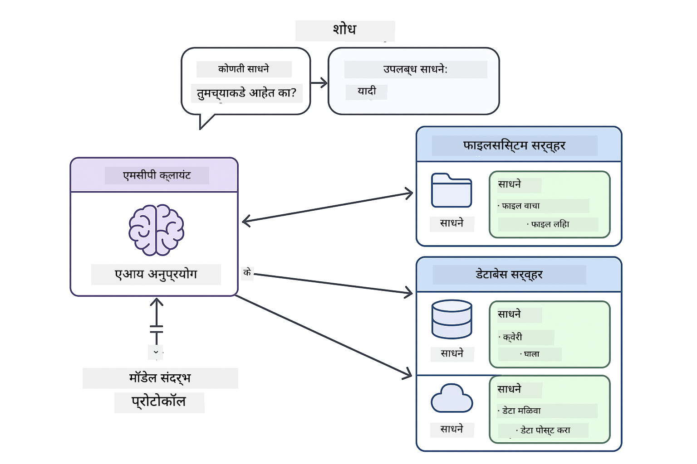
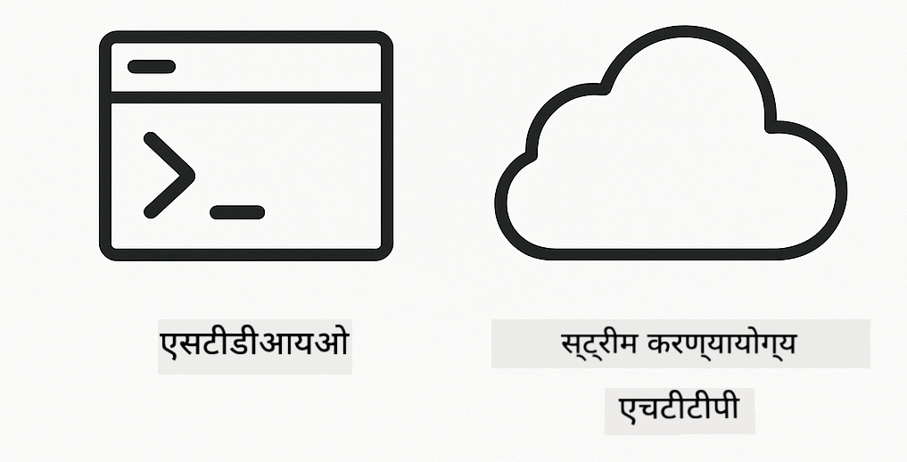

<!--
CO_OP_TRANSLATOR_METADATA:
{
  "original_hash": "c25ec1f10ef156c53e190cdf8b0711ab",
  "translation_date": "2025-12-13T17:46:06+00:00",
  "source_file": "05-mcp/README.md",
  "language_code": "mr"
}
-->
# Module 05: मॉडेल संदर्भ प्रोटोकॉल (MCP)

## अनुक्रमणिका

- [तुम्ही काय शिकाल](../../../05-mcp)
- [MCP समजून घेणे](../../../05-mcp)
- [MCP कसे कार्य करते](../../../05-mcp)
  - [सर्व्हर-क्लायंट आर्किटेक्चर](../../../05-mcp)
  - [टूल शोध](../../../05-mcp)
  - [ट्रान्सपोर्ट यंत्रणा](../../../05-mcp)
- [पूर्वअट](../../../05-mcp)
- [हा मॉड्यूल काय कव्हर करतो](../../../05-mcp)
- [जलद प्रारंभ](../../../05-mcp)
  - [उदाहरण 1: रिमोट कॅल्क्युलेटर (स्ट्रीम करण्यायोग्य HTTP)](../../../05-mcp)
  - [उदाहरण 2: फाइल ऑपरेशन्स (Stdio)](../../../05-mcp)
  - [उदाहरण 3: Git विश्लेषण (Docker)](../../../05-mcp)
- [महत्त्वाच्या संकल्पना](../../../05-mcp)
  - [ट्रान्सपोर्ट निवड](../../../05-mcp)
  - [टूल शोध](../../../05-mcp)
  - [सेशन व्यवस्थापन](../../../05-mcp)
  - [क्रॉस-प्लॅटफॉर्म विचार](../../../05-mcp)
- [MCP कधी वापरावे](../../../05-mcp)
- [MCP पर्यावरण](../../../05-mcp)
- [अभिनंदन!](../../../05-mcp)
  - [पुढे काय?](../../../05-mcp)
- [समस्या निवारण](../../../05-mcp)

## तुम्ही काय शिकाल

तुम्ही संवादात्मक AI तयार केला आहे, प्रॉम्प्ट्समध्ये पारंगत झाला आहात, दस्तऐवजांमध्ये उत्तरांना आधार दिला आहे, आणि टूल्ससह एजंट्स तयार केले आहेत. पण ते सर्व टूल्स तुमच्या विशिष्ट अनुप्रयोगासाठी सानुकूल तयार केलेले होते. जर तुम्ही तुमच्या AI ला अशा प्रमाणित टूल्सच्या पर्यावरणाचा प्रवेश देऊ शकत असाल जे कोणतीही व्यक्ती तयार करू शकते आणि शेअर करू शकते तर?

मॉडेल संदर्भ प्रोटोकॉल (MCP) नेमकं तेच प्रदान करतो - AI अनुप्रयोगांना बाह्य टूल्स शोधण्यासाठी आणि वापरण्यासाठी एक प्रमाणित मार्ग. प्रत्येक डेटा स्रोत किंवा सेवेकरिता सानुकूल एकत्रीकरण लिहिण्याऐवजी, तुम्ही MCP सर्व्हर्सशी कनेक्ट करता जे त्यांच्या क्षमता सुसंगत स्वरूपात उघड करतात. तुमचा AI एजंट नंतर आपोआप हे टूल्स शोधू आणि वापरू शकतो.


*MCP आधी: गुंतागुंतीचे पॉइंट-टू-पॉइंट एकत्रीकरण. MCP नंतर: एक प्रोटोकॉल, अनंत शक्यता.*

## MCP समजून घेणे

MCP AI विकासातील एक मूलभूत समस्या सोडवतो: प्रत्येक एकत्रीकरण सानुकूल असते. GitHub वापरायचंय? सानुकूल कोड. फाइल्स वाचायच्या आहेत? सानुकूल कोड. डेटाबेस क्वेरी करायची आहे? सानुकूल कोड. आणि हे एकत्रीकरण इतर AI अनुप्रयोगांसोबत काम करत नाहीत.

MCP हे प्रमाणित करतो. एक MCP सर्व्हर टूल्स स्पष्ट वर्णनांसह आणि स्कीमासह उघड करतो. कोणताही MCP क्लायंट कनेक्ट होऊ शकतो, उपलब्ध टूल्स शोधू शकतो, आणि त्यांचा वापर करू शकतो. एकदा तयार करा, सर्वत्र वापरा.



*मॉडेल संदर्भ प्रोटोकॉल आर्किटेक्चर - प्रमाणित टूल शोध आणि अंमलबजावणी*

## MCP कसे कार्य करते

**सर्व्हर-क्लायंट आर्किटेक्चर**

MCP क्लायंट-सर्व्हर मॉडेल वापरतो. सर्व्हर्स टूल्स पुरवतात - फाइल्स वाचणे, डेटाबेस क्वेरी करणे, API कॉल करणे. क्लायंट्स (तुमचा AI अनुप्रयोग) सर्व्हर्सशी कनेक्ट होतात आणि त्यांचे टूल्स वापरतात.

**टूल शोध**

जेव्हा तुमचा क्लायंट MCP सर्व्हरशी कनेक्ट होतो, तेव्हा तो विचारतो "तुमच्याकडे कोणती टूल्स आहेत?" सर्व्हर उपलब्ध टूल्सची यादी पाठवतो, प्रत्येक टूलचे वर्णन आणि पॅरामीटर स्कीमा सह. तुमचा AI एजंट नंतर वापरकर्त्याच्या विनंतीनुसार कोणती टूल्स वापरायची ते ठरवू शकतो.

**ट्रान्सपोर्ट यंत्रणा**

MCP दोन ट्रान्सपोर्ट यंत्रणा परिभाषित करतो: रिमोट सर्व्हर्ससाठी HTTP, स्थानिक प्रक्रियांसाठी Stdio (Docker कंटेनर्ससह):



*MCP ट्रान्सपोर्ट यंत्रणा: रिमोट सर्व्हर्ससाठी HTTP, स्थानिक प्रक्रियांसाठी Stdio (Docker कंटेनर्ससह)*

**स्ट्रीम करण्यायोग्य HTTP** - [StreamableHttpDemo.java](../../../05-mcp/src/main/java/com/example/langchain4j/mcp/StreamableHttpDemo.java)

रिमोट सर्व्हर्ससाठी. तुमचा अनुप्रयोग नेटवर्कवर कुठेतरी चालणाऱ्या सर्व्हरला HTTP विनंत्या करतो. रिअल-टाइम संवादासाठी Server-Sent Events वापरतो.

```java
McpTransport httpTransport = new StreamableHttpMcpTransport.Builder()
    .url("http://localhost:3001/mcp")
    .timeout(Duration.ofSeconds(60))
    .logRequests(true)
    .logResponses(true)
    .build();
```

> **🤖 [GitHub Copilot](https://github.com/features/copilot) चॅटसह प्रयत्न करा:** [`StreamableHttpDemo.java`](../../../05-mcp/src/main/java/com/example/langchain4j/mcp/StreamableHttpDemo.java) उघडा आणि विचारा:
> - "MCP थेट टूल एकत्रीकरणापेक्षा कसे वेगळे आहे जसे Module 04 मध्ये आहे?"
> - "अ‍ॅप्लिकेशन्समध्ये टूल शेअरिंगसाठी MCP वापरण्याचे फायदे काय आहेत?"
> - "MCP सर्व्हर्सशी कनेक्शन फेल्युअर किंवा टाइमआउट कसे हाताळायचे?"

**Stdio** - [StdioTransportDemo.java](../../../05-mcp/src/main/java/com/example/langchain4j/mcp/StdioTransportDemo.java)

स्थानिक प्रक्रियांसाठी. तुमचा अनुप्रयोग एक सबप्रोसेस म्हणून सर्व्हर तयार करतो आणि स्टँडर्ड इनपुट/आउटपुटद्वारे संवाद साधतो. फाइलसिस्टम प्रवेश किंवा कमांड-लाइन टूल्ससाठी उपयुक्त.

```java
McpTransport stdioTransport = new StdioMcpTransport.Builder()
    .command(List.of(
        npmCmd, "exec",
        "@modelcontextprotocol/server-filesystem@0.6.2",
        resourcesDir
    ))
    .logEvents(false)
    .build();
```

> **🤖 [GitHub Copilot](https://github.com/features/copilot) चॅटसह प्रयत्न करा:** [`StdioTransportDemo.java`](../../../05-mcp/src/main/java/com/example/langchain4j/mcp/StdioTransportDemo.java) उघडा आणि विचारा:
> - "Stdio ट्रान्सपोर्ट कसे कार्य करते आणि HTTP पेक्षा कधी वापरावे?"
> - "LangChain4j कसे MCP सर्व्हर प्रक्रियांच्या जीवनचक्राचे व्यवस्थापन करते?"
> - "AI ला फाइल सिस्टमचा प्रवेश देण्याचे सुरक्षा परिणाम काय आहेत?"

**Docker (Stdio वापरतो)** - [GitRepositoryAnalyzer.java](../../../05-mcp/src/main/java/com/example/langchain4j/mcp/GitRepositoryAnalyzer.java)

कंटेनराइज्ड सेवांसाठी. `docker run` द्वारे Docker कंटेनरशी संवाद साधण्यासाठी stdio ट्रान्सपोर्ट वापरतो. जटिल अवलंबित्वांसाठी किंवा वेगळ्या वातावरणांसाठी चांगले.

```java
McpTransport dockerTransport = new StdioMcpTransport.Builder()
    .command(List.of(
        "docker", "run",
        "-e", "GITHUB_PERSONAL_ACCESS_TOKEN=" + System.getenv("GITHUB_TOKEN"),
        "-v", volumeMapping,
        "-i", "mcp/git"
    ))
    .logEvents(true)
    .build();
```

> **🤖 [GitHub Copilot](https://github.com/features/copilot) चॅटसह प्रयत्न करा:** [`GitRepositoryAnalyzer.java`](../../../05-mcp/src/main/java/com/example/langchain4j/mcp/GitRepositoryAnalyzer.java) उघडा आणि विचारा:
> - "Docker ट्रान्सपोर्ट MCP सर्व्हर्सना कसे वेगळे करते आणि फायदे काय आहेत?"
> - "होस्ट आणि MCP कंटेनर्समधील डेटा शेअर करण्यासाठी व्हॉल्यूम माउंट्स कसे कॉन्फिगर करायचे?"
> - "उत्पादनात Docker-आधारित MCP सर्व्हर जीवनचक्र व्यवस्थापनासाठी सर्वोत्तम पद्धती काय आहेत?"

## उदाहरणे चालविणे

### पूर्वअट

- Java 21+, Maven 3.9+
- Node.js 16+ आणि npm (MCP सर्व्हर्ससाठी)
- **Docker Desktop** - उदाहरण 3 साठी **चालू असणे आवश्यक आहे** (फक्त इन्स्टॉल केलेले नाही)
- GitHub वैयक्तिक प्रवेश टोकन `.env` फाईलमध्ये कॉन्फिगर केलेले (Module 00 मधून)

> **टीप:** जर तुम्ही तुमचा GitHub टोकन अजून सेट केला नसेल, तर [Module 00 - Quick Start](../00-quick-start/README.md) पहा.

> **⚠️ Docker वापरकर्ते:** उदाहरण 3 चालविण्यापूर्वी `docker ps` वापरून Docker Desktop चालू आहे का ते तपासा. कनेक्शन त्रुटी दिसल्यास, Docker Desktop सुरू करा आणि सुमारे 30 सेकंद प्रतीक्षा करा.

## जलद प्रारंभ

**VS Code वापरून:** एक्सप्लोररमध्ये कोणत्याही डेमो फाईलवर उजवे क्लिक करा आणि **"Run Java"** निवडा, किंवा रन आणि डिबग पॅनेलमधील लॉन्च कॉन्फिगरेशन वापरा (तुम्ही आधी `.env` फाईलमध्ये टोकन जोडलेले असावे).

**Maven वापरून:** पर्यायीपणे, खालील उदाहरणांसह कमांड लाइनवरून चालवा.

**⚠️ महत्त्वाचे:** काही उदाहरणांसाठी पूर्वअट आवश्यक आहे (जसे MCP सर्व्हर सुरू करणे किंवा Docker इमेजेस तयार करणे). प्रत्येक उदाहरणाच्या गरजा तपासा.

### उदाहरण 1: रिमोट कॅल्क्युलेटर (स्ट्रीम करण्यायोग्य HTTP)

हे नेटवर्क-आधारित टूल एकत्रीकरण दाखवते.

**⚠️ पूर्वअट:** तुम्हाला प्रथम MCP सर्व्हर सुरू करावा लागेल (खाली टर्मिनल 1 पहा).

**टर्मिनल 1 - MCP सर्व्हर सुरू करा:**

**Bash:**
```bash
git clone https://github.com/modelcontextprotocol/servers.git
cd servers/src/everything
npm install
node dist/streamableHttp.js
```

**PowerShell:**
```powershell
git clone https://github.com/modelcontextprotocol/servers.git
cd servers/src/everything
npm install
node dist/streamableHttp.js
```

**टर्मिनल 2 - उदाहरण चालवा:**

**VS Code वापरून:** `StreamableHttpDemo.java` वर उजवे क्लिक करा आणि **"Run Java"** निवडा.

**Maven वापरून:**

**Bash:**
```bash
export GITHUB_TOKEN=your_token_here
cd 05-mcp
mvn compile exec:java -Dexec.mainClass=com.example.langchain4j.mcp.StreamableHttpDemo
```

**PowerShell:**
```powershell
$env:GITHUB_TOKEN=your_token_here
cd 05-mcp
mvn --% compile exec:java -Dexec.mainClass=com.example.langchain4j.mcp.StreamableHttpDemo
```

एजंट उपलब्ध टूल्स शोधताना पाहा, नंतर कॅल्क्युलेटर वापरून बेरीज करा.

### उदाहरण 2: फाइल ऑपरेशन्स (Stdio)

हे स्थानिक सबप्रोसेस-आधारित टूल्स दाखवते.

**✅ कोणतीही पूर्वअट नाही** - MCP सर्व्हर आपोआप तयार होतो.

**VS Code वापरून:** `StdioTransportDemo.java` वर उजवे क्लिक करा आणि **"Run Java"** निवडा.

**Maven वापरून:**

**Bash:**
```bash
export GITHUB_TOKEN=your_token_here
cd 05-mcp
mvn compile exec:java -Dexec.mainClass=com.example.langchain4j.mcp.StdioTransportDemo
```

**PowerShell:**
```powershell
$env:GITHUB_TOKEN=your_token_here
cd 05-mcp
mvn --% compile exec:java -Dexec.mainClass=com.example.langchain4j.mcp.StdioTransportDemo
```

अ‍ॅप्लिकेशन आपोआप फाइलसिस्टम MCP सर्व्हर तयार करते आणि स्थानिक फाइल वाचते. सबप्रोसेस व्यवस्थापन कसे केले जाते ते लक्षात घ्या.

**अपेक्षित आउटपुट:**
```
Assistant response: The content of the file is "Kaboom!".
```

### उदाहरण 3: Git विश्लेषण (Docker)

हे कंटेनराइज्ड टूल सर्व्हर्स दाखवते.

**⚠️ पूर्वअट:** 
1. **Docker Desktop चालू असणे आवश्यक आहे** (फक्त इन्स्टॉल केलेले नाही)
2. **Windows वापरकर्ते:** WSL 2 मोड शिफारस केलेला (Docker Desktop सेटिंग्ज → जनरल → "Use the WSL 2 based engine"). Hyper-V मोडसाठी मॅन्युअल फाइल शेअरिंग कॉन्फिगरेशन आवश्यक.
3. तुम्हाला प्रथम Docker इमेज तयार करावी लागेल (खाली टर्मिनल 1 पहा)

**Docker चालू आहे का ते तपासा:**

**Bash:**
```bash
docker ps  # कंटेनर यादी दाखवावी, त्रुटी नाही
```

**PowerShell:**
```powershell
docker ps  # कंटेनर यादी दाखवावी, त्रुटी नाही
```

जर "Cannot connect to Docker daemon" किंवा "The system cannot find the file specified" अशी त्रुटी दिसली, तर Docker Desktop सुरू करा आणि सुमारे 30 सेकंद प्रतीक्षा करा.

**समस्या निवारण:**
- AI रिक्त रिपॉझिटरी किंवा फाइल्स नाहीत असे सांगत असल्यास, व्हॉल्यूम माउंट (`-v`) कार्यरत नाही.
- **Windows Hyper-V वापरकर्ते:** प्रोजेक्ट डायरेक्टरी Docker Desktop सेटिंग्ज → Resources → File sharing मध्ये जोडा, नंतर Docker Desktop रीस्टार्ट करा.
- **शिफारस केलेले समाधान:** स्वयंचलित फाइल शेअरिंगसाठी WSL 2 मोड वापरा (सेटिंग्ज → जनरल → "Use the WSL 2 based engine" सक्षम करा).

**टर्मिनल 1 - Docker इमेज तयार करा:**

**Bash:**
```bash
cd servers/src/git
docker build -t mcp/git .
```

**PowerShell:**
```powershell
cd servers/src/git
docker build -t mcp/git .
```

**टर्मिनल 2 - विश्लेषक चालवा:**

**VS Code वापरून:** `GitRepositoryAnalyzer.java` वर उजवे क्लिक करा आणि **"Run Java"** निवडा.

**Maven वापरून:**

**Bash:**
```bash
export GITHUB_TOKEN=your_token_here
cd 05-mcp
mvn compile exec:java -Dexec.mainClass=com.example.langchain4j.mcp.GitRepositoryAnalyzer
```

**PowerShell:**
```powershell
$env:GITHUB_TOKEN=your_token_here
cd 05-mcp
mvn --% compile exec:java -Dexec.mainClass=com.example.langchain4j.mcp.GitRepositoryAnalyzer
```

अ‍ॅप्लिकेशन Docker कंटेनर सुरू करते, तुमचा रिपॉझिटरी माउंट करते, आणि AI एजंटद्वारे रिपॉझिटरीची रचना आणि सामग्री विश्लेषित करते.

## महत्त्वाच्या संकल्पना

**ट्रान्सपोर्ट निवड**

तुमच्या टूल्स कुठे आहेत त्यानुसार निवडा:
- रिमोट सेवा → स्ट्रीम करण्यायोग्य HTTP
- स्थानिक फाइल सिस्टम → Stdio
- जटिल अवलंबित्वे → Docker

**टूल शोध**

MCP क्लायंट्स कनेक्ट होताच उपलब्ध टूल्स आपोआप शोधतात. तुमचा AI एजंट टूल्सचे वर्णन पाहतो आणि वापरकर्त्याच्या विनंतीनुसार कोणती टूल्स वापरायची ते ठरवतो.

**सेशन व्यवस्थापन**

स्ट्रीम करण्यायोग्य HTTP ट्रान्सपोर्ट सेशन्स राखतो, ज्यामुळे रिमोट सर्व्हर्सशी स्थितीपूर्ण संवाद शक्य होतो. Stdio आणि Docker ट्रान्सपोर्ट सामान्यतः स्थितीहीन असतात.

**क्रॉस-प्लॅटफॉर्म विचार**

उदाहरणे प्लॅटफॉर्म फरक आपोआप हाताळतात (Windows विरुद्ध Unix कमांड फरक, Docker साठी पथ रूपांतरण). हे वेगवेगळ्या वातावरणांमध्ये उत्पादन तैनातीसाठी महत्त्वाचे आहे.

## MCP कधी वापरावे

**MCP वापरा जेव्हा:**
- तुम्हाला विद्यमान टूल पर्यावरणाचा लाभ घ्यायचा आहे
- असे टूल्स तयार करत आहात जे अनेक अनुप्रयोग वापरतील
- तृतीय-पक्ष सेवा प्रमाणित प्रोटोकॉलसह एकत्रित करत आहात
- तुम्हाला कोड बदल न करता टूल अंमलबजावणी बदलायची आहे

**सानुकूल टूल्स (Module 04) वापरा जेव्हा:**
- अनुप्रयोग-विशिष्ट कार्यक्षमता तयार करत आहात
- कार्यक्षमता अत्यंत महत्त्वाची आहे (MCP मध्ये ओव्हरहेड असतो)
- तुमची टूल्स सोपी आहेत आणि पुन्हा वापरली जाणार नाहीत
- तुम्हाला अंमलबजावणीवर पूर्ण नियंत्रण हवे आहे

## MCP पर्यावरण

मॉडेल संदर्भ प्रोटोकॉल एक खुला मानक आहे ज्याचा पर्यावरण वाढत आहे:

- सामान्य कार्यांसाठी अधिकृत MCP सर्व्हर्स (फाइलसिस्टम, Git, डेटाबेस)
- विविध सेवांसाठी समुदाय-योगदान केलेले सर्व्हर्स
- प्रमाणित टूल वर्णने आणि स्कीमा
- क्रॉस-फ्रेमवर्क सुसंगतता (कोणत्याही MCP क्लायंटसह कार्य करते)

हा प्रमाणितीकरण म्हणजे एका AI अनुप्रयोगासाठी तयार केलेले टूल्स इतरांसोबतही काम करतात, ज्यामुळे सामायिक क्षमता पर्यावरण तयार होते.

## अभिनंदन!

तुम्ही LangChain4j for Beginners कोर्स पूर्ण केला आहे. तुम्ही शिकलात:

- मेमरीसह संवादात्मक AI कसे तयार करायचे (Module 01)
- विविध कार्यांसाठी प्रॉम्प्ट अभियांत्रिकी नमुने (Module 02)
- RAG सह तुमच्या दस्तऐवजांमध्ये उत्तरांना आधार देणे (Module 03)
- सानुकूल टूल्ससह AI एजंट तयार करणे (Module 04)
- MCP द्वारे प्रमाणित टूल्स एकत्रीकरण (Module 05)

तुमच्याकडे आता उत्पादन AI अनुप्रयोग तयार करण्याचा पाया आहे. तुम्ही शिकलातले संकल्पना विशिष्ट फ्रेमवर्क किंवा मॉडेल्सवर अवलंबून नाहीत - त्या AI अभियांत्रिकीतील मूलभूत नमुने आहेत.

### पुढे काय?

मॉड्यूल्स पूर्ण केल्यानंतर, [Testing Guide](../docs/TESTING.md) तपासा आणि LangChain4j च्या चाचणी संकल्पना प्रत्यक्षात पाहा.

**अधिकृत संसाधने:**
- [LangChain4j दस्तऐवज](https://docs.langchain4j.dev/) - सविस्तर मार्गदर्शक आणि API संदर्भ
- [LangChain4j GitHub](https://github.com/langchain4j/langchain4j) - स्रोत कोड आणि उदाहरणे
- [LangChain4j ट्युटोरियल्स](https://docs.langchain4j.dev/tutorials/) - विविध वापर प्रकरणांसाठी टप्प्याटप्प्याने ट्युटोरियल्स

हा कोर्स पूर्ण केल्याबद्दल धन्यवाद!

---

**नेव्हिगेशन:** [← मागील: Module 04 - Tools](../04-tools/README.md) | [मुख्य पृष्ठावर परत जा](../README.md)

---

## समस्या निवारण

### PowerShell Maven कमांड सिंटॅक्स
**समस्या**: Maven कमांड्स `Unknown lifecycle phase ".mainClass=..."` त्रुटीने अयशस्वी होतात

**कारण**: PowerShell `=` ला व्हेरिएबल असाइनमेंट ऑपरेटर म्हणून समजते, ज्यामुळे Maven प्रॉपर्टी सिंटॅक्स तुटतो

**उपाय**: Maven कमांडच्या आधी stop-parsing ऑपरेटर `--%` वापरा:

**PowerShell:**
```powershell
mvn --% compile exec:java -Dexec.mainClass=com.example.langchain4j.mcp.StreamableHttpDemo
```

**Bash:**
```bash
mvn compile exec:java -Dexec.mainClass=com.example.langchain4j.mcp.StreamableHttpDemo
```

`--%` ऑपरेटर PowerShell ला सर्व उर्वरित आर्ग्युमेंट्स Maven कडे अक्षरशः (literal) पाठवण्यास सांगतो, कोणतीही व्याख्या न करता.

### Docker कनेक्शन समस्या

**समस्या**: Docker कमांड्स "Cannot connect to Docker daemon" किंवा "The system cannot find the file specified" त्रुटी देतात

**कारण**: Docker Desktop चालू नाही किंवा पूर्णपणे प्रारंभ झालेले नाही

**उपाय**: 
1. Docker Desktop सुरू करा
2. पूर्ण प्रारंभासाठी सुमारे ३० सेकंद थांबा
3. `docker ps` ने तपासा (कंटेनर यादी दाखवली पाहिजे, त्रुटी नाही)
4. नंतर आपले उदाहरण चालवा

### Windows Docker व्हॉल्यूम माउंटिंग

**समस्या**: Git रिपॉझिटरी विश्लेषक रिकामी रिपॉझिटरी किंवा फाइल्स नाहीत असे दर्शवितो

**कारण**: फाइल शेअरिंग कॉन्फिगरेशनमुळे व्हॉल्यूम माउंट (`-v`) काम करत नाही

**उपाय**:
- **शिफारस:** WSL 2 मोडवर स्विच करा (Docker Desktop Settings → General → "Use the WSL 2 based engine")
- **पर्यायी (Hyper-V):** प्रोजेक्ट डायरेक्टरी Docker Desktop Settings → Resources → File sharing मध्ये जोडा, नंतर Docker Desktop रीस्टार्ट करा

---

<!-- CO-OP TRANSLATOR DISCLAIMER START -->
**अस्वीकरण**:
हा दस्तऐवज AI अनुवाद सेवा [Co-op Translator](https://github.com/Azure/co-op-translator) वापरून अनुवादित केला आहे. आम्ही अचूकतेसाठी प्रयत्नशील असलो तरी, कृपया लक्षात घ्या की स्वयंचलित अनुवादांमध्ये चुका किंवा अचूकतेची कमतरता असू शकते. मूळ दस्तऐवज त्याच्या स्थानिक भाषेत अधिकृत स्रोत मानला जावा. महत्त्वाच्या माहितीसाठी व्यावसायिक मानवी अनुवाद शिफारसीय आहे. या अनुवादाच्या वापरामुळे उद्भवलेल्या कोणत्याही गैरसमजुती किंवा चुकीच्या अर्थलागी आम्ही जबाबदार नाही.
<!-- CO-OP TRANSLATOR DISCLAIMER END -->