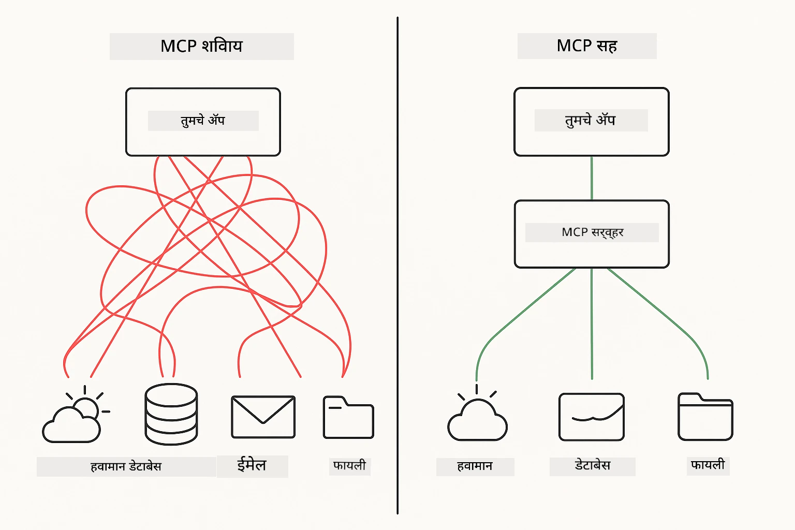
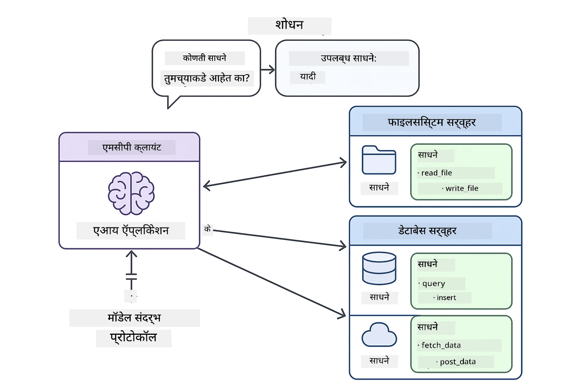
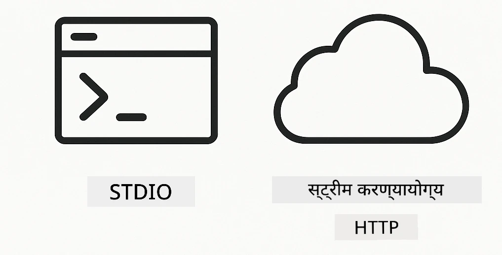
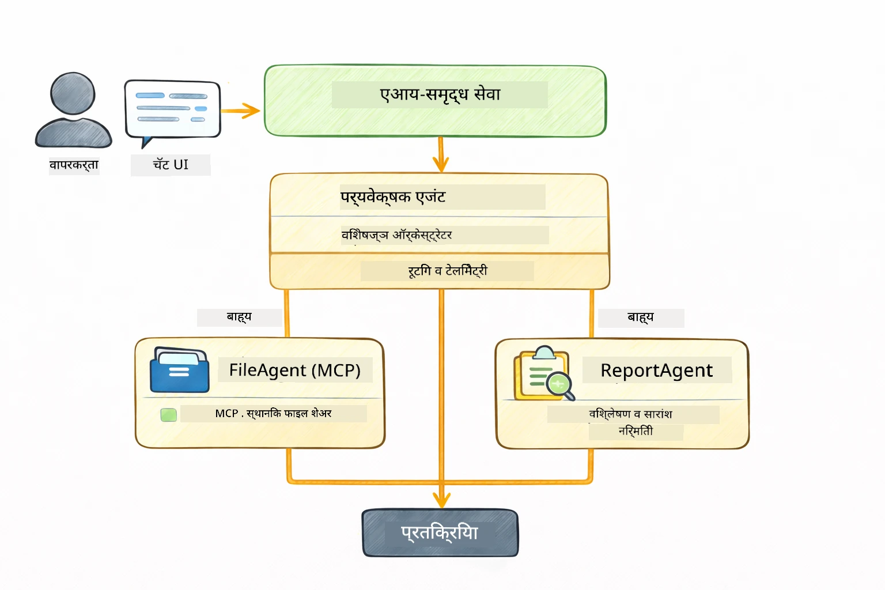

# मॉड्युल 05: मॉडेल संदर्भ प्रोटोकॉल (MCP)

## अनुक्रमणिका

- [तुम्हाला काय शिकायला मिळेल](../../../05-mcp)
- [MCP म्हणजे काय?](../../../05-mcp)
- [MCP कसे कार्य करते](../../../05-mcp)
- [एजेंटिक मॉड्युल](../../../05-mcp)
- [उदाहरणे चालविणे](../../../05-mcp)
  - [पूर्वअट](../../../05-mcp)
- [जलद प्रारंभ](../../../05-mcp)
  - [फाइल ऑपरेशन्स (Stdio)](../../../05-mcp)
  - [सुपरवायझर एजंट](../../../05-mcp)
    - [आउटपुट समजून घेणे](../../../05-mcp)
    - [प्रतिसाद धोरणे](../../../05-mcp)
    - [एजेंटिक मॉड्युल वैशिष्ट्यांचे स्पष्टीकरण](../../../05-mcp)
- [महत्वाचे संकल्पना](../../../05-mcp)
- [अभिनंदन!](../../../05-mcp)
  - [पुढे काय?](../../../05-mcp)

## तुम्हाला काय शिकायला मिळेल

तुम्ही संवादात्मक AI तयार केला आहे, प्रॉम्प्टमध्ये प्रावीण्य मिळविले आहे, दस्तऐवजांमध्ये प्रतिसाद जमविले आहेत, आणि साधने वापरून एजंट तयार केले आहेत. परंतु त्या सर्व साधना तुमच्या विशिष्ट अनुप्रयोगासाठी सानुकूलित होत्या. जर तुम्हाला तुमच्या AI ला अशा मानक उपकरणांच्या परिसंस्थेला प्रवेश देता आला तर, ज्याला कोणीही बनवू आणि शेअर करू शकतो तर काय? या मॉड्युलमध्ये, तुम्ही मॉडेल संदर्भ प्रोटोकॉल (MCP) आणि LangChain4j च्या एजेंटिक मॉड्युलसह हे कसे करायचे ते शिकाल. आम्ही प्रथम सोपा MCP फाइल रीडर दाखवितो आणि नंतर पाहतो की तो कसा सुपरव्हायझर एजंट नमुन्याचा उपयोग करून प्रगत एजेंटिक वर्कफ्लोजमध्ये सहज समाकलित होतो.

## MCP म्हणजे काय?

मॉडेल संदर्भ प्रोटोकॉल (MCP) नेमकं तेच देते - AI अनुप्रयोगांना बाह्य साधने शोधण्याचा आणि वापरण्याचा एक मानक मार्ग. प्रत्येक डेटा स्रोत किंवा सेवेकरिता सानुकूल एकत्रीकरण लिहिण्याऐवजी, तुम्ही MCP सर्व्हरशी कनेक्ट करता जे त्यांच्या क्षमतांना सुसंगत स्वरूपात उघड करतात. तुमचा AI एजंट नंतर स्वयंचलितपणे ही साधने शोधू आणि वापरू शकतो.



*पूर्वी MCP: गुंतागुंतीची पॉइंट-टू-पॉइंट एकत्रीकरणे. नंतर MCP: एक प्रोटोकॉल, असीम शक्यता.*

MCP AI विकासातील एक मूलभूत समस्या सोडवते: प्रत्येक एकत्रीकरण सानुकूल असते. GitHub ला प्रवेश हवा आहे का? सानुकूल कोड. फाइल वाचायची आहे का? सानुकूल कोड. डेटाबेस क्वेरी करायची आहे का? सानुकूल कोड. आणि हे एकत्रीकरणे इतर AI अनुप्रयोगांसोबत कार्य करत नाहीत.

MCP हे मानकीकृत करते. MCP सर्व्हर स्पष्ट वर्णने आणि स्कीमांसह साधने उभारतो. कोणताही MCP क्लायंट कनेक्ट होऊ शकतो, उपलब्ध साधने शोधू शकतो, आणि त्याचा वापर करू शकतो. एकदा तयार करा, सर्वत्र वापरा.



*मॉडेल संदर्भ प्रोटोकॉल आर्किटेक्चर - मानकीकृत साधन शोध आणि अंमलबजावणी*

## MCP कसे कार्य करते

**सर्व्हर-क्लायंट आर्किटेक्चर**

MCP क्लायंट-सर्व्हर मॉडेल वापरते. सर्व्हर साधने पुरवतात - फाइल वाचन, डेटाबेस क्वेरी, API कॉल. क्लायंट (तुमचा AI अनुप्रयोग) सर्व्हरशी जोडून त्यांची साधने वापरतो.

LangChain4j सह MCP वापरण्यासाठी, हा Maven अवलंबित्व जोडा:

```xml
<dependency>
    <groupId>dev.langchain4j</groupId>
    <artifactId>langchain4j-mcp</artifactId>
    <version>${langchain4j.version}</version>
</dependency>
```

**साधन शोध**

तुमचा क्लायंट जेव्हा MCP सर्व्हरशी कनेक्ट होतो, तेव्हा तो विचारतो "तुमच्याकडे कोणती साधने आहेत?" सर्व्हर उपलब्ध साधनांची यादी, प्रत्येकसाठी तपशील आणि पॅरामिटर स्कीमांसह परत करतो. तुमचा AI एजंट वापरकर्त्याच्या विनंत्यांनुसार कोणती साधने वापरायची याचा निर्णय घेऊ शकतो.

**प्रवास यंत्रणा**

MCP वेगवेगळ्या प्रवास यंत्रणा समर्थन करते. हा मॉड्युल स्थानिक प्रक्रियांसाठी Stdio ट्रान्स्पोर्ट दाखवितो:



*MCP प्रवासन यंत्रणा: रिमोट सर्व्हरसाठी HTTP, स्थानिक प्रक्रियांसाठी Stdio*

**Stdio** - [StdioTransportDemo.java](../../../05-mcp/src/main/java/com/example/langchain4j/mcp/StdioTransportDemo.java)

स्थानिक प्रक्रियांसाठी. तुमचा अनुप्रयोग एक उपप्रक्रिया म्हणून सर्व्हर सुरू करतो आणि स्टँडर्ड इनपुट/आउटपुटद्वारे संवाद साधतो. फाइल सिस्टम प्रवेश किंवा कमांड-लाइन साधनांसाठी उपयुक्त.

```java
McpTransport stdioTransport = new StdioMcpTransport.Builder()
    .command(List.of(
        npmCmd, "exec",
        "@modelcontextprotocol/server-filesystem@2025.12.18",
        resourcesDir
    ))
    .logEvents(false)
    .build();
```

> **🤖 [GitHub Copilot](https://github.com/features/copilot) Chat सह प्रयत्न करा:** [`StdioTransportDemo.java`](../../../05-mcp/src/main/java/com/example/langchain4j/mcp/StdioTransportDemo.java) उघडा आणि विचारा:
> - "Stdio ट्रान्स्पोर्ट कसा कार्य करतो आणि HTTP च्या तुलनेत कधी वापरावा?"
> - "LangChain4j MCP सर्व्हर प्रक्रिया कशा व्यवस्थापित करतात?"
> - "AI ला फाइल सिस्टमचा प्रवेश देण्याचे सुरक्षा परिणाम काय आहेत?"

## एजेंटिक मॉड्युल

MCP मानकीकृत साधने पुरवते, तर LangChain4j चे **एजेंटिक मॉड्युल** अशा एजंट्स तयार करण्यासाठी एक घोषणात्मक मार्ग देते जे त्या साधनांचे संघटित व्यवस्थापन करतात. `@Agent` अ‍ॅनोटेशन आणि `AgenticServices` तुम्हाला एजंट वर्तन इंटरफेसच्या माध्यमातून परिभाषित करण्याची परवानगी देतात, आग्रेसर कोड ऐवजी.

या मॉड्युलमध्ये, तुम्ही **सुपरवायझर एजंट** नमुन्याचा अभ्यास कराल — एक प्रगत एजेंटिक AI पद्धत जिथे "सुपरवायझर" एजंट वापरकर्त्याच्या विनंतीनुसार उप-एजंट्स कधी कसे कॉल करायचे हे गतिशीलपणे ठरवतो. आम्ही दोन्ही संकल्पना एकत्र करू ज्यात आमच्या उप-एजंट्समधील एकाला MCP-शक्तीशाली फाइल प्रवेश क्षमता दिली आहे.

एजेंटिक मॉड्युल वापरण्यासाठी, हा Maven अवलंबित्व जोडा:

```xml
<dependency>
    <groupId>dev.langchain4j</groupId>
    <artifactId>langchain4j-agentic</artifactId>
    <version>${langchain4j.mcp.version}</version>
</dependency>
```

> **⚠️ प्रयोगात्मक:** `langchain4j-agentic` मॉड्युल **प्रयोगात्मक** आहे आणि बदल होऊ शकतो. AI सहाय्यक तयार करण्याचा स्थिर मार्ग म्हणजे `langchain4j-core` आणि सानुकूल साधने (मॉड्युल 04).

## उदाहरणे चालविणे

### पूर्वअट

- Java 21+, Maven 3.9+
- Node.js 16+ आणि npm (MCP सर्व्हर साठी)
- `.env` फाइलमध्ये पर्यावरणीय चल सुसंयोजित (रूट निर्देशिकेतून):
  - `AZURE_OPENAI_ENDPOINT`, `AZURE_OPENAI_API_KEY`, `AZURE_OPENAI_DEPLOYMENT` (मॉड्युल 01-04 प्रमाणे)

> **टीप:** जर तुम्ही पर्यावरणीय चल अजून सेट केले नसलात, तर [मॉड्युल 00 - जलद प्रारंभ](../00-quick-start/README.md) पहा किंवा `.env.example` पोहोचून ते `.env` मध्ये कॉपी करा व तुमची मूल्ये भरा.

## जलद प्रारंभ

**VS Code वापरून:** शोधकातून कोणतीही डेमो फाइलवर उजवा क्लिक करा आणि **"Run Java"** निवडा, किंवा रन आणि डीबग पॅनेलमधून लॉन्च कॉन्फिगरेशन वापरा (पहा की तुमचा टोकन `.env` मध्ये आधीच सेट आहे).

**Maven वापरून:** किंवा खालील उदाहरणांसह कमांड लाइनवरून चालवू शकता.

### फाइल ऑपरेशन्स (Stdio)

हे स्थानिक उपप्रक्रिया-आधारित साधने दाखवते.

**✅ कोणतीही पूर्वअट आवश्यक नाही** - MCP सर्व्हर आपोआप सुरु होतो.

**स्टार्ट स्क्रिप्ट वापरणे (शिफारस केलेले):**

स्टार्ट स्क्रिप्ट रूट `.env` फाइलमधून पर्यावरणीय चल आपोआप लोड करतात:

**Bash:**
```bash
cd 05-mcp
chmod +x start-stdio.sh
./start-stdio.sh
```

**PowerShell:**
```powershell
cd 05-mcp
.\start-stdio.ps1
```

**VS Code वापरताना:** `StdioTransportDemo.java` वर उजवा क्लिक करा आणि **"Run Java"** निवडा (पहा की `.env` फाइल सुसंयोजित आहे).

अॅप्लिकेशन आपोआप फाइलसिस्टम MCP सर्व्हर सुरु करते आणि स्थानिक फाइल वाचते. कसे उपप्रक्रिया व्यवस्थापन होते ते लक्षात ठेवा.

**अपेक्षित आउटपुट:**
```
Assistant response: The file provides an overview of LangChain4j, an open-source Java library
for integrating Large Language Models (LLMs) into Java applications...
```

### सुपरवायझर एजंट

**सुपरवायझर एजंट नमुना** हा **लवचीक** एजेंटिक AI प्रकार आहे. सुपरवायझर LLM वापरून वापरकर्त्याच्या विनंतीनुसार कोणते एजंट कॉल करायचे ते स्वयंचलितपणे ठरवतो. पुढील उदाहरणात, आम्ही MCP-शक्तीशाली फाइल प्रवेश आणि LLM एजंट यांचा वापर करून एक संचालित फाइल वाचणे → अहवाल तयार करणे वर्कफ्लो तयार करतो.

डेमोत, `FileAgent` MCP फाइलसिस्टम साधने वापरून फाइल वाचतो, आणि `ReportAgent` संकल्पित अहवाल तयार करतो ज्यात कार्यकारी सारांश (1 वाक्य), 3 मुख्य मुद्दे आणि शिफारसी आहेत. सुपरवायझर हा प्रवाह आपोआप संघटित करतो:



```
┌─────────────┐      ┌──────────────┐
│  FileAgent  │ ───▶ │ ReportAgent  │
│ (MCP tools) │      │  (pure LLM)  │
└─────────────┘      └──────────────┘
   outputKey:           outputKey:
  'fileContent'         'report'
```

प्रत्येक एजंट त्याचा आउटपुट **एजेंटिक स्कोप** (सामायिक स्मृती) मध्ये साठवतो, ज्यामुळे पुढील एजंट्सना मागील निकालांपर्यंत प्रवेश मिळतो. हे दाखवते की MCP साधने एजेंटिक वर्कफ्लोजमध्ये सहजपणे समाकलित होतात — सुपरवायझरला *कसे* फाइल वाचल्या जातात ते माहित असण्याची गरज नाही, फक्त `FileAgent` हे करू शकतो इतके.

#### डेमो चालविणे

स्टार्ट स्क्रिप्ट रूट `.env` फाइलमधून पर्यावरणीय चल आपोआप लोड करतात:

**Bash:**
```bash
cd 05-mcp
chmod +x start-supervisor.sh
./start-supervisor.sh
```

**PowerShell:**
```powershell
cd 05-mcp
.\start-supervisor.ps1
```

**VS Code वापरताना:** `SupervisorAgentDemo.java` वर उजवा क्लिक करा आणि **"Run Java"** निवडा (पहा की `.env` फाइल सुसंयोजित आहे).

#### सुपरवायझर कसे कार्य करतो

```java
// पाऊल 1: FileAgent MCP टूल्स वापरून फायली वाचतो
FileAgent fileAgent = AgenticServices.agentBuilder(FileAgent.class)
        .chatModel(model)
        .toolProvider(mcpToolProvider)  // फाइल ऑपरेशन्ससाठी MCP टूल्स आहेत
        .build();

// पाऊल 2: ReportAgent संरचित अहवाल तयार करतो
ReportAgent reportAgent = AgenticServices.agentBuilder(ReportAgent.class)
        .chatModel(model)
        .build();

// Supervisor फाइल → अहवाल वर्कफ्लोचे समन्वय करतो
SupervisorAgent supervisor = AgenticServices.supervisorBuilder()
        .chatModel(model)
        .subAgents(fileAgent, reportAgent)
        .responseStrategy(SupervisorResponseStrategy.LAST)  // अंतिम अहवाल परत करा
        .build();

// विनंतीवर आधारित कोणते एजंट्स कॉल करायचे ते Supervisor ठरवतो
String response = supervisor.invoke("Read the file at /path/file.txt and generate a report");
```

#### प्रतिसाद धोरणे

`SupervisorAgent` कॉन्फिगर करताना, तुम्ही ठरवता की उप-एजंट्स काम केल्यानंतर वापरकर्त्यास अंतिम उत्तर कसे तयार करायचे. उपलब्ध धोरणे खालीलप्रमाणे आहेत:

| धोरण | वर्णन |
|----------|-------------|
| **LAST** | सुपरवायझर शेवटच्या उप-एजंट किंवा साधनाचा आउटपुट परत करतो. हे उपयुक्त आहे जेव्हा वर्कफ्लोमधील अंतिम एजंट संपूर्ण, अंतिम उत्तर देण्यासाठी खास डिझाइन केलेला असेल (उदा., संशोधन पाईपलाइनमधील "सारांश एजंट"). |
| **SUMMARY** | सुपरवायझर त्याचा अंतर्गत भाषा मॉडेल (LLM) वापरून संपूर्ण संवाद आणि सर्व उप-एजंट आउटपुटचा सारांश तयार करतो आणि तो अंतिम प्रतिसाद म्हणून परत करतो. वापरकर्त्यास एक स्वच्छ, संक्षिप्त उत्तर मिळते. |
| **SCORED** | सिस्टम अंतर्गत LLM वापरून शेवटचा प्रतिसाद आणि संपूर्ण संवादाचा सारांश मूल्यमापन करते आणि ज्याला जास्त गुण मिळतात तो आउटपुट परत करते. |

पूर्ण अंमलबजावणीसाठी [SupervisorAgentDemo.java](../../../05-mcp/src/main/java/com/example/langchain4j/mcp/SupervisorAgentDemo.java) बघा.

> **🤖 [GitHub Copilot](https://github.com/features/copilot) Chat सह प्रयत्न करा:** [`SupervisorAgentDemo.java`](../../../05-mcp/src/main/java/com/example/langchain4j/mcp/SupervisorAgentDemo.java) उघडा आणि विचारा:
> - "सुपरवायझर कसा ठरवतो कोणते एजंट कॉल करायचे?"
> - "सुपरवायझर आणि अनुक्रमिक वर्कफ्लो नमुन्यात काय फरक आहे?"
> - "सुपरवायझरचे नियोजन कसे सानुकूलित करू शकतो?"

#### आउटपुट समजून घेणे

डेमो चालविल्यावर तुम्हाला सुपरवायझर कसा एकाधिक एजंट्सचे संघटन करतो याचे संरचित मार्गदर्शन दिसेल. प्रत्येक विभागाचा अर्थ असा आहे:

```
======================================================================
  FILE → REPORT WORKFLOW DEMO
======================================================================

This demo shows a clear 2-step workflow: read a file, then generate a report.
The Supervisor orchestrates the agents automatically based on the request.
```

**हेडर** वर्कफ्लो संकल्पना परिचय देते: फाइल वाचन ते अहवाल तयार करण्यापर्यंत एक लक्ष केंद्रित पाईपलाइन.

```
--- WORKFLOW ---------------------------------------------------------
  ┌─────────────┐      ┌──────────────┐
  │  FileAgent  │ ───▶ │ ReportAgent  │
  │ (MCP tools) │      │  (pure LLM)  │
  └─────────────┘      └──────────────┘
   outputKey:           outputKey:
   'fileContent'        'report'

--- AVAILABLE AGENTS -------------------------------------------------
  [FILE]   FileAgent   - Reads files via MCP → stores in 'fileContent'
  [REPORT] ReportAgent - Generates structured report → stores in 'report'
```

**वर्कफ्लो आकृती** एजंट्समधील डेटाचा प्रवाह दाखवते. प्रत्येक एजंटची ठराविक भूमिका आहे:
- **FileAgent** MCP साधने वापरून फाइल वाचतो आणि ताजी माहिती `fileContent` मध्ये साठवतो
- **ReportAgent** ही माहिती वापरून संरचित अहवाल `report` तयार करतो

```
--- USER REQUEST -----------------------------------------------------
  "Read the file at .../file.txt and generate a report on its contents"
```

**वापरकर्ता विनंती** कार्य दाखवते. सुपरवायझर हे पार्स करून FileAgent → ReportAgent कॉल करण्याचा निर्णय घेतो.

```
--- SUPERVISOR ORCHESTRATION -----------------------------------------
  The Supervisor decides which agents to invoke and passes data between them...

  +-- STEP 1: Supervisor chose -> FileAgent (reading file via MCP)
  |
  |   Input: .../file.txt
  |
  |   Result: LangChain4j is an open-source, provider-agnostic Java framework for building LLM...
  +-- [OK] FileAgent (reading file via MCP) completed

  +-- STEP 2: Supervisor chose -> ReportAgent (generating structured report)
  |
  |   Input: LangChain4j is an open-source, provider-agnostic Java framew...
  |
  |   Result: Executive Summary...
  +-- [OK] ReportAgent (generating structured report) completed
```

**सुपरवायझर संघटन** 2 टप्प्यांचा प्रवाह दाखवतो:
1. **FileAgent** MCP मार्फत फाइल वाचते आणि सामग्री साठवते
2. **ReportAgent** सामग्री मिळवते आणि संरचित अहवाल तयार करते

सुपरवायझर वापरकर्त्याच्या विनंतीनुसार हे निर्णय **स्वयंचलितपणे** घेतो.

```
--- FINAL RESPONSE ---------------------------------------------------
Executive Summary
...

Key Points
...

Recommendations
...

--- AGENTIC SCOPE (Data Flow) ----------------------------------------
  Each agent stores its output for downstream agents to consume:
  * fileContent: LangChain4j is an open-source, provider-agnostic Java framework...
  * report: Executive Summary...
```

#### एजेंटिक मॉड्युल वैशिष्ट्यांचे स्पष्टीकरण

या उदाहरणात एजेंटिक मॉड्युलचे अनेक प्रगत वैशिष्ट्ये दर्शविले आहेत. एजेंटिक स्कोप आणि एजेंट लिसनर्सकडे नजर टाकूया.

**एजेंटिक स्कोप** सामायिक स्मृती दर्शवतो जिथे एजंटने `@Agent(outputKey="...")` वापरून त्यांचा निकाल संग्रहित केलेला असतो. हे परवानगी देते:
- नंतरच्या एजंट्सना पूर्वीच्या एजंट्सच्या आउटपुटपर्यंत प्रवेश
- सुपरवायझरला अंतिम प्रतिसाद संयोजित करण्याची क्षमता
- तुम्हाला काय तयार झाले ते तपासता येते

```java
ResultWithAgenticScope<String> result = supervisor.invokeWithAgenticScope(request);
AgenticScope scope = result.agenticScope();
String fileContent = scope.readState("fileContent");  // FileAgent कडून कच्चा फाइल डेटा
String report = scope.readState("report");            // ReportAgent कडून रचलेली अहवाल
```

**एजेंट लिसनर्स** एजंट कार्यान्वयनाची देखरेख आणि त्रुटी शोधण्यासाठी वापरले जातात. डेमोतील प्रत्येक चरणाचे आउटपुट एजेंटलिसनरद्वारे मिळते जे प्रत्येक एजंट कॉलवर हुक केले आहे:
- **beforeAgentInvocation** - सुपरवायझर कोणता एजंट निवडतो ते समजण्यासाठी
- **afterAgentInvocation** - एजंट पूर्ण झाल्यावर त्याचा परिणाम दाखवण्यासाठी
- **inheritedBySubagents** - खरं असल्यास, संपूर्ण श्रेणीतील एजंट देखरेख करीता

```java
AgentListener monitor = new AgentListener() {
    private int step = 0;
    
    @Override
    public void beforeAgentInvocation(AgentRequest request) {
        step++;
        System.out.println("  +-- STEP " + step + ": " + request.agentName());
    }
    
    @Override
    public void afterAgentInvocation(AgentResponse response) {
        System.out.println("  +-- [OK] " + response.agentName() + " completed");
    }
    
    @Override
    public boolean inheritedBySubagents() {
        return true; // सर्व उप-एजंट्सपर्यंत प्रसारित करा
    }
};
```

सुपरवायझर नमुन्याबाहेर, `langchain4j-agentic` मॉड्युल अनेक प्रभावी वर्कफ्लो नमुने आणि वैशिष्ट्ये पुरवते:

| नमुना | वर्णन | वापर |
|---------|-------------|----------|
| **अनुक्रमिक** | एजंट अनुक्रमाने चालवा, आउटपुट पुढीलपर्यंत वाहील | पाइपलाइन: संशोधन → विश्लेषण → अहवाल |
| **समांतर** | एजंट एकाच वेळी चालवा | स्वतंत्र कामे: हवामान + बातम्या + स्टॉक्स |
| **लूप** | परिस्थिती पूर्ण होईपर्यंत पुनरावृत्ती करा | गुणवत्ता मापन: स्कोअर ≥ 0.8 पर्यंत सुधारणा |
| **शर्तीपूर्वक** | परिस्थितीनुसार मार्गदर्शन | वर्गीकरण → तज्ञ एजंट कडे रूट करा |
| **मानवी-इन-लूप** | मानवी तपासणी जोडा | मंजुरी वर्कफ्लो, सामग्री पुनरावलोकन |

## महत्वाचे संकल्पना

आता तुम्ही MCP आणि एजेंटिक मॉड्युल प्रत्यक्षात पाहिले आहेत, चला प्रत्येक दृष्टीकोन कधी वापरायचा हे सारांश करूया.

**MCP** तेव्हा आदर्श आहे जेव्हा तुम्हाला विद्यमान साधन परिसंस्थांचा लाभ घ्यायचा असेल, अनेक अनुप्रयोगांमध्ये साधने शेअर करता येतील अशा साधनांचा विकास करायचा असेल, तृतीय-पक्ष सेवा मानक प्रोटोकॉलसह समाकलित करायच्या असतील, किंवा कोड न बदलता साधनांची अंमलबजावणी बदलायची असेल.

**एजेंटिक मॉड्युल** तेव्हा सर्वोत्तम काम करते जेव्हा तुम्हाला `@Agent` अ‍ॅनोटेशनसह घोषणात्मक एजंट परिभाषा करायच्या असतील, वर्कफ्लो संघटन (अनुक्रमिक, लूप, समांतर) हवे असेल, इंटरफेस-आधारित एजंट डिझाइन आवडेल आणि अनेक एजंटसह ज्यांच्या आउटपुट `outputKey` द्वारे शेअर होतात ते एकत्र वापरायचे असतील.

**सुपरवायझर एजंट नमुना** तेव्हा चमकतो जेव्हा वर्कफ्लो पूर्वनिर्धारित नसतो आणि तुम्हाला LLM कडून ठरवायचे असते, जेव्हा तुम्हाकडे अनेक विशिष्ट एजंट असतात ज्यांना गतिशील संघटनाची गरज असते, संवादात्मक सिस्टम तयार करताना भिन्न क्षमतांकडे मार्गदर्शन करणे असेल, किंवा तुम्हाला सर्वात लवचीक, अनुकूल एजंट वर्तन हवे असेल.
## अभिनंदन!

तुम्ही LangChain4j for Beginners कोर्स पूर्ण केला आहे. तुम्ही शिकले आहे:

- मेमरीसह संवादात्मक AI कसे तयार करावे (मॉड्यूल ०१)
- विविध कामांसाठी प्रॉम्प्ट अभियांत्रिकी नमुने (मॉड्यूल ०२)
- RAG सह आपल्या दस्तऐवजांमधील प्रतिसादांचे आधार मिळवणे (मॉड्यूल ०३)
- कस्टम साधने वापरून मूलभूत AI एजंट्स (सहायक) तयार करणे (मॉड्यूल ०४)
- LangChain4j MCP आणि Agentic मॉड्यूल्ससह प्रमाणित साधने समाकलित करणे (मॉड्यूल ०५)

### पुढे काय?

मॉड्यूल्स पूर्ण केल्यानंतर, LangChain4j च्या चाचणी संकल्पना कृतीमध्ये पाहण्यासाठी [Testing Guide](../docs/TESTING.md) अन्वेषण करा.

**अधिकृत संसाधने:**
- [LangChain4j Documentation](https://docs.langchain4j.dev/) - सविस्तर मार्गदर्शिकाएँ आणि API संदर्भ
- [LangChain4j GitHub](https://github.com/langchain4j/langchain4j) - स्त्रोत कोड आणि उदाहरणे
- [LangChain4j Tutorials](https://docs.langchain4j.dev/tutorials/) - विविध वापरासाठी टप्प्याटप्प्याने ट्यूटोरियल्स

हा कोर्स पूर्ण केल्याबद्दल धन्यवाद!

---

**नेव्हिगेशन:** [← मागील: मॉड्यूल ०४ - साधने](../04-tools/README.md) | [मुख्य पानावर परत जा](../README.md)

---

<!-- CO-OP TRANSLATOR DISCLAIMER START -->
**सूचना**:
हा दस्तऐवज AI भाषांतर सेवा [Co-op Translator](https://github.com/Azure/co-op-translator) वापरून अनुवादित केला आहे. आम्ही शुद्धतेसाठी प्रयत्नशील असलो तरी, कृपया लक्षात घ्या की स्वयंचलित भाषांतरांमध्ये चुका किंवा अपूर्णता असू शकते. मूळ दस्तऐवज त्याच्या मूळ भाषेत अधिकृत स्रोत मानला पाहिजे. महत्त्वपूर्ण माहितीसाठी व्यावसायिक मानवी भाषांतर केलेले असावे. या भाषांतराच्या वापरामुळे निर्माण झालेल्या कोणत्याही गैरसमजुती किंवा चुकीच्या अर्थवासंबंधी आम्ही जबाबदार नाही.
<!-- CO-OP TRANSLATOR DISCLAIMER END -->