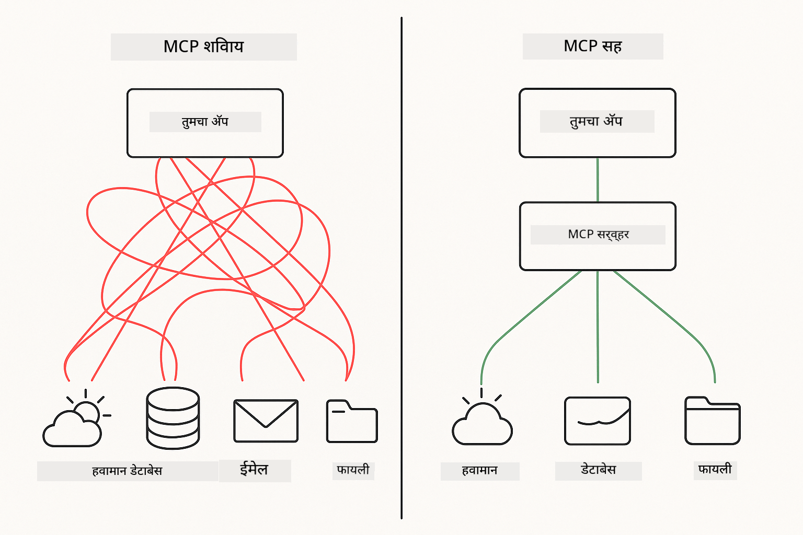
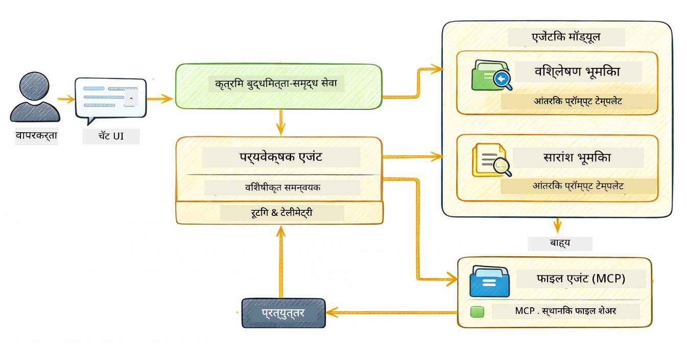

<!--
CO_OP_TRANSLATOR_METADATA:
{
  "original_hash": "f89f4c106d110e4943c055dd1a2f1dff",
  "translation_date": "2025-12-30T22:53:47+00:00",
  "source_file": "05-mcp/README.md",
  "language_code": "mr"
}
-->
# Module 05: मॉडेल संदर्भ प्रोटोकॉल (MCP)

## अनुक्रमणिका

- [आपण काय शिकणार आहात](../../../05-mcp)
- [MCP म्हणजे काय?](../../../05-mcp)
- [MCP कसे कार्य करते](../../../05-mcp)
- [एजेंटिक मॉड्यूल](../../../05-mcp)
- [उदाहरण चालवणे](../../../05-mcp)
  - [पूर्वआवश्यकता](../../../05-mcp)
- [जलद प्रारंभ](../../../05-mcp)
  - [फाइल ऑपरेशन्स (Stdio)](../../../05-mcp)
  - [सुपरवायझर एजंट](../../../05-mcp)
    - [आउटपुट समजून घेणे](../../../05-mcp)
    - [एजेंटिक मॉड्यूल वैशिष्ट्यांचे स्पष्टीकरण](../../../05-mcp)
- [मुख्य संकल्पना](../../../05-mcp)
- [अभिनंदन!](../../../05-mcp)
  - [पुढे काय?](../../../05-mcp)

## आपण काय शिकणार आहात

आपण संवादात्मक एआय तयार केले, प्रॉम्प्ट्समध्ये प्रावीण्य मिळवले, दस्तऐवजांमध्ये उत्तरे ग्राउंड केली आणि टूल्ससह एजंट तयार केले. परंतु त्या सर्व टूल्स आपल्या विशिष्ट अनुप्रयोगासाठी सानुकूल बनवलेले होते. जर आपण आपल्या एआयला असे एक प्रमाणित टूल इकोसिस्टम प्रदान करू शकाल जे कोणतीही व्यक्ती तयार आणि शेअर करू शकेल तर? या मॉड्यूलमध्ये आपण Model Context Protocol (MCP) आणि LangChain4j च्या एजेंटिक मॉड्यूलच्या साहाय्याने ते कसे करायचे ते शिकणार आहात. पहिले आपण एक सोपा MCP फाइल रीडर दाखवतो आणि नंतर ते कसे सुलभपणे सुपरवायझर एजंट पॅटर्न वापरून प्रगत एजेंटिक वर्कफ्लोमध्ये एकत्रित होते ते दाखवतो.

## MCP म्हणजे काय?

Model Context Protocol (MCP) याने अगदी तेच प्रदान केले आहे - एआय अनुप्रयोगांसाठी बाह्य टूल्स शोधण्याची आणि वापरण्याची एक प्रमाणित पद्धत. प्रत्येक डेटा स्त्रोत किंवा सेवेसाठी सानुकूल समाकलने लिहिण्याऐवजी, आपण अशा MCP सर्व्हरशी कनेक्ट करता जे त्यांच्या क्षमता सुसंगत स्वरूपात उघड करतात. आपले एआय एजंट नंतर ऑटोमॅटिकपणे हे टूल्स शोधू आणि वापरू शकते.



*MCP आधी: क्लिष्ट बिंदू ते बिंदू समाकलने. MCP नंतर: एक प्रोटोकॉल, अनंत शक्यता.*

MCP एआय विकासातील एक मूलभूत समस्या सोडवते: प्रत्येक समाकलन सानुकूल असते. GitHub ऍक्सेस करायचा आहे का? सानुकूल कोड. फाइल वाचायची आहे का? सानुकूल कोड. डेटाबेस क्वेरी करायची आहे का? सानुकूल कोड. आणि हे समाकलन इतर एआय अनुप्रयोगांसोबत कार्य करीत नाहीत.

MCP हे मानकीकृत करते. एक MCP सर्व्हर स्पष्ट वर्णन आणि स्कीमा सहित टूल्स प्रदर्शित करतो. कोणतीही MCP क्लायंट कनेक्ट करून उपलब्ध टूल्स शोधू शकते आणि ते वापरू शकते. एकदा बनवा, सर्वत्र वापरा.


*Model Context Protocol आर्किटेक्चर - मानकीकृत टूल शोध आणि अंमलबजावणी*

## MCP कसे कार्य करते

**सर्व्हर-क्लायंट आर्किटेक्चर**

MCP एका क्लायंट-सर्व्हर मॉडेलचा वापर करते. सर्व्हर्स टूल्स प्रदान करतात - फाइल वाचन, डेटाबेस क्वेरी, API कॉल करणे. क्लायंट्स (आपले एआय अनुप्रयोग) सर्व्हर्सशी कनेक्ट होतात आणि त्यांच्या टूल्सचा वापर करतात.

To use MCP with LangChain4j, add this Maven dependency:

```xml
<dependency>
    <groupId>dev.langchain4j</groupId>
    <artifactId>langchain4j-mcp</artifactId>
    <version>${langchain4j.version}</version>
</dependency>
```

**उपकरण शोध**

आपला क्लायंट जेव्हा एका MCP सर्व्हरशी कनेक्ट करतो, तेव्हा तो विचारतो "तुमच्याकडे कोणती टूल्स आहेत?" सर्व्हर उपलब्ध टूल्सची यादी परत करते, प्रत्येकसाठी वर्णन आणि पॅरामीटर स्कीमा सहित. आपल्या एआय एजंटनुसार वापरकर्ता विनंतीवर आधारित कोणती टूल्स वापरायच्या हे ठरवू शकते.

**ट्रान्सपोर्ट यंत्रणा**

MCP विविध ट्रान्सपोर्ट यंत्रणा समर्थित करते. हे मॉड्यूल स्थानिक प्रक्रियांसाठी Stdio ट्रान्सपोर्ट दाखवते:


*MCP प्रवहन पद्धती: दूरस्थ सर्व्हरसाठी HTTP, स्थानिक प्रक्रियांसाठी Stdio*

**Stdio** - [StdioTransportDemo.java](../../../05-mcp/src/main/java/com/example/langchain4j/mcp/StdioTransportDemo.java)

स्थानिक प्रक्रियांसाठी. आपले अनुप्रयोग सर्व्हप्रक्रिया म्हणून एक सर्व्हर सुरु करतात आणि मानक इनपुट/आउटपुटद्वारे संवाद करतात. फाइलसिस्टम प्रवेश किंवा कमांड-लाइन टूल्ससाठी उपयुक्त.

```java
McpTransport stdioTransport = new StdioMcpTransport.Builder()
    .command(List.of(
        npmCmd, "exec",
        "@modelcontextprotocol/server-filesystem@2025.12.18",
        resourcesDir
    ))
    .logEvents(false)
    .build();
```

> **🤖 [GitHub Copilot](https://github.com/features/copilot) Chat सह प्रयत्न करा:** उघडा [`StdioTransportDemo.java`](../../../05-mcp/src/main/java/com/example/langchain4j/mcp/StdioTransportDemo.java) आणि विचारा:
> - "Stdio ट्रान्सपोर्ट कसे कार्य करते आणि HTTP च्या तुलनेत कधी वापरावे?"
> - "LangChain4j थेट सुरू केलेल्या MCP सर्व्हर प्रोसेसेसचे आयुष्यचक्र कसे व्यवस्थापित करते?"
> - "AI ला फाइल सिस्टमचा प्रवेश देण्याचे सुरक्षेचे परिणाम काय आहेत?"

## एजेंटिक मॉड्यूल

जरी MCP प्रमाणित टूल्स प्रदान करतो, LangChain4j चे **एजेंटिक मॉड्यूल** असे एक घोषणात्मक (declarative) मार्ग देते ज्याद्वारे अशा टूल्सचे नियमन करणारे एजंट तयार करता येतात. `@Agent` एनोटेशन आणि `AgenticServices` आपल्याला इंटरफेसेसद्वारे एजंट वर्तन परिभाषित करण्यास अनुमती देतात, परंतु इम्पेरटिव्ह कोडऐवजी.

या मॉड्यूलमध्ये आपण **सुपरवायझर एजंट** पॅटर्नचा अभ्यास कराल — हा एक प्रगत एजेंटिक एआय दृष्टिकोन आहे जिथे एक "सुपरवायझर" एजंट वापरकर्त्याच्या विनंतीनुसार कोणते सब-एजंट्स चालवायचे हे गतिशीलरित्या ठरवतो. आपण दोन्ही संकल्पना एकत्र करून आपल्या उपएजंटपैकी एकाला MCP-शक्तिच्या फाइल ऍक्सेस क्षमतांसह सुसज्ज करू.

एजेंटिक मॉड्यूल वापरण्यासाठी, हा Maven निर्भरता जोडा:

```xml
<dependency>
    <groupId>dev.langchain4j</groupId>
    <artifactId>langchain4j-agentic</artifactId>
    <version>${langchain4j.mcp.version}</version>
</dependency>
```

> **⚠️ प्रयोगात्मक:** `langchain4j-agentic` मॉड्यूल **प्रयोगात्मक** आहे आणि बदलांस अधीन आहे. स्टेबल मार्ग म्हणजे `langchain4j-core` सह सानुकूल टूल्स वापरून AI असिस्टंट बनवणे (मॉड्यूल 04).

## उदाहरण चालवणे

### पूर्वआवश्यकता

- Java 21+, Maven 3.9+
- Node.js 16+ आणि npm (MCP सर्व्हरांसाठी)
- रूट डायरेक्टरीमधील `.env` फाइलमध्ये वातावरण चल कॉन्फिगर केलेले असणे:
  - **StdioTransportDemo साठी:** `GITHUB_TOKEN` (GitHub वैयक्तिक प्रवेश टोकन)
  - **SupervisorAgentDemo साठी:** `AZURE_OPENAI_ENDPOINT`, `AZURE_OPENAI_API_KEY`, `AZURE_OPENAI_DEPLOYMENT` (मॉड्यूल 01-04 प्रमाणेच)

> **नोट:** जर आपण अद्याप आपल्या वातावरण चल सेट केले नाहीत, तर सूचना साठी पाहा [Module 00 - Quick Start](../00-quick-start/README.md), किंवा रूट डायरेक्टरीतील `.env.example` कॉपी करून `.env` मध्ये आपल्या मूल्ये भरा.

## जलद प्रारंभ

**VS Code वापरताना:** Explorer मध्ये कोणत्याही डेमो फाइलवर उजवे क्लिक करा आणि **"Run Java"** निवडा, किंवा Run आणि Debug पॅनेलमधील लाँच कॉन्फिगरेशन्स वापरा (प्रथम `.env` फाइलमध्ये आपला टोकन जोडलेला आहे याची खात्री करा).

**Maven वापरताना:** पर्यायी म्हणून, आपण खालील उदाहरणांसह कमांड लाइनवरून चालवू शकता.

### फाइल ऑपरेशन्स (Stdio)

हे स्थानिक subprocess-आधारित टूल्सचे प्रदर्शन करते.

**✅ कोणतीही पूर्वअट आवश्यक नाही** - MCP सर्व्हर स्वयंचलितरित्या चालू केला जातो.

**VS Code वापरताना:** `StdioTransportDemo.java` वर उजवे क्लिक करा आणि **"Run Java"** निवडा.

**Maven वापरून:**

**Bash:**
```bash
export GITHUB_TOKEN=your_token_here
cd 05-mcp
mvn compile exec:java -Dexec.mainClass=com.example.langchain4j.mcp.StdioTransportDemo
```

**PowerShell:**
```powershell
$env:GITHUB_TOKEN=your_token_here
cd 05-mcp
mvn --% compile exec:java -Dexec.mainClass=com.example.langchain4j.mcp.StdioTransportDemo
```

अँप्लिकेशन स्वयंचलितरित्या एक फाइलसिस्टम MCP सर्व्हर सुरु करते आणि स्थानिक फाइल वाचते. लक्षात घ्या की उपप्रोसेस व्यवस्थापन कसे तुमच्यासाठी हाताळले जाते.

**अपेक्षित आउटपुट:**
```
Assistant response: The file provides an overview of LangChain4j, an open-source Java library
for integrating Large Language Models (LLMs) into Java applications...
```

### सुपरवायझर एजंट




**सुपरवायझर एजंट पॅटर्न** हा एक **लवचीक** एजेंटिक एआय प्रकार आहे. ठराविक वर्कफ्लो (क्रमिक, लूप, समांतर) यांच्या विपरीत, एक सुपरवायझर LLM वापरून स्वायत्तपणे ठरवतो की कोणत्या एजंट्सना कॉल करायचे, वापरकर्त्याच्या विनंतीनुसार.

**सुपरवायझर आणि MCP चे संयोजन:** या उदाहरणात, आम्ही `FileAgent` ला `toolProvider(mcpToolProvider)` द्वारे MCP फाइल सिस्टम टूल्सची ऍक्सेस देतो. जेव्हा वापरकर्ता "फाइल वाचून विश्लेषण करा" असे विचारतो, तेव्हा सुपरवायझर विनंतीचे विश्लेषण करतो आणि अंमलबजावणी योजना तयार करतो. नंतर तो विनंती `FileAgent` कडे मार्गदर्शित करतो, जे MCP चे `read_file` टूल वापरून सामग्री मिळवते. सुपरवायझर त्या सामग्रीला `AnalysisAgent` कडे अर्थ लावण्यासाठी पास करतो, आणि आवश्यक असल्यास `SummaryAgent` ला सारांश तयार करण्यासाठी कॉल करतो.

हे दाखवते की MCP टूल्स एजेंटिक वर्कफ्लोमध्ये कसे सहज एकत्र येतात — सुपरवायझरला फाइल कशी वाचली जाते हे माहित असण्याची गरज नाही, फक्त माहित असणे आवश्यक आहे की `FileAgent` ते करू शकतो. सुपरवायझर वेगवेगळ्या प्रकारच्या विनंत्यांनुसार गतिशीलरित्या जुळवून घेतो आणि शेवटी शेवटच्या एजंटच्या उत्तर किंवा सर्व ऑपरेशन्सचा सारांश परत करतो.

**स्टार्ट स्क्रिप्ट्स वापरणे (शिफारसीय):**

स्टार्ट स्क्रिप्ट्स रूट `.env` फाइलमधून वातावरण चल स्वयंचलितपणे लोड करतात:

**Bash:**
```bash
cd 05-mcp
chmod +x start.sh
./start.sh
```

**PowerShell:**
```powershell
cd 05-mcp
.\start.ps1
```

**VS Code वापरताना:** `SupervisorAgentDemo.java` वर उजवे क्लिक करा आणि **"Run Java"** निवडा (आपली `.env` फाइल कॉन्फिगर केलेली असल्याची खात्री करा).

**सुपरवायझर कसे कार्य करतो:**

```java
// विशिष्ट क्षमता असलेले अनेक एजंट परिभाषित करा
FileAgent fileAgent = AgenticServices.agentBuilder(FileAgent.class)
        .chatModel(model)
        .toolProvider(mcpToolProvider)  // फाइल ऑपरेशन्ससाठी MCP साधने आहेत
        .build();

AnalysisAgent analysisAgent = AgenticServices.agentBuilder(AnalysisAgent.class)
        .chatModel(model)
        .build();

SummaryAgent summaryAgent = AgenticServices.agentBuilder(SummaryAgent.class)
        .chatModel(model)
        .build();

// हे एजंट समन्वयित करणारा Supervisor तयार करा
SupervisorAgent supervisor = AgenticServices.supervisorBuilder()
        .chatModel(model)  // हे "planner" मॉडेल
        .subAgents(fileAgent, analysisAgent, summaryAgent)
        .responseStrategy(SupervisorResponseStrategy.SUMMARY)
        .build();

// Supervisor स्वयंचलितपणे ठरवतो की कोणते एजंट आह्वान करायचे
// फक्त नैसर्गिक भाषेतील विनंती द्या - LLM अंमलबजावणीचे नियोजन करते
String response = supervisor.invoke("Read the file at /path/file.txt and analyze it");
```

पूर्ण अंमलबजावणीसाठी [SupervisorAgentDemo.java](../../../05-mcp/src/main/java/com/example/langchain4j/mcp/SupervisorAgentDemo.java) पहा.

> **🤖 [GitHub Copilot](https://github.com/features/copilot) Chat सह प्रयत्न करा:** उघडा [`SupervisorAgentDemo.java`](../../../05-mcp/src/main/java/com/example/langchain4j/mcp/SupervisorAgentDemo.java) आणि विचारा:
> - "सुपरवायझर कोणते एजंट्स invoke करायचे ते कसे ठरवतो?"
> - "सुपरवायझर आणि क्रमिक वर्कफ्लो पॅटर्नमध्ये काय फरक आहे?"
> - "सुपरवायझरच्या प्लॅनिंग वर्तनाला मी कसे सानुकूलित करू शकतो?"

#### आउटपुट समजून घेणे

जेव्हा आपण डेमो चालवता, तेव्हा आपण सुपरवायझर अनेक एजंट्स कसे आयोजित करतो याचे संरचित वॉकथ्रू पाहाल. प्रत्येक विभागाचा अर्थ खालीलप्रमाणे आहे:

```
======================================================================
  SUPERVISOR AGENT DEMO
======================================================================

This demo shows how a Supervisor Agent orchestrates multiple specialized agents.
The Supervisor uses an LLM to decide which agent to call based on the task.
```

**हेडर** डेमोची ओळख करून देते आणि मुख्य संकल्पना स्पष्ट करते: सुपरवायझर कोणते एजंट कॉल करायचे हे ठरवण्यासाठी LLM वापरतो (हार्डकोडेड नियम नाहीत).

```
--- AVAILABLE AGENTS -------------------------------------------------
  [FILE]     FileAgent     - Reads files using MCP filesystem tools
  [ANALYZE]  AnalysisAgent - Analyzes content for structure, tone, and themes
  [SUMMARY]  SummaryAgent  - Creates concise summaries of content
```

**उपलब्ध एजंट्स** हा सुपरवायझर निवडू शकणारे तीन विशेषीकृत एजंट दाखवतो. प्रत्येक एजंटच्या विशिष्ट क्षमता आहेत:
- **FileAgent** MCP टूल्स वापरून फाइल्स वाचू शकतो (बाह्य क्षमता)
- **AnalysisAgent** सामग्रीचे विश्लेषण करतो (पूर्णपणे LLM क्षमता)
- **SummaryAgent** सारांश तयार करतो (पूर्णपणे LLM क्षमता)

```
--- USER REQUEST -----------------------------------------------------
  "Read the file at .../file.txt and analyze what it's about"
```

**वापरकर्ता विनंती** मध्ये काय विचारले गेले ते दाखवले आहे. सुपरवायझरला हे पार्स करून कोणते एजंट invoke करायचे ते ठरवावे लागते.

```
--- SUPERVISOR ORCHESTRATION -----------------------------------------
  The Supervisor will now decide which agents to invoke and in what order...

  +-- STEP 1: Supervisor chose -> FileAgent (reading file via MCP)
  |
  |   Input: .../file.txt
  |
  |   Result: LangChain4j is an open-source Java library designed to simplify...
  +-- [OK] FileAgent (reading file via MCP) completed

  +-- STEP 2: Supervisor chose -> AnalysisAgent (analyzing content)
  |
  |   Input: LangChain4j is an open-source Java library...
  |
  |   Result: Structure: The content is organized into clear paragraphs that int...
  +-- [OK] AnalysisAgent (analyzing content) completed
```

**सुपरवायझर ऑर्केस्ट्रेशन** हे जिथे जादू घडते. पाहा कसे:
1. सुपरवायझरने **प्रथम FileAgent निवडला** कारण विनंतीत "फाइल वाचा" असा उल्लेख होता
2. FileAgent ने MCP चे `read_file` टूल वापरून फाइल सामग्री प्राप्त केली
3. नंतर सुपरवायझरने **AnalysisAgent निवडला** आणि फाइल सामग्री त्याला दिली
4. AnalysisAgent ने संरचना, टोन आणि थीम्सचे विश्लेषण केले

लक्षात घ्या की सुपरवायझरने वापरकर्त्याच्या विनंतीच्या आधारावर हे निर्णय **स्वायत्तपणे** घेतले — कोणतेही हार्डकोडेड वर्कफ्लो नाही!

**अंतिम उत्तर** हे सुपरवायझरने एकत्रित केलेले उत्तर आहे, जे सर्व एजंट्सकडून मिळालेल्या आऊटपुटचे संयोग आहे. उदाहरणात प्रत्येक एजंटने साठवलेला सारांश आणि विश्लेषणाचे परिणाम दाखविणारे एजेंटिक स्कोप dump केले आहे.

```
--- FINAL RESPONSE ---------------------------------------------------
I read the contents of the file and analyzed its structure, tone, and key themes.
The file introduces LangChain4j as an open-source Java library for integrating
large language models...

--- AGENTIC SCOPE (Shared Memory) ------------------------------------
  Agents store their results in a shared scope for other agents to use:
  * summary: LangChain4j is an open-source Java library...
  * analysis: Structure: The content is organized into clear paragraphs that in...
```

### एजेंटिक मॉड्यूल वैशिष्ट्यांचे स्पष्टीकरण

हे उदाहरण एजेंटिक मॉड्यूलच्या अनेक प्रगत वैशिष्ट्यांचे प्रदर्शन करते. चला Agentic Scope आणि Agent Listeners वर तपशीलवार नज़र टाकूया.

**Agentic Scope** हा शेअर केलेले मेमरी दाखवतो जिथे एजंट्सने `@Agent(outputKey="...")` वापरून त्यांचे परिणाम साठवले. यामुळे:
- नंतरचे एजंट आधीच्या एजंट्सच्या आउटपुटवर प्रवेश करू शकतात
- सुपरवायझर अंतिम उत्तर एकत्र करू शकतो
- आपण प्रत्येक एजंटने काय तयार केले ते तपासू शकता

```java
ResultWithAgenticScope<String> result = supervisor.invokeWithAgenticScope(request);
AgenticScope scope = result.agenticScope();
String story = scope.readState("story");
List<AgentInvocation> history = scope.agentInvocations("analysisAgent");
```

**Agent Listeners** एजंट अंमलबजावणीचे मॉनिटरिंग आणि डिबगिंग सक्षम करतात. डेमोमध्ये आपण जे स्टेप-बाय-स्टेप आउटपुट पाहता ते एका AgentListener कडून येते जे प्रत्येक एजंट invoke मध्ये हुक होते:
- **beforeAgentInvocation** - सुपरवायझरने एखादा एजंट निवडला तेव्हा कॉल होते, ज्यामुळे आपण कुठला एजंट का निवडला हे पाहू शकता
- **afterAgentInvocation** - एजंट पूर्ण झाल्यावर कॉल होते, त्याचा निकाल दाखवते
- **inheritedBySubagents** - खरे असल्यास, लिसनर संपूर्ण हायारकीमधील सर्व एजंट्सवर मॉनिटर करते

```java
AgentListener monitor = new AgentListener() {
    private int step = 0;
    
    @Override
    public void beforeAgentInvocation(AgentRequest request) {
        step++;
        System.out.println("  +-- STEP " + step + ": " + request.agentName());
    }
    
    @Override
    public void afterAgentInvocation(AgentResponse response) {
        System.out.println("  +-- [OK] " + response.agentName() + " completed");
    }
    
    @Override
    public boolean inheritedBySubagents() {
        return true; // सर्व उप-एजंटांना प्रसारित करा.
    }
};
```

सुपरवायझर पॅटर्नच्या पलीकडे, `langchain4j-agentic` मॉड्यूल अनेक शक्तिशाली वर्कफ्लो पॅटर्न्स आणि वैशिष्ट्ये प्रदान करते:

| पॅटर्न | वर्णन | वापर केस |
|---------|-------------|----------|
| **Sequential** | एजंट्स क्रमाने अंमलात आणा, आउटपुट पुढीलकडे वाहते | पाईपलाइन: संशोधन → विश्लेषण → अहवाल |
| **Parallel** | एजंट्स एकाच वेळी चालवा | स्वतंत्र कार्ये: हवामान + बातम्या + स्टॉक्स |
| **Loop** | परिस्थिती पूर्ण होईपर्यंत पुनरावृत्ती करा | गुणवत्ता स्कोरिंग: स्कोर ≥ 0.8 पर्यंत सुधारणा करा |
| **Conditional** | परिस्थितीवर आधारित मार्गदर्शन करा | वर्गीकरण → विशिष्ट तज्ञाला मार्गदर्शन करा |
| **Human-in-the-Loop** | मानवी चेकपॉईंट जोडा | मान्यता वर्कफ्लो, सामग्री पुनरावलोकन |

## मुख्य संकल्पना

**MCP** तेव्हा आदर्श आहे जेव्हा आपल्याला विद्यमान टूल इकोसिस्टमचा लाभ घ्यायचा असतो, असे टूल बनवायचे असतात जे अनेक अनुप्रयोग शेअर करू शकतात, तृतीय-पक्ष सेवा प्रमाणित प्रोटोकॉल्ससह समाकलित करायच्या असतात, किंवा टूल अंमलबजावण्या बदलायच्या असतील तर कोड न बदलता स्वैप करता येतील.

**एजेंटिक मॉड्यूल** तेव्हा उत्तम काम करते जेव्हा आपल्याला `@Agent` एनोटेशन्ससह घोषणात्मक एजंट परिभाषा हव्या असतात, वर्कफ्लो ऑर्केस्ट्रेशनची गरज असते (क्रमिक, लूप, समांतर), इंटरफेस-आधारित एजंट डिझाइन इम्पेरटिव्ह कोडच्या पेक्षा पसंत असतो, किंवा अनेक एजंट्स एकमेकांशी `outputKey` द्वारे आउटपुट शेअर करतात.

**सुपरवायझर एजंट पॅटर्न** तेव्हा चमकते जेव्हा वर्कफ्लो पूर्वनिर्धारित नसतो आणि आपण LLM कडून निर्णय अपेक्षित करतो, जेव्हा आपल्याकडे अनेक विशेषीकृत एजंट्स असतात ज्यांना गतिशील ऑर्केस्ट्रेशनची गरज आहे, संभाषणात्मक सिस्टम तयार करताना ज्या वेगवेगळ्या क्षमतांकडे मार्गदर्शन करतात, किंवा जेव्हा आपल्याला सर्वात लवचीक, अनुकूलनीय एजंट वर्तन हवे असते.

## अभिनंदन!

आपण LangChain4j for Beginners कोर्स पूर्ण केला आहे. आपण पुढील गोष्टी शिकलात:

- मेमरीसह संवादात्मक एआय कसे तयार करायचे (Module 01)
- विविध कामांसाठी प्रॉम्प्ट इंजिनिअरिंगच्या पॅटर्न्स (Module 02)
- RAG सह आपल्या दस्तऐवजांवर आधारित प्रतिसाद (Module 03)
- सानुकूल टूल्ससह मूलभूत AI एजंट (सहाय्यक) तयार करणे (Module 04)
- मानकीकृत साधनांचे LangChain4j MCP आणि Agentic मॉड्यूल्ससोबत एकत्रीकरण (Module 05)

### पुढे काय?

मॉड्यूल्स पूर्ण केल्यानंतर, LangChain4j च्या चाचणी संकल्पना प्रत्यक्षात कशा काम करतात हे पाहण्यासाठी [चाचणी मार्गदर्शक](../docs/TESTING.md) तपासा.

**अधिकृत संसाधने:**
- [LangChain4j दस्तऐवजीकरण](https://docs.langchain4j.dev/) - सर्वसमावेशक मार्गदर्शक आणि API संदर्भ
- [LangChain4j GitHub](https://github.com/langchain4j/langchain4j) - स्रोत कोड आणि उदाहरणे
- [LangChain4j Tutorials](https://docs.langchain4j.dev/tutorials/) - विविध वापरप्रकरणांसाठी टप्प्याटप्प्याने ट्यूटोरियल्स

हा अभ्यासक्रम पूर्ण केल्याबद्दल धन्यवाद!

---

**नेव्हिगेशन:** [← मागील: Module 04 - Tools](../04-tools/README.md) | [मुख्य पृष्ठावर परत](../README.md)

---

<!-- CO-OP TRANSLATOR DISCLAIMER START -->
अस्वीकरण:
हा दस्तऐवज [Co-op Translator](https://github.com/Azure/co-op-translator) या AI अनुवाद सेवेद्वारे अनुवादित केला गेला आहे. आम्ही अचूकतेसाठी प्रयत्न करतो, परंतु कृपया लक्षात घ्या की स्वयंचलित अनुवादांमध्ये त्रुटी किंवा अचूकतेचा अभाव असू शकतो. मूळ भाषेतील दस्तऐवज अधिकृत स्रोत म्हणून मानला जावा. महत्त्वाच्या माहितीसाठी व्यावसायिक मानवी अनुवाद करण्याचा सल्ला दिला जातो. या अनुवादाच्या वापरामुळे उद्भवलेल्या कोणत्याही गैरसमजुतींबद्दल किंवा चुकीच्या अर्थनिर्वचनाबद्दल आम्ही जबाबदार नाही.
<!-- CO-OP TRANSLATOR DISCLAIMER END -->