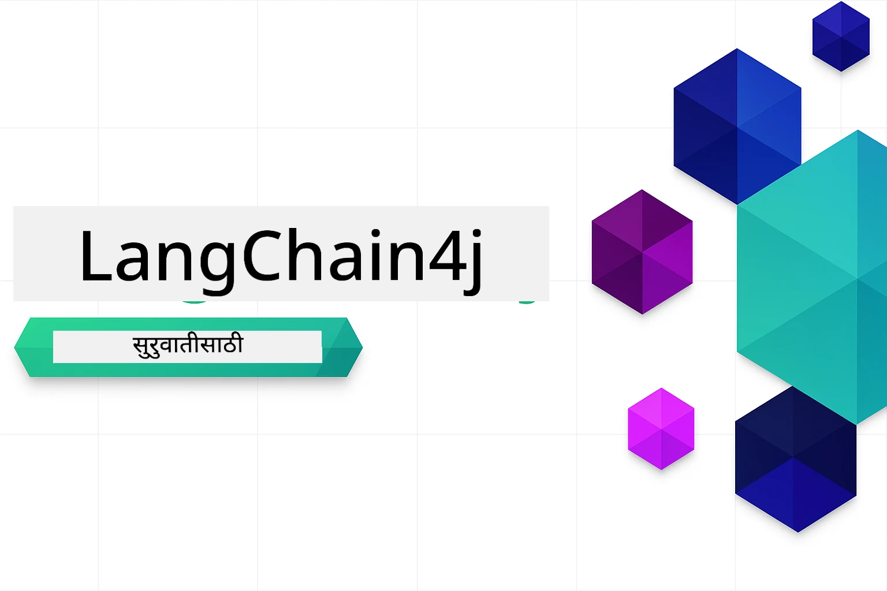

<!--
CO_OP_TRANSLATOR_METADATA:
{
  "original_hash": "6a3bd54fc243ce3dc79d18848d2b5413",
  "translation_date": "2026-01-05T22:37:03+00:00",
  "source_file": "README.md",
  "language_code": "mr"
}
-->


### 🌐 बहुभाषिक समर्थन

#### GitHub अॅक्शनद्वारे समर्थित (स्वयंचलित आणि नेहमी अद्ययावत)

<!-- CO-OP TRANSLATOR LANGUAGES TABLE START -->
[अरबी](../ar/README.md) | [बंगाली](../bn/README.md) | [बल्गेरियन](../bg/README.md) | [बर्मी (म्यानमार)](../my/README.md) | [चीनी (सरलीकृत)](../zh/README.md) | [चीनी (परंपरागत, हाँगकाँग)](../hk/README.md) | [चीनी (परंपरागत, मकाऊ)](../mo/README.md) | [चीनी (परंपरागत, तैवान)](../tw/README.md) | [क्रोएशियन](../hr/README.md) | [चेक](../cs/README.md) | [डॅनिश](../da/README.md) | [डच](../nl/README.md) | [एस्टोनियन](../et/README.md) | [फिन्निश](../fi/README.md) | [फ्रेंच](../fr/README.md) | [जर्मन](../de/README.md) | [ग्रीक](../el/README.md) | [हिब्रू](../he/README.md) | [हिंदी](../hi/README.md) | [हंगेरियन](../hu/README.md) | [इंडोनेशियन](../id/README.md) | [इटालियन](../it/README.md) | [जपानी](../ja/README.md) | [कन्नड](../kn/README.md) | [कोरियन](../ko/README.md) | [लिथुआनियन](../lt/README.md) | [मलय](../ms/README.md) | [मलयाळम](../ml/README.md) | [मराठी](./README.md) | [नेपाली](../ne/README.md) | [नायजेरियन पिजिन](../pcm/README.md) | [नॉर्वेजियन](../no/README.md) | [फारशी (फारसी)](../fa/README.md) | [पोलिश](../pl/README.md) | [पोर्तगीज (ब्राझिल)](../br/README.md) | [पोर्तगीज (पोर्तुगाल)](../pt/README.md) | [पंजाबी (गुरमुखी)](../pa/README.md) | [रोमानीयन](../ro/README.md) | [रशियन](../ru/README.md) | [सर्बियन (सिरिलिक)](../sr/README.md) | [स्लोव्हाक](../sk/README.md) | [स्लोव्हेनियन](../sl/README.md) | [स्पॅनिश](../es/README.md) | [स्वाहिली](../sw/README.md) | [स्वीडिश](../sv/README.md) | [तागालॉग (फिलिपिनो)](../tl/README.md) | [तमिळ](../ta/README.md) | [तेलुगू](../te/README.md) | [थाई](../th/README.md) | [तुर्की](../tr/README.md) | [युक्रेनियन](../uk/README.md) | [उर्दू](../ur/README.md) | [व्हिएतनामी](../vi/README.md)

> **स्थानिक पद्धतीने क्लोन करणे प्राधान्य द्यायचे?**

> या रेपॉजिटरीमध्ये ५०+ भाषा भाषांतर समाविष्ट आहेत ज्यामुळे डाउनलोड आकार लक्षणीयपणे वाढतो. भाषांतरांशिवाय क्लोन करण्यासाठी, sparse checkout वापरा:
> ```bash
> git clone --filter=blob:none --sparse https://github.com/microsoft/LangChain4j-for-Beginners.git
> cd LangChain4j-for-Beginners
> git sparse-checkout set --no-cone '/*' '!translations' '!translated_images'
> ```
> यामुळे तुम्हाला कोर्स पूर्ण करण्यासाठी आवश्यक ते सर्व काही जलद डाउनलोडसह मिळते.
<!-- CO-OP TRANSLATOR LANGUAGES TABLE END -->

# सुरुवातीसाठी LangChain4j

LangChain4j आणि Azure OpenAI GPT-5 सह AI अनुप्रयोग तयार करण्यासाठी एक कोर्स, मूलभूत चॅटपासून AI एजंटपर्यंत.

**LangChain4j मध्ये नवीन आहात?** मुख्य संकल्पना आणि संज्ञांसाठी [शब्दकोश](docs/GLOSSARY.md) पहा.

## आशय सूची

1. [जलद प्रारंभ](00-quick-start/README.md) - LangChain4j सह प्रारंभ करा
2. [परिचय](01-introduction/README.md) - LangChain4j ची मूलतत्त्वे शिका
3. [प्रॉम्प्ट अभियांत्रिकी](02-prompt-engineering/README.md) - प्रभावी प्रॉम्प्ट डिझाइनमध्ये पारंगत व्हा
4. [RAG (रिट्रीव्हल-अग्मेंटेड जनरेशन)](03-rag/README.md) - बुद्धिमान ज्ञान-आधारित प्रणाली तयार करा
5. [साधने](04-tools/README.md) - बाह्य साधने आणि सोप्या सहाय्यकांना समाकलित करा
6. [MCP (मॉडेल संदर्भ प्रोटोकॉल)](05-mcp/README.md) - मॉडेल संदर्भ प्रोटोकॉल (MCP) आणि एजंटिक मॉड्यूलसह कार्य करा
---

##  शिकण्याचा मार्ग

> **जलद प्रारंभ**

1. हा रेपॉजिटरी तुमच्या GitHub खात्यात Fork करा
2. क्लिक करा **Code** → **Codespaces** टॅब → **...** → **New with options...**
3. डीफॉल्ट्स वापराः हा कोर्ससाठी तयार केलेला Development कंटेनर निवडेल
4. क्लिक करा **Create codespace**
5. पर्यावरण तयार होण्यास ५-१० मिनिटे थांबा
6. सुरुवात करण्यासाठी थेट जा [जलद प्रारंभ](./00-quick-start/README.md) वर!

> **स्थानिक पद्धतीने क्लोन करणे प्राधान्य द्यायचे?**
>
> या रेपॉजिटरीमध्ये ५०+ भाषा भाषांतर समाविष्ट आहेत ज्यामुळे डाउनलोडचा आकार वाढतो. भाषांतरांशिवाय क्लोन करण्यासाठी sparse checkout वापरा:
> ```bash
> git clone --filter=blob:none --sparse https://github.com/microsoft/LangChain4j-for-Beginners.git
> cd LangChain4j-for-Beginners
> git sparse-checkout set --no-cone '/*' '!translations' '!translated_images'
> ```
> यामुळे तुम्हाला कोर्स पूर्ण करण्यासाठी आवश्यक सर्वकाही खूप जलद डाउनलोडसह मिळेल.

मॉड्यूल पूर्ण केल्यानंतर, LangChain4j च्या चाचणी संकल्पना प्रत्यक्षात पाहण्यासाठी [चाचणी मार्गदर्शक](docs/TESTING.md) बघा.

> **टीप:** या प्रशिक्षणात GitHub मॉडेल्स आणि Azure OpenAI दोन्ही वापरले जातात. [जलद प्रारंभ](00-quick-start/README.md) मॉड्यूल GitHub मॉडेल्स वापरतो (Azure सदस्यत्व आवश्यक नाही), तर मॉड्यूल १-५ मध्ये Azure OpenAI वापरले जाते.


## GitHub Copilot सह शिक्षण

कोडिंग लवकर सुरू करण्यासाठी, GitHub Codespace किंवा तुमच्या स्थानिक IDE मध्ये या प्रोजेक्टला devcontainer सह उघडा. या कोर्समध्ये वापरलेले devcontainer GitHub Copilot सह पूर्व-संरचित आहे जे AI जोडलेले प्रोग्रामिंग सुविधा देते.

प्रत्येक कोड उदाहरणात GitHub Copilot कडे विचारण्यास सुचविलेल्या प्रश्नांचा समावेश आहे ज्यामुळे तुमची समज अधिक चांगली होते. 💡/🤖 संकेतांसाठी पहा:

- **जावा फाइल हेडर** - प्रत्येक उदाहरणासाठी विशिष्ट प्रश्न
- **मॉड्यूल README** - कोड उदाहरणानंतरचे एक्सप्लोरेशन संकेत

**कसे वापरायचे:** कोणतीही कोड फाइल उघडा आणि Copilot कडे सुचवलेले प्रश्न विचारा. त्याला कोडबेसचा पूर्ण संदर्भ आहे आणि तो समजावून सांगू शकतो, विस्तार करू शकतो, तसेच पर्याय सुचवू शकतो.

अजून शिकायचे आहे का? बघा [AI जोडलेले जोडलेले प्रोग्रामिंगसाठी Copilot](https://aka.ms/GitHubCopilotAI).


## अतिरिक्त स्रोत

<!-- CO-OP TRANSLATOR OTHER COURSES START -->
### LangChain
[](https://aka.ms/langchain4j-for-beginners)
[](https://aka.ms/langchainjs-for-beginners?WT.mc_id=m365-94501-dwahlin)

---

### Azure / Edge / MCP / एजंट्स
[](https://github.com/microsoft/AZD-for-beginners?WT.mc_id=academic-105485-koreyst)
[](https://github.com/microsoft/edgeai-for-beginners?WT.mc_id=academic-105485-koreyst)
[](https://github.com/microsoft/mcp-for-beginners?WT.mc_id=academic-105485-koreyst)
[](https://github.com/microsoft/ai-agents-for-beginners?WT.mc_id=academic-105485-koreyst)

---
 
### जनरेटिव AI मालिकेत
[](https://github.com/microsoft/generative-ai-for-beginners?WT.mc_id=academic-105485-koreyst)
[-9333EA?style=for-the-badge&labelColor=E5E7EB&color=9333EA)](https://github.com/microsoft/Generative-AI-for-beginners-dotnet?WT.mc_id=academic-105485-koreyst)
[-C084FC?style=for-the-badge&labelColor=E5E7EB&color=C084FC)](https://github.com/microsoft/generative-ai-for-beginners-java?WT.mc_id=academic-105485-koreyst)
[-E879F9?style=for-the-badge&labelColor=E5E7EB&color=E879F9)](https://github.com/microsoft/generative-ai-with-javascript?WT.mc_id=academic-105485-koreyst)

---
 
### मुख्य शिक्षण
[](https://aka.ms/ml-beginners?WT.mc_id=academic-105485-koreyst)
[](https://aka.ms/datascience-beginners?WT.mc_id=academic-105485-koreyst)
[](https://aka.ms/ai-beginners?WT.mc_id=academic-105485-koreyst)
[](https://github.com/microsoft/Security-101?WT.mc_id=academic-96948-sayoung)
[](https://aka.ms/webdev-beginners?WT.mc_id=academic-105485-koreyst)
[](https://aka.ms/iot-beginners?WT.mc_id=academic-105485-koreyst)
[](https://github.com/microsoft/xr-development-for-beginners?WT.mc_id=academic-105485-koreyst)

---
 
### कॉपिलॉट मालिका
[](https://aka.ms/GitHubCopilotAI?WT.mc_id=academic-105485-koreyst)
[](https://github.com/microsoft/mastering-github-copilot-for-dotnet-csharp-developers?WT.mc_id=academic-105485-koreyst)
[](https://github.com/microsoft/CopilotAdventures?WT.mc_id=academic-105485-koreyst)
<!-- CO-OP TRANSLATOR OTHER COURSES END -->

## मदत मिळवा

जर तुम्हाला अडचण आल्यास किंवा AI अॅप्स तयार करताना काही प्रश्न असतील, तेव्हा सामील व्हा:

[](https://aka.ms/foundry/discord)

जर तुम्हाला उत्पादनाबाबत अभिप्राय किंवा त्रुटी असल्यास, येथे भेट द्या:

[](https://aka.ms/foundry/forum)

## परवाना

MIT परवाना - तपशीलासाठी [LICENSE](../../LICENSE) फाइल पहा.

---

<!-- CO-OP TRANSLATOR DISCLAIMER START -->
**सूचना**:
हा दस्तऐवज AI भाषांतर सेवा [Co-op Translator](https://github.com/Azure/co-op-translator) चा वापर करून भाषांतरित केला आहे. आम्ही अचूकतेसाठी प्रयत्नशील असलो तरी, कृपया ध्यानात घ्या की स्वयंचलित भाषांतरांमध्ये चुका किंवा अचूकतेची त्रुटी असू शकतात. मूळ दस्तऐवज त्याच्या स्थानिक भाषेत अधिकृत स्रोत मानला जावा. महत्त्वपूर्ण माहितीसाठी व्यावसायिक मानवी भाषांतराची शिफारस केली जाते. या भाषांतराचा वापर केल्यामुळे उद्भवणाऱ्या कोणत्याही गैरसमजुती किंवा चुकीच्या अर्थ लावण्याबाबत आम्ही जबाबदार नाही.
<!-- CO-OP TRANSLATOR DISCLAIMER END -->