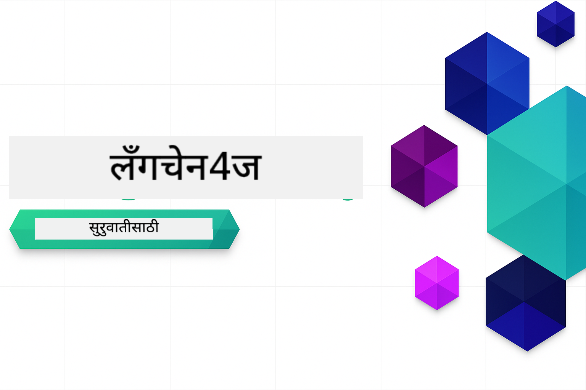

<!--
CO_OP_TRANSLATOR_METADATA:
{
  "original_hash": "d61ab6c245562094cc3dddecf08b50d3",
  "translation_date": "2025-12-30T22:50:09+00:00",
  "source_file": "README.md",
  "language_code": "mr"
}
-->


### 🌐 बहुभाषिक समर्थन

#### GitHub Action द्वारे समर्थित (स्वयंचलित आणि नेहमी अद्यतित)

<!-- CO-OP TRANSLATOR LANGUAGES TABLE START -->
[अरबी](../ar/README.md) | [बंगाली](../bn/README.md) | [बुल्गेरियन](../bg/README.md) | [बर्मी (म्यानमार)](../my/README.md) | [चिनी (सरलीकृत)](../zh/README.md) | [चिनी (परंपरागत, हॉंगकाँग)](../hk/README.md) | [चिनी (परंपरागत, मकाऊ)](../mo/README.md) | [चिनी (परंपरागत, तैवान)](../tw/README.md) | [क्रोएशियन](../hr/README.md) | [चेक](../cs/README.md) | [डॅनिश](../da/README.md) | [डच](../nl/README.md) | [इस्टोनियन](../et/README.md) | [फिन्निश](../fi/README.md) | [फ्रेंच](../fr/README.md) | [जर्मन](../de/README.md) | [ग्रीक](../el/README.md) | [हिब्रू](../he/README.md) | [हिंदी](../hi/README.md) | [हंगेरीयन](../hu/README.md) | [इंडोनेशियन](../id/README.md) | [इटालियन](../it/README.md) | [जपानी](../ja/README.md) | [कन्नड](../kn/README.md) | [कोरियन](../ko/README.md) | [लिथुआनीयन](../lt/README.md) | [मलय](../ms/README.md) | [मलयाळम](../ml/README.md) | [मराठी](./README.md) | [नेपाळी](../ne/README.md) | [नायजेरियन पिजिन](../pcm/README.md) | [नॉर्वेजियन](../no/README.md) | [फारसी (पर्सियन)](../fa/README.md) | [पोलिश](../pl/README.md) | [पोर्तुगीज (ब्राझील)](../br/README.md) | [पोर्तुगीज (पोर्तुगल)](../pt/README.md) | [पंजाबी (गुरमुखी)](../pa/README.md) | [रोमानियन](../ro/README.md) | [रशियन](../ru/README.md) | [सर्बियन (सिरिलिक)](../sr/README.md) | [स्लोव्हाक](../sk/README.md) | [स्लोव्हेनियन](../sl/README.md) | [स्पॅनिश](../es/README.md) | [स्वाहिली](../sw/README.md) | [स्वीडिश](../sv/README.md) | [तागालॉग (फिलिपिनो)](../tl/README.md) | [तमिळ](../ta/README.md) | [तेलुगू](../te/README.md) | [थाई](../th/README.md) | [तुर्की](../tr/README.md) | [युक्रेनियन](../uk/README.md) | [उर्दू](../ur/README.md) | [व्हिएतनामी](../vi/README.md)
<!-- CO-OP TRANSLATOR LANGUAGES TABLE END -->

# LangChain4j नवशिक्यांसाठी

LangChain4j आणि Azure OpenAI GPT-5 वापरून बेसिक चॅटपासून AI एजंटपर्यंत AI अनुप्रयोग तयार करण्यासाठी एक कोर्स.

**LangChain4j मध्ये नव्हेत?** महत्त्वाच्या संज्ञा आणि संकल्पनांच्या व्याख्यांसाठी [शब्दसंग्रह](docs/GLOSSARY.md) पाहा.

## Table of Contents

1. [त्वरित प्रारंभ](00-quick-start/README.md) - LangChain4j सह सुरुवात करा
2. [परिचय](01-introduction/README.md) - LangChain4j च्या मूलभूत तत्त्वे शिका
3. [प्रॉम्प्ट अभियांत्रिकी](02-prompt-engineering/README.md) - प्रभावी प्रॉम्प्ट डिझाइनमध्ये निपुण व्हा
4. [RAG (रिट्रीव्हल-ऑगमेंटेड जनरेशन)](03-rag/README.md) - बुद्धिमान ज्ञान-आधारित प्रणाली तयार करा
5. [टूल्स](04-tools/README.md) - बाह्य साधने आणि साधे सहाय्यक एकत्र करा
6. [MCP (मॉडेल कॉन्टेक्स्ट प्रोटोकॉल)](05-mcp/README.md) - Model Context Protocol (MCP) आणि एजेंटिक मॉड्युल्ससह काम करा
---

##  शिकण्याचा मार्ग

> **त्वरित प्रारंभ**

1. हा रिपॉझिटरी आपल्या GitHub खात्यात Fork करा
2. क्लिक करा **Code** → **Codespaces** टॅब → **...** → **New with options...**
3. डिफॉल्ट वापरा – हे या कोर्ससाठी तयार केलेला Development कंटेनर निवडेल
4. क्लिक करा **Create codespace**
5. वातावरण तयार होईपर्यंत 5-10 मिनिटे प्रतीक्षा करा
6. थेट [त्वरित प्रारंभ](./00-quick-start/README.md) वर जा आणि सुरुवात करा!

> **स्थानिकपणे क्लोन करायचे का?**
>
> या रिपॉझिटरीमध्ये 50+ भाषा अनुवाद समाविष्ट आहेत ज्यामुळे डाउनलोड आकार लक्षणीयपणे वाढतो. अनुवादांशिवाय क्लोन करण्यासाठी sparse checkout वापरा:
> ```bash
> git clone --filter=blob:none --sparse https://github.com/microsoft/LangChain4j-for-Beginners.git
> cd LangChain4j-for-Beginners
> git sparse-checkout set --no-cone '/*' '!translations' '!translated_images'
> ```
> हे आपल्याला कोर्स पूर्ण करण्यासाठी आवश्यक असलेले सर्व काही देते आणि डाउनलोड खूप जलद होते.

मॉड्युल पूर्ण केल्यानंतर, LangChain4j च्या चाचणी संकल्पना प्रत्यक्षात कशा काम करतात ते पाहण्यासाठी [चाचणी मार्गदर्शक](docs/TESTING.md) तपासा.

> **टीप:** हे प्रशिक्षण GitHub Models आणि Azure OpenAI दोन्ही वापरते. [त्वरित प्रारंभ](00-quick-start/README.md) आणि [MCP](05-mcp/README.md) मॉड्यूल GitHub Models वापरतात (Azure सदस्यता आवश्यक नाही), तर मॉड्यूल 1-4 Azure OpenAI GPT-5 वापरतात.


## GitHub Copilot सह शिकणे

त्वरितपणे कोडिंग सुरू करण्यासाठी, हा प्रकल्प GitHub Codespace मध्ये किंवा प्रदान केलेल्या devcontainer सह आपल्या स्थानिक IDE मध्ये उघडा. या कोर्समध्ये वापरलेला devcontainer GitHub Copilot साठी AI जोड-प्रोग्रामिंगसाठी पूर्व-संकलित आहे.

प्रत्येक कोड उदाहरणात सुचवलेले प्रश्न आहेत जे आपण GitHub Copilot कडे विचारू शकता जेणेकरून आपले समज अधिक खोल होईल. खालील ठिकाणी 💡/🤖 प्रॉम्प्ट शोधा:

- **Java फाइल हेडर** - प्रत्येक उदाहरणासाठी विशिष्ट प्रश्न
- **मॉड्युल README** - कोड उदाहरणांनंतर अन्वेषण प्रॉम्प्ट

**कसे वापरायचे:** कोणतीही कोड फाइल उघडा आणि Copilot ला सुचवलेले प्रश्न विचारा. त्याला कोडबेसचा पूर्ण संदर्भ आहे आणि ते समजावून सांगू शकते, विस्तारित करू शकते आणि पर्याय सुचवू शकते.

अधिक जाणून घ्यायचे आहे? [AI जोडलेले प्रोग्रामिंगसाठी Copilot](https://aka.ms/GitHubCopilotAI) पाहा.


## अतिरिक्त संसाधने

<!-- CO-OP TRANSLATOR OTHER COURSES START -->
### LangChain
[](https://aka.ms/langchain4j-for-beginners)
[](https://aka.ms/langchainjs-for-beginners?WT.mc_id=m365-94501-dwahlin)

---

### Azure / Edge / MCP / Agents
[](https://github.com/microsoft/AZD-for-beginners?WT.mc_id=academic-105485-koreyst)
[](https://github.com/microsoft/edgeai-for-beginners?WT.mc_id=academic-105485-koreyst)
[](https://github.com/microsoft/mcp-for-beginners?WT.mc_id=academic-105485-koreyst)
[](https://github.com/microsoft/ai-agents-for-beginners?WT.mc_id=academic-105485-koreyst)

---
 
### जनरेटिव्ह AI सिरीज
[](https://github.com/microsoft/generative-ai-for-beginners?WT.mc_id=academic-105485-koreyst)
[-9333EA?style=for-the-badge&labelColor=E5E7EB&color=9333EA)](https://github.com/microsoft/Generative-AI-for-beginners-dotnet?WT.mc_id=academic-105485-koreyst)
[-C084FC?style=for-the-badge&labelColor=E5E7EB&color=C084FC)](https://github.com/microsoft/generative-ai-for-beginners-java?WT.mc_id=academic-105485-koreyst)
[-E879F9?style=for-the-badge&labelColor=E5E7EB&color=E879F9)](https://github.com/microsoft/generative-ai-with-javascript?WT.mc_id=academic-105485-koreyst)

---
 
### मूलभूत शिक्षण
[](https://aka.ms/ml-beginners?WT.mc_id=academic-105485-koreyst)
[](https://aka.ms/datascience-beginners?WT.mc_id=academic-105485-koreyst)
[](https://aka.ms/ai-beginners?WT.mc_id=academic-105485-koreyst)
[](https://github.com/microsoft/Security-101?WT.mc_id=academic-96948-sayoung)
[](https://aka.ms/webdev-beginners?WT.mc_id=academic-105485-koreyst)
[](https://aka.ms/iot-beginners?WT.mc_id=academic-105485-koreyst)
[](https://github.com/microsoft/xr-development-for-beginners?WT.mc_id=academic-105485-koreyst)

---
 
### Copilot Series
[](https://aka.ms/GitHubCopilotAI?WT.mc_id=academic-105485-koreyst)
[](https://github.com/microsoft/mastering-github-copilot-for-dotnet-csharp-developers?WT.mc_id=academic-105485-koreyst)
[](https://github.com/microsoft/CopilotAdventures?WT.mc_id=academic-105485-koreyst)
<!-- CO-OP TRANSLATOR OTHER COURSES END -->

## मदत मिळवा

जर तुम्हाला अडचण आली किंवा AI अॅप्स तयार करण्याबद्दल काही प्रश्न असतील, तर सामील व्हा:

[](https://aka.ms/foundry/discord)

जर उत्पादनाबद्दल अभिप्राय असेल किंवा तयार करताना त्रुटी आढळल्यास येथे भेट द्या:

[](https://aka.ms/foundry/forum)

## परवाना

MIT परवाना - तपशीलांसाठी [LICENSE](../../LICENSE) फाईल पहा.

---

<!-- CO-OP TRANSLATOR DISCLAIMER START -->
अस्वीकरण:
हा दस्तऐवज AI अनुवाद सेवा Co-op Translator (https://github.com/Azure/co-op-translator) वापरून अनुवादित केला आहे. आम्ही अचूकतेसाठी प्रयत्न करतो, परंतु कृपया लक्षात घ्या की स्वयंचलित अनुवादांमध्ये चुका किंवा अचूकतेतील त्रुटी असू शकतात. मूळ दस्तऐवज त्याच्या मूळ भाषेत अधिकृत स्रोत म्हणून मानला पाहिजे. महत्त्वाच्या माहितीसाठी व्यावसायिक मानवी अनुवाद करणे शिफारसीय आहे. या अनुवादाच्या वापरामुळे उद्भवणाऱ्या कोणत्याही गैरसमजांबद्दल किंवा चुकीच्या अर्थलागीबद्दल आम्ही जबाबदार नाही.
<!-- CO-OP TRANSLATOR DISCLAIMER END -->