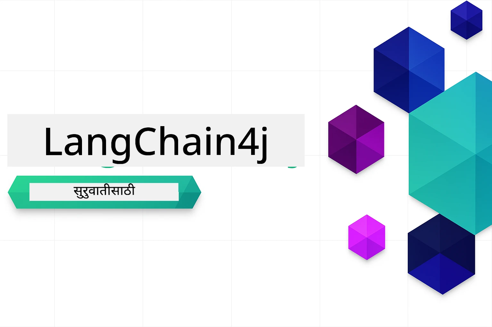

# LangChain4j प्रारंभिकांसाठी

LangChain4j आणि Azure OpenAI GPT-5.2 सह AI अनुप्रयोग निर्माण करण्यासाठी एक अभ्यासक्रम, मूलभूत चॅट ते AI एजंटपर्यंत.

### 🌐 बहुभाषिक समर्थन

#### GitHub Action द्वारे समर्थित (स्वयंचलित आणि नेहमी अद्ययावत)

<!-- CO-OP TRANSLATOR LANGUAGES TABLE START -->
[Arabic](../ar/README.md) | [Bengali](../bn/README.md) | [Bulgarian](../bg/README.md) | [Burmese (Myanmar)](../my/README.md) | [Chinese (Simplified)](../zh-CN/README.md) | [Chinese (Traditional, Hong Kong)](../zh-HK/README.md) | [Chinese (Traditional, Macau)](../zh-MO/README.md) | [Chinese (Traditional, Taiwan)](../zh-TW/README.md) | [Croatian](../hr/README.md) | [Czech](../cs/README.md) | [Danish](../da/README.md) | [Dutch](../nl/README.md) | [Estonian](../et/README.md) | [Finnish](../fi/README.md) | [French](../fr/README.md) | [German](../de/README.md) | [Greek](../el/README.md) | [Hebrew](../he/README.md) | [Hindi](../hi/README.md) | [Hungarian](../hu/README.md) | [Indonesian](../id/README.md) | [Italian](../it/README.md) | [Japanese](../ja/README.md) | [Kannada](../kn/README.md) | [Khmer](../km/README.md) | [Korean](../ko/README.md) | [Lithuanian](../lt/README.md) | [Malay](../ms/README.md) | [Malayalam](../ml/README.md) | [Marathi](./README.md) | [Nepali](../ne/README.md) | [Nigerian Pidgin](../pcm/README.md) | [Norwegian](../no/README.md) | [Persian (Farsi)](../fa/README.md) | [Polish](../pl/README.md) | [Portuguese (Brazil)](../pt-BR/README.md) | [Portuguese (Portugal)](../pt-PT/README.md) | [Punjabi (Gurmukhi)](../pa/README.md) | [Romanian](../ro/README.md) | [Russian](../ru/README.md) | [Serbian (Cyrillic)](../sr/README.md) | [Slovak](../sk/README.md) | [Slovenian](../sl/README.md) | [Spanish](../es/README.md) | [Swahili](../sw/README.md) | [Swedish](../sv/README.md) | [Tagalog (Filipino)](../tl/README.md) | [Tamil](../ta/README.md) | [Telugu](../te/README.md) | [Thai](../th/README.md) | [Turkish](../tr/README.md) | [Ukrainian](../uk/README.md) | [Urdu](../ur/README.md) | [Vietnamese](../vi/README.md)

> **स्थानिकपणे क्लोन करणे प्राधान्य द्यायचे आहे?**
>
> या संग्रहात 50+ भाषा भाषांतर समाविष्ट आहेत ज्यामुळे डाउनलोडचा आकार लक्षणीय वाढतो. भाषांतरांशिवाय क्लोन करण्यासाठी sparse checkout वापरा:
>
> **Bash / macOS / Linux:**
> ```bash
> git clone --filter=blob:none --sparse https://github.com/microsoft/LangChain4j-for-Beginners.git
> cd LangChain4j-for-Beginners
> git sparse-checkout set --no-cone '/*' '!translations' '!translated_images'
> ```
>
> **CMD (Windows):**
> ```cmd
> git clone --filter=blob:none --sparse https://github.com/microsoft/LangChain4j-for-Beginners.git
> cd LangChain4j-for-Beginners
> git sparse-checkout set --no-cone "/*" "!translations" "!translated_images"
> ```
>
> यामुळे तुम्हाला अभ्यासक्रम पूर्ण करण्यासाठी आवश्यक सर्वकाही खूप वेगाने डाउनलोड होईल.
<!-- CO-OP TRANSLATOR LANGUAGES TABLE END -->

## मजकूर सूची

1. [परिचय](01-introduction/README.md) - LangChain4j चे मूलभूत तत्त्वे शिका
2. [प्रॉम्प्ट अभियांत्रिकी](02-prompt-engineering/README.md) - प्रभावी प्रॉम्प्ट डिझाइनमध्ये पारंगत व्हा
3. [RAG (Retrieval-Augmented Generation)](03-rag/README.md) - बुद्धिमान ज्ञानाधारित सिस्टम तयार करा
4. [टूल्स](04-tools/README.md) - बाह्य टूल्स आणि सोप्या सहाय्यकांशी एकत्रीकरण करा
5. [MCP (मॉडेल संदर्भ प्रोटोकॉल)](05-mcp/README.md) - Model Context Protocol (MCP) आणि Agentic मॉड्यूल्ससह काम करा

### व्हिडीओ मार्गदर्शने

प्रत्येक मॉड्यूलसाठी एक साथीदार थेट सत्र असते जिथे आपण संकल्पना आणि कोड टप्प्याटप्प्याने समजून घेऊ.

| मॉड्यूल | व्हिडीओ |
|--------|-------|
| 01 - परिचय | [LangChain4j सह सुरुवात](https://www.youtube.com/live/nl_troDm8rQ) |
| 02 - प्रॉम्प्ट अभियांत्रिकी | [LangChain4j सह प्रॉम्प्ट अभियांत्रिकी](https://www.youtube.com/live/PJ6aBaE6bog) |
| 03 - RAG | [LangChain4j सह RAG](https://www.youtube.com/watch?v=_olq75ZH_eY) |
| 04 - टूल्स & 05 - MCP | [टूल्स आणि MCP सह AI एजंट](https://www.youtube.com/watch?v=O_J30kZc0rw) |

---

##  शिकण्याचा मार्ग

**LangChain4j मध्ये नवीन आहात?** महत्त्वाच्या संज्ञा आणि संकल्पनांसाठी [शब्दसंचय](docs/GLOSSARY.md) पहा.

> **जलद प्रारंभ**

1. हा संग्रह तुमच्या GitHub खात्यावर Fork करा
2. क्लिक करा **Code** → **Codespaces** टॅब → **...** → **New with options...**
3. पूर्वनिर्धारित सेटिंग्ज वापरा – हे या अभ्यासक्रमासाठी तयार केलेल्या Development container निवडेल
4. क्लिक करा **Create codespace**
5. पर्यावरण तयार होण्यासाठी 5-10 मिनिटे थांबा
6. थेट [परिचय](./01-introduction/README.md) कडे जा आणि सुरुवात करा!

मॉड्यूल पूर्ण केल्यानंतर, LangChain4j च्या चाचणी संकल्पनांचा प्रत्यक्ष अनुभव घेण्यासाठी [चाचणी मार्गदर्शिका](docs/TESTING.md) एक्सप्लोर करा.

> **टीप:** हा प्रशिक्षण Azure OpenAI वापरतो. तुमच्याकडे नसेल तर [मुफत Azure खाते](https://aka.ms/azure-free-account) घेऊन सुरुवात करा.


## GitHub Copilot सह शिकणे

त्वरित कोडिंग सुरू करण्यासाठी, GitHub Codespace किंवा स्थानिक IDE मध्ये दिलेला devcontainer वापरून हा प्रकल्प उघडा. या अभ्यासक्रमात वापरलेला devcontainer GitHub Copilot ने पूर्व-निर्धारित आहे, ज्यामुळे AI जोडलेले प्रोग्रामिंग सोपे होते.

प्रत्येक कोड उदाहरणासह GitHub Copilot कडे विचारण्यासाठी सुचवलेले प्रश्न असतात, जे तुमची समज अधिक खोल करण्यात मदत करतात. 💡/🤖 या सुचनांवर लक्ष ठेवा:

- **Java फाइल हेडर्स** - प्रत्येक उदाहरणासंबंधित प्रश्न
- **मॉड्यूल README** - कोड उदाहरणानंतरच्या अन्वेषणासाठी प्रॉम्प्ट

**कसे वापरायचे:** कोणतीही कोड फाइल उघडा आणि Copilot ला सुचवलेले प्रश्न विचारा. त्याच्याकडे संपूर्ण कोड बेसचा संदर्भ आहे आणि तो स्पष्टीकरण, विस्तार आणि पर्याय सुचवू शकतो.

अधिक जाणून घ्यायचं? [AI जोडलेले प्रोग्रामिंगसाठी Copilot](https://aka.ms/GitHubCopilotAI) पहा.


## अतिरिक्त संसाधने

<!-- CO-OP TRANSLATOR OTHER COURSES START -->
### LangChain
[](https://aka.ms/langchain4j-for-beginners)
[](https://aka.ms/langchainjs-for-beginners?WT.mc_id=m365-94501-dwahlin)
[](https://github.com/microsoft/langchain-for-beginners?WT.mc_id=m365-94501-dwahlin)
---

### Azure / Edge / MCP / Agents
[](https://github.com/microsoft/AZD-for-beginners?WT.mc_id=academic-105485-koreyst)
[](https://github.com/microsoft/edgeai-for-beginners?WT.mc_id=academic-105485-koreyst)
[](https://github.com/microsoft/mcp-for-beginners?WT.mc_id=academic-105485-koreyst)
[](https://github.com/microsoft/ai-agents-for-beginners?WT.mc_id=academic-105485-koreyst)

---
 
### Generative AI Series
[](https://github.com/microsoft/generative-ai-for-beginners?WT.mc_id=academic-105485-koreyst)
[-9333EA?style=for-the-badge&labelColor=E5E7EB&color=9333EA)](https://github.com/microsoft/Generative-AI-for-beginners-dotnet?WT.mc_id=academic-105485-koreyst)
[-C084FC?style=for-the-badge&labelColor=E5E7EB&color=C084FC)](https://github.com/microsoft/generative-ai-for-beginners-java?WT.mc_id=academic-105485-koreyst)
[-E879F9?style=for-the-badge&labelColor=E5E7EB&color=E879F9)](https://github.com/microsoft/generative-ai-with-javascript?WT.mc_id=academic-105485-koreyst)

---
 
### Core Learning
[](https://aka.ms/ml-beginners?WT.mc_id=academic-105485-koreyst)
[](https://aka.ms/datascience-beginners?WT.mc_id=academic-105485-koreyst)
[](https://aka.ms/ai-beginners?WT.mc_id=academic-105485-koreyst)
[](https://github.com/microsoft/Security-101?WT.mc_id=academic-96948-sayoung)

[](https://aka.ms/webdev-beginners?WT.mc_id=academic-105485-koreyst)
[](https://aka.ms/iot-beginners?WT.mc_id=academic-105485-koreyst)
[](https://github.com/microsoft/xr-development-for-beginners?WT.mc_id=academic-105485-koreyst)

---
 
### Copilot मालिक
[](https://aka.ms/GitHubCopilotAI?WT.mc_id=academic-105485-koreyst)
[](https://github.com/microsoft/mastering-github-copilot-for-dotnet-csharp-developers?WT.mc_id=academic-105485-koreyst)
[](https://github.com/microsoft/CopilotAdventures?WT.mc_id=academic-105485-koreyst)
<!-- CO-OP TRANSLATOR OTHER COURSES END -->

## मदत घेणे

जर आपण अडकलात किंवा AI अॅप्स तयार करण्याबाबत कोणतेही प्रश्न असतील, तर सामील व्हा:

[](https://aka.ms/foundry/discord)

जर आपल्याकडे उत्पादनावर प्रतिसाद किंवा त्रुटी असतील तर भेट द्या:

[](https://aka.ms/foundry/forum)

## परवाना

MIT परवाना - तपशीलांसाठी [LICENSE](../../LICENSE) फाईल पहा.

---

<!-- CO-OP TRANSLATOR DISCLAIMER START -->
**अस्वीकरण**:
हा दस्तऐवज AI भाषांतर सेवा [Co-op Translator](https://github.com/Azure/co-op-translator) चा वापर करून अनुवादित केला आहे. जरी आम्ही अचूकतेसाठी प्रयत्न करतो, तरी कृपया लक्षात घ्या की स्वयंचलित भाषांतरांमध्ये त्रुटी किंवा अचूकतेची कमतरता असू शकते. मूळ दस्तऐवज त्याच्या मूळ भाषेत अधिकृत स्रोत मानला पाहिजे. महत्त्वाची माहिती असल्यास, व्यावसायिक मानवी भाषांतराची शिफारस केली जाते. या भाषांतराच्या वापरामुळे उद्भवणाऱ्या कोणत्याही गैरसमज किंवा चुकीच्या अर्थलावणीसाठी आम्ही जबाबदार नाही.
<!-- CO-OP TRANSLATOR DISCLAIMER END -->