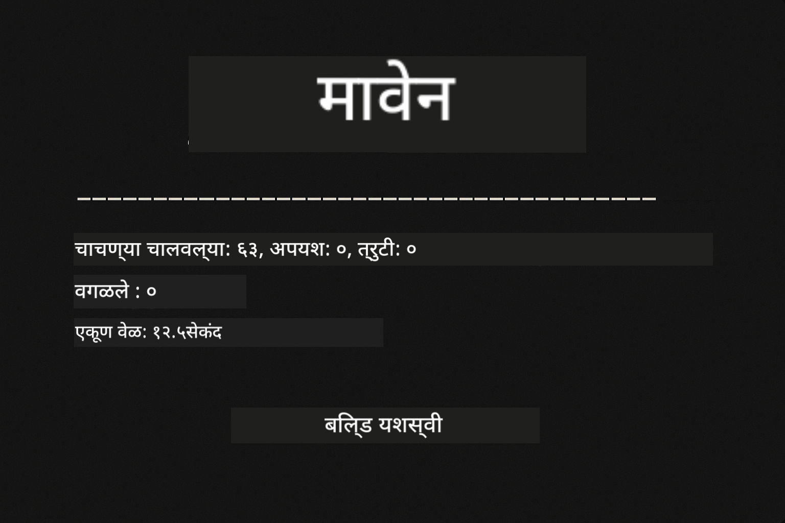
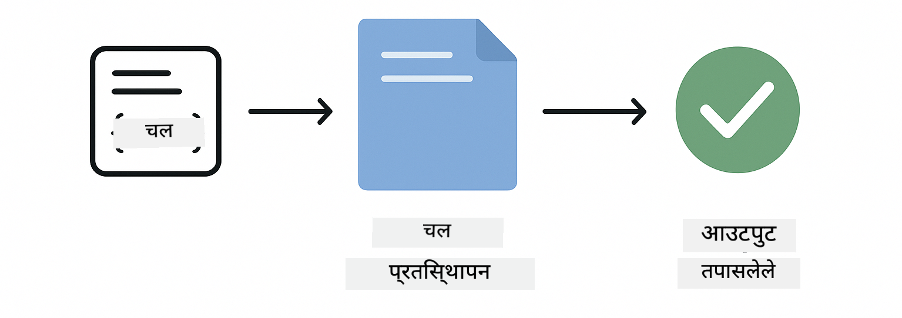
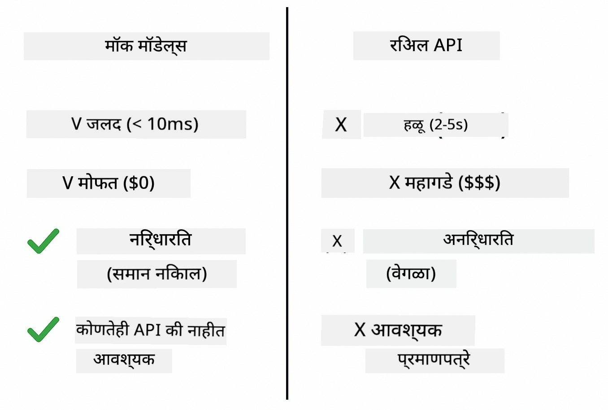
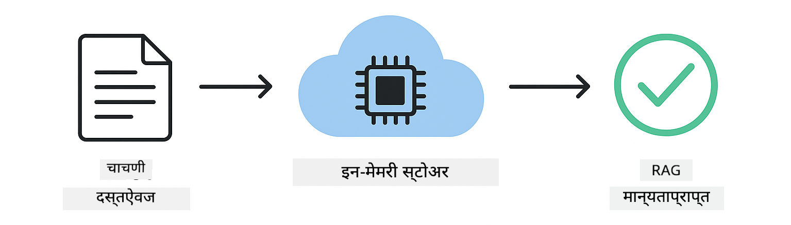

<!--
CO_OP_TRANSLATOR_METADATA:
{
  "original_hash": "b975537560c404d5f254331832811e78",
  "translation_date": "2025-12-13T20:51:40+00:00",
  "source_file": "docs/TESTING.md",
  "language_code": "mr"
}
-->
# LangChain4j अनुप्रयोगांची चाचणी करणे

## अनुक्रमणिका

- [त्वरित प्रारंभ](../../../docs)
- [चाचण्या काय कव्हर करतात](../../../docs)
- [चाचण्या कशा चालवायच्या](../../../docs)
- [VS कोडमध्ये चाचण्या चालवणे](../../../docs)
- [चाचणी नमुने](../../../docs)
- [चाचणी तत्त्वज्ञान](../../../docs)
- [पुढील पावले](../../../docs)

हा मार्गदर्शक तुम्हाला अशा चाचण्यांद्वारे मार्गदर्शन करतो ज्यात API की किंवा बाह्य सेवा न वापरता AI अनुप्रयोगांची चाचणी कशी करायची हे दाखवले आहे.

## त्वरित प्रारंभ

सर्व चाचण्या एका आदेशाने चालवा:

**Bash:**
```bash
mvn test
```

**PowerShell:**
```powershell
mvn --% test
```



*सर्व चाचण्या यशस्वीपणे पार पडल्याचे दाखवणारा निकाल, शून्य अपयशांसह*

## चाचण्या काय कव्हर करतात

हा अभ्यासक्रम स्थानिकपणे चालणाऱ्या **युनिट चाचण्यांवर** लक्ष केंद्रित करतो. प्रत्येक चाचणी स्वतंत्रपणे LangChain4j चा एक विशिष्ट संकल्पना दाखवते.


*चाचणी पिरॅमिड दाखवते की युनिट चाचण्या (जलद, स्वतंत्र), इंटिग्रेशन चाचण्या (खरे घटक), आणि एंड-टू-एंड चाचण्या (पूर्ण प्रणाली Docker सह) यांच्यात संतुलन कसे आहे. हा प्रशिक्षण युनिट चाचणीवर केंद्रित आहे.*

| मॉड्यूल | चाचण्या | लक्ष केंद्रित | मुख्य फायली |
|--------|-------|-------|-----------|
| **00 - त्वरित प्रारंभ** | 6 | प्रॉम्प्ट टेम्पलेट्स आणि चल बदल | `SimpleQuickStartTest.java` |
| **01 - परिचय** | 8 | संभाषण स्मृती आणि स्थितीपूर्ण चॅट | `SimpleConversationTest.java` |
| **02 - प्रॉम्प्ट अभियांत्रिकी** | 12 | GPT-5 नमुने, उत्सुकता पातळ्या, संरचित आउटपुट | `SimpleGpt5PromptTest.java` |
| **03 - RAG** | 10 | दस्तऐवज समावेशन, एम्बेडिंग्ज, सादृश्य शोध | `DocumentServiceTest.java` |
| **04 - साधने** | 12 | फंक्शन कॉलिंग आणि टूल चेनिंग | `SimpleToolsTest.java` |
| **05 - MCP** | 15 | मॉडेल कॉन्टेक्स्ट प्रोटोकॉल Docker सह | `SimpleMcpTest.java`, `McpDockerTransportTest.java`` |

## चाचण्या कशा चालवायच्या

**रूटमधून सर्व चाचण्या चालवा:**

**Bash:**
```bash
mvn test
```

**PowerShell:**
```powershell
mvn --% test
```

**विशिष्ट मॉड्यूलसाठी चाचण्या चालवा:**

**Bash:**
```bash
cd 01-introduction && mvn test
# किंवा मूळ पासून
mvn test -pl 01-introduction
```

**PowerShell:**
```powershell
cd 01-introduction; mvn --% test
# किंवा मूळ पासून
mvn --% test -pl 01-introduction
```

**एकल चाचणी वर्ग चालवा:**

**Bash:**
```bash
mvn test -Dtest=SimpleConversationTest
```

**PowerShell:**
```powershell
mvn --% test -Dtest=SimpleConversationTest
```

**विशिष्ट चाचणी पद्धत चालवा:**

**Bash:**
```bash
mvn test -Dtest=SimpleConversationTest#संभाषण इतिहास राखावा
```

**PowerShell:**
```powershell
mvn --% test -Dtest=SimpleConversationTest#संभाषण इतिहास राखावा
```

## VS कोडमध्ये चाचण्या चालवणे

जर तुम्ही Visual Studio Code वापरत असाल, तर Test Explorer चाचण्या चालवण्यासाठी आणि डीबग करण्यासाठी ग्राफिकल इंटरफेस प्रदान करतो.


*VS कोड टेस्ट एक्सप्लोरर सर्व Java चाचणी वर्ग आणि वैयक्तिक चाचणी पद्धतींसह चाचणी झाड दाखवत आहे*

**VS कोडमध्ये चाचण्या चालवण्यासाठी:**

1. Activity Bar मधील बीकर आयकॉनवर क्लिक करून Test Explorer उघडा
2. सर्व मॉड्यूल आणि चाचणी वर्ग पाहण्यासाठी चाचणी झाड विस्तृत करा
3. एखाद्या चाचणीशेजारी प्ले बटणावर क्लिक करून ती स्वतंत्रपणे चालवा
4. संपूर्ण संच चालवण्यासाठी "Run All Tests" क्लिक करा
5. कोणत्याही चाचणीवर उजवे क्लिक करा आणि "Debug Test" निवडा, ब्रेकपॉइंट सेट करा आणि कोडमध्ये पावलोपावली जा

Test Explorer यशस्वी चाचण्यांसाठी हिरव्या तपास चिन्हे दाखवतो आणि चाचणी अयशस्वी झाल्यास तपशीलवार अपयश संदेश प्रदान करतो.

## चाचणी नमुने


*LangChain4j अनुप्रयोगांसाठी सहा चाचणी नमुने: प्रॉम्प्ट टेम्पलेट्स, मॉकींग मॉडेल्स, संभाषण पृथक्करण, साधने चाचणी, इन-मेमरी RAG, आणि Docker इंटिग्रेशन*

### नमुना 1: प्रॉम्प्ट टेम्पलेट्सची चाचणी

सर्वात सोपा नमुना AI मॉडेल कॉल न करता प्रॉम्प्ट टेम्पलेट्सची चाचणी करतो. तुम्ही तपासता की चल बदल योग्यरित्या कार्य करतो आणि प्रॉम्प्ट अपेक्षेनुसार स्वरूपित आहेत.



*प्रॉम्प्ट टेम्पलेट्सची चाचणी दाखवते की चल बदल कसा होतो: प्लेसहोल्डर्ससह टेम्पलेट → मूल्ये लागू केली → स्वरूपित आउटपुट पडताळले*

```java
@Test
@DisplayName("Should format prompt template with variables")
void testPromptTemplateFormatting() {
    PromptTemplate template = PromptTemplate.from(
        "Best time to visit {{destination}} for {{activity}}?"
    );
    
    Prompt prompt = template.apply(Map.of(
        "destination", "Paris",
        "activity", "sightseeing"
    ));
    
    assertThat(prompt.text()).isEqualTo("Best time to visit Paris for sightseeing?");
}
```

ही चाचणी `00-quick-start/src/test/java/com/example/langchain4j/quickstart/SimpleQuickStartTest.java` मध्ये आहे.

**चालवा:**

**Bash:**
```bash
cd 00-quick-start && mvn test -Dtest=SimpleQuickStartTest#चाचणीप्रॉम्प्टटेम्पलेटफॉरमॅटिंग
```

**PowerShell:**
```powershell
cd 00-quick-start; mvn --% test -Dtest=SimpleQuickStartTest#चाचणीप्रॉम्प्टटेम्पलेटफॉरमॅटिंग
```

### नमुना 2: भाषा मॉडेल्सचे मॉकिंग

संभाषण लॉजिकची चाचणी करताना, Mockito वापरून नकली मॉडेल तयार करा जे पूर्वनिर्धारित प्रतिसाद परत करतात. यामुळे चाचण्या जलद, मोफत आणि निश्चित होतात.



*चाचणीसाठी मॉक का प्राधान्य दिले जाते हे दाखवणारी तुलना: ते जलद, मोफत, निश्चित आणि API कीशिवाय असतात*

```java
@ExtendWith(MockitoExtension.class)
class SimpleConversationTest {
    
    private ConversationService conversationService;
    
    @Mock
    private OpenAiOfficialChatModel mockChatModel;
    
    @BeforeEach
    void setUp() {
        ChatResponse mockResponse = ChatResponse.builder()
            .aiMessage(AiMessage.from("This is a test response"))
            .build();
        when(mockChatModel.chat(anyList())).thenReturn(mockResponse);
        
        conversationService = new ConversationService(mockChatModel);
    }
    
    @Test
    void shouldMaintainConversationHistory() {
        String conversationId = conversationService.startConversation();
        
        ChatResponse mockResponse1 = ChatResponse.builder()
            .aiMessage(AiMessage.from("Response 1"))
            .build();
        ChatResponse mockResponse2 = ChatResponse.builder()
            .aiMessage(AiMessage.from("Response 2"))
            .build();
        ChatResponse mockResponse3 = ChatResponse.builder()
            .aiMessage(AiMessage.from("Response 3"))
            .build();
        
        when(mockChatModel.chat(anyList()))
            .thenReturn(mockResponse1)
            .thenReturn(mockResponse2)
            .thenReturn(mockResponse3);

        conversationService.chat(conversationId, "First message");
        conversationService.chat(conversationId, "Second message");
        conversationService.chat(conversationId, "Third message");

        List<ChatMessage> history = conversationService.getHistory(conversationId);
        assertThat(history).hasSize(6); // 3 वापरकर्ता + 3 AI संदेश
    }
}
```

हा नमुना `01-introduction/src/test/java/com/example/langchain4j/service/SimpleConversationTest.java` मध्ये आहे. मॉक सुनिश्चित करतो की वर्तन सुसंगत आहे जेणेकरून तुम्ही स्मृती व्यवस्थापन योग्यरित्या कार्य करते हे पडताळू शकता.

### नमुना 3: संभाषण पृथक्करणाची चाचणी

संभाषण स्मृतीने अनेक वापरकर्त्यांना वेगळे ठेवले पाहिजे. ही चाचणी पडताळते की संभाषणे संदर्भ मिसळत नाहीत.


*संभाषण पृथक्करण दाखवते की वेगवेगळ्या वापरकर्त्यांसाठी स्वतंत्र स्मृती संच आहेत जे संदर्भ मिसळण्यापासून प्रतिबंध करतात*

```java
@Test
void shouldIsolateConversationsByid() {
    String conv1 = conversationService.startConversation();
    String conv2 = conversationService.startConversation();
    
    ChatResponse mockResponse = ChatResponse.builder()
        .aiMessage(AiMessage.from("Response"))
        .build();
    when(mockChatModel.chat(anyList())).thenReturn(mockResponse);

    conversationService.chat(conv1, "Message for conversation 1");
    conversationService.chat(conv2, "Message for conversation 2");

    List<ChatMessage> history1 = conversationService.getHistory(conv1);
    List<ChatMessage> history2 = conversationService.getHistory(conv2);
    
    assertThat(history1).hasSize(2);
    assertThat(history2).hasSize(2);
}
```

प्रत्येक संभाषण स्वतःचा स्वतंत्र इतिहास राखते. उत्पादन प्रणालींमध्ये, हे पृथक्करण बहु-वापरकर्ता अनुप्रयोगांसाठी अत्यंत महत्त्वाचे आहे.

### नमुना 4: साधने स्वतंत्रपणे चाचणी करणे

साधने म्हणजे AI कॉल करू शकणारे फंक्शन्स. AI निर्णयांपासून स्वतंत्रपणे त्यांची चाचणी करा जेणेकरून ते योग्यरित्या कार्य करतात याची खात्री होईल.


*साधने स्वतंत्रपणे चाचणी करताना AI कॉलशिवाय मॉक टूल अंमलबजावणी दाखवते ज्यामुळे व्यवसाय लॉजिक पडताळले जाते*

```java
@Test
void shouldConvertCelsiusToFahrenheit() {
    TemperatureTool tempTool = new TemperatureTool();
    String result = tempTool.celsiusToFahrenheit(25.0);
    assertThat(result).containsPattern("77[.,]0°F");
}

@Test
void shouldDemonstrateToolChaining() {
    WeatherTool weatherTool = new WeatherTool();
    TemperatureTool tempTool = new TemperatureTool();

    String weatherResult = weatherTool.getCurrentWeather("Seattle");
    assertThat(weatherResult).containsPattern("\\d+°C");

    String conversionResult = tempTool.celsiusToFahrenheit(22.0);
    assertThat(conversionResult).containsPattern("71[.,]6°F");
}
```

ही चाचणी `04-tools/src/test/java/com/example/langchain4j/agents/tools/SimpleToolsTest.java` मधून आहे जी AI सहभागाशिवाय टूल लॉजिक पडताळते. चेनिंग उदाहरण दाखवते की एका टूलचा आउटपुट दुसऱ्या टूलच्या इनपुटमध्ये कसा जातो.

### नमुना 5: इन-मेमरी RAG चाचणी

RAG प्रणाली पारंपारिकपणे व्हेक्टर डेटाबेस आणि एम्बेडिंग सेवा आवश्यक असतात. इन-मेमरी नमुना तुम्हाला बाह्य अवलंबनांशिवाय संपूर्ण पाइपलाइनची चाचणी करण्याची परवानगी देतो.



*इन-मेमरी RAG चाचणी कार्यप्रवाह दाखवते ज्यात दस्तऐवज पार्सिंग, एम्बेडिंग संचयन, आणि सादृश्य शोध डेटाबेसशिवाय होतो*

```java
@Test
void testProcessTextDocument() {
    String content = "This is a test document.\nIt has multiple lines.";
    InputStream inputStream = new ByteArrayInputStream(content.getBytes(StandardCharsets.UTF_8));
    
    DocumentService.ProcessedDocument result = 
        documentService.processDocument(inputStream, "test.txt");

    assertNotNull(result);
    assertTrue(result.segments().size() > 0);
    assertEquals("test.txt", result.segments().get(0).metadata().getString("filename"));
}
```

ही चाचणी `03-rag/src/test/java/com/example/langchain4j/rag/service/DocumentServiceTest.java` मधून आहे जी दस्तऐवज स्मृतीत तयार करते आणि चंकिंग व मेटाडेटा हाताळणी पडताळते.

### नमुना 6: Docker सह इंटिग्रेशन चाचणी

काही वैशिष्ट्यांना खऱ्या पायाभूत सुविधांची गरज असते. MCP मॉड्यूल Testcontainers वापरून Docker कंटेनर सुरू करतो इंटिग्रेशन चाचण्यांसाठी. हे तुमचा कोड खऱ्या सेवांसह कार्य करतो याची खात्री करतात आणि चाचणी पृथक्करण राखतात.


*MCP इंटिग्रेशन चाचणी Testcontainers सह दाखवते स्वयंचलित कंटेनर जीवनचक्र: सुरू करणे, चाचणी चालवणे, थांबवणे, आणि साफसफाई*

`05-mcp/src/test/java/com/example/langchain4j/mcp/McpDockerTransportTest.java` मधील चाचण्या Docker चालू असणे आवश्यक आहे.

**चालवा:**

**Bash:**
```bash
cd 05-mcp && mvn test
```

**PowerShell:**
```powershell
cd 05-mcp; mvn --% test
```

## चाचणी तत्त्वज्ञान

तुमचा कोड चाचणी करा, AI नाही. तुमच्या चाचण्यांनी तुम्ही लिहिलेला कोड पडताळला पाहिजे, जसे की प्रॉम्प्ट कसे तयार होतात, स्मृती कशी व्यवस्थापित होते, आणि साधने कशी कार्यान्वित होतात. AI प्रतिसाद वेगवेगळे असू शकतात आणि चाचणी दाव्यांचा भाग नसावेत. स्वतःला विचारा की तुमचा प्रॉम्प्ट टेम्पलेट योग्यरित्या चल बदलतो का, AI योग्य उत्तर देतो का नाही.

भाषा मॉडेलसाठी मॉक वापरा. ते बाह्य अवलंबन आहेत जे हळू, महाग आणि अनिश्चित असतात. मॉकिंगमुळे चाचण्या सेकंदांऐवजी मिलीसेकंदांत जलद, मोफत आणि निश्चित होतात.

चाचण्या स्वतंत्र ठेवा. प्रत्येक चाचणीने स्वतःचा डेटा सेट करावा, इतर चाचण्यांवर अवलंबून राहू नये, आणि स्वतःनंतर साफसफाई करावी. चाचण्या कोणत्याही क्रमाने पार पडल्या तरी यशस्वी होऊ शकतात.

आनंदी मार्गापलीकडे कडा प्रकरणे चाचणी करा. रिकामे इनपुट, फार मोठे इनपुट, विशेष अक्षरे, अवैध पॅरामीटर्स, आणि सीमा स्थिती तपासा. हे सामान्य वापरात दिसत नसलेले बग्स उघड करू शकतात.

वर्णनात्मक नावे वापरा. `shouldMaintainConversationHistoryAcrossMultipleMessages()` आणि `test1()` यांची तुलना करा. पहिले नक्की काय चाचणी केली जात आहे ते सांगते, ज्यामुळे अयशस्वी झाल्यास डीबग करणे सोपे होते.

## पुढील पावले

आता जेव्हा तुम्हाला चाचणी नमुने समजले आहेत, तर प्रत्येक मॉड्यूलमध्ये अधिक खोलात जा:

- **[00 - त्वरित प्रारंभ](../00-quick-start/README.md)** - प्रॉम्प्ट टेम्पलेट मूलभूतांसह प्रारंभ करा
- **[01 - परिचय](../01-introduction/README.md)** - संभाषण स्मृती व्यवस्थापन शिका
- **[02 - प्रॉम्प्ट अभियांत्रिकी](../02-prompt-engineering/README.md)** - GPT-5 प्रॉम्प्टिंग नमुने मास्टर करा
- **[03 - RAG](../03-rag/README.md)** - पुनर्प्राप्ती-वर्धित जनरेशन प्रणाली तयार करा
- **[04 - साधने](../04-tools/README.md)** - फंक्शन कॉलिंग आणि टूल चेन अंमलात आणा
- **[05 - MCP](../05-mcp/README.md)** - मॉडेल कॉन्टेक्स्ट प्रोटोकॉल Docker सह इंटिग्रेट करा

प्रत्येक मॉड्यूलचा README येथे तपासलेल्या संकल्पनांचे सविस्तर स्पष्टीकरण देतो.

---

**नेव्हिगेशन:** [← मुख्य पृष्ठाकडे परत जा](../README.md)

---

<!-- CO-OP TRANSLATOR DISCLAIMER START -->
**अस्वीकरण**:
हा दस्तऐवज AI अनुवाद सेवा [Co-op Translator](https://github.com/Azure/co-op-translator) वापरून अनुवादित केला आहे. आम्ही अचूकतेसाठी प्रयत्नशील असलो तरी, कृपया लक्षात घ्या की स्वयंचलित अनुवादांमध्ये चुका किंवा अचूकतेच्या त्रुटी असू शकतात. मूळ दस्तऐवज त्याच्या स्थानिक भाषेत अधिकृत स्रोत मानला जावा. महत्त्वाच्या माहितीसाठी व्यावसायिक मानवी अनुवाद शिफारसीय आहे. या अनुवादाच्या वापरामुळे उद्भवलेल्या कोणत्याही गैरसमजुती किंवा चुकीच्या अर्थलागी आम्ही जबाबदार नाही.
<!-- CO-OP TRANSLATOR DISCLAIMER END -->