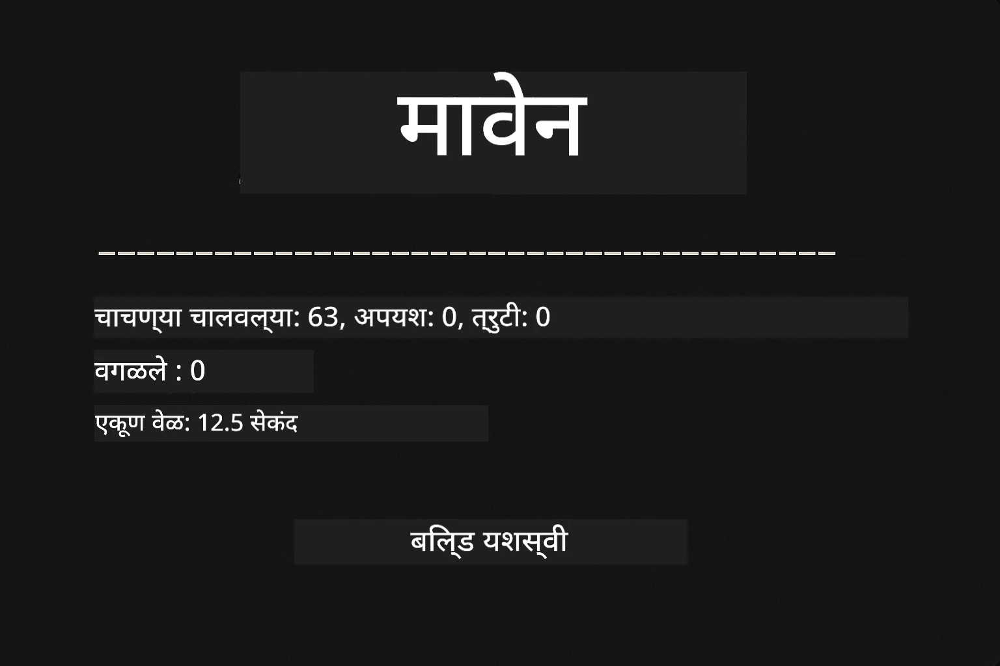
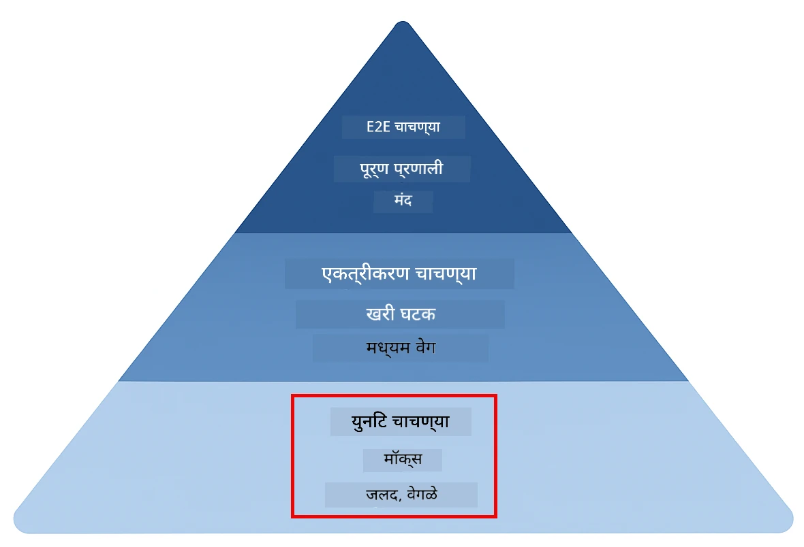
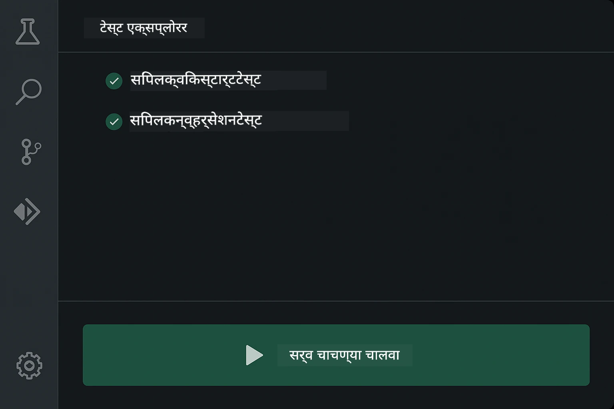
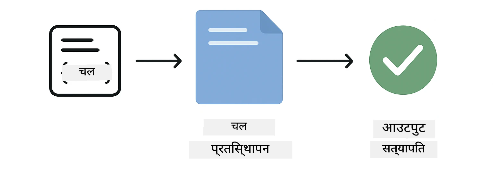
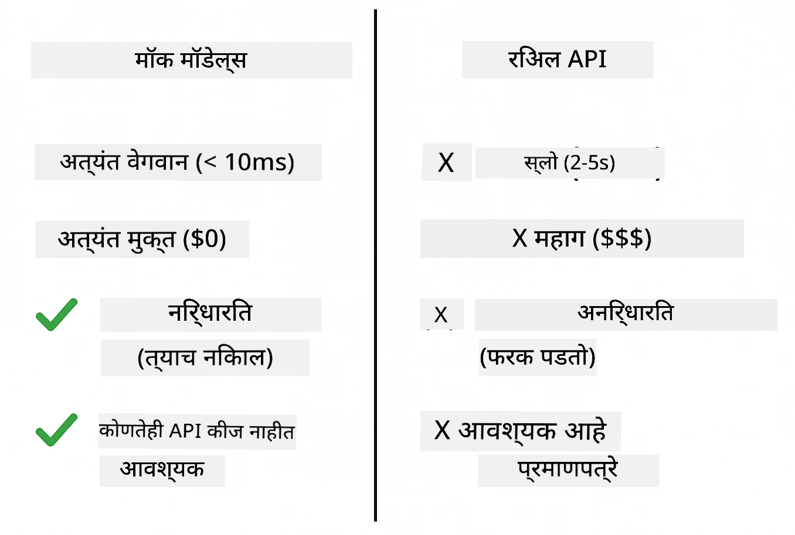
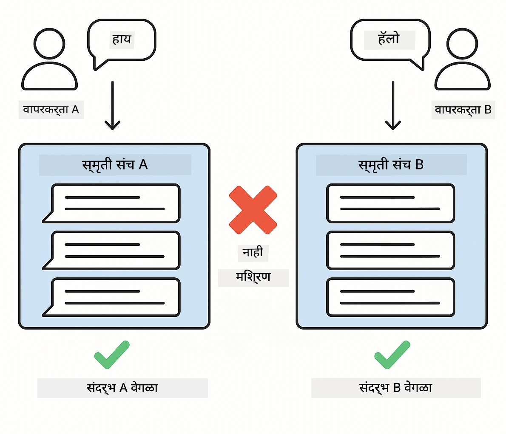
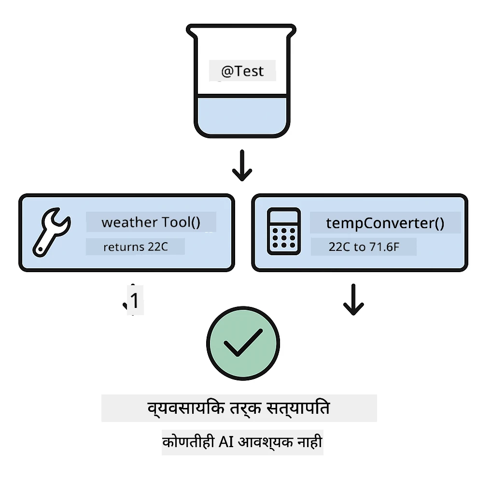
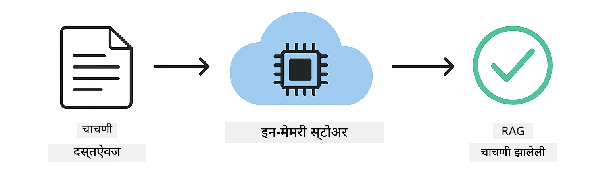

# LangChain4j अनुप्रयोगांची चाचणी करणे

## विषयोपक्रम सारांश

- [लवकर सुरूवात](#लवकर-सुरूवात)
- [चाचण्यांमध्ये काय समाविष्ट आहे](#चाचण्यांमध्ये-काय-समाविष्ट-आहे)
- [चाचण्या कश्या चालवाव्यात](#चाचण्या-कश्या-चालवाव्यात)
- [VS कोड मध्ये चाचण्या चालवणे](#vs-कोड-मध्ये-चाचण्या-चालवणे)
- [चाचणीचे नमुने](#चाचणीचे-नमुने)
- [चाचणी तत्वज्ञान](#चाचणी-तत्वज्ञान)
- [पुढील पावले](#पुढील-पावले)

हा मार्गदर्शक तुम्हाला अशा चाचण्या कशा करायच्या ते दाखवतो ज्या एपीआय कीज किंवा बाह्य सेवा न वापरता AI अनुप्रयोगांची तपासणी करतात.

## लवकर सुरूवात

सर्व चाचण्या एकाच आदेशाने चालवा:

**Bash:**
```bash
mvn test
```

**PowerShell:**
```powershell
mvn --% test
```

जेव्हा सर्व चाचण्या यशस्वी पार पडतात, तेव्हा तुम्हाला खालील स्क्रीनशॉट प्रमाणे आउटपुट दिसेल — एकाही अपयशाशिवाय चाचण्या चालवल्या जातात.



*सर्व चाचण्या यशस्वी पार पडल्या असल्याचे दर्शविणारे यशस्वी चाचणी कार्यान्वयन*

## चाचण्यांमध्ये काय समाविष्ट आहे

हा अभ्यासक्रम स्थानिक पद्धतीने चालणाऱ्या **युनिट टेस्ट्स** वर केंद्रित आहे. प्रत्येक चाचणी वेगळ्या LangChain4j संकल्पनेची स्वतंत्रपणे माहिती देते. खालील चाचणी पिरामिडमध्ये युनिट टेस्ट्सचा समावेश दर्शवलेला आहे — त्या वेगवान, विश्वासार्ह पाया तयार करतात ज्यावर तुमचा संपूर्ण चाचणी धोरण आधारित आहे.



*युनिट चाचण्या (वेगवान, स्वतंत्र), एकत्रीकरण चाचण्या (खरे घटक), आणि एंड-टू-एंड चाचण्यांमधील संतुलन दाखवणारा चाचणी पिरामिड. हा प्रशिक्षण कोर्स युनिट टेस्टिंगवर केंद्रित आहे.*

| मॉड्यूल | चाचण्या | लक्ष केंद्रित | प्रमुख फायली |
|--------|-------|-------|-----------|
| **01 - प्रस्तावना** | 8 | संभाषण स्मृती आणि स्थितीवार चॅट | `SimpleConversationTest.java` |
| **02 - प्रॉम्प्ट अभियांत्रिकी** | 12 | GPT-5.2 नमुने, उत्कटता स्तर, रचनेत आउटपुट | `SimpleGpt5PromptTest.java` |
| **03 - RAG** | 10 | दस्तऐवज अंतर्भवन, एम्बेडिंग्ज, सादृश्यता शोध | `DocumentServiceTest.java` |
| **04 - साधने** | 12 | फंक्शन कॉलिंग आणि साधने साखळी | `SimpleToolsTest.java` |
| **05 - MCP** | 8 | Stdio ट्रान्सपोर्टसहित मॉडेल संदर्भ प्रोटोकॉल | `SimpleMcpTest.java` |

## चाचण्या कश्या चालवाव्यात

**रूटमधून सर्व चाचण्या चालवा:**

**Bash:**
```bash
mvn test
```

**PowerShell:**
```powershell
mvn --% test
```

**विशिष्ट मॉड्यूलसाठी चाचण्या चालवा:**

**Bash:**
```bash
cd 01-introduction && mvn test
# किंवा मुळापासून
mvn test -pl 01-introduction
```

**PowerShell:**
```powershell
cd 01-introduction; mvn --% test
# किंवा मूळपासून
mvn --% test -pl 01-introduction
```

**एकच चाचणी वर्ग चालवा:**

**Bash:**
```bash
mvn test -Dtest=SimpleConversationTest
```

**PowerShell:**
```powershell
mvn --% test -Dtest=SimpleConversationTest
```

**विशिष्ट चाचणी पद्धत चालवा:**

**Bash:**
```bash
mvn test -Dtest=SimpleConversationTest#संभाषणाचा इतिहास राखावा
```

**PowerShell:**
```powershell
mvn --% test -Dtest=SimpleConversationTest#संभाषणाचा इतिहास ठेवावा का
```

## VS कोड मध्ये चाचण्या चालवणे

जर तुम्ही Visual Studio Code वापरत असाल, तर Test Explorer चाचण्या चालवण्यासाठी आणि डीबग करण्यासाठी ग्राफिकल इंटरफेस पुरवतो.



*VS Code Test Explorer मध्ये सर्व Java चाचणी वर्ग आणि वैयक्तिक चाचणी पद्धतींचे टेस्ट ट्री दाखवित आहे*

**VS कोड मध्ये चाचण्या चालवण्यासाठी:**

1. Activity Bar मध्ये बीकर चिन्हावर क्लिक करून Test Explorer उघडा
2. सर्व मॉड्यूल्स आणि चाचणी वर्ग पाहण्यासाठी टेस्ट ट्री विस्तृत करा
3. एखादी चाचणी स्वतंत्रपणे चालवण्यासाठी तिच्या जवळील प्ले बटणावर क्लिक करा
4. संपूर्ण सूट चालवण्यासाठी "Run All Tests" क्लिक करा
5. कुठल्याही चाचणीवर उजवी क्लिक करून "Debug Test" निवडा, ब्रेकपॉइंट सेट करा आणि कोड शोधा

Test Explorer यशस्वी झालेल्या चाचण्यांसाठी हिरव्या तपास चिन्हे दाखवतो आणि अपयशी झाल्यास तपशीलवार त्रुटी संदेश देतो.

## चाचणीचे नमुने

### नमुना 1: प्रॉम्प्ट टेम्पलेट्सची चाचणी

सर्वात सोपा नमुना कोणतेही AI मॉडेल कॉल न करता प्रॉम्प्ट टेम्पलेट्सची चाचणी करतो. तुम्ही तपासता की चल प्रविष्ट्या योग्यरित्या बदलत आहेत आणि प्रॉम्प्ट अपेक्षेनुसार फॉरमॅट केले आहेत.



*चल प्रविष्ट्यांचे बदल होणे दर्शविणारे प्रॉम्प्ट टेम्पलेट टेस्टिंग: प्लेसहोल्डर्स असलेले टेम्पलेट→आवक मूल्यमापन→फॉरमॅटेड आउटपुट पडताळणी*

```java
@Test
@DisplayName("Should format prompt template with variables")
void testPromptTemplateFormatting() {
    PromptTemplate template = PromptTemplate.from(
        "Best time to visit {{destination}} for {{activity}}?"
    );
    
    Prompt prompt = template.apply(Map.of(
        "destination", "Paris",
        "activity", "sightseeing"
    ));
    
    assertThat(prompt.text()).isEqualTo("Best time to visit Paris for sightseeing?");
}
```

हा नमुना तपासतो की चल प्रविष्ट्या योग्य प्रकारे बदलल्या गेल्या आहेत आणि प्रॉम्प्ट अपेक्षेनुसार फॉरमॅट केले आहेत — कोणतीही API की किंवा मॉडेल कॉल आवश्यक नाही.

### नमुना 2: भाषा मॉडेल्सची मॉकिंग

संभाषण तार्किकतेची चाचणी करताना, Mockito वापरून नकली मॉडेल तयार करा जे आधीच सांगितलेली उत्तरे परत करतात. यामुळे चाचण्या जलद, मोफत आणि ठराविक होतात.



*मॉक वापरण्याचे फायदे दाखवणारी तुलना: ते वेगवान, मोफत, ठराविक, आणि API कीशिवाय असतात*

```java
@ExtendWith(MockitoExtension.class)
class SimpleConversationTest {
    
    private ConversationService conversationService;
    
    @Mock
    private OpenAiOfficialChatModel mockChatModel;
    
    @BeforeEach
    void setUp() {
        ChatResponse mockResponse = ChatResponse.builder()
            .aiMessage(AiMessage.from("This is a test response"))
            .build();
        when(mockChatModel.chat(anyList())).thenReturn(mockResponse);
        
        conversationService = new ConversationService(mockChatModel);
    }
    
    @Test
    void shouldMaintainConversationHistory() {
        String conversationId = conversationService.startConversation();
        
        ChatResponse mockResponse1 = ChatResponse.builder()
            .aiMessage(AiMessage.from("Response 1"))
            .build();
        ChatResponse mockResponse2 = ChatResponse.builder()
            .aiMessage(AiMessage.from("Response 2"))
            .build();
        ChatResponse mockResponse3 = ChatResponse.builder()
            .aiMessage(AiMessage.from("Response 3"))
            .build();
        
        when(mockChatModel.chat(anyList()))
            .thenReturn(mockResponse1)
            .thenReturn(mockResponse2)
            .thenReturn(mockResponse3);

        conversationService.chat(conversationId, "First message");
        conversationService.chat(conversationId, "Second message");
        conversationService.chat(conversationId, "Third message");

        List<ChatMessage> history = conversationService.getHistory(conversationId);
        assertThat(history).hasSize(6); // 3 वापरकर्ता + 3 एआय संदेशे
    }
}
```

हा नमुना `01-introduction/src/test/java/com/example/langchain4j/service/SimpleConversationTest.java` मध्ये आहे. मॉक स्थिर वर्तन सुनिश्चित करतो जेणेकरून तुम्ही स्मृती व्यवस्थापन योग्य आहे का ते तपासू शकता.

### नमुना 3: संभाषण पृथक्करणाची चाचणी

संभाषण स्मृतीने अनेक वापरकर्त्यांना वेगळे ठेवणे आवश्यक आहे. ही चाचणी पुष्टी करते की संभाषणे संदर्भ मिसळत नाहीत.



*संभाषण पृथक्करण दाखविते वेगळे स्मृती संच वेगळ्या वापरकर्त्यांसाठी संदर्भ मिसळू नयेत म्हणून*

```java
@Test
void shouldIsolateConversationsByid() {
    String conv1 = conversationService.startConversation();
    String conv2 = conversationService.startConversation();
    
    ChatResponse mockResponse = ChatResponse.builder()
        .aiMessage(AiMessage.from("Response"))
        .build();
    when(mockChatModel.chat(anyList())).thenReturn(mockResponse);

    conversationService.chat(conv1, "Message for conversation 1");
    conversationService.chat(conv2, "Message for conversation 2");

    List<ChatMessage> history1 = conversationService.getHistory(conv1);
    List<ChatMessage> history2 = conversationService.getHistory(conv2);
    
    assertThat(history1).hasSize(2);
    assertThat(history2).hasSize(2);
}
```

प्रत्येक संभाषणाची स्वतःची स्वतंत्र इतिहास राखली जाते. उत्पादन प्रणालींमध्ये, हे पृथक्करण बहु-वापरकर्ता अनुप्रयोगांसाठी अत्यंत महत्त्वाचे आहे.

### नमुना 4: साधने स्वतंत्रपणे चाचणी करणे

साधने म्हणजे AI कॉल करू शकणारे फंक्शन्स. त्यांना थेट चाचणी द्या जेणेकरून ते AI निर्णयांपासून स्वतंत्रपणे योग्य काम करतात.



*AI कॉल न करता मॉक साधनांचे प्रदर्शन करून व्यावसायिक लॉजिक तपासणारी साधने स्वतंत्रपणे चाचणी*

```java
@Test
void shouldConvertCelsiusToFahrenheit() {
    TemperatureTool tempTool = new TemperatureTool();
    String result = tempTool.celsiusToFahrenheit(25.0);
    assertThat(result).containsPattern("77[.,]0°F");
}

@Test
void shouldDemonstrateToolChaining() {
    WeatherTool weatherTool = new WeatherTool();
    TemperatureTool tempTool = new TemperatureTool();

    String weatherResult = weatherTool.getCurrentWeather("Seattle");
    assertThat(weatherResult).containsPattern("\\d+°C");

    String conversionResult = tempTool.celsiusToFahrenheit(22.0);
    assertThat(conversionResult).containsPattern("71[.,]6°F");
}
```

हे चाचणी `04-tools/src/test/java/com/example/langchain4j/agents/tools/SimpleToolsTest.java` मधून आहेत. साखळीकरणाचा नमुना दाखवितो की एका साधनाचे उत्पादन दुसऱ्या साधनाच्या इनपुटमध्ये कसे जाते.

### नमुना 5: इन-मेमोरी RAG चाचणी

RAG प्रणाली सामान्यतः व्हेक्टर डेटाबेस आणि एम्बेडिंग सेवा आवश्यक असतात. इन-मेमोरी नमुना संपूर्ण पाइपलाइन बाह्य अवलंबित्वांशिवाय तपासण्यास परवानगी देतो.



*इन-मेमोरी RAG टेस्टिंग कार्यप्रवाह दाखविते दस्तऐवज पार्सिंग, एम्बेडिंग संचयन, आणि सादृश्यता शोध डेटाबेसशिवाय*

```java
@Test
void testProcessTextDocument() {
    String content = "This is a test document.\nIt has multiple lines.";
    InputStream inputStream = new ByteArrayInputStream(content.getBytes(StandardCharsets.UTF_8));
    
    DocumentService.ProcessedDocument result = 
        documentService.processDocument(inputStream, "test.txt");

    assertNotNull(result);
    assertTrue(result.segments().size() > 0);
    assertEquals("test.txt", result.segments().get(0).metadata().getString("filename"));
}
```

`03-rag/src/test/java/com/example/langchain4j/rag/service/DocumentServiceTest.java` मधून ही चाचणी दस्तऐवज मेमरीमध्ये तयार करून चंकिंग आणि मेटाडेटा हाताळणी तपासते.

### नमुना 6: MCP एकत्रीकरण चाचणी

MCP मॉड्यूल मॉडेल संदर्भ प्रोटोकॉलचे stdio ट्रान्सपोर्ट वापर करून एकत्रीकरण तपासते. ही चाचणी तुमचा अनुप्रयोग MCP सर्वर्स म्हणून उपप्रक्रिया सुरू करू शकतो आणि संवाद साधू शकतो हे खात्री करते.

`05-mcp/src/test/java/com/example/langchain4j/mcp/SimpleMcpTest.java` मधील चाचण्या MCP क्लायंट वर्तनाची पडताळणी करतात.

**चालवा:**

**Bash:**
```bash
cd 05-mcp && mvn test
```

**PowerShell:**
```powershell
cd 05-mcp; mvn --% test
```

## चाचणी तत्वज्ञान

तुमचा कोड तपासा, AI नाही. तुमच्या चाचण्यांनी तुम्ही लिहिलेले कोड कसे तयार होते, स्मृती कशी व्यवस्थापित होते, आणि साधने कशी कार्यान्वित होतात हेच पडताळले पाहिजे. AI उत्तरे बदलतात आणि ती चाचणी पुरावे भाग नसावेत. विचार करा की तुमचा प्रॉम्प्ट टेम्पलेट योग्यरित्या चल प्रविष्ट्या बदलतो का, AI बरोबर उत्तर देते का हे नाही.

भाषा मॉडेलसाठी मॉक वापरा. हे बाह्य अवलंबित्व आहेत जे मंद, महाग आणि ठराविक नसतात. मॉकिंगमुळे चाचण्या सेकंदांऐवजी मिलीसेकंदांत जलद, मोफत आणि ठराविक बनतात.

चाचण्या स्वतंत्र ठेवा. प्रत्येक चाचणीने स्वतःचे डेटा सेट करावे, इतर चाचण्यांवर अवलंबून राहू नये, आणि स्वच्छता करावी. चाचण्या चालण्याच्या क्रमावरील निर्भर नसाव्यात.

आनंदी मार्गापलीकडे सीमेच्या प्रकरणांची चाचणी करा. रिकामे इनपुट, फार मोठे इनपुट, विशेष वर्ण, अवैध पॅरामीटर्स आणि सीमा परिस्थिती तपासा. अनेकदा या त्रुटी उघड करतात ज्या सामान्य वापर दर्शवत नाही.

स्पष्ट नावे वापरा. `shouldMaintainConversationHistoryAcrossMultipleMessages()` हे `test1()` पेक्षा तुलनेत खूप अधिक सांगते. पहिले नक्की काय तपासत आहे हे सांगते ज्यामुळे अपयशाचे डीबगिंग सोपे होते.

## पुढील पावले

आता जेव्हा तुम्हाला चाचणी नमुने समजले आहेत, तर प्रत्येक मॉड्यूलमध्ये अधिक खोलात जाऊन पहा:

- **[01 - प्रस्तावना](../01-introduction/README.md)** - संभाषण स्मृती व्यवस्थापन शिका
- **[02 - प्रॉम्प्ट अभियांत्रिकी](../02-prompt-engineering/README.md)** - GPT-5.2 प्रॉम्प्टिंग नमुने पारंगत व्हा
- **[03 - RAG](../03-rag/README.md)** - पुनर्प्राप्ति-संगृहीत जनरेशन प्रणाली तयार करा
- **[04 - साधने](../04-tools/README.md)** - फंक्शन कॉलिंग आणि साधने साखळी लागू करा
- **[05 - MCP](../05-mcp/README.md)** - मॉडेल संदर्भ प्रोटोकॉल एकत्रित करा

प्रत्येक मॉड्यूलची README येथे तपासलेल्या संकल्पनांचे सविस्तर स्पष्टीकरण देते.

---

**नेव्हिगेशन:** [← मुख्याकडे परत जा](../README.md)

---

<!-- CO-OP TRANSLATOR DISCLAIMER START -->
**अस्वीकरण**:
हा दस्तऐवज AI भाषांतर सेवा [Co-op Translator](https://github.com/Azure/co-op-translator) चा वापर करून अनुवादित केला आहे. जरी आम्ही अचूकतेसाठी प्रयत्न करतो, तरी कृपया लक्षात घ्या की स्वयंचलित भाषांतरांमध्ये त्रुटी किंवा अचूकतेची कमतरता असू शकते. मूळ दस्तऐवज त्याच्या मूळ भाषेत अधिकृत स्रोत मानला पाहिजे. महत्त्वाची माहिती असल्यास, व्यावसायिक मानवी भाषांतराची शिफारस केली जाते. या भाषांतराच्या वापरामुळे उद्भवणाऱ्या कोणत्याही गैरसमज किंवा चुकीच्या अर्थलावणीसाठी आम्ही जबाबदार नाही.
<!-- CO-OP TRANSLATOR DISCLAIMER END -->