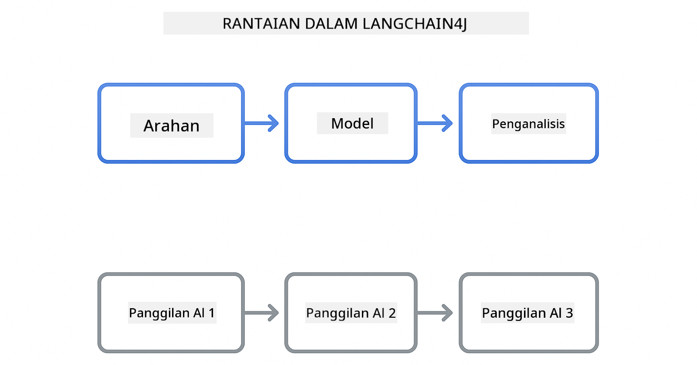
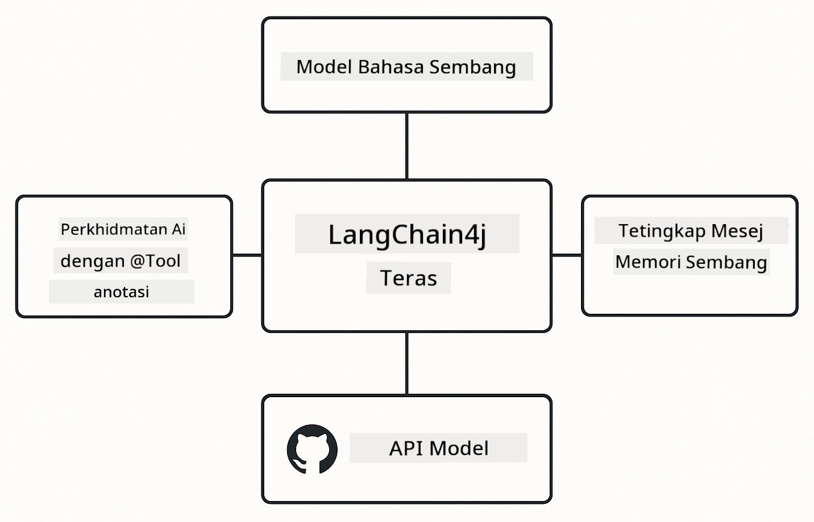

<!--
CO_OP_TRANSLATOR_METADATA:
{
  "original_hash": "377b3e3e6f8d02965bf0fbbc9ccb45c5",
  "translation_date": "2025-12-13T15:08:19+00:00",
  "source_file": "00-quick-start/README.md",
  "language_code": "ms"
}
-->
# Modul 00: Mula Cepat

## Jadual Kandungan

- [Pengenalan](../../../00-quick-start)
- [Apa itu LangChain4j?](../../../00-quick-start)
- [Kebergantungan LangChain4j](../../../00-quick-start)
- [Prasyarat](../../../00-quick-start)
- [Persediaan](../../../00-quick-start)
  - [1. Dapatkan Token GitHub Anda](../../../00-quick-start)
  - [2. Tetapkan Token Anda](../../../00-quick-start)
- [Jalankan Contoh](../../../00-quick-start)
  - [1. Sembang Asas](../../../00-quick-start)
  - [2. Corak Prompt](../../../00-quick-start)
  - [3. Panggilan Fungsi](../../../00-quick-start)
  - [4. Soal Jawab Dokumen (RAG)](../../../00-quick-start)
- [Apa yang Ditunjukkan Setiap Contoh](../../../00-quick-start)
- [Langkah Seterusnya](../../../00-quick-start)
- [Penyelesaian Masalah](../../../00-quick-start)

## Pengenalan

Mula cepat ini bertujuan untuk membantu anda memulakan dan menjalankan LangChain4j dengan secepat mungkin. Ia merangkumi asas mutlak membina aplikasi AI dengan LangChain4j dan Model GitHub. Dalam modul seterusnya, anda akan menggunakan Azure OpenAI dengan LangChain4j untuk membina aplikasi yang lebih maju.

## Apa itu LangChain4j?

LangChain4j adalah perpustakaan Java yang memudahkan pembinaan aplikasi berkuasa AI. Daripada berurusan dengan klien HTTP dan penguraian JSON, anda bekerja dengan API Java yang bersih.

"Rantai" dalam LangChain merujuk kepada penyambungan beberapa komponen - anda mungkin menyambungkan prompt ke model ke parser, atau menyambungkan beberapa panggilan AI di mana satu output menjadi input seterusnya. Mula cepat ini memfokuskan pada asas sebelum meneroka rantai yang lebih kompleks.



*Menyambungkan komponen dalam LangChain4j - blok binaan yang bersambung untuk mencipta aliran kerja AI yang berkuasa*

Kami akan menggunakan tiga komponen teras:

**ChatLanguageModel** - Antara muka untuk interaksi model AI. Panggil `model.chat("prompt")` dan dapatkan rentetan respons. Kami menggunakan `OpenAiOfficialChatModel` yang berfungsi dengan titik akhir yang serasi OpenAI seperti Model GitHub.

**AiServices** - Mencipta antara muka perkhidmatan AI yang jenis-selamat. Definisikan kaedah, anotasi dengan `@Tool`, dan LangChain4j mengendalikan orkestrasi. AI secara automatik memanggil kaedah Java anda apabila diperlukan.

**MessageWindowChatMemory** - Menyimpan sejarah perbualan. Tanpanya, setiap permintaan adalah bebas. Dengan ini, AI mengingati mesej sebelumnya dan mengekalkan konteks merentasi beberapa pusingan.



*Seni bina LangChain4j - komponen teras bekerjasama untuk menggerakkan aplikasi AI anda*

## Kebergantungan LangChain4j

Mula cepat ini menggunakan dua kebergantungan Maven dalam [`pom.xml`](../../../00-quick-start/pom.xml):

```xml
<!-- Core LangChain4j library -->
<dependency>
    <groupId>dev.langchain4j</groupId>
    <artifactId>langchain4j</artifactId> <!-- Inherited from BOM in root pom.xml -->
</dependency>

<!-- OpenAI integration (works with GitHub Models) -->
<dependency>
    <groupId>dev.langchain4j</groupId>
    <artifactId>langchain4j-open-ai-official</artifactId> <!-- Inherited from BOM in root pom.xml -->
</dependency>
```

Modul `langchain4j-open-ai-official` menyediakan kelas `OpenAiOfficialChatModel` yang menyambung ke API yang serasi OpenAI. Model GitHub menggunakan format API yang sama, jadi tiada penyesuai khas diperlukan - hanya tunjukkan URL asas ke `https://models.github.ai/inference`.

## Prasyarat

**Menggunakan Dev Container?** Java dan Maven sudah dipasang. Anda hanya memerlukan Token Akses Peribadi GitHub.

**Pembangunan Tempatan:**
- Java 21+, Maven 3.9+
- Token Akses Peribadi GitHub (arahan di bawah)

> **Nota:** Modul ini menggunakan `gpt-4.1-nano` dari Model GitHub. Jangan ubah nama model dalam kod - ia dikonfigurasikan untuk berfungsi dengan model yang tersedia di GitHub.

## Persediaan

### 1. Dapatkan Token GitHub Anda

1. Pergi ke [GitHub Settings → Personal Access Tokens](https://github.com/settings/personal-access-tokens)
2. Klik "Generate new token"
3. Tetapkan nama yang deskriptif (contoh: "Demo LangChain4j")
4. Tetapkan tarikh luput (7 hari disyorkan)
5. Di bawah "Account permissions", cari "Models" dan tetapkan ke "Read-only"
6. Klik "Generate token"
7. Salin dan simpan token anda - anda tidak akan melihatnya lagi

### 2. Tetapkan Token Anda

**Pilihan 1: Menggunakan VS Code (Disyorkan)**

Jika anda menggunakan VS Code, tambah token anda ke fail `.env` di akar projek:

Jika fail `.env` tidak wujud, salin `.env.example` ke `.env` atau buat fail `.env` baru di akar projek.

**Contoh fail `.env`:**
```bash
# Dalam /workspaces/LangChain4j-for-Beginners/.env
GITHUB_TOKEN=your_token_here
```

Kemudian anda boleh klik kanan pada mana-mana fail demo (contoh: `BasicChatDemo.java`) dalam Explorer dan pilih **"Run Java"** atau gunakan konfigurasi pelancaran dari panel Run and Debug.

**Pilihan 2: Menggunakan Terminal**

Tetapkan token sebagai pembolehubah persekitaran:

**Bash:**
```bash
export GITHUB_TOKEN=your_token_here
```

**PowerShell:**
```powershell
$env:GITHUB_TOKEN=your_token_here
```

## Jalankan Contoh

**Menggunakan VS Code:** Klik kanan pada mana-mana fail demo dalam Explorer dan pilih **"Run Java"**, atau gunakan konfigurasi pelancaran dari panel Run and Debug (pastikan anda telah menambah token ke fail `.env` terlebih dahulu).

**Menggunakan Maven:** Sebagai alternatif, anda boleh jalankan dari baris perintah:

### 1. Sembang Asas

**Bash:**
```bash
mvn compile exec:java -Dexec.mainClass=com.example.langchain4j.quickstart.BasicChatDemo
```

**PowerShell:**
```powershell
mvn --% compile exec:java -Dexec.mainClass=com.example.langchain4j.quickstart.BasicChatDemo
```

### 2. Corak Prompt

**Bash:**
```bash
mvn compile exec:java -Dexec.mainClass=com.example.langchain4j.quickstart.PromptEngineeringDemo
```

**PowerShell:**
```powershell
mvn --% compile exec:java -Dexec.mainClass=com.example.langchain4j.quickstart.PromptEngineeringDemo
```

Menunjukkan zero-shot, few-shot, chain-of-thought, dan role-based prompting.

### 3. Panggilan Fungsi

**Bash:**
```bash
mvn compile exec:java -Dexec.mainClass=com.example.langchain4j.quickstart.ToolIntegrationDemo
```

**PowerShell:**
```powershell
mvn --% compile exec:java -Dexec.mainClass=com.example.langchain4j.quickstart.ToolIntegrationDemo
```

AI secara automatik memanggil kaedah Java anda apabila diperlukan.

### 4. Soal Jawab Dokumen (RAG)

**Bash:**
```bash
mvn compile exec:java -Dexec.mainClass=com.example.langchain4j.quickstart.SimpleReaderDemo
```

**PowerShell:**
```powershell
mvn --% compile exec:java -Dexec.mainClass=com.example.langchain4j.quickstart.SimpleReaderDemo
```

Tanya soalan tentang kandungan dalam `document.txt`.

## Apa yang Ditunjukkan Setiap Contoh

**Sembang Asas** - [BasicChatDemo.java](../../../00-quick-start/src/main/java/com/example/langchain4j/quickstart/BasicChatDemo.java)

Mulakan di sini untuk melihat LangChain4j pada tahap paling asas. Anda akan mencipta `OpenAiOfficialChatModel`, hantar prompt dengan `.chat()`, dan dapatkan respons kembali. Ini menunjukkan asas: bagaimana untuk memulakan model dengan titik akhir dan kunci API tersuai. Setelah anda faham corak ini, segala-galanya dibina di atasnya.

```java
ChatLanguageModel model = OpenAiOfficialChatModel.builder()
    .baseUrl("https://models.github.ai/inference")
    .apiKey(System.getenv("GITHUB_TOKEN"))
    .modelName("gpt-4.1-nano")
    .build();

String response = model.chat("What is LangChain4j?");
System.out.println(response);
```

> **🤖 Cuba dengan [GitHub Copilot](https://github.com/features/copilot) Chat:** Buka [`BasicChatDemo.java`](../../../00-quick-start/src/main/java/com/example/langchain4j/quickstart/BasicChatDemo.java) dan tanya:
> - "Bagaimana saya beralih dari Model GitHub ke Azure OpenAI dalam kod ini?"
> - "Apakah parameter lain yang boleh saya konfigurasikan dalam OpenAiOfficialChatModel.builder()?"
> - "Bagaimana saya menambah respons penstriman dan bukannya menunggu respons lengkap?"

**Reka Bentuk Prompt** - [PromptEngineeringDemo.java](../../../00-quick-start/src/main/java/com/example/langchain4j/quickstart/PromptEngineeringDemo.java)

Sekarang anda tahu cara bercakap dengan model, mari terokai apa yang anda katakan kepadanya. Demo ini menggunakan tetapan model yang sama tetapi menunjukkan empat corak prompting yang berbeza. Cuba zero-shot untuk arahan langsung, few-shot yang belajar dari contoh, chain-of-thought yang mendedahkan langkah pemikiran, dan role-based yang menetapkan konteks. Anda akan lihat bagaimana model yang sama memberikan hasil yang sangat berbeza berdasarkan cara anda membingkai permintaan.

```java
PromptTemplate template = PromptTemplate.from(
    "What's the best time to visit {{destination}} for {{activity}}?"
);

Prompt prompt = template.apply(Map.of(
    "destination", "Paris",
    "activity", "sightseeing"
));

String response = model.chat(prompt.text());
```

> **🤖 Cuba dengan [GitHub Copilot](https://github.com/features/copilot) Chat:** Buka [`PromptEngineeringDemo.java`](../../../00-quick-start/src/main/java/com/example/langchain4j/quickstart/PromptEngineeringDemo.java) dan tanya:
> - "Apakah perbezaan antara zero-shot dan few-shot prompting, dan bila saya patut guna masing-masing?"
> - "Bagaimana parameter suhu mempengaruhi respons model?"
> - "Apakah teknik untuk mengelakkan serangan suntikan prompt dalam produksi?"
> - "Bagaimana saya boleh cipta objek PromptTemplate yang boleh digunakan semula untuk corak biasa?"

**Integrasi Alat** - [ToolIntegrationDemo.java](../../../00-quick-start/src/main/java/com/example/langchain4j/quickstart/ToolIntegrationDemo.java)

Di sinilah LangChain4j menjadi berkuasa. Anda akan menggunakan `AiServices` untuk mencipta pembantu AI yang boleh memanggil kaedah Java anda. Cuma anotasi kaedah dengan `@Tool("description")` dan LangChain4j mengendalikan selebihnya - AI secara automatik memutuskan bila menggunakan setiap alat berdasarkan apa yang pengguna tanya. Ini menunjukkan panggilan fungsi, teknik utama untuk membina AI yang boleh mengambil tindakan, bukan sekadar menjawab soalan.

```java
@Tool("Performs addition of two numeric values")
public double add(double a, double b) {
    return a + b;
}

MathAssistant assistant = AiServices.create(MathAssistant.class, model);
String response = assistant.chat("What is 25 plus 17?");
```

> **🤖 Cuba dengan [GitHub Copilot](https://github.com/features/copilot) Chat:** Buka [`ToolIntegrationDemo.java`](../../../00-quick-start/src/main/java/com/example/langchain4j/quickstart/ToolIntegrationDemo.java) dan tanya:
> - "Bagaimana anotasi @Tool berfungsi dan apa yang LangChain4j lakukan dengannya di belakang tabir?"
> - "Bolehkah AI memanggil beberapa alat secara berurutan untuk menyelesaikan masalah kompleks?"
> - "Apa yang berlaku jika alat melemparkan pengecualian - bagaimana saya patut kendalikan ralat?"
> - "Bagaimana saya integrasikan API sebenar dan bukannya contoh kalkulator ini?"

**Soal Jawab Dokumen (RAG)** - [SimpleReaderDemo.java](../../../00-quick-start/src/main/java/com/example/langchain4j/quickstart/SimpleReaderDemo.java)

Di sini anda akan lihat asas RAG (retrieval-augmented generation). Daripada bergantung pada data latihan model, anda memuatkan kandungan dari [`document.txt`](../../../00-quick-start/document.txt) dan memasukkannya dalam prompt. AI menjawab berdasarkan dokumen anda, bukan pengetahuan amnya. Ini adalah langkah pertama ke arah membina sistem yang boleh bekerja dengan data anda sendiri.

```java
Document document = FileSystemDocumentLoader.loadDocument("document.txt");
String content = document.text();

String prompt = "Based on this document: " + content + 
                "\nQuestion: What is the main topic?";
String response = model.chat(prompt);
```

> **Nota:** Pendekatan mudah ini memuatkan keseluruhan dokumen ke dalam prompt. Untuk fail besar (>10KB), anda akan melebihi had konteks. Modul 03 membincangkan chunking dan carian vektor untuk sistem RAG produksi.

> **🤖 Cuba dengan [GitHub Copilot](https://github.com/features/copilot) Chat:** Buka [`SimpleReaderDemo.java`](../../../00-quick-start/src/main/java/com/example/langchain4j/quickstart/SimpleReaderDemo.java) dan tanya:
> - "Bagaimana RAG mengelakkan halusinasi AI berbanding menggunakan data latihan model?"
> - "Apakah perbezaan antara pendekatan mudah ini dan menggunakan embedding vektor untuk pencarian?"
> - "Bagaimana saya skala ini untuk mengendalikan pelbagai dokumen atau pangkalan pengetahuan yang lebih besar?"
> - "Apakah amalan terbaik untuk menyusun prompt supaya AI hanya menggunakan konteks yang diberikan?"

## Penyahpepijatan

Contoh termasuk `.logRequests(true)` dan `.logResponses(true)` untuk menunjukkan panggilan API dalam konsol. Ini membantu menyelesaikan masalah pengesahan, had kadar, atau respons yang tidak dijangka. Buang bendera ini dalam produksi untuk mengurangkan bunyi log.

## Langkah Seterusnya

**Modul Seterusnya:** [01-introduction - Memulakan dengan LangChain4j dan gpt-5 di Azure](../01-introduction/README.md)

---

**Navigasi:** [← Kembali ke Utama](../README.md) | [Seterusnya: Modul 01 - Pengenalan →](../01-introduction/README.md)

---

## Penyelesaian Masalah

### Kompilasi Maven Kali Pertama

**Isu**: `mvn clean compile` atau `mvn package` pertama mengambil masa lama (10-15 minit)

**Sebab**: Maven perlu memuat turun semua kebergantungan projek (Spring Boot, perpustakaan LangChain4j, SDK Azure, dll.) pada binaan pertama.

**Penyelesaian**: Ini adalah tingkah laku normal. Binaan seterusnya akan jauh lebih pantas kerana kebergantungan disimpan dalam cache tempatan. Masa muat turun bergantung pada kelajuan rangkaian anda.

### Sintaks Perintah Maven PowerShell

**Isu**: Perintah Maven gagal dengan ralat `Unknown lifecycle phase ".mainClass=..."`

**Sebab**: PowerShell mentafsir `=` sebagai operator penetapan pembolehubah, menyebabkan sintaks sifat Maven rosak

**Penyelesaian**: Gunakan operator berhenti-parse `--%` sebelum perintah Maven:

**PowerShell:**
```powershell
mvn --% compile exec:java -Dexec.mainClass=com.example.langchain4j.quickstart.BasicChatDemo
```

**Bash:**
```bash
mvn compile exec:java -Dexec.mainClass=com.example.langchain4j.quickstart.BasicChatDemo
```

Operator `--%` memberitahu PowerShell untuk menghantar semua argumen selebihnya secara literal ke Maven tanpa tafsiran.

### Paparan Emoji PowerShell Windows

**Isu**: Respons AI menunjukkan aksara sampah (contoh: `????` atau `â??`) bukannya emoji dalam PowerShell

**Sebab**: Pengekodan lalai PowerShell tidak menyokong emoji UTF-8

**Penyelesaian**: Jalankan arahan ini sebelum menjalankan aplikasi Java:
```cmd
chcp 65001
```

Ini memaksa pengekodan UTF-8 dalam terminal. Sebagai alternatif, gunakan Windows Terminal yang mempunyai sokongan Unicode lebih baik.

---

<!-- CO-OP TRANSLATOR DISCLAIMER START -->
**Penafian**:  
Dokumen ini telah diterjemahkan menggunakan perkhidmatan terjemahan AI [Co-op Translator](https://github.com/Azure/co-op-translator). Walaupun kami berusaha untuk ketepatan, sila ambil maklum bahawa terjemahan automatik mungkin mengandungi kesilapan atau ketidaktepatan. Dokumen asal dalam bahasa asalnya harus dianggap sebagai sumber yang sahih. Untuk maklumat penting, terjemahan profesional oleh manusia adalah disyorkan. Kami tidak bertanggungjawab atas sebarang salah faham atau salah tafsir yang timbul daripada penggunaan terjemahan ini.
<!-- CO-OP TRANSLATOR DISCLAIMER END -->