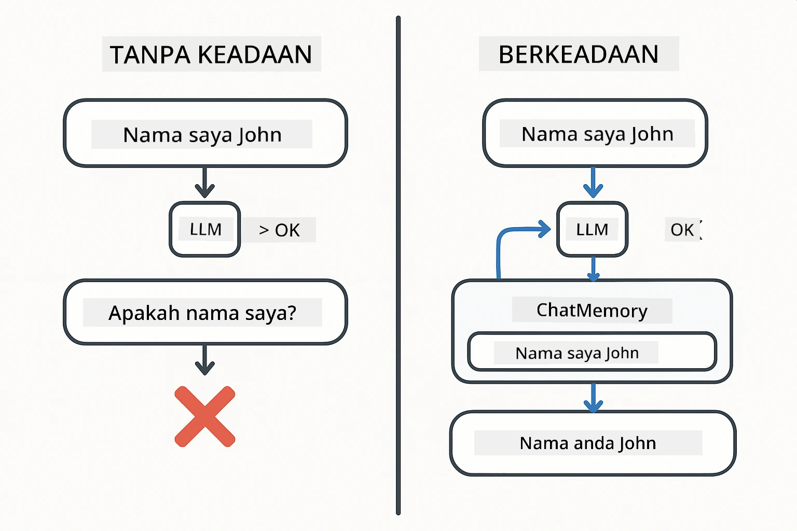
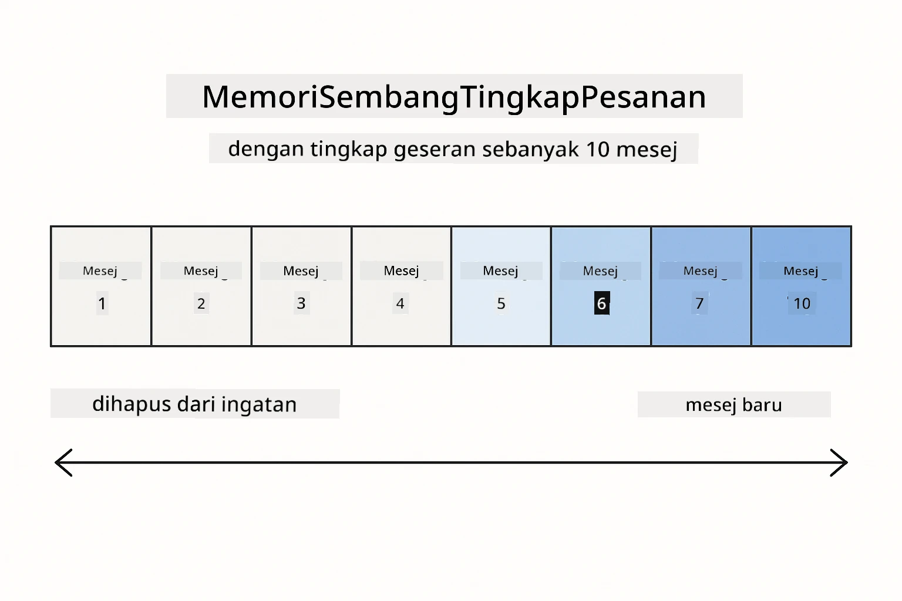
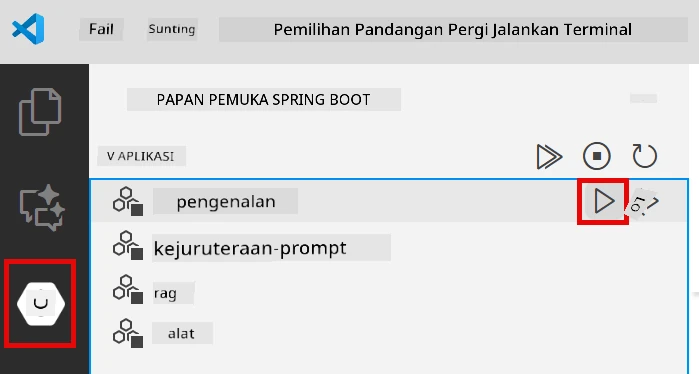
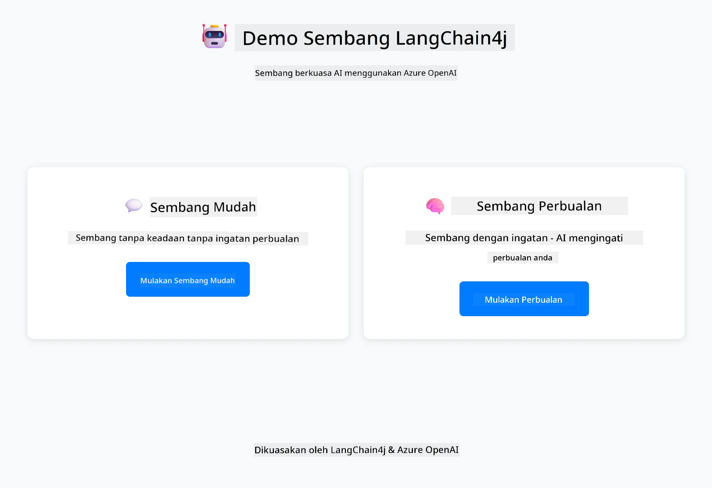
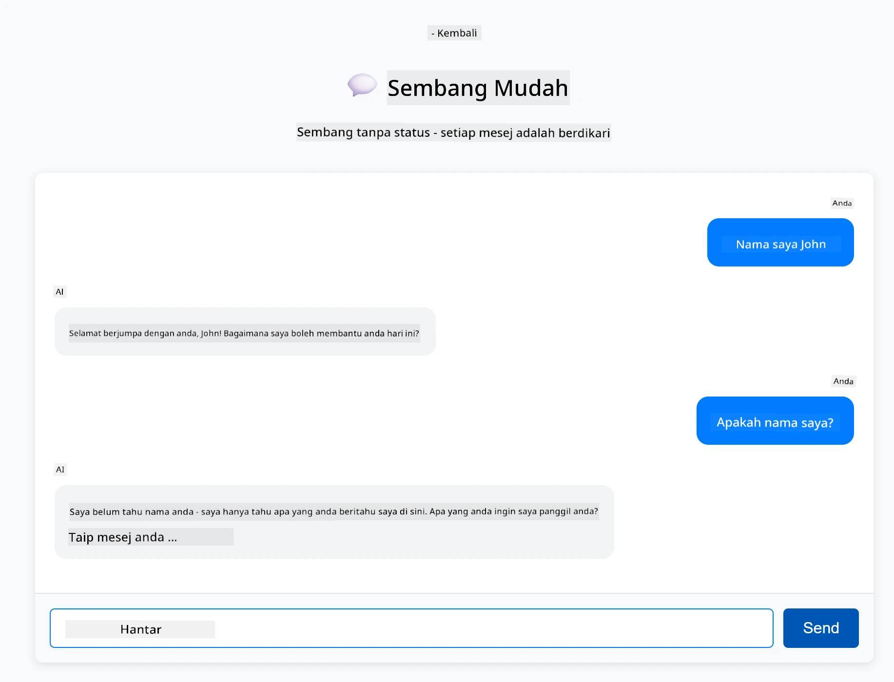
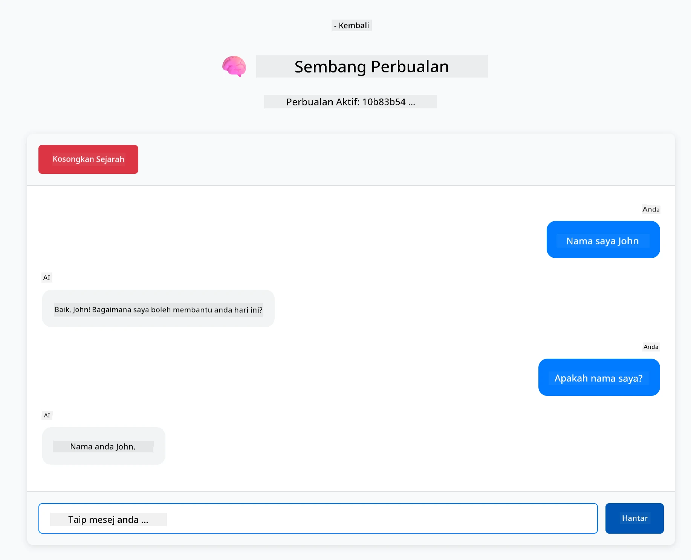

# Modul 01: Bermula dengan LangChain4j

## Jadual Kandungan

- [Video Panduan](#video-panduan)
- [Apa Yang Akan Anda Pelajari](#apa-yang-akan-anda-pelajari)
- [Prasyarat](#prasyarat)
- [Memahami Masalah Teras](#memahami-masalah-teras)
- [Memahami Token](#memahami-token)
- [Bagaimana Memori Berfungsi](#bagaimana-memori-berfungsi)
- [Bagaimana Ini Menggunakan LangChain4j](#bagaimana-ini-menggunakan-langchain4j)
- [Menyebarkan Infrastruktur Azure OpenAI](#menyebarkan-infrastruktur-azure-openai)
- [Jalankan Aplikasi Secara Tempatan](#jalankan-aplikasi-secara-tempatan)
- [Menggunakan Aplikasi](#menggunakan-aplikasi)
  - [Sembang Tanpa Keadaan (Panel Kiri)](#sembang-tanpa-keadaan-panel-kiri)
  - [Sembang Berkeadaan (Panel Kanan)](#sembang-berkeadaan-panel-kanan)
- [Langkah Seterusnya](#langkah-seterusnya)

## Video Panduan

Tonton sesi langsung ini yang menerangkan cara untuk bermula dengan modul ini:

<a href="https://www.youtube.com/live/nl_troDm8rQ?si=6b85S8xGjWnT2fX9"></a>

## Apa Yang Akan Anda Pelajari

Ini adalah titik permulaan anda dengan LangChain4j dan Azure OpenAI. Kami bermula dengan asas-asas dan mula membina aplikasi gaya pengeluaran. Modul ini menumpukan kepada AI perbualan yang mengingati konteks dan mengekalkan keadaan — konsep asas yang dibina oleh setiap modul kemudian.

Kami akan menggunakan GPT-5.2 Azure OpenAI sepanjang panduan ini kerana keupayaan penaakulan lanjutan menjadikan tingkah laku pola yang berbeza lebih nyata. Apabila anda menambah memori, anda akan jelas melihat perbezaannya. Ini memudahkan untuk memahami apa yang setiap komponen bawa ke aplikasi anda.

Anda akan membina satu aplikasi yang menunjukkan kedua-dua pola:

**Sembang Tanpa Keadaan** - Setiap permintaan adalah berdikari. Model tidak mempunyai memori mesej sebelumnya. Ini adalah titik permulaan paling mudah.

**Perbualan Berkeadaan** - Setiap permintaan merangkumi sejarah perbualan. Model mengekalkan konteks merentasi pelbagai giliran. Ini adalah apa yang diperlukan oleh aplikasi pengeluaran.

## Prasyarat

- Langganan Azure dengan akses Azure OpenAI
- Java 21, Maven 3.9+
- Azure CLI (https://learn.microsoft.com/en-us/cli/azure/install-azure-cli)
- Azure Developer CLI (azd) (https://learn.microsoft.com/en-us/azure/developer/azure-developer-cli/install-azd)

> **Nota:** Java, Maven, Azure CLI dan Azure Developer CLI (azd) telah dipasang terlebih dahulu dalam devcontainer yang disediakan.

> **Nota:** Modul ini menggunakan GPT-5.2 pada Azure OpenAI. Penyebaran dikonfigurasi secara automatik melalui `azd up` - jangan ubah nama model dalam kod.

## Memahami Masalah Teras

Model bahasa adalah tanpa keadaan. Setiap panggilan API berdikari. Jika anda menghantar "Nama saya John" dan kemudian bertanya "Siapa nama saya?", model tidak tahu anda baru memperkenalkan diri. Ia menganggap setiap permintaan seolah-olah itu adalah perbualan pertama yang anda pernah lakukan.

Ini sesuai untuk Q&A mudah tetapi tidak berguna untuk aplikasi sebenar. Bot perkhidmatan pelanggan perlu mengingati apa yang anda beritahu mereka. Pembantu peribadi memerlukan konteks. Apa-apa perbualan berbilang giliran memerlukan memori.

Rajah berikut membezakan dua pendekatan — di kiri, panggilan tanpa keadaan yang lupa nama anda; di kanan, panggilan berkeadaan dengan sokongan ChatMemory yang mengingatinya.



*Perbezaan antara perbualan tanpa keadaan (panggilan berdikari) dan berkeadaan (sedar konteks)*

## Memahami Token

Sebelum meneroka perbualan, penting untuk memahami token - unit asas teks yang diproses oleh model bahasa:


*Contoh bagaimana teks dipecahkan kepada token - "I love AI!" menjadi 4 unit pemprosesan berasingan*

Token adalah cara model AI mengukur dan memproses teks. Perkataan, tanda baca, dan bahkan ruang boleh menjadi token. Model anda mempunyai had berapa banyak token yang boleh diproses sekaligus (400,000 untuk GPT-5.2, dengan sehingga 272,000 token input dan 128,000 token output). Memahami token membantu anda mengurus panjang perbualan dan kos.

## Bagaimana Memori Berfungsi

Memori sembang menyelesaikan masalah tanpa keadaan dengan mengekalkan sejarah perbualan. Sebelum menghantar permintaan anda ke model, rangka kerja akan menambah mesej sebelumnya yang relevan. Apabila anda bertanya "Siapa nama saya?", sistem sebenarnya menghantar keseluruhan sejarah perbualan, membolehkan model melihat anda telah berkata "Nama saya John."

LangChain4j menyediakan pelaksanaan memori yang mengendalikannya secara automatik. Anda pilih berapa banyak mesej untuk disimpan dan rangka kerja menguruskan tetingkap konteks. Rajah di bawah menunjukkan bagaimana MessageWindowChatMemory mengekalkan tetingkap gelongsor mesej terkini.



*MessageWindowChatMemory mengekalkan tetingkap gelongsor mesej terkini, secara automatik membuang yang lama*

## Bagaimana Ini Menggunakan LangChain4j

Modul ini mengintegrasikan Spring Boot dan menambah memori perbualan. Begini cara bahagian-bahagian berfungsi bersama:

**Pergantungan** - Tambah dua perpustakaan LangChain4j:

```xml
<dependency>
    <groupId>dev.langchain4j</groupId>
    <artifactId>langchain4j</artifactId> <!-- Inherited from BOM in root pom.xml -->
</dependency>
<dependency>
    <groupId>dev.langchain4j</groupId>
    <artifactId>langchain4j-open-ai-official</artifactId> <!-- Inherited from BOM in root pom.xml -->
</dependency>
```

**Model Sembang** - Konfigurasikan Azure OpenAI sebagai bean Spring ([LangChainConfig.java](../../../01-introduction/src/main/java/com/example/langchain4j/config/LangChainConfig.java)):

```java
@Bean
public OpenAiOfficialChatModel openAiOfficialChatModel() {
    return OpenAiOfficialChatModel.builder()
            .baseUrl(azureEndpoint)
            .apiKey(azureApiKey)
            .modelName(deploymentName)
            .timeout(Duration.ofMinutes(5))
            .maxRetries(3)
            .build();
}
```

Builder membaca kelayakan dari pembolehubah alam sekitar yang ditetapkan oleh `azd up`. Menetapkan `baseUrl` ke titik akhir Azure anda menjadikan klien OpenAI berfungsi dengan Azure OpenAI.

**Memori Perbualan** - Jejaki sejarah sembang dengan MessageWindowChatMemory ([ConversationService.java](../../../01-introduction/src/main/java/com/example/langchain4j/service/ConversationService.java)):

```java
ChatMemory memory = MessageWindowChatMemory.withMaxMessages(10);

memory.add(UserMessage.from("My name is John"));
memory.add(AiMessage.from("Nice to meet you, John!"));

memory.add(UserMessage.from("What's my name?"));
AiMessage aiMessage = chatModel.chat(memory.messages()).aiMessage();
memory.add(aiMessage);
```

Cipta memori dengan `withMaxMessages(10)` untuk menyimpan 10 mesej terakhir. Tambah mesej pengguna dan AI dengan pembungkus berjenis: `UserMessage.from(text)` dan `AiMessage.from(text)`. Dapatkan sejarah dengan `memory.messages()` dan hantar ke model. Perkhidmatan menyimpan instans memori berasingan setiap ID perbualan, membolehkan pelbagai pengguna berbual serentak.

> **🤖 Cuba dengan [GitHub Copilot](https://github.com/features/copilot) Chat:** Buka [`ConversationService.java`](../../../01-introduction/src/main/java/com/example/langchain4j/service/ConversationService.java) dan tanya:
> - "Bagaimana MessageWindowChatMemory memutuskan mesej mana yang dibuang apabila tetingkap penuh?"
> - "Bolehkah saya melaksanakan penyimpanan memori tersuai menggunakan pangkalan data dan bukan dalam memori?"
> - "Bagaimana saya menambah ringkasan untuk memampatkan sejarah perbualan lama?"

Endpoint sembang tanpa keadaan melangkau memori sama sekali - cuma `chatModel.chat(prompt)` seperti permulaan pantas. Endpoint berkeadaan menambah mesej ke memori, mengambil sejarah, dan menyertakan konteks itu dengan setiap permintaan. Konfigurasi model sama, pola berbeza.

## Menyebarkan Infrastruktur Azure OpenAI

**Bash:**
```bash
cd 01-introduction
azd up  # Pilih langganan dan lokasi (eastus2 disyorkan)
```

**PowerShell:**
```powershell
cd 01-introduction
azd up  # Pilih langganan dan lokasi (eastus2 disyorkan)
```

> **Nota:** Jika anda menghadapi ralat tamat masa (`RequestConflict: Cannot modify resource ... provisioning state is not terminal`), sila jalankan `azd up` sekali lagi. Sumber Azure mungkin masih sedang disediakan di latar belakang, dan cubaan semula membenarkan penyebaran selesai apabila sumber mencapai keadaan terminal.

Ini akan:
1. Menyebarkan sumber Azure OpenAI dengan model GPT-5.2 dan text-embedding-3-small
2. Menjana secara automatik fail `.env` di akar projek dengan kelayakan
3. Mengatur semua pembolehubah alam sekitar yang diperlukan

**Mengalami masalah penyebaran?** Lihat [README Infrastruktur](infra/README.md) untuk penyelesaian masalah terperinci termasuk konflik nama subdomain, langkah penyebaran manual di Azure Portal, dan panduan konfigurasi model.

**Sahkan penyebaran berjaya:**

**Bash:**
```bash
cat ../.env  # Patut menunjukkan AZURE_OPENAI_ENDPOINT, API_KEY, dan lain-lain.
```

**PowerShell:**
```powershell
Get-Content ..\.env  # Perlu menunjukkan AZURE_OPENAI_ENDPOINT, API_KEY, dan lain-lain.
```

> **Nota:** Perintah `azd up` menjana fail `.env` secara automatik. Jika anda perlu kemaskini kemudian, anda boleh sama ada edit fail `.env` secara manual atau menjana semula dengan menjalankan:
>
> **Bash:**
> ```bash
> cd ..
> bash .azd-env.sh
> ```
>
> **PowerShell:**
> ```powershell
> cd ..
> .\.azd-env.ps1
> ```

## Jalankan Aplikasi Secara Tempatan

**Sahkan penyebaran:**

Pastikan fail `.env` wujud di direktori akar dengan kelayakan Azure. Jalankan ini dari direktori modul (`01-introduction/`):

**Bash:**
```bash
cat ../.env  # Patut menunjukkan AZURE_OPENAI_ENDPOINT, API_KEY, DEPLOYMENT
```

**PowerShell:**
```powershell
Get-Content ..\.env  # Perlu menunjukkan AZURE_OPENAI_ENDPOINT, API_KEY, DEPLOYMENT
```

**Mulakan aplikasi:**

**Pilihan 1: Menggunakan Spring Boot Dashboard (Disyorkan untuk pengguna VS Code)**

Dev container termasuk sambungan Spring Boot Dashboard yang menyediakan antara muka visual untuk mengurus semua aplikasi Spring Boot. Anda boleh menemuinya di Bar Aktiviti di sebelah kiri VS Code (carilah ikon Spring Boot).

Daripada Spring Boot Dashboard, anda boleh:
- Lihat semua aplikasi Spring Boot tersedia dalam ruang kerja
- Mulakan/hentikan aplikasi dengan satu klik
- Lihat log aplikasi secara masa nyata
- Pantau status aplikasi

Klik butang main di sebelah "introduction" untuk mulakan modul ini, atau mula semua modul serentak.



*Spring Boot Dashboard di VS Code — mula, hentikan, dan pantau semua modul dari satu tempat*

**Pilihan 2: Menggunakan skrip shell**

Mulakan semua aplikasi web (modul 01-04):

**Bash:**
```bash
cd ..  # Dari direktori root
./start-all.sh
```

**PowerShell:**
```powershell
cd ..  # Dari direktori akar
.\start-all.ps1
```

Atau mulakan hanya modul ini:

**Bash:**
```bash
cd 01-introduction
./start.sh
```

**PowerShell:**
```powershell
cd 01-introduction
.\start.ps1
```

Kedua-dua skrip secara automatik memuat pembolehubah alam sekitar dari fail `.env` akar dan akan membina JAR jika belum wujud.

> **Nota:** Jika anda lebih suka membina semua modul secara manual sebelum mula:
>
> **Bash:**
> ```bash
> cd ..  # Go to root directory
> mvn clean package -DskipTests
> ```
>
> **PowerShell:**
> ```powershell
> cd ..  # Go to root directory
> mvn clean package -DskipTests
> ```

Buka http://localhost:8080 dalam pelayar anda.

**Untuk hentikan:**

**Bash:**
```bash
./stop.sh  # Modul ini sahaja
# Atau
cd .. && ./stop-all.sh  # Semua modul
```

**PowerShell:**
```powershell
.\stop.ps1  # Modul ini sahaja
# Atau
cd ..; .\stop-all.ps1  # Semua modul
```

## Menggunakan Aplikasi

Aplikasi menyediakan antara muka web dengan dua pelaksanaan sembang berdampingan.



*Papan pemuka menunjukkan pilihan Sembang Mudah (tanpa keadaan) dan Sembang Perbualan (berkeadaan)*

### Sembang Tanpa Keadaan (Panel Kiri)

Cuba ini dahulu. Tanya "Nama saya John" dan kemudian terus tanya "Siapa nama saya?" Model tidak akan ingat kerana setiap mesej berdikari. Ini menunjukkan masalah asas pengintegrasian model bahasa - tiada konteks perbualan.



*AI tidak mengingati nama anda dari mesej sebelumnya*

### Sembang Berkeadaan (Panel Kanan)

Sekarang cuba urutan yang sama di sini. Tanya "Nama saya John" dan kemudian "Siapa nama saya?" Kali ini ia mengingatnya. Bezanya ialah MessageWindowChatMemory - ia mengekalkan sejarah perbualan dan menyertakannya dengan setiap permintaan. Begitulah AI perbualan pengeluaran berfungsi.



*AI mengingati nama anda dari awal perbualan*

Kedua-dua panel menggunakan model GPT-5.2 yang sama. Perbezaan satu-satunya ialah memori. Ini menjelaskan apa yang dibawa oleh memori ke aplikasi anda dan mengapa ia penting untuk kes penggunaan sebenar.

## Langkah Seterusnya

**Modul Seterusnya:** [02-prompt-engineering - Kejuruteraan Prompt dengan GPT-5.2](../02-prompt-engineering/README.md)

---

**Navigasi:** [← Kembali ke Utama](../README.md) | [Seterusnya: Modul 02 - Kejuruteraan Prompt →](../02-prompt-engineering/README.md)

---

<!-- CO-OP TRANSLATOR DISCLAIMER START -->
**Penafian**:
Dokumen ini telah diterjemahkan menggunakan perkhidmatan terjemahan AI [Co-op Translator](https://github.com/Azure/co-op-translator). Walaupun kami berusaha untuk ketepatan, sila ambil maklum bahawa terjemahan automatik mungkin mengandungi kesilapan atau ketidaktepatan. Dokumen asal dalam bahasa asalnya harus dianggap sebagai sumber yang sahih. Untuk maklumat penting, terjemahan oleh manusia profesional adalah disyorkan. Kami tidak bertanggungjawab terhadap sebarang salah faham atau salah tafsir yang timbul daripada penggunaan terjemahan ini.
<!-- CO-OP TRANSLATOR DISCLAIMER END -->