<!--
CO_OP_TRANSLATOR_METADATA:
{
  "original_hash": "8d787826cad7e92bf5cdbd116b1e6116",
  "translation_date": "2025-12-13T16:18:59+00:00",
  "source_file": "02-prompt-engineering/README.md",
  "language_code": "ms"
}
-->
# Modul 02: Kejuruteraan Prompt dengan GPT-5

## Jadual Kandungan

- [Apa yang Anda Akan Pelajari](../../../02-prompt-engineering)
- [Prasyarat](../../../02-prompt-engineering)
- [Memahami Kejuruteraan Prompt](../../../02-prompt-engineering)
- [Bagaimana Ini Menggunakan LangChain4j](../../../02-prompt-engineering)
- [Corak Teras](../../../02-prompt-engineering)
- [Menggunakan Sumber Azure Sedia Ada](../../../02-prompt-engineering)
- [Tangkapan Skrin Aplikasi](../../../02-prompt-engineering)
- [Meneroka Corak](../../../02-prompt-engineering)
  - [Rendah vs Tinggi Keghairahan](../../../02-prompt-engineering)
  - [Pelaksanaan Tugas (Preambul Alat)](../../../02-prompt-engineering)
  - [Kod Refleksi Diri](../../../02-prompt-engineering)
  - [Analisis Berstruktur](../../../02-prompt-engineering)
  - [Sembang Berbilang Giliran](../../../02-prompt-engineering)
  - [Penalaran Langkah demi Langkah](../../../02-prompt-engineering)
  - [Output Terhad](../../../02-prompt-engineering)
- [Apa yang Anda Sebenarnya Pelajari](../../../02-prompt-engineering)
- [Langkah Seterusnya](../../../02-prompt-engineering)

## Apa yang Anda Akan Pelajari

Dalam modul sebelumnya, anda melihat bagaimana memori membolehkan AI perbualan dan menggunakan Model GitHub untuk interaksi asas. Kini kita akan fokus pada cara anda mengemukakan soalan - prompt itu sendiri - menggunakan GPT-5 Azure OpenAI. Cara anda menyusun prompt anda sangat mempengaruhi kualiti jawapan yang anda terima.

Kita akan menggunakan GPT-5 kerana ia memperkenalkan kawalan penalaran - anda boleh memberitahu model berapa banyak pemikiran yang perlu dilakukan sebelum menjawab. Ini menjadikan strategi prompt yang berbeza lebih jelas dan membantu anda memahami bila untuk menggunakan setiap pendekatan. Kita juga akan mendapat manfaat daripada had kadar yang lebih sedikit Azure untuk GPT-5 berbanding Model GitHub.

## Prasyarat

- Menyelesaikan Modul 01 (sumber Azure OpenAI telah dikerahkan)
- Fail `.env` di direktori akar dengan kelayakan Azure (dicipta oleh `azd up` dalam Modul 01)

> **Nota:** Jika anda belum menyelesaikan Modul 01, ikut arahan penyebaran di sana terlebih dahulu.

## Memahami Kejuruteraan Prompt

Kejuruteraan prompt adalah tentang mereka bentuk teks input yang secara konsisten memberikan hasil yang anda perlukan. Ia bukan sekadar bertanya soalan - ia tentang menyusun permintaan supaya model memahami dengan tepat apa yang anda mahu dan bagaimana untuk menyampaikannya.

Fikirkan ia seperti memberi arahan kepada rakan sekerja. "Betulkan pepijat" adalah samar. "Betulkan pengecualian penunjuk null dalam UserService.java baris 45 dengan menambah pemeriksaan null" adalah spesifik. Model bahasa berfungsi dengan cara yang sama - ketepatan dan struktur penting.

## Bagaimana Ini Menggunakan LangChain4j

Modul ini menunjukkan corak prompt lanjutan menggunakan asas LangChain4j yang sama dari modul sebelumnya, dengan fokus pada struktur prompt dan kawalan penalaran.


*Bagaimana LangChain4j menghubungkan prompt anda ke Azure OpenAI GPT-5*

**Kebergantungan** - Modul 02 menggunakan kebergantungan langchain4j berikut yang ditakrifkan dalam `pom.xml`:
```xml
<dependency>
    <groupId>dev.langchain4j</groupId>
    <artifactId>langchain4j</artifactId> <!-- Inherited from BOM in root pom.xml -->
</dependency>
<dependency>
    <groupId>dev.langchain4j</groupId>
    <artifactId>langchain4j-open-ai-official</artifactId> <!-- Inherited from BOM in root pom.xml -->
</dependency>
```

**Konfigurasi OpenAiOfficialChatModel** - [LangChainConfig.java](../../../02-prompt-engineering/src/main/java/com/example/langchain4j/prompts/config/LangChainConfig.java)

Model sembang dikonfigurasi secara manual sebagai bean Spring menggunakan klien Rasmi OpenAI, yang menyokong titik akhir Azure OpenAI. Perbezaan utama dari Modul 01 adalah bagaimana kita menyusun prompt yang dihantar ke `chatModel.chat()`, bukan penyediaan model itu sendiri.

**Mesej Sistem dan Pengguna** - [Gpt5PromptService.java](../../../02-prompt-engineering/src/main/java/com/example/langchain4j/prompts/service/Gpt5PromptService.java)

LangChain4j memisahkan jenis mesej untuk kejelasan. `SystemMessage` menetapkan tingkah laku dan konteks AI (seperti "Anda adalah penilai kod"), manakala `UserMessage` mengandungi permintaan sebenar. Pemisahan ini membolehkan anda mengekalkan tingkah laku AI yang konsisten merentasi pelbagai pertanyaan pengguna.

```java
SystemMessage systemMsg = SystemMessage.from(
    "You are a helpful Java programming expert."
);

UserMessage userMsg = UserMessage.from(
    "Explain what a List is in Java"
);

String response = chatModel.chat(systemMsg, userMsg);
```


*Mesej Sistem menyediakan konteks berterusan manakala Mesej Pengguna mengandungi permintaan individu*

**MessageWindowChatMemory untuk Multi-Giliran** - Untuk corak perbualan berbilang giliran, kita menggunakan semula `MessageWindowChatMemory` dari Modul 01. Setiap sesi mendapat instans memori sendiri yang disimpan dalam `Map<String, ChatMemory>`, membolehkan pelbagai perbualan serentak tanpa pencampuran konteks.

**Templat Prompt** - Fokus sebenar di sini adalah kejuruteraan prompt, bukan API LangChain4j baru. Setiap corak (keghairahan rendah, keghairahan tinggi, pelaksanaan tugas, dll.) menggunakan kaedah `chatModel.chat(prompt)` yang sama tetapi dengan rentetan prompt yang disusun dengan teliti. Tag XML, arahan, dan format adalah sebahagian daripada teks prompt, bukan ciri LangChain4j.

**Kawalan Penalaran** - Usaha penalaran GPT-5 dikawal melalui arahan prompt seperti "maksimum 2 langkah penalaran" atau "terokai dengan teliti". Ini adalah teknik kejuruteraan prompt, bukan konfigurasi LangChain4j. Perpustakaan hanya menyampaikan prompt anda ke model.

Pengajaran utama: LangChain4j menyediakan infrastruktur (sambungan model melalui [LangChainConfig.java](../../../02-prompt-engineering/src/main/java/com/example/langchain4j/prompts/config/LangChainConfig.java), memori, pengendalian mesej melalui [Gpt5PromptService.java](../../../02-prompt-engineering/src/main/java/com/example/langchain4j/prompts/service/Gpt5PromptService.java)), manakala modul ini mengajar anda cara mereka bentuk prompt yang berkesan dalam infrastruktur itu.

## Corak Teras

Tidak semua masalah memerlukan pendekatan yang sama. Sesetengah soalan memerlukan jawapan cepat, yang lain memerlukan pemikiran mendalam. Ada yang memerlukan penalaran yang kelihatan, ada yang hanya memerlukan hasil. Modul ini merangkumi lapan corak prompt - setiap satu dioptimumkan untuk senario berbeza. Anda akan mencuba kesemuanya untuk belajar bila setiap pendekatan paling sesuai.

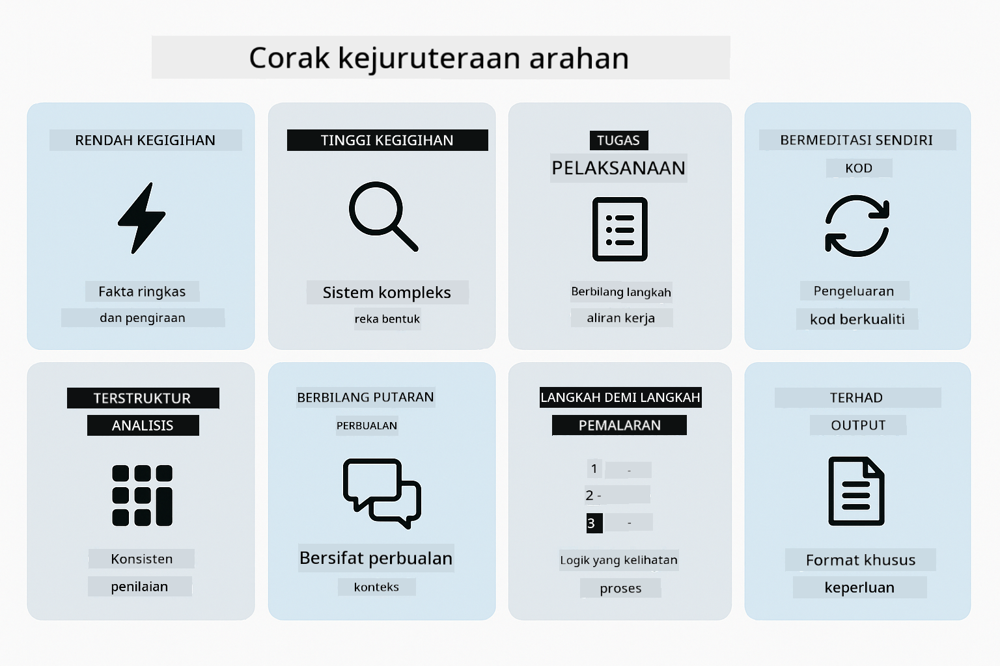

*Gambaran keseluruhan lapan corak kejuruteraan prompt dan kes penggunaannya*


*Keghairahan rendah (pantas, langsung) vs Keghairahan tinggi (teliti, eksploratori) pendekatan penalaran*

**Keghairahan Rendah (Cepat & Fokus)** - Untuk soalan mudah di mana anda mahukan jawapan pantas dan langsung. Model melakukan penalaran minimum - maksimum 2 langkah. Gunakan ini untuk pengiraan, carian, atau soalan mudah.

```java
String prompt = """
    <reasoning_effort>low</reasoning_effort>
    <instruction>maximum 2 reasoning steps</instruction>
    
    What is 15% of 200?
    """;

String response = chatModel.chat(prompt);
```

> 💡 **Terokai dengan GitHub Copilot:** Buka [`Gpt5PromptService.java`](../../../02-prompt-engineering/src/main/java/com/example/langchain4j/prompts/service/Gpt5PromptService.java) dan tanya:
> - "Apakah perbezaan antara corak prompt keghairahan rendah dan tinggi?"
> - "Bagaimana tag XML dalam prompt membantu menyusun jawapan AI?"
> - "Bila saya harus menggunakan corak refleksi diri berbanding arahan langsung?"

**Keghairahan Tinggi (Mendalam & Teliti)** - Untuk masalah kompleks di mana anda mahukan analisis menyeluruh. Model meneroka dengan teliti dan menunjukkan penalaran terperinci. Gunakan ini untuk reka bentuk sistem, keputusan seni bina, atau penyelidikan kompleks.

```java
String prompt = """
    <reasoning_effort>high</reasoning_effort>
    <instruction>explore thoroughly, show detailed reasoning</instruction>
    
    Design a caching strategy for a high-traffic REST API.
    """;

String response = chatModel.chat(prompt);
```

**Pelaksanaan Tugas (Kemajuan Langkah demi Langkah)** - Untuk aliran kerja berbilang langkah. Model menyediakan pelan awal, menceritakan setiap langkah semasa bekerja, kemudian memberi ringkasan. Gunakan ini untuk migrasi, pelaksanaan, atau sebarang proses berbilang langkah.

```java
String prompt = """
    <task>Create a REST endpoint for user registration</task>
    <preamble>Provide an upfront plan</preamble>
    <narration>Narrate each step as you work</narration>
    <summary>Summarize what was accomplished</summary>
    """;

String response = chatModel.chat(prompt);
```

Prompt Chain-of-Thought secara eksplisit meminta model menunjukkan proses penalarannya, meningkatkan ketepatan untuk tugas kompleks. Pecahan langkah demi langkah membantu manusia dan AI memahami logik.

> **🤖 Cuba dengan Sembang [GitHub Copilot](https://github.com/features/copilot):** Tanya tentang corak ini:
> - "Bagaimana saya menyesuaikan corak pelaksanaan tugas untuk operasi jangka panjang?"
> - "Apakah amalan terbaik untuk menyusun preambul alat dalam aplikasi produksi?"
> - "Bagaimana saya boleh menangkap dan memaparkan kemas kini kemajuan pertengahan dalam UI?"


*Rancang → Laksanakan → Ringkaskan aliran kerja untuk tugas berbilang langkah*

**Kod Refleksi Diri** - Untuk menjana kod berkualiti produksi. Model menjana kod, memeriksa mengikut kriteria kualiti, dan memperbaikinya secara berulang. Gunakan ini apabila membina ciri atau perkhidmatan baru.

```java
String prompt = """
    <task>Create an email validation service</task>
    <quality_criteria>
    - Correct logic and error handling
    - Best practices (clean code, proper naming)
    - Performance optimization
    - Security considerations
    </quality_criteria>
    <instruction>Generate code, evaluate against criteria, improve iteratively</instruction>
    """;

String response = chatModel.chat(prompt);
```


*Gelung penambahbaikan berulang - jana, nilai, kenal pasti isu, perbaiki, ulang*

**Analisis Berstruktur** - Untuk penilaian konsisten. Model mengkaji kod menggunakan rangka kerja tetap (ketepatan, amalan, prestasi, keselamatan). Gunakan ini untuk semakan kod atau penilaian kualiti.

```java
String prompt = """
    <code>
    public List getUsers() {
        return database.query("SELECT * FROM users");
    }
    </code>
    
    <framework>
    Evaluate using these categories:
    1. Correctness - Logic and functionality
    2. Best Practices - Code quality
    3. Performance - Efficiency concerns
    4. Security - Vulnerabilities
    </framework>
    """;

String response = chatModel.chat(prompt);
```

> **🤖 Cuba dengan Sembang [GitHub Copilot](https://github.com/features/copilot):** Tanya tentang analisis berstruktur:
> - "Bagaimana saya boleh sesuaikan rangka kerja analisis untuk jenis semakan kod yang berbeza?"
> - "Apakah cara terbaik untuk mengurai dan bertindak atas output berstruktur secara programatik?"
> - "Bagaimana saya memastikan tahap keterukan konsisten merentasi sesi semakan yang berbeza?"

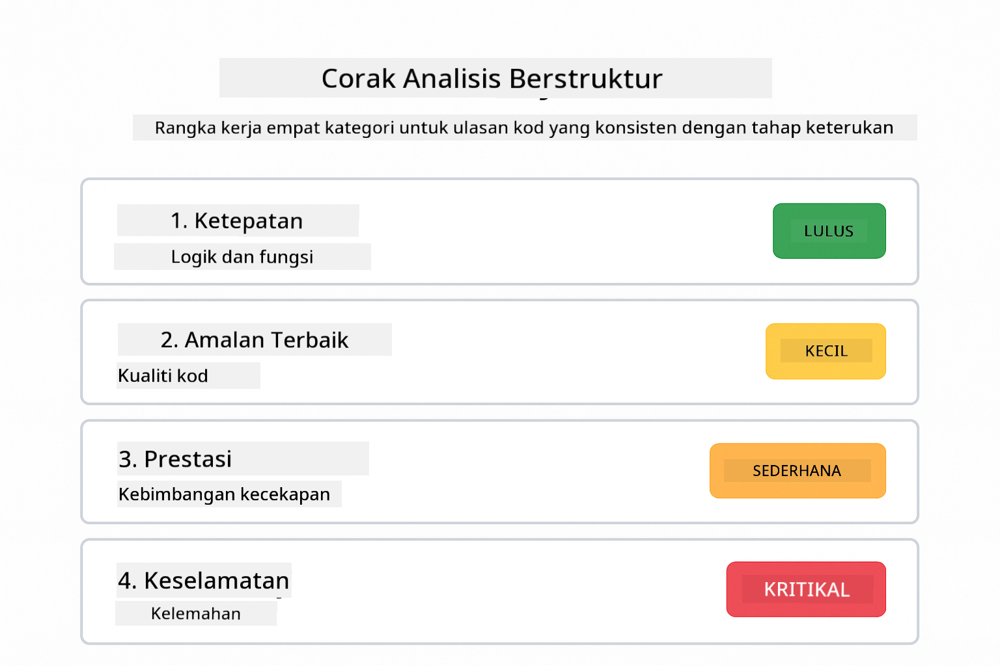

*Rangka kerja empat kategori untuk semakan kod konsisten dengan tahap keterukan*

**Sembang Berbilang Giliran** - Untuk perbualan yang memerlukan konteks. Model mengingati mesej sebelumnya dan membina daripadanya. Gunakan ini untuk sesi bantuan interaktif atau soal jawab kompleks.

```java
ChatMemory memory = MessageWindowChatMemory.withMaxMessages(10);

memory.add(UserMessage.from("What is Spring Boot?"));
AiMessage aiMessage1 = chatModel.chat(memory.messages()).aiMessage();
memory.add(aiMessage1);

memory.add(UserMessage.from("Show me an example"));
AiMessage aiMessage2 = chatModel.chat(memory.messages()).aiMessage();
memory.add(aiMessage2);
```


*Bagaimana konteks perbualan terkumpul sepanjang beberapa giliran sehingga mencapai had token*

**Penalaran Langkah demi Langkah** - Untuk masalah yang memerlukan logik yang kelihatan. Model menunjukkan penalaran eksplisit untuk setiap langkah. Gunakan ini untuk masalah matematik, teka-teki logik, atau apabila anda perlu memahami proses pemikiran.

```java
String prompt = """
    <instruction>Show your reasoning step-by-step</instruction>
    
    If a train travels 120 km in 2 hours, then stops for 30 minutes,
    then travels another 90 km in 1.5 hours, what is the average speed
    for the entire journey including the stop?
    """;

String response = chatModel.chat(prompt);
```

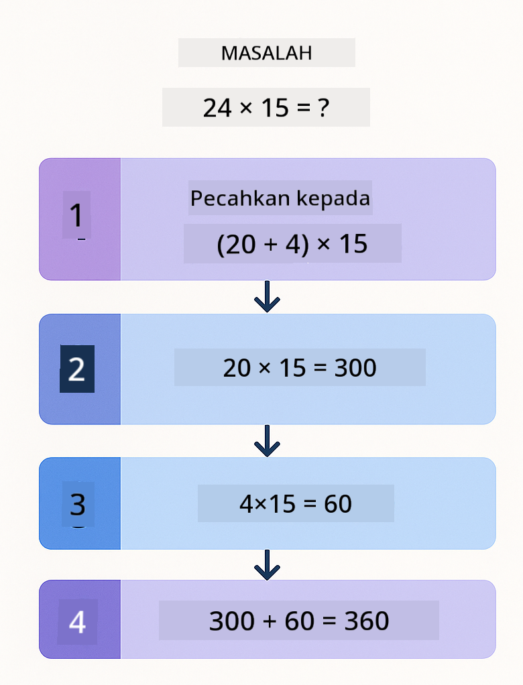

*Memecahkan masalah kepada langkah logik yang jelas*

**Output Terhad** - Untuk jawapan dengan keperluan format tertentu. Model mematuhi dengan ketat peraturan format dan panjang. Gunakan ini untuk ringkasan atau apabila anda memerlukan struktur output yang tepat.

```java
String prompt = """
    <constraints>
    - Exactly 100 words
    - Bullet point format
    - Technical terms only
    </constraints>
    
    Summarize the key concepts of machine learning.
    """;

String response = chatModel.chat(prompt);
```

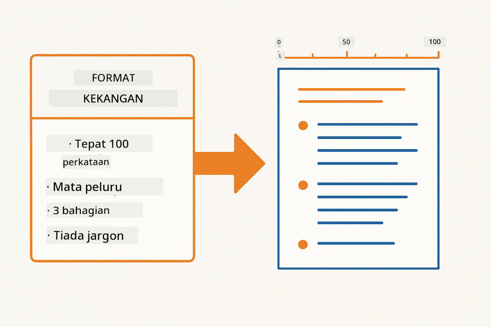

*Memaksa keperluan format, panjang, dan struktur tertentu*

## Menggunakan Sumber Azure Sedia Ada

**Sahkan penyebaran:**

Pastikan fail `.env` wujud di direktori akar dengan kelayakan Azure (dicipta semasa Modul 01):
```bash
cat ../.env  # Patut menunjukkan AZURE_OPENAI_ENDPOINT, API_KEY, DEPLOYMENT
```

**Mulakan aplikasi:**

> **Nota:** Jika anda sudah memulakan semua aplikasi menggunakan `./start-all.sh` dari Modul 01, modul ini sudah berjalan pada port 8083. Anda boleh langkau arahan mula di bawah dan terus ke http://localhost:8083.

**Pilihan 1: Menggunakan Spring Boot Dashboard (Disyorkan untuk pengguna VS Code)**

Kontena dev termasuk sambungan Spring Boot Dashboard, yang menyediakan antara muka visual untuk mengurus semua aplikasi Spring Boot. Anda boleh menemuinya di Bar Aktiviti di sebelah kiri VS Code (cari ikon Spring Boot).

Dari Spring Boot Dashboard, anda boleh:
- Melihat semua aplikasi Spring Boot yang tersedia dalam ruang kerja
- Mula/hentikan aplikasi dengan satu klik
- Melihat log aplikasi secara masa nyata
- Memantau status aplikasi

Klik butang main di sebelah "prompt-engineering" untuk memulakan modul ini, atau mulakan semua modul sekaligus.

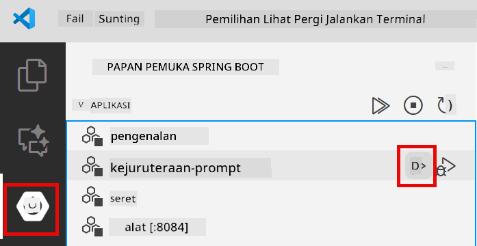

**Pilihan 2: Menggunakan skrip shell**

Mulakan semua aplikasi web (modul 01-04):

**Bash:**
```bash
cd ..  # Dari direktori akar
./start-all.sh
```

**PowerShell:**
```powershell
cd ..  # Dari direktori akar
.\start-all.ps1
```

Atau mulakan hanya modul ini:

**Bash:**
```bash
cd 02-prompt-engineering
./start.sh
```

**PowerShell:**
```powershell
cd 02-prompt-engineering
.\start.ps1
```

Kedua-dua skrip secara automatik memuatkan pembolehubah persekitaran dari fail `.env` akar dan akan membina JAR jika ia tidak wujud.

> **Nota:** Jika anda lebih suka membina semua modul secara manual sebelum memulakan:
>
> **Bash:**
> ```bash
> cd ..  # Go to root directory
> mvn clean package -DskipTests
> ```
>
> **PowerShell:**
> ```powershell
> cd ..  # Go to root directory
> mvn clean package -DskipTests
> ```

Buka http://localhost:8083 dalam pelayar anda.

**Untuk berhenti:**

**Bash:**
```bash
./stop.sh  # Modul ini sahaja
# Atau
cd .. && ./stop-all.sh  # Semua modul
```

**PowerShell:**
```powershell
.\stop.ps1  # Modul ini sahaja
# Atau
cd ..; .\stop-all.ps1  # Semua modul
```

## Tangkapan Skrin Aplikasi

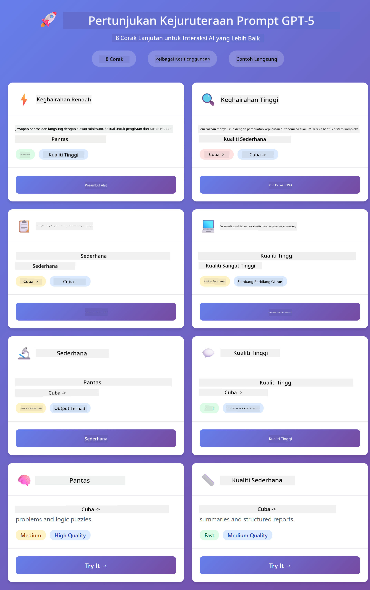

*Dashboard utama yang menunjukkan semua 8 corak kejuruteraan prompt dengan ciri dan kes penggunaannya*

## Meneroka Corak

Antara muka web membolehkan anda mencuba pelbagai strategi prompt. Setiap corak menyelesaikan masalah yang berbeza - cuba mereka untuk melihat bila setiap pendekatan bersinar.

### Rendah vs Tinggi Keghairahan

Tanya soalan mudah seperti "Apakah 15% daripada 200?" menggunakan Keghairahan Rendah. Anda akan mendapat jawapan segera dan langsung. Kini tanya sesuatu yang kompleks seperti "Reka strategi caching untuk API trafik tinggi" menggunakan Keghairahan Tinggi. Perhatikan bagaimana model melambat dan memberikan penalaran terperinci. Model sama, struktur soalan sama - tetapi prompt memberitahu berapa banyak pemikiran yang perlu dilakukan.

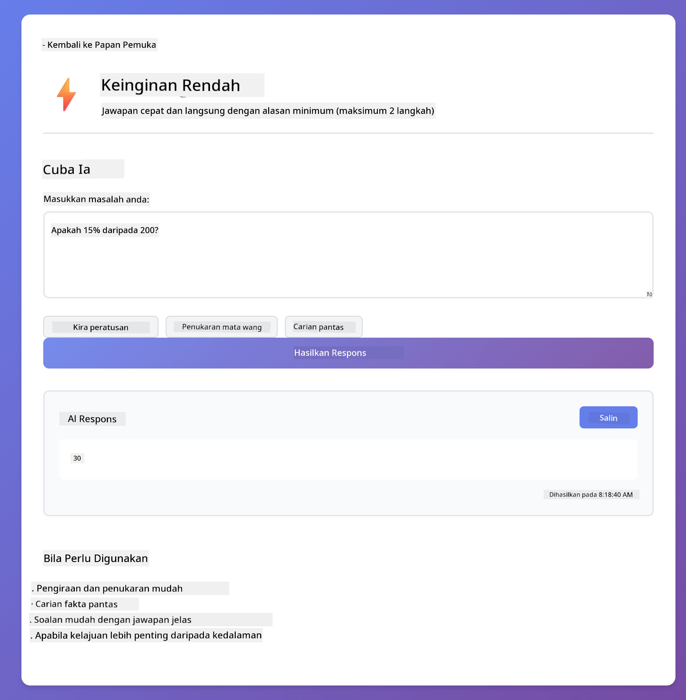
*Pengiraan pantas dengan penalaran minimum*

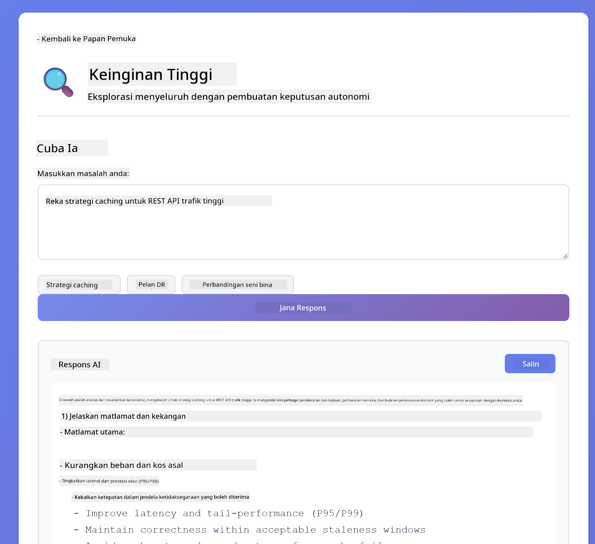

*Strategi caching menyeluruh (2.8MB)*

### Pelaksanaan Tugas (Preambul Alat)

Aliran kerja berbilang langkah mendapat manfaat daripada perancangan awal dan penceritaan kemajuan. Model menggariskan apa yang akan dilakukan, menceritakan setiap langkah, kemudian meringkaskan hasil.

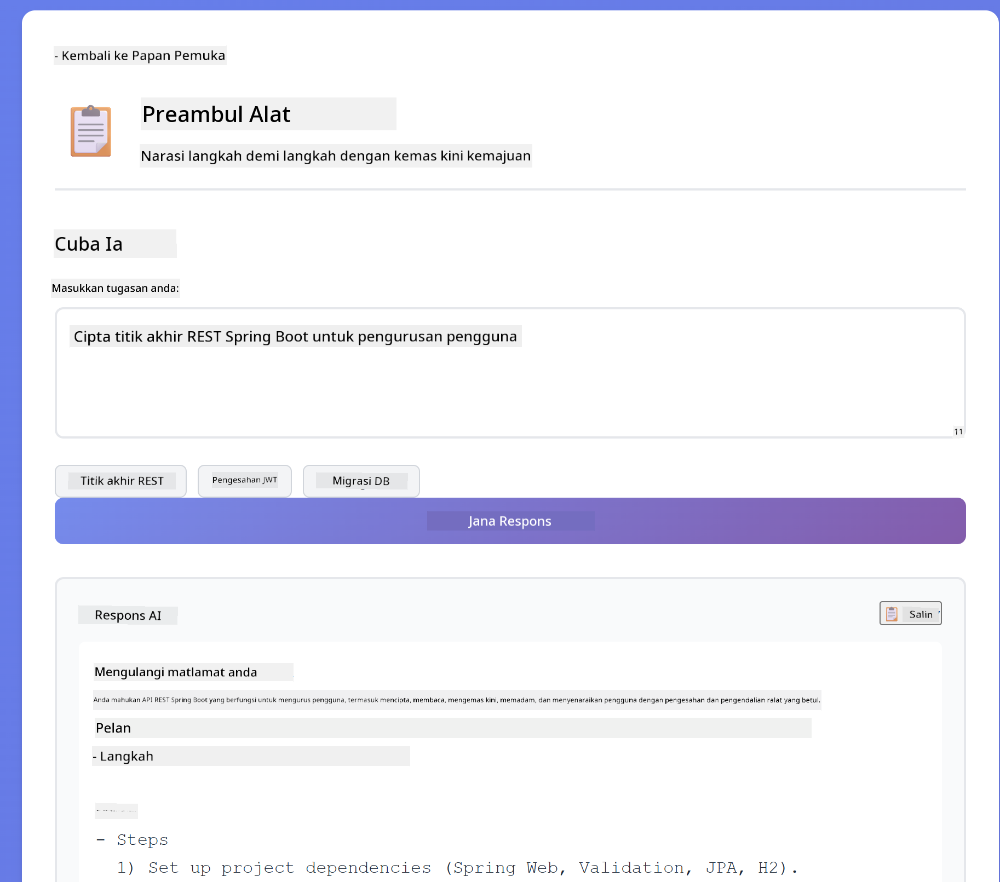

*Mewujudkan titik akhir REST dengan penceritaan langkah demi langkah (3.9MB)*

### Kod Berfikir Sendiri

Cuba "Cipta perkhidmatan pengesahan emel". Daripada hanya menjana kod dan berhenti, model menjana, menilai berdasarkan kriteria kualiti, mengenal pasti kelemahan, dan memperbaiki. Anda akan melihat ia mengulangi sehingga kod memenuhi piawaian pengeluaran.


*Perkhidmatan pengesahan emel lengkap (5.2MB)*

### Analisis Berstruktur

Semakan kod memerlukan rangka kerja penilaian yang konsisten. Model menganalisis kod menggunakan kategori tetap (ketepatan, amalan, prestasi, keselamatan) dengan tahap keterukan.

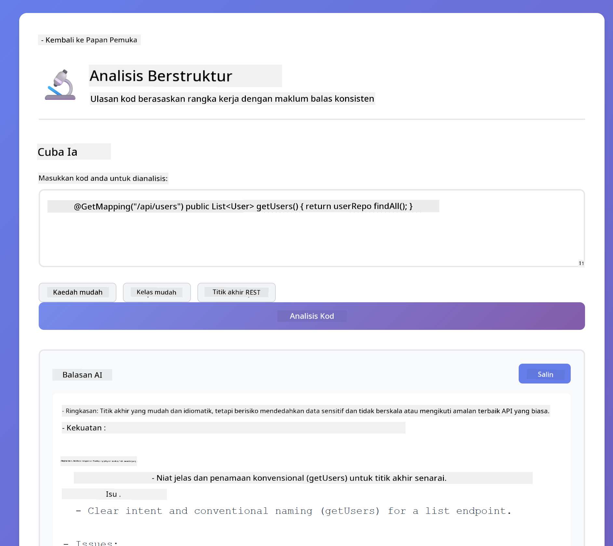

*Semakan kod berasaskan rangka kerja*

### Sembang Berbilang Giliran

Tanya "Apa itu Spring Boot?" kemudian teruskan dengan "Tunjukkan saya contoh". Model mengingati soalan pertama anda dan memberikan contoh Spring Boot khusus. Tanpa memori, soalan kedua itu akan terlalu samar.

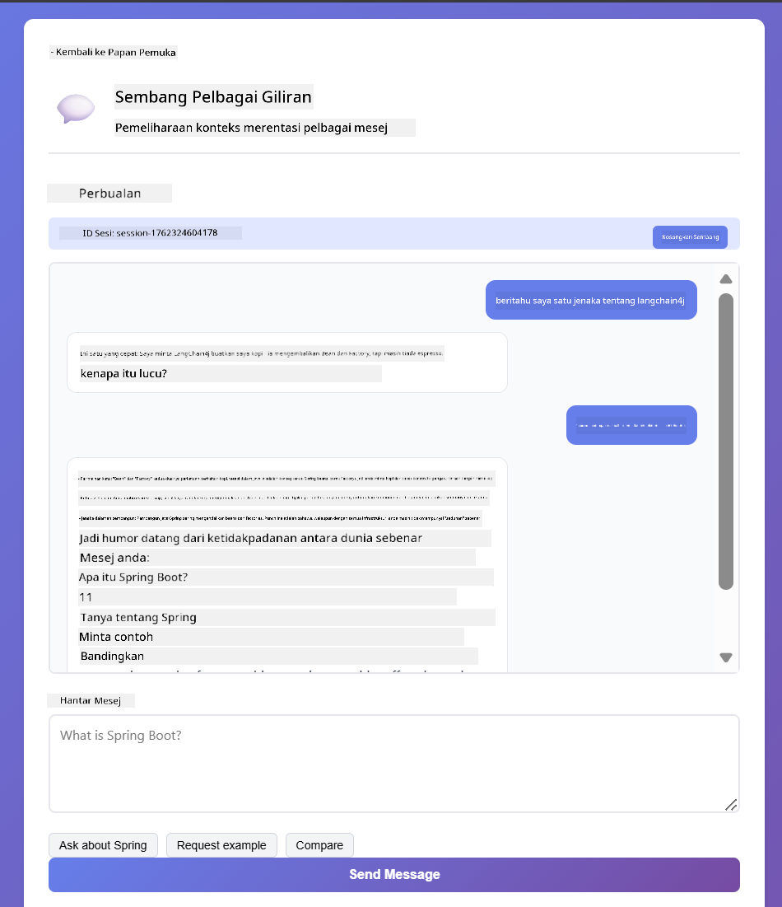

*Pemeliharaan konteks merentasi soalan*

### Penalaran Langkah demi Langkah

Pilih masalah matematik dan cuba dengan Penalaran Langkah demi Langkah dan Semangat Rendah. Semangat rendah hanya memberikan jawapan - pantas tetapi tidak jelas. Langkah demi langkah menunjukkan setiap pengiraan dan keputusan.

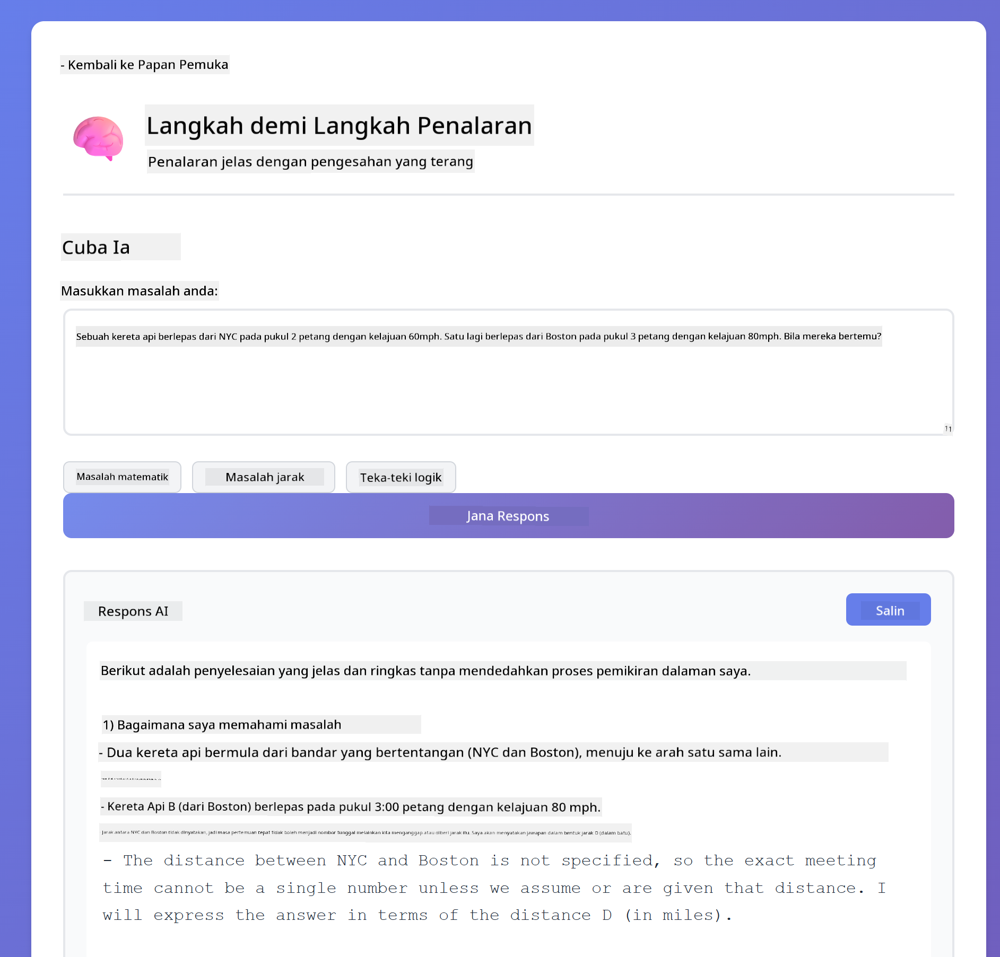

*Masalah matematik dengan langkah yang jelas*

### Output Terhad

Apabila anda memerlukan format atau bilangan perkataan tertentu, corak ini menguatkuasakan pematuhan ketat. Cuba jana ringkasan dengan tepat 100 perkataan dalam format titik peluru.


*Ringkasan pembelajaran mesin dengan kawalan format*

## Apa Yang Anda Sebenarnya Pelajari

**Usaha Penalaran Mengubah Segalanya**

GPT-5 membolehkan anda mengawal usaha pengiraan melalui arahan anda. Usaha rendah bermakna respons pantas dengan penerokaan minimum. Usaha tinggi bermakna model mengambil masa untuk berfikir dengan mendalam. Anda belajar untuk memadankan usaha dengan kerumitan tugas - jangan bazirkan masa pada soalan mudah, tetapi jangan tergesa-gesa membuat keputusan kompleks juga.

**Struktur Membimbing Tingkah Laku**

Perasan tag XML dalam arahan? Ia bukan hiasan. Model mengikuti arahan berstruktur dengan lebih boleh dipercayai daripada teks bebas. Apabila anda memerlukan proses berbilang langkah atau logik kompleks, struktur membantu model mengesan di mana ia berada dan apa yang seterusnya.


*Anatomi arahan yang berstruktur baik dengan bahagian jelas dan organisasi gaya XML*

**Kualiti Melalui Penilaian Diri**

Corak berfikir sendiri berfungsi dengan menjadikan kriteria kualiti jelas. Daripada berharap model "melakukannya dengan betul", anda memberitahunya dengan tepat apa maksud "betul": logik tepat, pengendalian ralat, prestasi, keselamatan. Model kemudian boleh menilai output sendiri dan memperbaiki. Ini menjadikan penjanaan kod dari loteri menjadi proses.

**Konteks Adalah Terhad**

Perbualan berbilang giliran berfungsi dengan memasukkan sejarah mesej dengan setiap permintaan. Tetapi ada had - setiap model mempunyai jumlah token maksimum. Apabila perbualan berkembang, anda memerlukan strategi untuk mengekalkan konteks relevan tanpa mencapai had itu. Modul ini menunjukkan bagaimana memori berfungsi; kemudian anda akan belajar bila untuk meringkaskan, bila untuk melupakan, dan bila untuk mengambil semula.

## Langkah Seterusnya

**Modul Seterusnya:** [03-rag - RAG (Penjanaan Dipertingkatkan Pengambilan)](../03-rag/README.md)

---

**Navigasi:** [← Sebelumnya: Modul 01 - Pengenalan](../01-introduction/README.md) | [Kembali ke Utama](../README.md) | [Seterusnya: Modul 03 - RAG →](../03-rag/README.md)

---

<!-- CO-OP TRANSLATOR DISCLAIMER START -->
**Penafian**:  
Dokumen ini telah diterjemahkan menggunakan perkhidmatan terjemahan AI [Co-op Translator](https://github.com/Azure/co-op-translator). Walaupun kami berusaha untuk ketepatan, sila ambil maklum bahawa terjemahan automatik mungkin mengandungi kesilapan atau ketidaktepatan. Dokumen asal dalam bahasa asalnya harus dianggap sebagai sumber yang sahih. Untuk maklumat penting, terjemahan profesional oleh manusia adalah disyorkan. Kami tidak bertanggungjawab atas sebarang salah faham atau salah tafsir yang timbul daripada penggunaan terjemahan ini.
<!-- CO-OP TRANSLATOR DISCLAIMER END -->