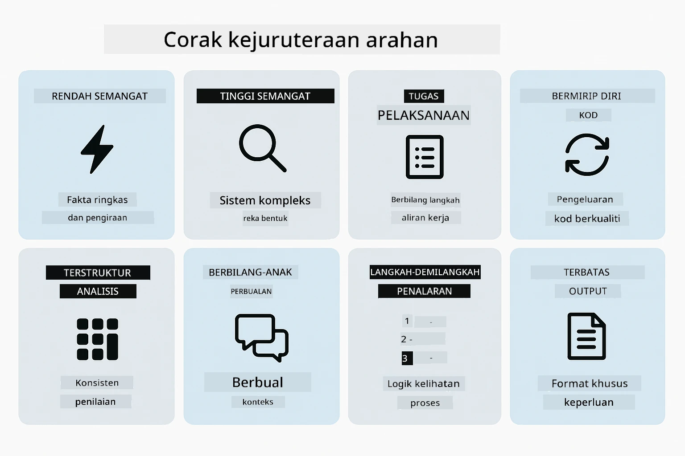
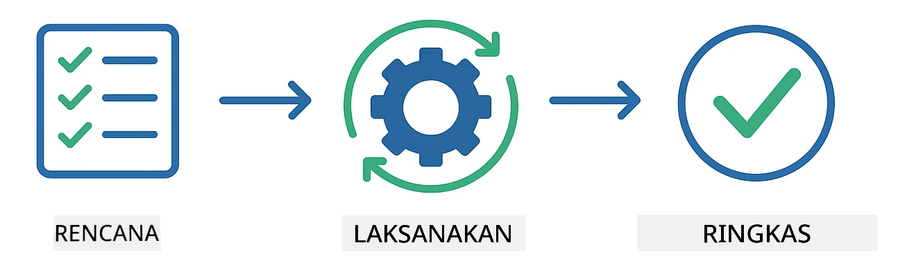
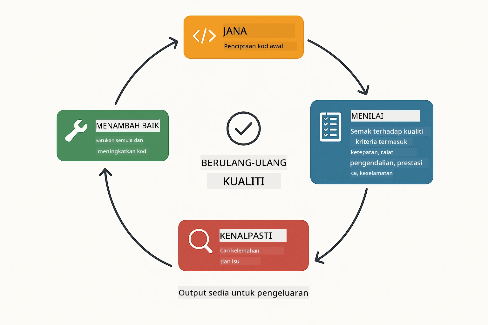
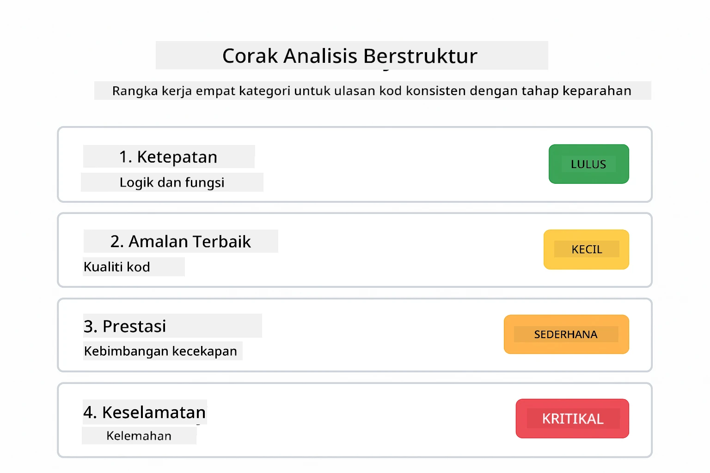
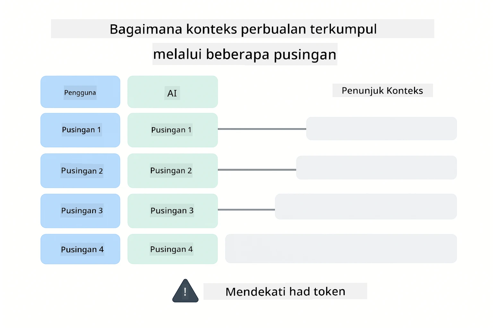
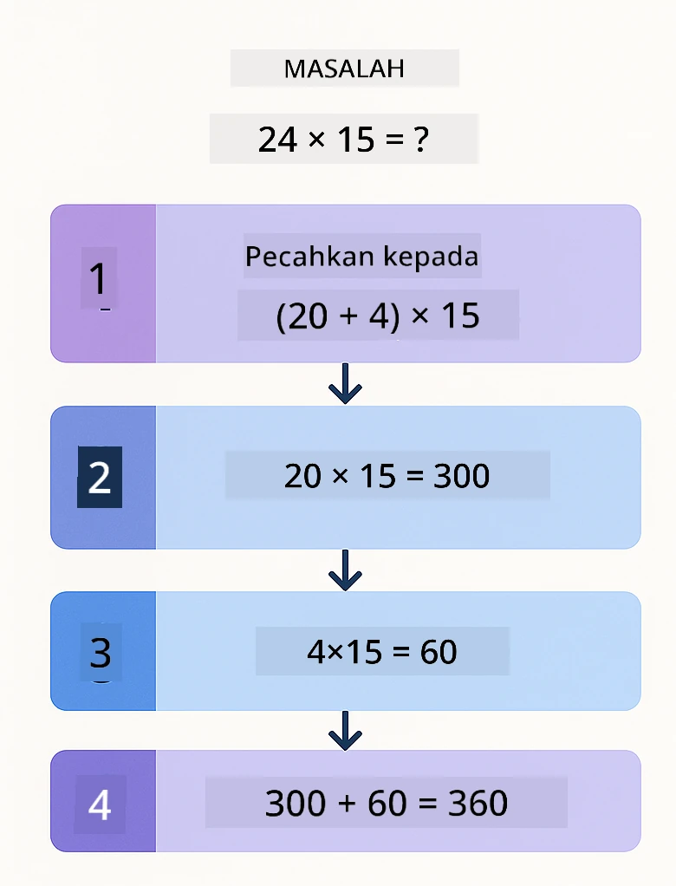
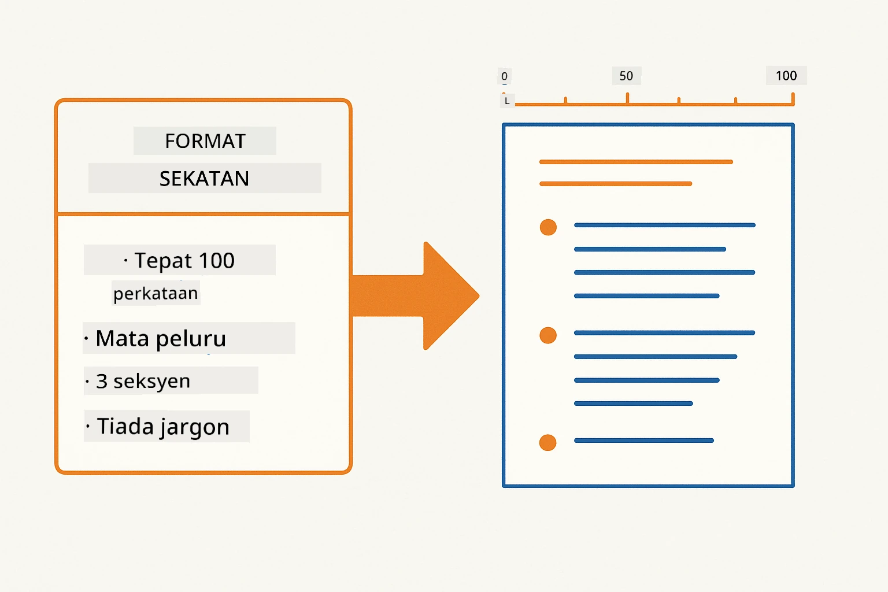
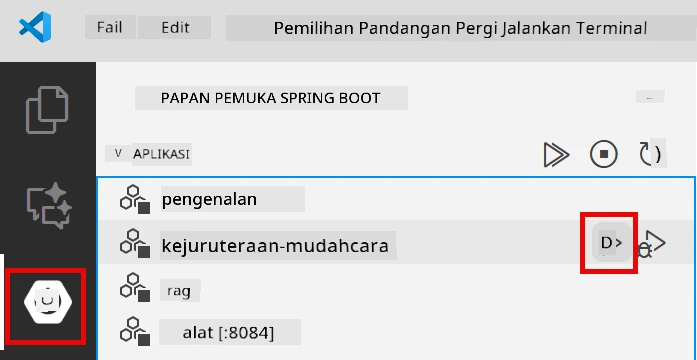
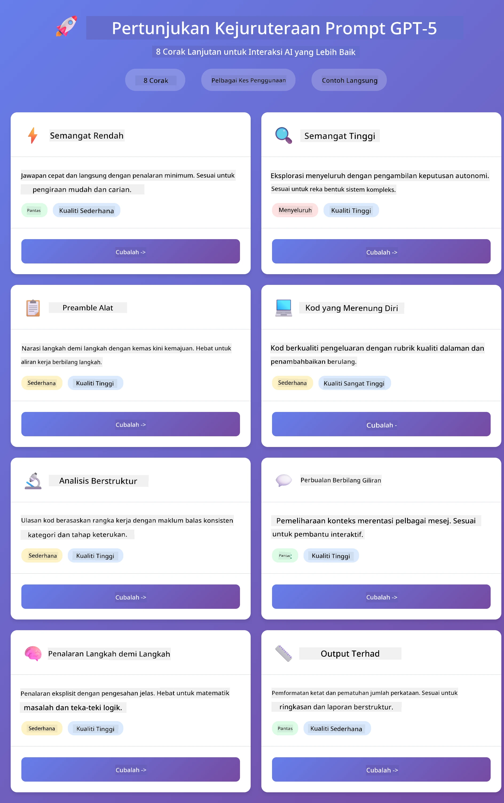
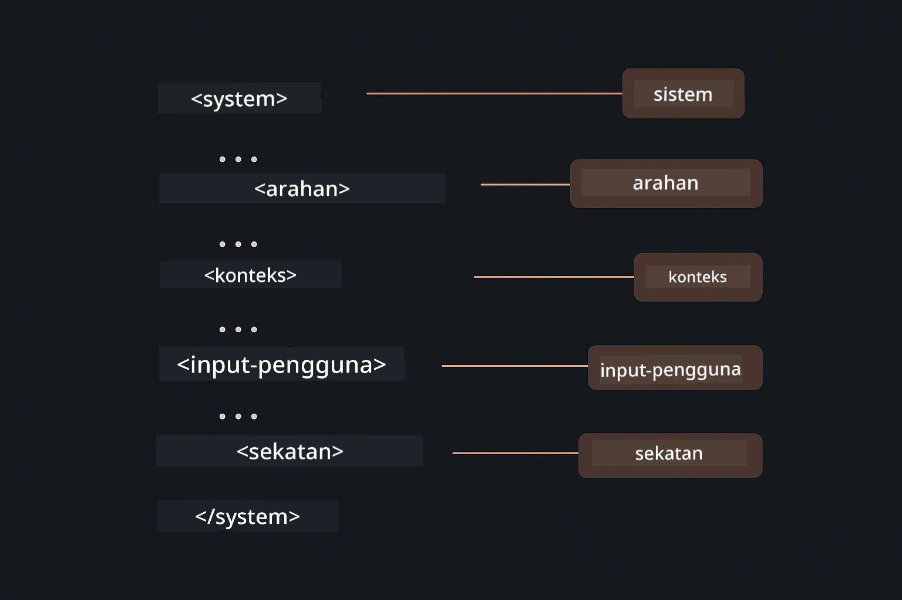

# Modul 02: Kejuruteraan Prompt dengan GPT-5.2

## Jadual Kandungan

- [Video Walkthrough](#video-walkthrough)
- [Apa yang Anda Akan Pelajari](#apa-yang-anda-akan-pelajari)
- [Prasyarat](#prasyarat)
- [Memahami Kejuruteraan Prompt](#memahami-kejuruteraan-prompt)
- [Asas Kejuruteraan Prompt](#asas-kejuruteraan-prompt)
  - [Zero-Shot Prompting](#zero-shot-prompting)
  - [Few-Shot Prompting](#few-shot-prompting)
  - [Chain of Thought](#chain-of-thought)
  - [Role-Based Prompting](#role-based-prompting)
  - [Prompt Templates](#prompt-templates)
- [Corak Lanjutan](#corak-lanjutan)
- [Jalankan Aplikasi](#jalankan-aplikasi)
- [Tangkapan Skrin Aplikasi](#tangkapan-skrin-aplikasi)
- [Meneroka Corak](#meneroka-corak)
  - [Rendah vs Tinggi Semangat](#low-vs-high-eagerness)
  - [Pelaksanaan Tugas (Preambule Alat)](#pelaksanaan-tugas-preambul-alat)
  - [Kod Refleksi Diri](#kod-refleksi-diri)
  - [Analisis Berstruktur](#analisis-berstruktur)
  - [Chat Pelbagai Giliran](#sembang-multi-turn)
  - [Penalaran Langkah demi Langkah](#pemikiran-langkah-demi-langkah)
  - [Output Terhad](#keluaran-terhad)
- [Apa yang Anda Sebenarnya Pelajari](#apa-yang-anda-sebenarnya-belajar)
- [Langkah Seterusnya](#langkah-seterusnya)

## Video Walkthrough

Tonton sesi langsung ini yang menerangkan cara memulakan modul ini:

<a href="https://www.youtube.com/live/PJ6aBaE6bog?si=LDshyBrTRodP-wke"></a>

## Apa yang Anda Akan Pelajari

Rajah berikut menyediakan gambaran keseluruhan topik utama dan kemahiran yang anda akan bangunkan dalam modul ini — daripada teknik penambahbaikan prompt hingga aliran kerja langkah demi langkah yang akan anda ikuti.


Dalam modul sebelum ini, anda melihat bagaimana memori membolehkan AI perbualan dengan Azure OpenAI. Kini kita akan fokus pada cara anda bertanya soalan — prompt itu sendiri — menggunakan GPT-5.2 Azure OpenAI. Cara anda menyusun prompt anda secara dramatik mempengaruhi kualiti jawapan yang anda peroleh. Kita mulakan dengan ulang kaji teknik prompting asas, kemudian bergerak ke lapan corak lanjutan yang memanfaatkan sepenuhnya keupayaan GPT-5.2.

Kita menggunakan GPT-5.2 kerana ia memperkenalkan kawalan penalaran - anda boleh memberitahu model berapa banyak pemikiran yang perlu dilakukan sebelum menjawab. Ini menjadikan strategi prompting yang berbeza lebih jelas dan membantu anda memahami bila untuk menggunakan setiap pendekatan.

## Prasyarat

- Modul 01 sudah selesai (sumber Azure OpenAI dipasang)
- Fail `.env` di direktori akar dengan kelayakan Azure (dicipta oleh `azd up` dalam Modul 01)

> **Nota:** Jika anda belum menyelesaikan Modul 01, ikut arahan pemasangan di sana terlebih dahulu.

## Memahami Kejuruteraan Prompt

Pada asasnya, kejuruteraan prompt adalah perbezaan antara arahan yang samar dan yang tepat, seperti yang ditunjukkan dalam perbandingan di bawah.


Kejuruteraan prompt adalah tentang mereka bentuk teks input yang sentiasa memberikan hasil yang anda perlukan. Ia bukan sahaja mengenai bertanya soalan - ia tentang struktur permintaan supaya model memahami dengan tepat apa yang anda mahu dan bagaimana untuk menyampaikannya.

Fikirkan ia seperti memberi arahan kepada rakan sekerja. "Betulkan pepijat" adalah samar. "Betulkan pengecualian null pointer dalam UserService.java baris 45 dengan menambah cek null" adalah spesifik. Model bahasa berfungsi dengan cara yang sama - kekhususan dan struktur adalah penting.

Rajah di bawah menunjukkan bagaimana LangChain4j sesuai dalam gambaran ini — menghubungkan corak prompt anda kepada model melalui blok binaan SystemMessage dan UserMessage.


LangChain4j menyediakan infrastruktur — sambungan model, memori, dan jenis mesej — manakala corak prompt hanyalah teks yang disusun dengan teliti yang anda hantar melalui infrastruktur itu. Blok binaan utama adalah `SystemMessage` (yang menetapkan kelakuan dan peranan AI) dan `UserMessage` (yang membawa permintaan sebenar anda).

## Asas Kejuruteraan Prompt

Lima teknik teras yang ditunjukkan di bawah membentuk asas kejuruteraan prompt yang berkesan. Setiap satu menangani aspek berbeza bagaimana anda berkomunikasi dengan model bahasa.


Sebelum menyelami corak lanjutan dalam modul ini, mari kita ulang kaji lima teknik prompting asas. Ini adalah blok binaan yang perlu diketahui oleh setiap jurutera prompt.

### Zero-Shot Prompting

Pendekatan paling mudah: beri model arahan langsung tanpa contoh. Model bergantung sepenuhnya pada latihannya untuk memahami dan melaksanakan tugas. Ini berkesan untuk permintaan yang mudah di mana tingkah laku yang dijangka jelas.


*Arahan langsung tanpa contoh — model membuat inferens tugas hanya dari arahan*

```java
String prompt = "Classify this sentiment: 'I absolutely loved the movie!'";
String response = model.chat(prompt);
// Respons: "Positif"
```

**Bila digunakan:** Pengelasan mudah, soalan langsung, terjemahan, atau mana-mana tugas yang model boleh kendalikan tanpa panduan tambahan.

### Few-Shot Prompting

Sediakan contoh yang menunjukkan corak yang anda mahu model ikuti. Model belajar format input-output yang dijangka dari contoh anda dan memohon pada input baru. Ini meningkatkan konsistensi dengan ketara untuk tugas di mana format atau tingkah laku yang dikehendaki tidak jelas.


*Belajar dari contoh — model mengenal pasti corak dan memohon pada input baru*

```java
String prompt = """
    Classify the sentiment as positive, negative, or neutral.
    
    Examples:
    Text: "This product exceeded my expectations!" → Positive
    Text: "It's okay, nothing special." → Neutral
    Text: "Waste of money, very disappointed." → Negative
    
    Now classify this:
    Text: "Best purchase I've made all year!"
    """;
String response = model.chat(prompt);
```

**Bila digunakan:** Pengelasan khusus, pemformatan konsisten, tugasan khusus domain, atau apabila hasil zero-shot tidak konsisten.

### Chain of Thought

Minta model menunjukkan penalarannya langkah demi langkah. Daripada terus ke jawapan, model memecahkan masalah dan bekerja melalui setiap bahagian secara eksplisit. Ini meningkatkan ketepatan pada matematik, logik, dan tugasan penalaran berbilang langkah.


*Penalaran langkah demi langkah — memecahkan masalah kompleks kepada langkah logik yang jelas*

```java
String prompt = """
    Problem: A store has 15 apples. They sell 8 apples and then 
    receive a shipment of 12 more apples. How many apples do they have now?
    
    Let's solve this step-by-step:
    """;
String response = model.chat(prompt);
// Model menunjukkan: 15 - 8 = 7, kemudian 7 + 12 = 19 epal
```

**Bila digunakan:** Masalah matematik, teka-teki logik, penyahpepijatan, atau mana-mana tugas di mana menunjukkan proses penalaran meningkatkan ketepatan dan kepercayaan.

### Role-Based Prompting

Tetapkan persona atau peranan untuk AI sebelum mengemukakan soalan anda. Ini memberi konteks yang membentuk nada, kedalaman, dan fokus jawapan. Seorang "arkitek perisian" memberikan nasihat berbeza daripada seorang "pembangun junior" atau "juruaudit keselamatan".


*Menetapkan konteks dan persona — soalan yang sama mendapat jawapan berbeza mengikut peranan yang ditetapkan*

```java
String prompt = """
    You are an experienced software architect reviewing code.
    Provide a brief code review for this function:
    
    def calculate_total(items):
        total = 0
        for item in items:
            total = total + item['price']
        return total
    """;
String response = model.chat(prompt);
```

**Bila digunakan:** Ulasan kod, pembelajaran, analisis khusus domain, atau apabila anda perlukan jawapan yang disesuaikan dengan tahap kepakaran atau perspektif tertentu.

### Prompt Templates

Buat prompt yang boleh digunakan semula dengan ruang letak pembolehubah. Daripada menulis prompt baru setiap kali, definisikan templat sekali dan isi dengan nilai berbeza. Kelas `PromptTemplate` LangChain4j memudahkan ini dengan sintaks `{{variable}}`.


*Prompt boleh guna semula dengan ruang letak pembolehubah — satu templat, banyak kegunaan*

```java
PromptTemplate template = PromptTemplate.from(
    "What's the best time to visit {{destination}} for {{activity}}?"
);

Prompt prompt = template.apply(Map.of(
    "destination", "Paris",
    "activity", "sightseeing"
));

String response = model.chat(prompt.text());
```

**Bila digunakan:** Pertanyaan berulang dengan input berbeza, pemprosesan batch, membina aliran kerja AI boleh guna semula, atau mana-mana senario di mana struktur prompt tetap sama tetapi data berubah.

---

Lima asas ini memberi anda set alat yang kukuh untuk kebanyakan tugasan prompting. Selebihnya modul ini dibina di atasnya dengan **lapan corak lanjutan** yang memanfaatkan kawalan penalaran, penilaian sendiri, dan kebolehan output berstruktur GPT-5.2.

## Corak Lanjutan

Dengan asas yang diliputi, mari beralih ke lapan corak lanjutan yang menjadikan modul ini unik. Tidak semua masalah memerlukan pendekatan yang sama. Sesetengah soalan memerlukan jawapan cepat, yang lain memerlukan pemikiran mendalam. Ada yang memerlukan penalaran yang kelihatan, ada pula hanya memerlukan keputusan. Setiap corak di bawah dioptimumkan untuk senario yang berbeza — dan kawalan penalaran GPT-5.2 menjadikan perbezaan ini lebih ketara.



*Gambaran keseluruhan lapan corak kejuruteraan prompt dan kes penggunaannya*

GPT-5.2 menambah dimensi lain kepada corak ini: *kawalan penalaran*. Peluncur di bawah menunjukkan bagaimana anda boleh laraskan usaha pemikiran model — daripada jawapan cepat dan langsung ke analisis mendalam dan teliti.


*Kawalan penalaran GPT-5.2 membolehkan anda tentukan berapa banyak pemikiran yang model harus lakukan — daripada jawapan pantas terus ke penerokaan mendalam*

**Semangat Rendah (Cepat & Fokus)** - Untuk soalan mudah di mana anda mahu jawapan pantas dan langsung. Model melakukan penalaran minimum - maksimum 2 langkah. Gunakan ini untuk pengiraan, carian, atau soalan langsung.

```java
String prompt = """
    <context_gathering>
    - Search depth: very low
    - Bias strongly towards providing a correct answer as quickly as possible
    - Usually, this means an absolute maximum of 2 reasoning steps
    - If you think you need more time, state what you know and what's uncertain
    </context_gathering>
    
    Problem: What is 15% of 200?
    
    Provide your answer:
    """;

String response = chatModel.chat(prompt);
```

> 💡 **Jelajah dengan GitHub Copilot:** Buka [`Gpt5PromptService.java`](../../../02-prompt-engineering/src/main/java/com/example/langchain4j/prompts/service/Gpt5PromptService.java) dan tanya:
> - "Apakah perbezaan antara corak prompting semangat rendah dan tinggi?"
> - "Bagaimana tag XML dalam prompt membantu menyusun jawapan AI?"
> - "Bilakah saya harus menggunakan corak refleksi diri berbanding arahan langsung?"

**Semangat Tinggi (Mendalam & Teliti)** - Untuk masalah kompleks di mana anda mahu analisis menyeluruh. Model meneroka dengan teliti dan menunjukkan penalaran terperinci. Gunakan ini untuk reka bentuk sistem, keputusan seni bina, atau penyelidikan kompleks.

```java
String prompt = """
    Analyze this problem thoroughly and provide a comprehensive solution.
    Consider multiple approaches, trade-offs, and important details.
    Show your analysis and reasoning in your response.
    
    Problem: Design a caching strategy for a high-traffic REST API.
    """;

String response = chatModel.chat(prompt);
```

**Pelaksanaan Tugas (Kemajuan Langkah demi Langkah)** - Untuk aliran kerja berbilang langkah. Model memberikan pelan awal, menceritakan setiap langkah semasa melaksanakan, kemudian memberikan ringkasan. Gunakan ini untuk migrasi, pelaksanaan, atau mana-mana proses berbilang langkah.

```java
String prompt = """
    <task_execution>
    1. First, briefly restate the user's goal in a friendly way
    
    2. Create a step-by-step plan:
       - List all steps needed
       - Identify potential challenges
       - Outline success criteria
    
    3. Execute each step:
       - Narrate what you're doing
       - Show progress clearly
       - Handle any issues that arise
    
    4. Summarize:
       - What was completed
       - Any important notes
       - Next steps if applicable
    </task_execution>
    
    <tool_preambles>
    - Always begin by rephrasing the user's goal clearly
    - Outline your plan before executing
    - Narrate each step as you go
    - Finish with a distinct summary
    </tool_preambles>
    
    Task: Create a REST endpoint for user registration
    
    Begin execution:
    """;

String response = chatModel.chat(prompt);
```

Prompt Chain-of-Thought secara jelas meminta model menunjukkan proses penalarannya, meningkatkan ketepatan untuk tugasan kompleks. Pecahan langkah demi langkah membantu manusia dan AI memahami logik.

> **🤖 Cuba dengan [GitHub Copilot](https://github.com/features/copilot) Chat:** Tanyakan tentang corak ini:
> - "Bagaimana saya menyesuaikan corak pelaksanaan tugas untuk operasi jangka panjang?"
> - "Apakah amalan terbaik untuk menyusun preambule alat dalam aplikasi produksi?"
> - "Bagaimana saya boleh menangkap dan memaparkan kemas kini kemajuan pertengahan dalam UI?"

Rajah di bawah menggambarkan aliran kerja Pelan → Laksanakan → Rumus.



*Aliran kerja Pelan → Laksanakan → Rumus untuk tugasan berbilang langkah*

**Kod Refleksi Diri** - Untuk menjana kod berkualiti produksi. Model menjana kod mengikut piawaian produksi dengan pengendalian ralat yang betul. Gunakan ini apabila membina ciri atau perkhidmatan baru.

```java
String prompt = """
    Generate Java code with production-quality standards: Create an email validation service
    Keep it simple and include basic error handling.
    """;

String response = chatModel.chat(prompt);
```

Rajah di bawah menunjukkan kitaran penambahbaikan berulang ini — jana, nilaikan, kenal pasti kelemahan, dan perbaiki sehingga kod memenuhi piawaian produksi.



*Kitaran penambahbaikan berulang - jana, nilaikan, kenal pasti isu, perbaiki, ulang*

**Analisis Berstruktur** - Untuk penilaian konsisten. Model mengulas kod menggunakan kerangka tetap (ketepatan, amalan, prestasi, keselamatan, penyelenggaraan). Gunakan ini untuk ulasan kod atau penilaian kualiti.

```java
String prompt = """
    <analysis_framework>
    You are an expert code reviewer. Analyze the code for:
    
    1. Correctness
       - Does it work as intended?
       - Are there logical errors?
    
    2. Best Practices
       - Follows language conventions?
       - Appropriate design patterns?
    
    3. Performance
       - Any inefficiencies?
       - Scalability concerns?
    
    4. Security
       - Potential vulnerabilities?
       - Input validation?
    
    5. Maintainability
       - Code clarity?
       - Documentation?
    
    <output_format>
    Provide your analysis in this structure:
    - Summary: One-sentence overall assessment
    - Strengths: 2-3 positive points
    - Issues: List any problems found with severity (High/Medium/Low)
    - Recommendations: Specific improvements
    </output_format>
    </analysis_framework>
    
    Code to analyze:
    ```
    public List getUsers() {
        return database.query("SELECT * FROM users");
    }
    ```
    Provide your structured analysis:
    """;

String response = chatModel.chat(prompt);
```

> **🤖 Cuba dengan [GitHub Copilot](https://github.com/features/copilot) Chat:** Tanyakan tentang analisis berstruktur:
> - "Bagaimana saya boleh sesuaikan kerangka analisis untuk pelbagai jenis ulasan kod?"
> - "Apakah cara terbaik untuk mengurai dan bertindak atas output berstruktur secara programatik?"
> - "Bagaimana saya pastikan tahap keterukan konsisten dalam sesi ulasan berlainan?"

Rajah berikut menunjukkan bagaimana kerangka berstruktur ini mengatur ulasan kod ke dalam kategori konsisten dengan tahap keterukan.



*Kerangka untuk ulasan kod konsisten dengan tahap keterukan*

**Chat Pelbagai Giliran** - Untuk perbualan yang memerlukan konteks. Model mengingati mesej sebelumnya dan membinanya. Gunakan ini untuk sesi bantuan interaktif atau Q&A kompleks.

```java
ChatMemory memory = MessageWindowChatMemory.withMaxMessages(10);

memory.add(UserMessage.from("What is Spring Boot?"));
AiMessage aiMessage1 = chatModel.chat(memory.messages()).aiMessage();
memory.add(aiMessage1);

memory.add(UserMessage.from("Show me an example"));
AiMessage aiMessage2 = chatModel.chat(memory.messages()).aiMessage();
memory.add(aiMessage2);
```

Rajah di bawah menggambarkan bagaimana konteks perbualan terkumpul dengan setiap giliran dan bagaimana ia berhubung dengan had token model.



*Bagaimana konteks perbualan terkumpul sepanjang banyak giliran sehingga mencapai had token*

**Penalaran Langkah demi Langkah** - Untuk masalah yang memerlukan logik yang jelas. Model menunjukkan penalaran secara eksplisit untuk setiap langkah. Gunakan ini untuk masalah matematik, teka-teki logik, atau apabila anda perlu memahami proses pemikiran.

```java
String prompt = """
    <instruction>Show your reasoning step-by-step</instruction>
    
    If a train travels 120 km in 2 hours, then stops for 30 minutes,
    then travels another 90 km in 1.5 hours, what is the average speed
    for the entire journey including the stop?
    """;

String response = chatModel.chat(prompt);
```

Rajah di bawah menunjukkan bagaimana model memecahkan masalah kepada langkah logik bernombor yang jelas.


*Memecahkan masalah menjadi langkah logik yang jelas*

**Keluaran Terhad** - Untuk respons dengan keperluan format tertentu. Model mematuhi peraturan format dan panjang dengan ketat. Gunakan ini untuk ringkasan atau apabila anda memerlukan struktur keluaran yang tepat.

```java
String prompt = """
    <constraints>
    - Exactly 100 words
    - Bullet point format
    - Technical terms only
    </constraints>
    
    Summarize the key concepts of machine learning.
    """;

String response = chatModel.chat(prompt);
```

Rajah berikut menunjukkan bagaimana kekangan membimbing model untuk menghasilkan keluaran yang mematuhi sepenuhnya keperluan format dan panjang anda.



*Melaksanakan keperluan format, panjang, dan struktur tertentu*

## Jalankan Aplikasi

**Sahkan pelaksanaan:**

Pastikan fail `.env` wujud di direktori utama dengan kelayakan Azure (dicipta semasa Modul 01). Jalankan ini dari direktori modul (`02-prompt-engineering/`):

**Bash:**
```bash
cat ../.env  # Patut menunjukkan AZURE_OPENAI_ENDPOINT, API_KEY, DEPLOYMENT
```

**PowerShell:**
```powershell
Get-Content ..\.env  # Perlu menunjukkan AZURE_OPENAI_ENDPOINT, API_KEY, DEPLOYMENT
```

**Mulakan aplikasi:**

> **Nota:** Jika anda sudah memulakan semua aplikasi menggunakan `./start-all.sh` dari direktori utama (seperti yang diterangkan dalam Modul 01), modul ini sudah berjalan di port 8083. Anda boleh langkau perintah mula di bawah dan terus ke http://localhost:8083.

**Pilihan 1: Menggunakan Spring Boot Dashboard (Disyorkan untuk pengguna VS Code)**

Bekas dev termasuk sambungan Spring Boot Dashboard, yang menyediakan antara muka visual untuk mengurus semua aplikasi Spring Boot. Anda boleh menjumpainya di Bar Aktiviti di sebelah kiri VS Code (cari ikon Spring Boot).

Dari Spring Boot Dashboard, anda boleh:
- Melihat semua aplikasi Spring Boot yang tersedia dalam ruang kerja
- Mulakan/hentikan aplikasi dengan satu klik
- Lihat log aplikasi secara masa nyata
- Pantau status aplikasi

Cuma klik butang main di sebelah "prompt-engineering" untuk memulakan modul ini, atau mula semua modul sekaligus.



*Spring Boot Dashboard dalam VS Code — mulakan, berhenti, dan pantau semua modul dari satu tempat*

**Pilihan 2: Menggunakan skrip shell**

Mulakan semua aplikasi web (modul 01-04):

**Bash:**
```bash
cd ..  # Dari direktori akar
./start-all.sh
```

**PowerShell:**
```powershell
cd ..  # Dari direktori akar
.\start-all.ps1
```

Atau mula hanya modul ini:

**Bash:**
```bash
cd 02-prompt-engineering
./start.sh
```

**PowerShell:**
```powershell
cd 02-prompt-engineering
.\start.ps1
```

Kedua-dua skrip secara automatik memuatkan pembolehubah persekitaran dari fail `.env` utama dan akan membina JAR jika ia belum wujud.

> **Nota:** Jika anda lebih suka membina semua modul secara manual sebelum mula:
>
> **Bash:**
> ```bash
> cd ..  # Go to root directory
> mvn clean package -DskipTests
> ```
>
> **PowerShell:**
> ```powershell
> cd ..  # Go to root directory
> mvn clean package -DskipTests
> ```

Buka http://localhost:8083 dalam pelayar anda.

**Untuk berhenti:**

**Bash:**
```bash
./stop.sh  # Modul ini sahaja
# Atau
cd .. && ./stop-all.sh  # Semua modul
```

**PowerShell:**
```powershell
.\stop.ps1  # Modul ini sahaja
# Atau
cd ..; .\stop-all.ps1  # Semua modul
```

## Tangkapan Skrin Aplikasi

Ini adalah antara muka utama modul kejuruteraan prompt, di mana anda boleh bereksperimen dengan semua lapan corak sebelah-menyebelah.



*Dashboard utama yang menunjukkan kesemua 8 corak kejuruteraan prompt dengan ciri dan kes guna mereka*

## Meneroka Corak

Antara muka web membolehkan anda mencuba pelbagai strategi prompting. Setiap corak menyelesaikan masalah berbeza - cuba untuk melihat bila setiap pendekatan bersinar.

> **Nota: Penstriman vs Bukan Penstriman** — Setiap halaman corak menawarkan dua butang: **🔴 Jawapan Penstriman (Langsung)** dan satu pilihan **Bukan penstriman**. Penstriman menggunakan Server-Sent Events (SSE) untuk memaparkan token secara masa nyata semasa model menjana, jadi anda melihat kemajuan dengan segera. Pilihan bukan penstriman menunggu keseluruhan jawapan sebelum memaparkannya. Untuk prompt yang memerlukan pemikiran mendalam (contohnya, High Eagerness, Kod Refleksi Diri), panggilan bukan penstriman boleh mengambil masa yang sangat lama — kadang-kadang minit — tanpa maklum balas yang ketara. **Gunakan penstriman apabila bereksperimen dengan prompt yang kompleks** supaya anda boleh melihat model berfungsi dan mengelakkan tanggapan bahawa permintaan telah tamat masa.
>
> **Nota: Keperluan Pelayar** — Ciri penstriman menggunakan Fetch Streams API (`response.body.getReader()`) yang memerlukan pelayar penuh (Chrome, Edge, Firefox, Safari). Ia **tidak** berfungsi dalam Simple Browser terbina VS Code, kerana webview-nya tidak menyokong API ReadableStream. Jika anda menggunakan Simple Browser, butang bukan penstriman masih berfungsi seperti biasa — cuma butang penstriman yang terjejas. Buka `http://localhost:8083` di pelayar luar untuk pengalaman penuh.

### Low vs High Eagerness

Tanya soalan mudah seperti "Berapakah 15% daripada 200?" menggunakan Low Eagerness. Anda akan mendapat jawapan segera dan langsung. Sekarang tanya sesuatu yang kompleks seperti "Rancang strategi cache untuk API trafik tinggi" menggunakan High Eagerness. Klik **🔴 Jawapan Penstriman (Langsung)** dan saksikan pemikiran terperinci model muncul token demi token. Model sama, struktur soalan sama - tetapi prompt memberitahu berapa banyak pemikiran yang perlu dibuat.

### Pelaksanaan Tugas (Preambul Alat)

Aliran kerja berbilang langkah mendapat manfaat daripada perancangan awal dan narasi kemajuan. Model menggariskan apa yang akan dilakukan, menceritakan setiap langkah, kemudian merumuskan hasil.

### Kod Refleksi Diri

Cuba "Cipta perkhidmatan pengesahan emel". Bukannya hanya menjana kod dan berhenti, model menjana, menilai berdasarkan kriteria kualiti, mengenal pasti kelemahan, dan memperbaiki. Anda akan melihat ia mengulangi sehingga kod memenuhi piawaian produksi.

### Analisis Berstruktur

Kajian kod memerlukan kerangka penilaian yang konsisten. Model menganalisis kod menggunakan kategori tetap (ketepatan, amalan, prestasi, keselamatan) dengan tahap keterukan.

### Sembang Multi-Turn

Tanya "Apa itu Spring Boot?" kemudian segera ikuti dengan "Tunjukkan saya contoh". Model mengingati soalan pertama anda dan memberi contoh Spring Boot khusus. Tanpa ingatan, soalan kedua itu akan terlalu samar.

### Pemikiran Langkah-demi-Langkah

Pilih masalah matematik dan cuba dengan kedua-dua Pemikiran Langkah-demi-Langkah dan Low Eagerness. Low eagerness hanya memberi jawapan - cepat tapi tidak telus. Langkah demi langkah menunjukkan setiap pengiraan dan keputusan.

### Keluaran Terhad

Apabila anda memerlukan format atau bilangan perkataan tertentu, corak ini menguatkuasakan pematuhan ketat. Cuba jana rumusan dengan tepat 100 perkataan dalam format titik peluru.

## Apa Yang Anda Sebenarnya Belajar

**Usaha Pemikiran Mengubah Segalanya**

GPT-5.2 membolehkan anda mengawal usaha pengiraan melalui prompt anda. Usaha rendah bermakna respons pantas dengan penerokaan minimum. Usaha tinggi bermakna model mengambil masa untuk berfikir secara mendalam. Anda belajar untuk memadankan usaha dengan kerumitan tugas - jangan bazir masa dengan soalan mudah, tetapi jangan tergesa-gesa dalam keputusan kompleks juga.

**Struktur Membimbing Tingkah Laku**

Perasan tag XML dalam prompt? Ia bukan hiasan. Model mengikuti arahan berstruktur dengan lebih boleh dipercayai berbanding teks bebas. Apabila anda memerlukan proses berbilang langkah atau logik kompleks, struktur membantu model menjejak lokasi dan apa yang seterusnya. Rajah di bawah memecahkan prompt berstruktur baik, menunjukkan bagaimana tag seperti `<system>`, `<instructions>`, `<context>`, `<user-input>`, dan `<constraints>` menyusun arahan anda menjadi seksyen jelas.



*Anatomi prompt berstruktur baik dengan seksyen jelas dan organisasi gaya XML*

**Kualiti Melalui Penilaian Kendiri**

Corak refleksi diri berfungsi dengan menjadikan kriteria kualiti nyata. Daripada berharap model "melakukannya dengan betul", anda beritahu apa maksud "betul": logik tepat, pengendalian ralat, prestasi, keselamatan. Model kemudian boleh menilai keluaran sendiri dan memperbaiki. Ini menjadikan penjanaan kod satu proses, bukan loteri.

**Konteks Itu Terhad**

Perbualan berbilang giliran berfungsi dengan memasukkan sejarah mesej setiap permintaan. Tapi ada had - setiap model ada had token maksimum. Apabila perbualan berkembang, anda perlukan strategi untuk mengekalkan konteks relevan tanpa melepasi had tersebut. Modul ini menunjukkan bagaimana ingatan berfungsi; kemudian anda akan belajar bila untuk meringkaskan, bila untuk melupakan, dan bila untuk mengambil semula.

## Langkah Seterusnya

**Modul Seterusnya:** [03-rag - RAG (Retrieval-Augmented Generation)](../03-rag/README.md)

---

**Navigasi:** [← Sebelum: Modul 01 - Pengenalan](../01-introduction/README.md) | [Kembali ke Utama](../README.md) | [Seterusnya: Modul 03 - RAG →](../03-rag/README.md)

---

<!-- CO-OP TRANSLATOR DISCLAIMER START -->
**Penafian**:
Dokumen ini telah diterjemahkan menggunakan perkhidmatan terjemahan AI [Co-op Translator](https://github.com/Azure/co-op-translator). Walaupun kami berusaha untuk ketepatan, sila ambil maklum bahawa terjemahan automatik mungkin mengandungi kesilapan atau ketidaktepatan. Dokumen asal dalam bahasa asalnya harus dianggap sebagai sumber yang sahih. Untuk maklumat penting, terjemahan oleh manusia profesional adalah disyorkan. Kami tidak bertanggungjawab terhadap sebarang salah faham atau salah tafsir yang timbul daripada penggunaan terjemahan ini.
<!-- CO-OP TRANSLATOR DISCLAIMER END -->