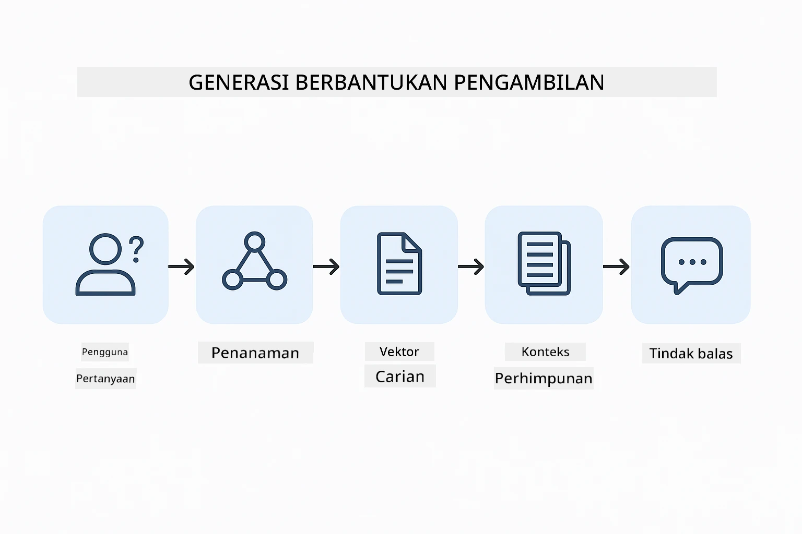
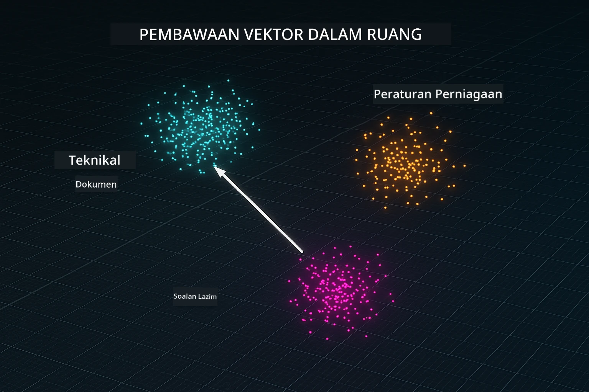
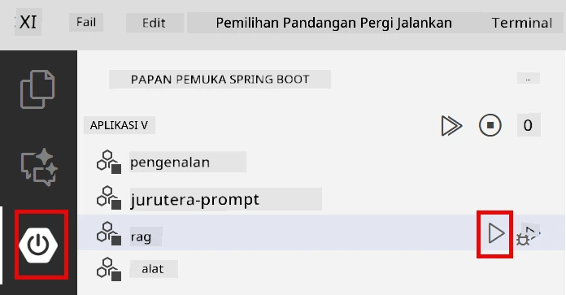
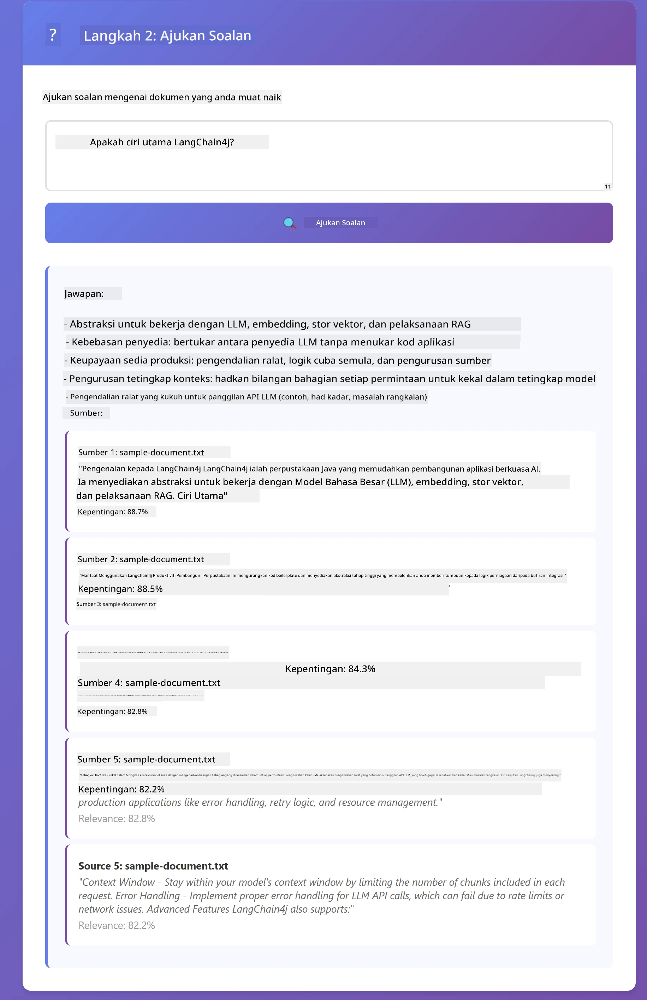

# Modul 03: RAG (Retrieval-Augmented Generation)

## Jadual Kandungan

- [Apa Yang Akan Anda Pelajari](../../../03-rag)
- [Prasyarat](../../../03-rag)
- [Memahami RAG](../../../03-rag)
- [Bagaimana Ia Berfungsi](../../../03-rag)
  - [Pemprosesan Dokumen](../../../03-rag)
  - [Mencipta Embedding](../../../03-rag)
  - [Carian Semantik](../../../03-rag)
  - [Penjanaan Jawapan](../../../03-rag)
- [Jalankan Aplikasi](../../../03-rag)
- [Menggunakan Aplikasi](../../../03-rag)
  - [Muat Naik Dokumen](../../../03-rag)
  - [Tanya Soalan](../../../03-rag)
  - [Semak Rujukan Sumber](../../../03-rag)
  - [Eksperimen dengan Soalan](../../../03-rag)
- [Konsep Utama](../../../03-rag)
  - [Strategi Pemecahan Chunk](../../../03-rag)
  - [Skor Kesamaan](../../../03-rag)
  - [Penyimpanan Dalam Memori](../../../03-rag)
  - [Pengurusan Tetingkap Konteks](../../../03-rag)
- [Kapan RAG Penting](../../../03-rag)
- [Langkah Seterusnya](../../../03-rag)

## Apa Yang Akan Anda Pelajari

Dalam modul-modul sebelum ini, anda telah belajar bagaimana untuk berbual dengan AI dan menyusun prompt anda dengan berkesan. Tetapi terdapat had asas: model bahasa hanya tahu apa yang mereka pelajari semasa latihan. Mereka tidak boleh menjawab soalan tentang polisi syarikat anda, dokumentasi projek anda, atau maklumat yang mereka tidak dilatih.

RAG (Retrieval-Augmented Generation) menyelesaikan masalah ini. Daripada cuba mengajar model maklumat anda (yang mahal dan tidak praktikal), anda memberikannya keupayaan untuk mencari dalam dokumen anda. Apabila seseorang bertanya soalan, sistem mencari maklumat yang relevan dan memasukkannya ke dalam prompt. Model kemudian menjawab berdasarkan konteks yang diperoleh itu.

Bayangkan RAG seperti memberikan model sebuah perpustakaan rujukan. Apabila anda bertanya soalan, sistem:

1. **Pertanyaan Pengguna** - Anda bertanya soalan  
2. **Embedding** - Menukar soalan anda menjadi vektor  
3. **Carian Vektor** - Mencari kepingan dokumen yang serupa  
4. **Penyusunan Konteks** - Menambah kepingan relevan ke dalam prompt  
5. **Respons** - LLM menjana jawapan berdasarkan konteks

Ini menegakkan jawapan model berdasarkan data sebenar anda dan bukan bergantung kepada pengetahuan latihannya atau mereka cerita.



*Aliran kerja RAG - dari pertanyaan pengguna ke carian semantik ke penjanaan jawapan berasaskan konteks*

## Prasyarat

- Menyelesaikan Modul 01 (Sumber Azure OpenAI sudah dideploy)  
- Fail `.env` berada di direktori root dengan kelayakan Azure (dibuat oleh `azd up` dalam Modul 01)

> **Nota:** Jika anda belum menyelesaikan Modul 01, ikut arahan deployment di sana dahulu.

## Bagaimana Ia Berfungsi

### Pemprosesan Dokumen

[DocumentService.java](../../../03-rag/src/main/java/com/example/langchain4j/rag/service/DocumentService.java)

Apabila anda memuat naik dokumen, sistem memecahkannya kepada kepingan - bahagian yang lebih kecil yang muat dengan selesa dalam tetingkap konteks model. Kepingan-kepingan ini bertindih sedikit supaya anda tidak hilang konteks di sempadan.

```java
Document document = FileSystemDocumentLoader.loadDocument("sample-document.txt");

DocumentSplitter splitter = DocumentSplitters
    .recursive(300, 30, new OpenAiTokenizer());

List<TextSegment> segments = splitter.split(document);
```
  
> **🤖 Cuba dengan [GitHub Copilot](https://github.com/features/copilot) Chat:** Buka [`DocumentService.java`](../../../03-rag/src/main/java/com/example/langchain4j/rag/service/DocumentService.java) dan tanya:  
> - "Bagaimana LangChain4j memecahkan dokumen kepada kepingan dan kenapa pertindihan penting?"  
> - "Apakah saiz kepingan optimum untuk jenis dokumen berbeza dan kenapa?"  
> - "Bagaimana saya mengendalikan dokumen dalam pelbagai bahasa atau dengan format istimewa?"

### Mencipta Embedding

[LangChainRagConfig.java](../../../03-rag/src/main/java/com/example/langchain4j/rag/config/LangChainRagConfig.java)

Setiap kepingan ditukar menjadi representasi berangka dipanggil embedding - ia adalah cap jari matematik yang menangkap makna teks. Teks yang serupa menghasilkan embedding yang serupa.

```java
@Bean
public EmbeddingModel embeddingModel() {
    return OpenAiOfficialEmbeddingModel.builder()
        .baseUrl(azureOpenAiEndpoint)
        .apiKey(azureOpenAiKey)
        .modelName(azureEmbeddingDeploymentName)
        .build();
}

EmbeddingStore<TextSegment> embeddingStore = 
    new InMemoryEmbeddingStore<>();
```
  


*Dokumen diwakili sebagai vektor dalam ruang embedding - kandungan serupa berkumpul bersama*

### Carian Semantik

[RagService.java](../../../03-rag/src/main/java/com/example/langchain4j/rag/service/RagService.java)

Apabila anda bertanya soalan, soalan anda juga menjadi embedding. Sistem membandingkan embedding soalan anda dengan semua embedding kepingan dokumen. Ia mencari kepingan dengan makna paling serupa - bukan hanya padanan kata kunci, tetapi kesamaan semantik sebenar.

```java
Embedding queryEmbedding = embeddingModel.embed(question).content();

List<EmbeddingMatch<TextSegment>> matches = 
    embeddingStore.findRelevant(queryEmbedding, 5, 0.7);

for (EmbeddingMatch<TextSegment> match : matches) {
    String relevantText = match.embedded().text();
    double score = match.score();
}
```
  
> **🤖 Cuba dengan [GitHub Copilot](https://github.com/features/copilot) Chat:** Buka [`RagService.java`](../../../03-rag/src/main/java/com/example/langchain4j/rag/service/RagService.java) dan tanya:  
> - "Bagaimana carian kesamaan berfungsi dengan embeddings dan apa yang menentukan skor?"  
> - "Apakah ambang kesamaan yang patut saya gunakan dan bagaimana ia mempengaruhi keputusan?"  
> - "Bagaimana saya mengendalikan kes di mana tiada dokumen relevan ditemui?"

### Penjanaan Jawapan

[RagService.java](../../../03-rag/src/main/java/com/example/langchain4j/rag/service/RagService.java)

Kepingan yang paling relevan disertakan dalam prompt kepada model. Model membaca kepingan khusus tersebut dan menjawab soalan anda berdasarkan maklumat itu. Ini mengelakkan halusinasi - model hanya boleh menjawab daripada apa yang ada di depan mata.

## Jalankan Aplikasi

**Sahkan deployment:**

Pastikan fail `.env` wujud di direktori root dengan kelayakan Azure (dibuat semasa Modul 01):  
```bash
cat ../.env  # Perlu menunjukkan AZURE_OPENAI_ENDPOINT, API_KEY, DEPLOYMENT
```
  
**Mulakan aplikasi:**  

> **Nota:** Jika anda sudah memulakan semua aplikasi menggunakan `./start-all.sh` dari Modul 01, modul ini sudah berjalan pada port 8081. Anda boleh lepas arahan mula di bawah dan terus ke http://localhost:8081.

**Pilihan 1: Menggunakan Spring Boot Dashboard (Disyorkan untuk pengguna VS Code)**

Kontena pembangunan termasuk sambungan Spring Boot Dashboard, yang menyediakan antara muka visual untuk mengurus semua aplikasi Spring Boot. Ia terdapat di Bar Aktiviti di sebelah kiri VS Code (cari ikon Spring Boot).

Dari Spring Boot Dashboard, anda boleh:  
- Melihat semua aplikasi Spring Boot yang tersedia dalam workspace  
- Mulakan/hentikan aplikasi dengan satu klik  
- Lihat log aplikasi secara masa nyata  
- Pantau status aplikasi  

Klik butang main di sebelah "rag" untuk mulakan modul ini, atau mula semua modul sekali.



**Pilihan 2: Menggunakan skrip shell**

Mulakan semua aplikasi web (modul 01-04):

**Bash:**  
```bash
cd ..  # Dari direktori akar
./start-all.sh
```
  
**PowerShell:**  
```powershell
cd ..  # Dari direktori root
.\start-all.ps1
```
  
Atau mulakan modul ini sahaja:

**Bash:**  
```bash
cd 03-rag
./start.sh
```
  
**PowerShell:**  
```powershell
cd 03-rag
.\start.ps1
```
  
Kedua-dua skrip secara automatik memuat pembolehubah persekitaran dari fail `.env` root dan akan bina JAR jika belum wujud.

> **Nota:** Jika anda lebih suka bina semua modul secara manual sebelum mula:  
>  
> **Bash:**  
> ```bash
> cd ..  # Go to root directory
> mvn clean package -DskipTests
> ```
  
> **PowerShell:**  
> ```powershell
> cd ..  # Go to root directory
> mvn clean package -DskipTests
> ```
  
Buka http://localhost:8081 dalam pelayar anda.

**Untuk berhenti:**

**Bash:**  
```bash
./stop.sh  # Modul ini sahaja
# Atau
cd .. && ./stop-all.sh  # Semua modul
```
  
**PowerShell:**  
```powershell
.\stop.ps1  # Modul ini sahaja
# Atau
cd ..; .\stop-all.ps1  # Semua modul
```


## Menggunakan Aplikasi

Aplikasi menyediakan antara muka web untuk muat naik dokumen dan bertanya.

<a href="images/rag-homepage.png"></a>

*Antara muka aplikasi RAG - muat naik dokumen dan tanya soalan*

### Muat Naik Dokumen

Mulakan dengan memuat naik dokumen - fail TXT sesuai untuk ujian. Fail `sample-document.txt` disediakan dalam direktori ini yang mengandungi maklumat tentang ciri LangChain4j, pelaksanaan RAG, dan amalan terbaik - sesuai untuk menguji sistem.

Sistem memproses dokumen anda, memecahkannya kepada kepingan, dan mencipta embedding untuk setiap kepingan. Ini berlaku secara automatik apabila anda memuat naik.

### Tanya Soalan

Sekarang tanya soalan spesifik tentang kandungan dokumen. Cuba sesuatu yang fakta yang jelas dinyatakan dalam dokumen. Sistem mencari kepingan relevan, memasukkannya dalam prompt, dan menjana jawapan.

### Semak Rujukan Sumber

Perhatikan setiap jawapan disertakan dengan rujukan sumber bersama skor kesamaan. Skor ini (0 hingga 1) menunjukkan betapa relevannya setiap kepingan dengan soalan anda. Skor yang lebih tinggi bermaksud padanan lebih baik. Ini membolehkan anda mengesahkan jawapan dengan bahan sumber.

<a href="images/rag-query-results.png"></a>

*Keputusan pertanyaan menunjukkan jawapan dengan rujukan sumber dan skor relevansi*

### Eksperimen dengan Soalan

Cuba jenis soalan berbeza:  
- Fakta spesifik: "Apakah topik utama?"  
- Perbandingan: "Apakah perbezaan antara X dan Y?"  
- Rumusan: "Ringkaskan perkara utama tentang Z"

Perhatikan bagaimana skor relevansi berubah bergantung pada sejauh mana soalan anda sepadan dengan kandungan dokumen.

## Konsep Utama

### Strategi Pemecahan Chunk

Dokumen dibahagikan kepada kepingan 300 token dengan 30 token pertindihan. Keseimbangan ini memastikan setiap kepingan mempunyai konteks mencukupi untuk bermakna sambil kekal cukup kecil untuk memuatkan beberapa kepingan dalam satu prompt.

### Skor Kesamaan

Skor bermula dari 0 hingga 1:  
- 0.7-1.0: Sangat relevan, padanan tepat  
- 0.5-0.7: Relevan, konteks baik  
- Di bawah 0.5: Ditapis keluar, terlalu tidak serupa

Sistem hanya mengambil kepingan di atas ambang minimum untuk memastikan kualiti.

### Penyimpanan Dalam Memori

Modul ini menggunakan penyimpanan dalam memori untuk kesederhanaan. Apabila anda mulakan semula aplikasi, dokumen yang dimuat naik hilang. Sistem produksi menggunakan pangkalan data vektor persisten seperti Qdrant atau Azure AI Search.

### Pengurusan Tetingkap Konteks

Setiap model ada tetingkap konteks maksimum. Anda tidak boleh masukkan setiap kepingan dari dokumen besar. Sistem mengambil N kepingan paling relevan tertinggi (default 5) untuk kekal dalam had sambil menyediakan konteks mencukupi untuk jawapan tepat.

## Kapan RAG Penting

**Gunakan RAG apabila:**  
- Menjawab soalan tentang dokumen proprietari  
- Maklumat sering berubah (polisi, harga, spesifikasi)  
- Ketepatan memerlukan atribusi sumber  
- Kandungan terlalu besar untuk dimuat dalam satu prompt  
- Anda perlukan jawapan yang boleh disahkan dan berasaskan fakta

**Jangan gunakan RAG apabila:**  
- Soalan memerlukan pengetahuan umum yang sudah diketahui model  
- Data masa nyata diperlukan (RAG berfungsi pada dokumen yang dimuat naik)  
- Kandungan cukup kecil untuk dimasukkan terus dalam prompt

## Langkah Seterusnya

**Modul Seterusnya:** [04-tools - Agen AI dengan Alat](../04-tools/README.md)

---

**Navigasi:** [← Sebelumnya: Modul 02 - Kejuruteraan Prompt](../02-prompt-engineering/README.md) | [Kembali ke Utama](../README.md) | [Seterusnya: Modul 04 - Alat →](../04-tools/README.md)

---

<!-- CO-OP TRANSLATOR DISCLAIMER START -->
**Penafian**:  
Dokumen ini telah diterjemahkan menggunakan perkhidmatan terjemahan AI [Co-op Translator](https://github.com/Azure/co-op-translator). Walaupun kami berusaha untuk ketepatan, sila ambil perhatian bahawa terjemahan automatik mungkin mengandungi kesilapan atau ketidaktepatan. Dokumen asal dalam bahasa asalnya harus dianggap sebagai sumber yang sahih. Untuk maklumat yang kritikal, terjemahan profesional oleh manusia adalah disyorkan. Kami tidak bertanggungjawab atas sebarang salah faham atau salah tafsir yang timbul daripada penggunaan terjemahan ini.
<!-- CO-OP TRANSLATOR DISCLAIMER END -->